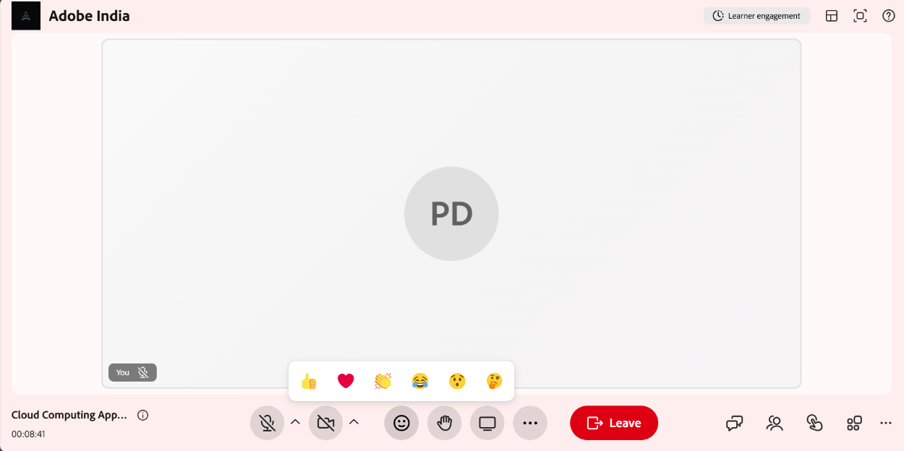

# リアクションと挙手を使用する

学習者は、リアクションと両手を上げて、プレゼンターの作業を中断することなくセッションに参加できます。 どちらのオプションもセッションコントロールバーから使用でき、インストラクターや他のユーザーとのコミュニケーションに役立ちます
リアルタイムで参加者に通知します。

## セッションで手を挙げてください

コントロールバーの&#x200B;**挙手**&#x200B;オプションを使用すると、参加者は、セッション中に話すか質問するかを伝えるシグナルを受けることができます。 手を上げるには、コントロールバーからを選択します。 上げた手はインストラクターに表示され、**出席者**&#x200B;リストに表示されます。

手を下げるには、セッションコントロールからもう一度選択します。 挙手インジケーターが出席者リストから削除されます。

## リアクションを送信

リアクションを使用すると、セッション中に口頭ではなく迅速にフィードバックを得ることができます。

リアクションを送信するには：

1. コントロールバーからを選択します。

   
   *コントロールバーからリアクションを選択します。*

1. 次のいずれかのリアクションを選択します。

   1. 上向きの親指
   1. ハート
   1. 拍手
   1. 笑い
   1. 驚き
   1. 思考

   選択したリアクションは、セッションのすべての出席者に表示されます。
