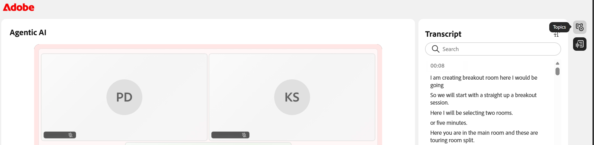
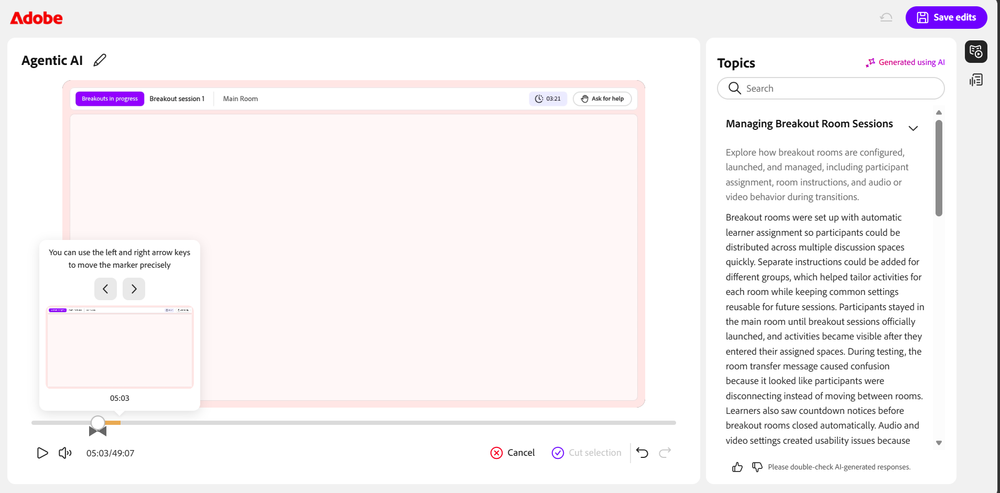

# セッションの記録

インストラクターは、セッションのキャプチャ、改善、共有の方法を完全に制御できます。 ライブセッション中に録画を開始し、実行中に管理できます。また、セッションが終了したら、自動的に生成されたトピック、概要、トランスクリプトを確認できます。

セッションのキャプチャだけでなく、録音を編集して不要なセクションを削除したり、クローズドキャプションや文字起こしを有効にしたりできます。 次のセクションでは、これらの各アクションについて詳しく説明します。

>[!NOTE]
>
>セッションを記録すると、メインセッションのみが記録に含まれます。 参加者がブレークアウトルームに移動すると録画は自動的に一時停止し、全員がメインセッションに戻ると録画が再開されます。 その結果、ブレイクアウトルームのアクティビティは記録されません。

## セッションの記録

1. **その他のアクション**&#x200B;メニューに移動します。

1. **録画を開始**&#x200B;を選択します。  「**セッションが記録中**」であることを示す確認ポップアップが表示されます。

   
   *その他のアクションメニューから[記録]を選択して、セッションのキャプチャを開始します。*

## 録画を停止、一時停止、再開する

セッションの記録中は、バーチャルクラスルームの上部に記録インジケーターが表示されます。 録音を開始、停止、再開できます。

### 録画を停止

1. 記録インジケーターを選択します。  ポップアップウィンドウが開き、アクションを記録できます。

   
   *録画中は、[進行中の録画]オプションを使用してセッションを一時停止または停止してください。*

1. 「**録画を停止**」を選択します。  セッションが記録されていないことを示す確認メッセージが表示されます。

### 録画を一時停止

録画を一時停止するには：

1. 記録インジケーターを選択します。

1. **録画を一時停止**&#x200B;を選択します。  確認メッセージが表示され、「**録音と文字起こしを一時停止しました**」と表示されます。

### 録画を再開

録画を一時停止すると、録画を再開するオプションが表示されます。 **録画を再開**&#x200B;を選択して、一時停止した録画を続行します。

*一時停止すると、「録画を一時停止」オプションを使用して、録画を再開または停止できます。*

## 録画にアクセス

記録されたセッションは、各セッションの&#x200B;**セッションの概要**&#x200B;ページで利用できます。 ここから、録音を再生したり、編集モードで開いて、タイムラインや文字起こしを調整したりできます。

録画にアクセスするには：

1. 必要なコースに移動し、セッションを開きます。

1. **セッションの概要**&#x200B;ページで&#x200B;**ライブハブ**&#x200B;セクションまでスクロールします。

1. **録画を表示**&#x200B;カードで、次のいずれかの操作を行います。

   * **録画を表示**&#x200B;を選択して、録画を再生モードで開きます。

   * **編集**&#x200B;を選択して、記録を編集モードで開きます。

   
   *レコーディングを再生または編集する[ライブハブ]セクションのレコーディングカードを表示します。*

## 録音を再生する

「録画を表示」を選択すると、録画プレーヤーで録画が開きます。 プレーヤーには、セッションビデオ、参加者のサムネール、トランスクリプトが表示されます。

レコーディングを再生するには：

1. **セッションの概要**&#x200B;ページに移動します。

1. **ライブハブ**&#x200B;セクションから&#x200B;**録画を表示**&#x200B;を選択します。  録音が再生モードで開きます。

   
   *レコーディングプレーヤーは再生モードにあり、セッションビデオと文字起こしパネルを表示しています。*

1. 次の再生コントロールを使用して、表示エクスペリエンスを調整します。

| **コントロール** | **説明** |
|----|----|
| 再生または一時停止 | 再生を開始または一時停止します。 |
| 音量 | オーディオレベルを調整します。 |
| 進行状況バー | ドラッグして、記録内の特定のポイントに移動します。 コントロールの横に経過時間と合計時間が表示されます。 |
| 再生スピード | 再生を遅くしたり速くしたりします。 利用可能なオプションは、**0.25x**、**0.5x**、**0.75x**、**1x**、**1.25x**、**1.5x**、および&#x200B;**2x**&#x200B;です。 |
| CC（クローズドキャプション） | 再生中にクローズドキャプションのオンとオフを切り替えます。 キャプションをカスタマイズするには、「CC」ボタンの横にある矢印を選択します。 フォントサイズを&#x200B;**小**、**中**、または&#x200B;**大**&#x200B;から選択し、キャプションのスタイルを&#x200B;**白に黒**、黒に&#x200B;**黄色**、**黒に白**、**黄色に暗い**、または&#x200B;**青に黄色**&#x200B;から選択します。 |
| 全画面表示 | 録音プレーヤーを展開します。 |

## 記録中にトピックを生成

トピックは、セッションディスカッションの流れに基づいて、録音を意味のあるセクションに自動的に分割します。 長い録音を整理し、ナビゲーションを改善するのに役立ちます。 また、キーワードを使用してトピックを検索すると、記録の関連するセクションにすばやく移動できます。

## 記録中のトピックの表示

生成されたトピックは、参照したり移動したりできます。 トピックは、**AIを使用して生成された**&#x200B;としてマークされます。 AIが生成した回答は再確認する必要があるため、コンテンツを確認してください。

トピックを表示して移動するには、次の手順に従います。

1. **トピック**&#x200B;パネルで、トピックのリストを参照するか、**検索**&#x200B;ボックスを使用してキーワードを使用してトピックを検索します。

1. トピックを選択して展開し、概要、詳細、合計時間を表示します。

1. **[トピックの再生]**&#x200B;を選択します。  選択したトピックセクションから録音が開始されます。

   
   *トピックパネル。AIが生成したトピックが記録のナビゲーションに役立ちます。*

## 文字起こしを表示

文字起こしでは、セッションのタイムスタンプ付きテキストバージョンが提供され、録音と一緒に読むことができます。 各項目には、話者の名前とテキストが話された時刻が含まれます。

トランスクリプトを表示するには、次の手順を実行します。

1. プレーヤーの右側で、パネルから「**文字起こし**」アイコンを選択すると、切り替えが切り替わります。  **文字起こし**&#x200B;パネルが開き、タイムスタンプされた文字起こしが表示されます。

1. （オプション）「**検索**」ボックスを使用して、文字起こし内の特定の単語または語句を検索します。

録音の特定の部分に移動するには、トランスクリプトエントリを選択します。 録音は対応するタイムスタンプにジャンプし、その時点から再生が開始されます。

*文字起こしパネル。各エントリが記録内のポイントにリンクします。*

### 文字起こしテキストのサイズの変更

文字起こしテキストのサイズを調整して、読みやすくすることができます。

テキストサイズを変更するには：

1. **文字起こし**&#x200B;パネルで、**文字起こし**&#x200B;見出しの横にある&#x200B;**テキストサイズ**&#x200B;アイコンを選択します。

1. リストからテキストサイズを選択します。 使用可能なサイズは、12、14、16、18、20、24、30、および36です。 デフォルトサイズは14です。 文字起こしテキストが、選択したサイズに更新されます。

   ![[文字起こしテキストサイズ]オプション](assets/transcript-text-size-option.png)
   *エントリを読みやすくするために、文字起こしテキストのサイズを選択します。*

## 録画を編集

ライブハブで録画を編集すると、学習者と共有する前にコンテンツを調整できます。 タイムラインをトリミングして不要なセクションを削除し、明瞭度を上げることができます。 編集を加えても、保存するまで元の録音は変更されません。

録画を編集するには：

1. **セッションの概要** > **ライブハブ** > **録画を表示**&#x200B;に移動し、**編集**&#x200B;を選択します。  録音が編集モードで開きます。

1. （オプション）記録の名前を変更するには、記録タイトルの横にある&#x200B;**編集（鉛筆）**&#x200B;アイコンを選択し、新しい名前を入力します。

1. レコーディングプレーヤーの下部にある&#x200B;**タイムラインの編集**&#x200B;を選択します。  記録タイムラインにドラッグ可能なプログレスバーが表示されます。

1. プログレスバーにマーカーを置いて、削除するセグメントを選択します。

1. マーカーをドラッグするか、左右の矢印キーを使用して正確に移動します。 プレビューサムネールとタイムスタンプが、正確なポイントを見つけるのに役立ちます。

   
   *マーカーを配置して、削除するタイムラインセグメントを選択します。*

1. **選択範囲を切り取り**&#x200B;を選択します。 録音の選択したセクションが削除されます。

1. （オプション） **取り消し**&#x200B;または&#x200B;**やり直し**&#x200B;を使用して操作を元に戻すか再適用するか、**キャンセル**&#x200B;を選択して現在の選択範囲を破棄します。

1. **編集内容を保存**&#x200B;を選択します。  変更が録音に適用されます。

   
   *選択範囲を切り取ると、編集内容の保存がアクティブになり、変更を適用できます。*

**セッションダッシュボード**&#x200B;からレコーディングを編集することもできます。 詳細については、[セッションダッシュボードのコンポーネント](../getting-started-with-live-hub/components-of-the-session-dashboard.md#recordings)を参照してください。

## トピックを再生成

レコーディングのタイムラインを編集すると、既存のトピックが更新されたレコーディングと一致しなくなります。 トピックを再生成して、新しいタイムラインとの同期を維持できます。

トピックを再生成するには：

1. プレーヤーの右側で、パネルから&#x200B;**トピック**&#x200B;アイコンを選択して切り替えます。  トピックパネルが表示されます。

1. **再生成**&#x200B;を選択します。  トピックの識別中に&#x200B;**トピックの生成**&#x200B;メッセージが表示されます。 トピックの特定には時間がかかることがあります。

   
   *タイムラインの編集後、プロンプトを使用して記録と同期したトピックを再生成してください。*

## 元に戻す

すべての編集内容を破棄して、録音を元の状態に復元する場合は、「元に戻す」オプションを使用します。

元の録音に戻すには、次の手順を実行します。

1. プレーヤーの上部にある&#x200B;**元に戻す**&#x200B;アイコンを選択します。  **元に戻す**&#x200B;確認ポップアップが表示されます。

   
   *元の状態に戻すと、確認のポップアップに警告が表示され、元に戻すことはできません。*

1. **[元に戻す]**&#x200B;を選択します。 これにより、録音および文字起こしに加えられたすべての変更が取り消されます。 この操作は元に戻すことができません。元に戻すことはできません。

1. （オプション）元に戻さない場合は、[**キャンセル**]を選択します。

## 録画をダウンロード

録画をダウンロードしてオフラインでアクセスしたり、プラットフォーム外で共有したりできます。

録画のダウンロードはセッションダッシュボードから管理されます。 詳細については、[セッションダッシュボードのコンポーネント](./components-of-the-session-dashboard.md)を参照してください。
