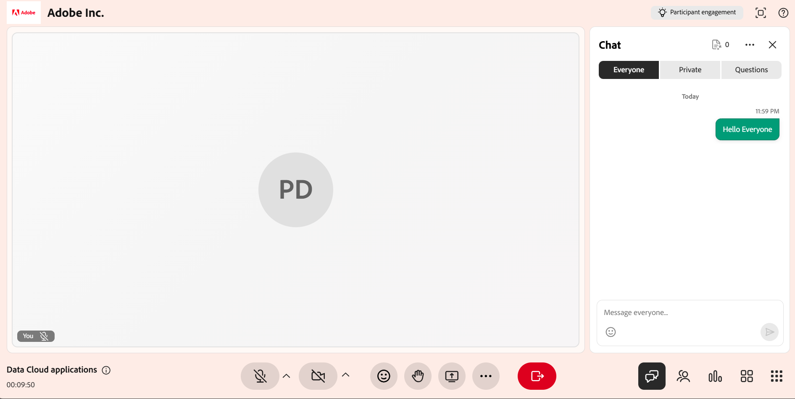

# インストラクターとしてチャットパネルを使用する

インストラクターは、ライブハブセッション中のコミュニケーションを管理するために、チャットパネルを利用できます。 1つのパネルから、パブリックディスカッションをフォローしたり、プライベートな会話を行ったり、AIがチャットから検出した質問を確認したりできます。 また、会話をモデレートし、AIの支援を得て対応することもできます。

この記事では、チャットパネルのインストラクターが使用できるアクションについて説明します。パネルへのアクセスからメッセージや設定の管理に至るまで説明します。

## チャットパネルへのアクセス

チャットパネルを使用して、会話の管理、学習者への応答、セッション中の質問の監視を行います。 このパネルでは、パブリック、プライベート、および質問ベースのディスカッションに1か所でアクセスできます。

チャットパネルにアクセスするには、次の手順に従います。

1. ライブハブセッションに参加します。

1. コントロールバーからを選択します。 チャットパネルが開き、デフォルトで&#x200B;**Everyone**&#x200B;タブが選択されているため、進行中の会話を開始したり、参加したりできます。

1. 必要に応じて、次のいずれかを選択します。

   1. 全員

   1. プライベート

   1. 質問

   
   *チャットパネルが開き、すべてのユーザーのタブが表示されます。このタブで、公開会話をフォローしたり、プライベートタブや質問タブに切り替えたりすることができます。*

1. メッセージを入力し、[**送信**]を選択します。

## チャットパネルの設定

チャットパネルには、セッション中の会話を管理し、チャットエクスペリエンスをカスタマイズするためのオプションが用意されています。 必要に応じて、メッセージのクリア、通知の制御、テキストサイズの調整を行うことができます。

*チャットパネルの設定メニュー。*

次のオプションは、チャットパネル設定から使用できます。

| **オプション** | **説明** |
|----|----|
| **すべてのチャットをクリア** | チャットパネルからすべてのメッセージを削除します。 |
| **チャット通知を無効にする** | セッションのチャット通知をオフにします。 |
| **テキストサイズ** | チャットメッセージのサイズを調整して読みやすくします。 使用可能なオプションは、**小**、**中**、**大**&#x200B;です。 |

## チャットメッセージへの返信

返信機能を使用すると、特定のメッセージに直接返信できるため、ディスカッション中にコンテキストを維持し、会話に従いやすくなります。

チャットでメッセージに返信するには、次の手順を実行します。

1. 返信するメッセージにカーソルを合わせます。

1. 「**返信**」を選択します。

   
   *[メッセージに対して返信]を選択すると、メッセージに直接返信して、会話のコンテキストを維持することができます。*

1. メッセージ入力フィールドに回答を入力します。

1. 「**送信**」を選択します。

返信には、返信と一緒に元のメッセージのスニペットが表示され、参加者は会話のコンテキストを理解するのに役立ちます。

### メッセージに反応する

メッセージに返信して、返信を入力せずにすばやく確認または応答することもできます。 メッセージにカーソルを合わせて、リアクションを選択します。 選択したリアクションがメッセージの下に表示され、チャットの他の参加者に表示されます。

*メッセージの下にリアクションが表示され、チャットの全員がリアクションを見ることができます。*

## チャットメッセージの編集

メッセージの編集機能を使用すると、送信後にメッセージを更新して、応答の修正や絞り込みに役立てることができます。

チャットでメッセージを編集するには、次の手順を実行します。

1. 編集するメッセージにカーソルを合わせます。

1. 「**編集**」を選択します。

   
   *既に送信したメッセージを更新するには、[編集]を選択します。*

1. 入力フィールドのメッセージを更新します。

1. **[保存]**&#x200B;を選択して変更を適用するか、**[キャンセル]**&#x200B;を選択して変更を破棄します。

更新されたメッセージは、チャット内の元のメッセージを置き換え、**編集済み**&#x200B;としてマークされます。

## チャットメッセージでの参加者へのメンション

チャットパネルのタグ付け機能を使用すると、セッション中に特定の学習者に直接アドレスを設定できます。 タグを使用すると、メッセージに注意が引き付けられ、特にアクティブな掲示板でメンションを行う学習者の視認性が向上します。

チャットで学習者にメンションするには：

1. メッセージ入力フィールドに「**@**」と入力します。

1. リストから参加者の名前を選択します。

   
   *参加者のリストに入力するには、@と入力し、リストから名前を選択します。*

1. メッセージを入力します。

1. 「**送信**」を選択します。

タグ付けされた学習者が通知を受け取り、視認性を高めるためにメッセージで名前がハイライト表示されます。

## プライベートチャットを開始

チャットパネルの[**プライベート**]タブでは、公開されているディスカッションを中断することなく、プライベートメッセージを使用できます。 新しいチャットの開始、既存の会話の継続、特定の学習者とのコミュニケーションが可能です。

プライベートチャットを開始するには：

1. 「**プライベート**」タブを選択します。 参加者のリストが表示されます。

   
   *「非公開」タブには参加者が一覧表示され、インストラクターのみまたは個々の学習者のみにメッセージを送信できます。*

1. 次の操作を実行できます。

   1. リストの一番上で「**インストラクターのみ**」を選択すると、他のインストラクターにメッセージが送信されます。 メッセージはインストラクターにのみ表示されます。

   1. 個々の学習者を選択して、プライベート会話を開始します。

1. メッセージを入力し、[**送信**]を選択します。 メッセージは、自分と選択した参加者にのみ表示されます。

### 学習者の非公開チャットを無効にする

デフォルトでは、学習者は他の参加者と非公開でチャットできます。 インストラクターは、セッション中に学習者がプライベートチャットを使用できるかどうかを制御できます。

学習者の非公開チャットを無効にするには：

1. **会議室の設定**&#x200B;を開きます。

1. **参加者のアクセス許可**&#x200B;を選択します。

   
   *学習者が非公開でチャットできないようにするには、[参加者のアクセス許可でプライベートメッセージを送信する]をオフにします。*

1. **プライベートメッセージの送信**&#x200B;を無効にします。

1. 「**完了**」を選択します。

無効にすると、学習者はプライベート会話を開始したり、参加したりできなくなります。

## AIを使用した参加者の質問に対するドラフトの返信

「**質問**」タブは、インストラクターが学習者の質問をより効率的に管理および対応するのに役立ちます。 AIは、チャットからの質問を自動的に検出し、セッション中にインストラクターを支援するための推奨回答を提供します。

AIを使用した返信を生成するには：

1. 「**質問**」タブに移動します。

1. 検出された質問にカーソルを合わせます。

1. **AIを使用した下書きの返信**&#x200B;を選択します。

   
   *AIを使用して下書きの返信を選択し、検出された質問に対する推奨の回答を生成します。*

1. （オプション）提案された回答を確認して編集します。

1. 「**送信**」を選択します。

AIが生成した返信はチャットに追加され、送信前に変更して、正確性と適合性を確保できます。

>[!NOTE]
>質問がアップロードされた参照コンテンツの対象でない場合、AIアシスタントは回答を生成する代わりにエラーメッセージを表示することがあります。 詳細については、[Live Hubのトラブルシューティングガイド](../kb/troubleshooting-guide-for-live-hub.md#answer-generation-toast-issues)を参照してください。

### ファイルをアップロードして返答を改善

また、参照ファイルをアップロードして、AIが生成した応答の精度と妥当性を向上させることもできます。

ファイルをアップロードするには：

1. チャットパネルの右上隅に移動します。

   
   *[コンテンツ参照のアップロード]を開いて、AIがより正確な応答を生成するのに役立つファイルを追加します。*

1. **[コンテンツ参照のアップロード]**&#x200B;を選択します。 **QnA参照コンテンツ**&#x200B;のポップアップウィンドウが表示されます。

1. **ファイルの参照**&#x200B;を選択します。

   
   *QnA参照コンテンツウィンドウの[ファイルの参照]を選択して、システムから参照ファイルをアップロードします。*

1. システムからファイルをアップロードします。

AIはアップロードされたコンテンツを使用して、「**すべてのユーザー**」タブの質問に対し、より正確で適切な回答を生成します。

>[!NOTE]
>アップロードに失敗するか、ファイルが拒否された場合、一般的なエラーメッセージの一覧とそれらの解決方法については、[Live Hubのトラブルシューティングガイド](../kb/troubleshooting-guide-for-live-hub.md#upload-content-issues)を参照してください。

## メッセージの削除

メッセージを削除するオプションを使用すると、チャットからメッセージを削除して、ディスカッションに集中して関連性を保つことができます。 トピックに関連しない、またはディスカッションを混乱させる独自のメッセージを削除できます。

*自分のメッセージを削除して、ディスカッションの焦点を絞り、関連性を保ちます。*
