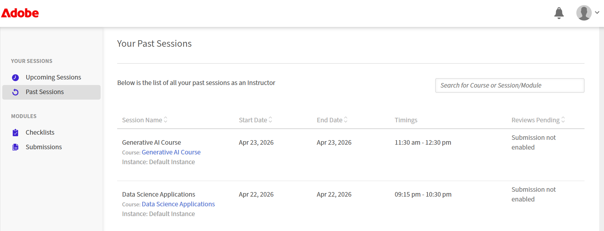

# セッションダッシュボードを表示

Live Hubのセッションダッシュボードには、学習者の参加、エンゲージメント、セッションのパフォーマンスに関するインサイトが表示されます。 これは、セッション中に学習者がどのように対話したかをインストラクターがレビューし、その有効性を評価するのに役立ちます。

このダッシュボードは、出席、参加、やり取りなどの主要な指標を統合し、今後のセッションの分析と意思決定を向上させることができます。

## 主な利点

* **一元的な表示** ：学習者の参加、出席、やり取りを1つのダッシュボードから監視します。

* **エンゲージメントに関するインサイト** ：セッション中の学習者の対話方法を理解し、エンゲージメントパターンを特定します。

* **パフォーマンス分析**：参加データと対話データを使用してセッションの有効性を評価します。

* **データ駆動型の改善** ：ダッシュボードのインサイトを使用して、今後のセッションや学習成果を強化します。

## セッションダッシュボードにアクセス

ライブハブセッションのセッションダッシュボードを表示するには、次の手順に従います。

1. インストラクターとしてAdobe Learning Managerにログインします。

1. **過去のセッション**&#x200B;を&#x200B;**自分のセッション**&#x200B;から選択します。 **過去のセッション**&#x200B;ページが開きます。

   
   *過去のセッションを選択して、過去のセッションページを開きます。*

1. セッション分析を確認するコースを開きます。  **セッションの概要**&#x200B;ページが表示されます。

1. **Live Hub**&#x200B;セクションに移動し、**分析ページを表示**&#x200B;を選択します。  **分析**&#x200B;ダッシュボードが開き、選択したセッションに関する詳細な情報が表示されます。

   
   *Live Hubセクションの[分析の表示]ページを選択して、分析ダッシュボードを開きます。*

## 利用可能なインサイト

セッションダッシュボードには、複数のタブにわたってセッションデータが表示されます。各タブでは、学習者の参加とパフォーマンスに関する特定の側面に重点が置かれています。 これらのビューは、インストラクターがセッションの出席、エンゲージメントレベル、インタラクションパターンを分析するのに役立ちます。

*セッションダッシュボードには、「セッションの概要」、「インタラクション」、「参加者のアクティビティ」、「レポート」の各タブのデータが表示されます。*

セッションダッシュボードでは、次のタブを使用できます。

| **タブ** | **説明** |
|----|----|
| **セッションの概要** | セッション期間、登録および参加した学習者の数、平均出席期間、一定期間の出席、参加者のエンゲージメント、合計ビュー数や平均ビュー期間などのインサイトの記録など、ライブおよび録音パフォーマンスの概要を提供します。 |
| **インタラクション** | インタラクション方法ごとの参加者のエンゲージメントが表示されます。このエンゲージメントは、投票、クイズ、ブレイクアウト、その他のインタラクションで構成され、学習者がインタラクティブなアクティビティにどのように参加したかを分析できます。 |
| **参加者のアクティビティ** | 出席とインタラクションデータを含む参加者単位の詳細を提供し、個々の関与を追跡できるようにします。 |
| **レポート** | オフラインレビュー用のセッション分析とデータをダウンロードできます。 |

詳細については、[セッションダッシュボードのコンポーネント](./components-of-the-session-dashboard.md)を参照してください。
