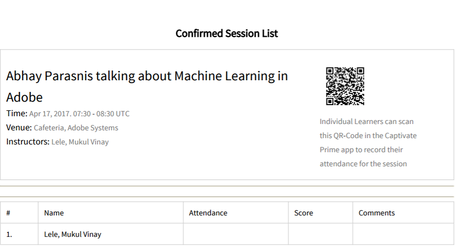
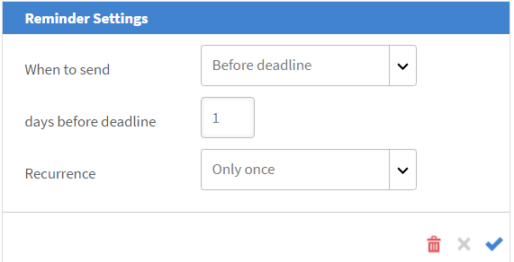

# セッションの学習者の管理

この記事では、出席者の管理、コース関連の電子メール送信、およびセッションのリマインダー送信を行う方法について学習します。

## レビューが保留中のセッションまたはモジュールの表示 {#pending}

インストラクタはレビューが保留中のセッションやモジュールを表示できます。

「セッション/モジュール」ページに列が表示されます **レビュー保留中** 対応するセッション/アクティビティの保留中のレビューの数が表示されます。

## セッションのキャンセル待ちの管理 {#managewaitlistforyoursession}

学習者がモジュールに登録すると、登録およびキャンセル待ちの最新ステータスを「キャンセル待ち」ページから確認できます。

1. インストラクタアプリの左側にあるナビゲーションペインで、予定されているセッション／キャンセル待ちを選択します。

   人数制限、現在埋まっている席数数、空席数を確認できます。 テーブルにはキャンセル待ちの学習者も一覧表示されます。 キャンセル待ちの学習者がいない場合は空白になります。

   
   *キャンセル待ちの学習者を表示*

1. キャンセル待ちテーブルで、確認対象の学習者を 1 人以上選択します。
1. アクション／学習者を確認を選択します。

   確認した学習者が確認済み学習者リストに追加されます。

インストラクタは学習者をセッションから登録解除できます。 これにより、学習者は該当する学習からも登録解除されます。 「**[!UICONTROL キャンセル待ち]**」タブを選択します。 チェックボックスを使用して、登録解除するユーザーを選択します。 登録を解除するには、**[!UICONTROL アクション]**/**[!UICONTROL 学習者の登録解除]**&#x200B;を選択します。

*学習者の登録解除*

### キャンセル待ちレポート

Adobe Learning Managerの新しい&#x200B;**[!UICONTROL キャンセル待ちレポート]**&#x200B;を使用すると、インストラクターは、コースのすべてのインスタンスについて、キャンセル待ちの学習者リストをダウンロードできます。 インストラクターは、**[!UICONTROL セッションの概要]**&#x200B;ページの&#x200B;**[!UICONTROL キャンセル待ち]**&#x200B;セクションからこのレポートにアクセスできます。

キャンセル待ちレポートで使用できる列は次のとおりです。

* コース名
* インスタンス名
* インスタンス ID
* インスタンスのステータス
* ユーザー名
* 電子メール
* ユーザーの一意の ID
* 登録日 (UTC タイムゾーン)
* ステータス
* キャンセル待ち番号
* キャンセル待ちの制限
* 人数制限

「インストラクター」セクションからレポートをダウンロードするには：

1. **[!UICONTROL インストラクター]**&#x200B;としてログインします。
2. ホームページから任意のセッションを選択します。
3. **[!UICONTROL セッションの概要]**&#x200B;ページで&#x200B;**[!UICONTROL キャンセル待ち]**&#x200B;オプションを選択します。
4. **[!UICONTROL アクション]** / **[!UICONTROL レポートの書き出し]**&#x200B;を選択して、**[!UICONTROL キャンセル待ち]**&#x200B;レポートをダウンロードします。

## セッション出席の記録 {#markattendanceforyoursession}

セッションに出席している確認済み学習者の数、これらの学習者の名前、学習者の出席ステータス、その他の詳細を「学習者」ページで確認できます。

1. 左側にあるナビゲーションペインで、予定されているセッション／学習者をクリックします。
1. 出席者のリストから学習者を 1 人以上選択し、次のいずれかの操作を実行します。

   * 出席を記録するには、アクション／出席を記録をクリックします。 出席済みと記録した後、ステータスを変更することはできません。
   * 欠席を記録するには、アクション／欠席をクリックします。
   * 解約などの理由で学習者を削除する場合は、 「アクション/学習者を削除」をクリックします。

   学習者は出席ステータスが出席済みになるまでモジュールを完了することはできません。

   
   *学習者の出席をマーク*

### 学習者の登録と出席に関するQRコードのダウンロード

インストラクターは、割り当てられたセッションのQRコードをダウンロードできます。学習者はQRコードをスキャンして、コースインスタンスに登録し、出席または完了をマークすることができます。

これにより、インストラクターは、管理者のサポートを必要とせずに、セッションへの参加を個別に管理できます。

次の手順は、両方に適しています。

* 教室での実際のセッション
* オンライン教室セッション

物理的な教室セッションの場合、インストラクターは正しいQRコードを生成し、学習者がセッションに出席する教室にペースト（または他の場所にペースト）する必要があります。これにより、学習者はQRコードをスキャンし、QRコードに応じて登録と出席、またはその両方をマークできます。

オンライン教室セッションの場合、インストラクターは生成されたQRコードをメールやメッセージングシステムなどの手段で送信することができます。これにより、学習者はQRコードをスキャンして、QRコードに基づいて登録や出席、またはその両方をマークすることができます。

#### セッションのQRコードのダウンロード

1. **インストラクター**&#x200B;のロールでAdobe Learning Managerにログインします。
2. **インストラクターダッシュボード**&#x200B;に移動します。
3. 関連する&#x200B;**コースインスタンス**&#x200B;を開きます。
4. 「**セッション**」タブを選択します。
5. 自分に割り当てられたセッションを選択します。
6. **セッションQRコード**を選択してください。
   

次のQRコードをダウンロードできます。

* **登録QRコード** – 学習者がコースインスタンスに登録できるようにします
* **出席QRコード** – セッションの出席を記録します
* **登録+出席のQRコード** – 学習者を登録し、1回のスキャンで出席をマークします

QRコードはPDFとしてダウンロードされ、デジタルでの共有やセッション中の表示が可能です。

#### 学習者がQRコードをスキャンした場合

* 学習者はモバイルデバイスを使用してQRコードをスキャンします。
* Adobe Learning Managerは、学習者とセッションを検証します。
* QRコードタイプに基づいて、次の操作を行います。
   * 学習者がコースインスタンスに登録されている場合、または
   * セッションの出席と完了が記録されます

すべての更新は、学習者のレコード、トランスクリプトおよびレポートに自動的に反映されます。

#### メモ

* QRコードは、セッションに割り当てられたインストラクターのみが使用できます。
* コースとセッションに設定された登録、出席、完了ルールは引き続き適用されます。
* 既存の学習者の進捗状況とレポートワークフローに変更はありません。

#### ユースケース

* 大量のオンサイトセッション（専門家向けの製品トレーニングなど）を実行している組織では、インストラクターがセッション固有のQRコードを印刷して、1回のスキャンで出席を登録および記録できます。

* 小売、製造、ヘルスケアのトレーニングでは、学習者がフロアから直接、または事前登録なしでセッションに参加することが多いため、「登録+出席」のQRコードをドアに配置することができます。 これにより、学習者は電話を使用して登録と出席をセルフサービスで行うことができます。

* パートナーやお客様向けのトレーニングイベントにより、オンサイトトレーナーは、管理者に新しいQRコードを確認しなくても、部屋の変更、追加セッション、または追加出席者に簡単に対応できます。

### カレンダーの招待

* 学習者またはインストラクターが教室またはバーチャルクラスルームセッションに登録されると、Learning Managerからカレンダーの招待状（ICSファイル）が送信されます。
* 招待状には以下が含まれます。
   * セッションの日時
   * セッションの詳細
   * 予定表の説明の&#x200B;**直接セッション参加リンク**

参加者はカレンダーイベントを開き、カレンダーから直接セッションに参加できます。

#### Gmailからセッションに参加する

1. **Googleカレンダー**&#x200B;を開きます。
2. セッションイベントを選択します。
3. イベントの詳細で、**セッション参加リンク**&#x200B;をクリックします。
4. Adobe Learning Managerまたは設定されたバーチャルクラスルームツールで直接セッションが開きます。

セッションリンクにアクセスするために元の電子メールを開く必要はありません。

#### 他のカレンダークライアントからのセッションへの参加

セッションリンクはカレンダーイベント本文に含まれており、以下からアクセスすることができます。

* Microsoft Outlook
* Appleカレンダー
* ICSファイルをサポートするその他のカレンダーアプリケーション

#### メモ

* カレンダーの招待状は、Learning Managerによって自動的に生成されます。
* カレンダー招待状のタイムゾーン情報は、学習者が選択したタイムゾーンに基づいて調整されます。
* この機能強化は、新しく生成されたカレンダーの招待状に適用されます。
* 管理者やインストラクターが追加の設定を行う必要はありません。

## 学習者の成功のマーク

インストラクターは、学習者ページから各学習者の成功ステータスを「合格」または「不合格」と直接マークできます。 この機能により、インストラクターは学習者のパフォーマンスに基づいて、教室またはバーチャルクラスルームセッションの結果を正確に記録できます。

学習者の合格をマークする手順は、次のとおりです。

1. インストラクターとしてAdobe Learning Managerにログインします。
2. 左側のナビゲーションウィンドウで&#x200B;**[!UICONTROL 今後のセッション]**&#x200B;を選択します。
3. **[!UICONTROL 学習者]**&#x200B;を選択します。
4. 学習者を選択して、**[!UICONTROL アクション]**&#x200B;を選択します。
5. 次のいずれかのオプションを選択して、選択した学習者の成功をマークします。

   * **[!UICONTROL 出席および合格のマーク]**:パスとマークされた学習者が、モジュールを正常に完了しました。
   * **[!UICONTROL 出席および不合格としてマーク]**:エラーとしてマークされた学習者は、モジュールを完了しましたが、合格しませんでした。

   
   _学習者の結果を記録するために、「出席と合格をマーク」オプションと「出席と不合格をマーク」オプションが強調表示されたアクションメニューが表示されている学習者ページ_

6. 確認プロンプトで「**[!UICONTROL はい]**」を選択します。

## 学習者への電子メールの送信 {#sendemailstolearners}

セッションの特定の出席者またはすべての出席者に電子メールを送信できます。 「電子メールを送信」機能は、学習者の出席を確認する場合、またはセッションに関するメッセージを送信する場合に非常に便利です。 割り当てまたはセッション資料を送信する場合、またはすべての学習者に一般的なメッセージを送信する場合は、「全員に電子メールを送信」オプションも使用できます。

学習者に電子メールを送信するには、インストラクタアプリの「学習者」ページで次のどちらかの操作を実行します。

* 特定の出席者に電子メールを送信するには、出席者を選択し、アクション／選択したユーザーに電子メールを送信をクリックします。
* すべての出席者にコース資料や割り当てを送信するには、アクション／全員に電子メールを送信をクリックします。

## 招待状の返信をキャプチャ

インストラクターは、ACAP管理者によって&#x200B;**[!UICONTROL 「返信を招待」]**&#x200B;オプションが有効になっている場合にのみ、学習者の招待回答をキャプチャできます。 この機能を有効にするには、管理者はサポートチーム([learningmanagersupport@adobe.com](mailto:learningmanagersupport@adobe.com))に問い合わせる必要があります。

完了すると、「**[!UICONTROL 学習者]**」セクションに招待状の回答が表示されます。 任意のセッションに移動し、**[!UICONTROL 学習者]**&#x200B;を選択して、ドロップダウンメニューから招待の回答を選択します。

## 学習者リストの書き出し {#exportinglearnerslist}

インストラクタは、出席者リストを PDF として書き出すことにより、すべての学習者の出席を簡単に記録できます。 出席者リストを書き出すには、左ペインにある「学習者」で、 アクション／学習者リスト (PDF) を書き出しをクリックします。

セッションの出席者リストを確認した後、リストを PDF として書き出すことができます。 この印刷しやすい PDF は学習者を表形式で示します。 これ以降、この PDF を使用して出席の記録、スコアの提供、学習者向けメモの作成または提供を実行できます。

この PDF の右上隅には QR コードが表示されます。 この機能を使用すると、個々の学習者は Learning Manager モバイルアプリでコードをスキャンすることにより、出席を記録できます。

*QRコードをスキャンして注意をマークする*

## 送信の承認または拒否 {#approveorrejectsubmissions}

セッションの割り当て、レポート、評価などの文書を学習者がアップロードした場合、これらの文書を「送信内容」ページで表示できます。 これらの文書は学習者を評価する際や、送信内容を承認または拒否する際に使用できます。

1. 左ペインで、セッションのスケジュールに基づいて「予定されているセッション」または「予定が過ぎたセッション」をクリックします。
1. 送信内容を表示するコースをクリックします。

   左ペインで、「送信内容」をクリックします。

1. 選択したセッションの学習者の送信内容を確認できます。 承認または拒否する送信内容を選択し、「承認」または「拒否」をクリックします。

   アクションに応じて送信内容のステータスが「承認」または「拒否」に変わります。

## セッションのリマインダーの設定 {#configureremindersforyoursession}

1. 左ペインで、「予定されているセッション」をクリックします。
1. リマインダーを設定するコースをクリックします。 左ペインで、「リマインダー」をクリックします。
1. 「リマインダーを選択」タイルで、「リマインダーを設定」をクリックします。

   
   *セッションのリマインダーを構成する*

1. 次の操作を行います。

   * リマインダーを設定ダイアログボックスで、学習者にリマインダーを送信するオプション（期日前、期日、期日後）を設定します。
   * 「期日前日数」フィールドで、リマインダーを期日の何日前に学習者に送信するかを設定します。
   * リマインダーの繰り返しを設定します。

   
   *リマインダー設定の表示*

1. 次のどちらかの操作を実行します。

   * チェックマークをクリックしてリマインダーを保存します。
   * ×マークをクリックしてリマインダーをキャンセルします。

   すべての学習者に対して、リマインダー設定で指定した日付にコースのリマインダーが自動送信されます。

   セッションのリマインダーを既に設定している場合は、「既存のリマインダー」タイルでリマインダーを確認できます。 また、既存のリマインダーにリマインダーを追加できます。

   既存のリマインダーを削除するには、リマインダーをクリックします。 表示されるポップアップで、削除アイコン（ごみ箱アイコン）をクリックしてリマインダーを削除します。
