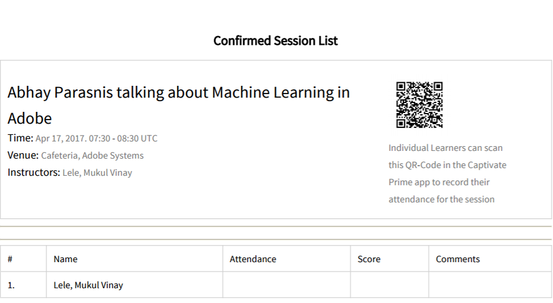

# セッションの学習者の管理

この記事では、出席者の管理、コースに関する電子メールの送信、セッションのリマインダー送信について説明します。

## レビューが保留中のセッションまたはモジュールの表示 {#pending}

インストラクターは、レビューが保留中のセッションまたはモジュールを表示できます。

「セッション/モジュール」ページに列が表示されます **保留中のレビュー** 対応するセッション/アクティビティの保留中のレビューの数を表示します。

## セッションのキャンセル待ちの管理 {#managewaitlistforyoursession}

学習者がモジュールに登録すると、「キャンセル待ち」ページから登録とキャンセル待ちの最新ステータスを確認できます。

1. インストラクターアプリの左側のナビゲーションペインで、今後のセッション/キャンセル待ちを選択します。

   座席の上限、現在満席の数、空席の数を表示できます。 キャンセル待ちの学習者も表に一覧表示されます。 キャンセル待ちキューがない場合は、このフィールドは空白です。

   
   *キャンセル待ちの学習者の表示*

1. 「キャンセル待ち」テーブルから、確認する学習者を選択します。
1. アクション/学習者の確認を選択します。

   自分が確認した学習者が、確認済み学習者リストに追加されます。

インストラクターは、セッションから学習者の登録を解除できます。 これにより、対応する学習からユーザーが登録解除されます。 選択 **[!UICONTROL キャンセル待ち]** タブをクリックします。 チェックボックスを使用して、登録解除する学習者を選択します。 登録解除するには、 **[!UICONTROL アクション]** > **[!UICONTROL 学習者の登録解除]**.

*学習者の登録解除*

## セッションの出席をマーク {#markattendanceforyoursession}

「学習者」ページから、セッションに出席する確認済みの学習者の数、学習者の名前、学習者の出席ステータスおよびその他の詳細を表示できます。

1. 左側のナビゲーションパネルで、今後のセッション/学習者をクリックします。
1. 出席者のリストから学習者を選択し、次のいずれかの操作を行います。

   * 出席をマークするには、「アクション/出席をマーク」をクリックします。 一度ステータスを「出席」としてマークすると、ステータスを変更することはできません。
   * 出席以外をマークするには、「アクション」 > 「出席なし」の順にクリックします。
   * 解約などの理由で学習者を削除する場合は、 「アクション/学習者を削除」をクリックします。

   出席ステータスが「出席」になるまで、学習者はモジュールを完了できません。

   
   *学習者の出席のマーク*

## 学習者に電子メールを送信 {#sendemailstolearners}

セッションの特定の出席者またはすべての出席者に電子メールを送信できます。 電子メールの送信機能は、学習者の出席を確認する場合や、セッションに関するコミュニケーションを送信する場合に非常に便利です。 また、「全員に電子メールを送信」オプションを使用して、課題やセッションの内容を電子メールで送信したり、すべての学習者に一般的なコミュニケーションを送信したりすることもできます。

学習者に電子メールを送信するには、インストラクターアプリの「学習者」ページから、次のいずれかの操作を行います。

* 特定の出席者に電子メールを送信するには、出席者を選択し、アクション/選択したユーザーに電子メールを送信をクリックします。
* コースの教材または課題を送信するためにすべての出席者に電子メールを送信するには、 「アクション/全員に電子メールを送信」をクリックします。

## 学習者リストの書き出し {#exportinglearnerslist}

インストラクターは、出席者リストをpdf形式で書き出すことで、すべての学習者の出席を簡単にマークできます。 学習者の左ペインから出席者リストを書き出すには、次の手順を実行します。 「アクション/学習者リストの書き出し(PDF)」をクリックします。

セッションの出席者リストが確認されたら、リストをPDFとして書き出すことができます。 この印刷しやすいPDFには、学習者が表として表示されます。 その後、同じPDFで出席をマークまたはスコアを提供したり、学習者にメモを作成または提供したりできます。

このPDFの右上隅にQRコードが表示されています。 この機能を使用すると、個々の学習者はLearning Managerモバイルアプリでコードをスキャンし、出席を記録できます。

*QRコードをスキャンして注意をマーク*

## 提出を承認または却下 {#approveorrejectsubmissions}

学習者がセッションの課題、レポート、評価などの文書をアップロードした場合は、「提出」ページでその文書を表示できます。 学習者のグレーディングにマテリアルを使用でき、提出を承認または却下できます。

1. 左ペインで、セッションのスケジュールに基づいて、「予定されているセッション」または「過去のセッション」をクリックします。
1. 提出物を表示するコースをクリックします。

   左ペインで、「提出」をクリックします。

1. 選択したセッションの学習者からの提出物を表示できます。 承認または却下する提出物を選択し、「承認」または「却下」をクリックします。

   送信のステータスが、アクションに基づいて「承認済み」または「拒否済み」に変わります。

## セッションのリマインダーの設定 {#configureremindersforyoursession}

1. 左ペインで「今後のセッション」をクリックします。
1. リマインダーを設定するコースをクリックします。 左ペインで、[通知]をクリックします。
1. 「リマインダーを選択」タイルから、 「リマインダーを設定」をクリックします。

   
   *セッションのリマインダーの設定*

1. 次の操作を行います。

   * リマインダー設定ダイアログボックスで、学習者にリマインダーを送信するタイミングを、「期限前」、「期限時」または「期限後」のいずれかにオプションで設定します。
   * 「期限までの日数」フィールドで、学習者にリマインダーを送信する、期限までの日数を設定します。
   * リマインダーの繰り返しを設定します。

   
   *リマインダー設定の表示*

1. 次のいずれかの操作を行います。

   * チェックマークをクリックしてリマインダーを保存します。
   * リマインダーをキャンセルするには、バツマークをクリックします。

   リマインダー設定で指定した設定日に、すべての学習者に自動コースリマインダーが送信されます。

   セッションのリマインダーを設定済みの場合は、「既存のリマインダー」タイルの下にそのセッションが表示されます。 さらに、既存のリマインダーに追加のリマインダーを追加することもできます。

   既存のリマインダーを削除するには、リマインダーをクリックします。 表示されるポップアップで削除アイコン（ごみ箱アイコン）をクリックして、リマインダーを削除します。
