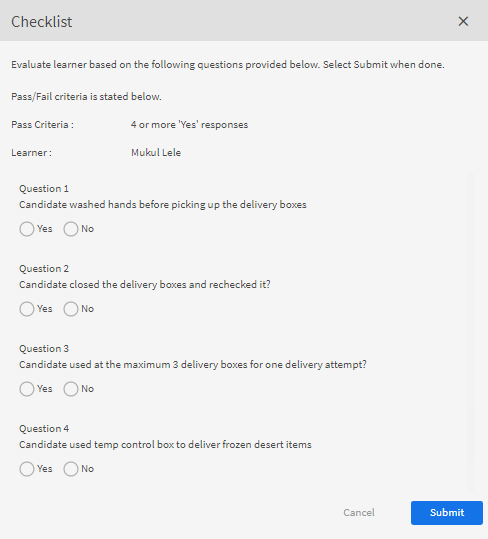
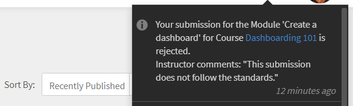

# モジュール

この記事では、インストラクターとして Learning Manager でモジュールを管理する方法について説明します。

## セッションの概要を表示する {#viewsessionoverview}

1. 左側のペインで、「予定されているセッション」をクリックします。
1. 予定されているセッションのリストで、概要を表示するセッションを選択します。

   セッションの名前、場所、日時、登録制限、キャンセル待ちの制限などの情報とともに、セッションの概要が表示されます。

   
   *今後のセッションを表示*

## セッションの詳細を設定する {#configuresessiondetails}

1. 左側のペインで、「予定されているセッション」をクリックします。
1. 編集するセッションを選択します。
1. 画面右上隅の「編集」をクリックします。

   
   *セッションの詳細を設定*

1. 「セッションの概要」ページで、セッションの開催日時や場所などを編集することができます。また、以下の詳細情報を設定することもできます。

   * セッションの最大参加人数を設定する場合は、「登録制限」フィールドに値を入力します。
   * セッションのキャンセル待ちリストの最大人数を設定する場合は、「キャンセル待ちの制限」フィールドに値を入力します。
   * 学習者による課題の提出を許可する場合は、「提出物を許可」フィールドで「はい」を選択します。「いいえ」を選択した場合、学習者はセッションの課題の提出物をアップロードできません。

   
   *セッションの詳細を編集*

1. 「保存」をクリックします。

   このページの「インストラクタ」フィールドを編集することはできません。

## セッションのリソースファイルをアップロードする {#uploadresourcefilesforyoursession}

インストラクタは、課題ファイル、モジュールのプレゼンテーションファイル、モジュールのアクティビティファイルなど、各種のリソースファイルをアップロードすることができます。モジュールまたはセッション用のリソースファイルを追加する場合は、リソースメニューを使用します。

1. インストラクタアプリケーションで、「予定されているセッション／リソース」をクリックします。

   「リソース」ページが表示されます。このページには、モジュールに関連するコース用として作成者がアップロードしたリソースへのリンクが表示されます。インストラクタは、モジュール用のリソースファイルをアップロードすることもできます。

1. 「追加」をクリックします。

   
   *セッションのリソースを追加*

1. アップロードするファイルをコンピューター内で検索し、ファイルを選択して「開く」をクリックします。
1. ファイルのアップロードが完了すると、アップロードされた日付とともにそのファイルが表示されます。

   このモジュールに登録した学習者は、「コース」の「リソース」セクションで、アップロードされたリソースファイルを表示することができます。

   リソースファイルを削除するには、「リソース」ページで目的のファイルを 1 つ以上選択し、「アクション／ファイルの削除」をクリックします。

## アクティビティモジュールでファイルを提出する {#filesubmissionforactivitymodules}

アクティビティモジュールでは、ファイル提出ワークフローがサポートされています。作成者としてアクティビティモジュールを作成し、  **[!UICONTROL ファイル提出]** オプションです。 この操作により、学習者がファイルを提出できるようになります。

モジュールインストラクタは、学習者が提出したファイルを承認／拒否することができます。提出されたファイルをインストラクタが承認するまで、モジュールは完了しません。

 
*ファイルを承認または却下*

## チェックリストモジュールの評価 {#evaluate-checklist-module}

学習者がコースを受講すると、インストラクターには、提出物/チェックリストのページに **モジュール**&#x200B;セクションに追加します。 このページには、すべてのチェックリストアクティビティモジュールと、レビューの期限を迎えている提出アクティビティモジュールが含まれます。 モジュールごとに、評価の期限を迎えている学習者の数が表示されます。

下のページで、タイプのモジュールを表示できます **提出** および **チェックリスト**. この例では、チェックリストモジュールを使用します。

*モジュールのリストの表示*

チェックリストモジュールをクリックします。 を **チェックリスト** ページには、次の情報が表示されます。

* モジュールの名前
* コースの名前
* コースが属するインスタンス
* 作成者が設定した合格条件
* チェックリストの質問数

*チェックリストページの表示*

学習者を評価するには、 **[!UICONTROL 演算]** を **[!UICONTROL チェックリスト]** 列に追加します。 レビューのステータスが&#x200B;**「保留中」**&#x200B;であることも確認できます。

学習者を評価し、**[!UICONTROL 「送信」]**&#x200B;をクリックします。 インストラクタは、評価に関する質問すべてに回答する必要があります。

*評価用チェックリスト*

合格条件に応じて、ステータスは「不合格」または「合格」になります。

チェックリストは、評価されると、再評価することはできません。

インストラクタは、モジュールの他のインストラクタから送信された回答も表示できます。

適用された検索フィルターに基づいて、学習者をCSVとして書き出すことができます。

インストラクターがチェックリストを使用してコースを評価すると、学習者にはモジュールのステータスが **合格** コースのステータス **完了**、またはモジュールのステータス **失敗**、コースのステータス **完了**.

## アクティビティの拒否に対するインストラクターのコメント {#rejection-comments}

学習者は、拒否用に送信される通知でインストラクターのコメントを確認できます。 その後、学習者は、コメントの形式で詳細情報を提出して、再提出できます。

ワークフローは次のとおりです。

1. 作成者は、アクティビティモジュールを含むコースを作成し、インストラクターを割り当ててから、コースをパブリッシュします。

1. 学習者がコースを受講し、コースの完了後に完了証明書を提出する場合。

   
   *完了証明書の提出*

1. インストラクターは、自分に割り当てられたアクティビティモジュールを選択します。 モジュールの「提出」ページで、インストラクターがクリックします **編集**. 却下するコメントを入力し、「コメントを表示」オプションを有効にすると、学習者が通知でコメントを表示できるようになります。

   
   *完了コメントの入力*

1. インストラクターがクリック可能 **却下**. 送信のステータスがに変わります **却下のマーク付き**.

   
   *提出を却下する*

1. 送信後、ステータスはに変わります **却下**.

   
   *却下ステータスを表示*

1. 学習者には、提出が拒否されたことを示す通知が表示されます。 インストラクターからのコメントも通知に表示されます。

   
   *拒否通知を受信*

この変更に対応するため、Adobeでは以下の電子メールテンプレートを更新しました **送信が拒否されました**.

## アクティビティモジュールのスコアとコメントを追加する {#addscoresandcommentsforactivitymodules}

提出されたアクティビティモジュールのスコアとコメントを追加するには、以下の手順を実行します。

1. 左側のペインで「**[!UICONTROL 学習者]**」をクリックします。

   
   *学習者を選択*

1. 「学習者」ページで、「**[!UICONTROL アクション]**／**[!UICONTROL スコアとコメントを編集]**」をクリックします。

   
   *注釈を追加*

   コースを修了していない学習者の場合、スコアとコメントの入力フィールドは表示されません。

   
   *スコアとコメントの編集*

1. **[!UICONTROL 「保存」]**&#x200B;をクリックします。
