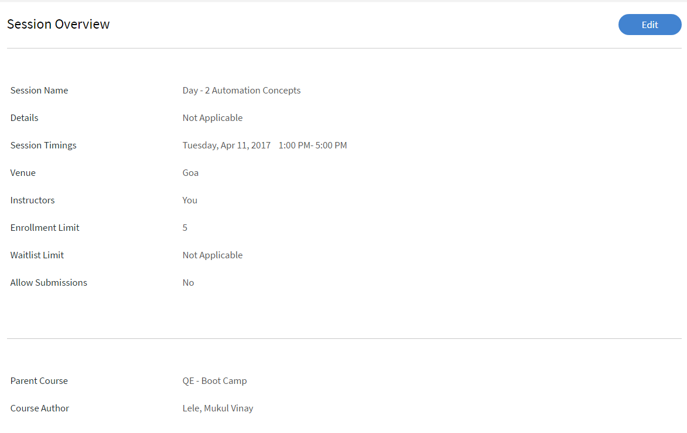

# モジュール

この記事では、インストラクターとしてLearning Managerでモジュールを管理する方法について説明します。

## セッションの概要を表示 {#viewsessionoverview}

1. 左ペインで「今後のセッション」をクリックします。
1. 予定されているセッションのリストから、詳細を表示するセッションを選択します。

   アプリには、セッションの概要と、セッション名、会場、タイミング、登録制限、キャンセル待ちの制限などの詳細が表示されます。

   
   *今後のセッションを表示*

## セッションの詳細を設定 {#configuresessiondetails}

1. 左ペインで「今後のセッション」をクリックします。
1. 更新するセッションを選択します。
1. 右上隅の「編集」をクリックします。

   
   *セッションの詳細を設定*

1. 「セッション概要」ページでは、セッションの日時、会場などを編集できます。 また、次のセッションの詳細を編集または追加することもできます。

   * 「登録制限」を指定して、セッションで許可される学習者の最大数を設定します。
   * セッションのキャンセル待ちで許可される学習者の最大数を設定する場合は、「キャンセル待ち制限」を指定します。
   * 「提出を許可」フィールドで「はい」を選択し、学習者が課題を提出できるようにします。 「いいえ」を選択した場合、学習者はセッションの課題の提出物をアップロードできません。

   
   *セッションの詳細を編集*

1. 「保存」をクリックします。

   このページの「インストラクター」フィールドは編集できません。

## セッションのリソースファイルをアップロードする {#uploadresourcefilesforyoursession}

インストラクターは、モジュールの割り当てファイルやプレゼンテーションなどのリソースファイル、またはモジュールのアクティビティファイルをアップロードできます。 モジュールまたはセッションのリソースファイルを追加するには、リソースメニューを使用します。

1. インストラクターアプリから、今後のセッション/リソースをクリックします。

   モジュールに関連付けられたコースに対して作成者がアップロードしたリソースへのリンクを既に含む「リソース」ページを表示できます。 また、インストラクターはモジュールのリソースファイルもアップロードできます。

1. 「追加」をクリックします。

   
   *セッションのリソースを追加*

1. コンピューター内の適切なファイルを参照します。 ファイルを選択して、「開く」をクリックします。
1. ファイルがアップロードされると、ファイルと追加日が表示されます。

   このモジュールに登録した学習者は、アップロードされたファイルを「コース」の「リソース」セクションで確認できます。

   リソースファイルを削除するには、削除するファイルを選択します。 「リソース」ページで「アクション」 > 「ファイルの削除」の順にクリックします。

## アクティビティモジュールのファイル送信 {#filesubmissionforactivitymodules}

アクティビティモジュールはファイル送信ワークフローをサポートしています。 作成者としてアクティビティモジュールを作成し、  **[!UICONTROL ファイル提出]** オプションです。 これにより、学習者はファイルを送信できます。

これらのファイルは、モジュールのインストラクターによって承認/拒否される可能性があります。 モジュールが完了するのは、インストラクターが提出物を承認した後のみです。

 
*ファイルを承認または却下*

## チェックリストモジュールの評価 {#evaluate-checklist-module}

学習者がコースを受講すると、インストラクターには、提出物/チェックリストのページに **モジュール**&#x200B;セクションに追加します。 このページには、すべてのアクティビティチェックリストモジュール、およびレビューの期限を迎えているアクティビティ提出モジュールが表示されます。 各モジュールごとに、評価の期限を迎える学習者の数が表示されます。

下のページで、タイプのモジュールを表示できます **提出** および **チェックリスト**. この例では、チェックリストモジュールを使用します。

*モジュールのリストの表示*

チェックリストモジュールをクリックします。 を **チェックリスト** ページには、次の情報が表示されます。

* モジュールの名前
* コースの名前
* コースが属するインスタンス
* 作成者が設定した条件に合格します
* チェックリスト質問の数

*チェックリストページの表示*

学習者を評価するには、 **[!UICONTROL 演算]** を **[!UICONTROL チェックリスト]** 列に追加します。 また、レビューのステータスが **保留中**.

学習者を評価して「 **[!UICONTROL 送信]**. インストラクターとして、すべての評価関連の質問に回答する必要があります。

*評価用チェックリスト*

合格条件に応じて、ステータスは「Failed」または「Pass」になります。

チェックリストは、一度評価されると、再評価できません。

インストラクターは、モジュールの他のインストラクターから送信された回答も確認できます。

適用された検索フィルターに基づいて、学習者をCSVとして書き出すことができます。

インストラクターがチェックリストを使用してコースを評価すると、学習者にはモジュールのステータスが **合格** コースのステータス **完了**、またはモジュールのステータス **失敗**、コースのステータス **完了**.

## アクティビティを却下した場合のインストラクターのコメント {#rejection-comments}

学習者は、拒否用に送信される通知でインストラクターのコメントを確認できます。 学習者は、コメントの形式で詳細情報を提供することで、再送信できます。

ワークフローは次のとおりです。

1. 作成者は、アクティビティモジュールを含むコースを作成し、インストラクターを割り当ててから、コースをパブリッシュします。

1. 学習者がコースを受講し、コースの完了後に完了証明書を提出する場合。

   
   *完了証明書の提出*

1. インストラクターは、自分に割り当てられたアクティビティモジュールを選択します。 モジュールの「提出」ページで、インストラクターがクリックします **編集**. 却下するコメントを入力し、「コメントを表示」オプションを有効にすると、学習者が通知でコメントを表示できるようになります。

   
   *完了コメントの入力*

1. インストラクターがクリック可能 **却下**. 送信のステータスがに変わります **却下のマーク付き**.

   
   *提出を却下する*

1. 送信後、ステータスはに変わります **却下**.

   
   *却下ステータスを表示*

1. 学習者には、提出が拒否されたことを示す通知が表示されます。 インストラクターからのコメントも通知に表示されます。

   
   *拒否通知を受信*

この変更に対応するため、Adobeでは以下の電子メールテンプレートを更新しました **送信が拒否されました**.

## アクティビティモジュールのスコアとコメントの追加 {#addscoresandcommentsforactivitymodules}

送信用に送信されたアクティビティモジュールのスコアとコメントを追加するには、次の手順に従います。

1. 左ペインで、 **[!UICONTROL 学習者]**.

   
   *学習者を選択*

1. 学習者ページで、次をクリックします。 **[!UICONTROL アクション]** > **[!UICONTROL スコアとコメントを編集]**.

   
   *注釈を追加*

   コースを完了していない学習者の場合、スコアとコメントの入力フィールドは表示されません。

   
   *スコアとコメントの編集*

1. クリック **[!UICONTROL 保存]**.
