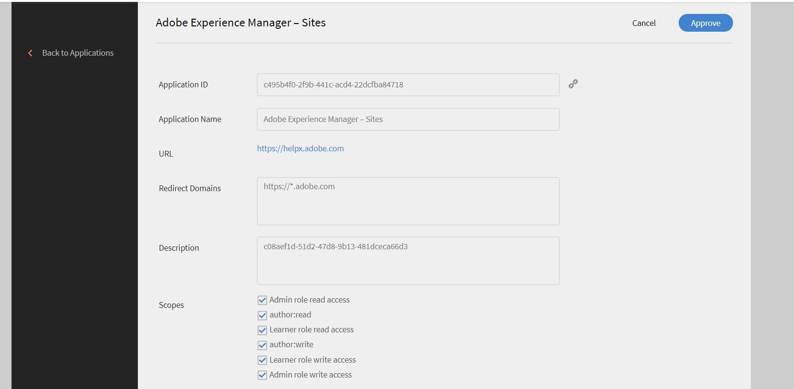

# Learning ManagerとAEMの統合

## 概要 {#overview}

Learning Managerは、学習コンテンツ管理システムが組み込まれた学習管理システムです。 ユーザーは学習コンテンツをLearning Managerにアップロードして管理するため、Learning Managerでバージョン管理、コースへの割り当て、学習者への可視性の定義、使用状況の追跡、管理者へのレポート作成が実行されます。

ただし、アセット管理システムにコンテンツを保存して管理するユーザーもいます。 その後、コンテンツは他のさまざまな機能のために再利用されます。

学習者アプリに含まれる様々なストリップは、AEMサイトに埋め込むことができます。 AEMサイトにログインした学習者には、このストリップに表示される自分に固有のトレーニングデータが表示されます。

## コンテンツパッケージのダウンロード {#downloadthecontentpackage}

インストーラーはAEMコンテンツパッケージに付属しています。 [***パッケージのダウンロード***](https://github.com/adobe/captivate-prime-aem-components/releases).

コンテンツパッケージはzipファイルとして利用可能であり、AEM 6.4およびAEM 6.5と互換性があります。

## Learning Managerコンポーネントのインストール {#installcaptivateprimecomponent}

AEMパッケージマネージャーを使用して、Learning Managerコンテンツパッケージをインストールします。

>[!NOTE]
>
>パッケージのインストールについては、を参照してください。  [***パッケージを使用する方法***](https://experienceleague.adobe.com/docs/experience-manager-65/administering/contentmanagement/package-manager.html?lang=en#how-to-work-with-packages).

1. AEM作成者として、AEM Package Managerを開きます。

1. ボタンをクリック **パッケージのアップロード**.

1. クリック **[!UICONTROL 参照]** コンテンツパッケージをアップロードします。
1. クリック **[!UICONTROL アップロード]**.
1. パッケージがアップロードされたら、コンテンツパッケージを選択して「 **[!UICONTROL インストール]**.

   

## 更新トークンの生成 {#generatetherefreshtoken}

AEM管理者には、Learning Managerアカウントからの更新トークンが必要です。 Learning Manager統合管理者は更新トークンを生成します。

1. AEM Sitesのおすすめアプリを承認します。

   クリック **[!UICONTROL アプリケーション]** > **[!UICONTROL おすすめアプリ]** > **[!UICONTROL Adobe Experience Manager - Sites]**.

   

1. クリック **[!UICONTROL アプリケーション]** > **[!UICONTROL おすすめアプリ]** AEMサイトのアプリケーションを開きます。

   アプリケーションIDと説明をコピーします。

1. クリック **[!UICONTROL 開発者向けリソース]** > **[!UICONTROL アクセストークン]**.

   

1. 次の詳細を入力します。

   * クライアントID。アプリケーションIDです。
   * 「説明」に含まれるクライアントシークレット。

1. OAuthコードを取得します。 リダイレクトURIでv2 APIを使用する必要があります。
1. クリック **[!UICONTROL 送信]** 更新トークンを取得します。

## AEMでのウィジェットの設定 {#configurethewidgetinaem}

ウィジェット設定の場合、AEM作成者はLearning Manager統合管理者が提供する更新トークンのみを必要とします。

複数のページで複数のアカウント設定を設定することもできます。

1. クリック **[!UICONTROL ツール]** > **[!UICONTROL Cloud Service]** > **[!UICONTROL CaptivateのLearning Managerウィジェットの設定]**.
1. クリック **[!UICONTROL 作成]**.
1. 更新トークンをここに入力します。 その他の設定を行います。
1. EU地域の場合、ホスト名は「learningmanagereu」に変更する必要があります。
1. 設定を保存して閉じます。
1. 構成を選択し、構成を公開します。

## AEM作成者 {#aemauthor}

AEM作成者は、まずコンポーネントをAEMテンプレートに追加する必要があります

AEMの作成者は、AdobeのLearning Managerコンポーネントをドラッグ&amp;ドロップして、必要に応じて設定できます。

Learning Managerコンポーネントを使用するには、上記の手順で作成した構成をページにマッピングする必要があります。  作成者は、「ページプロパティ」の下で「編集」を選択して、設定をマッピングできます **[!UICONTROL 詳細]** > **[!UICONTROL 設定]** > **[!UICONTROL クラウド設定]** 設定のパスを指定します。 作成者は、このようにして、複数のLearning Managerアカウントの構成を作成し、各構成を異なるサイトページにマッピングできます。 構成がページにマップされていない場合、コンポーネントは、構成が見つかるまで親ページから構成を再帰的に読み取ります。

## 学習者 {#learner}

学習者は、ページ内からコースを受講できます。

Learning Managerウィジェットにアクセスするには、学習者がAEMユーザーとしてログインしている必要があります。 プロパティ **電子メール** 学習者のrep:Userノードの/profileノードに存在する必要があります。 この電子メールは、Learning Managerアカウントに存在する電子メールとまったく同じにする必要があります。

学習者は、ページ内からコースを受講できます。

コースの進捗状況も保存されます。

次のウィジェットが表示されます。

1. ゲーミフィケーション
1. 学習カレンダー
1. ソーシャルウィジェット
1. カタログウィジェット
1. 学習状況
1. ピア学習に基づく推奨事項
1. 管理者によるRecommendations
1. 学習者の関心に基づく推奨事項

おすすめのウィジェットがない場合、ウィジェットは空白で表示されます。

## Skylineのサポート

Skylineは、AEMのクラウド版です。 まず、パッケージマネージャーからSkylineをインストールする必要があります。 AEMでSkylineコンポーネントを使用するには、Learning Managerアカウントにログインしている必要があります。 つまり、ユーザーの電子メールアドレスがアカウントに存在している必要があります。

## Skylineの展開

Skylineの設定手順については、  [GitHubリポジトリ](https://github.com/adobe/captivate-prime-aem-components).

## カタログウィジェット

カタログウィジェットには、特定のカタログまたはカタログのセットに由来するトレーニングがユーザーに表示されます。 ページプロパティの「プロパティ」セクションで、オプションの一覧から「カタログ」を選択します。


カタログウィジェットには、次のオプションが含まれます。

* **[!UICONTROL カタログID]:** 表示が必要なトレーニングを示す、コンマで区切られたカタログのID。
* **[!UICONTROL 並べ替え]:** トレーニングの並べ替え順序。 名前、日付、作成日、登録日などのオプションがあります。
* **[!UICONTROL 学習者の状態]:** enrolled（登録済み）、started（開始）、completed（完了）、notenrolled（未登録）というフィルターを使用するすべてのトレーニングを返します。 ソートオプションがdateEnrolled、dueDate、またはdateEnrolledの場合、検索結果は表示されません。
* **[!UICONTROL スキル名]:** トレーニングを正確にフィルタリングするのに使用するスキル。
* **[!UICONTROL タグ名]:** 結果を正確にフィルタリングするのに使用するタグ。

カスタマイズ可能な追加コンポーネントをいくつか紹介します。

**[!UICONTROL 学習目標タイプ]:** 学習目標のタイプに従ってフィルターします。 サポートされているタイプは、course（コース）、certification（資格認定）、jobAid（作業計画書）、learningProgram（学習プログラム）です。

AEMでは、ストリップ内のカードのタイトルは最初は空白になります。 プロパティで、widgets.htmlにタイトル名を入力します。

**カスタマイズ**

widgets.htmlを使用して、レイアウトの外観をカスタマイズできます。 表示されるカードの見た目を変更し、テーマをカスタマイズできます。

を **[!UICONTROL 一般設定]** ここでは、カードのメインカラーとサブカラーを選択したり、プロパティを指定したりして、テーマをカスタマイズできます。

```
\{ 
 "globalCssText":"@import url('https://fonts.googleapis.com/css2?family=Grandstander:ital,wght@0,100;0,200;0,300;0,400;0,500;0,600;0,700;0,800;0,900;1,100;1,200;1,300;1,400;1,500;1,600;1,700;1,800;1,900&family=Montserrat:ital,wght@0,100;0,200;0,300;0,400;0,500;0,600;0,700;0,800;0,900;1,100;1,200;1,300;1,400;1,500;1,600;1,700;1,800;1,900&display=swap');", 
 "fontNames":"Grandstander", 
 "cardLayout":{ 
 "cardLayoutName":"compact", 
 "cardPrimaryColor":"#376BA4", 
 "cardSecondaryColor":"#F98EB0", 
 "startedStateTextColor":"#ffffff", 
 "continueStateTextColor":"#ffffff", 
 "revisitStateTextColor":"#ffffff", 
 "startedStateColor":"#a0a0a0", 
 "continueStateColor":"#f9a122", 
 "revisitedStateColor":"#7fbc64", 
 "textPrimaryColor":"#ffffff", 
 "textSecondaryColor":"#d93f3f", 
 "navIconColor":"#a0a0a0" 
 } 
}
```

### 上位のLO登録を無視

もし **[!UICONTROL 上位のLO登録を無視]** チェックボックスがオンになっていて、ユーザーが学習プログラムまたは資格認定に直接登録されている場合、その資格認定または学習プログラムに関するコースがウィジェットでユーザーに表示されます。

このチェックボックスがオフの場合、ユーザーが直接登録されていない学習プログラムまたは資格認定に含まれるコースは表示されません。


設定がウィジェットに適用されます。

### セキュリティ

「クライアントID」フィールドと「クライアントシークレット」フィールドが追加されます。 さらに、更新トークンがマスクされます。 ユーザーが設定全体を作成した後、ユーザーが設定を編集するために再度開いた場合、または他のユーザーがこの設定を開いた場合、更新トークンはマスクされます。
