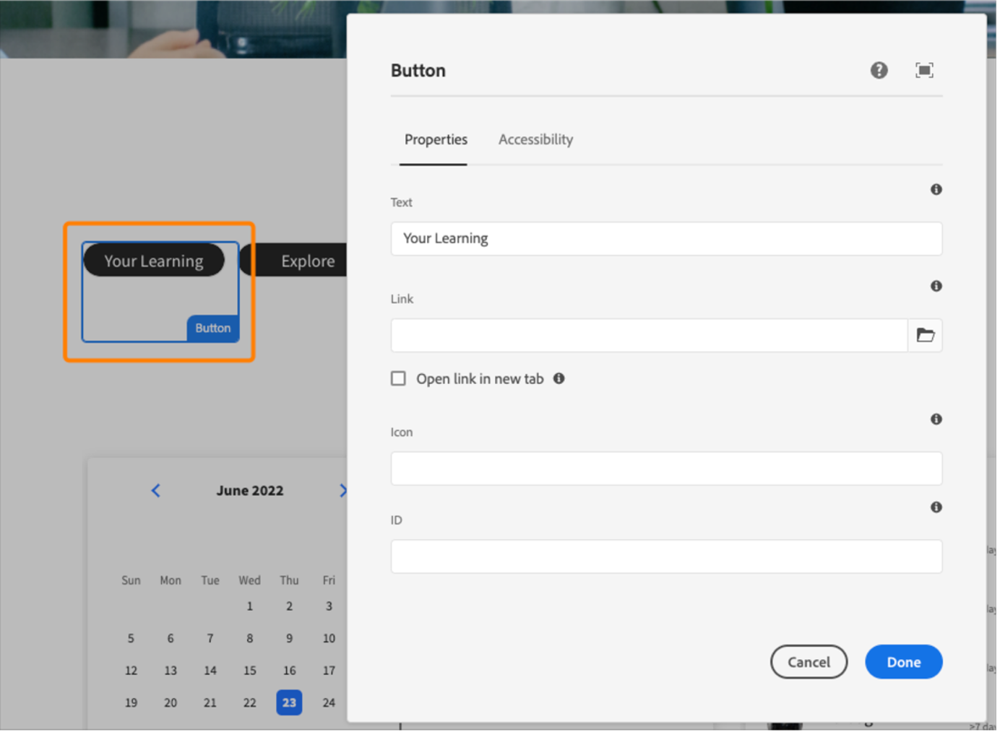
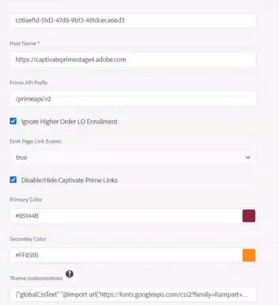

# Adobe Learning ManagerとAEMの連携

Adobeラーニングマネージャー (ALM) はAdobe Experience Manager(AEM) サイトと統合します。 これにより、コーディングの労力を最小限に抑えながら、独自の Web サイトとレスポンシブなモバイルAdobeインターフェイスを作成して Learning Manager にアクセスできます。 この統合により、ユーザー向けにカスタマイズされた学習体験を作成できます。

このようなエクスペリエンスを構築するために、ALM では、AEM Sitesインスタンスにインストールできる ZIP ファイル形式のAEM Sites用AdobeLearning Manager 参照サイトパッケージ（ALM 参照サイトパッケージ）を提供しています。

このパッケージには、埋め込みウィジェットとともに、AEM Sites webページテンプレートとwebサイトコンポーネントが含まれています。 例えば、学習カタログ、カレンダー、コンプライアンス、カテゴリ、コース、パスなど。

ALM 参照サイトパッケージをインストールしたら、AEM SitesインスタンスでホストできるAdobeラーニングマネージャー用 Web サイトの構築を開始できます。 その後、ユーザーは Web サイトにコンポーネントをドラッグ&amp;ドロップできます。

>[!IMPORTANT]
>
>AEM Sites用のAdobe Learning Manager(ALM)パッケージには、実装のためのクイックスタートコードブロックが用意されています。 このパッケージはヘッドレスデプロイメント向けに設計されています。 提供されたコードベースの実装に際しては、Adobe Learning Managerに基づくヘッドレスアプリケーションの標準的なプラクティスと同様に、実装する側が継続的なメンテナンスおよびさらなる開発を行う必要があります。

## ALM 参照サイトパッケージのインストール

### 前提条件

* AEM SitesとAdobe Commerceのライセンス
* AEMオンプレミス6.5またはAdobe Experience Manager - Cloud Service
* Adobe Commerce 2.4.3

AEM Sitesの環境を保護したら、ALM リファレンスサイトパッケージをインストールする必要があります。 このパッケージには、学習プラットフォームの構築に役立つAEM Web ページと Web サイトコンポーネントが含まれています。

参照サイトパッケージは、[**GitHubリポジトリ**](https://github.com/adobe/adobe-learning-manager-reference-site/releases)でホストされています。

詳しくは README をご覧ください。

## コンテンツパッケージのダウンロード {#downloadthecontentpackage}

インストーラーは AEM コンテンツパッケージに付属しています。 [***パッケージをダウンロード***](https://github.com/adobe/adobe-learning-manager-reference-site)。

コンテンツパッケージはzipファイルとして利用可能であり、AEM 6.4およびAEM 6.5と互換性があります。

## Learning Manager コンポーネントのインストール {#installcaptivateprimecomponent}

AEM Package Manager を使用して、Learning Manager コンテンツパッケージをインストールします。

>[!NOTE]
>
>パッケージのインストールについては、[***パッケージの操作方法***](https://experienceleague.adobe.com/docs/experience-manager-65/administering/contentmanagement/package-manager.html?lang=en#how-to-work-with-packages)を参照してください。

1. AEM 作成者として、AEM Package Manager を開きます。
1. **[!UICONTROL 「パッケージのアップロード」]**&#x200B;ボタンをクリックします。
1. **[!UICONTROL [参照]]**&#x200B;をクリックして、コンテンツパッケージをアップロードします。
1. **[!UICONTROL 「アップロード」]**&#x200B;をクリックします。
1. パッケージのアップロード後に、コンテンツパッケージを選択し、**[!UICONTROL 「インストール」]**&#x200B;をクリックして、コンテンツパッケージをインストールします。

   

   *コンテンツパッケージのインストール*

## [!DNL Adobe Learning Manager]にアプリケーションを作成する

AEMサイトパッケージをインストールしたら、学習ポータルをAEMサイトに接続するために ALM アプリケーションを設定する必要があります。

このシナリオは、AEMを[!DNL Adobe Learning Manager]と共に使用する場合に当てはまります。

以下の手順を実行します。

1. 統合管理者として、「 **[!UICONTROL Applications]**&#x200B;を選択します。
1. 新しいアプリケーションを作成する場合は、ページの右上隅に表示されている&#x200B;**[!UICONTROL 「登録」]**&#x200B;をクリックします。
1. 新規アプリケーションを登録画面で、次の詳細を入力します。

   1. **アプリケーション名：**&#x200B;作成しているアプリケーションの名前です。
   1. **URL:**&#x200B;組織のURLです。
   1. **リダイレクトドメイン：** AEM Webサイトのホストドメイン。 ワイルドカードを指定することもできます。
   1. **説明：**&#x200B;アプリケーションの説明です。
   1. **スコープ：**&#x200B;学習者ロールの読み取りアクセス権と学習者ロールの書き込みアクセス権を選択してください。
   1. **このアカウントのみ？:**&#x200B;既存のALMアカウントにアプリケーションを使用する場合は、[はい]を選択してください。

1. 変更が完了したら、[**保存**]をクリックします。

画面からアプリケーションの資格情報をメモします。


*アプリケーションの資格情報*

アプリケーションを承認するには、「 **[!UICONTROL 承認]**&#x200B;を選択します。

## トークンを取得

1. 「開発者向けリソース」タブで、**[!UICONTROL テストおよび開発用アクセストークン]**&#x200B;をクリックします。

   

   *テストおよび開発用のアクセストークンを選択*

1. 次の情報を入力します。

   
   *トークンの詳細を入力してください*

   1. **OAuthコードを取得：**&#x200B;前のセクションのクライアントIDを入力し、範囲を変更します。 「送信」をクリックして、Oauthコードを取得します。
   1. **更新トークンの取得：**&#x200B;前のセクションのクライアントIDとシークレットを入力してください。 また、前の手順で取得した OAuth コードを入力します。 **「送信」**&#x200B;をクリックします。
   1. **アクセストークンの取得：**&#x200B;前のセクションのクライアントIDとシークレットを入力してください。 また、前の手順で取得した更新トークンも入力します。 **「送信」**&#x200B;をクリックします。
   1. **アクセストークンの詳細の取得：**&#x200B;前の手順で取得したアクセストークンを入力します。 **「送信」**&#x200B;をクリックします。

1. 次の JSON 応答から詳細を取得できます。 応答は、アクセストークン、更新トークン、ユーザーロール、アカウント ID、ユーザー ID、有効期限で構成されます。 更新トークンは再利用するので、注意してください。

## AEMでのALMアカウントの設定

1. AEMインスタンスを起動します。
1. **設定** > **Cloud Service**&#x200B;をクリックします。
1. **Adobe Learning Manager Configuration**&#x200B;をクリックします。

   
   *Adobe Learning Managerの構成を選択*

1. **作成** > **構成フォルダー**&#x200B;をクリックします。 フォルダーに名前を付けます。

   
   *構成の作成*

1. 学習プロジェクトで、作成した構成を選択します。

1. 構成の詳細を入力します。

   
   *構成フォルダーの作成*

   1. **Adobe Learning Managerモード:**&#x200B;ログインしている学習者とログインしていない学習者の両方に対する学習体験の表示方法を選択します。
   2. **Adobe Learning Manager URL :**&#x200B;学習サービスがホストされているALMインスタンスのURLを入力します。
   3. **アカウントID:** ALMアカウントのID。
   4. **クライアントID、クライアントシークレット、作成者更新トークン：** ALMでのアプリケーションの作成時に取得した資格情報を入力します。
   5. **ウィジェットのカスタマイズ：**&#x200B;詳細については、[AEMとの統合](/help/migrated/integrate-aem-learning-manager.md) `.`を参照してください

1. 設定を保存して閉じます。

### AEM + Adobe学習マネージャー（ログインしているユーザーとログインしていないユーザー）

Adobe Learning Manager では、アカウントの作成やサインインを必要としない方法で、既存のお客様、将来のお客様およびパートナーに製品やトレーニングを紹介できるようになりました。 この機能を使用して、製品とトレーニングの導入を学習者に勧めることができます。学習者自身が、トレーニングに関する素早く簡単なプレビューを行えるようにし、プレビューの中で製品の特徴を強調および宣伝します。 そのようにして、製品やサービスを効果的に紹介することができます。特に将来のお客様やパートナーに対して紹介できるため、製品の認知度が高まります。 入手しやすく使いやすいことは、関心の向上およびトレーニングの登録と学習の普及につながります。

学習者は、このワークフローを使用することで、Adobe Learning Manager にサインインせずに、トレーニングのプレビュー、トレーニング情報の入手やトレーニングの検索を行うことができます。 このワークフローは、ネイティブの Learning Manager インターフェイスには適用されません（AEM サイトおよびその他のヘッドレスインターフェイスにのみ適用されます）。

**学習プラットフォームコネクタを構成して有効にする**

このセクションでは、次のコネクタを構成して有効にするために必要な手順について説明します。

**トレーニングデータアクセス**

このコネクターを使用すると、AEM サイトベースや別のカスタムメイドのヘッドレスユーザーインターフェイスで、トレーニング情報を取得し、学習者に対して情報をレンダリングできます。学習者は、ログイン状態に関わらずトレーニング情報をシームレスに検索できます。

このコネクタは、AEM Sitesベースのインターフェイスやその他のヘッドレスインターフェイスを使用している場合にのみ必要です。

コネクタは、トレーニングメタデータをデータ保存および検索ソリューションと検索有効化システムにエクスポートします。 したがって、AEM サイトベースや別のカスタムメイドのヘッドレスユーザーインターフェイスを構成し、これらの 2 つのサービスを使用するように設定できます。それにより、トレーニングデータの取得や web ページのレンダリングが可能になり、最適化されたトレーニング検索機能を学習者が利用できるようになります。 例えば、書き出されたメタデータを使用して、AEM Sitesベースの非ログインインターフェイスで学習者はトレーニング情報を表示するトレーニングページを検索、参照、アクセスすることができます。

このコネクタを有効にすると、AEM Sitesベースの Web ページを作成してレンダリングし、ログイン前後の両方の学習者にカスタマイズされたエクスペリエンスを提供できます。 このコネクタを有効にすると、AEM Sitesベースの Web ページを作成してレンダリングし、ログイン前後の両方の学習者にカスタマイズされたエクスペリエンスを提供できます。

* **Adobe Learning Manager cdnベースURL:** [トレーニングデータアクセス]接続ページからのデータ取得CDNサービスパスのベースURLを入力します。
* **管理者更新トークン：**&#x200B;前のセクションで決定した更新トークンを入力します。
* **トレーニングメタデータのベースURL:** [トレーニングデータアクセス]接続ページから、検索有効化および検索データ取得サービスパスのベースURLを入力します。
* **Adobe Learning Manager登録URL :**&#x200B;統合管理者がアカウントに対して生成したセルフ登録URLを入力します。学習者はこのURLを使用してトレーニングに登録します。

### AEM + Adobeラーニングマネージャー+ Adobe Commerce（ログインしている/ログインしていないユーザー）

Adobe学習マネージャーは、学習プラットフォームとAdobe Commerceをシームレスに統合するためのソリューションを提供します。 このリリースでは、ネイティブ、AEMサイトベース、またはその他のヘッドレス Learning Manager インターフェイスをAdobe Commerceに簡単に接続できます。 この統合により、学習プラットフォーム内で e コマース機能を実現できます。 顧客やビジネスパートナーに有料トレーニングを提供できるようになったほか、ネイティブと非ネイティブの両方の Learning Manager インターフェイスでトレーニングを簡単に購入できるようになりました。 さらに学習者は、Adobe Learning Manager にログインせずに、トレーニングのプレビュー、トレーニング情報の入手やトレーニングの検索を行うこともできます。

既存のAEMアプリケーションを使用して承認することもできます。新規作成する必要はありません。

* **Adobe Learning Manager cdnベースURL:** Adobe Commerce接続ページからのデータ取得CDNサービスパスのベースURLを入力します。
* **Adobe Commerce URL:**&#x200B;使用しているAdobe CommerceインスタンスのURLを入力します。
* **GraphQLプロキシパス：**&#x200B;クライアント側のLearning ManagerコンポーネントはAdobe Commerce GraphQLエンドポイントに直接アクセスするため、CORSエラーが発生する可能性があります。 このエラーを回避するには、すべてのコールをAEMと同じエンドポイントから処理するか、CORSヘッダーを追加するプロキシを介して処理する必要があります。
* **Adobe Commerceストア名：**&#x200B;前のセクションで指定したAdobe Commerceストア名を入力します。
* **Adobe Commerceの顧客トークンの有効期間（秒単位）:**&#x200B;ログインセッションの事前決定期間を示す顧客トークンの有効期間を入力します。
* **管理者更新トークン：**&#x200B;前のセクションで決定した更新トークンを入力します。

## Web ページのカスタマイズ

AEMのリファレンスサイトとウィジェットを使用して、webページをカスタマイズします。

1. AEMインスタンスを起動します。
1. **[サイト]**&#x200B;をクリックし、構成ページを開きます。
1. **[!UICONTROL 学習サイト]** > **[!UICONTROL 言語マスター]** > **[!UICONTROL 英語]**&#x200B;をクリックします。 プロジェクト内のすべてのWebページがフォルダーに含まれます。

   
   *すべてのWebページを表示*

1. 任意のテンプレートを選択し、[**[!UICONTROL 編集]**]をクリックします。

1. ページで、コンポーネント設定ボタンをクリックし、コンポーネントのプロパティを変更します。

   
   *[設定の選択]ボタン*

1. 変更をプレビューするか、ページを公開します。

## Web ページの作成

参照サイトパッケージによって提供されるテンプレートとは別に、AEMのテンプレートに基づいて Web ページを作成することもできます。

1. メインのAEMページで、**作成** > **ページ**&#x200B;をクリックします。

2. カスタマイズするテンプレートを選択します。 「**次へ**」をクリックします。

3. ページプロパティを入力します。

   
   *ページのプロパティ*

4. ページを作成するには、[**[!UICONTROL 作成]**]をクリックします。

5. 新しいページを選択し、[**[!UICONTROL 編集]**]をクリックします。

6. ページにコンポーネントを追加します。 例： **Adobe Learning Manager Widget**。

   
   *サイトでフィルター*

7. **Adobe Learning Manager Widget**&#x200B;を配置するページにドラッグアンドドロップします。
8. 設定アイコンを選択します。 **プロパティ**&#x200B;のポップアップが開きます。
9. ドロップダウンメニューからウィジェットを選択し、タイトルと説明を入力して、「**完了**」を選択します。 選択したウィジェットがページに追加されます。

## Adobe Learning Manager widget

Adobe Learning Managerウィジェットは、**Learning - Content**&#x200B;コンポーネントグループのv 2.0.0以降で使用できます。 1つのコンポーネントに、オーサリングダイアログのドロップダウンから選択できる、ALMのすべてのホームページウィジェットが格納されます。

新しい&#x200B;**Adobe Learning Manager Widget**&#x200B;が追加され、Adobe Learning Managerのネイティブページ（ホーム、カタログ、学習目標の概要、カテゴリ、コース、パスなどのウィジェットで作成されたカスタムページ）と同等のエクスペリエンスをAEM Sitesで作成できるようになりました。

**使用可能なウィジェット：**

* **学習状況** – 現在登録されている学習状況
* **リーダーボード** – ゲーミフィケーションポイントリーダーボード
* **カレンダー** – 予定されているセッションと完了したセッション（月別）
* **コンプライアンス** – 期限切れまたは期限切れ予定のコース
* **ソーシャル学習** – ソーシャル学習への投稿
* **カテゴリ** – カタログ、製品、または役割のカード
* **コースとパス** – ソース主導または厳選されたリスト
* **ブックマーク** – 学習者が保存したコース
* **管理者Recommendations** – 管理者が設定したコンテンツ
* **関心のある分野、トレンド分析、発見Recommendations** – アカウントレベルの推奨設定によって決定

### オーサリング機能

* カタログ、製品、役割、コースは、ダイアログ内の検索可能なドロップダウンから選択できます。
* 複数選択フィールドは、ドラッグして並べ替えやタグベースの表示で最大25個のアイテムをサポートします。
* アカウントレベルの用語（**カタログ**&#x200B;や&#x200B;**役割**&#x200B;のカスタム名など）は、ダイアログラベルに自動的に反映されます。

### コースタイルのカスタマイズ

ALM管理者アプリで行われたコースタイルのカスタマイズ（**管理者** > **ブランディング** > **コースタイル**）は、コース、学習パス、資格認定、作業計画書のタイルをレンダリングするすべてのウィジェットに適用されます。 これを使用して、新しいウィジェットの学習者にどの詳細（形式、期間、スキル、評価、作成者名、説明、完了ステータスなど）を表示するかを制御します。この設定は、AEM Sitesベースの学習アカデミーのあらゆる場所に反映されます。

Adobe Learning Manager Widgetのカスタマイズについては、[AEMとの統合](/help/migrated/integrate-aem-learning-manager.md)を参照してください。


## Blueprint からのサイトの作成

ALM参照サイトパッケージには、学習プラットフォーム用のwebサイトを作成できる「学習サイトの青写真」が用意されています。 AEM blueprints を使用すると、AEM Sitesコンポーネントから直接 web ページを構築できます。 テンプレートを使用する必要はありません。

1. AEMスタートページで、「**[!UICONTROL サイト]**」をクリックします。

1. **[!UICONTROL 作成]** > **[!UICONTROL サイト]**&#x200B;をクリックします。

1. **Learning Site Blueprint**&#x200B;をクリックします。

   

   *青写真からサイトを作成*

1. 「**次へ**」をクリックします。

1. プロパティページで、ページメタデータを入力します。 **「作成」**&#x200B;をクリックします。

   
   *Learning Site Blueprintの選択*

1. **[ホーム]**&#x200B;ハイパーリンクをクリックして、作成したサイトのホームページに移動します。 このページでは、ウィジェットとカタログコンポーネントをカスタマイズできます。

## Web サイトのコーディング

組み込みのテンプレートを使用し、WYSIWYG コンポーネントを使用して Web サイトを一から作成するだけでなく、コードを記述してサイトを構築することもできます。

コードは、 [参照サイトの GitHub リポジトリ](https://github.com/adobe/adobe-learning-manager-reference-site) 始めるために

テンプレートの主な部分は次のとおりです。

* OSGiサービス、リスナー、スケジューラなどのすべてのコア機能と、サーブレットや要求フィルターなどのコンポーネント関連のJavaコードを含む`core:` Javaバンドル。
* `ui.apps:`には、プロジェクトの/apps （および/etc）部分、つまりJS&amp;CSSクライアントライブラリ、コンポーネント、テンプレートが含まれます。
* `ui.content:`には、ui.appsのコンポーネントを使用したサンプルコンテンツが含まれています
* `ui.frontend:`にはReactコンポーネントが含まれています。

### コードを使用したAdobe Learning Managerウィジェットのカスタマイズ

**Adobe Learning Managerウィジェット**&#x200B;コンポーネントは、Reactコンポーネントを使用してページDOMに直接描画されます。

**プロジェクトの目的は何ですか？**

* Widget Markup、スタイル、ReactソースはAEMパッケージの一部であり、プロジェクトからアクセスできます
* パッケージに触れることなく、独自のclientlibを使用してCSSをオーバーライドします。
* 動作の変更、ボタンのラベルの付け直し、条件付きロジック、コンポーネント出力のカスタマイズについては、ui.frontendモジュールでReactソースを編集して再構築してください

### ウィジェットの定義済みCSSクラス

次の定義済みCSSクラスは、ウィジェットレベルのスタイル設定のターゲットとして使用できます。

| ウィジェット名 | コンテナCSS |
|------------|---------------|
| カレンダー | `alm-calendar-widget-container` |
| カテゴリ | `alm-category-widget-container` |
| カテゴリカード | `alm-category-card-container` |
| コンプライアンス | `alm-compliance-container` |
| コースとパス | `alm-course-path-widget-container` |
| コースとパスのLOカード | `alm-training-card-v2-card` |
| Recommendations （すべて） | `alm-course-path-widget-container` |
| ゲーミフィケーション | `alm-leaderboard-container` |
| ソーシャル学習機能 | `alm-social-learning-container` |

すべてのコードはリポジトリ内に格納され、作業を開始できます。

## 既存の Web ページまたはテンプレートへの Learning Manager コンポーネントの読み込みと追加

AEM参照サイトパッケージをインストールすると、Learning Manager コンポーネントがAEM Sitesインスタンスに追加されます。 デフォルトでは、これらのコンポーネントを、すぐに使用できる Web プロジェクト（Web サイト）学習サイトに追加できます。 これらのコンポーネントは、Learning Site Blueprint から作成した Web サイトでも使用できます。

ただし、新しく追加したこれらの Learning Manager コンポーネントを既存の Web プロジェクトまたは Web サイトで使用する場合は、次の手順に従って読み込む必要があります。

1. ALM参照サイトパッケージをインストールします。

1. Web プロジェクトを開き、HTMLファイル（Learning Manager コンポーネントを追加する Web ページまたは Web テンプレート用）に移動します。
1. HTMLファイルを開き、次のコードスニペットをページコンポーネントに追加して、ページに存在する学習コンポーネントがレンダリングされる前にコードが実行されるようにします。

   *`<sly data-sly-use.configModel="com.adobe.learning.core.models.GlobalConfigurationModel"/>`*
   *`<meta name="cp-config" content="${configModel.config}" />`*

   上記のコードは、ページの meta タグにマッピングされた設定を追加します。これは、学習コンポーネントがレンダリングするために必要です。 詳しくは、[Adobe Learning Managerリファレンスサイト](https://github.com/adobe/adobe-learning-manager-reference-site/blob/master/ui.apps/src/main/content/jcr_root/apps/learning/components/page/customheaderlibs.html)を参照してください。

1. Webプロジェクトに構成がマッピングされていることを確認します。
1. Learning Managerコンポーネントを読み込む&#x200B;**AEM Sites**&#x200B;テンプレートを開きます。
1. テンプレートページエディターで、**許可されたコンポーネント**&#x200B;コンテナーに移動し、**ポリシー**&#x200B;を選択します。
1. **ポリシー**&#x200B;ページで、**プロパティ** > **許可されたコンポーネント**&#x200B;に移動し、次のコンポーネントを選択します： **学習 – コンテンツ、**&quot; &quot;**学習 – フォーム**&quot;および「**学習 – 構造**」

次の手順で、テンプレートは読み込まれた Learning Manager コンポーネントのクライアントライブラリ依存関係を満たすことができます。

これらのコンポーネントを含む Web ページでは、コンポーネントを正常にレンダリングして使用するために、これらのライブラリを読み込む必要があります。

1. テンプレートページエディターで、**ページ情報**&#x200B;をクリックし、**ページポリシー**&#x200B;をクリックします。
1. **ポリシー**&#x200B;ページで、**プロパティ**/**クライアントライブラリ**&#x200B;に移動し、これらをテンプレートページに追加します。

   1. learning.site
   1. learning.ui
   1. learning.commerce

このテンプレートを保存すると、このテンプレートから派生したすべての Web ページに Learning Manager コンポーネントを追加できます。

## AEM でのウィジェットの設定 {#configurethewidgetinaem}

ウィジェット設定の場合、AEM作成者はLearning Manager統合管理者が提供する更新トークンのみを必要とします。

複数のページに複数のアカウント構成を設定することもできます。

1. **[!UICONTROL ツール]**/**[!UICONTROL Cloud Service]**/**[!UICONTROL Learning Managerウィジェット設定]**&#x200B;をクリックします。
1. **[!UICONTROL 「作成」]**&#x200B;をクリックします。
1. 更新トークンを入力します。 その他の設定を行います。
1. EU地域の場合、ホスト名は&#x200B;**learningmanagereu**&#x200B;に変更する必要があります。
1. 設定を保存して閉じます。
1. 設定を選択してから公開します。

## AEM 作成者 {#aemauthor}

AEM 作成者は、まずコンポーネントを AEM テンプレートに追加する必要があります。

AEM 作成者は、Adobe Learning Manager コンポーネントをドラッグ＆ドロップすることで設定を進めることができます。

Learning Managerコンポーネントでは、上記の手順で作成した構成を&#x200B;**ページ**&#x200B;にマップする必要があります。  作成者は、**[!UICONTROL 詳細]** > **[!UICONTROL 構成]** > **[!UICONTROL クラウド構成]**&#x200B;のページプロパティを編集して構成をマップし、構成のパスを指定できます。 作成者は、このようにして、複数のLearning Managerアカウントの構成を作成し、各構成を異なるサイトページにマッピングできます。 構成がページにマップされていない場合、コンポーネントは、構成が見つかるまで、親ページから構成を再帰的に読み取ります。

## 学習者 {#learner}

学習者は、ページ内からコースを受講できます。

Learning Manager ウィジェットにアクセスする場合、学習者は AEM ユーザーとしてログインしている必要があります。 また、プロパティ&#x200B;**email**&#x200B;が、学習者のrep:Userノードの/profileノードに存在する必要があります。 この電子メールは、Learning Manager アカウントに存在する電子メールとまったく同じにする必要があります。

学習者は、ページ内からコースを受講できます。

コースの進行状況も保存されます。

次のウィジェットが用意されています。

1. ゲーミフィケーション
1. 学習カレンダー
1. ソーシャルウィジェット
1. カタログウィジェット
1. 学習状況
1. ピアの学習に基づいて推奨
1. 管理者による推奨
1. 学習者の関心に基づいて推奨

推奨がない場合は、ウィジェットは空白で表示されます。

## Skyline のサポート

Skyline は AEM のクラウド版です。 まずは、Package Manager から Skyline をインストールする必要があります。 AEM で Skyline コンポーネントを使用するには、Learning Manager アカウントの登録が必要です。 つまり、ユーザーの電子メールアドレスがアカウントに存在している必要があります。

### Skyline をデプロイする

Skylineの構成手順については、[GitHubリポジトリ](https://github.com/adobe/captivate-prime-aem-components)を参照してください。

## 学習用ウィジェット

**[!UICONTROL 学習状況]**&#x200B;ウィジェットを使用すると、特定のカタログまたはカタログのセットからユーザーにトレーニングを表示できます。

ページのプロパティの&#x200B;**[!UICONTROL プロパティ]**&#x200B;セクションで、一覧にあるオプションから&#x200B;**[!UICONTROL カタログ]**&#x200B;を選択します。

<!---->

カタログオプションには、次のオプションがあります。

* **[!UICONTROL カタログID]:**&#x200B;トレーニングを表示する必要がある、コンマで区切られたカタログIDです。
* **[!UICONTROL 並べ替え]:**&#x200B;トレーニングの並べ替え順序です。 次の並べ替えオプションがあります。
   * 名前：学習目標をアルファベット順(A ～ Z)にソートします。
   * -name：学習オブジェクトをZからAのアルファベット順にソートします。
   * date：日付で昇順に並べ替えます。
   * -date：日付で降順（最新から順）に並べ替えます。
   * dateCreated：学習目標の作成日の順にソートします（最も古い順）。
   * -dateCreated：作成日（新しい順）で並べ替えます。
   * dateEnrolled：学習者の登録日（最早の順）でソートします。
   * -dateEnrolled：登録日（最新の最初の登録日）でソートします。
   * 評価：学習者の評価で並べ替えます（低いものから高いものへ）。
   * -rating：評価で並べ替えます（高いものから低いものへ）。
   * 期日：コースの期日（最初に期限が早い順）で並べ替えます。
   * 有効性：学習者のフィードバックに基づいて、有効性スコアで並べ替えます。
   * 進捗状況：学習者の進捗状況（最も短い進捗状況）で並べ替えます。
* **[!UICONTROL 学習者の状態]:**&#x200B;次の情報をフィルター（登録済み、開始、完了、未登録）として使用しているすべてのトレーニングを返します。 「並べ替え」オプションが dateEnrolled、dueDate（締切日）、または dateEnrolled の場合、検索結果は表示されません。
* **[!UICONTROL スキル名]:**&#x200B;トレーニングを正確に絞り込むために使用するスキルです。
* **[!UICONTROL タグ名]:**&#x200B;結果を正確にフィルタリングするために使用されるタグです。

カスタマイズ可能な追加コンポーネントをいくつか紹介します。

**[!UICONTROL 学習目標の種類]:**&#x200B;学習目標の種類によるフィルターです。 サポートされているタイプは、コース、資格認定、作業計画書、学習プログラムです。

AEM では、ストリップ内のカードのタイトルは、最初は空白になっています。 プロパティで、widgets.html にタイトル名を入力してください。

**カスタマイズ**

widgets.html を使用すれば、レイアウトのデザインをカスタマイズできます。 表示されるカードの見た目を変更し、テーマをカスタマイズできます。

**[!UICONTROL 「一般設定」]**&#x200B;セクションでは、カードのメインカラーとサブカラーを選択したり、プロパティを指定したりすることにより、テーマをカスタマイズできます。

```
{ 
 "globalCssText":"@import url('https://fonts.googleapis.com/css2?family=Grandstander:ital,wght@0,100;0,200;0,300;0,400;0,500;0,600;0,700;0,800;0,900;1,100;1,200;1,300;1,400;1,500;1,600;1,700;1,800;1,900&family=Montserrat:ital,wght@0,100;0,200;0,300;0,400;0,500;0,600;0,700;0,800;0,900;1,100;1,200;1,300;1,400;1,500;1,600;1,700;1,800;1,900&display=swap');", 
 "fontNames":"Grandstander", 
 "cardLayout":{ 
 "cardLayoutName":"compact", 
 "cardPrimaryColor":"#376BA4", 
 "cardSecondaryColor":"#F98EB0", 
 "startedStateTextColor":"#ffffff", 
 "continueStateTextColor":"#ffffff", 
 "revisitStateTextColor":"#ffffff", 
 "startedStateColor":"#a0a0a0", 
 "continueStateColor":"#f9a122", 
 "revisitedStateColor":"#7fbc64", 
 "textPrimaryColor":"#ffffff", 
 "textSecondaryColor":"#d93f3f", 
 "navIconColor":"#a0a0a0" 
 } 
}
```

### AEMサイトでの保存済みコースウィジェットの設定

「保存済みのコース」ウィジェットを使用すると、学習者はブックマークまたは保存したコースを学習ページに直接表示でき、後で再受講または完了するコースに簡単にアクセスできます。

AEM Sitesで&#x200B;**保存済みコースウィジェット**&#x200B;を設定するには：

1. **AEM Sites**&#x200B;を起動します。
2. ページを&#x200B;**[!UICONTROL 編集]**&#x200B;モードで開きます。
3. **[!UICONTROL コンポーネントブラウザー]**&#x200B;に移動し、**[!UICONTROL 学習状況ウィジェット]**&#x200B;をページに追加します。
4. コンポーネントを選択してから、**[!UICONTROL 構成]**&#x200B;を選択してください。
5. **[!UICONTROL プロパティ]**&#x200B;のドロップダウンメニューから「**[!UICONTROL 保存済みのコース]**」を選択します。
6. 「**[!UICONTROL 完了]**」を選択し、**[!UICONTROL プレビュー]**&#x200B;または&#x200B;**[!UICONTROL Publish]**&#x200B;でページを更新します。

学習者は、学習者ホームページの「**[!UICONTROL 自分が保存]**」ストリップに保存されているコースを表示できます。 「**[!UICONTROL 自分が保存]**」ストリップを選択すると、学習者がカタログページに移動し、ブックマークされたコースの正確な数が表示されます。

**カタログ**&#x200B;で別のフィルターを適用すると、そのフィルターに一致する結果のみが表示されます。 ブックマークされた項目は、自動的には含まれません。

### 上位の LO 登録を無視

**上位のLO登録を無視**&#x200B;チェックボックスがオンであり、ユーザーが学習プログラムまたは資格認定に直接登録されている場合、その資格認定または学習プログラムに関するコースがウィジェットでユーザーに表示されます。

このチェックボックスがオフの場合、ユーザーが直接登録されていない学習プログラムまたは資格認定に関するコースは表示されません。



*上位のLO登録を無視するチェックボックスを選択します。

設定がウィジェットに適用されます。

### セキュリティ

フィールド&#x200B;**クライアントID**&#x200B;および&#x200B;**クライアントシークレット**&#x200B;が追加されます。 また、更新トークンがマスクされます。 ユーザーが全体的な設定を作成した後に、同ユーザーがその設定を編集するために再度開いた場合、または他のユーザーがこの設定を開いた場合、更新トークンはマスクされます。
