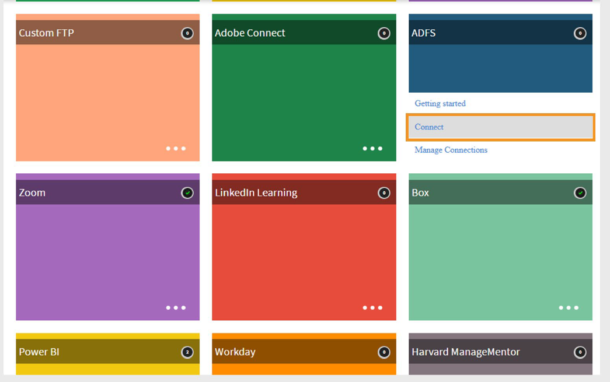
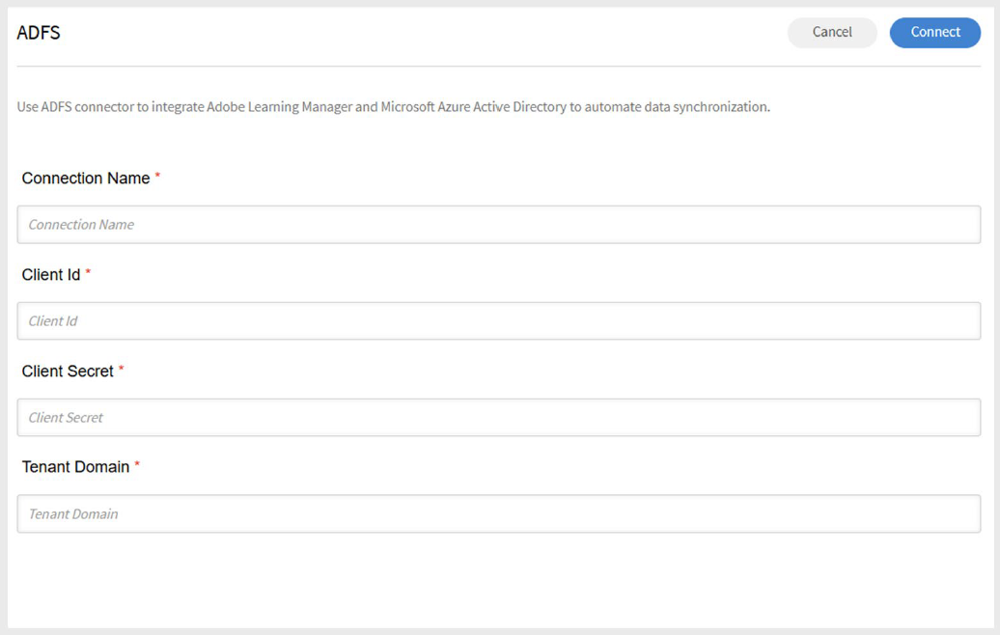

# Adobe Learning ManagerのADFSコネクター

## 概要

Adobe Learning ManagerのADFSコネクターを使用すると、Active Directoryフェデレーションサービス(ADFS)を使用してMicrosoft Azure Active Directoryと統合できます。 この統合により、ユーザーデータをAzure ADからLearning Managerに自動的に同期できます。 属性マッピング、ユーザーフィルタリング、スケジュールされた読み込みなどの機能を備えたこのコネクターを使用すると、ユーザー管理が合理化され、学習者データを正確かつ最新の状態に保つことができます。 これは、IDとアクセスの一元管理をADFSに依存している組織にとって特に便利です。

## 前提条件

Adobe Learning ManagerでADFSコネクタを設定する前に、Azure Portalで次の手順を実行します。

- アプリケーションの登録
- クライアントシークレットの生成
- API権限の設定

### Azureでのアプリケーションの登録

Azureにアプリケーションを登録するには、次の手順を実行します。

1. [Azure Portal](https://portal.azure.com/)にログインします。
2. **Azure Active Directory**&#x200B;に移動します。
3. **追加**&#x200B;を選択し、**アプリの登録**&#x200B;を選択します。
4. アプリケーションの名前を入力して、**登録**&#x200B;を選択します。

### クライアントシークレットの生成

クライアントシークレットを作成するには、次の手順に従います。

1. 新しく登録したアプリで、**証明書とシークレット**&#x200B;に移動します。
2. **新しいクライアントシークレット**&#x200B;を選択します。
3. 説明を追加し、有効期限を&#x200B;**24か月**&#x200B;に設定します。
4. **クライアントシークレット値**&#x200B;を安全な場所に保存してください。

### API権限の設定

API権限を追加するには：

1. **APIのアクセス許可**&#x200B;を選択し、**アクセス許可を追加**&#x200B;を選択します。
2. **Microsoft Graph**&#x200B;を選択し、**アプリケーションのアクセス許可**&#x200B;を選択します。
3. 次の権限を検索して選択します。

   - **Directory.Read.All** – ディレクトリデータの読み取り
   - **User.Read.All** – すべてのユーザーの完全なプロファイルを読み取ります
4. **[アクセス許可の追加]**&#x200B;を選択します。
5. アクセス許可に&#x200B;**管理者の同意**&#x200B;を付与します。

## Learning ManagerでADFSコネクターを設定する

Adobe Learning ManagerでADFSコネクターを設定して、ADFSからユーザーデータを読み込み、ユーザースキルをADFSに書き出し、両方のシステムを最新の状態に保つように自動同期をスケジュールできます。

ADFSコネクタを設定するには：

1. Adobe Learning Managerに統合管理者としてログインします。
2. **ADFS**&#x200B;コネクタタイルにカーソルを合わせます。
3. **Connect**&#x200B;を選択します。

   
   _[接続]を選択してADFSコネクタを構成します_

### 接続詳細を入力

ADFS構成ページで、次の手順を実行します。

1. 次の情報を入力します。

   - 接続名
   - クライアント ID
   - クライアントシークレット

   
   _ADFSを接続するための構成の詳細を入力してください_

2. **Connect**&#x200B;を選択します。
3. Adobe Learning Managerは、Azureポータルから&#x200B;**テナントID**&#x200B;と&#x200B;**プライマリドメイン**&#x200B;を取得し、自動的に設定します。

## ADFSからユーザーをインポートしています

### マップ属性

- 統合管理者は、Adobe Learning ManagerでADFS属性を対応するグループ化可能属性にマッピングできます。
- このマッピングは1回限りの構成であり、以降のすべてのユーザーのインポートで再利用されます。
- 属性マッピングは、必要に応じていつでも変更できます。

### 自動ユーザー読み込み

- Adobe Learning Managerは、スケジュールされた間隔でADFSからユーザーデータを自動的に取得します。
- これにより、複数のシステム間でユーザーレコードの同期を維持できます。

### ユーザーのフィルタリング

- 管理者はフィルターを適用して、読み込まれるユーザーを制限できます。
- 例えば、特定のマネージャーまたは部署の下のユーザーのみを読み込みます。
