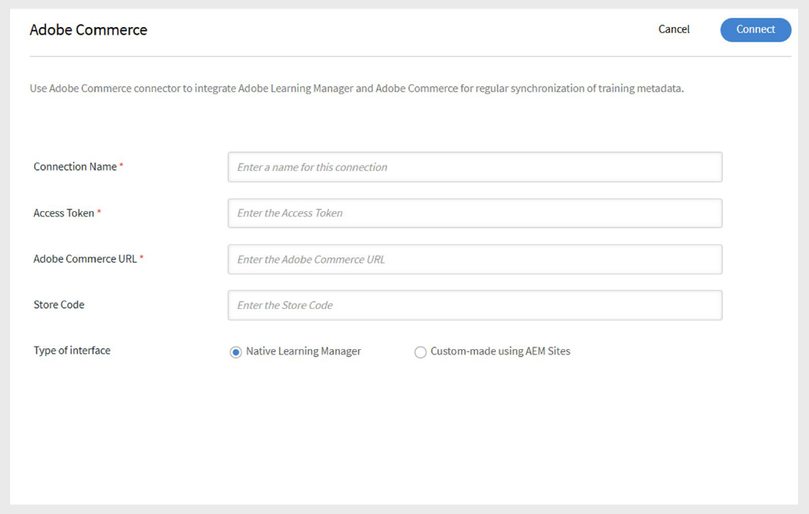

# Adobe Learning ManagerのAdobe Commerceコネクタ

## Adobe Commerce connector

>[!NOTE]
>
>この機能は、Adobe Learning ManagerがAdobe Experience Managerに&#x200B;**アドオン**&#x200B;として販売されている場合にのみ使用できます。 コネクタは、**体験版**&#x200B;アカウントでも有効にすることができます。

Adobe Learning Managerは、拡張性と拡張性に優れたeコマースソリューションであるAdobe Commerceと統合することで、B2BおよびB2Cの顧客向けにマルチチャネルのコマースエクスペリエンスを提供できます。 Adobe Commerceコネクタを使用してAdobe Learning ManagerをAdobe Commerceに接続し、有料トレーニングとeコマース機能を学習プラットフォーム内で有効にします。

コネクターが有効になっている場合、Learning ManagerからAdobe Commerceにトレーニングデータが送信され、学習者はコース、学習パス、資格認定を購入できるようになります。 また、コネクタは購入情報を収集して、トランザクションを検証し、学習者にトレーニングへのアクセスを許可します。

## 前提条件

Adobe Commerceコネクタを設定する前に、次のことを確認してください。

- [RabbitMQ](https://experienceleague.adobe.com/en/docs/commerce-cloud-service/start/overview)またはその他のメッセージングブローカーを有効にします。
- [CRON](https://experienceleague.adobe.com/en/docs/commerce-cloud-service/start/overview#cron_consumers_runner)ジョブを有効にします。

これらを有効にするには、次のファイルを編集します。

- .magento.app.yaml
- .magento/services.yaml
- .magento.env.yaml

その他の設定要件：

- カスタムモジュールを使用して、オプション制限を上書きします。 この手順はオプションですが、大規模なデータセットの場合に推奨されます。
- すべての&#x200B;**非同期API**&#x200B;を有効にします。 大きなトレーニングデータセットは、非同期で書き出されます。 Learning ManagerがAdobe Commerce APIを呼び出すと、コマース側で製品を作成するコンシューマーがリクエストをキューに入れて処理します。 非同期処理は、Adobe Commerceのデフォルトでは使用できないため、有効にする必要があります。
- Adobe Commerceの支払い処理ページで、Learning Managerに&#x200B;**return link**&#x200B;を追加します。
   - 次の[戻り値URL](https://learningmanager.adobe.com/app/learner#/postPayment)を使用する：
- **インデックス**&#x200B;を保存時の&#x200B;**から**&#x200B;スケジュール済み&#x200B;**に変更します。**&#x200B;詳細については、[サポート技術情報](https://experienceleague.adobe.com/en/support?support-tab=home#home)を参照してください。
- 必要な&#x200B;**パッチ**&#x200B;を適用します。 手順については、[修正プログラムのドキュメントを適用する](https://experienceleague.adobe.com/en/docs/commerce-cloud-service/start/overview)を参照してください。
- クラウドインフラストラクチャ（ステージングおよび実稼働環境）でAdobe Commerce用に&#x200B;**Fastly**&#x200B;を構成します。 詳細については、[Fastlyのセットアップ](https://devdocs.magento.com/cloud/cdn/configure-fastly.html)を参照してください。

## コネクターの構成

Adobe Commerceコネクタを設定するには：

1. Adobe Learning Managerに統合管理者としてログインします。
2. **Adobe Commerce**&#x200B;コネクタタイルにカーソルを合わせ、**Connect**&#x200B;を選択します。

   
   _[接続]を選択してAdobe Commerceコネクタを構成します_

3. 次の情報を入力します。

   - 接続名
   - アクセストークン
   - ADOBE COMMERCE URL
   - ストアコード
4. 次からインターフェイスのタイプを選択します。

   - Native Learning Manager
   - AEM Sitesを使用したカスタムメイド

   
   _Adobe Commerceの構成に必要な詳細情報を入力してください_

5. **Connect**&#x200B;を選択します。

## トレーニングの価格を設定

接続が有効になると、次のようになります。

- 作成者は、コース、学習パス、資格認定の価格を設定できます。
- 公開後、学習者はAdobe Learning ManagerまたはカスタムAEMサイトを通じてトレーニングを購入できます。

## 購入フロー

### ネイティブAdobe Learning Manager

- 学習者はAdobe Learning Managerにログインして、コース、学習パス、または資格認定を購入します。
- 学習者が「今すぐ購入」をクリックすると、Adobe Commerceにリダイレクトされ、支払いを完了します。
- 支払い後、学習者はAdobe Learning Managerに戻ってトレーニングを開始するように求められます。
- 学習者が購入を完了するには、Adobe Commerceに個別にログインする必要があります。
- 学習者は、Learning ManagerとAdobe Commerceの両方から購入確認の電子メールを受け取ります。 Adobe Commerceの電子メールは、必要に応じて有効または無効にできます。

### カスタムAEM Sites

カスタムAEMサイトを使用する場合：

- 学習者は、AEMサイトでコースを参照および購入できます。
- AEMサイトでは、Adobe Learning Managerから同期されたメタデータを使用して検索と表示を行います。
- ログインしているユーザーもゲストユーザーも参照できます。 ただし、ログインしているユーザーのみが購入できます。
- ログイン後、学習者はコースをカートに追加し、詳細をプレビューして購入を完了できます。

## Adobe Commerceへのコースの書き出し

### 書き出しをスケジュール

書き出しをスケジュールするには：

1. **トレーニングメタデータの書き出し**&#x200B;を選択し、**スケジュールの構成**&#x200B;を選択します。
2. **「この接続を使用してトレーニングメタデータの書き出しを有効にする」**&#x200B;を選択します。
3. **スケジュールを有効にする**&#x200B;を選択し、**開始日**、**時刻**、および&#x200B;**間隔**&#x200B;を設定します。

   
   _スケジュールされたエクスポートを有効にする_

4. 「**保存**」を選択します。

### オンデマンド書き出し

作成者がトレーニングの価格を設定したら、統合管理者はトレーニングデータを書き出す必要があります。

1. **トレーニングメタデータの書き出し**&#x200B;を選択し、**オンデマンド**&#x200B;を選択します。
2. 日付範囲を選択します。
3. エクスポートする&#x200B;**実行**&#x200B;を選択します。

   
   _オンデマンド書き出しの作成_

4. コースが正常に終了すると、価格設定されたコースとラーニングパスがAdobe Commerceに移動され、購入可能になります。
