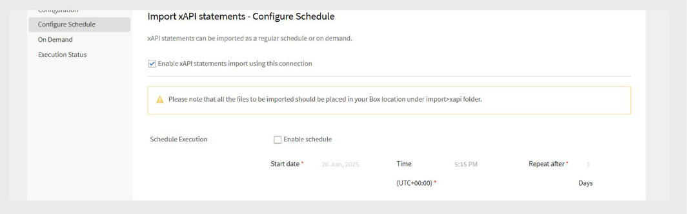

# Adobe Learning Managerのボックスコネクタ

## 概要

Adobe Learning Managerの&#x200B;**Boxコネクター**&#x200B;を使用すると、CSVファイルを介したユーザーデータとラーニングデータの読み込みと書き出しが自動化され、外部システムとのシームレスな統合が可能になります。 外部システムは、Adobe Learning Managerが管理するBoxアカウントの指定されたフォルダーにCSVファイルを配置できます。このアカウントでは、定義されたスケジュールに基づいてCSVファイルが自動的に処理されます。

このコネクタを使用すると、管理者は次の操作を実行できます。

- CSVファイルから内部ユーザーを読み込みます。
- ユーザーのスキルデータと学習者のトランスクリプトを外部システムに書き出します。
- サポートされているサードパーティシステムからxAPIアクティビティステートメントをインポートします。

コネクターは、属性マッピング、スケジュールされた同期、およびオンデマンドの実行をサポートしており、組織がプラットフォーム間で最新のユーザーおよび学習データを維持するのに役立ちます。

## Box コネクターを構成する

Adobe Learning ManagerでBoxコネクターを設定するには：

1. Adobe Learning Managerに統合管理者としてログインします。
2. **ボックス**&#x200B;タイルにカーソルを合わせます。
3. **Connect**&#x200B;を選択します。

   
   _[接続]を選択してBoxコネクタを構成する[接続]を選択してBoxコネクタを構成する_

4. 組織のAdobe Learning Manager Boxアカウントを管理する人のメールアドレスを入力します。
5. **Connect**&#x200B;を選択します。

### アカウントを有効にする

1. Adobe Learning Managerは、指定された電子メールIDにパスワードリセットリンクを送信します。
2. ユーザーは、Boxアカウントに初めてアクセスする前にパスワードをリセットする必要があります。

>[!NOTE]
>
>Adobe Learning Managerアカウントごとに設定できるBoxアカウントは1つだけです。

**概要**&#x200B;ページで、次のアクションから選択します：

- **内部使用のインポート**
- **xAPIアクティビティレポートのインポート**
- **ユーザースキルの書き出し**
- **学習者のトランスクリプトの書き出し**
- **xAPIアクティビティレポートのエクスポート**

Boxコネクターを接続すると、Adobe Learning Managerと外部システム間でデータを同期できるようになります。

## 社内ユーザーの読み込み

ユーザー読み込み機能を使用すると、人事システムやその他の外部ソースからAdobe Learning Managerに従業員データを自動的に同期できます。

### マップ属性

属性マッピングは、外部データとAdobe Learning Managerのサポートされているデータ構造との間に接続を作成し、データが正しいフィールドに配置されるようにします。 この手順は必須です。

属性をマッピングするには：

1. Boxコネクタページで&#x200B;**社内ユーザー**&#x200B;を選択します。
2. **列マッピング**&#x200B;を選択します。
3. **マップの属性**&#x200B;ページで、次の操作を行います。
   - 左側には、Adobe Learning Managerの必須フィールドが表示されます。
   - 右側には、CSVの列名が表示されます。 最初は、この側には空のドロップダウンが含まれています。
   - 「**CSVを選択**」を選択して、サンプルCSVファイルをアップロードします。 これにより、右側のドロップダウンにCSVからの列名が入力されます。 サンプルCSVを取得するには、[この記事](https://experienceleague.adobe.com/ja/docs/learning-manager/using/integration/migration-manual#csv)を参照してください。
   - 各Adobe Learning Managerフィールドを対応するCSV列にマッピングします。

   
   _左側にAdobe Learning Managerフィールドが表示され、右側にCSV列ドロップダウンが表示された属性マッピングインターフェイス_

4. 「**保存**」を選択して、マッピングを完了します。

保存後、設定したアカウントが管理者アプリのデータソースとして表示されます。 その後、管理者は読み込みをスケジュールしたり、手動同期をトリガーしたりできます。

### xAPIステートメントの読み込み

xAPIステートメントの読み込みにより、外部学習データをAdobe Learning Managerに取り込むことで、詳細な学習アクティビティトラッキングが可能になります。

_ソースの構成_

xAPIソース設定により、外部学習システムとAdobe Learning Managerのアクティビティトラッキング間の接続が確立されます。

ソースを構成するには：

1. xAPI構成セクションに移動します。
2. 構成の一覧で&#x200B;**新しい構成の追加**&#x200B;を選択します。
3. **名前**&#x200B;と&#x200B;**ソースファイル名**&#x200B;を入力してください。
   - 名前：このxAPIソースを表す識別子（LMS統合、外部トレーニングシステムなど）。
   - ソースファイル名： Boxフォルダーにアップロードされる正確なファイル名（ファイル拡張子を含めて、正確に一致する必要があります）。

   
   _名前フィールドとソースファイル名フィールドを示す構成フォーム_

4. **保存**&#x200B;を選択して、基本的な構成を作成します。

_フィルターの追加（オプション）_

フィルターを使用すると、特定の条件に基づいてxAPIステートメントを選択的に読み込むことができます。

ソースのフィルタを追加するには、次の手順に従います。

1. 左側のウィンドウで[**フィルター**]を選択します。
2. **[新しいフィルターの追加]**&#x200B;を選択します。
3. 次の設定を行います。
   - **名前：**&#x200B;フィルタルールの記述名です。
   - **条件：**&#x200B;比較演算子（等しい、含む、より大きい、など）。

   
   _名前フィールドと条件フィールドを表示するフィルター作成ダイアログ_

4. **新しいフィルターを追加**&#x200B;を選択して、さらにフィルターを追加します。
5. 必要に応じて、**アクション**&#x200B;列で「**保存**」または「**削除**」を選択します。
6. フィルターを追加したら、**[保存]**&#x200B;を選択します。

## 読み込みのスケジュール

スケジュールの自動設定により、手作業を必要とせずに一貫したデータ同期が可能になり、現在の学習活動の記録が維持されます。

インポートをスケジュールするには、次の手順に従います。

1. 左側のウィンドウで[**スケジュールの構成**]を選択します。

   
   _有効なオプションとタイミング制御を示すスケジュール構成ページ_

2. **この接続を使用してxAPIステートメントインポートを有効にする**&#x200B;を選択してください。
3. 自動インポートを設定するには、**[スケジュールの有効化]**&#x200B;を選択します。
4. 次のスケジュール・パラメータを設定します。

   - **開始日：**&#x200B;スケジュールされたインポートをいつ開始するか。
   - **時刻：**&#x200B;インポートを実行する時刻です。
   - **後に繰り返す：**&#x200B;インポートを実行する頻度（毎日、毎週、カスタム間隔）。
5. 「**保存**」を選択します。

## オンデマンドで実行（オプション）

オンデマンド実行では、通常のスケジュールされた操作の外に即座にデータをインポートできます。

オンデマンドインポートを使用する場合：

- スケジュールを設定する前に新しい構成をテストします。
- 緊急または時間に依存するデータ更新を処理しています。
- 1回限りのデータ移行または修正を処理します。
- 読み込みの問題のトラブルシューティング

xAPIステートメントを手動で読み込むには：

1. 左側のウィンドウで[**オンデマンド**]を選択します。
2. 「**実行**」を選択します。

## 実行ステータスの表示

ステータス監視により、インポート操作をプロアクティブに管理し、問題を迅速に特定できます。

実行ステータスを表示するには、次の手順に従います。

1. すべてのインポート実行の一覧を表示するには、**実行ステータス**&#x200B;を選択します。
2. ステータスページには、次が表示されます。

   - **開始日：**&#x200B;インポート操作が開始された日時
   - **期間：**&#x200B;処理に必要な合計時間
   - **インポートの種類：**&#x200B;インポートがスケジュールされているかオンデマンドか
   - **現在の状態：**&#x200B;リアルタイムの状態情報
      - **処理中：**&#x200B;現在実行中のインポート
      - **完了：**&#x200B;レコードカウントを使用した正常な完了
      - **失敗：**&#x200B;診断情報でエラーが発生しました
