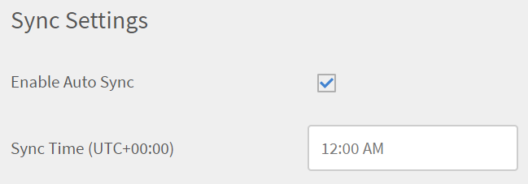

# CSV ファイルを使用したカスタムの役割の管理

統合管理者は CSV を使用して、複数のカスタムの役割を自分のアカウントにまとめて追加することも、複数のユーザーにカスタムの役割を割り当てることもできます。この方法はカスタムの役割を作成するプロセスを自動化します。

役割の設定は Learning Manager FTP コネクターおよび Box コネクターを使用して行うことができます。

Boxストレージアカウントにログインした後、統合管理者は次のcsvをアカウントに追加できます。

* user.csv
* role.csv
* user_role.csv

操作を開始するには、csv をダウンロードして、必要に応じて値を変更します。

* サンプルファイル： [role.csv](assets/role.csv)
* サンプルファイル： [user_role.csv](assets/user_role.csv)

**role.csv**

<table>
 <tbody>
  <tr>
   <td>
    <p><b>列名</b></p></td>
   <td>
    <p><b>説明</b></p></td>
   <td>
    <p><b>サンプル値</b></p></td>
  </tr>
  <tr>
   <td>
    <p>Name（名前）</p></td>
   <td>
    <p>ユーザーに割り当てる役割を特定します。</p></td>
   <td>
    <p>セールスの作成者</p></td>
  </tr>
  <tr>
   <td>
    <p>&lt;Entity&gt;（&lt;エンティティ&gt;）</p></td>
   <td>
    <p>コース、カタログなどのエンティティタイプごとにアクセスタイプ(FULL、WRITE、ENROLL、REPORT、NONE)を特定します。</p></td>
   <td>
    <p>完全</p>
    <p>なし</p>
    <p>書き込み | レポート</p>
    <p>列名は、カタログ、コース、学習プランなど、エンティティタイプに対応しています。</p>
    <p>CSV にはエンティティタイプごとに 1 つの列が表示されます。権限が付与されないエンティティの値は「なし」と表示されます。</p></td>
  </tr>
  <tr>
   <td>
    <p>Catalog Scope Specifier（カタログ範囲の指定子）</p></td>
   <td>
    <p>単一のカタログ名またはパイプ（|）区切りで一覧表示されるカタログ名は、この役割の範囲を決定します。</p></td>
   <td>
    <p>セールスカタログ | 一般カタログ</p></td>
  </tr>
  <tr>
   <td>
    <p>ユーザーグループスコープ指定子</p></td>
   <td>
    <p>ユーザーグループ属性の名前と値は、この役割のユーザー範囲を決定します。</p>
    <p>範囲については、以下の節を参照してください。</p></td>
   <td>
    <p>場所=ロンドン</p></td>
  </tr>
  <tr>
   <td>
    <p>説明</p></td>
   <td>
    <p>オプションの説明です。役割の目的について理解するため、ユーザーに今後参照してもらうことを目的としています。</p></td>
   <td>
    <p>セールスカタログの LO にフルアクセスして作成可能</p></td>
  </tr>
 </tbody>
</table>

「説明」以外のすべての列は必須です。

## ユーザーグループの範囲の定義 {#definescopeofusergroups}

様々なタイプのユーザーグループの範囲は、以下に基づいて指定できます。

* ユーザーグループ名（すべての作成者、マイカスタムグループなど）
* リーフ属性および値（Department=HR など）
* セルフ登録プロファイルグループ（self_registration=profilename）
* 社外登録プロファイルグループ（ext_registration=profilename）
* マネージャーの直属の報告者のチーム(manager_direct=`<emailid>`)
* マネージャーの完全な組織(manager_org=`<emailid>`)

**user_role.csv**

<table>
 <tbody>
  <tr>
   <td>
    <p><b>列名</b></p></td>
   <td>
    <p><b>説明</b></p></td>
   <td>
    <p><b>コメント</b></p></td>
  </tr>
  <tr>
   <td>
    <p>Id</p></td>
   <td>
    <p>設定可能な役割を割り当てるユーザーの電子メール ID。</p></td>
   <td>
    <p>設定可能な役割がユーザーに既に割り当てられている場合、その役割が CSV に指定された新しい役割によって置き換えられます。エラーは報告されません。</p></td>
  </tr>
  <tr>
   <td>
    <p>CustomRole（カスタムの役割）</p></td>
   <td>
    <p>ユーザーに割り当てる設定可能な役割の名前。</p></td>
   <td>
    <p>役割の名前は CSV に指定されている既存の役割である必要があります。管理者によって UI を使用して作成された役割を使用することができます。</p></td>
  </tr>
 </tbody>
</table>

**完全な範囲機能**

以下に示すいずれかの機能に完全な権限が割り当てられると（アカウントレベル機能）、ユーザーグループの範囲およびカタログの範囲は自動的に「完全」に設定されます。これらの機能に対する制限付きアクセスをユーザーに設定することができないためです。

CSV にカタログ名やユーザーグループ名を指定すると、これらは「完全」な権限によって上書きされます。

* アナウンス
* スキル
* ゲーミフィケーション
* ユーザー
* 学習プラン
* 電子メールテンプレート

## アカウントにロールのCSVを追加 {#addtherolecsvsintheaccount}

Box アカウントを使用して、**Import > user > internal** を選択し、files- role.csv と user_role.csv をアップロードします。

* role.csvおよびuser_role.csvは、フォルダー&#x200B;**Import** > **user** > **internal** > **user_role**&#x200B;にコピーする必要があります。
* user.csvは、フォルダー&#x200B;**Import** > **user** > **internal**&#x200B;にコピーする必要があります。

両方のCSVはBox経由でのみアップロードする必要があり、UIを介してアップロードすることはできません。

>[!NOTE]
>
>ユーザーのCSVファイルは必須ですが、カスタムの役割のCSVはオプションです。 csv ファイルに存在するすべてのファイルが処理され、その他のファイルはスキップされます。

csv ファイルを使用して作成されたカスタムの役割は管理者の UI に表示されません。これらの役割は、UI によって作成された（または後で作成された）役割と関連付けられることも、影響を受けることもありません。

CSVで作成されたカスタムの役割は、CSV自体で完全に管理できます。 これには、ロールの追加、変更、および削除が含まれます。

役割の割り当ては、user_role csv から割り当てエントリを削除することで取り消すことができます。ただし、管理者の UI を使用して行われた割り当てはこの操作の影響を受けません。

カスタムの役割を割り当ておよび取り消すには、csv ファイルを更新します。

## カスタムの役割の同期 {#synchronizationofcustomroles}

統合管理者が役割ベースの CSV をコネクタストレージにアップロードすると、管理者は CSV との同期を有効にできます。カスタムの役割が CSV でアップロード、追加、削除されるたび、管理者はファイル内の情報を同期して、役割のリストを最新の状態にすることができます。

管理者パネルの[はじめに]ページで、**[!UICONTROL 設定]** > **[!UICONTROL データソース]**&#x200B;をクリックします。

「同期設定」セクションで、「**[!UICONTROL 自動同期を有効にする]**」オプションを有効にします。



*「自動同期を有効にする」オプションを選択します*

このオプションを選択すると、「同期時間」フィールドに指定した時間に同期を正確にスケジュールできます。同期時刻を午前12:00に指定した場合、カスタムの役割は毎日指定された時刻に更新されます。

データをオンデマンドで同期する場合は、「**[!UICONTROL 今すぐ同期]**」をクリックします。

## ロール設定時の制約 {#constraintswhileconfiguringroles}

すべてのアカウントにおいて役割の名前は一意である必要があります。したがって、UI または CSV で作成する役割の名前は、UI または CSV で既に作成されている別の役割の名前と異なる必要があります。

また、CSV で作成した設定可能な役割を、管理者の UI からユーザーに割り当てることはできません。これらの役割を使用することはできません。

ただし、ユーザー割り当ての CSV を使用して、UI で作成した役割の割り当てを行うことはできます。

## カスタムの役割の増分および複数増分のサポート

管理者は、増分ユーザーにカスタムの役割をより効率的に割り当てることができます。 データセット全体を毎回アップロードし直す必要なく、ユーザー、ロール、およびユーザーロールのデータをアップロードできます。

アップロードされたユーザー読み込みファイルごとに、次の構造を使用してFTPで個別のフォルダーを作成します。

```
import/user/internal/
     user1.csv
     user2.csv
     user3.csv

UserRole/
    user1_role.csv
    user1_user_role.csv
    user2_role.csv
    user2_user_role.csv
    user3_role.csv
    user3_user_role.csv
```

**ファイルの詳細**

* ユーザーのインポートファイル: user1.csv
* 役割ファイル： user1_role.csv
* ユーザーの役割のマッピングファイル： user1_user_role.csv

[サンプルCSV](/help/migrated/assets/sample-csv-Incremnetal.zip)をこちらからダウンロードしてください。

各ユーザーインポートファイルは、対応する役割およびユーザー役割マッピングファイルと直接リンクされており、適切な増分処理が保証されます。
