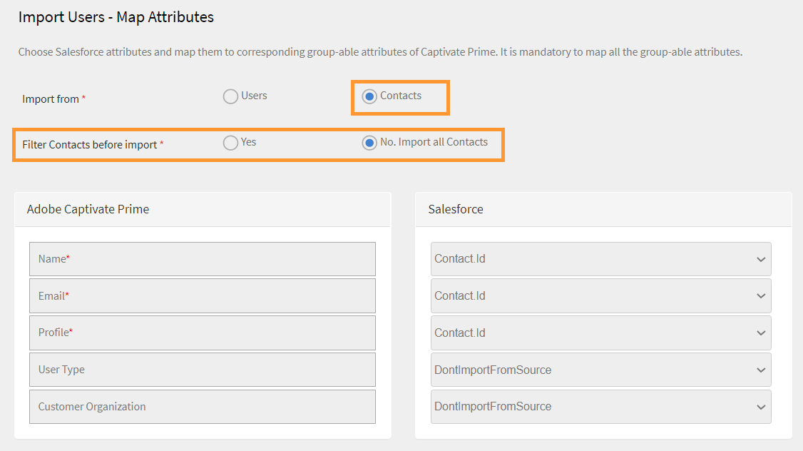
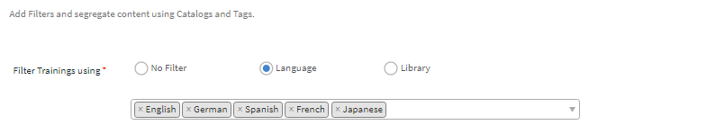
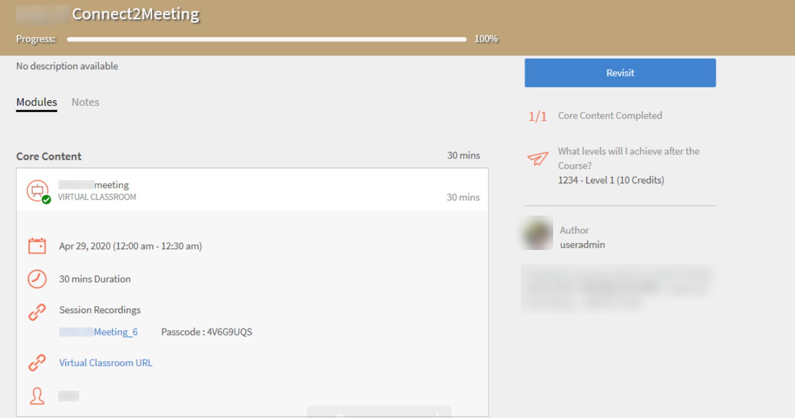

# Learning Manager コネクタ

企業には、Learning Manager と統合する必要がある他のアプリケーションやシステムがあります。コネクターは、外部システムからLearning Managerにデータを読み込むなど、データベースの統合を実行するのに役立つユーティリティです。  また、Learning Managerから外部システムへのデータの書き出しも実行します。

Learning Manager は Salesforce および FTP コネクタを提供します。 Salesforce コネクターを使用すると、組織の統合管理者は Salesforce アプリケーションと Learning Manager を統合できます。統合者は、FTP コネクタを使用して、一連のユーザーをエンタープライズアプリケーションに自動読み込みすることもできます。

Learning Manager では、Lynda、getAbstract、Harvard Management System 用のコネクターも利用できます。これらのコネクタにより、学習者は Lynda.com、getAbstract および Harvard ManageMentor のコースにアクセスして利用できます。

これらのコネクターを設定し、Learning Manager で使用する方法については、以下の説明を参照してください。

<!--
>[!NOTE]
>
>**Update:** December 2020 update of Learning Manager
>
>For **FTP**, **Box**, and **Custom FTP** connectors, while exporting Learner Transcript or xAPI, you can also export the data as a **zip** file, for:
>
>* Learner Transcripts
>* xAPI
-->

>[!NOTE]
>
>2022年11月リリースのAdobe Learning Managerでは、Zoomは2023年6月までの[JWT認証](https://marketplace.zoom.us/docs/guides/auth/jwt/)を廃止しました。 このため、JWT を使用した Zoom コネクターは前述の期日まで利用可能ですが、アカウントの機能を置き換えるためにサーバー間 OAuth アプリを作成することをお勧めします。新しい接続では、デフォルトで Zoom OAuth 認証が使用されます。

## Salesforce コネクタ {#sfconnector}

Salesforce コネクターは Learning Manager アカウントと Salesforce アカウントを接続して、データを自動的に同期します。Salesforceコネクターの機能は次のとおりです。

### マップ属性 {#map-attributes}

統合管理者は Salesforce の列を選択し、それらを対応する Learning Manager のグループ化可能属性にマッピングできます。マッピングが完了すると、それ以降のユーザーの読み込みでは同じマッピングが使用されます。管理者がユーザーを読み込むために別のマッピングを使用したい場合は、再設定できます。

### 自動ユーザー読み込み {#automated-user-import}

ユーザー読み込みプロセスにより、Learning Manager 管理者は Salesforce から従業員の詳細を取得し、その情報を Learning Manager に自動的に読み込ませることができます。この自動化により、CSV の作成および Learning Manager へのアップロードに伴う手作業を省略できます。

### 自動スケジュール {#auto-schedule}

自動ユーザー読み込み機能と同時に自動スケジュール設定機能を使用すると、相乗効果を期待できます。Learning Manager 管理者は、組織のニーズに応じてスケジュールを設定できます。Learning Managerアプリケーションのユーザーは、スケジュールに従って最新の状態にすることができます。 Learning Manager アプリケーションで、同期が毎日実行されます。

### ユーザーのフィルタリング {#filtering-user}

Learning Manager 管理者は、読み込む前にユーザーにフィルタリングを適用できます。例えば、Learning Manager 管理者は、階層内のすべてのユーザーを 1 人以上の特定のマネージャーの管理下に読み込めます。

### Salesforce コネクターを構成する {#configuresalesforceconnector}

SalesforceとLearning Managerを統合するためのプロセスを学びましょう

#### 前提条件 {#prerequisites}

まず Salesforce 組織の URL が手元にあることを確認してください。例えば、組織名が&#x200B;**myorg**&#x200B;の場合、SalesforceのURLは`https://myorg.salesforce.com`になります。 Salesforce アカウントを Learning Manager に接続するために入力が必要な項目は、組織名のみです。

また、アカウントにログインできる適切な資格情報が手元にあることも確認してください。

#### 接続の作成 {#createaconnection}

1. Learning Manager のホームページで、Salesforce カード / サムネイルの上にカーソルを移動します。メニューが表示されます。 メニューの&#x200B;**[!UICONTROL 接続]**&#x200B;項目をクリックします。

   

   *接続オプション*

1. 組織の URL を入力するように促すダイアログが表示されます。 URLを入力した後、**[!UICONTROL [接続]]**&#x200B;をクリックします。
1. 接続が成功すると、概要ページが表示されます。

### マップ属性 {#mapattributes}

接続が正常に確立されたら、Salesforceの列をLearning Managerの対応する属性にマッピングできます。 この手順は必須です。

1. マッピングページの左側にはLearning Managerの列が表示され、右側にはSalesforceの列が表示されます。 Learning Managerの列名にマッピングする適切な列名を選択します。

   
   *マップ属性*

   >[!NOTE]
   >
   >左側に表示されているLearning Managerの列データは、アクティブフィールドから取得されます。 **manager**&#x200B;フィールドは、電子メールアドレスの種類のフィールドにマップする必要があります。 コネクタを使用する前に、すべての列をマッピングすることが必須です。

1. マッピングが完了したら、**[!UICONTROL [保存]]**&#x200B;をクリックします。
1. これでコネクタは使用可能になりました。管理者アプリ内で設定され、データソースとして表示されるアカウント。管理者は読み込みのスケジュール、またはオンデマンド同期のスケジュールができます。

## Salesforce コネクターの使用 {#usingsalesforceconnector}

Salesforce コネクターは Salesforce.com に接続して、設定どおりにユーザーを取得し、ユーザーを Learning Manager に追加します。

### Salesforce の連絡先からユーザーの読み込み {#import-salesforce-contacts}

Learning Manager は、Salesforce コネクターを拡張して、連絡先と Salesforce ユーザーを取得し、その情報を Learning Manager に自動的にインポートします。

Salesforceコネクタページで、SalesforceのURLを入力し、認証を完了します。 認証が完了したら、ユーザーまたは連絡先の読み込みに進みます。 「連絡先」オプションを選択した場合は、読み込む連絡先のサブセットを指定します。

Salesforceの列を選択し、対応するLearning Managerのグループ化可能属性にマッピングできます。 マッピングが完了すると、それ以降のユーザーの読み込みでは同じマッピングが使用されます。

1. Salesforceにログインします。
1. 接続ページで、[**[!UICONTROL 社内ユーザーのインポート]**]をクリックします。

   
   *社内ユーザーのインポート*

1. **ユーザーの読み込み**&#x200B;ページに、新しいオプションの連絡先があります。 ラジオボタン&#x200B;**連絡先**&#x200B;をクリックすると、次のオプションが表示されます。

   
   *連絡先の属性をマップする*

1. **[!UICONTROL はい]**&#x200B;をクリックすると、次の操作を実行できます。

   * **連絡先列を選択：** Learning Managerに読み込むフィールドを選択します。
   * **値の指定：**&#x200B;選択したフィールドを表す値を選択します。

   
   *値の指定*

   * Salesforceの列をLearning Managerの列にマッピングします。
   * 読み込みを開始するには、[**[!UICONTROL 保存]**]をクリックします。

1. [**[!UICONTROL いいえ]をクリックした場合 すべての連絡先]**&#x200B;をインポートすると、連絡先をフィルターせずにフィールドを直接マップできます。 ここでは、Salesforceからすべての連絡先を読み込みます。
1. 読み込みを開始するには、[**[!UICONTROL 保存]**]をクリックします。

## 学習記録の書き出し {#export-learning-records}

Learning Managerでは、トランスクリプト、ユーザーレポート、スキルレポートなどの学習記録をSalesforceに書き出すことができます。 書き出したデータを、Salesforceの「ユーザー」テーブルまたは「連絡先」テーブルにリンクするかどうかを指定できます。

*学習記録の書き出し*

### Salesforce のカスタムオブジェクト {#custom-objects-in-salesforce}

Learning Managerから学習記録を書き出すには、Salesforceでカスタムオブジェクトを作成する必要があります。 カスタムオブジェクトとは、会社や業界固有の情報を保存するために作成するオブジェクトです。 詳細については、「[Salesforce カスタムオブジェクト](https://trailhead.salesforce.com/en/content/learn/modules/data_modeling/objects_intro)」を参照してください。

次の方法でオブジェクトを作成します。

1. パッケージをダウンロードしてインストールし、カスタムオブジェクトを作成します。

   * [パッケージ 1](https://test.salesforce.com/packaging/installPackage.apexp?p0=04t1k0000008WPJ)
   * [パッケージ 2](https://test.salesforce.com/packaging/installPackage.apexp?p0=04t1k0000008WPT)
   * [パッケージ 3](https://test.salesforce.com/packaging/installPackage.apexp?p0=04t1k0000008WPi)

1. Salesforce のカスタムオブジェクト名を変更します。
1. イベントを選択し、**[!UICONTROL 「保存」]**&#x200B;をクリックします。

>[!NOTE]
>
>パッケージのインストール後に追加したすべてのアクティブフィールドに対して、システム管理者アクセス権が付与されていることを確認してください。

**イベントのリンク先：**&#x200B;書き出すセクション（ユーザーまたは連絡先）を選択します。 「連絡先」オブジェクトを選択すると、Learning Managerに存在するがSalesforceには存在しないユーザーがSalesforceで作成されます。

*イベントのリンクオプション*

>[!NOTE]
>
>1 つのアカウントで複数の接続を作成できます。 Salesforce では、1 つの接続に最大 3 つのカスタムオブジェクトを使用できます。 1 つの Salesforce アカウントに複数の接続を作成する場合は、パッケージを 3 個インストールする必要があります。 対応できるパッケージ数は最大 3 個です。
>
>作成する接続の数に応じて、パッケージをインストールする必要があります。

>[!NOTE]
>
>Salesforce の実行ステータスページでは、Salesforce から処理されたレコードの数のみ確認できます。 処理されたレコードのいずれかに、部分的な書き出しやエラーが発生した場合でも、Learning Managerではステータスが完了済みと表示されます。

## Salesforce パッケージのインストール {#install-salesforce-package}

Learning ManagerはSalesforceアプリケーションパッケージを提供します。 SFDC にインストールして設定すると、セールス社員は SFDC ポータル内でトレーニングアクティビティを実行できるようになります。 このアプリから、SFDC ユーザーは新しいトレーニングを調べ、推奨事項を表示し、SFDC ポータル内ですぐに実行できます。 また、管理者からのアナウンスを、SFDCポータル内のアプリにマストヘッド形式で表示できます。

### Learning Manager アプリケーションで設定 {#setup-in-learning-manager-app}

1. 自分の Learning Manager 管理者アカウントに、統合管理者としてログインします。
1. **[!UICONTROL アプリケーション]** > **[!UICONTROL おすすめアプリ]**&#x200B;をクリックします。
1. **[!UICONTROL Salesforce]**&#x200B;をクリックします。
1. Salesforceアプリケーションページで、説明に記載されているアプリケーションID（クライアントIDとも呼ばれます）とクライアントシークレットを確認します。
1. 「**[!UICONTROL 承認]**」をクリックすると、アプリが正常に承認されます。
1. **[!UICONTROL 開発者向けリソース]** > **[!UICONTROL テストおよび開発用のアクセストークン]**&#x200B;をクリックします。
1. 「OAuthコードを取得」セクションで、クライアントIDとスコープを「admin:read,admin:write」に設定します。 「**[!UICONTROL 送信]**」をクリックします。
1. 「更新トークンを取得」で、クライアント ID とクライアントシークレットを入力します。 **[!UICONTROL [送信]]**&#x200B;をクリックして、更新トークンを確認します。

### Salesforce アプリでのアカウントの作成 {#create-account-in-salesforce-app}

1. Salesforce のサインアップページでアカウントを作成します。 Salesforceアカウントは、開発者版またはエンタープライズ版で作成する必要があります。  [開発者サインアップURL](https://developer.salesforce.com/signup)。 Salesforceへのサインアップには、Learning Managerで使用した電子メールIDを使用する必要があります。
1. 確認用の電子メールからアカウントを確認します。
1. パスワードを作成し、Salesforce にサインインします。
1. ログイン後にSalesforceのURLに注意してください(例：site.lightning.force.com)

### Learning Manager パッケージのインストール {#install-learning-manager-package}

パッケージをインストールする場合、まず Salesforce で既存のパッケージを削除する必要があります。 アンインストールする前に、次のように設定を有効にする必要があります。 パッケージのインストールには、これらの設定の適用が必須です。

>[!NOTE]
>
>Adobe Learning Managerアプリは、Salesforce Lightningビューでのみサポートされています。

1. [Learning ManagerパッケージのURL](https://login.salesforce.com/packaging/installPackage.apexp?p0=04t1k0000008WOQ)を起動します。
1. **ログイン**&#x200B;ページで、[**[!UICONTROL カスタムドメインを使用]**]をクリックします。
1. パッケージのURLを入力し、**[!UICONTROL [続行]]**&#x200B;をクリックします。 インストールページで「管理者のみにインストール」オプションを選択している必要があります。 このオプションは変更しないでください。
1. [**[!UICONTROL インストール]**]をクリックします。 パッケージがインストールされたら、[**[!UICONTROL 完了]**]をクリックします。 インストール済みパッケージページが表示され、Adobe Learning Manager のインストール済みパッケージが表示されます。
1. 設定の横にある App Launcher に移動して「Adobe Learning Manager」を検索します。
1. アプリを構成するには、[**[!UICONTROL 構成]**]をクリックします。
1. **[!UICONTROL 新規]**&#x200B;をクリックして、次の詳細を追加します：

   * **Config：**&#x200B;任意の名前を入力します。
   * **ClientID**：最初のセクションで取得した値を入力します。
   * **ClientSecret:**&#x200B;最初のセクションで取得した値を入力します。
   * **RefreshToken:**&#x200B;最初のセクションで取得した値を入力します。
   * **LearningManagerBaseURL:** Learning ManagerがホストされているサイトのURLです。

### リモートサイトの設定の追加 {#add-remote-site-settings}

1. ページの右上隅で、[**[!UICONTROL セットアップ]**]をクリックします。
1. **[!UICONTROL クイック検索]**&#x200B;で、リモートサイトの設定を検索します。
1. **[!UICONTROL 新しいリモートサイト]**&#x200B;をクリックします。
1. 詳細を入力します：

   * **リモートサイト名：**&#x200B;任意の名前を入力します。
   * **リモートサイトの URL：** Learning Manager がホストされているサイトの URL です。

1. Learning Manager を起動します。

### Learning Managerアプリの通知を有効にする {#enable-notifications-for-learning-manager-app}

1. 右上隅の[**[!UICONTROL セットアップ]**]をクリックします。
1. カスタム通知を検索します。
1. [**[!UICONTROL 新規]**]をクリックします。
1. 次の情報を入力します。

   1. **カスタム通知名：** LearningManagerNotification
   1. **API名：** LearningManagerNotification

1. **デスクトップ**&#x200B;と&#x200B;**モバイル**&#x200B;の両方を、サポートされているチャネルとして選択してください。

1. **[!UICONTROL 「保存」]**&#x200B;をクリックします。
1. モバイルデバイスのプッシュ通知を有効にするには、次の手順に従います：

   1. 携帯電話に Salesforce モバイルアプリをインストールします。
   1. 資格情報を使用してアプリにログインします。
   1. **セットアップ**/**通知配信設定**&#x200B;に移動します。
   1. iOS および Android 用の Salesforce を追加します。

### Salesforce からの Learning Manager のアンインストール

1. Salesforceアプリで「インストール済みパッケージ」に移動します。
1. 「**[!UICONTROL アンインストール]**」をクリックします。

## Salesforce ユーザー用の学習マネージャーの設定 {#configure-learning-manager-for-salesforce-users}

Learning Manager アプリは、Salesforce アカウント内のユーザーも利用できます。Salesforce 管理者は、プロファイルに基づいてユーザーを追加できます。 Salesforce プロファイルは、Learning Manager のプロファイルと類似しています。たとえば、管理者、統合管理者、インストラクターなどです。 Salesforce 管理者は、カスタムのプロファイルも作成できます。

Salesforce 管理者は、ユーザーにプロファイルを割り当てるか、カスタムのプロファイルを作成することができます。

パッケージをインストールする際に、Salesforce のプロファイルを学習者に割り当てることができます。

パッケージをインストールしてから、プロファイルを構成する必要があります。

**[!UICONTROL Configure]** > **[!UICONTROL New]**&#x200B;をクリックし、次の項目を追加します。

* 構成名
* ClientID
* ClientSecret
* LearningManagerBaseURL
* リダイレクトの無効化

>[!NOTE]
>
>学習者がLearning Managerアプリを表示できるようにするために、すべての学習者に対してアプリを有効にする必要があります。

次に、Learning Manager アプリにアクセス権を付与します。

*Learning Managerアプリにアクセスするための権限を設定*

ユーザーを選択し、アクセス権を割り当てます。 これで、学習者が Learning Manager アプリにアクセスできるようになりました。

次に、プロファイル（ユーザーの標準プロファイルなど）を選択し、そのプロファイルをクリックします。 **[!UICONTROL [編集]]**&#x200B;をクリックし、**[カスタムアプリ設定]**&#x200B;セクションで&#x200B;**[Adobe Learning Manager]**&#x200B;のチェックボックスをオンにします。 これにより、ユーザーがアプリにアクセスできるようになりました。

**カスタムタブ設定**&#x200B;セクションの&#x200B;**「学習者ホーム」**&#x200B;ドロップダウンリストで、**「デフォルトでオン」**&#x200B;オプションを選択します。

すべてのプロファイルに対して、アプリを表示可能にすることが必要です。

**[!UICONTROL 「保存」]**&#x200B;をクリックすると、すべてのプロファイルに属する学習者がLearning Managerアプリにアクセスできます。

### 学習パス関連の変更点 {#learning-path-changes}

#### 既存の接続 {#existing-connections}

管理者アカウントで「学習パス」オプションが無効になっている場合、レポートに行や列は追加されません。

管理者アカウントで「学習パス」オプションが有効になっている場合、学習者が登録された場合に備えて「タイプ」列に学習パスが入力されます。

>[!NOTE]
>
>このフラグを有効にして既存の接続を使用すると、いくつかのレコードが失われる可能性があります。

#### 新しい接続 {#new-connections}

管理者アカウントで「学習パス」オプションが無効になっている場合、トレーニングレポートには以下の列が表示されますが、データは含まれません。

* **埋め込みパス：**&#x200B;埋め込み学習プログラムの名前が表示されます。
* **埋め込みパスの ID：**&#x200B;埋め込み学習プログラムの ID が表示されます。
* **埋め込みコースのID :**&#x200B;学習パスに含まれるコースのIDが表示されます。

また、学習パスが有効になっているアカウントでの新しい接続では、3 つの新しい列が表示され、すべてのデータが取り込まれます。

さらに、このレポートでは、学習パスに登録されているすべての学習者の「タイプ」列に「学習パス（上位レベル）」が含まれます。

「タイプ」列では「学習プログラム」の名前が「学習パス」に変更されます。 既存の接続の場合は、変更はありません。

## Learning Manager FTP コネクタ {#ftpconnector}

FTP コネクターを使用すると、Learning Manager を任意の外部システムと統合して、データ同期を自動化できます。外部システムがデータを CSV 形式で書き出し、そのデータを Learning Manager FTP アカウントの適切なフォルダーに配置できることが期待されています。FTPコネクタの機能は次のとおりです。

Boxコネクターを使用して、データの移行、ユーザーの読み込み、データの書き出しをおこなうこともできます。 詳しくは、 Boxコネクタを参照してください。

### データの読み込み {#data-import}

ユーザー読み込みプロセスにより、Learning Manager管理者はLearning Manager FTPサービスから従業員の詳細を取得し、その情報をLearning Managerに自動的に読み込ませることができます。 この機能を使用すると、それらのシステムによって生成された CSV を FTP アカウントの適切なフォルダーに配置することによって、複数のシステムを統合できます。Learning ManagerはCSVファイルを取得し、ファイルを結合して、スケジュールに従ってデータを読み込みます。 詳細については、「スケジュール」機能を参照してください。

**マップ属性**

統合管理者はCSVの列を選択し、その列をLearning Managerのグループ化可能属性にマッピングできます。 このマッピングには時間がかかります。 マッピングがされると、それ以降のユーザーの読み込みでは同じマッピングが使用されます。管理者がユーザーを読み込むための別のマッピングが必要な場合は、マッピングを再構成できます。

#### データの書き出し {#export-data}

データの書き出しでは、あらゆるサードパーティー製のシステムに統合するためにユーザーがユーザースキル、学習者のトランスクリプトを FTP の場所に書き出すことができます。

#### スケジューリング {#scheduling}

管理者は、組織の要件に応じてタスクをスケジュール設定できます。Learning Managerアプリケーション内のユーザーは、スケジュールに従って最新の状態になります。 同様に、統合管理者は、外部システムと統合されるようにスキルの書き出しをスケジュールすることができます。 Learning Managerアプリケーションで同期を毎日実行できます。

### Learning Manager FTP コネクターを構成する {#configure-captivate-prime-ftp-connector}

FTPコネクターとLearning Managerを統合するためのプロセスを学びましょう。

#### 接続の作成 {#Create-a-connection-1}

1. Learning Managerホームページで、FTPカード/サムネールの上にマウスを置きます。 メニューが表示されます。 メニューで「接続」項目を選択します。

   

   *接続オプション*

FTPクライアントを使用してFTPサーバーに接続するには、次の情報が必要です。

* **FTPドメイン**：接続するFTPサーバーのアドレスです。 例えば、 ftp.example.comのように入力します。
* **ポート**：既定のFTPポートは21ですが、セキュリティ上の理由から、サーバーによっては別のポートを使用する場合があります。 Adobe Learning Managerの場合 – ポート22
* **FTPユーザー名**: FTPサーバーにアクセスするために必要なユーザー名です。
* **FTPパスワード**:ユーザー名に関連付けられたパスワードです。

**FileZilla (Windows、macOS、およびLinux)**

**手順1: FileZillaをダウンロードしてインストールする**

FileZillaをまだインストールしていない場合は、次の公式Webサイトからダウンロードしてください： [ダウンロード](https://filezilla-project.org/)。コンピューターにインストールします。

**手順2: FileZillaを開く**

インストールが完了したら、コンピューターでFileZillaを起動します。

**手順3: FTPサーバー情報を収集する**

**手順4: FileZillaにFTPサーバー情報を入力する**

トップメニューで、**[!UICONTROL ファイル]**&#x200B;を選択し、**[!UICONTROL サイトマネージャー]**&#x200B;を選択します（または、ショートカットCtrl + Sを使用します）。

**手順5：新しいFTPサイトを追加する**

サイトマネージャーで、**新しいサイト**&#x200B;を選択し、名前（例： My FTP Server）を入力します。

**手順6: FTPの詳細を入力する**

次の情報を入力します。

* **ホスト**: FTPサーバーのアドレスを入力してください。
* **ポート**:サーバーが21を超えるポートを使用している場合は、正しいポート番号を入力してください。
* **プロトコル**: **[!UICONTROL SFTP - SSHファイル転送プロトコル]**&#x200B;を選択します。
* **ログオンの種類**: **[!UICONTROL 標準]**&#x200B;を選択します。
* **ユーザー**: FTPユーザー名を入力してください。
* **パスワード**: FTPパスワードを入力します。

**手順7: FTPサーバーに接続する**

サイトマネージャーで[**[!UICONTROL 接続]**]ボタンを選択します。 すべての情報が正しい場合、FileZillaはFTPサーバに接続します。

**手順8:ファイルの移動と転送**

接続すると、右側にリモートファイル、左側にローカルファイルが表示されます。 パネル間でファイルをドラッグ&amp;ドロップして、ディレクトリを移動したりファイルを転送したりできます。

>[!CAUTION]
>
>ファイルを転送するときは、サーバー上の重要なファイルを変更しないでください。

<!--1. A dialog appears prompting you to enter the email id. Provide the email id of the person responsible for managing the Learning Manager FTP account for the organization. Click **[!UICONTROL Connect]** after providing the email id. 
1. Learning Manager sends you an email prompting the user to reset the password before accessing the FTP for the first time. The user must reset the password and use it for accessing the Learning Manager FTP account.

   >[!NOTE]
   >
   >Only one Learning Manager FTP account can be created for a given Learning Manager account.

   In the overview page, you can specify the Connection Name for your integration. Choose what action you want to take  from  the following options:

   * Import Internal Users  
   * Import xAPI
   * Export User Skills - Configure a Schedule  
   * Export User Skills - OnDemand  
   * Export Learner Transcripts - Configure a Schedule
   * Export Learner Transcripts - OnDemand

   
   *Export options*-->

### 読み込み {#import}

・+++内ユーザー

社内ユーザーの読み込みオプションを使用すると、オンデマンドまたはスケジュールを設定したうえで、ユーザーをcsvからLearning Managerに読み込むことができます。

+++

+++マップ属性

接続が正常に確立されたら、CSV ファイルの列をマッピングできます。その列は、Learning Manager の対応する属性の FTP フォルダーに配置されます。この手順は必須です。

1. マップ属性ページの左側にはLearning Managerの予想される列が表示され、右側にはCSVの列名が表示されます。 最初は右側に空の選択ボックスがあります。**「ファイルを選択」**&#x200B;をクリックして、任意のテンプレートCSVを読み込みます。
1. 上記の手順で、右側の選択ドロップダウンリストにすべての CSV 列名が表示されます。Learning Managerの列名にマッピングする適切な列名を選択します。

   >[!NOTE]
   >
   >マネージャーフィールドは、電子メールアドレスタイプのフィールドにマッピングする必要があります。コネクタを使用する前に、すべての列をマッピングすることが必須です。

1. マッピングの完了後に「**[!UICONTROL 保存]**」を選択します。

   これでコネクタは使用可能になりました。設定したアカウントは、管理者が読み込みをスケジュールしたり、オンデマンド同期を実行したりするための管理者アプリ内のデータソースとして表示されます。

+++

+++Learning Manager FTPコネクタの使用

1. 外部システムからのCSVファイルは次のパスに配置する必要があります。

   `code $OPERATION$/$OBJECT_TYPE$/$SUB_OBJECT_TYPE$/data.csv`

   >[!NOTE]
   >
   >2016年7月リリースでは、ユーザーの読み込みのみが許可されています。 したがって、FTPコネクタを使用するには、CSVファイルが次のフォルダーにあることを確認してください。

   `code Home/import/user/internal/*.csv`

1. FTPコネクタは、CSVファイルからすべての行を取得します。 1 つの CSV 内のユーザーに対応する行が他の CSV に表示されないことが重要です。
1. すべてのCSVには、マッピングで指定された列が含まれている必要があります。
1. プロセスを開始する前に、必要なすべてのCSVがフォルダーに存在している必要があります。

>[!NOTE]
>
>ユーザーを Learning Manager に読み込む際、管理者はユーザーが Learning Manager でどのように管理されているかも知っておく必要があります。詳細については、[ユーザー管理のヘルプ](migration-manual.md#usermanagement)を参照してください。

+++

+++xAPIの読み込み

xAPI の読み込みオプションにより、サードパーティ製サービスの xAPI ステートメントを Learning Manager に読み込むための処理のスケジュールを設定できます。

+++

+++xAPIの読み込みに必要な設定

1. 設定ページで、設定リストにある既存の設定を選択し、xAPIステートメントをCSVから読み込みます。 [編集]または&#x200B;**新しい構成の追加**&#x200B;リンクをクリックして、インポートソースの構成ページに移動します。

   **構成**

   * 読み込み元の構成ページで、「名前」フィールドと「ソースファイル名」フィールドに値を入力します。「ソースファイル名」フィールドには、FTP フォルダー内に存在するファイルの名前を入力する必要があります。
   * 「**[!UICONTROL 保存]**」をクリックして変更内容を保存します。

   
   *構成*

   **フィルター**

   * 左側のペインで「**[!UICONTROL フィルター]**」をクリックします。
   * 読み込みフィルターの設定ページで、「名前」フィールドと「条件」フィールドに値を入力して、表示するレコードを絞り込みます。別のフィルターを追加する場合は、「**[!UICONTROL 新しいフィルターを追加]**」をクリックします。「アクション」列の「**保存**」オプションと「**削除**」オプションをクリックして、フィルターの保存と削除を行うことができます。

   
   *フィルター*

   **マッピング**

   * 左側のペインで「**[!UICONTROL マッピング]**」をクリックします。
   * 「xAPI ステートメントの読み込み」 - 「構成」 - 「マッピング」ページの左側に、CSV ファイルの列名にマップする必要がある xAPI JSON フィールドのパス名が表示されます。
   * CSV ファイルの列名にマップする必要がある 3 つの JSON パスフィールドのデフォルト名は、**actor.mbox**、**verb.id**、**object.id** です。これら以外のフィールドを追加してマップするには、「**新しいマッピングを追加**」をクリックします。

   * JSON フィールドのパス名のマップ先となる列名のタイプ（文字列、数値、ブール値、日付）を選択します。
   * マッピングが完了したら、「保存」をクリックします。これで、スケジュールに従って xAPI ステートメントを読み込むことも、必要に応じて随時読み込むこともできるようになります。

   
   *マッピング*

1. 左側のペインで「**[!UICONTROL スケジュールを設定]**」をクリックします。次に「**[!UICONTROL スケジュールを有効にする]**」をクリックして、xAPI ステートメントの読み込みスケジュールを設定します。

   xAPI ステートメントの読み込み開始日時を入力してから、読み込み頻度を日数で入力します。例えば、xAPI ステートメントの読み込みを 3 日ごとに実行する場合は、「3」を入力します。

   
   *xAPIステートメントのインポート – スケジュールの構成*

1. 左ペインで、[**[!UICONTROL オンデマンド実行]**]をクリックします。

   
   *xAPIステートメントのインポート – オンデマンド*

1. 左側のペインで「**[!UICONTROL 実行ステータス]**」をクリックすると、該当するコネクタで実行されたすべての読み込み処理の概要情報が時系列で表示されます。この概要情報で、xAPI ステートメントの読み込み開始日と読み込みにかかった時間、読み込み処理のタイプ（オンデマンド読み込みなのかスケジュール設定された読み込みなのか）、読み込み処理のステータス（xAPI ステートメントの読み込み処理が実行中なのか、処理が完了したのか、処理が失敗したのか）を確認することができます。

   
   *xAPIステートメントのインポート – 実行ステータス*

+++

<!--### Export

+++Skills

There are two options to export User skill reports.

**[!UICONTROL User Skills - On Demand]**: You can specify the  start date and export the report using the option. The report is extracted from the date entered until present.

*On demand export option*

**[!UICONTROL User Skills - Configure]**: This option let's you schedule the extraction of the report. Select the Enable Schedule check box and specify the start date and time. You can also specify the interval at which you want the report to be generated and sent.

*Configure export of report*

+++

To open the Export folder where the exported files are placed, open the link to FTP Folder provided in the User Skills page as shown below.

*FTP folder to view files*

The auto-exported files are present in the location **Home/export/&#42;FTP_location&#42;**

The auto-exported files are available with the title, **skill_achievements_&#42;date from&#42;_to_&#42;date to&#42;.csv**

*Exported .csv file*

+++Learner Transcript

**Configure**: This option  let's  you schedule the extraction of the report. Select the Enable Schedule check box and specify the start date and time. You can also specify the interval at which you want the report to be generated and sent.

+++

To open the Export folder where the exported files are placed in your FTP location, open the link to FTP Folder provided on the Learner Transcript page as shown below

The auto-exported files are present in the location **Home/export/&#42;FTP_location&#42;**

The auto-exported files are available with the title, **learner_transcript_&#42;date from&#42;_to_&#42;date to&#42;.csv**-->

### マニュアル csv フィールドのサポート {#support-for-manual-csv-fields}

FTP を介してユーザーデータを読み込む際に、管理者は、システムに存在するすべてのアクティブなフィールドを csv の対応するフィールドにマッピングする必要があります。

これは、csv のすべてのアクティブフィールドについて必須の処理です。 マニュアルのアクティブフィールドの場合、統合管理者は&#x200B;**「DontImportFromSource」**&#x200B;オプションを選択できます。

このオプションを選択することで、マニュアルのアクティブフィールドに、csv から読み込まれた値が入力されることはなくなります。 学習者が指定した値は変更されません。

>[!NOTE]
>
>マッピング中に、csvアクティブフィールドに対してオプション&#x200B;**DontImportFromSource**&#x200B;が選択されている場合、このフィールドはシステムから削除されます。

*アクティブなフィールド用のFTPコネクタ*

## Lynda コネクタ {#lynda-connector}

Lynda.com をご利用のエンタープライズのお客様は、Lynda コネクターを使用することにより、お客様の学習者が Learning Manager 内で Lynda コースを検索および使用できるようになります。API キーを使用して Lynda.com からコースを定期的に取得するようにコネクタを構成することができます。Learning Manager 内にコースが作成されると、ユーザーはコースを検索して使用できます。学習者の進行状況は Learning Manager 内で追跡できます。

### Lynda コネクターを構成する {#configure-the-lynda-connector}

1. 統合管理者のダッシュボードから、Lynda をクリックします。

   「はじめに」、「接続」、「接続の管理」の 3 つのオプションがあるタイルが表示されます。

1. Lynda コネクタを初めて構成する場合は、「接続」をクリックします。

   <!--Configure the Exavault FTP account before you configure this connector.-->

1. 接続ページから、コネクターの名前を指定します。接続に使用する Appkey と秘密キーを入力してください。

   >[!NOTE]
   >
   >Appkey と秘密キーを入手するには、ベンダーにお問い合わせください。

1. 「保存」をクリックします。

   設定が保存されされました。アカウントの Lynda 接続が追加されます。ホームページから「接続の管理」をクリックして、いつでも設定を編集できるようになりました。

1. 接続が既に確立されている場合は、「接続を管理」をクリックしてすべての接続を表示します。

   >[!NOTE]
   >
   >このコネクタを構成する前に、アカウントの移行機能を有効にする必要があります。

1. 編集したい接続をクリックします。
1. 左側のウィンドウで、[**[!UICONTROL 構成]**]をクリックします。 次のどちらかの操作を実行します。

   * このウィンドウから、アカウントの詳細と同期スケジュールを表示または編集します。このアカウントを有効にする場合は、「接続を有効にする」チェックボックスをオンにします。
   * 「編集」をクリックして資格情報を編集します。このフィールドの更新を元に戻すには、「リセット」をクリックします。
   * 同期をスケジュールするには、「スケジュールを有効にする」をクリックします。開始日時を入力してから、同期スケジュールの頻度を日数で入力できます。例えば、3 日ごとに同期を有効にします。

   「**[!UICONTROL 保存]**」をクリックして変更内容を保存します。

   

   *Learning ManagerのLyndaコネクタを構成する*

1. 左ペインで、「オンデマンド実行」をクリックします。このオプションを使用すると、Lynda からユーザーフィードやその他の関連データを読み込むことができます。オンデマンド実行の開始日を入力し、「実行」をクリックして同期を実行します。開始日から現在までのすべてのデータが読み込まれます。

   * 同期中にアプリケーションのダウンタイムが発生する場合は、「実行中の Learning Manager へのアクセスを無効にする」をクリックします。
   * 「実行中の Learning Manager へのアクセスを有効にする」をクリックした場合でも、同期中にサービスが中断されることはありません。

   

   *Lyndaコネクタのオンデマンド実行を実行する*

1. 左ペインから「実行ステータス」をクリックすることで、いつでもこのコネクタのすべての実行の概要を時系列で表示できます。同期の開始日と期間、同期の種類（オンデマンド同期かどうか）および同期のステータス（同期が進行中か完了か）を表示できます。

   >[!NOTE]
   >
   >接続を削除して再作成すると、コネクタの以前の実行が再び表示されます。接続を削除する前にすべての実行を表示できます。

   最新の同期に対してのみ再実行ができます。

   

   *すべての実行の概要を表示するには、[実行ステータス]をクリックしてください*

## getAbstract コネクタ {#getabstractconnector}

getAbstract.com をご利用のエンタープライズのお客様は、getAbstract コネクタを使用することにより、お客様の学習者が getAbstract の要約を検索、使用できるようになります。Learning Manager 内で作成された学習者の完了レコードに基づいて、使用データを定期的に取得するようにコネクターを構成できます。Learning Manager でこのコネクターを構成する方法については、以下の説明を参照してください。

### getAbstract コネクタを構成する {#configure-the-get-abstract-connector}

1. 統合管理者のダッシュボードから、getAbstract をクリックします。

   タイルには、「はじめに」、「接続」、「接続の管理」の 3 つのオプションが表示されます。

1. getAbstract コネクタを初めて構成する場合は、「接続」をクリックします。

   <!--Configure the Exavault FTP account before you configure this connector.

   Ensure that you share this FTP credentials with your content provider to access the feeds.-->

1. 「接続名」フィールドに接続名を入力します。

   クライアント ID フィールドとクライアント秘密フィールドに適切なキーを入力します。このコネクタの適切なキーを入手するには、ベンダーに問い合わせます。

   これらのキーは、クライアントが受講するコースのコースメタデータを取得するために必要です。

1. 接続が既に確立されている場合は、ホームページから getAbstract／接続の管理をクリックして既存の構成を表示および編集します。

   >[!NOTE]
   >
   >このコネクタを構成する前に、アカウントの移行機能を有効にする必要があります。

1. 設定を表示または編集する接続をクリックします。

   

   *Learning ManagerのgetAbstractコネクタを構成する*

1. 左ペインで、[Configure]をクリックします。 次のどちらかの操作を実行します。

   * このウィンドウから、アカウントの詳細と同期スケジュールを表示または編集します。このアカウントを有効にする場合は、「接続を有効にする」チェックボックスをオンにします。
   * 「編集」をクリックして資格情報を編集します。このフィールドの更新を元に戻すには、「リセット」をクリックします。
   * 同期をスケジュールするには、「スケジュールを有効にする」をクリックします。開始日時を入力してから、同期スケジュールの頻度を日数で入力できます。例えば、3 日ごとに同期を有効にします。

1. **[!UICONTROL 「保存」]**&#x200B;をクリックします。

   設定は保存されました。アカウントに getAbstract の接続が追加されます。

1. 左ペインで、「オンデマンド実行」をクリックします。このオプションを使用すると、getAbstract からユーザーのフィードおよびその他の関連データを読み込むことができます。オンデマンド実行の開始日を入力し、「実行」をクリックして同期を実行します。開始日から現在までのすべてのデータが読み込まれます。

   * 同期中にアプリケーションのダウンタイムが発生する場合は、「実行中の Learning Manager へのアクセスを無効にする」をクリックします。
   * 「実行中の Learning Manager へのアクセスを有効にする」をクリックした場合でも、同期中にサービスが中断されることはありません。

1. 左ペインから「実行ステータス」をクリックすることで、いつでもこのコネクタのすべての実行の概要を時系列で表示できます。同期の開始日と期間、同期の種類（オンデマンド同期かどうか）および同期のステータス（同期が進行中か完了か）を表示できます。

   >[!NOTE]
   >
   >接続を削除して再作成すると、コネクタの以前の実行が再び表示されます。接続を削除する前にすべての実行を表示できます。

   最新の同期に対してのみ再実行ができます。

   その種類を問わず、あらゆる同期が動作するために、同期に指定された日付の getAbstract FTP フォルダーにユーザーフィードがあることを確認します。

   次の Excel シートを参照してください。これは、getAbstract のユーザーフィードファイルのサンプルです。ファイル名は、**report_export_yyyy_MM_dd_HHmmss.xlsx** または **report_export_yyyy_MM_dd.xlsx** の形式に従う必要があります。
   [getAbstractユーザーフィードサンプルExcelシート](assets/report-export-20170401175342.xlsx)

## Harvard ManageMentor コネクタ {#hmmconnector}

Harvard ManageMentor をご利用のエンタープライズのお客様は、Harvard ManageMentor コネクタを使用することにより、お客様の学習者が Harvard ManageMentor のコースを検索、使用できるようになります。このコネクターは Learning Manager 内でコースを作成するのに役立つほか、学習者の進行状況データを定期的に取得するように設定できます。このコネクターを構成するには、次の手順を実行します。

### Harvard ManagerMentor コネクターを構成する {#configure-the-harvard-managermentor-connector}

1. 統合管理者のダッシュボードから、Harvard ManageMentor をクリックします。

   タイルには、「はじめに」、「接続」、「接続の管理」の 3 つのオプションが表示されます。

1. Harvard ManageMentor コネクタを初めて構成する場合は、「接続」をクリックします。

   <!--Configure the Exavault FTP account before you configure this connector.

   Ensure that you share this FTP credentials with your content provider to access the feeds.-->

1. 接続名フィールドに接続名を入力します。「接続」をクリックしてこの接続を保存します。
1. 接続が既に確立されている場合は、ホームページから Harvard ManageMentor／接続を管理をクリックします。編集したい接続をクリックします。

   >[!NOTE]
   >
   >このコネクタを構成する前に、アカウントの移行機能を有効にする必要があります。

   

   *Learning Manager用のHarvardManage Mentorコネクターを設定する*

1. 左ペインで、[Configure]をクリックします。 次のどちらかの操作を実行します。

   * このウィンドウから、アカウントの詳細と同期スケジュールを表示または編集します。このアカウントを有効にする場合は、「接続を有効にする」チェックボックスをオンにします。
   * 同期をスケジュールするには、「スケジュールを有効にする」をクリックします。開始日時を入力してから、同期スケジュールの頻度を日数で入力できます。例えば、3 日ごとに同期を有効にします。

1. 左ペインで、「オンデマンド実行」をクリックします。このオプションを使用すると、Harvard ManageMentor からユーザーのフィードおよびその他の関連データを読み込むことができます。オンデマンド実行の開始日を入力し、「実行」をクリックして同期を実行します。この接続の開始日から現在までのすべてのデータが読み込まれます。

   * 同期中にアプリケーションのダウンタイムが発生する場合は、「実行中の Learning Manager へのアクセスを無効にする」をクリックします。
   * 「実行中の Learning Manager へのアクセスを有効にする」をクリックした場合でも、同期中にサービスが中断されることはありません。

   数日ごとに同期を自動化したい場合は、繰り返し日数フィールドに日数を指定します。同期はお使いのアカウントが Harvard ManageMentor からの要約とサマリの最新版で更新されることを保証します。

1. 左ペインから「実行ステータス」をクリックすることで、いつでもこのコネクタのすべての実行の概要を時系列で表示できます。同期の開始日と期間、同期の種類（オンデマンド同期かどうか）および同期のステータス（同期が進行中か完了か）を表示できます。

   >[!NOTE]
   >
   >接続を削除して再作成すると、コネクタの以前の実行が再び表示されます。接続を削除する前にすべての実行を表示できます。

   最新の同期に対してのみ再実行ができます。

   同期を成功させるには、Harvard ManageMentor の FTP フォルダーに次のファイルの少なくとも 1 つが存在することを確認してください。

   hmm12_metadata.csv：このファイルは、Harvard ManageMentorコネクタのコースメタデータを提供します。 ファイルをアップロードするときは、必ず命名規則に従ってください。

   client_hmm12_20150125.csv: Harvard ManageMentorコネクタのユーザーフィードです。 次のファイル命名規則は、**client_hmm12_yyyyMMdd.csvです。**

   このコネクターについて、次の 2 つのサンプルユーザーフィードおよびコースフィードファイルを参照してください。

   * [Harvard ManageMentorコネクタのコースメタデータファイル](assets/hmm12-metadata.csv)
   * [Harvard ManageMentor コネクターのユーザーフィード](assets/client-hmm12-20170304.csv)

## Workday コネクタ {#workdayconnector}

Workday コネクターを使用すると、Learning Manager を Workday のテナントと統合して、データを自動的に同期できます。

### 読み込み {#import-1}

#### マップ属性 {#map-attributes-1}

統合管理者はWorkdayの列を選択し、その列を対応するLearning Managerのグループ化可能属性にマッピングできます。 マッピングが完了すると、それ以降のユーザーの読み込みでは同じマッピングが使用されます。管理者がユーザーを読み込むために別のマッピングを使用したい場合は、再設定できます。

#### 自動ユーザー読み込み {#automated-user-import-1}

ユーザー読み込みプロセスにより、Learning Manager 管理者は Workday から従業員の詳細を取得し、その情報を Learning Manager に自動的に読み込ませることができます。

#### ユーザーのフィルタリング {#filtering-users}

Learning Manager 管理者は、読み込む前にユーザーにフィルタリングを適用できます。例えば、Learning Manager 管理者は、階層内のすべてのユーザーを 1 人以上の特定のマネージャーの管理下に読み込めます。

### 書き出し {#export}

ユーザースキルの書き出しにより、ユーザーはユーザースキルを Workday に自動的に書き出すことができます。

>[!NOTE]
>
>複数の Learning Manager アカウントからのスキルを、同じ Workday アカウントを使用して同時に書き出すことはできません。

#### 注意事項 {#points-to-note}

* 従業員のUUID、電子メールアドレス、名前が、複数のWorkday統合で一意であることを確認します。 値が正しくないと、接続エラーが発生します。
* Workdayを使用してに入力されたUUIDフィールドは、クライアント側のLMS Administratorでは削除できません。 値を変更する場合は、Adobe Learning Managerのオンボーディングチームまたはサポートチームにお問い合わせください。
* ユーザー削除は1回の実行で50人のユーザーを削除することしかサポートしていないため、ユーザー削除オプションも機能しない場合があります。 UUIDを介してユーザーをアップロードする場合は、細心の注意を払ってください。

### スケジューリング {#Scheduling-1}

管理者は、組織の要件に応じてタスクをスケジュール設定できます。Learning Manager アプリケーション内のユーザーは、設定されたスケジュールに従って最新の情報に更新されます。同様に、統合管理者は、外部システムと統合されるのに都合のいい時間にスキルの書き出しをスケジュール設定することができます。Learning Manager アプリケーションで、同期が毎日実行されます。

### Workday コネクターを構成する {#configure-workday-connector}

>[!PREREQUISITES]
>
>ISU_Permissionsドキュメントで定義されている権限で統合システムユーザー(ISU)を作成するには、組織のWorkday管理者に依頼してください。 下のリンクからコピーをダウンロードします。

[統合システムユーザー(ISU)のセキュリティのコピーをダウンロードします。](assets/isu-permissions-v1.pdf) WorkdayコネクターとLearning Managerを連携するためのプロセスを学びましょう。

1. Learning Managerホームページで、Workdayタイルにカーソルを合わせます。 メニューが表示されます。 メニューの&#x200B;**[!UICONTROL 接続]**&#x200B;項目をクリックします。

   

   *Workdayタイル*

1. 新しい接続の資格情報を入力するように促すダイアログが表示されます。 接続する前に、以下のフィールドを入力してください。

   * 接続名：任意の接続名を入力してください。
   * ホスト URL：統合管理者は、該当 Workday 管理者からホスト URL の詳細を取得できます。
   * テナント：テナントは会社の内部です。 Workday 管理者からテナントの詳細が提供されます。
   * ユーザー名とパスワード： Workday管理者は、必要なセキュリティ権限を持つ統合システムユーザー(ISU)を作成し、統合管理者と共有します。

>[!NOTE]
>
>   Learning ManagerはWorkday APIのバージョン40.1を使用しています。

*Workdayコネクタを構成する*

1. すべての関連フィールドに情報を入力したら、「接続」をクリックします。

   >[!NOTE]
   >
   >複数の Workday 接続を Learning Manager アカウントに同期させることもできます。

概要ページでは、統合の接続名を指定できます。 実行したいアクションを次のいずれかから選択してください。

* 社内ユーザーの読み込み
* ユーザースキルの書き出し - スケジュールの設定
* ユーザースキルの書き出し - オンデマンド

*Workdayの概要*

### 読み込み {#import-5}

#### マップ属性 {#map-attributes-4}

Workday コネクターを使用すると、Learning Manager と Workday を統合して、データを自動的に同期できます。すべてのアクティブユーザーを Workday から Learning Manager に読み込むことができます。ユーザーは FTP や Salesforce などの様々なデータソースから読み込むことができます。

ユーザーを読み込む前に、Learning Manager と Workday のユーザー属性をマッピングする必要があります。概要ページで、読み込みの下の「社内ユーザー」オプションを使用してマップ属性を提供します。

「Adobe学習マネージャー」列にAdobe学習マネージャーの資格情報を入力します。 ドロップダウンを使用して、Workday の列に対して正しい資格情報を選択します。

>[!NOTE]
>
>現在 Learning Manager は、Workday から 69 のユーザー属性の読み込みをサポートしています。Learning Manager のアクティブフィールドを使用して、属性を追加します。

*マップの属性*

マネージャーの下で利用できる臨時従業員がインポートされないようにするには、[**派遣従業員を除外**]チェックボックスをオンにします。

Workday に 4 つの階層レベルがあるのに対し、Learning Manager には 2 つのレベルがあります。Workdayの4つのレベルは、スキルプロファイルカテゴリ、スキルプロファイル、スキルアイテムカテゴリ、およびスキルアイテムです。 Learning Managerのスキル名とレベルは、Workdayのスキルアイテムにマッピングされます。

>[!NOTE]
>
>Workday 属性も追加できます。 属性を追加するには、CSAM に連絡してください。

+++サポートされているWorkday属性のリスト

wd:User_ID
wd:Worker_ID
支配人
wd:Personal_Data.wd:Name_Data.wd:Preferred_Name_Data.wd:Name_Detail_Data@wd:Formatted_Name
wd:Personal_Data.wd:Name_Data.wd:Legal_Name_Data.wd:Name_Detail_Data@wd:Formatted_Name
wd:Personal_Data.wd:Name_Data.wd:Legal_Name_Data.wd:Name_Detail_Data.wd:Prefix_Data.wd:Title_Descriptor
wd:Personal_Data.wd:Name_Data.wd:Preferred_Name_Data.wd:Name_Detail_Data.wd:Prefix_Data.wd:Title_Descriptor
wd:Personal_Data.wd:Name_Data.wd:Preferred_Name_Data.wd:Name_Detail_Data.wd:First_Name
wd:Personal_Data.wd:Name_Data.wd:Preferred_Name_Data.wd:Name_Detail_Data.wd:Last_Name
wd:Personal_Data.wd:Name_Data.wd:Legal_Name_Data.wd:Name_Detail_Data.wd:First_Name
wd:Personal_Data.wd:Name_Data.wd:Legal_Name_Data.wd:Name_Detail_Data.wd:Last_Name
wd:Personal_Data.wd:Contact_Data.wd:Address_Data.0@wd:Formatted_Address
wd:Personal_Data.wd:Contact_Data.wd:Address_Data.0.wd:Postal_Code
wd:Personal_Data.wd:Contact_Data.wd:Email_Address_Data.0.wd:Email_Address
wd:Personal_Data.wd:Contact_Data.wd:Address_Data.0.wd:Country_Region_Descriptor
wd:Personal_Data.wd:Contact_Data.wd:Phone_Data.0@wd:Formatted_Phone
wd:Personal_Data.wd:Contact_Data.wd:Phone_Data.0.wd:Country_ISO_Code
wd:Personal_Data.wd:Contact_Data.wd:Phone_Data.0.wd:International_Phone_Code
wd:Personal_Data.wd:Contact_Data.wd:Phone_Data.0.wd:Phone_Number
wd:Personal_Data.wd:Primary_Nationity_Reference.wd:ID.1.$
wd:Personal_Data.wd:Gender_Reference.wd:ID.1.$
wd:Personal_Data.wd:Identification_Data.wd:National_ID.0.wd:National_ID_Data.wd:ID
wd:Personal_Data.wd:Identification_Data.wd:Custom_ID.0.wd:Custom_ID_Data.wd:ID
wd:User_Account_Data.wd:Default_Display_Language_Reference.wd:ID.1.$
wd:Role_Data.wd:Organization_Role_Data.wd:Organization_Role.0.wd:Organization_Role_Reference.wd:ID.1$
wd:Employment_Data.wd:Worker_Job_Data.0.wd:Position_Data.wd:Position_Title
wd:Employment_Data.wd:Worker_Job_Data.0.wd:Position_Data.wd:Business_Title
wd:Employment_Data.wd:Worker_Job_Data.0.wd:Position_Data.wd:Business_Site_Summary_Data.wd:Name
wd:Employment_Data.wd:Worker_Job_Data.0.wd:Position_Data.wd:Business_Site_Summary_Data.wd:Address_Data@wd:Formatted_Address
wd:Employment_Data.wd:Worker_Job_Data.0.wd:Position_Data.wd:Job_Classification_Summary_Data.0.wd:Job_Classification_Reference.wd:ID.1$
wd:Employment_Data.wd:Worker_Job_Data.0.wd:Position_Data.wd:Job_Classification_Summary_Data.0.wd:Job_Group_Reference.wd:ID.1$
wd:Employment_Data.wd:Worker_Job_Data.0.wd:Position_Data.wd:Work_Space__Reference.wd:ID.1$
wd:Employment_Data.wd:Worker_Job_Data.0.wd:Position_Data.wd:Job_Profile_Summary_Data.wd:Job_Family_Reference.0.wd:ID.1$
wd:Employment_Data.wd:Worker_Job_Data.0.wd:Position_Data.wd:Job_Profile_Summary_Data.wd:Job_Profile_Name
wd:Employment_Data.wd:Worker_Job_Data.0.wd:Position_Data.wd:Job_Profile_Summary_Data.wd:Job_Profile_Reference.wd:ID.1$
wd:Employment_Data.wd:Worker_Job_Data.0.wd:Position_Data.wd:Business_Site_Summary_Data.wd:Address_Data.0.wd:Country_Reference.wd:ID.2$
wd:Employment_Data.wd:Worker_Job_Data.0.wd:Position_Data.wd:Worker_Type_Reference.wd:ID.1$
wd:Employment_Data.wd:Worker_Job_Data.0.wd:Position_Data.wd:Business_Site_Summary_Data.wd:Address_Data.0@wd:Formatted_Address
wd:Employment_Data.wd:Worker_Job_Data.0.wd:Position_Data.wd:Job_Profile_Summary_Data.wd:Management_Level_Reference.wd:ID.1$
wd:Employment_Data.wd:Worker_Status_Data.wd:Active
wd:Employment_Data.wd:Worker_Status_Data.wd:Active_Status_Date
wd:Employment_Data.wd:Worker_Status_Data.wd:Hire_Date
wd:Employment_Data.wd:Worker_Status_Data.wd:Original_Hire_Date
wd:Employment_Data.wd:Worker_Status_Data.wd:Retired
wd:Employment_Data.wd:Worker_Status_Data.wd:Retirement_Date
wd:Employment_Data.wd:Worker_Status_Data.wd:Terminated
wd:Employment_Data.wd:Worker_Status_Data.wd:Termination_Date
wd:Employment_Data.wd:Worker_Status_Data.wd:Termination_Last_Day_of_Work
wd:Organization_Data.wd:Worker_Organization_Data.0.wd:Organization_Data.wd:Organization_Code
wd:Organization_Data.wd:Worker_Organization_Data.0.wd:Organization_Data.wd:Organization_Name
wd:Organization_Data.wd:Worker_Organization_Data.0.wd:Organization_Data.wd:Organization_Type_Reference.wd:ID.1$
wd:Organization_Data.wd:Worker_Organization_Data.0.wd:Organization_Data.wd:Organization_Subtype_Reference.wd:ID.1$
wd:Qualification_Data.wd:Education.0.wd:School_Name
wd:Qualification_Data.wd:External_Job_History.0.wd:Job_History_Data.wd:Job_Title
wd:Qualification_Data.wd:External_Job_History.0.wd:Job_History_Data.wd:Company
wd:Management_Chain_Data.wd:Worker_Supervisory_Management_Chain_Data.wd:Management_Chain_Data.0.wd:Manager.Employee_ID
メイン業務の電子メール
wd:Organization_Type_Reference_Cost_Center_ID
wd:Organization_Type_Reference_Cost_Center_Name
wd:Organization_Type_Reference_Company
wd:Organization_Subtype_Reference_Department
wd:Organization_Subtype_Reference_Division
wd:Universal_ID
wd:Integration_Field_Override_Data.3.wd:Value
wd:Employment_Data.wd:Worker_Job_Data.0.wd:Position_Data.wd:Business_Site_Summary_Data.wd:Address_Data.0.wd:Country_Region_Descriptor
wd:Employment_Data.wd:Worker_Job_Data.0.wd:Position_Data.wd:Business_Site_Summary_Data.wd:Address_Data.0.wd:Country_Region_Reference.wd:ID.2$
wd:Personal_Data.wd:Contact_Data.wd:Address_Data.0.wd:Municipal

+++

### 書き出し {#export-1}

ユーザーが達成したすべてのスキルを Learning Manager から Workday に書き出すことができます。Learning Manager はすべてのアクティブなユーザースキルのみを書き出し、廃止スキルは書き出しません。複数のLearning Managerに接続することもできます\
同じWorkdayコネクタにアカウントを関連付けます。 2つのLearning Managerアカウントのスキル名が同じ場合、Workdayの同じスキルにマッピングされます。 2つのLearning Managerアカウントが同じWorkdayアカウントを使用している場合、Workdayでスキルをアップデートする前に、すべてのLearning Managerアカウントでスキル名をアップデートすることをお勧めします。

+++ユーザースキル – 設定

このオプションではレポート抽出のスケジュール設定ができます。「この接続を使用してユーザースキル書き出しを有効にする」チェックボックスがオンになっていることを確認します。「スケジュールを有効にする」チェックボックスをオンにして、開始日時を指定します。レポートを生成して送信する間隔を指定することもできます。「スケジュールを有効にする」チェックボックスをオンにして、開始日、時間および「n」日後に繰り返すを入力します。完了したら、「保存」をクリックします。

*ユーザースキルレポートの構成*

+++

+++ユーザースキル – オンデマンド

開始日を指定し、オプションを使用してレポートを書き出すことができます。レポートは現在までに入力された日付から抽出されます。レポートの生成を開始する日付を入力して「実行」をクリックします。

*オンデマンドユーザースキルレポート*

+++

+++ユーザースキル – 実行ステータス

ここでは、すべてのタスクの概要を表示し、それらのステータスレポートを取得できます。エラーレポートのリンクをクリックすると、エラーレポートをダウンロードできます。

*ユーザースキル実行レポート*

+++

## miniOrange コネクタ {#mini-orange-connector}

miniOrange コネクターを使用して、Learning Manager と miniOrange のテナントを統合し、データを自動的に同期できます。

### 読み込み {#import-6}

#### マップ属性 {#map-attributes-5}

統合管理者はminiOrange属性を選択し、対応するLearning Managerのグループ化可能属性にマッピングできます。 マッピングが完了すると、それ以降のユーザーの読み込みでは同じマッピングが使用されます。管理者がユーザーを読み込むために別のマッピングを使用したい場合は、再設定できます。

#### 自動ユーザー読み込み {#automated-user-import-3}

ユーザー読み込みプロセスにより、Learning Manager管理者はminiOrangeから従業員の詳細を取得し、その情報をLearning Managerに自動的に読み込ませることができます。

#### ユーザーのフィルタリング {#filtering-users-3}

Learning Manager 管理者は、読み込む前にユーザーにフィルタリングを適用できます。例えば、Learning Manager 管理者は、階層内のすべてのユーザーを 1 人以上の特定のマネージャーの管理下に読み込めます。

を設定するには   miniオレンジ   コネクタを接続するには、Learning Manager CSMチームに連絡します。

### miniOrange コネクタを構成する {#configure-mini-orange-connector}

1. Learning Managerホームページで、miniOrangeカード/サムネールにカーソルを合わせます。 メニューが表示されます。 メニューの&#x200B;**[!UICONTROL 接続]**&#x200B;オプションをクリックします。

   

   *miniOrangeコネクタタイル*

1. **[!UICONTROL [接続]]**&#x200B;をクリックして、新しい接続を確立します。 miniOrangeコネクタページが表示されます。 マッピングしたいアカウントの詳細を入力してください。

   

   *接続の作成*

1. miniOrangeユーザーをLearning Manager社内ユーザーとして直接読み込む場合、**[!UICONTROL 社内ユーザーの読み込み]**&#x200B;オプションを使用します。

   

   *社内ユーザーのインポート*

1. 左側のマッピングページ内   画面の右側にLearning Managerの列が表示され、   側miniOrnage列が表示されます。 Learning Managerの列名にマッピングする適切な列名を選択します。

   

   *マップ属性*

1. データソースを表示して編集するには、管理者として&#x200B;**[!UICONTROL 設定／データソース]**&#x200B;をクリックします。

   確立されたminiOrangeソースがリストされます。 フィルターを編集する必要がある場合は、[**[!UICONTROL 編集]**]をクリックします。

   

   *データソースの表示と編集*

1. 読み込みが完了すると通知を受信します。ログの読み込みを表示または編集するには、**[!UICONTROL ユーザー／ログの読み込み]**&#x200B;をクリックします。

<!-- #### Delete a connection {#deleteaconnection}

To delete an established  miniOrange  connection, follow these steps. -->

## Zoomコネクタ {#zoom-connector}

Learning ManagerをZoomコネクターと統合し、クラスのホストとして使用できます。  コネクターを使用すると、学習者とビデオ会議の会議/クラスを設定できます。

コネクタをセットアップして使用するには、次の手順に従います。

1. Learning Managerホームページで、ズームサムネールの上にマウスを置きます。 メニューが表示されます。 メニューから&#x200B;**[!UICONTROL [接続]]**&#x200B;オプションをクリックします。

   <!-- 

   *Zoom connector tile* -->

1. 「コネクタをズーム」ページが開きます。 アカウントの詳細をそれぞれのフィールドに入力し、ユーザーフィードを統合および同期します。 コネクタアカウントの管理者から詳細を取得できます。

   <!-- 
   *Connect to BlueJeans/ Zoom* -->

   >[!NOTE]
   >
   >コネクターを有効にしながら、ユーザーが学習者として Learning Manager アカウントで使用している電子メール ID で、Learning Manager にフィードバックを提出できるようにします。

1. 接続が確立されたら、作成者は、会議システムとしてZoomを使用してVCコースを作成します。

   <!-- 
   
   *Create a VC course* -->

1. 管理者、マネージャー、学習者は、作成されたコースに学習者を登録できます。 登録時に、学習者は電子メールを受け取ります。学習者は自分の Learning Manager アカウントにログインしてプログラムの詳細を表示し、コースを受講できます。
1. コースを完了すると、完了レポートが Learning Manager に送信されます。管理者は、完了レポートを見て学習者の出席と得点を確認できます。

   
   *出席とスコア付けのレポート*

### ズームサーバー間OAuthアプリの作成 {#create-a-zoom-server-to-server-oauth-app}

Adobe Learning Managerで使用するZoomサーバー間OAuthアプリを作成する場合、Adobe Learning Managerで必要となるスコープを追加する必要があります。

Adobe Learning Manager には以下のスコープが必要です。スコープは OAuth アプリで選択する必要があります。

* すべてのユーザーミーティングを表示`/meeting:read:admin`
* すべてのユーザーミーティングを表示および管理します`/meeting:write:admin`
* レポートデータ`/report:read:admin`の表示
* すべてのユーザー情報`/user:read:admin`を表示
* ユーザー情報の表示とユーザー`/user:write:admin`の管理

## Box コネクター {#box_connector}

Box コネクターを使用すると、Learning Manager を任意の外部システムと統合して、データを自動的に同期できます。外部システムがデータをCSV形式で書き出し、そのデータをLearning ManagerのBoxアカウントの適切なフォルダーに配置できることが期待されています。 ボックスコネクタの機能は次のとおりです。

FTPコネクターを使用して、データの移行、ユーザーの読み込み、データの書き出しをおこなうこともできます。 詳しくは、 [Learning Manager FTP コネクタ。](connectors.md#main-pars_header_1427405935)

### データの読み込み {#data-import-1}

ユーザー読み込みプロセスにより、Learning Manager 管理者は Learning Manager Box サービスから従業員の詳細を取得し、その情報を Learning Manager に自動的に読み込ませることができます。この機能を使用すると、それらのシステムによって生成された CSV を Box アカウントの適切なフォルダーに配置することによって、複数のシステムを統合できます。Learning Manager は CSV ファイルを取得し、ファイルをマージして、設定したスケジュールに従ってデータを読み込みます。詳細については、「スケジューリング」機能を参照してください。

**マップ属性**

統合管理者は CSV の列を選択し、その情報を Learning Manager のグループ化が可能な属性にマッピングできます。このマッピングは1回限りの作業です。 マッピングがされると、それ以降のユーザーの読み込みでは同じマッピングが使用されます。管理者がユーザーを読み込むための別のマッピングが必要な場合は、マッピングを再構成できます。

## データの書き出し {#data-export}

データの書き出しでは、あらゆるサードパーティー製のシステムに統合するためにユーザーがユーザースキル、学習者のトランスクリプトを Box の場所に書き出すことができます。

## レポートのスケジュール {#schedule-reports}

管理者は、組織の要件に応じてタスクをスケジュール設定できます。Learning Manager アプリケーション内のユーザーは、設定されたスケジュールに従って最新の情報に更新されます。同様に、統合管理者は、外部システムと統合されるのに都合のいい時間にスキルの書き出しをスケジュール設定することができます。Learning Manager アプリケーションで、同期が毎日実行されます。

## Box コネクターを構成する {#boxconnector}

BoxコネクターとLearning Managerを統合するためのプロセスを学びましょう。

1. Learning Managerホームページで、Boxカード/サムネールにカーソルを合わせます。 メニューが表示されます。 メニューの接続項目をクリックします。

   

   *Boxに接続*

1. ダイアログが表示され、電子メール ID を入力するように求められます。 組織のLearning Manager Boxアカウントの管理責任者の電子メールIDを入力します。 電子メールIDを入力した後、「接続」をクリックします。
1. Learning Manager では、Box に初めてアクセスする前にユーザーにパスワードの再設定を促す電子メールが送信されます。ユーザーはパスワードをリセットし、Learning Manager Boxアカウントへのアクセスに使用する必要があります。

   >[!NOTE]
   >
   >特定のLearning Managerアカウントに作成できるLearning Manager Boxアカウントは1つだけです。

   概要ページでは、統合の接続名を指定できます。 次のオプションから、実行するアクションを選択します。

   * 社内ユーザーの読み込み
   * xAPI アクティビティレポートの読み込み
   * ユーザースキルの書き出し - スケジュールの設定
   * ユーザースキルの書き出し - オンデマンド
   * 学習者トランスクリプトの書き出し – スケジュールの設定
   * 学習者のトランスクリプトの書き出し – オンデマンド

## 読み込み {#import-7}

・+++内ユーザー

内部ユーザー読み込みオプションを使用すると、ユーザー読み込みレポートの生成を自動的にスケジュールすることができます。生成されたレポートは .CSV ファイルとして届きます。

+++

+++マップ属性

接続が正常に確立されたら、Boxフォルダー内に配置されているCSVファイルの列を、Learning Managerの対応する属性にマッピングできます。 この手順は必須です。

1. マップ属性ページの左側   画面の右側にLearning Managerの予想される列が表示されます   横にはCSV列の名前が表示されます。 最初は右側に空の選択ボックスがあります。「ファイルを選択」をクリックして、任意のテンプレートCSVを読み込みます。
1. 上記の手順で、右側の選択ドロップダウンリストにすべての CSV 列名が表示されます。Learning Managerの列名にマッピングする適切な列名を選択します。

   *マネージャーフィールドは、電子メールアドレスタイプのフィールドにマップする必要があります。 コネクタを使用する前に、すべての列をマッピングすることが必須です。*

1. マッピングが完了したら、「保存」をクリックします。

   これでコネクタは使用可能になりました。設定したアカウントは、管理者が読み込みをスケジュールしたり、オンデマンド同期を実行したりするための管理者アプリ内のデータソースとして表示されます。

+++

+++xAPIアクティビティレポート

「xAPI アクティビティレポート」オプションにより、サードパーティ製サービスから xAPI ステートメントをファイルとして読み込むための構成を生成することができます。Learning Manager に読み込まれたファイルは .CSV ファイルとして保存され、その後 xAPI ステートメントに変換されます。

+++

+++xAPIの読み込みに必要な設定

1. 設定ページで、設定リストにある既存の設定を選択し、xAPIステートメントをCSVから読み込みます。 「編集」または「A **新しい構成を追加**」リンクをクリックして、xAPIステートメントのインポート – 構成ソースファイルページに移動します。

   

   *新しい構成の編集または追加*

   **構成**

   * 読み込み元の構成ページで、「名前」フィールドと「ソースファイル名」フィールドに値を入力します。「ソースファイル名」フィールドには、FTP フォルダー内に存在するファイルの名前を入力する必要があります。
   * 「**[!UICONTROL 保存]**」をクリックして変更内容を保存します。

   

   *構成*

   **フィルター**

   * 左側のペインで「フィルター」をクリックします。
   * 読み込みフィルターの設定ページで、「名前」フィールドと「条件」フィールドに値を入力して、表示するレコードを絞り込みます。別のフィルターを追加する場合は、「新しいフィルターを追加」をクリックします。「アクション」列の「保存」オプションと「削除」オプションをクリックして、フィルターの保存と削除を行うことができます。

   

   *フィルター*

   **マッピング**

   * 左側のペインで「マッピング」をクリックします。
   * 「読み込みの構成」 - 「マッピング」ページの左側に、CSV ファイルの列名にマップする必要がある xAPI JSON フィールドのパス名が表示されます。
   * CSV ファイルの列名にマップする必要がある 3 つの JSON パスフィールドのデフォルト名は、**actor.mbox**、**verb.id**、**object.id** です。これら以外のフィールドを追加してマップするには、「新しいマッピングを追加」をクリックします。
   * JSON フィールドのパス名のマップ先となる列名のタイプ（文字列、数値、ブール値、日付）を選択します。
   * マッピングが完了したら、「保存」をクリックします。これで、スケジュールに従って xAPI ステートメントを読み込むことも、必要に応じて随時読み込むこともできるようになります。

   
   *マッピング*

1. 左側のペインで「**[!UICONTROL スケジュールを設定]**」をクリックします。次に「スケジュールを有効にする」をクリックして、xAPI ステートメントの読み込みスケジュールを設定します。xAPI ステートメントの読み込み開始日時を入力してから、読み込み頻度を日数で入力します。例えば、xAPI ステートメントの読み込みを 3 日ごとに実行する場合は、「3」を入力します。

   
   *xAPIステートメントのインポート – スケジュールの構成*

1. 左ペインで、[**[!UICONTROL オンデマンド実行]**]をクリックします。

   
   *xAPIステートメントのインポート – オンデマンド*

1. 左側のペインで「**[!UICONTROL 実行ステータス]**」をクリックすると、該当するコネクタで実行されたすべての読み込み処理の概要情報が時系列で表示されます。この概要情報で、xAPI ステートメントの読み込み開始日と読み込みにかかった時間、読み込み処理のタイプ（オンデマンド読み込みなのかスケジュール設定された読み込みなのか）、読み込み処理のステータス（xAPI ステートメントの読み込み処理が実行中なのか、処理が完了したのか、処理が失敗したのか）を確認することができます。

   
   *xAPIステートメントのインポート – 実行ステータス*

+++

+++Learning Manager Boxコネクターの使用

1. 外部システムからのCSVファイルは次のパスに配置する必要があります。

   `code $OPERATION$/$OBJECT_TYPE$/$SUB_OBJECT_TYPE$/data.csv`

   >[!NOTE]
   >
   >2016年7月リリースでは、ユーザーの読み込みのみが許可されています。 したがって、Boxコネクタを使用するには、CSVファイルが次のフォルダーにあることを確認してください。

   `code Home/import/user/internal/*.csv`

1. Boxコネクターは、CSVファイルからすべての行を取得します。 1 つの CSV 内のユーザーに対応する行が他の CSV に表示されないことが重要です。
1. すべてのCSVには、マッピングで指定された列が含まれている必要があります。
1. プロセスを開始する前に、必要なすべてのCSVがフォルダーに存在している必要があります。

ユーザーを Learning Manager に読み込む際、管理者はユーザーが Learning Manager で管理されている方法も把握しておく必要があります。詳細については、[ユーザー管理のヘルプ](migration-manual.md#usermanagement)を参照してください。

+++

## 書き出し {#export-2}

+++スキル

ユーザーのスキルレポートを書き出すには、2つのオプションがあります。

ユーザースキル - オンデマンド：このオプションを使用して開始日を指定し、レポートを書き出すことができます。レポートは、入力された日付から抽出されます

**[!UICONTROL ユーザースキル - 設定]**：このオプションではレポートの抽出をスケジュールできます。「スケジュールを有効にする」チェックボックスをオンにして、開始日時を指定します。レポートを生成して送信する間隔を指定することもできます。

+++

書き出されたファイルが配置されているBoxの場所の書き出しフォルダーを開くには、以下のように、ユーザースキルページで提供されているBoxフォルダーへのリンクを開きます。

自動書き出しされたファイルは、場所&#x200B;**Home/export/&#42;Box_location&#42;**&#x200B;にあります

自動書き出しされたファイルは、タイトル&#x200B;**skill_achievements_&#42;の利用可能な日付（&#42;_から_&#42;まで&#42;.csv**）

>[!NOTE]
>
>お客様がLearning Managerチームによって共有されたBoxフォルダーのアクセス権限とコンテンツを管理します。  また、フォルダー内のコンテンツはフランクフルト地域に物理的に保存されます。

### マニュアル csv フィールドのサポート {#support-for-manual-csv-fields-1}

Box を介してユーザーデータを読み込む際に、管理者は、システムに存在するすべてのアクティブなフィールドを csv の対応するフィールドにマップする必要があります。

これは、csv のすべてのアクティブフィールドについて必須の処理です。 マニュアルのアクティブフィールドの場合、統合管理者は&#x200B;**「DontImportFromSource」**&#x200B;オプションを選択できます。

このオプションを選択することで、マニュアルのアクティブフィールドに、csv から読み込まれた値が入力されることはなくなります。 学習者が指定した値は変更されません。

>[!NOTE]
>
>マッピング中に、csvアクティブフィールドに対してオプション&#x200B;**DontImportFromSource**&#x200B;が選択されている場合、このフィールドはシステムから削除されます。

*アクティブなフィールドのボックスコネクタ*

>[!NOTE]
>
>FTP/Box をデータソースとして使用するコネクターまたは移行では、処理されたすべての csv ファイルが削除されます。
>
>コンテンツコネクター（LinkedIn など）の csv は 7 日後に削除され、読み込みユーザーの csv は直ちに削除されます。

## LinkedIn Learning コネクタ {#linkedinlearningconnector}

LinkedIn.com をご利用のエンタープライズのお客様は、LinkedIn Learning コネクターを使用することにより、お客様の学習者が Learning Manager 内でコースを検索および使用できるようになります。API キーを使用してコースを定期的に取得するようにコネクタを設定することができます。Learning Manager 内にコースが作成されると、ユーザーはコースを検索して使用できます。学習者の進行状況は Learning Manager 内で追跡できます。

>[!NOTE]
>
>linkedIn LearningコネクタからAdobe Learning Managerに読み込まれたすべてのコースの一意のLO IDが取得されます。

>[!NOTE]
>
>LinkedIn Learning コースで費やされた学習時間は、LinkedIn コンテンツ / LinkedIn プラットフォームから、Learning Manager 学習プラットフォームに送信されます。LinkedIn の学習から学習時間が送信されない場合、学習プラットフォームではその時間を記録できません。 この場合、Learning Managerに表示される学習時間はゼロになります。

### Linkedln Learning ポータルを構成する {#configure-settings-in-linkedln-learning-portal}

1. 管理者として Linkedln Learning LMS にログインします。
1. 上部のナビゲーションパネルから&#x200B;**[!UICONTROL 管理者]**&#x200B;をクリックします。
1. 次のウィンドウで「**[!UICONTROL 設定]**」タブをクリックします。
1. 左側のナビゲーションパネルから&#x200B;**[!UICONTROL 再生統合]**&#x200B;を選択し、「**統合**」タブをクリックします。
1. **[!UICONTROL [LMSコンテンツの起動設定]]**&#x200B;をクリックして、設定を展開します。
1. 次の 3 つのホスト名を追加します。**learningmanager.adobe.com**、**learningmanagerlrs.adobe.com**、**cpcontents.adobe.com**
1. **[!UICONTROL AICC 統合を有効にする]**&#x200B;を選択します。

   

   *LinkedIn学習の設定*

### LinkedIn Learning コネクタを構成する {#configure-linkedin-learning-connector}

1. 統合管理ダッシュボードから、[!UICONTROL LinkedInラーニング]をクリックします。 「はじめに」、「接続」、「接続の管理」の各オプションが表示されます。
1. linkedIn Learningコネクタを初めて構成する場合は、[!UICONTROL [接続]]をクリックします。

   <!--Configure the Exavault FTP account before you configure this connector.

   
   *Configure connection*-->

1. 接続ページから、コネクターの名前を指定します。接続に使用する Appkey と秘密キーを入力してください。

   >[!NOTE]
   >
   >エンタープライズ版の管理者は、 LinkedIn学習管理者ポータルから新しいアプリケーションを作成して、 Appkeyと秘密鍵を取得できます。

1. **[!UICONTROL 「保存」]**&#x200B;をクリックします。

   設定は保存されました。アカウントに LinkedIn Learning の接続が追加されます。ホームページから&#x200B;**[!UICONTROL [接続の管理]]**&#x200B;をクリックして、いつでも構成を編集できます。

1. 既に接続を確立している場合は、[**[!UICONTROL 接続の管理]**]をクリックしてすべての接続を表示します。

   >[!NOTE]
   >
   >このコネクタを構成する前に、アカウントの移行機能を有効にする必要があります。

1. 編集したい接続をクリックします。
1. 左ペインで、[Configure]をクリックします。 次のどちらかの操作を実行します。

   * このウィンドウから、アカウントの詳細と同期スケジュールを表示または編集します。このアカウントを有効にする場合は、**[!UICONTROL 接続を有効にする]**&#x200B;チェックボックスをオンにします。
   * 「**[!UICONTROL 編集]**」をクリックして、資格情報を編集します。 このフィールドの更新を元に戻すには、リセットをクリックします。
   * **[!UICONTROL [スケジュールの有効化]]**&#x200B;をクリックして、同期をスケジュールします。 開始日時を入力してから、同期スケジュールの頻度を日数で入力できます。例えば、3 日ごとに同期を有効にします。

   「**[!UICONTROL 保存]**」をクリックして変更内容を保存します。

1. 左ペインで、[**[!UICONTROL オンデマンド実行]**]をクリックします。 このオプションを使用すると、LinkedIn からユーザーのフィードおよびその他の関連データを読み込むことができます。オンデマンド実行の開始日を入力し、「実行」をクリックして同期を実行します。 開始日から現在までのすべてのデータが読み込まれます。

   * 同期中にアプリケーションのダウンタイムが発生する場合は、**[!UICONTROL 「Learning Managerへのアクセスを無効にする」]**&#x200B;をクリックできます。
   * 実行中にLearning Managerへの&#x200B;**[!UICONTROL 「アクセスを有効にする」]**&#x200B;をクリックした場合でも、同期中にサービスが中断されることはありません。

   

   *レポートのオンデマンド実行*

1. 左ペインから「実行ステータス」をクリックすることで、いつでもこのコネクタのすべての実行の概要を時系列で表示できます。同期の開始日と期間、同期の種類（オンデマンド同期かどうか）および同期のステータス（同期が進行中か完了か）を表示できます。

   

   *レポートの実行状態*

   >[!NOTE]
   >
   >接続を削除して再作成すると、コネクタの以前の実行が再び表示されます。接続を削除する前にすべての実行を表示できます。

   最新の同期に対してのみ再実行ができます。

### LinkedIn Learning コンテンツのフィルタリング {#filter-linkedin}

LinkedIn コネクタには、LinkedIn Learning ライブラリに基づいてコンテンツを分けるフィルターがあります。 また言語やライブラリに基づいてコンテンツをフィルタリングし、必要な言語のコースのみを読み込むこともできます。読み込まれたコンテンツは、読み込み設定に基づいて複数のカタログに分けられます。

以下のフィルターがあります。

**次を使用してトレーニングをフィルタリング：**&#x200B;フィルターを使用して、LinkedIn のコースのサブセットを Learning Manager に絞り込みます。

* **言語に基づく**

*言語でフィルター*

* **LinkedInラーニングのライブラリに基づく**

*カタログでフィルター*

**トレーニングのインポート先**

*カタログにトレーニングを読み込む*

**タグの取り込み**

タグの種類の 1 つに、**カスタムタグ**&#x200B;があります。このタグを使用すると、LinkedIn Learning コースにカスタムタグを追加できます。 タグは、カンマで区切って、必要な数だけ追加できます。

*カスタムタグの追加*

コンテンツは、移行後にのみ保存されます。 コンテンツはそれぞれのカタログに保存されます。

## Power BI コネクター {#powerbiconnector}

>[!NOTE]
>
>Learning Manager は、Microsoft Power BI の商用ライセンスとの統合のみをサポートします。官公庁のクラウド上の Microsoft Power BI とは統合されません。

このコネクタとの統合を使用して既存のPower BIアカウントを活用し、Learning Managerの学習Power BIをデータ内で視覚化および分析できます。 統合を行う管理者は、Power BI のワークスペースを設定する際に、学習者のトランスクリプトとユーザーのスキルレポートという 2 つのライブデータセットを増分的にワークスペースに取り込むように設定することができます。 その後、PowerBI のすべての機能を使用してカスタムダッシューボードを作成し、組織内に配布することができます。

### コネクタの構成 {#configuring-the-connector}

コネクタを構成するには、**[!UICONTROL コネクタ]**&#x200B;ページで、**[!UICONTROL Power BI]**&#x200B;タイルにカーソルを合わせ、**[!UICONTROL 接続]**&#x200B;をクリックします。 Power BI ページが開きます。接続を確立するには、アプリクライアント ID、アプリクライアントシークレット、テナント名およびワークスペース ID（オプション）を入力します。 これらの資格情報を取得するには、次の手順に従います。

*Power BIコネクタを構成する*

1. <https://app.powerbi.com/embedsetup>を起動する
1. 「**[!UICONTROL 組織の埋め込み]**」をクリックし、Microsoftアカウントにログインします。
1. アプリの名前を入力します。
1. 「アプリの種類」セクションで、「サーバーサイドWebアプリ」オプションを選択します。
1. **[!UICONTROL [リダイレクトURL]]**&#x200B;セクションで、オプション&#x200B;**[カスタムURLを使用]**&#x200B;を選択します（ターゲットアプリケーションのURLがわかっている場合はこれを選択します）。 次のURLを入力します。

   `https://learningmanager.adobe.com/ctr/app/azure/_callback` （環境に基づいてドメインを更新）

1. 「ホームURL」フィールドに、次のURLを入力します。 `https://learningmanager.adobe.com/`
1. [アクセス許可]セクションで、**すべてのデータセットの読み取り**&#x200B;および&#x200B;**すべてのデータセットの読み取りと書き込み**&#x200B;を選択します。

   テナントの取得：Power BI 管理者に連絡してテナント名を入力してください。

   職場 ID を取得：Power BI Pro ユーザーのみが職場を作成できます。 Power BI で職場を作成し、URL から ID を取得できます。

1. **[!UICONTROL [アプリの登録]]**&#x200B;をクリックして、クライアントIDとクライアントシークレットを保存します。

>[!NOTE]
>
>接続を再度承認する場合は、別のPower Appを作成し、リブランディングされたリダイレクトURLを指定する必要があります。

同じ方法で、学習者のトランスクリプト、ユーザースキル、xAPI アクティビティレポートを書き出すことができます。左側のパネルから学習者トランスクリプト／ユーザースキルを選択します。 書き出しページが開きます。

「**[!UICONTROL ユーザースキル／学習者のトランスクリプトの書き出しを有効化する]**」チェックボックスをオンにして有効化します。 変更を保存します。

**書き出し設定**：レポートの抽出をスケジュールしたい場合。 [**[!UICONTROL スケジュールを有効にする]**]チェックボックスをオンにし、開始日時を指定します。 レポートを生成して送信する間隔を指定することもできます。

*レポートをスケジュールするために構成をエクスポートする*

**オンデマンドでエクスポート：**&#x200B;開始日を指定し、オプションを使用してレポートをエクスポートできます。 レポートは、入力された日付から抽出されます。

*オンデマンドでエクスポート*

書き出されたデータを見るには Power BI アカウントにログインします。 書き出されたデータは「データセット」オプションの下にリストされています。

### Learning Manager での xAPI アクティビティレポートの書き出し {#export-xapi-activity-reports-in-captivate-prime}

PowerBI-xAPI機能ページで、[**[!UICONTROL xAPIアクティビティレポートのエクスポート]**]をクリックします。

*PowerBI - xAPIアクティビティレポートのエクスポート*

左側のペインで「**構成**」を選択して、以下の手順を実行します。

* 列名と文字列タイプに一致する JSON パスフィールドに値を入力します。
* さらに JSON パスを追加する場合は、「**[!UICONTROL 追加]**」をクリックします。
* JSON パスフィールド内のエントリを編集するには、「**[!UICONTROL 編集]**」をクリックします。
* 「**[!UICONTROL 保存]**」をクリックして変更内容を保存します。

**スケジュールの設定**

左側のペインで「**[!UICONTROL スケジュールを設定]**」をクリックして、以下の手順を実行します。

* 「この接続を使用して xAPI ステートメントの書き出しを有効にする」をクリックします。
* 「**[!UICONTROL スケジュールを有効にする]**」チェックボックスをクリックして、書き出し処理の開始日時を指定します。書き出し処理を繰り返し実行する間隔を日数単位で指定することもできます。
* 「**[!UICONTROL 保存]**」ボタンをクリックして、スケジュールの設定内容を保存します。

*xAPI書き出しの構成スケジュール*

**オンデマンド書き出しの設定**

左側のペインで「**[!UICONTROL オンデマンド実行]**」をクリックし、xAPi ステートメントの書き出し - オンデマンド」ページで書き出し処理の開始日を指定します。

*xAPIオンデマンド書き出し*

すべての書き出しデータは、Power BI アカウント内に作成された Adobe データセットに保存されます。

LRS 内の xAPI ステートメントの一部に、書き出し用として設定された JSON パスが含まれていない場合、 Power BI への xAPI ステートメントの書き出しが失敗します。JSON パスが含まれていない xAPI ステートメントの場合、「N/A」という固定値を追加して Power BI で表示する必要があります。

**実行ステータス**

「**実行ステータス**」を選択すると、すべてのタスクの概要情報が時系列で表示されます。警告記号が表示される場合は、タスクの実行中にエラーが発生したことを示しています。エラーレポートのリンクをクリックすると、エラーレポートを&#x200B;**CSV**&#x200B;としてダウンロードできます。

*xAPIエクスポートの実行ステータス*

### 統合レポート {#unified-reports}

Learning Managerでは、ユーザーデータ、学習者トランスクリプト、ゲーミフィケーション、フィードバックレポートなどのレポートを組み合わせて、1つのPower BIデータセットとして書き出しを作成できます。

このようにすると、Power BI ユーザーは複数のレポートのデータを結合して、Power BI で有効性の高い分析と可視化を表示できます。

*統合Power BIレポート*

**オンデマンド書き出し**

開始日と終了日を指定し、オプションを使用してレポートを書き出します。 指定した日付範囲でレポートが抽出されます。

*オンデマンドの書き出し*

**スケジュールされた書き出し**

レポートの抽出をスケジュールしたい場合。**「スケジュールを有効にする」**&#x200B;チェックボックスをオンにして、開始日時を指定します。レポートを生成して送信する間隔を指定することもできます。

*スケジュールの構成*

トレーニングレポートを Power BI に書き出すことができます。

統合レポート機能の一環として、Power BI にトレーニングレポートを書き出すことができます。

トレーニングレポートには、2 つの追加フィールドがあります：

* コースに関するフィードバックを共有したユーザーの数
* コースの平均星評価

### 学習者のトランスクリプトのステータスのフィルタリング {#lt-status}

Power BI 接続の「統合レポート」セクションには、学習者オブジェクトに基づいて学習者のトランスクリプトを書き出すオプションがあります。

* **すべて選択：**&#x200B;指定した日付範囲内のすべてのレコードまたはモジュールレベルのアクティビティを書き出します。
* **完了済み：**&#x200B;日付範囲内の完了しているすべてのレコードを書き出します。
* **処理中：**&#x200B;ステータスが処理中のすべてのレコードをエクスポートします。
* **未開始：**&#x200B;指定した日付範囲内に登録されているものの、レポートの生成時にまだ開始されていないレコードを除外します。

* **登録解除済み：**&#x200B;日付範囲内の登録解除済みのすべてのレコードを含めます。

*学習トランスクリプトのステータスのフィルター処理*

必要なリストを書き出し、Power BI を使用して後でレポートを分析できます。

### Power BI テンプレートのダウンロード {#template}

Learning Managerでは、すぐに使えるPower BIテンプレートも用意されています。 これらのテンプレートにより、Adobe Learning Managerアカウント管理者はより優れた分析機能を利用できます。

テンプレートをダウンロードしたり、関連するレポートを書き出したり、これらの使用可能なテンプレートを使用してレポートを印刷したりできます。

*Power BIテンプレートのダウンロード*

これにより、テンプレートをダウンロードしてPower BIアプリケーションで使用し、さらにカスタマイズすることで、レポートに説得力のあるストーリーを加えることができます。

[**テンプレートをダウンロード**](https://documentcloud.adobe.com/link/track?uri=urn:aaid:scds:US:842bb6a2-cd7d-4c3d-b968-da38bc1cc18a)

<!--<table> 
 <tbody>
  <tr> 
   <td></td> 
   <td>
 
 
<a disablelinktracking="false" href="https://documentcloud.adobe.com/link/track?uri=urn:aaid:scds:US:842bb6a2-cd7d-4c3d-b968-da38bc1cc18a"><strong><em>Download the templates</em></strong></a>
</td> 
  </tr> 
 </tbody>
</table>-->

上のリンクから手動でテンプレートをダウンロードすることもできます。 テンプレートを使用し、それに応じてレポートをカスタマイズします。

### トレーニングレポートの書き出し {#export-training-report}

統合レポート機能の一環として、Power BI にトレーニングレポートを書き出すことができます。

トレーニングレポートには、次の追加フィールドがあります。

* コースに関するフィードバックを共有したユーザーの数
* コースの平均星評価

*トレーニングレポートの書き出し*

### 学習パス関連の変更点 {#learning-path-related-changes}

#### 管理者：学習トランスクリプトと統合レポート {#learning-transcripts-and-unified-reports}

**既存の接続**

管理者アカウントで「学習パス」オプションが無効になっている場合、レポートに行や列は追加されません。

管理者アカウントで「学習パス」オプションが有効になっている場合、このレポートでは、学習パスに登録されているすべての学習者の「タイプ」列に「学習パス（上位レベル）」が含まれます。

**新しい接続**

管理者アカウントで「学習パス」オプションが無効になっている場合、トレーニングレポートには以下の列が表示されます。

* 埋め込みパス：埋め込み学習プログラムの名前が表示されます。
* 埋め込みパスの ID：埋め込み学習プログラムの ID が表示されます。
* 埋め込みコースの ID：学習パスに含まれるコースの ID が表示されます。

加えて、このレポートでは、学習パスに登録されているすべての学習者の「タイプ」列に「学習パス（上位レベル）」が含まれます。

「タイプ」列では「学習プログラム」の名前が「学習パス」に変更されます。 既存の接続の場合は、変更はありません。 ただし、新しい接続の場合、変更は30日後に反映されます。

#### トレーニングレポート：統合レポート {#training-report}

**既存の接続**

管理者アカウントで「学習パス」オプションが無効になっている場合、レポートに行や列は追加されません。

管理者アカウントで「学習パス」オプションが有効になっている場合、レポートには「タイプ」列が含まれます。 列には、新しい値「適用可能な学習パス（上位レベル）」が含まれます。

**新しい接続**

管理者アカウントで「学習パス」オプションが無効になっている場合、トレーニングレポートには以下の列が表示されます。

* **埋め込みパス：**&#x200B;埋め込み学習プログラムの名前が表示されます。
* **埋め込みパスの ID：**&#x200B;埋め込み学習プログラムの ID が表示されます。
* **埋め込みコースのID :**&#x200B;学習パスに含まれるコースのIDが表示されます。

加えて、このレポートでは、学習パスに登録されているすべての学習者の「タイプ」列に「学習パス（上位レベル）」が含まれます。

「タイプ」列では「学習プログラム」の名前が「学習パス」に変更されます。 既存の接続の場合は、変更はありません。 ただし、新しい接続の場合、変更は30日後に反映されます。

## カスタム FTP {#custom-ftp}

**前提条件**

>[!NOTE]
>
>カスタム FTP を設定するには、CSM にお問い合わせください。 CSM は、FTP の設定に関して必要な詳細を提供します。
>
>FTPの設定にはリードタイムが必要で、ITサポートにIPとポートのリストを許可し、FTPサーバーに特定の権限を持つ特定のフォルダーを作成する必要があります。

Learning Manager には、カスタム FTP のロケーションに接続する機能が用意されています。

FTP では次の機能がサポートされます。

### データの読み込み {#data-import-2}

ユーザー読み込みプロセスにより、Learning Manager 管理者は Learning Manager FTP サービスから従業員の詳細を取得し、その情報を Learning Manager に自動的に読み込ませることができます。この機能を使用すると、それらのシステムによって生成された CSV を FTP アカウントの適切なフォルダーに配置することによって、複数のシステムを統合できます。Learning Manager は CSV ファイルを取得し、ファイルをマージして、設定したスケジュールに従ってデータを読み込みます。詳細については、「スケジューリング」機能を参照してください。

**マップ属性**

統合管理者は CSV の列を選択し、その情報を Learning Manager のグループ化が可能な属性にマッピングできます。このマッピングは一度だけの作業です。マッピングがされると、それ以降のユーザーの読み込みでは同じマッピングが使用されます。管理者がユーザーを読み込むための別のマッピングが必要な場合は、マッピングを再構成できます。

### データの書き出し {#data-export-3}

データの書き出しでは、ユーザーがユーザースキルや学習者のトランスクリプトを FTP のロケーションに書き出して、任意のサードパーティー製のシステムに統合できます。

### レポートのスケジュール {#schedule-reports-2}

管理者は、組織の要件に応じてタスクをスケジュール設定できます。Learning Manager アプリケーション内のユーザーは、設定されたスケジュールに従って最新の情報に更新されます。同様に、統合管理者は、外部システムと統合されるのに都合のいい時間にスキルの書き出しをスケジュール設定することができます。Learning Manager アプリケーションで、同期が毎日実行されます。

独自のFTPを構成するには、統合管理者としてサインインして、**[!UICONTROL カスタムFTP]** > **[!UICONTROL 接続]**&#x200B;をクリックします。

認証には、次の 2 種類があります。

*カスタムFTP認証オプション*

* **基本認証：**&#x200B;基本認証では、FTPドメインのURL、ユーザー名、およびパスワードのみを指定する必要があります。 詳細を入力したら、「接続」をクリックします。
* **証明書：**&#x200B;お客様のFTPが証明書認証をサポートしている場合は、このオプションを選択できます。 「 SSHキーを生成」をクリックすると、SSHキーがローカルマシンにダウンロードされます。 ファイルを開くと、キーは次のようになります。

*SSH公開キー*

以下の詳細を追加する前に、この公開キーをFTPサーバーに配置する必要があります。 指定されたキーをFTPの公開キーとして設定したら、FTPドメインのURLとユーザー名を指定し、**接続**&#x200B;ボタンをクリックして接続を設定します。

接続の設定が完了すると、読み込みおよび書き出し用のフォルダーがftpの場所に自動的に作成されます。 その後、カスタムFTPで読み込み/書き出し機能が提供されます。

>[!NOTE]
>
>カスタム FTP コネクターは、SFTP サーバーでのみ設定できます。

## ADFS コネクタ {#adfsconnector}

ADFS 接続を確立するための前提条件：

* アプリを登録する前に、次のURLを使用してAzure Portalにログインしてください： [https://portal.azure.com/](https://portal.azure.com/)。
* Azure Active Directoryを開きます。

## アプリケーションを登録する手順 {#steps-to-register-your-application}

* Azure Active Directory をクリックします。 **[!UICONTROL 追加]** > **[!UICONTROL アプリの登録]**&#x200B;をクリックします。

  <!---->
  <!-- *Add app registration*-->

* アプリケーションの名前を入力します。

  <!---->
  <!--*Enter the name of the application*-->

  「**[!UICONTROL 登録]**」をクリックします。

* 右側のペインで、**[!UICONTROL 証明書とシークレット]**&#x200B;を選択します。

  <!---->

  <!--*Select Certificates and Secrets*-->

* クライアントシークレットを追加します。

  <!---->

  <!--*Add a client secret*-->

* シークレットに説明を追加し、有効期限を 24 か月に設定します。

  <!-- -->

  <!--*Add description*-->

* 値とシークレットをメモ帳などにコピーします。

  <!-- -->

  <!--*Copy value and secret key*-->

* **「API の許可」**&#x200B;を選択します。

  <!---->

  <!-- *Left pane containing API Permissions*-->

* **「権限を付与」**&#x200B;を選択します。 また、**「管理者の同意を付与」**&#x200B;のオプションを有効にします。

  

  *アクセス許可の追加*

* **Microsoft Graph**&#x200B;を選択します。

  <!---->

  <!--*Select Microsoft Graph*-->

* **アプリケーションのアクセス許可**&#x200B;を選択します。

  

  *アプリケーションのアクセス許可の選択*

* *directory* と入力して検索し、 **ディレクトリデータの読み取り**&#x200B;を選択します。

  

  *ディレクトリデータの読み取りを選択*

* *user* を検索語として入力します。

  

  *検索語を入力*

* **全ユーザーの全プロファイルの読み取り**&#x200B;を選択します。

  

  *すべてのユーザーの完全なプロファイルの読み取りを選択*

* **「権限を付与」**&#x200B;を選択します。

  <!---->

  <!-- *Select Add Permissions*-->

### ADFS構成ページ {#adfs-configuration-page}

1. Adobe Learning Manager の ADFS 構成ページで、先ほど取得したクライアント ID とクライアントシークレットを入力します。

   **[!UICONTROL 「接続」]**&#x200B;をクリックします。

1. **portal.azure.com**&#x200B;にログインします。 「テナントID」フィールドおよび「プライマリドメイン」フィールドに値が入力されます。

### 読み込み {#import-8}

#### マップ属性 {#map-attributes-6}

統合管理者はADFS属性を選択し、対応するLearning Managerのグループ化可能属性にマッピングできます。 マッピングが完了すると、それ以降のユーザーの読み込みでは同じマッピングが使用されます。 管理者がユーザーを読み込むために別のマッピングを使用する場合は、再設定できます。

#### 自動ユーザー読み込み {#automated-user-import-4}

ユーザー読み込みプロセスにより、Learning Manager管理者はADFSから従業員の詳細を取得し、その情報をLearning Managerに自動的に読み込ませることができます。

#### ユーザーのフィルタリング {#filtering-users-4}

Learning Manager管理者は、読み込む前にユーザーにフィルタリングを適用できます。 例えば、Learning Manager 管理者は、階層内のすべてのユーザーを 1 人以上の特定のマネージャーの管理下に読み込めます。

ADFSコネクターを設定するには、Learning Manager CSMチームにお問い合わせください。

## ADFS コネクタを構成する {#configure-adfs-connector}

1. Learning Managerホームページで、ADFSカード/サムネールにカーソルを合わせます。 メニューが表示されます。 メニューの接続オプションをクリックします。

   

   *ADFSサムネイル*

1. 「接続」をクリックして新しい接続を確立します。ADFSコネクタページが表示されます。 マッピングしたいアカウントの詳細を入力してください。

   

   *接続の確立*

1. ADFSユーザーをLearning Manager社内ユーザーとして直接読み込む場合、 「社内ユーザーの読み込み」オプションを使用します。

   

   *Learning Managerにユーザーを読み込む*

1. 左側のマッピングページ内   画面の右側にLearning Managerの列が表示され、   横にはADFS列が表示されます。 Learning Managerの列名にマッピングする適切な列名を選択します。

   

   *マップ属性*

1. データソースを表示および編集するには、管理者が&#x200B;**[!UICONTROL 設定]** > **[!UICONTROL データソース]**&#x200B;をクリックします。

   確立されたADFSソースがリストされます。 フィルターを編集する必要がある場合は、[**[!UICONTROL 編集]**]をクリックします。

   
   *データソースの設定*

1. 読み込みが完了すると通知を受信します。インポートログを表示または編集するには、**[!UICONTROL ユーザー]** > **[!UICONTROL インポートログ]**&#x200B;をクリックします。

### 接続を削除する {#delete-a-connection-1}

確立されたminiOrange接続を削除するには、次の手順に従います。

## Adobe Connect {#connect}

1. Adobe Connect で、カードの 3 つの点をクリックし、「**接続**」を選択します。
1. 「Adobe Connectの設定」セクションで「**今すぐ設定**」リンクをクリックします。
1. 会社の Adobe Connect ドメイン名とログイン資格情報を入力します。

   Adobe Connect URL の例：***mycompany.adobeconnect.com***

   Adobe Connect アカウント管理者の電子メール ID を入力する必要があります。

   >[!NOTE]
   >
   >Learning Manager では、アドビがホストする Connect アカウントのみがサポートされます。例：&quot;.adobeconnect.com&quot;

1. **[!UICONTROL [統合]]**&#x200B;をクリックします。

   電子メールIDの認証後、Connectが正常に統合されたというメッセージがLearning Managerに表示されます。 自動的に Adobe Connect を使用してバーチャルクラスルームコースを表示できるようになります。

   **Connect アカウント管理者が電子メール ID を認証すると、Adobe Connect のバックエンドチームがリクエストを承認する手順に進みます。統合が承認され、設定されるには通常 1、2 日かかります。**

   >[!NOTE]
   >
   >Adobe Connect アカウント管理者は、Adobe Connect の利用条件に同意する必要があります。これに同意していない場合、ログイン認証が失敗する可能性があります。Adobe Connect アカウントの作成後、アカウントに 1 回ログインします。初回ログイン時に、利用条件ページが表示されます。

### バーチャルクラスルームセッション情報の追加 {#add-virtual-classroom-session-information}

バーチャルクラスルームコースの作成者がセッション情報を提供していない場合、管理者はセッションの詳細を追加することができます。

管理者ログインで、VC コース名をクリックします。左ペインで「インスタンス」と「セッションの詳細」をクリックします。  「セッションの詳細」ページの右隅にある「編集」アイコンをクリックして、セッション情報を追加します。

バーチャルクラスルームモジュールまたはセッションを作成するために Adobe Learning Manager と Adobe Connect を統合することで、Connect アカウントは、ユースケースに十分な数の会議室と同時ユーザーを持つ会議室をサポートします。これらの会議室は、Learning Manager のバーチャルクラスルームモジュールをホストするために使用されます。Learning Manager 内のバーチャルクラスルームモジュールまたはセッションごとに、新しい Connect の会議室が Learning Manager によって動的に作成されます。

>[!NOTE]
>
>Adobe Learning Manager とは別に、Adobe Connect を別途購入する必要があります。

### Adobe Connect の常設会議室 {#persistent}

Adobe Connect では、Connect で作成された既存の会議室を使用します。 Connect の会議室は、すべて常設会議室です。各常設会議室のエクスペリエンスを統一するため、会議室テンプレートは詳細に設定されています。

Adobe Connect で作成されたいずれかの既存の会議室を使用して、バーチャルクラスルームセッションを作成することができます。

Learning Manager では、学習者が認証機能を使用して、自分のバーチャルセッションの Connect 会議室にも入室できます。

*Adobe Connect認証*

Adobe Connect を使用して VC モジュールを作成する場合、常設会議室を選択できます。「**いいえ**」が選択されている場合は、動的な会議室が以前と同様に作成されます。

*常設ルームの選択*

学習者が Adobe Connect を介してコースを受講し、修了してからしばらくすると、セッションの記録とパスコードが学習者アプリに表示されます。

*録画を接続する*

### Adobe Connect からのクイズスコアの読み込み {#quiz-adobe-connect}

ConnectのクイズデータをLearning Managerに読み込み、既存のレポートワークフローと統合することで、Learning Managerのユーザーは、クイズを含むセルフペースモジュールと同様に、レポート内のAdobe Connectセッションからクイズデータ、ユーザーの反応、スコアを取得できます。

「接続」セクションでは、学習者がクイズのコースを受講するか、クイズ報告をサポートするインタラクションを使用すると、コース完了に加え、学習者によるすべてのインタラクションが追跡されます。コースは Connect VC トレーニングでなければなりません。

以下に、このプロセスの簡単なワークフローを示します。

**Adobe Connect - ホスト**

* Connect のホストはコースを作成し、クイズを含むインタラクティブなコンテンツをアップロードします。
* ホストは&#x200B;**バーチャルクラスルーム**&#x200B;トレーニングを作成し、VC トレーニングを保存します。 ホストは、上記で作成したコースを VC にリンクするか、セッション中に Connect App 内で&#x200B;**「コースを共有」**&#x200B;オプションを使用してコースを共有することができます。

**Learning Manager – 作成者**

* 作成者は、モジュールの種類が&#x200B;**バーチャルクラスルーム**&#x200B;のコースをLearning Managerに作成します。
* **「会議システム」**&#x200B;ドロップダウンリストから、「VC プロバイダーとして接続」を選択します。
* 「常設会議」コースを選択し、「Connect でホストが作成した VC クラスルーム」を選択します。 インストラクタを選択します。 コースを保存してパブリッシュします。

**Learning Manager – 学習者**

* コースがパブリッシュされた後に、学習者はコースに登録します。
* 学習者は Connect VC セッションにリダイレクトされ、Connect ホストによって VC セッションへのアクセスが許可されます。

**Adobe Connect - ホスト**

* VC セッション内で、Connect ホストは前に共有されたクイズを共有します。

**Adobe Connect - 学習者**

* 学習者はクイズを受け、クイズが完了すると、セッションを終了します。

**Learning Manager – 学習者**

* 学習者がセッションを閉じると、セッションは自動的に同期します。

**Learning Manager – 管理者**

* セッションの期限が切れると、予定された期間後にクイズの読み込みワークフローがトリガーされます。
* スケジュールがトリガーされ、処理が完了するまで待機します。 統合管理者側から処理ステータスを確認するには、Adobe Connect コネクタ内の&#x200B;**実行ステータス**&#x200B;を表示して、進捗状況を確認します。 実行が成功すると、ステータスは&#x200B;**完了**&#x200B;に変わります。

* 管理者は、以前に作成したLearning Managerコースを選択します。 管理者には次の情報が表示されます。

   * **出席とスコア付け** - 最終的なクイズスコアと出席ステータスが表示されます。
   * **L2 クイズスコア**

      * **ユーザー別** – 最終的なクイズスコアが&#x200B;**ポイント**&#x200B;と&#x200B;**パーセンテージ**&#x200B;で表示されます。
      * **質問別** - クイズ情報がレポートグラフとして表示されます。

## Adobe Marketo Engage コネクター {#marketo}

Learning Managerは、マーケティングキャンペーンの実行を支援するマーケティング自動化ソフトウェアであるMarketo Engageと連携します。

Marketo Engageコネクタは、新しいユーザーがLearning Managerアカウントに追加されたときに、Marketo Engageデータベースにリードを追加（または更新）するように設計されています。 また、Learning Managerでのユーザーの学習行動（コースの登録、コースの修了、スキルの割り当て、スキルの達成）を、カスタムオブジェクトとしてMarketo Engage内の対応するリードに関連付けます。 マーケターはこの情報を使用して、Learning Managerからキャプチャされた学習行動に基づいて対象者を絞り込み、「スマートリスト」などのMarketo Engage機能を使用できます。

統合管理者は、Learning Manager を Marketo Engage インスタンスと統合して、データを自動的に同期できます。内部ユーザー、トレーニングの登録およびスキル完了イベントを書き出すことができます。 操作はスケジュールに基づいて実行でき、必要に応じて構成できます。

Learning ManagerをMarketoアカウントと統合するには、APIを使ってスキーマを作成する機能がMarketoアカウントに必要となります。

Marketo アプリから、次の 3 つのレポートをダウンロードできます。

* ユーザーレポート
* 学習トランスクリプト
* ユーザースキルレポート

Marketo Engage接続を作成するときは、次の詳細を入力する必要があります。

* 接続名
* クライアント ID
* クライアントシークレット
* Marketo Engageドメイン

*Marketoの資格情報を入力してください*

>[!NOTE]
>
>Marketo Engage アプリからクライアント ID とシークレットを取得できます。Marketoアプリでは、**LaunchPoint**&#x200B;セクションからクライアントIDとシークレットを、**WebServices**&#x200B;セクションからMarketoドメインを取得できます。

Learning ManagerアプリのMarkeo Engage接続の&#x200B;**統合レポート**&#x200B;セクションで、次の情報に基づいてキャンペーンを作成できます。

* 新しいユーザーがLearning Managerに追加されます
* 新しいユーザーがコースに登録されます
* 新しいユーザーがコースを修了しました
* 学習者がスキルに登録されます
* 学習者がスキルを獲得しました

他のコネクタと同様に、必要に応じてデータをスケジュールして書き出すことができます。

### Marketo Engage での列のマッピング {#column-mapping-in-marketo-engage}

Marketo には、次の 2 種類のデータベースがあります。

* リードデータベース
* カスタムオブジェクトデータベース

列マッピングは、リードデータベースの作成に使用されます。 リードとは、ユーザーレポートから書き出したユーザーです。

ユーザーレポートのフィールドは、「Adobe Learning Manager」列の下に表示されます。「Marketo」列の下のフィールドには、Marketo が提供するものが表示されます。 両方の列を使用して、Learning Managerの任意のフィールドをMarketoのフィールドにマッピングできます。 Learning Managerの列から、Marketoの関連する列を結合します。 列を結合した後に、リードデータベースが作成されます。

書き出されたすべてのユーザーを Marketo で表示できます。

Marketo アプリの&#x200B;**「Marketo カスタムオブジェクト」**&#x200B;セクションで、3 つのレポート（学習者のトランスクリプト、ユーザーのスキル、ユーザーのレポート）がすべて存在することを確認できます。 これらのレポートには、それぞれの前に文字列&#x200B;**&quot;cp_&quot;**&#x200B;が追加されています。 Marketo に書き出される各新規ユーザーは、リードと見なされます。

### イベント

Learning ManagerイベントからMarketo Engageインスタンスにデータを書き出します。 オンデマンドまたはスケジュールで、Marketo Engageデータベースにエクスポートするイベントを選択します。

* 新規ユーザーの追加
* ユーザーメタデータの更新
* ユーザーアクティビティの更新
* トレーニング登録
* セルフ登録
* スキルの完了

<!--## BlueJeans Events {#bj-events}

BlueJeans Events connector connects Learning Manager and BlueJeans systems to automate data synchronization. Using this connector, you can:

* **Set up virtual sessions using BlueJeans Events:** Configure a new event in BlueJeans and setup a VC session in Learning Manager by selecting the appropriate BlueJeans event. Date and time details are picked automatically from the BlueJeans events.
* **Automated User Completion Syncing:** An Automated user completion syncing process allows the Learning Manager Administrator to fetch completion records for BlueJeans events automatically.

This new connector requires a separate set of credentials to configure the connector. The credentials of the existing BlueJeans Meetings connector will not work for BlueJeans Events connector.

 
*Credentials for BlueJeans Event Connector*

### Workflow {#workflow}

1. The BlueJeans Event moderator creates an event from within BlueJeans.
1. The author creates BlueJeans event course using the BlueJeans event url, which is created in future dates.
1. Since BlueJeans events have a similar title for multiple events, the author must append the event attendee url to the room name, so that he/she can choose the appropriate event.

   The format to enter event url: ***event name--event attendee url***

   For Dynamic rooms, the behavior is similar to that of Adobe Connect.

   
   *BlueJeans Events configuration*

1. Once the author enters the BlueJeans event url, the date and time will be auto populated.
1. Add an instructor to the event. The instructor will now have elevated privileges as a Presenter in a BlueJeans event.

Administrators, managers, and learners can enroll learners to the created course. Upon enrollment, the learner receives an email. The learner can sign in to their Learning Manager account to view the program details and take the course.

When the course is complete, the completion report gets triggered after a scheduled duration. The administrator can see the completion report to check the attendance and score of the learners.

If the BlueJeans Event moderator enables the recording during the session, after session ends, the recording is available in the learner app.

*BlueJeans Events configuration*

When you enable the check-box **Fetch Events created by the other users**, you can then add the list of BlueJeans event creators in the **Additional Event Creators** field. In the Author app, only events created by these users are searchable via the type-ahead field.

If the **Additional Event Creators** field is left blank, all events created in BlueJeans will be available for searching in the Author App.

The Author, in the Author app, then selects an event from the list of available events. In addition, the Author can add instructors to the event. These instructors in Learning Manager would become the presenters within BlueJeans events.

>[!NOTE]
>
>All users must belong to the same enterprise in BlueJeans Events App.

>[!NOTE]
>
>We've added a caching mechanism that improves the overall user experience. It is applicable when you select additional event creators. In this mode, the events are fetched the first time when an author searches for an event. The cache persists for 30 mins so that authors know how long they must wait to fetch the new events.-->

## Microsoft Teams コネクター {#microsoft-teams-connector}

Microsoft® Teams® は、文書の共有、オンラインミーティング、その他のビジネスコミュニケーション機能全般を全面的にサポートする、チャットベースの持続的なコラボレーションプラットフォームです。

Adobe Learning Manager では、Microsoft Teams のミーティングを Learning Manager と統合するために、バーチャル教室コネクターを使用します。

Microsoft Teams コネクターで Learning Manager と Microsoft Teams のシステムを接続することで、データを自動的に同期できます。Microsoft Teams コネクターの機能は以下のとおりです。

**Microsoft Teamsを使用してバーチャルセッションを設定する**

コネクターを用いることで、Adobe Learning Manager のアカウントと Microsoft Teams のアカウントを統合することができます。 統合されると Learning Manager の作成者は、Learning Manager で作成されたバーチャル教室モジュールのテクノロジーサービスプロバイダーとして、Microsoft Teams を使用することができます。

**Microsoft Teamsがバーチャルクラスルームに入るときに学習者の認証を許可する**

ミーティング主催者はロビーを有効化することで、ミーティングへの入室を制限し、Microsoft Teams が提供する他のミーティングオプションを管理できます。

**ユーザー完了の自動同期を使用する**

ユーザー完了の自動同期プロセスにより、Learning Manager の管理者は Teams ミーティングの完了記録および記録用 URL を自動で取得できます。

詳細については、[**Adobe Learning ManagerのMicrosoft Teamsコネクタをインストール**](install-microsoft-teams-connector.md)&#x200B;を参照してください。

## トレーニングデータアクセスコネクタ {#training-data-access}

>[!IMPORTANT]
>
>この機能は、Adobe Learning ManagerがAdobe Experience Managerのアドオンとして販売されている場合にのみ使用できます。 コースデータは24時間で古くなります。

>[!NOTE]
>
>このセクションでは、インフラストラクチャの仕組みを説明していますが、ヘッドレスまたはAEMベースのログインなしのエクスペリエンスを構築する場合は、お問い合わせください。 ユースケースに基づいて、適切なアプローチ基準を提案します。 この機能は現在、セルフサービスでは使用できません。

**[!UICONTROL トレーニングデータアクセス]**&#x200B;コネクタを使用すると、ヘッドレスエクスペリエンスを作成できます。 このエクスペリエンスは、スタンドアロンにすることも、AEM Sitesベースのカスタムユーザーインターフェイスにすることもできます。 学習者に対するトレーニング情報の取得と表示に役立ち、検索とフィルタリングが可能です。 データコネクタを有効にすると、一連のパブリックAPIを使用してインターフェイスを構築できるようになります。このインターフェイスでは、コース/学習パスの情報が学習者に表示されます。

### コネクターの構成 {#configure-training-data-connector}

**[!UICONTROL トレーニングデータアクセス]**&#x200B;コネクタを使用して、Adobe Learning Managerアカウントをデータストレージや検索システムと連携します。 これにより、AEM Sitesベースのインターフェイスからトレーニングデータを取得し、Webページを表示して、学習者の検索オプションを向上させることができます。

APIを使用して、Adobe Learning Managerからデータ取得サービスおよび検索有効化サービスにトレーニングメタデータを書き出します。 スケジュールを作成して、これらの書き出しを自動化することもできます。

トレーニングデータアクセスコネクタを設定するには、次の手順に従います。

1. 統合管理アプリで、**[!UICONTROL Training Data Access]** > **[!UICONTROL Getting Started]**&#x200B;を選択します。
1. **[!UICONTROL はじめに]**&#x200B;ページで&#x200B;**[!UICONTROL 次へ]**&#x200B;を選択します。
1. 接続名と許可リストに登録されたドメインを入力します。

   
接続名とドメイン名を入力してください

1. 次のオプションから&#x200B;**[!UICONTROL インターフェイスの種類]**&#x200B;を選択してください：

   * **[!UICONTROL Native Learning Manager]**：これは標準の機能で、ネイティブインターフェイスでのみ使用できます。
***[!UICONTROL ヘッドレスインターフェイス]**：これは、ログインなしのエクスペリエンスを構築するためのAPIを公開するプレミアム製品です。

   
インターフェイスの種類

1. **[!UICONTROL Connect]**を選択します。 ベースURLとCDN URLが自動生成されます。
これらのURLを使用して、APIを使用してデータを取得できます。

   >[!NOTE]
   >
   >プレミアム機能を利用しているお客様は、標準の機能を利用しているお客様とは異なるURLを取得します。

1. コネクタページで「**[!UICONTROL トレーニングメタデータの書き出し]**」を選択します。
1. この接続を使用して&#x200B;**[!UICONTROL トレーニングメタデータの書き出しを有効にする]**&#x200B;を選択し、トレーニングデータを書き出します。
1. 接続を有効にすると、すべてのコース、学習パス、資格認定の画像がCDNに移行されます。
1. コース、学習パス、資格認定のメタデータを検索および取得サービスに書き出します。
1. 「スケジュールを有効にする」オプションを選択して、メタデータの書き出しをスケジュールできます。 プレミアムプランの場合、スケジュールは3時間ごとに自動的に実行されます。
1. オンデマンドレポートの場合は、**[!UICONTROL オンデマンド]**&#x200B;に移動し、**[!UICONTROL 開始日]**&#x200B;を選択して、**[!UICONTROL [実行]をクリック]**します。
レポートの実行ステータスは、**[!UICONTROL 実行ステータス]**&#x200B;ページで確認できます。

### AEM での Web サイトの作成 {#create-website-in-aem}

**前提条件：** AEMパッケージを&#x200B;[**GitHubリポジトリ**](https://github.com/adobe/adobe-learning-manager-reference-site/releases/tag/1.0.0)からインストールします。

1. ベース URL と取得用 URL、クライアント ID、クライアントシークレット、および管理者更新トークンを使用して、AEM で構成を作成します。
1. AEM コンポーネントを使用して Web サイトを作成します。
1. Web サイトを公開します。

詳細については、この&#x200B;[**ドキュメント**](../../adobe-learning-manager-integration-aem.md)&#x200B;を参照してください。

### 学習者 {#learners}

公開された Web サイトには、ログインしていない学習者向けの検索サービスから取得された、移行されたすべてのコース、資格認定、学習パスが一覧表示されます。

学習者がコース、資格認定、または学習パスをクリックすると、概要ページが表示されます。 このページでは、学習者が登録する場合、最初にログインし、それからコースを受講する必要があります。

### ログインなしのエクスペリエンス {#non-logged-in-experience}

ログインなしのエクスペリエンスを使用すると、ログインしていないユーザーに対してリアルタイムのエクスペリエンスを作成できます。 例えば、ログインなしの体験は、マーケティングキャンペーンのランディングページとして機能し、新規登録を促します。

Adobe Learning Managerのログインなしのエクスペリエンスは、**[!UICONTROL Training Data Access]**&#x200B;コネクタを使用して設定できます。 コネクタには、次の機能が用意されています。

* 標準サービス
* プレミアム機能

**通常プラン**

標準では、Adobe Learning Managerのネイティブ版を構築します。 ユーザーは、デモンストレーションのみの、ログインなしのヘッドレスエクスペリエンスを構築できます。 デモンストレーションのヘッドレスエクスペリエンスはスケーラブルではないため、実稼働環境では使用しないでください。

**プレミアム製品**

このプレミアム製品を使用すると、ユーザーは&#x200B;**[!UICONTROL トレーニングデータアクセス]**&#x200B;コネクタによって構成されているヘッドレスインターフェイスを構築できます。 これにより、ユーザーはコースや学習パスの詳細（名前、説明、作成者、スキル、期間など）に関するデータをリアルタイムで取得できます。 ミックス済み学習シナリオの場合は、リアルタイムの人数制限、空席、キャンセル待ちの制限、キャンセル待ちのカウントも取得できます。 お客様は、これらのAPIを使用して、検索機能とフィルター機能を作成し、ログインしていない学習者向けの完全なコース概要を作成できます。

お客様は、この拡張性の高いログインなしのエクスペリエンスを構築するためにプレミアムプランを購入できます。

>[!NOTE]
>
>プレミアムプランを購入するには、サポートチームまたはCSMにお問い合わせください。

ユーザーがプランを購入すると、CSMチームはユーザーのプレミアムプランを有効にします。 Training Data Accessコネクタを使用すると、前述の機能を使用して、ログインなしのエクスペリエンスを設定できます。

## Adobe Commerce connector {#adobe-commerce-connector}

>[!NOTE]
>
>この機能は、Adobe Learning ManagerがAdobe Experience Managerのアドオンとして販売されている場合にのみ使用できます。

>[!NOTE]
>
>このコネクタは、体験版アカウントでも有効にすることができます。

Adobeラーニングマネージャーは、B2B および B2C の顧客向けに e コマースエクスペリエンスを構築するためのプラットフォームであるAdobe Commerceとの統合を提供するようになりました。

Adobe Commerceは、B2B と B2C の両方の顧客に向けたマルチチャネルのコマースエクスペリエンスをひとつのプラットフォームで構築できる、拡張性に優れたコマース支援ソリューションです。 Adobe Commerce コネクターを使用して Adobe Learning Manager アカウントを Adobe Commerce に接続し、学習プラットフォーム上で e コマース機能を実現します。

このコネクターを有効にして Adobe Commerce 機能を利用することで、有料のトレーニングとして学習内容を提供します。このコネクタを使用してAdobe Commerceを Learning Manager と統合するには、事前にAdobeを別途購入する必要があります。

コネクターは、トレーニングデータをコマースプラットフォームに送信することで Adobe Commerce と統合します。これにより、学習者は支払いを行ってトレーニングを購入できます。

コネクタは、購入を開始するだけでなく、Adobe Commerceから購入の詳細も収集します。この情報は、購入を検証して、トレーニングへのアクセスをロック解除するためにAdobeラーニングマネージャーによって使用されます。

**前提条件**

1. [RabbitMq](https://devdocs.magento.com/cloud/project/services-rabbit.html)またはその他のメッセージングブローカーを有効にします。
1. [CRON](https://devdocs.magento.com/cloud/env/variables-deploy.html#cron_consumers_runner)を有効にします。
1. 手順 1 と 2 では、次のファイルを編集します。

   1. .magento.app.yaml
   1. .magento/services.yaml
   1. .magento.env.yaml

1. カスタムモジュールでオプション制限を上書きします。 これはオプションの手順ですが、大規模なデータセットの場合はこの手順を強くお勧めします。
1. ページですべての非同期 API を有効にします。 大量のデータが存在する可能性があるため、書き出しは非同期で行われます。 Adobe CommerceのAPIは、リクエストペイロードが送信されるときに呼び出されます。 このリクエストはメッセージをキューにプッシュします。このキューにはコンシューマーがいます。コンシューマーはこれらのメッセージを処理し、コマース側で製品を作成します。 Adobe Commerceでは、この非同期処理はデフォルトでは提供されません。 そのため、このオプションを有効にする必要があります。
1. 支払い成功ページに、ALM に戻るリンクを追加します。 この戻り URL はAdobe Commerceで設定する必要があります。 リンクに使用するURL。- `https://learningmanager.adobe.com/app/learner#/postPayment`
1. インデックスを「保存時」から「スケジュール」に変更します。  詳細については、この[KB](https://support.magento.com/hc/en-us/articles/360040227191)を参照してください。
1. 次のパッチを適用します。 詳細については、[修正プログラムの適用](https://devdocs.magento.com/cloud/project/project-patch.html)を参照してください。
1. Fastlyの設定。  Fastlyは、クラウドインフラストラクチャ上のAdobe Commerceに必要で、ステージング環境や本番環境で使用されます。 詳しくは、[「Fastly の設定」](https://devdocs.magento.com/cloud/cdn/configure-fastly.html)を参照してください。

### コネクターの構成 {#configure-connector}

統合管理者として、Adobe Commerceコネクタで「 **[!UICONTROL Connect]**&#x200B;を選択します。

設定ページで、次の詳細を入力します。これらの詳細（認証キー）は、Adobe Commerce で確認できます。Adobe Commerceで統合を作成すると、資格情報を使用できるようになります。

*Adobe Commerceコネクタを構成する*

Adobe Commerceコネクタ接続が有効になると、作成者はコース、学習パス、または証明書の価格を設定できます。

コース、学習パス、または証明書が公開された後、学習者は学習者アプリでコースを購入できます。

* **Native Learning Manager：**&#x200B;学習者は、Learning Manager 内からコース、学習プラン、または資格認定を購入できます。 これは、作成者が価格を追加した場合にのみ適用されます。
* **AEM Sites を使用したカスタムメイド：** 学習者は、AEMサイトからコースを購入できます。

### ワークフロー {#workflow}

Adobe Commerce管理者は、Learning Manager を統合として設定します。

作成者は、コース、学習パス、または証明書をプレミアムとしてマークし、価格を割り当てます。 このオプションは、アカウントで e コマースが有効になっている場合にのみ表示されます。 詳細については[「コースの作成」](../../authors/feature-summary/courses.md)を参照してください。

Adobe Commerceでデータが同期されるまで、コースまたは学習パスは購入できません。

### Adobe Commerceへのコースの書き出し {#export-commerce}

作成者が様々なコース、学習パス、資格認定の価格を設定すると、統合管理者はコース、学習パス、資格認定をAdobe Commerceに書き出します。

>[!NOTE]
>
>2024年3月リリースのAdobe Learning Managerでは、[Adobe Commerce 2.4.6](https://experienceleague.adobe.com/docs/commerce-operations/release/notes/adobe-commerce/2-4-6.html?lang=en)のサポートが導入されました。

1. **[!UICONTROL トレーニングメタデータの書き出し]**/**[!UICONTROL オンデマンド]**&#x200B;をクリックします。

1. 日付を選択します。

1. **[!UICONTROL 「実行」]**&#x200B;をクリックします。正常に実行されると、価格設定されているすべてのコースまたは学習パスがAdobe Commerceに移動します。 その後、学習者はLearning Managerからコースを購入できます。

### Native Learning ManagerとAdobe Commerce {#learning-manager-with-commerce}

#### 学習者 {#learner}

学習者は、コース、資格認定、または学習パスを購入するためにログインする必要があります。

コースを購入するには、「今すぐ購入」をクリックします。 Adobe Commerceにリダイレクトされ、購入が完了します。 支払いが成功すると、Learning Managerに戻ってコースを開始するように求めるメッセージが表示されます。 購入を完了するには、Adobe Commerceに個別にログインする必要があります。

ALM Native または AEM からコース、資格認定、学習パスを購入すると、ALM および Adobe Commerce から電子メールが届きます。

また、Adobe Commerceからの電子メールを有効または無効にすることもできます。

### Adobe Commerceを使用したAEMサイト {#aem-sites-with-adobe-commerce}

「AEMサイトを使用してカスタム作成」オプションが有効になっている場合、学習者はカスタム作成のAEMサイトからコースを購入できます。

AEMサイトには、Adobe Commerceでの検索を有効にするための Learning Manager からのすべてのメタデータが含まれます。 コースは、ログインしていないケースでAdobe Commerceからフェッチされます。

ログインと非ログインの両方の操作が可能です。 ログインしていないユーザーは、コースカタログ、学習プラン、証明書を検索して参照できます。 ただし、コースを購入する場合は、AEMサイトにログインする必要があります。

Native Learning Manager と同様に、ログインした後、コースをカートに追加し、コースをプレビューまたは購入できます。

### Adobe Commerceコネクタの設定 {#setup-commerce-connector}

#### 前提条件 {#pre-requisites}

管理者は管理アプリの&#x200B;**設定/一般**&#x200B;で、チェックボックス「**トレーニングの価格を有効にする**」を有効にします。 このオプションを有効にすると、作成者はトレーニングの価格を指定できます。 Adobe Commerce接続を追加すると、このチェックボックスが自動的にオンになり、強制されます。

Adobeラーニングマネージャーは、e コマースによるトレーニングの売買をサポートします。 ここで、ユーザーは自分の製品のアップセルとクロスセルを促進するためのトレーニングを販売することができます。

Adobe Commerceの統合により、Adobeラーニングマネージャーはトレーニングの売買をサポートし、顧客パートナーの教育シナリオでより包括的な顧客体験を提供します。

この統合の主な目的は次のとおりです。

* Adobe Learning Managerまたはヘッドレス学習インターフェイスでコースを販売して収益を上げることができます。
* Adobe Commerceとプラットフォームの連携を有効にすると、Learning ManagerのネイティブアプリとAEMを使用してコースを販売できます。
* Learning Managerの顧客が、有料コースの形式で公式学習を提供できるようにします。
* 学習者は、トレーニングの購入を決定する前にコースをプレビューできます。

#### Adobe学習マネージャーのネイティブ {#native-learning-manager}

**統合管理者**

1. 統合管理者ページで、Adobe Commerce コネクタを追加します。 Adobe Commerce で作成されたアプリケーションで、認証を受けます。
1. Adobe Commerce を有効にすると、e コマースが Adobe Learning Manager で有効になります。 Learning Manage から Adobe Commerce に送信されるデータは、スケジュールに従って同期されます。データには、すべてのトレーニング（有料）とメタデータ（ユーザー、スキル、作成者名、価格など）が含まれます。

>[!NOTE]
>
>AdobeのLearning managerとAdobe Commerceのログインが異なる。

### AEM {#aem}

このモードでは、学習者は、AEMベースのテンプレートとコンポーネントを使用して構築されたAEMベースのサイトからコースを受講します。

AEMサイトでは、学習者はショッピングカート、「カートに追加」ボタン、ショッピングカートからのコースの削除などをサポートしています。

ログインしていなくても、コースカタログの検索やコースの詳細の表示は可能ですが、コースを購入することはできません。 学習者がコースを購入するには、ログインする必要があります。

学習者がコースを購入すると、「登録済み」状態のコース概要ページにリダイレクトされ、購入したトレーニングを受講できるようになります。

#### ヘッドレス — ログインなし {#headless-non-logged-in}

学習者は次のことを実行できます。

* 検索バーからトレーニングを検索します。
* 価格帯でトレーニングをフィルタリングします。

学習者は次のことを実行できません。

* 概要ページからコースを購入します。
* 有料コンテンツのプレビュー

#### ヘッドレス — ログイン {#headless-logged-in}

学習者は次のことを実行できます。

* 有料または無料のトレーニングコースを検索、表示、検索、フィルタリングできます。

* コースをカートに追加し、購入のためにチェックアウトします。
* カートにトレーニングコースを追加、更新、削除します。
* 複数のトレーニングコースの参加費を同時に支払う
* Player で有料コースをプレビューします。
* 支払いエラーが発生した場合はメッセージを表示します。

* コースの購入後に、請求書を電子メールの添付ファイルとして確認します。

#### オンデマンド同期 {#on-demand-sync}

Learning Manager と Adobe Commerce は、毎日 2 回同期されます。 管理者がeコマースのアカウントを有効にしてから、**この接続を使用してトレーニングメタデータの書き出しを有効にする**&#x200B;オプションを有効にすると、コース、学習パス、資格認定の画像がパブリックCDNに保存されます。

データが同期されない場合、価格情報は学習者に表示されません。

Native Learning Managerでeコマースが有効になっており、Learning ManagerとAdobe Commerceの同期が完了している場合、学習者は無料または有料のトレーニングを表示または検索できます。

AEMには、「**カートに追加**」ボタンのみが表示されます。「今すぐ購入」ボタンは表示されません。 同期が実行されない場合も、このボタンは無効のままです。

#### よくある質問 {#faqs}

+++購入できないコース

繰り返し行われる認定、コンテンツマーケットプレイストレーニング、取得トレーニング、コネクタからのトレーニング、作業計画書、マネージャーによって承認またはノミネートされたコースなど、コースを購入することはできません。
+++

+++学習者のトランスクリプトとトレーニングレポートに変更はありますか？

これらのレポートには、アカウントで購入したすべてのトレーニングの価格と購入日が表示されます。
+++

+++学習者は無料トレーニングに登録できますか？

はい、学習者は無料トレーニングに登録できます。 無料トレーニングの「トレーニングの概要」ページに「プレビューして登録」ボタンが表示されます。
+++
