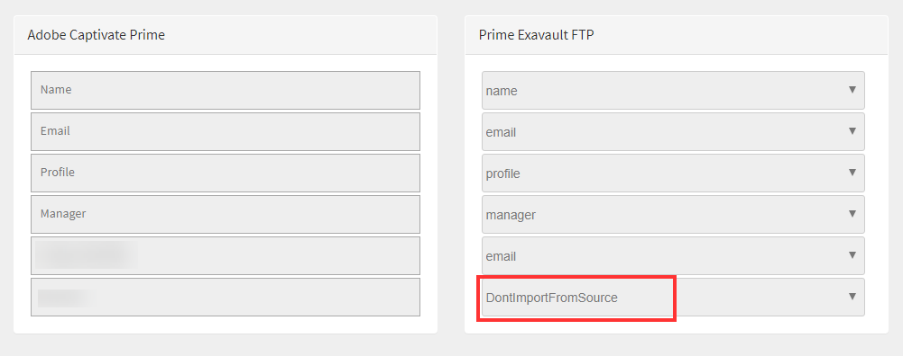
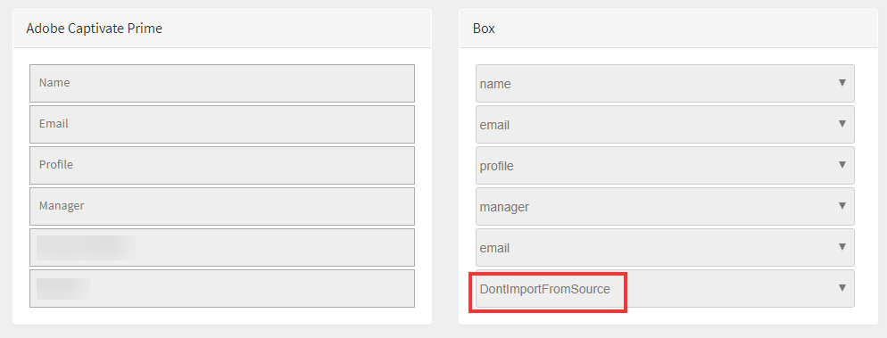

# Learning Managerコネクタ

企業には、Learning Managerと統合する必要がある他のアプリケーションやシステムがあります。 コネクターは、外部システムからLearning Managerにデータを読み込むなど、データベースの統合を実行するのに役立つユーティリティです。  また、Learning Managerから外部システムへのデータの書き出しも実行します。

Learning ManagerはSalesforceおよびFTPコネクタを提供します。 Salesforceコネクターを使用すると、組織の統合管理者はSalesforceアプリケーションとLearning Managerを統合できます。 統合者は、FTPコネクターを使用して、一連のユーザーをエンタープライズアプリケーションに自動読み込みすることもできます。

また、Learning Managerには、Lynda、getAbstract、Harvard Management Systemの各コネクターも用意されています。 これらのコネクターを使用すると、学習者はLynda.com、getAbstract、Harvard ManageMentorのコースにアクセスして使用できます。

これらのコネクターを設定し、Learning Managerで使用する方法については、以下の説明を参照してください。

<!--
>[!NOTE]
>
>**Update:** December 2020 update of Learning Manager
>
>For **FTP**, **Box**, and **Custom FTP** connectors, while exporting Learner Transcript or xAPI, you can also export the data as a **zip** file, for:
>
>* Learner Transcripts
>* xAPI
-->

>[!NOTE]
>
>2022年11月リリースのAdobe Learning Managerでは、Zoomが廃止されました [2023年6月までのJWT認証](https://marketplace.zoom.us/docs/guides/auth/jwt/). このため、JWTを使用したZoomコネクターは前述の日付まで引き続き機能しますが、アカウントの機能を置き換えるためにサーバー間OAuthアプリを作成することをお勧めします。 新しい接続では、デフォルトでZoom OAuth認証が使用されます。

## Salesforceコネクタ {#sfconnector}

SalesforceコネクターはLearning ManagerアカウントとSalesforceアカウントを接続して、データを自動的に同期します。 Salesforceコネクターの機能は次のとおりです。

### マップ属性

統合管理者はSalesforceの列を選択し、その列を対応するLearning Managerのグループ化可能属性にマッピングできます。 マッピングが完了すると、それ以降のユーザーの読み込みでは同じマッピングが使用されます。 管理者がユーザーを読み込むために別のマッピングを使用する場合は、再設定できます。

### 自動ユーザー読み込み

ユーザー読み込みプロセスにより、Learning Manager管理者はSalesforceから従業員の詳細を取得し、その情報をLearning Managerに自動的に読み込ませることができます。 この自動化により、CSVの作成とLearning Managerへのアップロードに伴う手作業を省略できます。

### 自動スケジュール

自動スケジュール機能と自動ユーザー読み込み機能を使用すると、効果的です。 Learning Manager管理者は、組織のニーズに応じてスケジュールを設定できます。 Learning Managerアプリケーションのユーザーは、スケジュールに従って最新の状態にすることができます。 Learning Managerアプリケーションで、同期を毎日実行できます。

### ユーザーのフィルタリング

Learning Manager管理者は、読み込む前にユーザーにフィルタリングを適用できます。 例えば、Learning Manager管理者は、階層内のすべてのユーザーを1人以上の特定のマネージャーの管理下に読み込むように選択できます。

### Salesforceコネクターの設定 {#configuresalesforceconnector}

SalesforceとLearning Managerを統合するためのプロセスを学びましょう

#### 前提条件 {#prerequisites}

Salesforce組織のURLが手元にあることを確認します。 例えば、組織名が **myorg** SalesforceのURLは次のようになります `https://myorg.salesforce.com`. SalesforceアカウントをLearning Managerに接続するために入力が必要な項目は、組織名のみです。

また、アカウントにログインするための適切な資格情報があることを確認します。

#### 接続を作成する {#createaconnection}

1. Learning Managerホームページで、Salesforceカード/サムネールにカーソルを合わせます。 メニューが表示されます。 クリック **[!UICONTROL Connect]** メニュー内のアイテムです。

   

   *接続オプション*

1. 組織URLの入力を求めるダイアログが表示されます。 クリック **[!UICONTROL Connect]** urlの入力後
1. 接続が成功すると、概要ページが表示されます。

### マップ属性 {#mapattributes}

接続が正常に確立されたら、Salesforceの列をLearning Managerの対応する属性にマッピングできます。 この手順は必須です。

1. マッピングページの左側にはLearning Managerの列が表示され、右側にはSalesforceの列が表示されます。 Learning Managerの列名にマッピングする適切な列名を選択します。

   
   *マップ属性*

   >[!NOTE]
   >
   >左側に表示されているLearning Managerの列データは、アクティブフィールドから取得されます。 この **支配人** フィールドは、電子メールアドレスタイプのフィールドにマッピングする必要があります。 コネクタを使用するには、すべての列をマッピングする必要があります。

1. クリック **[!UICONTROL 保存]** マッピングの完了後。
1. これで、コネクタを使用する準備ができました。 設定されており、管理者アプリ内でデータソースとして表示されるアカウント。 管理者は、読み込みまたはオンデマンド同期をスケジュールできます。

## Salesforceコネクターの使用 {#usingsalesforceconnector}

SalesforceコネクターはSalesforce.comに接続して、設定どおりにユーザーを取得し、ユーザーをLearning Managerに追加します。

### Salesforceの連絡先からユーザーの読み込み {#import-salesforce-contacts}

Learning Managerは、Salesforceコネクターを拡張して、連絡先とSalesforceユーザーを取得し、それらをLearning Managerに自動的に読み込ませます。

Salesforceコネクタページで、SalesforceのURLを入力し、認証を完了します。 認証が完了したら、ユーザーまたは連絡先の読み込みに進みます。 「連絡先」オプションを選択した場合は、読み込む連絡先のサブセットを指定します。

Salesforceの列を選択し、対応するLearning Managerのグループ化可能属性にマッピングできます。 マッピングが完了すると、それ以降のユーザーの読み込みでは同じマッピングが使用されます。

1. Salesforceにログインします。
1. 接続ページで、をクリックします。 **[!UICONTROL 社内ユーザーのインポート]**.

   
   *社内ユーザーのインポート*

1. を **ユーザーの読み込み** ページには、新しいオプション、連絡先があります。 ラジオボタンをクリック **連絡先** 次のオプションが表示されます。

   
   *連絡先属性のマップ*

1. をクリックした場合 **[!UICONTROL はい]**&#x200B;では、次の操作を実行できます。

   * **連絡先列の選択：** Learning Managerに読み込むフィールドを選択します。
   * **値を指定します。** 選択したフィールドを表す値を選択します。

   
   *値の指定*

   * Salesforceの列をLearning Managerの列にマッピングします。
   * 読み込みを開始するには、 **[!UICONTROL 保存]**.

1. をクリックした場合 **[!UICONTROL いいえ。 すべての連絡先をインポート]**&#x200B;を選択している場合、連絡先をフィルタリングせずにフィールドを直接マップできます。 ここでは、Salesforceからすべての連絡先を読み込みます。
1. 読み込みを開始するには、 **[!UICONTROL 保存]**.

## 学習記録の書き出し

Learning Managerでは、トランスクリプト、ユーザーレポート、スキルレポートなどの学習記録をSalesforceに書き出すことができます。 書き出したデータを、Salesforceの「ユーザー」テーブルまたは「連絡先」テーブルにリンクするかどうかを指定できます。

*学習記録のエクスポート*

### Salesforceのカスタムオブジェクト

Learning Managerから学習記録を書き出すには、Salesforceでカスタムオブジェクトを作成する必要があります。 カスタムオブジェクトとは、会社や業界固有の情報を保存するために作成するオブジェクトです。 詳しくは、「 [Salesforceカスタムオブジェクト](https://trailhead.salesforce.com/en/content/learn/modules/data_modeling/objects_intro).

オブジェクトの作成方法は次のとおりです。

1. パッケージをダウンロードしてインストールし、カスタムオブジェクトを作成します。

   * [パッケージ1](https://test.salesforce.com/packaging/installPackage.apexp?p0=04t1k0000008WPJ)
   * [パッケージ2](https://test.salesforce.com/packaging/installPackage.apexp?p0=04t1k0000008WPT)
   * [パッケージ3](https://test.salesforce.com/packaging/installPackage.apexp?p0=04t1k0000008WPi)

1. Salesforceのカスタムオブジェクト名を変更します。
1. イベントを選択し、 **[!UICONTROL 保存]**.

**イベントのリンク先：** 書き出すセクション（「ユーザー」または「連絡先」）を選択します。 「連絡先」オブジェクトを選択すると、Learning Managerに存在するがSalesforceには存在しないユーザーがSalesforceで作成されます。

*イベントのリンクオプション*

>[!NOTE]
>
>1つのアカウントで複数の接続を作成できます。 Salesforceでは、1つの接続に最大3つのカスタムオブジェクトを使用できます。 同じSalesforceアカウントに複数の接続を作成する場合は、3つのパッケージをインストールする必要があります。 最大3つのパッケージをサポートします。
>
>作成する接続の数だけ、パッケージをインストールする必要があります。

>[!NOTE]
>
>Salesforceの実行ステータスページでは、Salesforceからのみ処理されたレコードの数を確認できます。 処理されたレコードのいずれかに、部分的な書き出しやエラーが発生した場合でも、Learning Managerではステータスが完了済みと表示されます。

## Salesforceパッケージのインストール

Learning ManagerはSalesforceアプリケーションパッケージを提供します。 SFDCにインストールして設定すると、セールス社員はSFDCポータル内でトレーニングアクティビティを実行できるようになります。 このアプリにより、SFDCユーザーは新しいトレーニングを調べ、推奨事項を表示し、SFDCポータル内ですぐに実行できます。 また、管理者からのアナウンスを、SFDCポータル内のアプリにマストヘッド形式で表示できます。

### Learning Managerアプリで設定

1. 自分のLearning Manager管理者アカウントに、統合管理者としてログインします。
1. クリック **[!UICONTROL アプリケーション]** > **[!UICONTROL おすすめアプリ]**.
1. クリック **[!UICONTROL Salesforce]**.
1. Salesforceアプリケーションページで、説明に記載されているアプリケーションID（クライアントIDとも呼ばれます）とクライアントシークレットを確認します。
1. クリック **[!UICONTROL 承認]** また、アプリが正常に承認されている必要があります。
1. クリック **[!UICONTROL 開発者向けリソース]** > **[!UICONTROL テストおよび開発用のアクセストークン]**.
1. 「OAuthコードを取得」セクションで、クライアントIDとスコープを「admin:read,admin:write」に設定します。 クリック **[!UICONTROL 送信]**.
1. 「更新トークンの取得」に、クライアントIDとクライアントシークレットを入力します。 クリック **[!UICONTROL 送信]** 更新トークンを確認します。

### Salesforceアプリでのアカウントの作成

1. Salesforceサインアップページでアカウントを作成します。 Salesforceアカウントは、開発者版またはエンタープライズ版で作成する必要があります。  [開発者サインアップURL](https://developer.salesforce.com/signup). Salesforceへのサインアップには、Learning Managerで使用した電子メールIDを使用する必要があります。
1. 確認用メールでアカウントを確認します。
1. パスワードを作成し、Salesforceにログインします。
1. ログイン後にSalesforceのURLに注意してください(例：site.lightning.force.com)

### Learning Managerパッケージのインストール

パッケージをインストールする場合、まずSalesforceで既存のパッケージを削除する必要があります。 アンインストールする前に、次のように設定を有効にする必要があります。 これらの設定の適用は必須です。そうしないと、パッケージをインストールできなくなります。

>[!NOTE]
>
>AdobeのLearning Managerアプリは、Salesforce Lightningビューでのみサポートされています。

1. を起動 [Learning ManagerパッケージURL](https://login.salesforce.com/packaging/installPackage.apexp?p0=04t1k0000008WOQ).
1. を **ログイン** ページをクリック **[!UICONTROL カスタムドメインを使用]**.
1. パッケージURLを入力し、 **[!UICONTROL 続行]**. インストールページで「管理者のみにインストール」オプションを選択している必要があります。 このオプションは変更しないでください。
1. クリック **[!UICONTROL インストール]**. パッケージがインストールされたら、 **[!UICONTROL 完了]**. インストール済みパッケージページが表示され、Learning Managerのインストール済みパッケージというAdobeが表示されます。
1. 設定の横にあるApp Launcherに移動して「Learning Manager Adobe」を検索します。
1. アプリを設定するには、 **[!UICONTROL 設定]**.
1. クリック **[!UICONTROL 新規]** 次の詳細を追加します。

   * **設定：** 任意の名前を入力します。
   * **ClientID**：最初のセクションで取得した値を入力します。
   * **ClientSecret:** 最初のセクションで取得した値を入力します。
   * **RefreshToken:** 最初のセクションで取得した値を入力します。
   * **LearningManagerBaseURL :** Learning ManagerがホストされているサイトのURL。

### リモートサイト設定の追加

1. ページの右上隅にあるをクリックします。 **[!UICONTROL 設定]**.
1. イン **[!UICONTROL クイック検索]**&#x200B;リモートサイトの設定を検索します。
1. クリック **[!UICONTROL 新しいリモートサイト]**.
1. 詳細を入力します。

   * **リモートサイト名：** 任意の名前を入力します。
   * **リモートサイトのURL:** Learning ManagerがホストされているサイトのURL。

1. Learning Managerを起動します。

### Learning Managerアプリの通知を有効にする

1. 右上隅のをクリックします。 **[!UICONTROL 設定]**.
1. カスタム通知を検索します。
1. クリック **[!UICONTROL 新規]**.
1. 次の詳細を入力します。

   1. **カスタム通知名：** LearningManagerNotification
   1. **API名：** LearningManagerNotification

1. 両方を選択 **デスクトップ** および **モバイル** をサポート対象チャンネルに設定します。

1. クリック **[!UICONTROL 保存]**.
1. モバイルデバイスのプッシュ通知を有効にするには、次の手順に従います。

   1. 携帯電話にSalesforceモバイルアプリをインストールします。
   1. 資格情報を使用してアプリにログインします。
   1. に移動 **設定** > **通知配信設定**.
   1. iOSおよびAndroid用のSalesforceを追加します。

### SalesforceからのLearning Managerのアンインストール

1. Salesforceアプリで「インストール済みパッケージ」に移動します。
1. クリック **[!UICONTROL アンインストール]**.

## Salesforceユーザー向けにLearning Managerを設定する

Learning Managerアプリは、Salesforceアカウント内のユーザーも利用できます。 Salesforce管理者は、プロファイルに基づいてユーザーを追加できます。 Salesforceプロファイルは、Learning Managerのプロファイルに似ています。 例えば、管理者、統合管理者、インストラクターなどです。 Salesforce管理者は、カスタムプロファイルも作成できます。

Salesforce管理者は、ユーザーにプロファイルを割り当てるか、カスタムプロファイルを作成することができます。

パッケージをインストールするときに、Salesforceプロファイルを学習者に割り当てることができます。

パッケージをインストールしたら、プロファイルを設定する必要があります。

クリック **[!UICONTROL 設定]** > **[!UICONTROL 新規]**&#x200B;を選択し、次の項目を追加します。

* 構成名
* ClientID
* ClientSecret
* LearningManagerBaseURL
* リダイレクトの無効化

>[!NOTE]
>
>学習者がLearning Managerアプリを表示できるようにするために、すべての学習者に対してアプリを有効にする必要があります。

次に、Learning Managerアプリにアクセス権を付与します。

*Learning Managerアプリにアクセスするための権限を設定*

ユーザーを選択し、それに応じて権限を割り当てます。 これで、学習者がLearning Managerアプリにアクセスできるようになりました。

次に、プロファイル（ユーザーの標準プロファイルなど）を選択し、プロファイルをクリックします。 クリック **[!UICONTROL 編集]** そして **カスタムアプリ設定** セクションで、チェックボックスをオンにする **Learning ManagerのAdobe**. これにより、ユーザーがアプリにアクセスできるようになります。

を **カスタムタブ設定** セクション内の **学習者ホーム** ドロップダウンリストで、オプションを選択します **デフォルトをオン**.

すべてのプロファイルに対して、アプリを表示可能にしておく必要があります。

クリック **[!UICONTROL 保存]** また、すべてのプロファイルに属する学習者がLearning Managerアプリにアクセスできます。

### 学習パス関連の変更

#### 既存の接続

管理者アカウントで「学習パス」オプションが無効になっている場合、レポートに行や列は追加されません。

管理者アカウントで「学習パス」オプションが有効になっている場合、学習者が登録された場合に備えて「タイプ」列に学習パスが入力されます。

>[!NOTE]
>
>このフラグを有効にして既存の接続を使用すると、いくつかのレコードが失われる可能性があります。

#### 新しい接続

管理者アカウントで「学習パス」オプションが無効になっている場合、トレーニングレポートには以下の列が表示されますが、データは含まれません。

* **埋め込みパス：** 学習プログラムの名前が表示されます。
* **埋め込みパスID:** 学習プログラムのIDが表示されます。
* **埋め込みコースのID :** 学習パスに含まれるコースのIDが表示されます。

また、学習パスが有効になっているアカウントでの新しい接続では、3つの新しい列が表示され、すべてのデータが取り込まれます。

さらに、このレポートでは、学習パスに登録されているすべての学習者の「タイプ」列に「学習パス（上位レベル）」が含まれます。

「タイプ」列では「学習プログラム」の名前が「学習パス」に変更されます。 既存の接続の場合、変更はありません。

## Learning Manager FTPコネクタ {#ftpconnector}

FTPコネクターを使用すると、Learning Managerを任意の外部システムと統合して、データを自動的に同期できます。 外部システムがデータをCSV形式で書き出し、そのデータをLearning Manager FTPアカウントの適切なフォルダーに配置できることが期待されています。 FTPコネクタの機能は次のとおりです。

Boxコネクターを使用して、データの移行、ユーザーの読み込み、データの書き出しをおこなうこともできます。 詳しくは、 Boxコネクタを参照してください。

### データのインポート {#dataimport}

ユーザー読み込みプロセスにより、Learning Manager管理者はLearning Manager FTPサービスから従業員の詳細を取得し、その情報をLearning Managerに自動的に読み込ませることができます。 この機能を使用すると、それらのシステムによって生成されたCSVをFTPアカウントの適切なフォルダーに配置することによって、複数のシステムを統合できます。 Learning ManagerはCSVファイルを取得し、ファイルを結合して、スケジュールに従ってデータを読み込みます。 詳細については「スケジュール機能」を参照してください。

**マップ属性**

統合管理者はCSVの列を選択し、その列をLearning Managerのグループ化可能属性にマッピングできます。 このマッピングは1回限りの作業です。 マッピングが完了すると、それ以降のユーザーの読み込みでは同じマッピングが使用されます。 管理者がユーザーを読み込むために別のマッピングを使用する場合は、マッピングを再設定できます。

#### データの書き出し {#exportdata}

データの書き出しを使用すると、ユーザーはユーザーのスキルと学習者のトランスクリプトをFTPの場所に書き出し、サードパーティシステムと統合することができます。

#### スケジュール {#scheduling}

管理者は、組織の要件に応じてタスクをスケジュール設定できます。Learning Managerアプリケーション内のユーザーは、スケジュールに従って最新の状態になります。 同様に、統合管理者は、外部システムと統合されるようにスキルの書き出しをスケジュールすることができます。 Learning Managerアプリケーションで、同期を毎日実行できます。

### Learning Manager FTPコネクタの設定 {#configurecaptivateprimeftpconnector}

FTPコネクターとLearning Managerを統合するためのプロセスを学びましょう。

#### 接続を作成する {#Createaconnection-1}

1. Learning Managerホームページで、FTPカード/サムネールにカーソルを合わせます。 メニューが表示されます。 クリック **[!UICONTROL Connect]** メニュー内のアイテムです。

   

   *接続オプション*

1. 電子メールIDの入力を求めるダイアログが表示されます。 組織のLearning Manager FTPアカウントの管理責任者の電子メールIDを入力します。 クリック **[!UICONTROL Connect]** 電子メールidの入力後
1. Learning Managerは、FTPに初めてアクセスする前にユーザーにパスワードの再設定を促す電子メールを送信します。 ユーザーはパスワードをリセットし、Learning Manager FTPアカウントへのアクセスに使用する必要があります。

   >[!NOTE]
   >
   >特定のLearning Managerアカウントに作成できるLearning Manager FTPアカウントは1つだけです。

   概要ページでは、統合の接続名を指定できます。 次のオプションから、実行するアクションを選択します。

   * 社内ユーザーのインポート
   * xAPIの読み込み
   * ユーザースキルの書き出し – スケジュールの設定
   * ユーザースキルの書き出し – オンデマンド
   * 学習者のトランスクリプトの書き出し – スケジュールの設定
   * 学習者のトランスクリプトの書き出し – オンデマンド

   
   *書き出しオプション*

### 読み込み

・+++内ユーザー

社内ユーザーの読み込みオプションを使用すると、オンデマンドまたはスケジュールを設定したうえで、ユーザーをcsvからLearning Managerに読み込むことができます。

+++

+++マップ属性

接続が正常に確立されたら、CSVファイルの列をマッピングできます。 Learning Managerの対応する属性のFTPフォルダーに配置されます。 この手順は必須です。

1. マップ属性ページの左側にはLearning Managerの予想される列が表示され、右側にはCSVの列名が表示されます。 最初は、右側に空の選択ボックスが表示されます。 任意のテンプレートCSVを読み込むには、次をクリックします **ファイルを選択**.
1. 上記の手順により、右側の選択ドロップダウンリストにすべてのCSV列名が表示されます。 Learning Managerの列名にマッピングする適切な列名を選択します。

   >[!NOTE]
   >
   >マネージャーフィールドは、電子メールアドレスタイプのフィールドにマッピングする必要があります。 コネクタを使用するには、すべての列をマッピングする必要があります。

1. クリック **[!UICONTROL 保存]** マッピングの完了後。

   これで、コネクタを使用する準備ができました。 設定されたアカウントは、管理者アプリ内のデータソースとして表示され、管理者が読み込みをスケジュールしたり、オンデマンドで同期したりすることができます。

+++

+++Learning Manager FTPコネクタの使用

1. 外部システムからのCSVファイルは次のパスに配置する必要があります。

   `code $OPERATION$/$OBJECT_TYPE$/$SUB_OBJECT_TYPE$/data.csv`

   >[!NOTE]
   >
   >2016年7月リリースでは、ユーザーの読み込みのみが許可されています。 したがって、FTPコネクタを使用するには、CSVファイルが次のフォルダーにあることを確認してください。

   `code Home/import/user/internal/*.csv`

1. FTPコネクタは、CSVファイルからすべての行を取得します。 重要なのは、あるCSV内のユーザーに対応する行が、他のCSVに表示されないことです。
1. すべてのCSVには、マッピングで指定された列が含まれている必要があります。
1. プロセスを開始する前に、必要なすべてのCSVがフォルダーに存在している必要があります。

>[!NOTE]
>
>ユーザーをLearning Managerに読み込む際、管理者はユーザーがLearning Managerで管理されている方法も把握しておく必要があります。 詳しくは、「 [ユーザー管理ヘルプ](migration-manual.md#usermanagement) 詳細情報を参照してください。

+++

+++xAPIの読み込み

xAPIの読み込みオプションにより、サードパーティ製サービスのxAPIステートメントをLearning Managerに読み込むための処理のスケジュールを設定できます。

+++

+++xAPIの読み込みに必要な設定

1. 設定ページで、設定リストにある既存の設定を選択し、xAPIステートメントをCSVから読み込みます。 「編集」または **新しい構成の追加** リンクをクリックして、インポートソースの構成ページに移動します。

   **設定**

   * Configure Import-Sourcesページで、NameとSource File Nameの2つのフィールドに入力します。 ソースファイル名は、FTPフォルダーの場所に指定されているファイル名と一致する必要があります。
   * クリック **[!UICONTROL 保存]** 変更を保存します。

   
   *設定*

   **フィルター**

   * 左ペインで、 **[!UICONTROL フィルター]**.
   * [インポートフィルタの設定]ページで、[名前]フィールドと[条件]フィールドに入力し、レコードをフィルタします。 クリック **[!UICONTROL 新しいフィルターを追加]** 別のフィルターを追加します。 フィルターを保存または削除するには、次をクリックします **保存** または **削除** 「アクション」列の下にあるオプション。

   
   *フィルター*

   **マッピング**

   * 左ペインで、 **[!UICONTROL マッピング]**.
   * xAPIステートメントの設定マッピングの読み込みページの左側には、CSV列名とマッピングする必要があるxAPI JSONフィールドパス名が表示されます。
   * デフォルトでは、CSV列名にマッピングする必要がある3つのJSONパスフィールド名は次のとおりです。 **actor.mbox**, **verb.id**、および **object.id**. をクリックして、マッピングする他のフィールドを追加できます。 **新しいマッピングを追加**.

   * Jsonフィールドパス名とマッピングする列名のタイプを選択します（文字列、数値、ブール型、または日付型のいずれであっても）。
   * マッピングが完了したら、「保存」をクリックします。 xAPIの読み込みは、スケジュールに従って、またはオンデマンドで読み込むことができるようになりました。

   
   *マッピング*

1. 左ペインで、 **[!UICONTROL スケジュールの設定]**. クリック **[!UICONTROL スケジュールを有効にする]** xAPIステートメントの読み込みをスケジュールします。

   開始時刻と日付を入力し、xAPIの読み込みスケジュールの頻度を日数で入力できます。 例えば、xAPIの読み込みを3日ごとに有効にします。

   
   *xAPIステートメントの読み込み – スケジュールの設定*

1. 左ペインで、 **[!UICONTROL オンデマンド実行]**.

   
   *xAPIステートメントの読み込み – オンデマンド*

1. 左ペインで、 **[!UICONTROL 実行ステータス]** このコネクタのすべての配管の概要を時系列で表示します。 xAPIのインポートにかかった時間の開始日と期間、インポートの種類（オンデマンドかスケジュールされているか）、およびインポートのステータス（xAPIインポートが進行中か、完了したか、または失敗したか）を表示できます。

   
   *xAPIステートメントの読み込み – 実行ステータス*

+++

### エクスポート

+++スキル

ユーザーのスキルレポートを書き出すには、2つのオプションがあります。

**[!UICONTROL ユーザースキル – オンデマンド]**：開始日を指定し、オプションを使用してレポートを書き出すことができます。 レポートは、入力された日付から抽出されます。

*オンデマンド書き出しオプション*

**[!UICONTROL ユーザースキル – 設定]**：このオプションでは、レポートの抽出をスケジュールできます。 「スケジュールを有効にする」チェックボックスをオンにし、開始日時を指定します。 レポートを生成および送信する間隔を指定することもできます。

*レポートの書き出しを設定*

+++

書き出されたファイルが保存されている書き出しフォルダーを開くには、次に示すように、ユーザースキルページで提供されているFTPフォルダーへのリンクを開きます。

*ファイルを表示するためのFTPフォルダー*

自動書き出しされたファイルは、この場所にあります **Home/export/&#42;FTP_location&#42;**

自動書き出しされたファイルは、というタイトルの付いたファイルです。 **skill_achievements_&#42;開始日&#x200B;&#42;_から_&#42;終了日&#42;.csv**

*書き出した.csvファイル*

+++学習者のトランスクリプト

**設定**：このオプションでは、レポートの抽出をスケジュールできます。 「スケジュールを有効にする」チェックボックスをオンにし、開始日時を指定します。 レポートを生成および送信する間隔を指定することもできます。

+++

書き出されたファイルが保存されているFTPの書き出しフォルダーを開くには、次に示すように、学習者のトランスクリプトページに表示されるFTPフォルダーへのリンクを開きます

自動書き出しされたファイルは、この場所にあります **Home/export/&#42;FTP_location&#42;**

自動書き出しされたファイルは、というタイトルの付いたファイルです。 **learner_transcript_&#42;開始日&#x200B;&#42;_から_&#42;終了日&#42;.csv**

### 手動csvフィールドのサポート {#supportformanualcsvfields}

FTPでユーザーデータを読み込む際、管理者はシステムに存在するすべてのアクティブフィールドを、csvの対応するフィールドにマッピングする必要があります。

これは、csvのアクティブなすべてのフィールドで必須です。 手動でアクティブなフィールドの場合、統合管理者はオプションを選択できます **DontImportFromSource**.

このオプションを選択すると、csvインポートを使用して手動でアクティブなフィールドの値が入力されません。 学習者が指定した値は変更されません。

>[!NOTE]
>
>マッピング中に **DontImportFromSource** がcsvアクティブフィールドに選択されている場合、このフィールドはシステムから削除されます。

*アクティブフィールド用のFTPコネクタ*

## Lyndaコネクタ {#lyndaconnector}

Lynda.comをご利用のエンタープライズのお客様は、Lyndaコネクターを使用することにより、お客様の学習者がLearning Manager内でLyndaコースを検索および使用できるようになります。 APIキーを使用してLynda.comからコースを定期的に取得するように、コネクタを設定できます。 Learning Manager内にコースが作成されると、ユーザーはコースを検索して使用できます。 これにより、学習者の進行状況をLearning Manager内で追跡できます。

### Lyndaコネクタの設定 {#configurethelyndaconnector}

1. 統合管理ダッシュボードから、「Lynda」をクリックします。

   タイルには、「はじめに」、「接続」、「接続を管理」の3つのオプションが表示されます。

1. Lyndaコネクタを初めて設定する場合は、[接続]をクリックします。

   <!--Configure the Exavault FTP account before you configure this connector.-->

1. 接続ページから、コネクタの名前を指定します。 接続のAppkeyとSecret keyを入力します。

   >[!NOTE]
   >
   >ベンダーに連絡してAppkeyと秘密鍵を入手してください。

1. 「保存」をクリックします。

   設定が保存され、アカウントのLynda接続が追加されます。 ホームページから「接続の管理」をクリックして、いつでも設定を編集できるようになりました。

1. 既に接続が確立されている場合は、「接続の管理」をクリックしてすべての接続を表示します。

   >[!NOTE]
   >
   >このコネクタを設定する前に、アカウントで移行機能を有効にする必要があります。

1. 編集する接続をクリックします。
1. 左ペインで、 **[!UICONTROL 設定]**. 次のいずれかの操作を行います。

   * このウィンドウで、アカウントの詳細と同期スケジュールを表示または編集します。 このアカウントを有効にする場合は、「接続を有効にする」チェックボックスをオンにします。
   * 「編集」をクリックして、資格情報を編集します。 このフィールドの更新を元に戻すには、[リセット]をクリックします
   * 「スケジュールの有効化」をクリックして、同期をスケジュールします。 開始時刻と日付を入力し、同期スケジュールの頻度を日数で入力できます。 たとえば、同期を3日ごとに有効にします。

   クリック **[!UICONTROL 保存]** 変更を保存します。

   

   *Learning Manager用Lyndaコネクターの設定*

1. 左ペインで、「On-Demand Execution」をクリックします。 このオプションを使用すると、Lyndaからユーザーフィードやその他の関連データを読み込むことができます。 オンデマンド実行の開始日を入力し、「実行」をクリックして同期を実行します。 開始日から現在までのすべてのデータが読み込まれます。

   * 同期中にアプリケーションのダウンタイムが発生する場合は、「実行中のLearning Managerへのアクセスを無効にする」をクリックします。
   * 「実行中のLearning Managerへのアクセスを有効にする」をクリックした場合でも、同期中にサービスが中断されることはありません。

   

   *Lyndaコネクタのオンデマンド実行を実行する*

1. また、このコネクタのすべての実行の概要を時系列で表示するには、いつでも左ペインで「実行ステータス」をクリックできます。 同期の開始日と期間、同期の種類（オンデマンド同期かどうか）、および同期のステータス（同期が進行中か完了しているか）を表示できます。

   >[!NOTE]
   >
   >接続を削除して再作成すると、コネクタの前の配管が再び表示されます。 接続を削除する前に、すべての実行を表示できます。

   再実行は、最新の同期に対してのみ実行できます。

   

   *すべての実行の概要を表示するには、「実行ステータス」をクリックします。*

## getAbstractコネクタ {#getabstractconnector}

getAbstractコネクターは、getAbstract.comのエンタープライズ版をご利用のお客様が使用します。お客様は、このコネクターを使用することで、お客様の学習者がgetAbstractサマリーを検出して使用できるようになります。 コネクタは、Learning Manager内で作成された学習者の完了レコードに基づいて、使用データを定期的に取得するように設定できます。 Learning Managerでこのコネクターを設定する方法については、以下を参照してください。

### getAbstractコネクターの設定 {#configurethegetabstractconnector}

1. 統合管理ダッシュボードから、「getAbstract」をクリックします。

   タイルには、「はじめに」、「接続」、「接続を管理」の3つのオプションが表示されます。

1. getAbstractコネクタを初めて構成する場合は、「接続」をクリックします。

   <!--Configure the Exavault FTP account before you configure this connector.

   Ensure that you share this FTP credentials with your content provider to access the feeds.-->

1. 「接続名」フィールドに接続の名前を入力します。

   「クライアントID」および「クライアントシークレット」フィールドに適切なキーを入力します。 このコネクタの適切なキーを取得するには、製造元に問い合わせてください。

   キーは、クライアントが使用するコースのコースメタデータを取得するために必要です。

1. 既に接続が確立されている場合は、ホームページから、 getAbstract /接続を管理をクリックして、既存の設定を表示および編集します。

   >[!NOTE]
   >
   >このコネクタを設定する前に、アカウントで移行機能を有効にする必要があります。

1. 構成を表示または編集する接続をクリックします。

   

   *Learning ManagerのgetAbstractコネクターを設定する*

1. 左ペインで、[Configure]をクリックします。 次のいずれかの操作を行います。

   * このウィンドウで、アカウントの詳細と同期スケジュールを表示または編集します。 このアカウントを有効にする場合は、「接続を有効にする」チェックボックスをオンにします。
   * 「編集」をクリックして、資格情報を編集します。 このフィールドの更新を元に戻すには、[リセット]をクリックします
   * 「スケジュールの有効化」をクリックして、同期をスケジュールします。 開始時刻と日付を入力し、同期スケジュールの頻度を日数で入力できます。 たとえば、同期を3日ごとに有効にします。

1. クリック **[!UICONTROL 保存]**.

   設定が保存され、アカウントのgetAbstract接続が追加されます。

1. 左ペインで、「On-Demand Execution」をクリックします。 このオプションを使用すると、getAbstractからユーザーフィードやその他の関連データを読み込むことができます。 オンデマンド実行の開始日を入力し、「実行」をクリックして同期を実行します。 開始日から現在までのすべてのデータが読み込まれます。

   * 同期中にアプリケーションのダウンタイムが発生する場合は、「実行中のLearning Managerへのアクセスを無効にする」をクリックします。
   * 「実行中のLearning Managerへのアクセスを有効にする」をクリックした場合でも、同期中にサービスが中断されることはありません。

1. また、このコネクタのすべての実行の概要を時系列で表示するには、いつでも左ペインで「実行ステータス」をクリックできます。 同期の開始日と期間、同期の種類（オンデマンド同期かどうか）、および同期のステータス（同期が進行中か完了しているか）を表示できます。

   >[!NOTE]
   >
   >接続を削除して再作成すると、コネクタの前の配管が再び表示されます。 接続を削除する前に、すべての実行を表示できます。

   再実行は、最新の同期に対してのみ実行できます。

   どのような種類の同期を実行する場合でも、同期で指定した日付のgetAbstract FTPフォルダーにユーザーフィードが存在することを確認してください。

   getAbstractのユーザー向けフィードファイルのサンプルである次のExcelシートを参照してください。 ファイル名は次の形式に従う必要があります。 **report_export_yyyy_MM_dd_HHmmss.xlsx** または **report_export_yyyy_MM_dd.xlsx**.
   [getAbstractユーザーフィードサンプルExcelシート](assets/report-export-20170401175342.xlsx)

## Harvard ManageMentorコネクタ {#hmmconnector}

Harvard ManageMentorコネクタは、Harvard ManageMentorのエンタープライズ版をご利用のお客様が使用するコネクタです。お客様は、Harvard ManageMentorのコースを学習者が検索および使用できるように設定できます。 コネクターはLearning Manager内でコースを作成するのに役立ち、学習者の進行状況データを定期的に取得するように設定できます。 このコネクタを設定するには、次の手順を実行します。

### Harvard ManagerMentorコネクタの設定 {#configuretheharvardmanagermentorconnector}

1. 統合管理ダッシュボードから、「 Harvard ManageMentor 」をクリックします。

   タイルには、「はじめに」、「接続」、「接続を管理」の3つのオプションが表示されます。

1. Harvard ManageMentorコネクタを初めて構成する場合は、「Connect」をクリックします。

   <!--Configure the Exavault FTP account before you configure this connector.

   Ensure that you share this FTP credentials with your content provider to access the feeds.-->

1. 「接続名」フィールドに、接続の名前を入力します。 [接続]をクリックして、この接続を保存します。
1. 既に接続が確立されている場合は、ホームページから、Harvard ManageMentor/接続の管理をクリックします。 既存の構成を編集する接続をクリックします。

   >[!NOTE]
   >
   >このコネクタを設定する前に、アカウントで移行機能を有効にする必要があります。

   

   *Learning Manager用HarvardManage Mentorコネクターの設定*

1. 左ペインで、[Configure]をクリックします。 次のいずれかの操作を行います。

   * このウィンドウで、アカウントの詳細と同期スケジュールを表示または編集します。 このアカウントを有効にする場合は、「接続を有効にする」チェックボックスをオンにします。
   * 「スケジュールの有効化」をクリックして、同期をスケジュールします。 開始時刻と日付を入力し、同期スケジュールの頻度を日数で入力できます。 たとえば、同期を3日ごとに有効にします。

1. 左ペインで、「On-Demand Execution」をクリックします。 このオプションを使用すると、Harvard ManageMentorからユーザーフィードやその他の関連データを読み込むことができます。 オンデマンド実行の開始日を入力し、「実行」をクリックして同期を実行します。 開始日から現在までのすべてのデータが、この接続にインポートされます。

   * 同期中にアプリケーションのダウンタイムが発生する場合は、「実行中のLearning Managerへのアクセスを無効にする」をクリックします。
   * 「実行中のLearning Managerへのアクセスを有効にする」をクリックした場合でも、同期中にサービスが中断されることはありません。

   数日ごとに同期を自動化する場合は、「繰り返し日数」フィールドに日数を指定します。 同期を行うと、アカウントが最新バージョンのHarvard ManageMentorからの要約と要約で更新されます。

1. また、このコネクタのすべての実行の概要を時系列で表示するには、いつでも左ペインで「実行ステータス」をクリックできます。 同期の開始日と期間、同期の種類（オンデマンド同期かどうか）、および同期のステータス（同期が進行中か完了しているか）を表示できます。

   >[!NOTE]
   >
   >接続を削除して再作成すると、コネクタの前の配管が再び表示されます。 接続を削除する前に、すべての実行を表示できます。

   再実行は、最新の同期に対してのみ実行できます。

   同期を正常に実行するには、Harvard ManageMentor FTPフォルダに以下のファイルが少なくとも1つ存在していることを確認してください。

   hmm12_metadata.xlsx：このファイルは、Harvard ManageMentorコネクタのコースメタデータを提供します。 ファイルをアップロードするときには、命名規則に従ってください。

   client_hmm12_20150125.xlsx: Harvard ManageMentorコネクタのユーザーフィードです。 この後に続くファイル命名規則は、次のとおりです。 **client_hmm12_yyyyMMdd.xlsx.**

   このコネクタの次の2つのユーザーフィードファイルとコースフィードファイルの例を参照してください。

   * [Harvard ManageMentorコネクタのコースメタデータファイル](assets/hmm12-metadata.xlsx)
   * [Harvard ManageMentorコネクタのユーザーフィード](assets/client-hmm12-20170304.xlsx)

## Workdayコネクタ {#workdayconnector}

Workdayコネクターを使用すると、Learning ManagerをWorkdayテナントと統合して、データを自動的に同期できます。

### 読み込み

#### マップ属性

統合管理者はWorkdayの列を選択し、その列を対応するLearning Managerのグループ化可能属性にマッピングできます。 マッピングが完了すると、それ以降のユーザーの読み込みでは同じマッピングが使用されます。 管理者がユーザーを読み込むために別のマッピングを使用する場合は、再設定できます。

#### 自動ユーザー読み込み

ユーザー読み込みプロセスにより、Learning Manager管理者はWorkdayから従業員の詳細を取得し、その情報をLearning Managerに自動的に読み込ませることができます。

#### ユーザーのフィルタリング

Learning Manager管理者は、読み込む前にユーザーにフィルタリングを適用できます。 例えば、Learning Manager管理者は、階層内のすべてのユーザーを1人以上の特定のマネージャーの管理下に読み込むように選択できます。

### エクスポート

ユーザーのスキルの書き出しを使用すると、ユーザーのスキルをWorkdayに自動的に書き出すことができます。

>[!NOTE]
>
>複数のLearning Managerアカウントのスキルを、同じWorkdayアカウントを使用して同時に書き出すことはできません。

### スケジュール {#Scheduling-1}

管理者は、組織の要件に応じてタスクをスケジュール設定できます。Learning Managerアプリケーション内のユーザーは、スケジュールに従って最新の状態になります。 同様に、統合管理者は、外部システムと統合されるようにスキルの書き出しをスケジュールすることができます。 Learning Managerアプリケーションで、同期を毎日実行できます。

### Workdayコネクタの設定 {#configureworkdayconnector}

>[!PREREQUISITES]
>
>ISU_Permissionsドキュメントで定義されている権限で統合システムユーザー(ISU)を作成するには、組織のWorkday管理者に依頼してください。 以下のリンクからコピーをダウンロードします。

[統合システムユーザー(ISU)のセキュリティのコピーをダウンロードします。](assets/isu-permissions-v1.pdf) WorkdayコネクターとLearning Managerを連携するためのプロセスを学びましょう。

1. Learning Managerホームページで、Workdayタイルにカーソルを合わせます。 メニューが表示されます。 クリック **[!UICONTROL Connect]** メニュー内のアイテムです。

   

   *Workdayタイル*

1. 新しい接続の資格情報の入力を求めるダイアログが表示されます。 接続を行う前に、次のフィールドを入力します。

   * 接続名：環境設定に従って接続名を指定します。
   * ホストURL：統合管理者は、対応するWorkday管理者からホストURLの詳細を取得できます。
   * テナント：テナントは会社の内部です。 テナントの詳細は、Workday管理者に表示されます。
   * ユーザー名とパスワード： Workday管理者は、必要なセキュリティ権限を持つ統合システムユーザー(ISU)を作成し、統合管理者と共有します。

>[!NOTE]
>
>   Learning ManagerはWorkday APIのバージョン28.1を使用しています。

*Workdayコネクタの設定*

1. 関連するすべてのフィールドに情報を入力したら、「接続」をクリックします。

   >[!NOTE]
   >
   >複数のWorkday接続をLearning Managerアカウントに同期させることもできます。

概要ページでは、統合の接続名を指定できます。 次のオプションから、実行するアクションを選択します。

* 社内ユーザーのインポート
* ユーザースキルの書き出し – スケジュールの設定
* ユーザースキルの書き出し – オンデマンド

*Workdayについて*

### 読み込み

#### マップ属性 {#MapAttributes-1}

Workdayコネクターを使用してLearning ManagerとWorkdayを連携し、データを自動的に同期できます。 すべてのアクティブユーザーをWorkdayからLearning Managerに読み込むことができます。 ユーザーは、FTPやSalesforceなど、様々なデータソースから読み込むことができます。

ユーザーを読み込む前に、Learning ManagerとWorkdayのユーザー属性をマッピングする必要があります。 概要ページで、「読み込み」の下の「社内ユーザー」オプションを使用してマップ属性を提供します。

「AdobeのLearning Manager」列に、AdobeのLearning Manager資格情報を入力します。 ドロップダウンを使用して、Workdayの列に対して正しい資格情報を選択します。

>[!NOTE]
>
>現在、Learning Managerは、Workdayから44のユーザー属性の読み込みをサポートしています。 Learning Managerのアクティブフィールドを使用して、属性をさらに追加します。

*マップ属性*

を選択します **派遣社員を除外** このチェックボックスをオンにすると、マネージャーの下で使用可能な一時的なワーカーがインポートされなくなります。

Workdayには4つの階層レベルがありますが、Learning Managerには2つの階層レベルがあります。 Workdayの4つのレベルは、スキルプロファイルカテゴリ、スキルプロファイル、スキルアイテムカテゴリ、およびスキルアイテムです。 Learning Managerのスキル名とレベルは、Workdayのスキルアイテムにマッピングされます。

>[!NOTE]
>
>Workday属性を追加することもできます。 属性を追加するには、CSAMに問い合わせてください。

+++サポートされているWorkday属性のリスト

wd:User_ID\
wd:Worker_ID\
wd:Personal_Data.wd:Name_Data.wd:Preferred_Name_Data.wd:Name_Detail_Data@wd:Formatted_Name\
wd:Personal_Data.wd:Name_Data.wd:Legal_Name_Data.wd:Name_Detail_Data@wd:Formatted_Name\
wd:Personal_Data.wd:Name_Data.wd:Legal_Name_Data.wd:Name_Detail_Data.wd:Prefix_Data.wd:Title_Descriptor\
wd:Personal_Data.wd:Name_Data.wd:Preferred_Name_Data.wd:Name_Detail_Data.wd:Prefix_Data.wd:Title_Descriptor\
wd:Personal_Data.wd:Name_Data.wd:Preferred_Name_Data.wd:Name_Detail_Data.wd:First_Name\
wd:Personal_Data.wd:Name_Data.wd:Preferred_Name_Data.wd:Name_Detail_Data.wd:Last_Name\
wd:Personal_Data.wd:Name_Data.wd:Legal_Name_Data.wd:Name_Detail_Data.wd:First_Name\
wd:Personal_Data.wd:Name_Data.wd:Legal_Name_Data.wd:Name_Detail_Data.wd:Last_Name\
wd:Personal_Data.wd:Contact_Data.wd:Address_Data.0@wd:Formatted_Address\
wd:Personal_Data.wd:Contact_Data.wd:Address_Data.0.wd:Postal_Code\
wd:Personal_Data.wd:Contact_Data.wd:Address_Data.0.wd:Country_Region_Descriptor\
wd:Personal_Data.wd:Contact_Data.wd:Phone_Data.0@wd:Formatted_Phone\
wd:Personal_Data.wd:Contact_Data.wd:Phone_Data.0.wd:Country_ISO_Code\
wd:Personal_Data.wd:Contact_Data.wd:Phone_Data.0.wd:International_Phone_Code\
wd:Personal_Data.wd:Contact_Data.wd:Phone_Data.0.wd:Phone_Number\
wd:Personal_Data.wd:Primary_Nationity_Reference.wd:ID.1.$\
wd:Personal_Data.wd:Gender_Reference.wd:ID.1.$\
wd:Personal_Data.wd:Identification_Data.wd:National_ID.0.wd:National_ID_Data.wd:ID\
wd:Personal_Data.wd:Identification_Data.wd:Custom_ID.0.wd:Custom_ID_Data.wd:ID\
wd:User_Account_Data.wd:Default_Display_Language_Reference.wd:ID.1.$\
wd:Role_Data.wd:Organization_Role_Data.wd:Organization_Role.0.wd:Organization_Role_Reference.wd:ID.1$\
wd:Employment_Data.wd:Worker_Job_Data.0.wd:Position_Data.wd:Position_Title\
wd:Employment_Data.wd:Worker_Job_Data.0.wd:Position_Data.wd:Business_Title\
wd:Employment_Data.wd:Worker_Job_Data.0.wd:Position_Data.wd:Business_Site_Summary_Data.wd:Name\
wd:Employment_Data.wd:Worker_Job_Data.0.wd:Position_Data.wd:Business_Site_Summary_Data.wd:Address_Data@wd:Formatted_Address\
wd:Employment_Data.wd:Worker_Job_Data.0.wd:Position_Data.wd:Job_Classification_Summary_Data.0.wd:Job_Classification_Reference.wd:ID.1$\
wd:Employment_Data.wd:Worker_Job_Data.0.wd:Position_Data.wd:Job_Classification_Summary_Data.0.wd:Job_Group_Reference.wd:ID.1$\
wd:Employment_Data.wd:Worker_Job_Data.0.wd:Position_Data.wd:Work_Space__Reference.wd:ID.1$\
wd:Employment_Data.wd:Worker_Status_Data.wd:Active\
wd:Employment_Data.wd:Worker_Status_Data.wd:Active_Status_Date\
wd:Employment_Data.wd:Worker_Status_Data.wd:Hire_Date\
wd:Employment_Data.wd:Worker_Status_Data.wd:Original_Hire_Date\
wd:Employment_Data.wd:Worker_Status_Data.wd:Retired\
wd:Employment_Data.wd:Worker_Status_Data.wd:Retirement_Date\
wd:Employment_Data.wd:Worker_Status_Data.wd:Terminated\
wd:Employment_Data.wd:Worker_Status_Data.wd:Termination_Date\
wd:Employment_Data.wd:Worker_Status_Data.wd:Termination_Last_Day_of_Work\
wd:Organization_Data.wd:Worker_Organization_Data.0.wd:Organization_Data.wd:Organization_Code\
wd:Organization_Data.wd:Worker_Organization_Data.0.wd:Organization_Data.wd:Organization_Name\
wd:Organization_Data.wd:Worker_Organization_Data.0.wd:Organization_Data.wd:Organization_Type_Reference.wd:ID.1$\
wd:Organization_Data.wd:Worker_Organization_Data.0.wd:Organization_Data.wd:Organization_Subtype_Reference.wd:ID.1$\
wd:Qualification_Data.wd:Education.0.wd:School_Name\
wd:Qualification_Data.wd:External_Job_History.0.wd:Job_History_Data.wd:Job_Title\
wd:Qualification_Data.wd:External_Job_History.0.wd:Job_History_Data.wd:Company\
wd:Management_Chain_Data.wd:Worker_Supervisory_Management_Chain_Data.wd:Management_Chain_Data.0.wd:Manager.Employee_ID

+++

### エクスポート

ユーザーが達成したすべてのスキルをLearning ManagerからWorkdayに書き出すことができます。 すべてのアクティブなユーザースキルのみが書き出され、Learning Managerは廃止されたスキルを書き出しません。 複数のLearning Managerに接続することもできます\
同じWorkdayコネクタにアカウントを関連付けます。 2つのLearning Managerアカウントのスキル名が同じ場合、Workdayの同じスキルにマッピングされます。 2つのLearning Managerアカウントが同じWorkdayアカウントを使用している場合、Workdayでスキルをアップデートする前に、すべてのLearning Managerアカウントでスキル名をアップデートすることをお勧めします。

+++ユーザースキル – 設定

このオプションを使用すると、レポートの抽出をスケジュールできます。 「この接続を使用してユーザースキルの書き出しを有効にする」チェックボックスが有効になっていることを確認します。 「スケジュールを有効にする」チェックボックスをオンにし、開始日時を指定します。 レポートを生成および送信する間隔を指定することもできます。 「スケジュールを有効にする」チェックボックスをオンにし、開始日、時刻、およびn日後の繰り返しを入力します。 完了したら、「保存」をクリックします。

*ユーザースキルレポートの設定*

+++

+++ユーザースキル – オンデマンド

オプションを使用して、開始日を指定し、レポートを書き出すことができます。 レポートは、入力された日付から抽出されます。 レポートの生成を開始する日付を入力し、「実行」をクリックします。

*オンデマンドユーザースキルレポート*

+++

+++ユーザースキル – 実行ステータス

ここでは、すべてのタスクの概要を表示し、その進捗レポートを取得できます。 エラーレポートのリンクをクリックして、エラーレポートをダウンロードできます。

*ユーザースキル実行レポート*

+++

## miniオレンジコネクタ {#miniorangeconnector}

miniOrangeコネクターを使用すると、Learning ManagerをminiOrangeのテナントと統合して、データを自動的に同期できます。

### 読み込み

#### マップ属性

統合管理者はminiOrange属性を選択し、対応するLearning Managerのグループ化可能属性にマッピングできます。 マッピングが完了すると、それ以降のユーザーの読み込みでは同じマッピングが使用されます。 管理者がユーザーを読み込むために別のマッピングを使用する場合は、再設定できます。

#### 自動ユーザー読み込み

ユーザー読み込みプロセスにより、Learning Manager管理者はminiOrangeから従業員の詳細を取得し、その情報をLearning Managerに自動的に読み込ませることができます。

#### ユーザーのフィルタリング

Learning Manager管理者は、読み込む前にユーザーにフィルタリングを適用できます。 例えば、Learning Manager管理者は、階層内のすべてのユーザーを1人以上の特定のマネージャーの管理下に読み込むように選択できます。

miniOrangeコネクターを設定するには、Learning Manager CSMチームにお問い合わせください。

### miniOrangeコネクタの構成 {#configureminiorangeconnector}

1. Learning Managerホームページで、miniOrangeカード/サムネールにカーソルを合わせます。 メニューが表示されます。 クリック  **[!UICONTROL Connect]** をクリックします。

   

   *miniOrangeコネクタタイル*

1. クリック **[!UICONTROL Connect]** 新しい接続を確立します。 miniOrangeコネクタページが表示されます。 マップするアカウントの詳細を入力します。

   

   *接続を作成する*

1. miniOrnageユーザーをLearning Manager社内ユーザーとして直接読み込む場合、 **[!UICONTROL 社内ユーザーのインポート]** オプションです。

   

   *社内ユーザーのインポート*

1. マッピングページの左側にはLearning Managerの列が表示され、右側にはminiOrnageの列が表示されます。 Learning Managerの列名にマッピングする適切な列名を選択します。

   

   *マップ属性*

1. データ・ソースを表示および編集するには、管理者として、 **[!UICONTROL 設定/データソース]**.

   確立されたminiOrangeソースがリストされます。 フィルターを編集する必要がある場合は、 **[!UICONTROL 編集]**.

   

   *データソースの表示と編集*

1. 読み込みが完了すると、通知が届きます。 インポートログを表示または編集するには、 **[!UICONTROL ユーザー/ログを読み込み]**

#### 接続を削除する {#deleteaconnection}

確立されたminiOrange接続を削除するには、次の手順に従います。

## ビデオ会議コネクタ(Bluejeans Meetings and Zoom) {#bluejeansconnector}

Learning ManagerをBlueJeansおよびZoomコネクターと統合して、クラスのホストとして使用できるようになりました。  コネクターを使用すると、学習者とビデオ会議の会議/クラスを設定できます。

コネクタを設定して使用するには、次の手順に従います。

1. Learning Managerホームページで、BlueJeans /ズームのサムネールにマウスを合わせます。 メニューが表示されます。 クリック  **[!UICONTROL Connect]** をクリックします。

   

   *Zoomコネクタータイル*

1. BlueJeans/Zoomコネクタページが開きます。 アカウントの詳細をそれぞれのフィールドに入力し、ユーザーフィードを統合および同期します。 詳細は、コネクタアカウントの管理者から取得できます。

   
   *BlueJeans/ズームに接続*

   >[!NOTE]
   >
   >コネクターを有効にしながら、学習者はLearning Managerアカウントで使用している電子メールIDを使用して、Learning Managerにフィードバックを送信できるようにします。

1. 接続が確立されたら、作成者は、会議システムとしてBlueJeans/ Zoomを使用してVCコースを作成します。

   

   *VCコースの作成*

1. 管理者、マネージャー、学習者は、作成されたコースに学習者を登録できます。 登録時に、学習者は電子メールを受け取ります。 学習者は自分のLearning Managerアカウントにログインしてプログラムの詳細を表示し、コースを受講できます。
1. コースを完了すると、完了レポートがLearning Managerに送信されます。 管理者は完了レポートを表示して、学習者の出席とスコアを確認できます。

   
   *出席とスコア付けのレポート*

### ズームサーバー間OAuthアプリの作成

AdobeのLearning Managerで使用するZoomサーバー間OAuthアプリを作成する際、AdobeのLearning Managerが必要とするスコープを追加する必要があります。

AdobeのLearning Managerでは、以下のスコープが必要です。また、スコープはOAuthアプリで選択する必要があります。

* すべてのユーザー会議/会議を表示:read:admin
* すべてのユーザー会議/会議を表示および管理:write:admin
* レポートデータの表示/レポート:read:admin
* すべてのユーザー情報/ユーザーを表示:read:admin
* ユーザー情報の表示とユーザー/ユーザーの管理:write:admin

## ボックスコネクタ {#boxconnector}

Boxコネクターを使用すると、Learning Managerを任意の外部システムと統合して、データを自動的に同期できます。 外部システムがデータをCSV形式で書き出し、そのデータをLearning ManagerのBoxアカウントの適切なフォルダーに配置できることが期待されています。 ボックスコネクタの機能は次のとおりです。

FTPコネクターを使用して、データの移行、ユーザーの読み込み、データの書き出しをおこなうこともできます。 詳しくは、 [Learning Manager FTPコネクタ。](connectors.md#main-pars_header_1427405935)

### データのインポート {#DataImport-1}

ユーザー読み込みプロセスにより、Learning Manager管理者はLearning Manager Boxサービスから従業員の詳細を取得し、その情報をLearning Managerに自動的に読み込ませることができます。 この機能を使用すると、それらのシステムによって生成されたCSVをBoxアカウントの適切なフォルダーに配置することで、複数のシステムを統合できます。 Learning ManagerはCSVファイルを取得し、ファイルを結合して、スケジュールに従ってデータを読み込みます。 詳細については「スケジュール機能」を参照してください。

**マップ属性**

統合管理者はCSVの列を選択し、その列をLearning Managerのグループ化可能属性にマッピングできます。 このマッピングは1回限りの作業です。 マッピングが完了すると、それ以降のユーザーの読み込みでは同じマッピングが使用されます。 管理者がユーザーを読み込むために別のマッピングを使用する場合は、マッピングを再設定できます。

## データの書き出し {#dataexport}

データの書き出しを使用すると、ユーザーはユーザーのスキルと学習者のトランスクリプトをBoxの場所に書き出して、サードパーティシステムと統合できます。

## スケジュールレポート {#schedulereports}

管理者は、組織の要件に応じてタスクをスケジュール設定できます。Learning Managerアプリケーション内のユーザーは、スケジュールに従って最新の状態になります。 同様に、統合管理者は、外部システムと統合されるようにスキルの書き出しをスケジュールすることができます。 Learning Managerアプリケーションで、同期を毎日実行できます。

## Boxコネクターの設定 {#configureboxconnector}

BoxコネクターとLearning Managerを統合するためのプロセスを学びましょう。

1. Learning Managerホームページで、Boxカード/サムネールにカーソルを合わせます。 メニューが表示されます。 メニューの接続項目をクリックします。

   

   *Boxに接続*

1. 電子メールIDの入力を求めるダイアログが表示されます。 組織のLearning Manager Boxアカウントの管理責任者の電子メールIDを入力します。 電子メールIDを入力した後、「接続」をクリックします。
1. Learning Managerは、Boxに初めてアクセスする前にユーザーにパスワードの再設定を促す電子メールを送信します。 ユーザーはパスワードをリセットし、Learning Manager Boxアカウントへのアクセスに使用する必要があります。

   >[!NOTE]
   >
   >特定のLearning Managerアカウントに作成できるLearning Manager Boxアカウントは1つだけです。

   概要ページでは、統合の接続名を指定できます。 次のオプションから、実行するアクションを選択します。

   * 社内ユーザーのインポート
   * xAPIアクティビティレポートの読み込み
   * ユーザースキルの書き出し – スケジュールの設定
   * ユーザースキルの書き出し – オンデマンド
   * 学習者トランスクリプトの書き出し – スケジュールの設定
   * 学習者のトランスクリプトの書き出し – オンデマンド

## 読み込み

・+++内ユーザー

社内ユーザーの読み込みオプションを使用すると、ユーザー読み込みレポートの生成を自動的にスケジュールできます。 生成されたレポートは、.CSVファイルとして送信されます。

+++

+++マップ属性

接続が正常に確立されたら、Boxフォルダー内に配置されているCSVファイルの列を、Learning Managerの対応する属性にマッピングできます。 この手順は必須です。

1. マップ属性ページの左側にはLearning Managerの予想される列が表示され、右側にはCSVの列名が表示されます。 最初は、右側に空の選択ボックスが表示されます。 「ファイルを選択」をクリックして、任意のテンプレートCSVを読み込みます。
1. 上記の手順により、右側の選択ドロップダウンリストにすべてのCSV列名が表示されます。 Learning Managerの列名にマッピングする適切な列名を選択します。

   *マネージャーフィールドは、電子メールアドレスタイプのフィールドにマッピングする必要があります。 コネクタを使用するには、すべての列をマッピングする必要があります。*

1. マッピングが完了したら、「保存」をクリックします。

   これで、コネクタを使用する準備ができました。 設定されたアカウントは、管理者アプリ内のデータソースとして表示され、管理者が読み込みをスケジュールしたり、オンデマンドで同期したりすることができます。

+++

+++xAPIアクティビティレポート

「 xAPIアクティビティレポート」オプションにより、サードパーティサービスからxAPIステートメントのインポートを生成できます。 Learning Managerに読み込まれたファイルは.CSVファイルとして保存され、その後xAPIステートメントに変換されます。

+++

+++xAPIの読み込みに必要な設定

1. 設定ページで、設定リストにある既存の設定を選択し、xAPIステートメントをCSVから読み込みます。 「編集」または「A」をクリックします&#x200B;**新しい構成の追加** リンクをクリックして、xAPIステートメントの読み込み – 設定 – ソースファイルページに移動します。

   

   *新しい設定の編集または追加*

   **設定**

   * Configure Import-Sourcesページで、NameとSource File Nameの2つのフィールドに入力します。 ソースファイル名は、FTPフォルダーの場所に指定されているファイル名と一致する必要があります。
   * クリック **[!UICONTROL 保存]** 変更を保存します。

   

   *設定*

   **フィルター**

   * 左ペインで、「フィルタ」をクリックします
   * インポートフィルターの設定ページで、名前と条件フィールドに入力してレコードを除外します。 「新しいフィルターを追加」をクリックして、別のフィルターを追加します。 「アクション」列の下の「保存」または「削除」オプションをクリックすると、フィルターを保存または削除できます。

   

   *フィルター*

   **マッピング**

   * 左ペインで、「マッピング」をクリックします。
   * 読み込みマッピングの設定ページの左側には、CSV列名とマッピングする必要があるxAPI Jsonフィールドパス名が表示されます。
   * デフォルトでは、CSV列名にマッピングする必要がある3つのJsonパスフィールド名は次のとおりです。 **actor.mbox**, **verb.id**、および **object.id**. 「新しいマッピングを追加」をクリックして、マッピングする他のフィールドを追加できます。
   * Jsonフィールドパス名とマッピングする列名のタイプを選択します（文字列、数値、ブール型、または日付型のいずれであっても）。
   * マッピングが完了したら、「保存」をクリックします。 xAPIの読み込みは、スケジュールに従って、またはオンデマンドで読み込むことができるようになりました。

   
   *マッピング*

1. 左ペインで、 **[!UICONTROL スケジュールの設定]**. 「スケジュールを有効にする」をクリックして、xAPIステートメントの読み込みをスケジュールします。 開始時刻と日付を入力し、xAPIの読み込みスケジュールの頻度を日数で入力できます。 例えば、xAPIの読み込みを3日ごとに有効にします。

   
   *xAPIステートメントの読み込み – スケジュールの設定*

1. 左ペインで、 **[!UICONTROL オンデマンド実行]**.

   
   *xAPIステートメントの読み込み – オンデマンド*

1. 左ペインで、 **[!UICONTROL 実行ステータス]** このコネクタのすべての配管の概要を時系列で表示します。 xAPIのインポートにかかった時間の開始日と期間、インポートの種類（オンデマンドかスケジュールされているか）、およびインポートのステータス（xAPIインポートが進行中か、完了したか、または失敗したか）を表示できます。

   
   *xAPIステートメントの読み込み – 実行ステータス*

+++

+++Learning Manager Boxコネクターの使用

1. 外部システムからのCSVファイルは次のパスに配置する必要があります。

   `code $OPERATION$/$OBJECT_TYPE$/$SUB_OBJECT_TYPE$/data.csv`

   >[!NOTE]
   >
   >2016年7月リリースでは、ユーザーの読み込みのみが許可されています。 したがって、Boxコネクタを使用するには、CSVファイルが次のフォルダーにあることを確認してください。

   `code Home/import/user/internal/*.csv`

1. Boxコネクターは、CSVファイルからすべての行を取得します。 重要なのは、あるCSV内のユーザーに対応する行が、他のCSVに表示されないことです。
1. すべてのCSVには、マッピングで指定された列が含まれている必要があります。
1. プロセスを開始する前に、必要なすべてのCSVがフォルダーに存在している必要があります。

ユーザーをLearning Managerに読み込む際、管理者はユーザーがLearning Managerで管理されている方法も把握しておく必要があります。 詳しくは、「 [ユーザー管理ヘルプ](migration-manual.md#usermanagement) 詳細情報を参照してください。

+++

## エクスポート

+++スキル

ユーザーのスキルレポートを書き出すには、2つのオプションがあります。

ユーザースキル – オンデマンド：開始日を指定し、オプションを使用してレポートを書き出すことができます。 レポートは、入力された日付から抽出されます

**[!UICONTROL ユーザースキル – 設定]**：このオプションでは、レポートの抽出をスケジュールできます。 「スケジュールを有効にする」チェックボックスをオンにし、開始日時を指定します。 レポートを生成および送信する間隔を指定することもできます。

+++

書き出されたファイルが配置されているBoxの場所の書き出しフォルダーを開くには、以下のように、ユーザースキルページで提供されているBoxフォルダーへのリンクを開きます。

自動書き出しされたファイルは、この場所にあります **Home/export/&#42;Box_location&#42;**

自動書き出しされたファイルは、というタイトルの付いたファイルです。 **skill_achievements_&#42;開始日&#x200B;&#42;_から_&#42;終了日&#42;.csv**

>[!NOTE]
>
>お客様がLearning Managerチームによって共有されたBoxフォルダーのアクセス権限とコンテンツを管理します。  また、フォルダー内のコンテンツはフランクフルト地域に物理的に保存されます。

### 手動csvフィールドのサポート {#Supportformanualcsvfields-1}

Boxからユーザーデータを読み込む際、管理者はシステムに存在するすべてのアクティブフィールドをcsvの対応するフィールドにマッピングする必要があります。

これは、csvのアクティブなすべてのフィールドで必須です。 手動でアクティブなフィールドの場合、統合管理者はオプションを選択できます **DontImportFromSource**.

このオプションを選択すると、csvインポートを使用して手動でアクティブなフィールドの値が入力されません。 学習者が指定した値は変更されません。

>[!NOTE]
>
>マッピング中に **DontImportFromSource** がcsvアクティブフィールドに選択されている場合、このフィールドはシステムから削除されます。

*アクティブなフィールドのボックスコネクタ*

>[!NOTE]
>
>FTP/Boxをデータソースとして使用するコネクタまたは移行では、処理されたすべてのcsvファイルが削除されます。
>
>コンテンツコネクタ(例：LinkedIn)のcsvは7日後に削除され、読み込みユーザーのcsvはすぐに削除されます。

## LinkedIn Learning connector {#linkedinlearningconnector}

LinkedIn.comをご利用のエンタープライズのお客様は、LinkedIn Learningコネクターを使用することにより、お客様の学習者がLearning Manager内でコースを検索および使用できるようになります。 APIキーを使用してコースを定期的に取得するようにコネクタを設定できます。 Learning Manager内にコースが作成されると、ユーザーはコースを検索して使用できます。 これにより、学習者の進行状況をLearning Manager内で追跡できます。

>[!NOTE]
>
>linkedIn学習コースで費やされた学習時間は、LinkedInコンテンツ/ LinkedInプラットフォームから、Learning Manager学習プラットフォームに送信されます。 linkedInラーニングから学習時間が送信されない場合、当社のラーニングプラットフォームではその時間を記録できません。 この場合、Learning Managerに表示される学習時間はゼロになります。

### Linkedln学習ポータルでの設定の構成 {#configuresettingsinlinkedlnlearningportal}

1. 管理者としてLinkedln Learning LMSにログインします。
1. クリック **[!UICONTROL admin]** をクリックします。
1. クリック **[!UICONTROL 設定]** 次のウィンドウでTabキーを押します。
1. 選択 **[!UICONTROL 再生の統合]** 左側のナビゲーションパネルで、 **統合** タブをクリックします。
1. クリック **[!UICONTROL LMSコンテンツの起動設定]** をクリックして、設定を展開します。
1. 次の3つのホスト名を追加します。 **learningmanager.adobe.com**, **learningmanagerlrs.adobe.com**, **cpcontents.adobe.com**
1. 選択 **[!UICONTROL AICC統合を有効にする]**.

   

   *LinkedIn Learning設定*

### linkedIn学習コネクタを設定 {#configurelinkedinlearningconnector}

1. 統合管理ダッシュボードで、をクリックします。 [!UICONTROL LinkedIn Learning]. 「はじめに」、「接続」、および「接続を管理」の各オプションが表示されます。
1. linkedIn Learningコネクターを初めて設定する場合は、 [!UICONTROL Connect].

   <!--Configure the Exavault FTP account before you configure this connector.

   
   *Configure connection*-->

1. 接続ページから、コネクタの名前を指定します。 接続のAppkeyとSecret keyを入力します。

   >[!NOTE]
   >
   >エンタープライズ版の管理者は、 LinkedIn学習管理者ポータルから新しいアプリケーションを作成して、 Appkeyと秘密鍵を取得できます。

1. クリック **[!UICONTROL 保存]**.

   設定が保存され、アカウントのLinkedIn学習接続が追加されます。 これで、 **[!UICONTROL 接続の管理]** ホームページから、いつでも設定を編集できます。

1. 既に接続が確立されている場合は、 **[!UICONTROL 接続の管理]** すべての接続を表示します。

   >[!NOTE]
   >
   >このコネクタを設定する前に、アカウントで移行機能を有効にする必要があります。

1. 編集する接続をクリックします。
1. 左ペインで、[Configure]をクリックします。 次のいずれかの操作を行います。

   * このウィンドウで、アカウントの詳細と同期スケジュールを表示または編集します。 を選択します **[!UICONTROL 接続を有効にする]** このアカウントを有効にする場合は、このチェックボックスをオンにします。
   * クリック **[!UICONTROL 編集]** 資格情報を編集します。 このフィールドの更新を元に戻すには、[リセット]をクリックします。
   * クリック **[!UICONTROL スケジュールを有効にする]** をクリックして、同期をスケジュールします。 開始時刻と日付を入力し、同期スケジュールの頻度を日数で入力できます。 たとえば、同期を3日ごとに有効にします。

   クリック **[!UICONTROL 保存]** 変更を保存します。

1. 左ペインで、 **[!UICONTROL オンデマンド実行]**. linkedInからユーザーフィードやその他の関連データを読み込むことができます。 オンデマンド実行の開始日を入力し、「実行」をクリックして同期を実行します。 開始日から現在までのすべてのデータが読み込まれます。

   * 次をクリックできます **[!UICONTROL アクセスを無効にする]** 同期中にアプリケーションのダウンタイムが発生し、実行中にLearning Managerに転送する。
   * をクリックした場合 **[!UICONTROL アクセスを有効にする]** 実行中のLearning Managerでは、同期中にサービスが中断されることはありません。

   

   *レポートのオンデマンド実行*

1. また、このコネクタのすべての実行の概要を時系列で表示するには、いつでも左ペインで「実行ステータス」をクリックできます。 同期の開始日と期間、同期の種類（オンデマンド同期かどうか）、および同期のステータス（同期が進行中か完了しているか）を表示できます。

   

   *レポートの実行ステータス*

   >[!NOTE]
   >
   >接続を削除して再作成すると、コネクタの前の配管が再び表示されます。 接続を削除する前に、すべての実行を表示できます。

   再実行は、最新の同期に対してのみ実行できます。

### linkedIn学習コンテンツのフィルター {#filter-linkedin}

linkedInコネクタには、LinkedIn学習ライブラリに基づいてコンテンツを分離するためのフィルターがあります。 また、言語とライブラリに基づいてコンテンツをフィルタリングし、コースのみを必要な言語に読み込むこともできます。 読み込みが完了すると、コンテンツは、読み込み設定に基づいて複数のカタログに分離されます。

フィルターは次のとおりです。

**次を使用してトレーニングをフィルタリング：** フィルターを使用して、LinkedInのコースのサブセットをLearning Managerに絞り込みます。

* **言語に基づく**

*言語でフィルタリング*

* **linkedIn Learningのライブラリをベースにしています**

*カタログでフィルター*

**トレーニングのインポート先**

*カタログへのトレーニングの読み込み*

**タグの読み込み**

タグの種類が存在する –  **カスタムタグ**&#x200B;を使用して、LinkedIn学習コースにカスタムタグを追加できます。 タグは、カンマで区切って、必要な数だけ追加できます。

*カスタムタグの追加*

コンテンツは、移行後にのみ保存されます。 コンテンツはそれぞれのカタログに保存されます。

## Power BIコネクタ {#powerbiconnector}

>[!NOTE]
>
>Learning Managerは、Microsoft Power BIの商用ライセンスとの統合のみをサポートしています。 Governmentクラウド上のMicrosoft Power BIとは統合されていません。

このコネクタとの統合を使用して既存のPower BIアカウントを活用し、Learning Managerの学習Power BIをデータ内で視覚化および分析できます。 設定時に、統合管理者は、学習者のトランスクリプトとユーザーのスキルレポートの2つのライブPower BIセットが増分的に入力されるようにデータワークスペースを設定できます。 その後、PowerBIのすべての機能と機能を使用して、組織で必要に応じてカスタムダッシュボードを開発、展開、配布できます。

### コネクタの設定 {#configuringtheconnector}

コネクタを設定するには、 **[!UICONTROL コネクタ]** ページ上にカーソルを移動 **[!UICONTROL Power BI]** 並べて表示してクリック **[!UICONTROL Connect]**. Power BIページが開きます。 接続を確立するには、アプリクライアントID、アプリクライアントシークレット、テナント名およびワークスペースID（オプション）を入力します。 これらの資格情報を取得するには、次の手順に従います。

*Power BIコネクタの設定*

1. 起動 <https://app.powerbi.com/embedsetup>.
1. クリック **[!UICONTROL 組織への埋め込み]** Microsoftアカウントにログインします。
1. アプリの名前を入力します。
1. 「アプリの種類」セクションで、「サーバーサイドWebアプリ」オプションを選択します。
1. を **[!UICONTROL リダイレクトURL]** セクションで、オプションを選択 **カスタムURLの使用** （ターゲットアプリケーションのURLがわかっている場合は、これを選択します）。 次のURLを入力します。

   `https://learningmanager.adobe.com/ctr/app/azure/_callback` （環境に基づいてドメインを更新）

1. 「ホームURL」フィールドに、次のURLを入力します。 `https://learningmanager.adobe.com/`
1. 権限セクションで、 **すべてのデータセットの読み取り** および **すべてのデータセットの読み取りと書き込み**.

   テナントの取得：テナント名を指定するには、Power BI管理者に問い合わせてください。

   Workplace Idの取得： Workplaceの作成は、Power BI Proユーザーに対してのみ可能です。 Power BI内にワークスペースを作成し、URLからIDを取得できます。

1. クリック **[!UICONTROL アプリを登録]** クライアントIDとクライアントシークレットを保存します。

>[!NOTE]
>
>接続を再度承認する場合は、別のPower Appを作成し、リブランディングされたリダイレクトURLを指定する必要があります。

同じ方法を使用して、学習者のトランスクリプト、ユーザースキル、xAPIアクティビティレポートを書き出すことができます。 左パネルから「学習者のトランスクリプト/ユーザースキル」を選択します。 書き出しページが開きます。

有効にする **[!UICONTROL この接続を使用してユーザーのスキル/学習者のトランスクリプトの書き出しを有効にするチェックボックス]**. 変更を保存します。

**書き出しの設定**：レポートの抽出をスケジュールする場合。 を選択します **[!UICONTROL スケジュールを有効にする]** チェックボックスをオンにし、開始日時を指定します。 レポートを生成および送信する間隔を指定することもできます。

*レポートのスケジュールを設定するエクスポート構成*

**オンデマンド書き出し：** 開始日を指定し、オプションを使用してレポートを書き出すことができます。 レポートは、入力された日付から抽出されます。

*オンデマンドで書き出し*

書き出されたPower BIは、データアカウントにログインして表示できます。 書き出されたデータは、データセットオプションの下に表示されます。

### Learning ManagerでのxAPIアクティビティレポートの書き出し {#exportxapiactivityreportsincaptivateprime}

PowerBI-xAPIの機能ページで、をクリックします。 **[!UICONTROL xAPIアクティビティレポートの書き出し]**.

*PowerBI - xAPIアクティビティレポートのエクスポート*

左ペインで、 **設定** 次の手順に従います。

* 列名と文字列型と一致するJSONパスフィールドに入力します。
* さらにJSONパスを追加するには、 **[!UICONTROL 追加]**.
* JSONパスフィールドのエントリを編集するには、次をクリックします **[!UICONTROL 編集]**.
* クリック **[!UICONTROL 保存]** 変更を保存します。

**スケジュールの設定**

左ペインで、 **[!UICONTROL スケジュールの設定]** 次の操作を行います。

* 「この接続を使用してxAPIステートメントの書き出しを有効にする」をクリックします。
* 「 **[!UICONTROL スケジュールを有効にする]** チェックボックスをオンにして、開始日時を指定します。 また、書き出しを繰り返して送信する日数を指定することもできます。
* 「 **[!UICONTROL 保存]** スケジュール設定を保存するボタン。

*xAPI書き出し設定スケジュール*

**オンデマンド**

左ペインで、 **[!UICONTROL オンデマンド]** xAPiステートメントの書き出し – オンデマンドページで開始日を指定します。

*xAPIオンデマンド書き出し*

書き出されたすべてのPower BIは、データアカウントのAdobeが作成したデータセットに格納されます。

LRSのxAPIステートメントの一部に、書き出し用に設定されたjsonパスがない場合、Power BIへのxAPIの書き出しは失敗します。 Jsonパスを使用できないxAPIステートメントの場合は、N/A定数値を追加し、Power BIで表示する必要があります。

**実行ステータス**

選択 **実行ステータス** すべてのタスクの概要を時系列で表示します。 警告記号は、実行中にエラーが発生したことを示します。 エラーレポートは次の方法でダウンロードできます **CSV** エラーレポートリンクをクリックして表示されます。

*xAPIエクスポート実行ステータス*

### 統合レポート {#unified-reports}

Learning Managerでは、ユーザーデータ、学習者トランスクリプト、ゲーミフィケーション、フィードバックレポートなどのレポートを組み合わせて、1つのPower BIデータセットとして書き出しを作成できます。

これにより、Power BIユーザーは複数のレポートのデータを結合して、非常に強力な分析とビジュアライゼーションをPower BIに表示できます。

*統合Power BIレポート*

**オンデマンド書き出し**

開始日と終了日を指定し、オプションを使用してレポートを書き出します。 指定した日付範囲でレポートが抽出されます。

*オンデマンド書き出し*

**スケジュールされたエクスポート**

レポートの抽出をスケジュールする場合。 を選択します **スケジュールを有効にする** チェックボックスをオンにし、開始日時を指定します。 レポートを生成および送信する間隔を指定することもできます。

*スケジュールの設定*

トレーニングレポートをPower BIに書き出すこともできます。

統合レポート機能の一部として、Power BIにトレーニングレポートを書き出すことができます。

トレーニングレポートには、次の2つのフィールドが追加されています。

* コースに関するフィードバックを共有したユーザーの数
* コースの平均星評価

### 学習者のトランスクリプトのステータスのフィルタリング {#lt-status}

Power BI接続の「統合レポート」セクションには、学習目標のステータスに基づいて学習者のトランスクリプトを書き出すオプションがあります。

* **すべて選択：** 指定した日付範囲内のすべてのレコードまたはモジュールレベルのアクティビティをエクスポートします。
* **完了：** 日付範囲で完了したすべてのレコードを書き出します。
* **処理中：** ステータスが「処理中」であるすべてのレコードを書き出します。
* **未開始：** 指定された日付範囲内で登録されているものの、レポートの生成時にまだ開始されていないレコードを除外します。

* **登録解除：** 日付範囲で登録解除されたすべてのレコードを含めます。

*学習トランスクリプトのステータスをフィルタリング*

必要なリストを書き出し、Power BIを使用して後でレポートを分析できます。

### Power BIテンプレートのダウンロード {#template}

Learning Managerでは、すぐに使えるPower BIテンプレートも用意されています。 これらのテンプレートを使用すると、Learning Managerのアカウント管理者がAdobeの分析を行う際に便利です。

テンプレートをダウンロードしたり、関連するレポートを書き出したり、これらの使用可能なテンプレートを使用してレポートを印刷したりできます。

*Power BIテンプレートのダウンロード*

これにより、テンプレートをダウンロードしてPower BIアプリケーションで使用し、さらにカスタマイズすることで、レポートに説得力のあるストーリーを加えることができます。

[**テンプレートのダウンロード**](https://documentcloud.adobe.com/link/track?uri=urn:aaid:scds:US:842bb6a2-cd7d-4c3d-b968-da38bc1cc18a)

<!--<table> 
 <tbody>
  <tr> 
   <td></td> 
   <td>
 
 
<a disablelinktracking="false" href="https://documentcloud.adobe.com/link/track?uri=urn:aaid:scds:US:842bb6a2-cd7d-4c3d-b968-da38bc1cc18a"><strong><em>Download the templates</em></strong></a>
</td> 
  </tr> 
 </tbody>
</table>-->

上記のリンクからテンプレートを手動でダウンロードすることもできます。 テンプレートを使用して、レポートをカスタマイズします。

### トレーニングレポートの書き出し

統合レポート機能の一部として、Power BIにトレーニングレポートを書き出すことができます。

トレーニングレポートには、次の追加フィールドがあります。

* コースに関するフィードバックを共有したユーザーの数
* コースの平均星評価

*トレーニングレポートの書き出し*

### 学習パス関連の変更

#### 管理者：学習トランスクリプトと統合レポート

**既存の接続**

管理者アカウントで「学習パス」オプションが無効になっている場合、レポートに行や列は追加されません。

管理者アカウントで「学習パス」オプションが有効になっている場合、このレポートでは、学習パスに登録されているすべての学習者の「タイプ」列に「学習パス（上位レベル）」が含まれます。

**新しい接続**

管理者アカウントで「学習パス」オプションが無効になっている場合、トレーニングレポートには以下の列が表示されます。

* 埋め込みパス：埋め込み学習プログラムの名前が表示されます
* 埋め込みパスのID：学習プログラムのIDが表示されます。
* 埋め込みコースのID：学習パスに含まれるコースのIDが表示されます。

さらに、このレポートでは、学習パスに登録されているすべての学習者の「タイプ」列に「学習パス（上位レベル）」が含まれます。

「タイプ」列では「学習プログラム」の名前が「学習パス」に変更されます。 既存の接続の場合、変更はありません。 ただし、新しい接続の場合、変更は30日後に反映されます。

#### トレーニングレポート：統合レポート

**既存の接続**

管理者アカウントで「学習パス」オプションが無効になっている場合、レポートに行や列は追加されません。

管理者アカウントで「学習パス」オプションが有効になっている場合、レポートには「タイプ」列が含まれます。 列には、新しい値「適用可能な学習パス（上位レベル）」が含まれます。

**新しい接続**

管理者アカウントで「学習パス」オプションが無効になっている場合、トレーニングレポートには以下の列が表示されます。

* **埋め込みパス：** 学習プログラムの名前が表示されます。
* **埋め込みパスID:** 学習プログラムのIDが表示されます。
* **埋め込みコースのID :** 学習パスに含まれるコースのIDが表示されます。

さらに、このレポートでは、学習パスに登録されているすべての学習者の「タイプ」列に「学習パス（上位レベル）」が含まれます。

「タイプ」列では「学習プログラム」の名前が「学習パス」に変更されます。 既存の接続の場合、変更はありません。 ただし、新しい接続の場合、変更は30日後に反映されます。

## カスタムFTP {#custom-ftp}

**前提条件**

>[!NOTE]
>
>カスタムFTPを設定するには、CSMに問い合わせてください。 CSMから、FTPの設定に必要な詳細情報が提供されます。
>
>FTPの設定にはリードタイムが必要で、ITサポートにIPとポートのリストを許可し、FTPサーバーに特定の権限を持つ特定のフォルダーを作成する必要があります。

Learning Managerには、カスタムFTPのロケーションに接続する機能が用意されています。

お使いのFTPでは、以下がサポートされます。

### データのインポート

ユーザー読み込みプロセスにより、Learning Manager管理者はLearning Manager FTPサービスから従業員の詳細を取得し、その情報をLearning Managerに自動的に読み込ませることができます。 この機能を使用すると、それらのシステムによって生成されたCSVをFTPアカウントの適切なフォルダーに配置することによって、複数のシステムを統合できます。 Learning ManagerはCSVファイルを取得し、ファイルを結合して、スケジュールに従ってデータを読み込みます。 詳細については「スケジュール機能」を参照してください。

**マップ属性**

統合管理者はCSVの列を選択し、その列をLearning Managerのグループ化可能属性にマッピングできます。 このマッピングは1回限りの作業です。 マッピングが完了すると、それ以降のユーザーの読み込みでは同じマッピングが使用されます。 管理者がユーザーを読み込むために別のマッピングを使用する場合は、マッピングを再設定できます。

### データの書き出し

データの書き出しを使用すると、ユーザーはユーザーのスキルと学習者のトランスクリプトをFTPの場所に書き出し、任意のサードパーティシステムと統合することができます。

### スケジュールレポート

管理者は、組織の要件に応じてタスクをスケジュール設定できます。Learning Managerアプリケーション内のユーザーは、スケジュールに従って最新の状態になります。 同様に、統合管理者は、外部システムと統合されるようにスキルの書き出しをスケジュールすることができます。 Learning Managerアプリケーションで、同期を毎日実行できます。

独自のFTPを設定するには、統合管理者としてログインして、 **[!UICONTROL カスタムFTP]** > **[!UICONTROL Connect]**.

認証には、次の2種類があります。

*カスタムFTP認証オプション*

* **基本：** 基本認証では、FTPドメインのURL、ユーザー名、パスワードのみを指定する必要があります。 詳細を入力したら、「接続」をクリックします。
* **資格認定：** お客様のFTPが証明書認証をサポートしている場合は、このオプションを選択できます。 「 SSHキーを生成」をクリックすると、SSHキーがローカルマシンにダウンロードされます。 ファイルを開くと、キーは次のようになります。

*SSH公開鍵*

以下の詳細を追加する前に、この公開キーをFTPサーバーに配置する必要があります。 与えられたキーをFTPの公開キーとして設定したら、FTPドメインのURLとユーザー名を入力し、をクリックします。 **Connect** ボタンをクリックして接続を設定します。

接続の設定が完了すると、読み込みおよび書き出し用のフォルダーがftpの場所に自動的に作成されます。 その後、カスタムFTPで読み込み/書き出し機能が提供されます。

>[!NOTE]
>
>カスタムFTPコネクタは、SFTPサーバーのみで構成できます。

## ADFSコネクタ {#adfsconnector}

ADFS接続を確立するための前提条件：

* 次のURLを使用してAzure Portalにログインします。  [https://portal.azure.com/](https://portal.azure.com/) アプリを登録する前に。
* Azure Active Directoryを開きます。

## アプリケーションを登録する手順 {#stepstoregisteryourapplication}

1. 「Azure Active Directory」をクリックします。 クリック **[!UICONTROL 追加]** > **[!UICONTROL アプリの登録]**.

   
   *アプリの登録を追加*

1. アプリケーションの名前を入力します。

   
   *アプリケーションの名前を入力*

   クリック **[!UICONTROL 登録]**.

1. 右側のペインで、 **[!UICONTROL 証明書とシークレット]**.

   

   *証明書とシークレットの選択*

1. クライアントシークレットを追加します。

   

   *クライアントシークレットの追加*

1. シークレットに説明を追加し、有効期限を24か月に設定します。

   

   *説明を追加*

1. 値とシークレットをメモ帳などにコピーします。

   

   *値と秘密鍵をコピー*

1. 選択 **API権限**.

   

   *APIの権限を含む左ペイン*

1. 選択 **権限を追加**. また、このオプションを有効にすると、 **管理者の同意を付与**.

   

   *権限を追加*

1. 選択 **Microsoft Graph**.

   

   *Microsoft Graphを選択*

1. 選択 **アプリケーションの権限**.

   

   *アプリケーションの権限を選択*

1. 検索 *directory* を選択します **ディレクトリデータの読み取り**.

   

   *ディレクトリデータの読み取りを選択*

1. Enter *user* を検索語として使用します。

   

   *検索語を入力*

1. 選択 **すべてのユーザーの完全なプロファイルを読み取る**.

   

   *「すべてのユーザーの全プロファイルの読み取り」を選択します。*

1. 選択 **権限を追加**.

   

   *「権限を追加」を選択します*

1. AdobeのLearning ManagerのADFS設定ページで、先ほど取得したクライアントIDとクライアントシークレットを入力します。

   クリック **[!UICONTROL Connect]**.

1. にログイン **portal.azure.com**. 「テナントID」フィールドおよび「プライマリドメイン」フィールドに値が入力されます。

### 読み込み

#### マップ属性

統合管理者はADFS属性を選択し、対応するLearning Managerのグループ化可能属性にマッピングできます。 マッピングが完了すると、それ以降のユーザーの読み込みでは同じマッピングが使用されます。 管理者がユーザーを読み込むために別のマッピングを使用する場合は、再設定できます。

#### 自動ユーザー読み込み

ユーザー読み込みプロセスにより、Learning Manager管理者はADFSから従業員の詳細を取得し、その情報をLearning Managerに自動的に読み込ませることができます。

#### ユーザーのフィルタリング

Learning Manager管理者は、読み込む前にユーザーにフィルタリングを適用できます。 例えば、Learning Manager管理者は、階層内のすべてのユーザーを1人以上の特定のマネージャーの管理下に読み込むように選択できます。

ADFSコネクターを設定するには、Learning Manager CSMチームにお問い合わせください。

## ADFSコネクタの構成 {#configureadfsconnector}

1. Learning Managerホームページで、ADFSカード/サムネールにカーソルを合わせます。 メニューが表示されます。 メニューの接続オプションをクリックします。

   

   *ADFSサムネール*

1. 「接続」をクリックして、新しい接続を確立します。 ADFSコネクタページが表示されます。 マップするアカウントの詳細を入力します。

   

   *接続の確立*

1. ADFSユーザーをLearning Manager社内ユーザーとして直接読み込む場合、 「社内ユーザーの読み込み」オプションを使用します。

   

   *Learning Managerにユーザーを読み込む*

1. マッピングページの左側にはLearning Managerの列が表示され、右側にはADFSの列が表示されます。 Learning Managerの列名にマッピングする適切な列名を選択します。

   

   *マップ属性*

1. データ・ソースを表示および編集するには、管理者として、 **[!UICONTROL 設定]** > **[!UICONTROL データソース]**.

   確立されたADFSソースがリストされます。 フィルターを編集する必要がある場合は、 **[!UICONTROL 編集]**.

   
   *データソース設定*

1. 読み込みが完了すると、通知が届きます。 インポートログを表示または編集するには、 **[!UICONTROL ユーザー]** > **[!UICONTROL ログの読み込み]**.

### 接続を削除する {#Deleteaconnection-1}

確立されたminiOrange接続を削除するには、次の手順に従います。

## Adobe Connect {#connect}

1. Adobe Connectで、カード上の3点アイコンをクリックして **Connect**.
1. 「 **設定する** 「 Adobe Connectの設定」セクションのリンクです。
1. 会社のAdobe Connectドメイン名とログイン資格情報を入力します。

   Adobe Connect URLの例： ***mycompany.adobeconnect.com***

   Adobe接続アカウントの管理者の電子メールIDを入力する必要があります。

   >[!NOTE]
   >
   >Learning Managerでは、AdobeがホストするConnectアカウントのみがサポートされています。 例：「.adobeconnect.com」

1. クリック **[!UICONTROL 統合]**.

   電子メールIDの認証後、Connectが正常に統合されたというメッセージがLearning Managerに表示されます。 Adobe Connectを使用して、バーチャルクラスルームコースを自動的に表示できるようになります。

   **Connectアカウント管理者が電子メールIDを認証すると、Adobe Connectのバックエンドチームがリクエストを承認する手順に進みます。 統合が承認され、設定されるには通常1、2日かかります。**

   >[!NOTE]
   >
   >Adobe Connectアカウント管理者は、Adobe Connect利用条件に同意する必要があります。 これを受け入れない場合、ログイン認証に失敗する可能性があります。 Adobe Connectアカウントを作成したら、アカウントに1回ログインします。 初回ログイン時には、利用条件ページが表示されます。

### バーチャルクラスルームセッション情報を追加 {#addvirtualclassroomsessioninformation}

バーチャルクラスルームコースの作成者がセッション情報を提供していない場合、管理者はセッションの詳細を含めることができます。

管理者ログインで、VCコース名をクリックします。 左ペインで「インスタンス」と「セッションの詳細」をクリックします。  「セッションの詳細」ページの右隅にある「編集」アイコンをクリックして、セッション情報を追加します。

バーチャルクラスルームモジュールまたはセッションを作成するためにAdobeのLearning ManagerとAdobe Connectが統合されている場合、Connectアカウントでは、ユースケースに十分な数の会議室と同時ユーザーを持つ会議室がサポートされます。 これらの会議室は、Learning Managerのバーチャルクラスルームモジュールをホストするために使用されます。 Learning Manager内のバーチャルクラスルームモジュールまたはセッションごとに、新しいConnectの会議室がLearning Managerによって動的に作成されます。

>[!NOTE]
>
>AdobeのLearning Managerとは別に、Adobe Connectを別途購入する必要があります。

### Adobe Connect常設会議室 {#persistent}

Adobe Connectでは、Connectで既に作成した既存の会議室を使用します。 Connectのすべての会議室は永続的であり、会議室テンプレートは、各永続的な部屋で統一されたエクスペリエンスを提供するように慎重に設定されます。

Adobe Connectで既に作成されている会議室を使用して、バーチャルクラスルームセッションを作成することができます。

また、Learning Managerでは学習者が認証方法を使用して、自分のバーチャルセッションのConnect会議室に入室することもできます。

*Adobe Connect認証*

Adobe Connectを使用してVCモジュールを作成する場合、パーシステントルームを選択できます。 If **いいえ** を選択すると、動的な会議室が以前のように作成されます。

*ルームの選択を保持*

学習者がAdobe Connectからコースを受講してコースを完了すると、しばらくすると、セッションの記録とパスコードが学習者アプリに表示されます。

*録画を接続*

### Adobe Connectからクイズスコアを読み込む {#quiz-adobe-connect}

ConnectのクイズデータをLearning Managerに読み込み、既存のレポートワークフローと統合することで、Learning Managerのユーザーは、クイズを含むセルフペースモジュールと同様に、レポート内のAdobe Connectセッションからクイズデータ、ユーザーの反応、スコアを取得できます。

「接続」セクションでは、学習者がクイズコースを受講するか、クイズレポートをサポートするインタラクションを使用すると、完了に加えて学習者によるすべてのインタラクションが追跡されます。 コースはConnect VCトレーニングである必要があります。

以下に、このプロセスの簡単なワークフローを示します。

**Adobe Connect - Host**

* Connectのホストがコースを作成し、クイズを含むインタラクティブなコンテンツをアップロードします。
* ホストが **バーチャルクラスルーム** トレーニングを行い、VCトレーニングを保存します。 ホストは、上記で作成されたコースをVCにリンクするか、VCから **コースを共有** セッション中にConnectアプリから選択して、コースを共有できます。

**Learning Manager – 作成者**

* 作成者は、モジュールの種類が次のコースをLearning Managerに作成します。 **バーチャルクラスルーム：**
* から **会議システム** ドロップダウンリストで、VCプロバイダーとして「接続」を選択します。
* 永続的な会議コースを選択し、ホストがConnectで作成したVCクラスルームを選択します。 インストラクターを選択します。 コースを保存してパブリッシュします。

**学習マネージャー – 学習者**

* コースがパブリッシュされると、学習者はコースに登録されます。
* 学習者はConnect VCセッションにリダイレクトされ、ConnectホストによってVCセッションへのアクセスが許可されます。

**Adobe Connect - Host**

* VCセッション内で、Connectホストは以前に共有したクイズを共有します。

**Adobe Connect – 学習者**

* 学習者はクイズを受け、クイズが完了するとセッションを終了します。

**学習マネージャー – 学習者**

* 学習者がセッションを閉じると、セッションは自動的に同期します。

**Learning Manager – 管理者**

* セッションの有効期限が切れると、スケジュールされた期間の終了後にクイズ読み込みワークフローがトリガーされます。
* スケジュールがトリガーされ、処理が完了するまで待ちます。 統合管理者側から処理ステータスを確認するには、 **実行ステータス** Adobe Connectコネクタで、進行状況を確認できます。 実行が成功すると、ステータスはに変わります。 **完了**.

* 管理者は、以前に作成したLearning Managerコースを選択します。 管理者には次の情報が表示されます。

   * **出席とスコア付け**  – 最終クイズスコアと出席ステータスが表示されます。
   * **L2クイズスコア**

      * **ユーザー別**  – 表示されている最終的なクイズスコアを表示します。 **ポイント** および **割合**.
      * **質問別**  – クイズ情報をレポートチャートとして表示します。

## Marketo Engageコネクタ {#marketo}

Learning Managerは、マーケティングキャンペーンの実行を支援するマーケティング自動化ソフトウェアであるMarketo Engageと連携します。

Marketo Engageコネクタは、新しいユーザーがLearning Managerアカウントに追加されたときに、Marketo Engageデータベースにリードを追加（または更新）するように設計されています。 また、Learning Managerでのユーザーの学習行動（コースの登録、コースの修了、スキルの割り当て、スキルの達成）を、カスタムオブジェクトとしてMarketo Engage内の対応するリードに関連付けます。 マーケターはこの情報を使用して、Learning Managerからキャプチャされた学習行動に基づいて対象者を絞り込み、「スマートリスト」などのMarketo Engage機能を使用できます。

統合管理者は、Learning ManagerをMarketo Engageインスタンスと統合して、データを自動的に同期できます。 社内ユーザーを書き出したり、トレーニング登録やスキル完了イベントを書き出したりできます。 操作はスケジュールに基づいて実行でき、必要に応じて設定できます。

Learning ManagerをMarketoアカウントと統合するには、APIを使ってスキーマを作成する機能がMarketoアカウントに必要となります。

Marketoアプリから、次の3つのレポートをダウンロードできます。

* ユーザーレポート
* 学習トランスクリプト
* ユーザースキルレポート

Marketo Engage接続を作成するときは、次の詳細を入力する必要があります。

* 接続名
* クライアントID
* クライアントシークレット
* Marketo Engageドメイン

*Marketoの資格情報を入力*

>[!NOTE]
>
>クライアントIDとシークレットは、Marketo Engageアプリから取得できます。 Marketoアプリで、クライアントIDとシークレットを **LaunchPoint** Marketo 」セクションをクリックし、「 」セクションの **Webサービス** セクションに追加します。

を **統合レポート** marketo Engage接続のセクションLearning Managerアプリでは、次の情報に基づいてキャンペーンを作成できます。

* 新しいユーザーがLearning Managerに追加されます
* 新規ユーザーがコースに登録されている
* 新規ユーザーがコースを完了しました
* 学習者がスキルに登録されている
* 学習者がスキルを達成した場合

他のコネクタと同様に、必要に応じてデータをスケジュールして書き出すことができます。

### Marketo Engageでの列のマッピング {#columnmappinginmarketoengage}

Marketoには、次の2種類のデータベースがあります。

* Leadデータベース
* カスタムオブジェクトデータベース

列マッピングは、リードデータベースの作成に使用されます。 リードとは、ユーザーレポートから書き出したユーザーです。

ユーザーレポートのフィールドは、Learning Manager列のAdobeの下に表示されます。 「Marketo」列の下のフィールドには、Marketoが提供する内容が表示されます。 両方の列を使用して、Learning Managerの任意のフィールドをMarketoのフィールドにマッピングできます。 Learning Managerの列から、Marketoの関連する列を結合します。 列を結合すると、リードデータベースが作成されます。

その後、書き出されたすべてのユーザーをMarketoで確認できます。

を **Marketoカスタムオブジェクト** セクションのMarketoアプリで、学習者のトランスクリプト、ユーザースキル、ユーザーレポートの3つのレポートがすべて表示されています。 これらのレポートには、 **&quot;cp_&quot;** それぞれの先頭に付加されます。 Marketoに書き出される新しいユーザーは、リードと見なされます。

### イベント

Learning ManagerイベントからMarketo Engageインスタンスにデータを書き出します。 オン・デマンドまたはスケジュールで、Marketo Engage・データベースにエクスポートするイベントを選択します。

* 新しいユーザーの追加
* ユーザーメタデータの更新
* ユーザーアクティビティの更新
* トレーニングの登録
* セルフ登録
* スキルの完了

## BlueJeansイベント {#bj-events}

BlueJeansイベントコネクターは、Learning ManagerとBlueJeansシステムを接続して、データを自動的に同期します。 このコネクタを使用すると、次の操作を実行できます。

* **BlueJeansイベントを使用した仮想セッションの設定：** BlueJeansで新しいイベントを設定し、適切なBlueJeansイベントを選択してLearning ManagerでVCセッションを設定します。 詳細な日付と時刻は、BlueJeansイベントから自動的に取得されます。
* **ユーザー完了の自動同期：** ユーザー完了の自動同期プロセスにより、Learning Manager管理者は、BlueJeansイベントの完了記録を自動的に取得できます。

この新しいコネクタを構成するには、コネクタの資格情報を個別に設定する必要があります。 既存のBlueJeansミーティングのコネクターの資格情報は、BlueJeansイベントのコネクターでは機能しません。

*BlueJeansイベントコネクタの資格情報*

### Workflow {#workflow}

1. BlueJeansイベントのモデレーターは、BlueJeans内からイベントを作成します。
1. 作成者は、将来の日付で作成されるBlueJeansイベントURLを使用して、BlueJeansイベントコースを作成します。
1. BlueJeansのイベントは複数のイベントでタイトルが似ているため、作成者はイベントの出席者URLをルーム名に追加して、適切なイベントを選択できるようにする必要があります。

   イベントURLを入力する形式： ***イベント名 – イベント参加者のurl***

   ダイナミックルームの場合は、Adobe Connectの場合と同様の動作になります。

   
   *BlueJeansイベント設定*

1. 作成者がBlueJeansイベントのURLを入力すると、日時が自動的に入力されます。
1. イベントにインストラクターを追加します。 インストラクターには、BlueJeansイベントのプレゼンターとしての権限が付与されました。

管理者、マネージャー、学習者は、作成されたコースに学習者を登録できます。 登録時に、学習者は電子メールを受け取ります。 学習者は自分のLearning Managerアカウントにログインしてプログラムの詳細を表示し、コースを受講できます。

コースが完了すると、スケジュールされた期間の後に完了レポートがトリガーされます。 管理者は完了レポートを表示して、学習者の出席とスコアを確認できます。

BlueJeansイベントのモデレーターでセッション中の録画が有効になっている場合は、セッション終了後に学習者アプリで録画を利用できます。

*BlueJeansイベント設定*

チェックボックスを有効にした場合 **他のユーザーが作成したイベントの取得**&#x200B;でBlueJeansイベント作成者のリストを追加できます **追加のイベント作成者** フィールドに入力します。 作成者アプリでは、これらのユーザーが作成したイベントのみ、先行入力フィールドを使用して検索できます。

もし **追加のイベント作成者** フィールドが空白のままになっている場合は、BlueJeansで作成されたすべてのイベントを作成者アプリで検索できます。

作成者は作成者アプリで、使用可能なイベントのリストからイベントを選択します。 作成者はイベントにインストラクターも追加できます。 追加されたLearning Managerのインストラクターは、BlueJeansのイベントでプレゼンターになります。

>[!NOTE]
>
>ユーザーは、BlueJeansイベントアプリで同じ企業に所属していることが必要です。

>[!NOTE]
>
>キャッシュ機能が追加され、全体的なユーザーエクスペリエンスが向上しました。 追加のイベント作成者を選択した場合に適用されます。 このモードでは、作成者がイベントを検索したときに初めてイベントが取得されます。 キャッシュは30分間保持されるため、作成者は新しいイベントを取得するまでにどれくらいの時間が必要かを把握できます。

## Microsoft Teamsコネクタ

Microsoft® Teams®は、文書の共有、オンラインミーティング、その他のビジネスコミュニケーション機能全般をサポートする、チャットベースの持続的なコラボレーションプラットフォームです。

AdobeのLearning Managerでは、Microsoft TeamsミーティングをLearning Managerに統合するために、バーチャル教室コネクターを使用します。

Microsoft TeamsコネクタでLearning ManagerとMicrosoft Teamsシステムを接続すると、データを自動的に同期できます。 Microsoft Teamsコネクタの機能は次のとおりです。

**Microsoft Teamsを使用したバーチャルセッションの設定**

コネクターを使用することで、AdobeのLearning ManagerアカウントとMicrosoft Teamsアカウントを連携できます。 統合されるとLearning Managerの作成者は、Learning Managerで作成されたバーチャル教室モジュールのテクノロジーサービスプロバイダーとして、Microsoft Teamsを使用することができます。

**Microsoft Teamsがバーチャルクラスルームに入るときに学習者を認証することを許可**

ミーティング主催者はロビーを有効にすることで、ミーティングへの入室を制限し、Microsoft Teamsが提供する他のミーティングオプションを制御できます。

**ユーザー完了の自動同期を使用**

ユーザー完了の自動同期プロセスにより、Learning Manager管理者はTeamsミーティングの完了記録および記録用URLを自動的に取得できます。

詳しくは、「  [**Learning Manager AdobeにMicrosoft Teamsコネクタをインストールする**](install-microsoft-teams-connector.md).

## トレーニングデータアクセス

>[!NOTE]
>
>**この機能は、AdobeのLearning ManagerがAdobe Experience Managerのアドオンとして販売されている場合にのみ使用できます。**

トレーニングデータアクセスコネクタを使用すると、AEM Sitesベースのカスタムユーザーインターフェイスで、トレーニング情報を取得して受講者に表示でき、簡単かつ迅速に検索できます。

コネクタは、トレーニングメタデータをデータストレージおよび取得ソリューションにエクスポートします。 次に、これら2つのサービスを使用してトレーニングデータの取得、Webページのレンダリング、学習者に最適化されたトレーニング検索機能を提供するように、AEM Sitesベースのインターフェイスを設定できます。

例えば、書き出されたメタデータを使用して、AEM Sitesベースの非ログインインターフェイスで学習者はトレーニング情報を表示するトレーニングページを検索、参照、アクセスすることができます

このコネクタを有効にすると、AEM Sitesベースのwebページを作成してレンダリングし、カスタマイズしたエクスペリエンスをAEMから受講者に提供できます。受講者は、パブリックAPI（ヘッドレスLMS）を使用してコース情報を取得できます。

### コネクタの設定

トレーニングデータアクセスコネクタを使用して、AdobeのLearning Managerアカウントにデータストレージと取得サービス、および検索有効化システムを統合し、AEM Sitesベースのインターフェイスを有効にしてトレーニングデータを取得し、webページをレンダリングし、学習者に最適化されたトレーニング検索機能を提供できます。

AdobeのLearning Managerから、トレーニングのメタデータをデータ取得サービスおよび検索有効化サービスに書き出します。 スケジュールを作成して、これらの書き出しを自動化することもできます。

1. 接続の名前と有効なドメイン名を入力します。

   

   *接続名とドメイン名を入力する*

1. クリック **[!UICONTROL Connect]**. ベースURLと取得用URLが生成されます。

   

   *URLの生成*

1. 接続を有効にします。

   

   *接続を有効にする*

1. 接続を有効にすると、すべてのコース、学習パス、資格認定の画像がCDNに移行されます。
1. コース、学習パス、資格認定のメタデータを検索および取得サービスに書き出します。

### AEMでのwebサイトの作成

**前提条件：** AEMパッケージのインストール元  [**GitHubリポジトリー**](https://github.com/adobe/adobe-learning-manager-reference-site/releases/tag/1.0.0).

1. ベースURLと取得用URL、クライアントID、クライアントシークレット、管理者更新トークンを使用して、AEMで設定を作成します。
1. AEMコンポーネントを使用してwebサイトを作成します。
1. Webサイトを公開します。

詳しくは、こちらを参照してください。  [**文書**](../../adobe-learning-manager-integration-aem.md).

### 学習者

公開されたWebサイトには、ログインしていない学習者向けの検索サービスから取得された、移行されたすべてのコース、資格認定、学習パスのリストが表示されます。

学習者が「コース」、「資格認定」または「学習パス」をクリックすると、「概要」ページが表示されます。 このページでは、学習者が登録する場合、最初にログインしてからコースを受講する必要があります。

## Adobe Commerceコネクタ

>[!NOTE]
>
>この機能は、AdobeのLearning ManagerがAdobe Experience Managerのアドオンとして販売されている場合にのみ使用できます。

>[!NOTE]
>
>このコネクタは、体験版アカウントでも有効にすることができます。

B2BおよびB2Cのお客様向けのeコマースエクスペリエンスを構築するプラットフォームであるAdobe Commerceと、AdobeのLearning Managerとの統合が可能になりました。

Adobe Commerceは、B2BおよびB2Cの顧客に向けたマルチチャネルのコマースエクスペリエンスを1つのプラットフォームで構築できる、拡張性に優れたコマース支援ソリューションです。 Adobe Commerceコネクタを使用してAdobeのLearning ManagerアカウントをAdobe Commerceに接続し、学習プラットフォーム上でeコマース機能を実現します。

このコネクタを有効にし、Adobe Commerce機能を使用して、有料のトレーニングとして学習内容を提供します。 このコネクタを使用してAdobe CommerceをAdobeのLearning Managerと統合するには、事前に製品を別途購入する必要があります。

コネクターは、トレーニングデータをコマースプラットフォームに送信することでAdobe Commerceと連携します。これにより、学習者は支払いを行ってトレーニングを購入できます。

コネクタは、購入を開始するだけでなく、Adobe Commerceから購入の詳細も収集します。この情報は、購入を検証して、トレーニングへのアクセスをロック解除するためにAdobeのLearning Managerによって使用されます。

**前提条件**

1. 有効にする  [RabbitMq](https://devdocs.magento.com/cloud/project/services-rabbit.html) または他のメッセージングブローカーです。
1. 有効にする  [CRON](https://devdocs.magento.com/cloud/env/variables-deploy.html#cron_consumers_runner).
1. 手順1と2では、次のファイルを編集します。

   1. .magento.app.yaml
   1. .magento/services.yaml
   1. .magento.env.yaml

1. カスタムモジュールでオプション制限を上書き これはオプションの手順ですが、大規模なデータセットの場合は強くお勧めします。
1. ページですべての非同期APIを有効にします。 大量のデータが存在する可能性があるため、書き出しは非同期で行われます。 Adobe CommerceのAPIは、リクエストペイロードが送信されるときに呼び出されます。 このリクエストはメッセージをキューにプッシュします。このキューにはコンシューマーがいます。コンシューマーはこれらのメッセージを処理し、コマース側で製品を作成します。 Adobe Commerceでは、この非同期処理はデフォルトでは提供されていません。 そのため、このオプションを有効にする必要があります。
1. 支払い成功ページに、ALMに戻るリンクを追加します。 この戻りURLは、Adobe Commerceで設定する必要があります。 リンクに使用するURL。-  `https://learningmanager.adobe.com/app/learner#/postPayment`
1. インデックスを「保存時」から「スケジュール」に変更します。  詳しくは、こちらを参照してください。  [KB](https://support.magento.com/hc/en-us/articles/360040227191).
1. 次のパッチを適用します。 詳しくは、「  [パッチの適用](https://devdocs.magento.com/cloud/project/project-patch.html).
1. Fastlyの設定。  Fastlyは、クラウドインフラストラクチャ上のAdobe Commerceに必要で、ステージング環境や本番環境で使用されます。 詳しくは、「 [Fastlyの設定](https://devdocs.magento.com/cloud/cdn/configure-fastly.html).

### コネクタの設定

統合管理者として、Adobe Commerceコネクタで、をクリックします。 **[!UICONTROL Connect]**.

設定ページで、次の詳細を入力します。 これらの詳細（認証キー）は、Adobe Commerceで確認できます。 Adobe Commerceで統合を作成すると、資格情報を使用できるようになります。

*Adobe Commerceコネクタを設定*

Adobe Commerceコネクタ接続が有効になると、作成者はコース、学習パス、または証明書の価格を設定できます。

コース、学習パス、または証明書が公開された後、学習者は学習者アプリでコースを購入できます。

* **Native Learning Manager:** 学習者は、Learning Manager内からコース、学習プラン、または資格認定を購入できます。 これは、作成者が価格を追加した場合にのみ適用されます。
* **AEMサイトを使用したカスタムメイド：** 学習者は、AEMサイトからコースを購入できます。

### Workflow

Adobe Commerce管理者は、Learning Managerを統合として設定します。

作成者は、コース、学習パス、または証明書をプレミアムとしてマークし、価格を割り当てます。 このオプションは、アカウントでeコマースが有効になっている場合にのみ表示されます。 詳しくは、「 [コースの作成](../../authors/feature-summary/courses.md).

Adobe Commerceでデータが同期されるまで、コースまたは学習パスは購入できません。

### Adobe Commerceへのコースの書き出し

作成者が様々なコース、ラーニングパス、資格認定の価格を設定すると、統合管理者はコース、ラーニングパス、資格認定をAdobe Commerceに書き出します。

1. クリック **[!UICONTROL トレーニングメタデータの書き出し]** > **[!UICONTROL オンデマンド]**.

1. 日付を選択します。

1. クリック **[!UICONTROL 実行]**. 正常に実行されると、価格設定されているすべてのコースまたはラーニングパスがAdobe Commerceに移動されます。 その後、学習者はLearning Managerからコースを購入できます。

### Native Learning ManagerとAdobe Commerce

#### 学習者

学習者は、コース、資格認定、または学習パスを購入するためにログインする必要があります。

コースを購入するには、「今すぐ購入」をクリックします。 Adobe Commerceにリダイレクトされ、購入が完了します。 支払いが成功すると、Learning Managerに戻ってコースを開始するように求めるメッセージが表示されます。 購入を完了するには、Adobe Commerceに個別にログインする必要があります。

ALM NativeまたはAEMからコース、資格認定または学習パスを購入すると、ALMおよびAdobe Commerceから電子メールが届きます。

また、Adobe Commerceからの電子メールを有効または無効にすることもできます。

### Adobe Commerceを使用したAEMサイト

「AEMサイトを使用してカスタムメイド」オプションが有効になっている場合、学習者はカスタムで構築されたAEMサイトからコースを購入できます。

AEMサイトには、Adobe Commerceでの検索を有効にするためのLearning Managerからのすべてのメタデータが含まれます。 コースは、ログインしていないケースでAdobe Commerceから取得されます。

ログインと非ログインの両方が可能です。 ログインしていないユーザーは、コースカタログ、学習プラン、証明書を検索して参照できます。 ただし、コースを購入する場合は、AEMサイトにログインする必要があります。

Native Learning Managerと同様に、ログインした後、コースをカートに追加し、コースをプレビューまたは購入できます。

### Adobe Commerceコネクタの設定

#### 前提条件

管理者はチェックボックスを有効にします。 **トレーニングの価格を有効にする**、インチ **設定/一般** 」をクリックします。 このオプションを有効にすると、作成者はトレーニングの価格を指定できます。 Adobe Commerce接続を追加すると、このチェックボックスが自動的にオンになり、強制されます。

Adobe版Learning Managerは、eコマースによるトレーニングの売買をサポートします。 ここでは、ユーザーは自分の製品のアップセルとクロスセルを促進するためのトレーニングを販売することができます。

Adobe Commerceとの統合により、AdobeのLearning Managerではトレーニングの売買がサポートされ、カスタマーパートナーの教育現場でより包括的なカスタマーエクスペリエンスを提供します。

この統合の主な目的は次のとおりです。

* AdobeのLearning Managerまたはヘッドレス学習インターフェイスでコースを販売して収益を上げることができます。
* Adobe Commerceとプラットフォームの連携を有効にすると、Learning ManagerのネイティブアプリとAEMを使用してコースを販売できます。
* Learning Managerの顧客が、有料コースの形式で公式学習を提供できるようにします。
* 学習者は、トレーニングの購入を決定する前にコースをプレビューできます。

#### AdobeのLearning Managerネイティブ

**統合管理者**

1. 統合管理者ページで、Adobe Commerceコネクタを追加します。 Adobe Commerceで作成されたアプリケーションから認証を取得します。
1. Adobe Commerceを有効にすると、eコマースがAdobeのLearning Managerで有効になります。 Learning ManagerからAdobe Commerceへのデータの同期は、スケジュールに従って行われます。 データには、すべてのトレーニング（有料）とメタデータ（ユーザー、スキル、作成者名、価格など）が含まれています。

>[!NOTE]
>
>AdobeのLearning managerとAdobe Commerceのログインが異なる。

### AEM

このモードでは、AEMベースのテンプレートとコンポーネントを使用して構築されたAEMベースのサイトからコースを受講します。

AEMサイトでは、学習者はショッピングカート、「カートに追加」ボタン、ショッピングカートからのコースの削除などをサポートしています。

ログインしていなくても、コースカタログの検索やコースの詳細の表示は可能ですが、コースを購入することはできません。 学習者がコースを購入するには、ログインする必要があります。

学習者がコースを購入すると、「登録済み」状態のコース概要ページにリダイレクトされ、購入したトレーニングを受講できるようになります。

#### ヘッドレス – ログインなし

学習者は次の操作を実行できます。

* 検索バーからトレーニングを検索します。
* 価格帯でトレーニングをフィルタリングします。

学習者は次の操作を実行できません。

* 「概要」ページからコースを購入します。
* 有料コンテンツのプレビュー

#### ヘッドレス – ログイン

学習者は次の操作を実行できます。

* 有料または無料のトレーニングコースを検索、表示、検索、フィルタリングできます。

* コースをカートに追加し、購入のためにチェックアウトします。
* カートにトレーニングコースを追加、更新、削除します。
* 複数のトレーニングコースの料金を同時に支払う。
* Playerで有料コースをプレビューします。
* 支払いエラーが発生した場合は、メッセージを表示します。

* コースの購入後、請求書を電子メールの添付ファイルとして確認します。

#### オンデマンド同期

Learning ManagerとAdobe Commerceは、毎日2回同期されます。 管理者がeコマースのアカウントを有効にした後、 **この接続を使用したトレーニングメタデータの書き出しを有効にする** オプションを有効にすると、コース、学習パス、資格認定の画像がパブリックCDNに保存されます。

データが同期されない場合、価格情報は学習者に表示されません。

Native Learning Managerでeコマースが有効になっており、Learning ManagerとAdobe Commerceの同期が完了している場合、学習者は無料または有料のトレーニングを表示または検索できます。

AEMには、今すぐ購入する機能はなく、 **カートに追加** をクリックします。 同期が実行されない場合も、このボタンは無効のままです。

#### よくある質問

+++購入できないコース

繰り返し行われる資格認定、コンテンツマーケットプレイストレーニング、取得トレーニング、コネクタからのトレーニング、作業計画書、マネージャーによって承認またはノミネートされたコースなど、コースを購入することはできません。
+++

+++学習者のトランスクリプトとトレーニングレポートに変更はありますか？

これらのレポートには、アカウントで購入したすべてのトレーニングの価格と購入日が表示されます。
+++

+++学習者は無料トレーニングに登録できますか？

はい、学習者は無料トレーニングに登録できます。 無料トレーニングの「トレーニング概要」ページに「プレビューして登録」ボタンが表示されます。
+++
