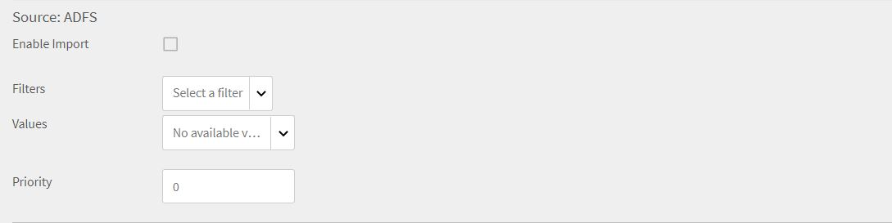

# Learning Manager コネクタ

企業には、Learning Manager と統合する必要がある他のアプリケーションやシステムがあります。コネクターは、外部システムからLearning Managerにデータを読み込むなど、データベースの統合を実行するのに役立つユーティリティです。  また、Learning Managerから外部システムへのデータの書き出しも実行します。

Learning Manager は Salesforce および FTP コネクタを提供します。 Salesforce コネクターを使用すると、組織の統合管理者は Salesforce アプリケーションと Learning Manager を統合できます。統合者は、FTP コネクタを使用して、一連のユーザーをエンタープライズアプリケーションに自動読み込みすることもできます。

Learning Manager では、Lynda、getAbstract、Harvard Management System 用のコネクターも利用できます。これらのコネクタにより、学習者は Lynda.com、getAbstract および Harvard ManageMentor のコースにアクセスして利用できます。

これらのコネクターを設定し、Learning Manager で使用する方法については、以下の説明を参照してください。

<!--
>[!NOTE]
>
>**Update:** December 2020 update of Learning Manager
>
>For **FTP**, **Box**, and **Custom FTP** connectors, while exporting Learner Transcript or xAPI, you can also export the data as a **zip** file, for:
>
>* Learner Transcripts
>* xAPI
-->

>[!NOTE]
>
>2022年11月リリースのAdobe Learning Managerでは、Zoomが廃止されました [2023年6月までのJWT認証](https://marketplace.zoom.us/docs/guides/auth/jwt/). このため、JWT を使用した Zoom コネクターは前述の期日まで利用可能ですが、アカウントの機能を置き換えるためにサーバー間 OAuth アプリを作成することをお勧めします。新しい接続では、デフォルトで Zoom OAuth 認証が使用されます。

## Salesforce コネクタ {#sfconnector}

Salesforce コネクターは Learning Manager アカウントと Salesforce アカウントを接続して、データを自動的に同期します。Salesforceコネクターの機能は次のとおりです。

### マップ属性

統合管理者は Salesforce の列を選択し、それらを対応する Learning Manager のグループ化可能属性にマッピングできます。マッピングが完了すると、それ以降のユーザーの読み込みでは同じマッピングが使用されます。管理者がユーザーを読み込むために別のマッピングを使用したい場合は、再設定できます。

### 自動ユーザー読み込み

ユーザー読み込みプロセスにより、Learning Manager 管理者は Salesforce から従業員の詳細を取得し、その情報を Learning Manager に自動的に読み込ませることができます。この自動化により、CSV の作成および Learning Manager へのアップロードに伴う手作業を省略できます。

### 自動スケジュール

自動ユーザー読み込み機能と同時に自動スケジュール設定機能を使用すると、相乗効果を期待できます。Learning Manager 管理者は、組織のニーズに応じてスケジュールを設定できます。Learning Managerアプリケーションのユーザーは、スケジュールに従って最新の状態にすることができます。 Learning Manager アプリケーションで、同期が毎日実行されます。

### ユーザーのフィルタリング

Learning Manager 管理者は、読み込む前にユーザーにフィルタリングを適用できます。例えば、Learning Manager 管理者は、階層内のすべてのユーザーを 1 人以上の特定のマネージャーの管理下に読み込めます。

### Salesforce コネクターを構成する {#configuresalesforceconnector}

SalesforceとLearning Managerを統合するためのプロセスを学びましょう

#### 前提条件 {#prerequisites}

まず Salesforce 組織の URL が手元にあることを確認してください。例えば、組織名が **myorg** SalesforceのURLは次のようになります `https://myorg.salesforce.com`. Salesforce アカウントを Learning Manager に接続するために入力が必要な項目は、組織名のみです。

また、アカウントにログインできる適切な資格情報が手元にあることも確認してください。

#### 接続の作成 {#createaconnection}

1. Learning Manager のホームページで、Salesforce カード / サムネイルの上にカーソルを移動します。メニューが表示されます。 メニューの&#x200B;**[!UICONTROL 接続]**&#x200B;項目をクリックします。

   

   *接続オプション*

1. 組織の URL を入力するように促すダイアログが表示されます。 クリック **[!UICONTROL Connect]** urlの入力後
1. 接続が成功すると、概要ページが表示されます。

### マップ属性 {#mapattributes}

接続が正常に確立されたら、Salesforceの列をLearning Managerの対応する属性にマッピングできます。 この手順は必須です。

1. マッピングページの左側にはLearning Managerの列が表示され、右側にはSalesforceの列が表示されます。 Learning Managerの列名にマッピングする適切な列名を選択します。

   
   *マップ属性*

   >[!NOTE]
   >
   >左側に表示されているLearning Managerの列データは、アクティブフィールドから取得されます。 この **支配人** フィールドは、電子メールアドレスタイプのフィールドにマッピングする必要があります。 コネクタを使用する前に、すべての列をマッピングすることが必須です。

1. クリック **[!UICONTROL 保存]** マッピングの完了後。
1. これでコネクタは使用可能になりました。管理者アプリ内で設定され、データソースとして表示されるアカウント。管理者は読み込みのスケジュール、またはオンデマンド同期のスケジュールができます。

## Salesforce コネクターの使用 {#usingsalesforceconnector}

Salesforce コネクターは Salesforce.com に接続して、設定どおりにユーザーを取得し、ユーザーを Learning Manager に追加します。

### Salesforce の連絡先からユーザーの読み込み {#import-salesforce-contacts}

Learning Manager は、Salesforce コネクターを拡張して、連絡先と Salesforce ユーザーを取得し、その情報を Learning Manager に自動的にインポートします。

Salesforceコネクタページで、SalesforceのURLを入力し、認証を完了します。 認証が完了したら、ユーザーまたは連絡先の読み込みに進みます。 「連絡先」オプションを選択した場合は、読み込む連絡先のサブセットを指定します。

Salesforceの列を選択し、対応するLearning Managerのグループ化可能属性にマッピングできます。 マッピングが完了すると、それ以降のユーザーの読み込みでは同じマッピングが使用されます。

1. Salesforceにログインします。
1. 接続ページで、をクリックします。 **[!UICONTROL 社内ユーザーのインポート]**.

   
   *社内ユーザーのインポート*

1. を **ユーザーの読み込み** ページには、新しいオプション、連絡先があります。 ラジオボタンをクリック **連絡先** 次のオプションが表示されます。

   
   *連絡先属性のマップ*

1. をクリックした場合 **[!UICONTROL はい]**&#x200B;では、次の操作を実行できます。

   * **連絡先列の選択：** Learning Managerに読み込むフィールドを選択します。
   * **値を指定します。** 選択したフィールドを表す値を選択します。

   
   *値の指定*

   * Salesforceの列をLearning Managerの列にマッピングします。
   * 読み込みを開始するには、 **[!UICONTROL 保存]**.

1. をクリックした場合 **[!UICONTROL いいえ。 すべての連絡先をインポート]**&#x200B;を選択している場合、連絡先をフィルタリングせずにフィールドを直接マップできます。 ここでは、Salesforceからすべての連絡先を読み込みます。
1. 読み込みを開始するには、 **[!UICONTROL 保存]**.

## 学習記録の書き出し

Learning Managerでは、トランスクリプト、ユーザーレポート、スキルレポートなどの学習記録をSalesforceに書き出すことができます。 書き出したデータを、Salesforceの「ユーザー」テーブルまたは「連絡先」テーブルにリンクするかどうかを指定できます。

*学習記録のエクスポート*

### Salesforce のカスタムオブジェクト

Learning Managerから学習記録を書き出すには、Salesforceでカスタムオブジェクトを作成する必要があります。 カスタムオブジェクトとは、会社や業界固有の情報を保存するために作成するオブジェクトです。 詳細については、「[Salesforce カスタムオブジェクト](https://trailhead.salesforce.com/en/content/learn/modules/data_modeling/objects_intro)」を参照してください。

次の方法でオブジェクトを作成します。

1. パッケージをダウンロードしてインストールし、カスタムオブジェクトを作成します。

   * [パッケージ 1](https://test.salesforce.com/packaging/installPackage.apexp?p0=04t1k0000008WPJ)
   * [パッケージ 2](https://test.salesforce.com/packaging/installPackage.apexp?p0=04t1k0000008WPT)
   * [パッケージ 3](https://test.salesforce.com/packaging/installPackage.apexp?p0=04t1k0000008WPi)

1. Salesforce のカスタムオブジェクト名を変更します。
1. イベントを選択し、**[!UICONTROL 「保存」]**&#x200B;をクリックします。

**イベントのリンク先：** 書き出すセクション（「ユーザー」または「連絡先」）を選択します。 「連絡先」オブジェクトを選択すると、Learning Managerに存在するがSalesforceには存在しないユーザーがSalesforceで作成されます。

*イベントのリンクオプション*

>[!NOTE]
>
>1 つのアカウントで複数の接続を作成できます。 Salesforce では、1 つの接続に最大 3 つのカスタムオブジェクトを使用できます。 1 つの Salesforce アカウントに複数の接続を作成する場合は、パッケージを 3 個インストールする必要があります。 対応できるパッケージ数は最大 3 個です。
>
>作成する接続の数に応じて、パッケージをインストールする必要があります。

>[!NOTE]
>
>Salesforce の実行ステータスページでは、Salesforce から処理されたレコードの数のみ確認できます。 処理されたレコードのいずれかに、部分的な書き出しやエラーが発生した場合でも、Learning Managerではステータスが完了済みと表示されます。

## Salesforce パッケージのインストール

Learning ManagerはSalesforceアプリケーションパッケージを提供します。 SFDC にインストールして設定すると、セールス社員は SFDC ポータル内でトレーニングアクティビティを実行できるようになります。 このアプリから、SFDC ユーザーは新しいトレーニングを調べ、推奨事項を表示し、SFDC ポータル内ですぐに実行できます。 また、管理者からのアナウンスを、SFDCポータル内のアプリにマストヘッド形式で表示できます。

### Learning Manager アプリケーションで設定

1. 自分の Learning Manager 管理者アカウントに、統合管理者としてログインします。
1. クリック **[!UICONTROL アプリケーション]** > **[!UICONTROL おすすめアプリ]**.
1. クリック **[!UICONTROL Salesforce]**.
1. Salesforceアプリケーションページで、説明に記載されているアプリケーションID（クライアントIDとも呼ばれます）とクライアントシークレットを確認します。
1. クリック **[!UICONTROL 承認]** また、アプリが正常に承認されている必要があります。
1. クリック **[!UICONTROL 開発者向けリソース]** > **[!UICONTROL テストおよび開発用のアクセストークン]**.
1. 「OAuthコードを取得」セクションで、クライアントIDとスコープを「admin:read,admin:write」に設定します。 クリック **[!UICONTROL 送信]**.
1. 「更新トークンを取得」で、クライアント ID とクライアントシークレットを入力します。 クリック **[!UICONTROL 送信]** 更新トークンを確認します。

### Salesforce アプリでのアカウントの作成

1. Salesforce のサインアップページでアカウントを作成します。 Salesforceアカウントは、開発者版またはエンタープライズ版で作成する必要があります。  [開発者サインアップURL](https://developer.salesforce.com/signup). Salesforceへのサインアップには、Learning Managerで使用した電子メールIDを使用する必要があります。
1. 確認用の電子メールからアカウントを確認します。
1. パスワードを作成し、Salesforce にサインインします。
1. ログイン後にSalesforceのURLに注意してください(例：site.lightning.force.com)

### Learning Manager パッケージのインストール

パッケージをインストールする場合、まず Salesforce で既存のパッケージを削除する必要があります。 アンインストールする前に、次のように設定を有効にする必要があります。 パッケージのインストールには、これらの設定の適用が必須です。

>[!NOTE]
>
>AdobeのLearning Managerアプリは、Salesforce Lightningビューでのみサポートされています。

1. を起動 [Learning ManagerパッケージURL](https://login.salesforce.com/packaging/installPackage.apexp?p0=04t1k0000008WOQ).
1. を **ログイン** ページをクリック **[!UICONTROL カスタムドメインを使用]**.
1. パッケージURLを入力し、 **[!UICONTROL 続行]**. インストールページで「管理者のみにインストール」オプションを選択している必要があります。 このオプションは変更しないでください。
1. クリック **[!UICONTROL インストール]**. パッケージがインストールされたら、 **[!UICONTROL 完了]**. インストール済みパッケージページが表示され、Adobe Learning Manager のインストール済みパッケージが表示されます。
1. 設定の横にある App Launcher に移動して「Adobe Learning Manager」を検索します。
1. アプリを設定するには、 **[!UICONTROL 設定]**.
1. クリック **[!UICONTROL 新規]** 次の詳細を追加します。

   * **Config：**&#x200B;任意の名前を入力します。
   * **ClientID**：最初のセクションで取得した値を入力します。
   * **ClientSecret:** 最初のセクションで取得した値を入力します。
   * **RefreshToken:** 最初のセクションで取得した値を入力します。
   * **LearningManagerBaseURL :** Learning ManagerがホストされているサイトのURL。

### リモートサイトの設定の追加

1. ページの右上隅にあるをクリックします。 **[!UICONTROL 設定]**.
1. イン **[!UICONTROL クイック検索]**&#x200B;リモートサイトの設定を検索します。
1. クリック **[!UICONTROL 新しいリモートサイト]**.
1. 詳細を入力します：

   * **リモートサイト名：**&#x200B;任意の名前を入力します。
   * **リモートサイトの URL：** Learning Manager がホストされているサイトの URL です。

1. Learning Manager を起動します。

### Learning Managerアプリの通知を有効にする

1. 右上隅のをクリックします。 **[!UICONTROL 設定]**.
1. カスタム通知を検索します。
1. クリック **[!UICONTROL 新規]**.
1. 次の情報を入力します。

   1. **カスタム通知名：** LearningManagerNotification
   1. **API名：** LearningManagerNotification

1. 両方を選択 **デスクトップ** および **モバイル** をサポート対象チャンネルに設定します。

1. **[!UICONTROL 「保存」]**&#x200B;をクリックします。
1. モバイルデバイスのプッシュ通知を有効にするには、次の手順に従います：

   1. 携帯電話に Salesforce モバイルアプリをインストールします。
   1. 資格情報を使用してアプリにログインします。
   1. に移動 **設定** > **通知配信設定**.
   1. iOS および Android 用の Salesforce を追加します。

### Salesforce からの Learning Manager のアンインストール

1. Salesforceアプリで「インストール済みパッケージ」に移動します。
1. クリック **[!UICONTROL アンインストール]**.

## Salesforce ユーザー用の学習マネージャーの設定

Learning Manager アプリは、Salesforce アカウント内のユーザーも利用できます。Salesforce 管理者は、プロファイルに基づいてユーザーを追加できます。 Salesforce プロファイルは、Learning Manager のプロファイルと類似しています。たとえば、管理者、統合管理者、インストラクターなどです。 Salesforce 管理者は、カスタムのプロファイルも作成できます。

Salesforce 管理者は、ユーザーにプロファイルを割り当てるか、カスタムのプロファイルを作成することができます。

パッケージをインストールする際に、Salesforce のプロファイルを学習者に割り当てることができます。

パッケージをインストールしてから、プロファイルを構成する必要があります。

クリック **[!UICONTROL 設定]** > **[!UICONTROL 新規]**&#x200B;を選択し、次の項目を追加します。

* 構成名
* ClientID
* ClientSecret
* LearningManagerBaseURL
* リダイレクトの無効化

>[!NOTE]
>
>学習者がLearning Managerアプリを表示できるようにするために、すべての学習者に対してアプリを有効にする必要があります。

次に、Learning Manager アプリにアクセス権を付与します。

*Learning Managerアプリにアクセスするための権限を設定*

ユーザーを選択し、アクセス権を割り当てます。 これで、学習者が Learning Manager アプリにアクセスできるようになりました。

次に、プロファイル（ユーザーの標準プロファイルなど）を選択し、そのプロファイルをクリックします。 クリック **[!UICONTROL 編集]** そして **カスタムアプリ設定** セクションで、チェックボックスをオンにする **Learning ManagerのAdobe**. これにより、ユーザーがアプリにアクセスできるようになりました。

**カスタムタブ設定**&#x200B;セクションの&#x200B;**「学習者ホーム」**&#x200B;ドロップダウンリストで、**「デフォルトでオン」**&#x200B;オプションを選択します。

すべてのプロファイルに対して、アプリを表示可能にすることが必要です。

クリック **[!UICONTROL 保存]** また、すべてのプロファイルに属する学習者がLearning Managerアプリにアクセスできます。

### 学習パス関連の変更点

#### 既存の接続

管理者アカウントで「学習パス」オプションが無効になっている場合、レポートに行や列は追加されません。

管理者アカウントで「学習パス」オプションが有効になっている場合、学習者が登録された場合に備えて「タイプ」列に学習パスが入力されます。

>[!NOTE]
>
>このフラグを有効にして既存の接続を使用すると、いくつかのレコードが失われる可能性があります。

#### 新しい接続

管理者アカウントで「学習パス」オプションが無効になっている場合、トレーニングレポートには以下の列が表示されますが、データは含まれません。

* **埋め込みパス：**&#x200B;埋め込み学習プログラムの名前が表示されます。
* **埋め込みパスの ID：**&#x200B;埋め込み学習プログラムの ID が表示されます。
* **埋め込みコースのID :** 学習パスに含まれるコースのIDが表示されます。

また、学習パスが有効になっているアカウントでの新しい接続では、3 つの新しい列が表示され、すべてのデータが取り込まれます。

さらに、このレポートでは、学習パスに登録されているすべての学習者の「タイプ」列に「学習パス（上位レベル）」が含まれます。

「タイプ」列では「学習プログラム」の名前が「学習パス」に変更されます。 既存の接続の場合は、変更はありません。

## Learning Manager FTP コネクタ {#ftpconnector}

FTP コネクターを使用すると、Learning Manager を任意の外部システムと統合して、データ同期を自動化できます。外部システムがデータを CSV 形式で書き出し、そのデータを Learning Manager FTP アカウントの適切なフォルダーに配置できることが期待されています。FTPコネクタの機能は次のとおりです。

Boxコネクターを使用して、データの移行、ユーザーの読み込み、データの書き出しをおこなうこともできます。 詳しくは、 Boxコネクタを参照してください。

### データの読み込み {#dataimport}

ユーザー読み込みプロセスにより、Learning Manager 管理者は Learning Manager FTP サービスから従業員の詳細を取得し、その情報を Learning Manager に自動的に読み込ませることができます。この機能を使用すると、それらのシステムによって生成された CSV を FTP アカウントの適切なフォルダーに配置することによって、複数のシステムを統合できます。Learning Manager は CSV ファイルを取得し、ファイルをマージして、設定したスケジュールに従ってデータを読み込みます。詳細については、「スケジューリング」機能を参照してください。

**マップ属性**

統合管理者は CSV の列を選択し、その情報を Learning Manager のグループ化が可能な属性にマッピングできます。このマッピングは一度だけの作業です。マッピングがされると、それ以降のユーザーの読み込みでは同じマッピングが使用されます。管理者がユーザーを読み込むための別のマッピングが必要な場合は、マッピングを再構成できます。

#### データの書き出し {#exportdata}

データの書き出しでは、あらゆるサードパーティー製のシステムに統合するためにユーザーがユーザースキル、学習者のトランスクリプトを FTP の場所に書き出すことができます。

#### スケジューリング {#scheduling}

管理者は、組織の要件に応じてタスクをスケジュール設定できます。Learning Manager アプリケーション内のユーザーは、設定されたスケジュールに従って最新の情報に更新されます。同様に、統合管理者は、外部システムと統合されるのに都合のいい時間にスキルの書き出しをスケジュール設定することができます。Learning Manager アプリケーションで、同期が毎日実行されます。

### Learning Manager FTP コネクターを構成する {#configurecaptivateprimeftpconnector}

FTPコネクターとLearning Managerを統合するためのプロセスを学びましょう。

#### 接続の作成 {#Createaconnection-1}

1. Learning Manager ホームページで、FTP カード / サムネイルの上にカーソルを移動します。メニューが表示されます。 メニューの&#x200B;**[!UICONTROL 接続]**&#x200B;項目をクリックします。

   

   *接続オプション*

1. ダイアログが表示され、電子メール ID を入力するように求められます。 組織のLearning Manager FTPアカウントの管理責任者の電子メールIDを入力します。 クリック **[!UICONTROL Connect]** 電子メールidの入力後
1. Learning Manager は、FTP に初めてアクセスする前にユーザーにパスワードの再設定を促す電子メールを送信します。ユーザーはパスワードをリセットし、Learning Manager FTP アカウントへのアクセスにそのパスワードを使用する必要があります。

   >[!NOTE]
   >
   >特定の Learning Manager アカウントに作成できる Learning Manager FTP アカウントは 1 つだけです。

   概要ページでは、統合の接続名を指定できます。 次のオプションから、実行するアクションを選択します。

   * 社内ユーザーの読み込み
   * xAPI の読み込み
   * ユーザースキルの書き出し - スケジュールの設定
   * ユーザースキルの書き出し - オンデマンド
   * 学習者のトランスクリプトの書き出し – スケジュールの設定
   * 学習者のトランスクリプトの書き出し – オンデマンド

   
   *書き出しオプション*

### 読み込み

・+++内ユーザー

社内ユーザーの読み込みオプションを使用すると、オンデマンドまたはスケジュールを設定したうえで、ユーザーをcsvからLearning Managerに読み込むことができます。

+++

+++マップ属性

接続が正常に確立されたら、CSV ファイルの列をマッピングできます。その列は、Learning Manager の対応する属性の FTP フォルダーに配置されます。この手順は必須です。

1. マップ属性ページの左側にはLearning Managerの予想される列が表示され、右側にはCSVの列名が表示されます。 最初は右側に空の選択ボックスがあります。任意のテンプレートCSVを読み込むには、次をクリックします **ファイルを選択**.
1. 上記の手順で、右側の選択ドロップダウンリストにすべての CSV 列名が表示されます。Learning Managerの列名にマッピングする適切な列名を選択します。

   >[!NOTE]
   >
   >マネージャーフィールドは、電子メールアドレスタイプのフィールドにマッピングする必要があります。コネクタを使用する前に、すべての列をマッピングすることが必須です。

1. クリック **[!UICONTROL 保存]** マッピングの完了後。

   これでコネクタは使用可能になりました。設定したアカウントは、管理者が読み込みをスケジュールしたり、オンデマンド同期を実行したりするための管理者アプリ内のデータソースとして表示されます。

+++

+++Learning Manager FTPコネクタの使用

1. 外部システムからのCSVファイルは次のパスに配置する必要があります。

   `code $OPERATION$/$OBJECT_TYPE$/$SUB_OBJECT_TYPE$/data.csv`

   >[!NOTE]
   >
   >2016年7月リリースでは、ユーザーの読み込みのみが許可されています。 したがって、FTPコネクタを使用するには、CSVファイルが次のフォルダーにあることを確認してください。

   `code Home/import/user/internal/*.csv`

1. FTPコネクタは、CSVファイルからすべての行を取得します。 1 つの CSV 内のユーザーに対応する行が他の CSV に表示されないことが重要です。
1. すべてのCSVには、マッピングで指定された列が含まれている必要があります。
1. プロセスを開始する前に、必要なすべてのCSVがフォルダーに存在している必要があります。

>[!NOTE]
>
>ユーザーを Learning Manager に読み込む際、管理者はユーザーが Learning Manager でどのように管理されているかも知っておく必要があります。詳しくは、「 [ユーザー管理ヘルプ](migration-manual.md#usermanagement) 詳細情報を参照してください。

+++

+++xAPIの読み込み

xAPI の読み込みオプションにより、サードパーティ製サービスの xAPI ステートメントを Learning Manager に読み込むための処理のスケジュールを設定できます。

+++

+++xAPIの読み込みに必要な設定

1. 設定ページで、設定リストにある既存の設定を選択し、xAPIステートメントをCSVから読み込みます。 「編集」または **新しい構成の追加** リンクをクリックして、インポートソースの構成ページに移動します。

   **構成**

   * 読み込み元の構成ページで、「名前」フィールドと「ソースファイル名」フィールドに値を入力します。「ソースファイル名」フィールドには、FTP フォルダー内に存在するファイルの名前を入力する必要があります。
   * 「**[!UICONTROL 保存]**」をクリックして変更内容を保存します。

   
   *設定*

   **フィルター**

   * 左側のペインで「**[!UICONTROL フィルター]**」をクリックします。
   * 読み込みフィルターの設定ページで、「名前」フィールドと「条件」フィールドに値を入力して、表示するレコードを絞り込みます。別のフィルターを追加する場合は、「**[!UICONTROL 新しいフィルターを追加]**」をクリックします。「アクション」列の「**保存**」オプションと「**削除**」オプションをクリックして、フィルターの保存と削除を行うことができます。

   
   *フィルター*

   **マッピング**

   * 左側のペインで「**[!UICONTROL マッピング]**」をクリックします。
   * 「xAPI ステートメントの読み込み」 - 「構成」 - 「マッピング」ページの左側に、CSV ファイルの列名にマップする必要がある xAPI JSON フィールドのパス名が表示されます。
   * CSV ファイルの列名にマップする必要がある 3 つの JSON パスフィールドのデフォルト名は、**actor.mbox**、**verb.id**、**object.id** です。これら以外のフィールドを追加してマップするには、「**新しいマッピングを追加**」をクリックします。

   * JSON フィールドのパス名のマップ先となる列名のタイプ（文字列、数値、ブール値、日付）を選択します。
   * マッピングが完了したら、「保存」をクリックします。これで、スケジュールに従って xAPI ステートメントを読み込むことも、必要に応じて随時読み込むこともできるようになります。

   
   *マッピング*

1. 左側のペインで「**[!UICONTROL スケジュールを設定]**」をクリックします。次に「**[!UICONTROL スケジュールを有効にする]**」をクリックして、xAPI ステートメントの読み込みスケジュールを設定します。

   xAPI ステートメントの読み込み開始日時を入力してから、読み込み頻度を日数で入力します。例えば、xAPI ステートメントの読み込みを 3 日ごとに実行する場合は、「3」を入力します。

   
   *xAPIステートメントの読み込み – スケジュールの設定*

1. 左ペインで、 **[!UICONTROL オンデマンド実行]**.

   
   *xAPIステートメントの読み込み – オンデマンド*

1. 左側のペインで「**[!UICONTROL 実行ステータス]**」をクリックすると、該当するコネクタで実行されたすべての読み込み処理の概要情報が時系列で表示されます。この概要情報で、xAPI ステートメントの読み込み開始日と読み込みにかかった時間、読み込み処理のタイプ（オンデマンド読み込みなのかスケジュール設定された読み込みなのか）、読み込み処理のステータス（xAPI ステートメントの読み込み処理が実行中なのか、処理が完了したのか、処理が失敗したのか）を確認することができます。

   
   *xAPIステートメントの読み込み – 実行ステータス*

+++

### 書き出し

+++スキル

ユーザーのスキルレポートを書き出すには、2つのオプションがあります。

**[!UICONTROL ユーザースキル – オンデマンド]**：開始日を指定し、オプションを使用してレポートを書き出すことができます。 レポートは現在までに入力された日付から抽出されます。

*オンデマンド書き出しオプション*

**[!UICONTROL ユーザースキル - 設定]**：このオプションではレポートの抽出をスケジュールできます。「スケジュールを有効にする」チェックボックスをオンにして、開始日時を指定します。レポートを生成して送信する間隔を指定することもできます。

*レポートの書き出しを設定*

+++

書き出されたファイルが保存されている書き出しフォルダーを開くには、次に示すように、ユーザースキルページで提供されているFTPフォルダーへのリンクを開きます。

*ファイルを表示するためのFTPフォルダー*

自動書き出しされたファイルは、この場所にあります **Home/export/&#42;FTP_location&#42;**

自動書き出しされたファイルは、というタイトルの付いたファイルです。 **skill_achievements_&#42;開始日&#x200B;&#42;_から_&#42;終了日&#42;.csv**

*書き出した.csvファイル*

+++学習者のトランスクリプト

**設定**：このオプションでは、レポートの抽出をスケジュールできます。 「スケジュールを有効にする」チェックボックスをオンにして、開始日時を指定します。レポートを生成して送信する間隔を指定することもできます。

+++

書き出されたファイルが保存されているFTPの書き出しフォルダーを開くには、次に示すように、学習者のトランスクリプトページに表示されるFTPフォルダーへのリンクを開きます

自動書き出しされたファイルは、この場所にあります **Home/export/&#42;FTP_location&#42;**

自動書き出しされたファイルは、というタイトルの付いたファイルです。 **learner_transcript_&#42;開始日&#x200B;&#42;_から_&#42;終了日&#42;.csv**

### マニュアル csv フィールドのサポート {#supportformanualcsvfields}

FTP を介してユーザーデータを読み込む際に、管理者は、システムに存在するすべてのアクティブなフィールドを csv の対応するフィールドにマッピングする必要があります。

これは、csv のすべてのアクティブフィールドについて必須の処理です。 マニュアルのアクティブフィールドの場合、統合管理者は&#x200B;**「DontImportFromSource」**&#x200B;オプションを選択できます。

このオプションを選択することで、マニュアルのアクティブフィールドに、csv から読み込まれた値が入力されることはなくなります。 学習者が指定した値は変更されません。

>[!NOTE]
>
>マッピング中に **DontImportFromSource** がcsvアクティブフィールドに選択されている場合、このフィールドはシステムから削除されます。

*アクティブフィールド用のFTPコネクタ*

## Lynda コネクタ {#lyndaconnector}

Lynda.com をご利用のエンタープライズのお客様は、Lynda コネクターを使用することにより、お客様の学習者が Learning Manager 内で Lynda コースを検索および使用できるようになります。API キーを使用して Lynda.com からコースを定期的に取得するようにコネクタを構成することができます。Learning Manager 内にコースが作成されると、ユーザーはコースを検索して使用できます。学習者の進行状況は Learning Manager 内で追跡できます。

### Lynda コネクターを構成する {#configurethelyndaconnector}

1. 統合管理者のダッシュボードから、Lynda をクリックします。

   「はじめに」、「接続」、「接続の管理」の 3 つのオプションがあるタイルが表示されます。

1. Lynda コネクタを初めて構成する場合は、「接続」をクリックします。

   <!--Configure the Exavault FTP account before you configure this connector.-->

1. 接続ページから、コネクターの名前を指定します。接続に使用する Appkey と秘密キーを入力してください。

   >[!NOTE]
   >
   >Appkey と秘密キーを入手するには、ベンダーにお問い合わせください。

1. 「保存」をクリックします。

   設定が保存されされました。アカウントの Lynda 接続が追加されます。ホームページから「接続の管理」をクリックして、いつでも設定を編集できるようになりました。

1. 接続が既に確立されている場合は、「接続を管理」をクリックしてすべての接続を表示します。

   >[!NOTE]
   >
   >このコネクタを構成する前に、アカウントの移行機能を有効にする必要があります。

1. 編集したい接続をクリックします。
1. 左ペインで、 **[!UICONTROL 設定]**. 次のどちらかの操作を実行します。

   * このウィンドウから、アカウントの詳細と同期スケジュールを表示または編集します。このアカウントを有効にする場合は、「接続を有効にする」チェックボックスをオンにします。
   * 「編集」をクリックして資格情報を編集します。このフィールドの更新を元に戻すには、「リセット」をクリックします。
   * 同期をスケジュールするには、「スケジュールを有効にする」をクリックします。開始日時を入力してから、同期スケジュールの頻度を日数で入力できます。例えば、3 日ごとに同期を有効にします。

   「**[!UICONTROL 保存]**」をクリックして変更内容を保存します。

   

   *Learning Manager用Lyndaコネクターの設定*

1. 左ペインで、「オンデマンド実行」をクリックします。このオプションを使用すると、Lynda からユーザーフィードやその他の関連データを読み込むことができます。オンデマンド実行の開始日を入力し、「実行」をクリックして同期を実行します。開始日から現在までのすべてのデータが読み込まれます。

   * 同期中にアプリケーションのダウンタイムが発生する場合は、「実行中の Learning Manager へのアクセスを無効にする」をクリックします。
   * 「実行中の Learning Manager へのアクセスを有効にする」をクリックした場合でも、同期中にサービスが中断されることはありません。

   

   *Lyndaコネクタのオンデマンド実行を実行する*

1. 左ペインから「実行ステータス」をクリックすることで、いつでもこのコネクタのすべての実行の概要を時系列で表示できます。同期の開始日と期間、同期の種類（オンデマンド同期かどうか）および同期のステータス（同期が進行中か完了か）を表示できます。

   >[!NOTE]
   >
   >接続を削除して再作成すると、コネクタの以前の実行が再び表示されます。接続を削除する前にすべての実行を表示できます。

   最新の同期に対してのみ再実行ができます。

   

   *すべての実行の概要を表示するには、「実行ステータス」をクリックします。*

## getAbstract コネクタ {#getabstractconnector}

getAbstract.com をご利用のエンタープライズのお客様は、getAbstract コネクタを使用することにより、お客様の学習者が getAbstract の要約を検索、使用できるようになります。Learning Manager 内で作成された学習者の完了レコードに基づいて、使用データを定期的に取得するようにコネクターを構成できます。Learning Manager でこのコネクターを構成する方法については、以下の説明を参照してください。

### getAbstract コネクタを構成する {#configurethegetabstractconnector}

1. 統合管理者のダッシュボードから、getAbstract をクリックします。

   タイルには、「はじめに」、「接続」、「接続の管理」の 3 つのオプションが表示されます。

1. getAbstract コネクタを初めて構成する場合は、「接続」をクリックします。

   <!--Configure the Exavault FTP account before you configure this connector.

   Ensure that you share this FTP credentials with your content provider to access the feeds.-->

1. 「接続名」フィールドに接続名を入力します。

   クライアント ID フィールドとクライアント秘密フィールドに適切なキーを入力します。このコネクタの適切なキーを入手するには、ベンダーに問い合わせます。

   これらのキーは、クライアントが受講するコースのコースメタデータを取得するために必要です。

1. 接続が既に確立されている場合は、ホームページから getAbstract／接続の管理をクリックして既存の構成を表示および編集します。

   >[!NOTE]
   >
   >このコネクタを構成する前に、アカウントの移行機能を有効にする必要があります。

1. 設定を表示または編集する接続をクリックします。

   

   *Learning ManagerのgetAbstractコネクターを設定する*

1. 左ペインで、[Configure]をクリックします。 次のどちらかの操作を実行します。

   * このウィンドウから、アカウントの詳細と同期スケジュールを表示または編集します。このアカウントを有効にする場合は、「接続を有効にする」チェックボックスをオンにします。
   * 「編集」をクリックして資格情報を編集します。このフィールドの更新を元に戻すには、「リセット」をクリックします。
   * 同期をスケジュールするには、「スケジュールを有効にする」をクリックします。開始日時を入力してから、同期スケジュールの頻度を日数で入力できます。例えば、3 日ごとに同期を有効にします。

1. **[!UICONTROL 「保存」]**&#x200B;をクリックします。

   設定は保存されました。アカウントに getAbstract の接続が追加されます。

1. 左ペインで、「オンデマンド実行」をクリックします。このオプションを使用すると、getAbstract からユーザーのフィードおよびその他の関連データを読み込むことができます。オンデマンド実行の開始日を入力し、「実行」をクリックして同期を実行します。開始日から現在までのすべてのデータが読み込まれます。

   * 同期中にアプリケーションのダウンタイムが発生する場合は、「実行中の Learning Manager へのアクセスを無効にする」をクリックします。
   * 「実行中の Learning Manager へのアクセスを有効にする」をクリックした場合でも、同期中にサービスが中断されることはありません。

1. 左ペインから「実行ステータス」をクリックすることで、いつでもこのコネクタのすべての実行の概要を時系列で表示できます。同期の開始日と期間、同期の種類（オンデマンド同期かどうか）および同期のステータス（同期が進行中か完了か）を表示できます。

   >[!NOTE]
   >
   >接続を削除して再作成すると、コネクタの以前の実行が再び表示されます。接続を削除する前にすべての実行を表示できます。

   最新の同期に対してのみ再実行ができます。

   その種類を問わず、あらゆる同期が動作するために、同期に指定された日付の getAbstract FTP フォルダーにユーザーフィードがあることを確認します。

   次の Excel シートを参照してください。これは、getAbstract のユーザーフィードファイルのサンプルです。ファイル名は、**report_export_yyyy_MM_dd_HHmmss.xlsx** または **report_export_yyyy_MM_dd.xlsx** の形式に従う必要があります。
   [getAbstractユーザーフィードサンプルExcelシート](assets/report-export-20170401175342.xlsx)

## Harvard ManageMentor コネクタ {#hmmconnector}

Harvard ManageMentor をご利用のエンタープライズのお客様は、Harvard ManageMentor コネクタを使用することにより、お客様の学習者が Harvard ManageMentor のコースを検索、使用できるようになります。このコネクターは Learning Manager 内でコースを作成するのに役立つほか、学習者の進行状況データを定期的に取得するように設定できます。このコネクターを構成するには、次の手順を実行します。

### Harvard ManagerMentor コネクターを構成する {#configuretheharvardmanagermentorconnector}

1. 統合管理者のダッシュボードから、Harvard ManageMentor をクリックします。

   タイルには、「はじめに」、「接続」、「接続の管理」の 3 つのオプションが表示されます。

1. Harvard ManageMentor コネクタを初めて構成する場合は、「接続」をクリックします。

   <!--Configure the Exavault FTP account before you configure this connector.

   Ensure that you share this FTP credentials with your content provider to access the feeds.-->

1. 接続名フィールドに接続名を入力します。「接続」をクリックしてこの接続を保存します。
1. 接続が既に確立されている場合は、ホームページから Harvard ManageMentor／接続を管理をクリックします。編集したい接続をクリックします。

   >[!NOTE]
   >
   >このコネクタを構成する前に、アカウントの移行機能を有効にする必要があります。

   

   *Learning Manager用HarvardManage Mentorコネクターの設定*

1. 左ペインで、[Configure]をクリックします。 次のどちらかの操作を実行します。

   * このウィンドウから、アカウントの詳細と同期スケジュールを表示または編集します。このアカウントを有効にする場合は、「接続を有効にする」チェックボックスをオンにします。
   * 同期をスケジュールするには、「スケジュールを有効にする」をクリックします。開始日時を入力してから、同期スケジュールの頻度を日数で入力できます。例えば、3 日ごとに同期を有効にします。

1. 左ペインで、「オンデマンド実行」をクリックします。このオプションを使用すると、Harvard ManageMentor からユーザーのフィードおよびその他の関連データを読み込むことができます。オンデマンド実行の開始日を入力し、「実行」をクリックして同期を実行します。この接続の開始日から現在までのすべてのデータが読み込まれます。

   * 同期中にアプリケーションのダウンタイムが発生する場合は、「実行中の Learning Manager へのアクセスを無効にする」をクリックします。
   * 「実行中の Learning Manager へのアクセスを有効にする」をクリックした場合でも、同期中にサービスが中断されることはありません。

   数日ごとに同期を自動化したい場合は、繰り返し日数フィールドに日数を指定します。同期はお使いのアカウントが Harvard ManageMentor からの要約とサマリの最新版で更新されることを保証します。

1. 左ペインから「実行ステータス」をクリックすることで、いつでもこのコネクタのすべての実行の概要を時系列で表示できます。同期の開始日と期間、同期の種類（オンデマンド同期かどうか）および同期のステータス（同期が進行中か完了か）を表示できます。

   >[!NOTE]
   >
   >接続を削除して再作成すると、コネクタの以前の実行が再び表示されます。接続を削除する前にすべての実行を表示できます。

   最新の同期に対してのみ再実行ができます。

   同期を成功させるには、Harvard ManageMentor の FTP フォルダーに次のファイルの少なくとも 1 つが存在することを確認してください。

   hmm12_metadata.xlsx：このファイルは、Harvard ManageMentor コネクタのコースメタデータを提供します。ファイルをアップロードするときは、必ず命名規則に従ってください。

   client_hmm12_20150125.xlsx：これは、Harvard ManageMentor コネクタのユーザーフィードです。以下のファイル命名規則は、**client_hmm12_yyyyMMdd.xlsx** です。

   このコネクタについて、次の 2 つのサンプルユーザーフィードおよびコースフィードファイルを参照してください。

   * [Harvard ManageMentorコネクタのコースメタデータファイル](assets/hmm12-metadata.xlsx)
   * [Harvard ManageMentor コネクターのユーザーフィード](assets/client-hmm12-20170304.xlsx)

## Workday コネクタ {#workdayconnector}

Workday コネクターを使用すると、Learning Manager を Workday のテナントと統合して、データを自動的に同期できます。

### 読み込み

#### マップ属性

統合管理者はWorkdayの列を選択し、その列を対応するLearning Managerのグループ化可能属性にマッピングできます。 マッピングが完了すると、それ以降のユーザーの読み込みでは同じマッピングが使用されます。管理者がユーザーを読み込むために別のマッピングを使用したい場合は、再設定できます。

#### 自動ユーザー読み込み

ユーザー読み込みプロセスにより、Learning Manager 管理者は Workday から従業員の詳細を取得し、その情報を Learning Manager に自動的に読み込ませることができます。

#### ユーザーのフィルタリング

Learning Manager 管理者は、読み込む前にユーザーにフィルタリングを適用できます。例えば、Learning Manager 管理者は、階層内のすべてのユーザーを 1 人以上の特定のマネージャーの管理下に読み込めます。

### 書き出し

ユーザースキルの書き出しにより、ユーザーはユーザースキルを Workday に自動的に書き出すことができます。

>[!NOTE]
>
>複数の Learning Manager アカウントからのスキルを、同じ Workday アカウントを使用して同時に書き出すことはできません。

### スケジューリング {#Scheduling-1}

管理者は、組織の要件に応じてタスクをスケジュール設定できます。Learning Manager アプリケーション内のユーザーは、設定されたスケジュールに従って最新の情報に更新されます。同様に、統合管理者は、外部システムと統合されるのに都合のいい時間にスキルの書き出しをスケジュール設定することができます。Learning Manager アプリケーションで、同期が毎日実行されます。

### Workday コネクターを構成する {#configureworkdayconnector}

>[!PREREQUISITES]
>
>ISU_Permissionsドキュメントで定義されている権限で統合システムユーザー(ISU)を作成するには、組織のWorkday管理者に依頼してください。 下のリンクからコピーをダウンロードします。

[統合システムユーザー(ISU)のセキュリティのコピーをダウンロードします。](assets/isu-permissions-v1.pdf) WorkdayコネクターとLearning Managerを連携するためのプロセスを学びましょう。

1. Learning Managerホームページで、Workdayタイルにカーソルを合わせます。 メニューが表示されます。 メニューの&#x200B;**[!UICONTROL 接続]**&#x200B;項目をクリックします。

   

   *Workdayタイル*

1. 新しい接続の資格情報を入力するように促すダイアログが表示されます。 接続する前に、以下のフィールドを入力してください。

   * 接続名：任意の接続名を入力してください。
   * ホスト URL：統合管理者は、該当 Workday 管理者からホスト URL の詳細を取得できます。
   * テナント：テナントは会社の内部です。 Workday 管理者からテナントの詳細が提供されます。
   * ユーザー名とパスワード： Workday管理者は、必要なセキュリティ権限を持つ統合システムユーザー(ISU)を作成し、統合管理者と共有します。

>[!NOTE]
>
>   Learning ManagerはWorkday APIのバージョン40.1を使用しています。

*Workdayコネクタの設定*

1. すべての関連フィールドに情報を入力したら、「接続」をクリックします。

   >[!NOTE]
   >
   >複数の Workday 接続を Learning Manager アカウントに同期させることもできます。

概要ページでは、統合の接続名を指定できます。 実行したいアクションを次のいずれかから選択してください。

* 社内ユーザーの読み込み
* ユーザースキルの書き出し - スケジュールの設定
* ユーザースキルの書き出し - オンデマンド

*Workdayについて*

### 読み込み

#### マップ属性 {#MapAttributes-1}

Workday コネクターを使用すると、Learning Manager と Workday を統合して、データを自動的に同期できます。すべてのアクティブユーザーを Workday から Learning Manager に読み込むことができます。ユーザーは FTP や Salesforce などの様々なデータソースから読み込むことができます。

ユーザーを読み込む前に、Learning Manager と Workday のユーザー属性をマッピングする必要があります。概要ページで、読み込みの下の「社内ユーザー」オプションを使用してマップ属性を提供します。

「Adobe学習マネージャー」列にAdobe学習マネージャーの資格情報を入力します。 ドロップダウンを使用して、Workday の列に対して正しい資格情報を選択します。

>[!NOTE]
>
>現在 Learning Manager は、Workday から 69 のユーザー属性の読み込みをサポートしています。Learning Manager のアクティブフィールドを使用して、属性を追加します。

*マップ属性*

を選択します **派遣社員を除外** このチェックボックスをオンにすると、マネージャーの下で使用可能な一時的なワーカーがインポートされなくなります。

Workday に 4 つの階層レベルがあるのに対し、Learning Manager には 2 つのレベルがあります。Workdayの4つのレベルは、スキルプロファイルカテゴリ、スキルプロファイル、スキルアイテムカテゴリ、およびスキルアイテムです。 Learning Managerのスキル名とレベルは、Workdayのスキルアイテムにマッピングされます。

>[!NOTE]
>
>Workday 属性も追加できます。 属性を追加するには、CSAM に連絡してください。

+++サポートされているWorkday属性のリスト

wd:User_ID wd:Worker_ID manager wd:Personal_Data.wd:Name_Data.wd:Preferred_Name_Data.wd:Name_Detail_Data@wd:Formatted_Name wd:Personal_Data.wd:Name_Data.wd:Legal_Name_Data.wd:Name_Detail_Data@wd:Formatted_Name wd:Personal_Data.wd:Name_Data.wd:Legal_Name_Data.wd:Name_Detail_Data.wd:Prefix_Data.wd:Title_Descriptor wd:Personal_Data.wd:Name_Data.wd:Name_Data.wd:Preferred_Name_Data.wd:Name_Detail_Data.wd:Prefix_Data.wd:Title_Descriptor wd:Personal_Data.wd:Preferred_Name_Data.wd .wd:First_Name wd:Personal_Data.wd:Name_Data.wd:Preferred_Name_Data.wd:Name_Detail_Data.wd:Last_Name wd:Personal_Data.wd:Name_Data.wd:Legal_Name_Data.wd:Name_Detail_Data.wd:First_Name wd:Personal_Data.wd:Name_Data.wd:Legal_Name_Data.wd:Name_Detail_Data.wd:Last_Name .wd:Contact_Data.wd:Address_Data.0@wd:Formatted_Address wd:Personal_Data.wd:Contact_Data.wd:Address_Data.0.wd:Postal_Code wd:Personal_Data.wd:Contact_Data.wd:Email_Address_Data.0.wd:Email_Address wd:Personal_Data.wd:Contact_Data.wd:Address_Data.0.wd:Country_Region_Descriptor wd:Personal_Data.wd:Contact_Data.wd:Phone_Data.0@wd:Formatted_Phone wd:Personal_Data.wd:Contact_Data.wd:Phone_Data.0.wd:Country_ISO_Code wd:Personal_Data.wd:Contact_Data.wd:Phone_Data.0.wd:International_Phone_Code wd:Personal_Data.wd:Contact_Data.wd:Phone_Data.0.wd:Phone_Number wd:Personal_Data.wd:Primary_Nationity_Reference.wd:ID.1$ wd:Personal_Data.wd:Gender_Reference.wd:ID.1.$ wd:Personal_Data.wd:Identification_Data.wd:National_ID.0.wd:ID wd:Personal_Data.wd:Identification_Data.wd:Custom_ID.0.wd:Custom_ID_Data.wd:ID wd:User_Account_Data.wd:Default_Display_Language_Reference.wd:ID.1$ wd:Role_Data.wd:Organization_Role_Data.wd:Organization_Role.0.wd:Organization_Role_Reference.wd:ID.1.$ wd:Employment_Data.wd:Worker_Job_Data.0.wd:Position_Data.wd:Position_Title wd:Employment_Data.wd:Worker_Job_Data.0.wd:Position_Data.wd:Business_Title wd:Employment_Data.wd:Worker_Job_Data.0.wd:Position_Data.wd:Business_Site_Summary_Data.wd:Name wd:Employment_Data.wd:Worker_Job_Data.0.wd:wd:Position_Data :Business_Site_Summary_Data.wd:Address_Data.@wd:Formatted_Address wd:Employment_Data.wd:Worker_Job_Data.0.wd:Position_Data.wd:Job_Classification_Summary_Data.0.wd:Job_Classification_Reference.wd:ID.1$ wd:Employment_Data.wd:Worker_Job_Data.0.wd:Position_Data.wd:Job_Classification_Summary_Data.0.wd:Job_Group_Reference.wd:ID.1$ wd:Employment_Data.wd:Worker_Job_Data.0.wd:Position_Data.wd:Work_Space__Reference.wd:ID.1.$ wd:Employment_Data.wd:Worker_Job_Data.0.wd:Position_Data.wd:Job_Profile_Summary_Data.wd:Job_Family_Reference.0.wd:ID.1$ wd:Employment_Data.wd:Worker_Job_Data.0.wd:Position_Data.wd:Job_Profile_Summary_Data.wd:Job_Profile_Name wd:Employment_Data.wd:Worker_Job_Data.0.wd:Position_Data.wd:Job_Profile_Summary_Data.wd:Job_Profile_Reference.wd:ID.1$ wd:Employment_Data.wd:Worker_Job_Data.0.wd:Position_Data.wd:Business_Site_Summary_Data.wd:Address_Data.0.wd:Country_Reference.wd:ID.2$ wd:Employment_Data.wd:Worker_Job_Data.0.wd:Position_Data.wd:Worker_Type_Reference.wd:ID.1.$ wd:Employment_Data.wd:Worker_Job_Data.0.wd:Position_Data.wd:Business_Site_Summary_Data.wd:Address_Data.0.@wd:Formatted_Address wd:Employment_Data.wd:Worker_Job_Data.0.wd:Position_Data.wd:Job_Profile_Summary_Data.wd:Management_Level_Reference.wd:ID.1$ wd:Employment_Data.wd:Worker_Status_Data.wd:Active wd:Employment_Data.wd:Worker_Status_Data.wd:Active_Status_Date wd:Employment_Data.wd:Worker_Status_Data.wd:Hire_Date wd:Employment_Data.wd:Worker_Status_Data.wd:Original_Hire_Date wd:Employment_Data.wd:Worker_Data.wd:Worker_Status.Data wd:Retirement_Date wd:Employment_Data.wd:Worker_Status_Data.wd:Terminated wd:Employment_Data.wd:Worker_Status_Data.wd:Termination_Date wd:Employment_Data.wd:Worker_Status_Data.wd:Termination_Last_Day_of_Work wd:Organization_Data.wd:Worker_Organization_Data.0.wd:Organization_Data.wd:Organization_Wd:Code:Organization_Data.wd:Worker_Organization_Data.0.wd:Wd organization_Data.wd:Organization_Name wd:Organization_Data.wd:Worker_Organization_Data.0.wd:Organization_Data.wd:Organization_Type_Reference.wd:ID.1$ wd:Organization_Data.wd:Worker_Organization_Data.0.wd:Organization_Data.wd:Organization_Subtype_Reference.wd:ID.1.$ wd:Qualification_Data.wd:Education.0.wd:School_Name wd:Qualification_Data.wd:External_Job_History.0.wd:Job_History_Data.wd:Job_Title wd:Qualification_Data.wd:External_Job_History.0.wd:Job_History_Data.wd:Company wd:Management_Chain_Data.wd:Worker_Supervisory_Management_Chain_Data.0.wd:Manager.Employee IDプライマリ作業電子メールwd:Organization_Type_Reference_Cost_Center_ID wd:Organization_Type_Reference_Cost_Center_Name wd:Organization_Type_Reference_Company wd:Organization_Subtype_Reference_Department wd:Organization_Subtype_Reference_Division wd:Universal_ID wd:Integration_Field_Override_Data.3.wd:Value wd:Employment_Data.wd:Worker_Job_Data.0.wd:Position_Data.wd:Business_Site_Summary_Data.wd:Address_Data.0.wd:Country_Region_Descriptor wd:Employment_Data.wd:Worker_Job_Data.0.wd:Position_Data.wd:Business_Site_Summary_Data.wd:Address_Data.0.wd:Country_Region_Reference.wd:ID.2$ wd:Personal_Data.wd:Contact_Data.wd:Address_Data.0.wd:Municipal

+++

### 書き出し

ユーザーが達成したすべてのスキルを Learning Manager から Workday に書き出すことができます。Learning Manager はすべてのアクティブなユーザースキルのみを書き出し、廃止スキルは書き出しません。複数のLearning Managerに接続することもできます\
同じWorkdayコネクタにアカウントを関連付けます。 2つのLearning Managerアカウントのスキル名が同じ場合、Workdayの同じスキルにマッピングされます。 2つのLearning Managerアカウントが同じWorkdayアカウントを使用している場合、Workdayでスキルをアップデートする前に、すべてのLearning Managerアカウントでスキル名をアップデートすることをお勧めします。

+++ユーザースキル – 設定

このオプションではレポート抽出のスケジュール設定ができます。「この接続を使用してユーザースキル書き出しを有効にする」チェックボックスがオンになっていることを確認します。「スケジュールを有効にする」チェックボックスをオンにして、開始日時を指定します。レポートを生成して送信する間隔を指定することもできます。「スケジュールを有効にする」チェックボックスをオンにして、開始日、時間および「n」日後に繰り返すを入力します。完了したら、「保存」をクリックします。

*ユーザースキルレポートの設定*

+++

+++ユーザースキル – オンデマンド

開始日を指定し、オプションを使用してレポートを書き出すことができます。レポートは現在までに入力された日付から抽出されます。レポートの生成を開始する日付を入力して「実行」をクリックします。

*オンデマンドユーザースキルレポート*

+++

+++ユーザースキル – 実行ステータス

ここでは、すべてのタスクの概要を表示し、それらのステータスレポートを取得できます。エラーレポートのリンクをクリックすると、エラーレポートをダウンロードできます。

*ユーザースキル実行レポート*

+++

## miniOrange コネクタ {#miniorangeconnector}

miniOrange コネクターを使用して、Learning Manager と miniOrange のテナントを統合し、データを自動的に同期できます。

### 読み込み

#### マップ属性

統合管理者はminiOrange属性を選択し、対応するLearning Managerのグループ化可能属性にマッピングできます。 マッピングが完了すると、それ以降のユーザーの読み込みでは同じマッピングが使用されます。管理者がユーザーを読み込むために別のマッピングを使用したい場合は、再設定できます。

#### 自動ユーザー読み込み

ユーザー読み込みプロセスにより、Learning Manager管理者はminiOrangeから従業員の詳細を取得し、その情報をLearning Managerに自動的に読み込ませることができます。

#### ユーザーのフィルタリング

Learning Manager 管理者は、読み込む前にユーザーにフィルタリングを適用できます。例えば、Learning Manager 管理者は、階層内のすべてのユーザーを 1 人以上の特定のマネージャーの管理下に読み込めます。

miniOrangeコネクターを設定するには、Learning Manager CSMチームにお問い合わせください。

### miniOrange コネクタを構成する {#configureminiorangeconnector}

1. Learning Managerホームページで、miniOrangeカード/サムネールにカーソルを合わせます。 メニューが表示されます。 クリック  **[!UICONTROL Connect]** をクリックします。

   

   *miniOrangeコネクタタイル*

1. クリック **[!UICONTROL Connect]** 新しい接続を確立します。 miniOrangeコネクタページが表示されます。 マッピングしたいアカウントの詳細を入力してください。

   

   *接続を作成する*

1. miniOrnageユーザーをLearning Manager社内ユーザーとして直接読み込む場合、 **[!UICONTROL 社内ユーザーのインポート]** オプションです。

   

   *社内ユーザーのインポート*

1. マッピングページの左側にはLearning Managerの列が表示され、右側にはminiOrnageの列が表示されます。 Learning Managerの列名にマッピングする適切な列名を選択します。

   

   *マップ属性*

1. データソースを表示して編集するには、管理者として&#x200B;**[!UICONTROL 設定／データソース]**&#x200B;をクリックします。

   確立されたminiOrangeソースがリストされます。 フィルターを編集する必要がある場合は、 **[!UICONTROL 編集]**.

   

   *データソースの表示と編集*

1. 読み込みが完了すると通知を受信します。ログの読み込みを表示または編集するには、**[!UICONTROL ユーザー／ログの読み込み]**&#x200B;をクリックします。

#### 接続を削除する {#deleteaconnection}

確立されたminiOrange接続を削除するには、次の手順に従います。

<!---## Video conferencing connectors (Bluejeans Meetings and Zoom) {#bluejeansconnector}

You can now integrate Learning Manager with BlueJeans and Zoom connectors and use them to host classes.  The connector enables you to set up video conferencing meetings/classes with the learners.

To set up and use the connector, follow these steps.

1. In Learning Manager  home page , hover the mouse over the BlueJeans/Zoom thumbnail. A menu appears. Click  **[!UICONTROL Connect]** option from the menu.

   

   *Zoom connector tile*

1. The BlueJeans/ Zoom connector page opens. Enter the details of your account into respective fields to integrate and synchronize the user feed. You can get the details from the administrator of your connector account.

   
   *Connect to BlueJeans/ Zoom*

   >[!NOTE]
   >
   >As a learner, while enabling the connector, use the same email id used for your Learning Manager account to enable user feeds back into Learning Manager.

1. Once the connection is established, as an Author, create a VC course with BlueJeans/ Zoom as the conferencing system.

   
   
   *Create a VC course*

1. Administrators, managers, and learners can enroll learners  to  the created course. Upon enrollment, the learner receives an email. The learner can sign in to their Learning Manager account to view the program details and take the course.
1. When the course is complete, the completion report is sent to Learning Manager. The administrator can see the completion report to check the attendance and score of the learners.

   
   *Attendance and scoring report*

### Create a zoom server-to-server OAuth app

When you create a Zoom Server-to-Server OAuth app to be used in Adobe Learning Manager, you must add scopes required by Adobe Learning Manager while creating the connection.

Adobe Learning Manager requires the scopes below and the scopes must be selected in the OAuth app.

* View all user meetings /meeting:read:admin
* View and manage all user meetings /meeting:write:admin
* View report data /report:read:admin
* View all user information /user:read:admin
* View users' information and manage users /user:write:admin-->

## Box コネクター {#boxconnector}

Box コネクターを使用すると、Learning Manager を任意の外部システムと統合して、データを自動的に同期できます。外部システムがデータをCSV形式で書き出し、そのデータをLearning ManagerのBoxアカウントの適切なフォルダーに配置できることが期待されています。 ボックスコネクタの機能は次のとおりです。

FTPコネクターを使用して、データの移行、ユーザーの読み込み、データの書き出しをおこなうこともできます。 詳しくは、 [Learning Manager FTP コネクタ。](connectors.md#main-pars_header_1427405935)

### データの読み込み {#DataImport-1}

ユーザー読み込みプロセスにより、Learning Manager 管理者は Learning Manager Box サービスから従業員の詳細を取得し、その情報を Learning Manager に自動的に読み込ませることができます。この機能を使用すると、それらのシステムによって生成された CSV を Box アカウントの適切なフォルダーに配置することによって、複数のシステムを統合できます。Learning Manager は CSV ファイルを取得し、ファイルをマージして、設定したスケジュールに従ってデータを読み込みます。詳細については、「スケジューリング」機能を参照してください。

**マップ属性**

統合管理者は CSV の列を選択し、その情報を Learning Manager のグループ化が可能な属性にマッピングできます。このマッピングは1回限りの作業です。 マッピングがされると、それ以降のユーザーの読み込みでは同じマッピングが使用されます。管理者がユーザーを読み込むための別のマッピングが必要な場合は、マッピングを再構成できます。

## データの書き出し {#dataexport}

データの書き出しでは、あらゆるサードパーティー製のシステムに統合するためにユーザーがユーザースキル、学習者のトランスクリプトを Box の場所に書き出すことができます。

## レポートのスケジュール {#schedulereports}

管理者は、組織の要件に応じてタスクをスケジュール設定できます。Learning Manager アプリケーション内のユーザーは、設定されたスケジュールに従って最新の情報に更新されます。同様に、統合管理者は、外部システムと統合されるのに都合のいい時間にスキルの書き出しをスケジュール設定することができます。Learning Manager アプリケーションで、同期が毎日実行されます。

## Box コネクターを構成する {#configureboxconnector}

BoxコネクターとLearning Managerを統合するためのプロセスを学びましょう。

1. Learning Managerホームページで、Boxカード/サムネールにカーソルを合わせます。 メニューが表示されます。 メニューの接続項目をクリックします。

   

   *Boxに接続*

1. ダイアログが表示され、電子メール ID を入力するように求められます。 組織のLearning Manager Boxアカウントの管理責任者の電子メールIDを入力します。 電子メールIDを入力した後、「接続」をクリックします。
1. Learning Manager では、Box に初めてアクセスする前にユーザーにパスワードの再設定を促す電子メールが送信されます。ユーザーはパスワードをリセットし、Learning Manager Boxアカウントへのアクセスに使用する必要があります。

   >[!NOTE]
   >
   >特定のLearning Managerアカウントに作成できるLearning Manager Boxアカウントは1つだけです。

   概要ページでは、統合の接続名を指定できます。 次のオプションから、実行するアクションを選択します。

   * 社内ユーザーの読み込み
   * xAPI アクティビティレポートの読み込み
   * ユーザースキルの書き出し - スケジュールの設定
   * ユーザースキルの書き出し - オンデマンド
   * 学習者トランスクリプトの書き出し – スケジュールの設定
   * 学習者のトランスクリプトの書き出し – オンデマンド

## 読み込み

・+++内ユーザー

内部ユーザー読み込みオプションを使用すると、ユーザー読み込みレポートの生成を自動的にスケジュールすることができます。生成されたレポートは .CSV ファイルとして届きます。

+++

+++マップ属性

接続が正常に確立されたら、Boxフォルダー内に配置されているCSVファイルの列を、Learning Managerの対応する属性にマッピングできます。 この手順は必須です。

1. マップ属性ページの左側にはLearning Managerの予想される列が表示され、右側にはCSVの列名が表示されます。 最初は右側に空の選択ボックスがあります。「ファイルを選択」をクリックして、任意のテンプレートCSVを読み込みます。
1. 上記の手順で、右側の選択ドロップダウンリストにすべての CSV 列名が表示されます。Learning Managerの列名にマッピングする適切な列名を選択します。

   *マネージャーフィールドは、電子メールアドレスタイプのフィールドにマッピングする必要があります。 コネクタを使用する前に、すべての列をマッピングすることが必須です。*

1. マッピングが完了したら、「保存」をクリックします。

   これでコネクタは使用可能になりました。設定したアカウントは、管理者が読み込みをスケジュールしたり、オンデマンド同期を実行したりするための管理者アプリ内のデータソースとして表示されます。

+++

+++xAPIアクティビティレポート

「xAPI アクティビティレポート」オプションにより、サードパーティ製サービスから xAPI ステートメントをファイルとして読み込むための構成を生成することができます。Learning Manager に読み込まれたファイルは .CSV ファイルとして保存され、その後 xAPI ステートメントに変換されます。

+++

+++xAPIの読み込みに必要な設定

1. 設定ページで、設定リストにある既存の設定を選択し、xAPIステートメントをCSVから読み込みます。 「編集」または「A」をクリックします&#x200B;**新しい構成の追加** リンクをクリックして、xAPIステートメントの読み込み – 設定 – ソースファイルページに移動します。

   

   *新しい設定の編集または追加*

   **構成**

   * 読み込み元の構成ページで、「名前」フィールドと「ソースファイル名」フィールドに値を入力します。「ソースファイル名」フィールドには、FTP フォルダー内に存在するファイルの名前を入力する必要があります。
   * 「**[!UICONTROL 保存]**」をクリックして変更内容を保存します。

   

   *設定*

   **フィルター**

   * 左側のペインで「フィルター」をクリックします。
   * 読み込みフィルターの設定ページで、「名前」フィールドと「条件」フィールドに値を入力して、表示するレコードを絞り込みます。別のフィルターを追加する場合は、「新しいフィルターを追加」をクリックします。「アクション」列の「保存」オプションと「削除」オプションをクリックして、フィルターの保存と削除を行うことができます。

   

   *フィルター*

   **マッピング**

   * 左側のペインで「マッピング」をクリックします。
   * 「読み込みの構成」 - 「マッピング」ページの左側に、CSV ファイルの列名にマップする必要がある xAPI JSON フィールドのパス名が表示されます。
   * CSV ファイルの列名にマップする必要がある 3 つの JSON パスフィールドのデフォルト名は、**actor.mbox**、**verb.id**、**object.id** です。これら以外のフィールドを追加してマップするには、「新しいマッピングを追加」をクリックします。
   * JSON フィールドのパス名のマップ先となる列名のタイプ（文字列、数値、ブール値、日付）を選択します。
   * マッピングが完了したら、「保存」をクリックします。これで、スケジュールに従って xAPI ステートメントを読み込むことも、必要に応じて随時読み込むこともできるようになります。

   
   *マッピング*

1. 左側のペインで「**[!UICONTROL スケジュールを設定]**」をクリックします。次に「スケジュールを有効にする」をクリックして、xAPI ステートメントの読み込みスケジュールを設定します。xAPI ステートメントの読み込み開始日時を入力してから、読み込み頻度を日数で入力します。例えば、xAPI ステートメントの読み込みを 3 日ごとに実行する場合は、「3」を入力します。

   
   *xAPIステートメントの読み込み – スケジュールの設定*

1. 左ペインで、 **[!UICONTROL オンデマンド実行]**.

   
   *xAPIステートメントの読み込み – オンデマンド*

1. 左側のペインで「**[!UICONTROL 実行ステータス]**」をクリックすると、該当するコネクタで実行されたすべての読み込み処理の概要情報が時系列で表示されます。この概要情報で、xAPI ステートメントの読み込み開始日と読み込みにかかった時間、読み込み処理のタイプ（オンデマンド読み込みなのかスケジュール設定された読み込みなのか）、読み込み処理のステータス（xAPI ステートメントの読み込み処理が実行中なのか、処理が完了したのか、処理が失敗したのか）を確認することができます。

   
   *xAPIステートメントの読み込み – 実行ステータス*

+++

+++Learning Manager Boxコネクターの使用

1. 外部システムからのCSVファイルは次のパスに配置する必要があります。

   `code $OPERATION$/$OBJECT_TYPE$/$SUB_OBJECT_TYPE$/data.csv`

   >[!NOTE]
   >
   >2016年7月リリースでは、ユーザーの読み込みのみが許可されています。 したがって、Boxコネクタを使用するには、CSVファイルが次のフォルダーにあることを確認してください。

   `code Home/import/user/internal/*.csv`

1. Boxコネクターは、CSVファイルからすべての行を取得します。 1 つの CSV 内のユーザーに対応する行が他の CSV に表示されないことが重要です。
1. すべてのCSVには、マッピングで指定された列が含まれている必要があります。
1. プロセスを開始する前に、必要なすべてのCSVがフォルダーに存在している必要があります。

ユーザーを Learning Manager に読み込む際、管理者はユーザーが Learning Manager で管理されている方法も把握しておく必要があります。詳しくは、「 [ユーザー管理ヘルプ](migration-manual.md#usermanagement) 詳細情報を参照してください。

+++

## 書き出し

+++スキル

ユーザーのスキルレポートを書き出すには、2つのオプションがあります。

ユーザースキル - オンデマンド：このオプションを使用して開始日を指定し、レポートを書き出すことができます。レポートは、入力された日付から抽出されます

**[!UICONTROL ユーザースキル - 設定]**：このオプションではレポートの抽出をスケジュールできます。「スケジュールを有効にする」チェックボックスをオンにして、開始日時を指定します。レポートを生成して送信する間隔を指定することもできます。

+++

書き出されたファイルが配置されているBoxの場所の書き出しフォルダーを開くには、以下のように、ユーザースキルページで提供されているBoxフォルダーへのリンクを開きます。

自動書き出しされたファイルは、この場所にあります **Home/export/&#42;Box_location&#42;**

自動書き出しされたファイルは、というタイトルの付いたファイルです。 **skill_achievements_&#42;開始日&#x200B;&#42;_から_&#42;終了日&#42;.csv**

>[!NOTE]
>
>お客様がLearning Managerチームによって共有されたBoxフォルダーのアクセス権限とコンテンツを管理します。  また、フォルダー内のコンテンツはフランクフルト地域に物理的に保存されます。

### マニュアル csv フィールドのサポート {#Supportformanualcsvfields-1}

Box を介してユーザーデータを読み込む際に、管理者は、システムに存在するすべてのアクティブなフィールドを csv の対応するフィールドにマップする必要があります。

これは、csv のすべてのアクティブフィールドについて必須の処理です。 マニュアルのアクティブフィールドの場合、統合管理者は&#x200B;**「DontImportFromSource」**&#x200B;オプションを選択できます。

このオプションを選択することで、マニュアルのアクティブフィールドに、csv から読み込まれた値が入力されることはなくなります。 学習者が指定した値は変更されません。

>[!NOTE]
>
>マッピング中に **DontImportFromSource** がcsvアクティブフィールドに選択されている場合、このフィールドはシステムから削除されます。

*アクティブなフィールドのボックスコネクタ*

>[!NOTE]
>
>FTP/Box をデータソースとして使用するコネクターまたは移行では、処理されたすべての csv ファイルが削除されます。
>
>コンテンツコネクター（LinkedIn など）の csv は 7 日後に削除され、読み込みユーザーの csv は直ちに削除されます。

## LinkedIn Learning コネクタ {#linkedinlearningconnector}

LinkedIn.com をご利用のエンタープライズのお客様は、LinkedIn Learning コネクターを使用することにより、お客様の学習者が Learning Manager 内でコースを検索および使用できるようになります。API キーを使用してコースを定期的に取得するようにコネクタを設定することができます。Learning Manager 内にコースが作成されると、ユーザーはコースを検索して使用できます。学習者の進行状況は Learning Manager 内で追跡できます。

>[!NOTE]
>
>LinkedIn Learning コースで費やされた学習時間は、LinkedIn コンテンツ / LinkedIn プラットフォームから、Learning Manager 学習プラットフォームに送信されます。LinkedIn の学習から学習時間が送信されない場合、学習プラットフォームではその時間を記録できません。 この場合、Learning Managerに表示される学習時間はゼロになります。

### Linkedln Learning ポータルを構成する {#configuresettingsinlinkedlnlearningportal}

1. 管理者として Linkedln Learning LMS にログインします。
1. クリック **[!UICONTROL admin]** をクリックします。
1. 次のウィンドウで「**[!UICONTROL 設定]**」タブをクリックします。
1. 選択 **[!UICONTROL 再生の統合]** 左側のナビゲーションパネルで、 **統合** タブをクリックします。
1. クリック **[!UICONTROL LMSコンテンツの起動設定]** をクリックして、設定を展開します。
1. 次の 3 つのホスト名を追加します。**learningmanager.adobe.com**、**learningmanagerlrs.adobe.com**、**cpcontents.adobe.com**
1. **[!UICONTROL AICC 統合を有効にする]**&#x200B;を選択します。

   

   *LinkedIn Learning設定*

### LinkedIn Learning コネクタを構成する {#configurelinkedinlearningconnector}

1. 統合管理ダッシュボードで、をクリックします。 [!UICONTROL LinkedIn Learning]. 「はじめに」、「接続」、「接続の管理」の各オプションが表示されます。
1. linkedIn Learningコネクターを初めて設定する場合は、 [!UICONTROL Connect].

   <!--Configure the Exavault FTP account before you configure this connector.

   
   *Configure connection*-->

1. 接続ページから、コネクターの名前を指定します。接続に使用する Appkey と秘密キーを入力してください。

   >[!NOTE]
   >
   >エンタープライズ版の管理者は、 LinkedIn学習管理者ポータルから新しいアプリケーションを作成して、 Appkeyと秘密鍵を取得できます。

1. **[!UICONTROL 「保存」]**&#x200B;をクリックします。

   設定は保存されました。アカウントに LinkedIn Learning の接続が追加されます。これで、 **[!UICONTROL 接続の管理]** ホームページから、いつでも設定を編集できます。

1. 既に接続が確立されている場合は、 **[!UICONTROL 接続の管理]** すべての接続を表示します。

   >[!NOTE]
   >
   >このコネクタを構成する前に、アカウントの移行機能を有効にする必要があります。

1. 編集したい接続をクリックします。
1. 左ペインで、[Configure]をクリックします。 次のどちらかの操作を実行します。

   * このウィンドウから、アカウントの詳細と同期スケジュールを表示または編集します。を選択します **[!UICONTROL 接続を有効にする]** このアカウントを有効にする場合は、このチェックボックスをオンにします。
   * クリック **[!UICONTROL 編集]** 資格情報を編集します。 このフィールドの更新を元に戻すには、リセットをクリックします。
   * クリック **[!UICONTROL スケジュールを有効にする]** をクリックして、同期をスケジュールします。 開始日時を入力してから、同期スケジュールの頻度を日数で入力できます。例えば、3 日ごとに同期を有効にします。

   「**[!UICONTROL 保存]**」をクリックして変更内容を保存します。

1. 左ペインで、 **[!UICONTROL オンデマンド実行]**. このオプションを使用すると、LinkedIn からユーザーのフィードおよびその他の関連データを読み込むことができます。オンデマンド実行の開始日を入力し、「実行」をクリックして同期を実行します。 開始日から現在までのすべてのデータが読み込まれます。

   * 次をクリックできます **[!UICONTROL アクセスを無効にする]** 同期中にアプリケーションのダウンタイムが発生し、実行中にLearning Managerに転送する。
   * をクリックした場合 **[!UICONTROL アクセスを有効にする]** 実行中のLearning Managerでは、同期中にサービスが中断されることはありません。

   

   *レポートのオンデマンド実行*

1. 左ペインから「実行ステータス」をクリックすることで、いつでもこのコネクタのすべての実行の概要を時系列で表示できます。同期の開始日と期間、同期の種類（オンデマンド同期かどうか）および同期のステータス（同期が進行中か完了か）を表示できます。

   

   *レポートの実行ステータス*

   >[!NOTE]
   >
   >接続を削除して再作成すると、コネクタの以前の実行が再び表示されます。接続を削除する前にすべての実行を表示できます。

   最新の同期に対してのみ再実行ができます。

### LinkedIn Learning コンテンツのフィルタリング {#filter-linkedin}

LinkedIn コネクタには、LinkedIn Learning ライブラリに基づいてコンテンツを分けるフィルターがあります。 また言語やライブラリに基づいてコンテンツをフィルタリングし、必要な言語のコースのみを読み込むこともできます。読み込まれたコンテンツは、読み込み設定に基づいて複数のカタログに分けられます。

以下のフィルターがあります。

**次を使用してトレーニングをフィルタリング：**&#x200B;フィルターを使用して、LinkedIn のコースのサブセットを Learning Manager に絞り込みます。

* **言語に基づく**

*言語でフィルタリング*

* **linkedIn Learningのライブラリをベースにしています**

*カタログでフィルター*

**トレーニングのインポート先**

*カタログへのトレーニングの読み込み*

**タグの取り込み**

タグの種類の 1 つに、**カスタムタグ**&#x200B;があります。このタグを使用すると、LinkedIn Learning コースにカスタムタグを追加できます。 タグは、カンマで区切って、必要な数だけ追加できます。

*カスタムタグの追加*

コンテンツは、移行後にのみ保存されます。 コンテンツはそれぞれのカタログに保存されます。

## Power BI コネクター {#powerbiconnector}

>[!NOTE]
>
>Learning Manager は、Microsoft Power BI の商用ライセンスとの統合のみをサポートします。官公庁のクラウド上の Microsoft Power BI とは統合されません。

このコネクタとの統合を使用して既存のPower BIアカウントを活用し、Learning Managerの学習Power BIをデータ内で視覚化および分析できます。 統合を行う管理者は、Power BI のワークスペースを設定する際に、学習者のトランスクリプトとユーザーのスキルレポートという 2 つのライブデータセットを増分的にワークスペースに取り込むように設定することができます。 その後、PowerBI のすべての機能を使用してカスタムダッシューボードを作成し、組織内に配布することができます。

### コネクタの構成 {#configuringtheconnector}

コネクタを設定するには、 **[!UICONTROL コネクタ]** ページ上にカーソルを移動 **[!UICONTROL Power BI]** 並べて表示してクリック **[!UICONTROL Connect]**. Power BI ページが開きます。接続を確立するには、アプリクライアント ID、アプリクライアントシークレット、テナント名およびワークスペース ID（オプション）を入力します。 これらの資格情報を取得するには、次の手順に従います。

*Power BIコネクタの設定*

1. 起動 <https://app.powerbi.com/embedsetup>.
1. クリック **[!UICONTROL 組織への埋め込み]** Microsoftアカウントにログインします。
1. アプリの名前を入力します。
1. 「アプリの種類」セクションで、「サーバーサイドWebアプリ」オプションを選択します。
1. を **[!UICONTROL リダイレクトURL]** セクションで、オプションを選択 **カスタムURLの使用** （ターゲットアプリケーションのURLがわかっている場合は、これを選択します）。 次のURLを入力します。

   `https://learningmanager.adobe.com/ctr/app/azure/_callback` （環境に基づいてドメインを更新）

1. 「ホームURL」フィールドに、次のURLを入力します。 `https://learningmanager.adobe.com/`
1. 権限セクションで、 **すべてのデータセットの読み取り** および **すべてのデータセットの読み取りと書き込み**.

   テナントの取得：Power BI 管理者に連絡してテナント名を入力してください。

   職場 ID を取得：Power BI Pro ユーザーのみが職場を作成できます。 Power BI で職場を作成し、URL から ID を取得できます。

1. クリック **[!UICONTROL アプリを登録]** クライアントIDとクライアントシークレットを保存します。

>[!NOTE]
>
>接続を再度承認する場合は、別のPower Appを作成し、リブランディングされたリダイレクトURLを指定する必要があります。

同じ方法で、学習者のトランスクリプト、ユーザースキル、xAPI アクティビティレポートを書き出すことができます。左側のパネルから学習者トランスクリプト／ユーザースキルを選択します。 書き出しページが開きます。

「**[!UICONTROL ユーザースキル／学習者のトランスクリプトの書き出しを有効化する]**」チェックボックスをオンにして有効化します。 変更を保存します。

**書き出し設定**：レポートの抽出をスケジュールしたい場合。 を選択します **[!UICONTROL スケジュールを有効にする]** チェックボックスをオンにし、開始日時を指定します。 レポートを生成して送信する間隔を指定することもできます。

*レポートのスケジュールを設定するエクスポート構成*

**オンデマンド書き出し：** 開始日を指定し、オプションを使用してレポートを書き出すことができます。 レポートは、入力された日付から抽出されます。

*オンデマンドで書き出し*

書き出されたデータを見るには Power BI アカウントにログインします。 書き出されたデータは「データセット」オプションの下にリストされています。

### Learning Manager での xAPI アクティビティレポートの書き出し {#exportxapiactivityreportsincaptivateprime}

PowerBI-xAPIの機能ページで、をクリックします。 **[!UICONTROL xAPIアクティビティレポートの書き出し]**.

*PowerBI - xAPIアクティビティレポートのエクスポート*

左側のペインで「**構成**」を選択して、以下の手順を実行します。

* 列名と文字列タイプに一致する JSON パスフィールドに値を入力します。
* さらに JSON パスを追加する場合は、「**[!UICONTROL 追加]**」をクリックします。
* JSON パスフィールド内のエントリを編集するには、「**[!UICONTROL 編集]**」をクリックします。
* 「**[!UICONTROL 保存]**」をクリックして変更内容を保存します。

**スケジュールの設定**

左側のペインで「**[!UICONTROL スケジュールを設定]**」をクリックして、以下の手順を実行します。

* 「この接続を使用して xAPI ステートメントの書き出しを有効にする」をクリックします。
* 「**[!UICONTROL スケジュールを有効にする]**」チェックボックスをクリックして、書き出し処理の開始日時を指定します。書き出し処理を繰り返し実行する間隔を日数単位で指定することもできます。
* 「**[!UICONTROL 保存]**」ボタンをクリックして、スケジュールの設定内容を保存します。

*xAPI書き出し設定スケジュール*

**オンデマンド書き出しの設定**

左側のペインで「**[!UICONTROL オンデマンド実行]**」をクリックし、xAPi ステートメントの書き出し - オンデマンド」ページで書き出し処理の開始日を指定します。

*xAPIオンデマンド書き出し*

すべての書き出しデータは、Power BI アカウント内に作成された Adobe データセットに保存されます。

LRS 内の xAPI ステートメントの一部に、書き出し用として設定された JSON パスが含まれていない場合、 Power BI への xAPI ステートメントの書き出しが失敗します。JSON パスが含まれていない xAPI ステートメントの場合、「N/A」という固定値を追加して Power BI で表示する必要があります。

**実行ステータス**

「**実行ステータス**」を選択すると、すべてのタスクの概要情報が時系列で表示されます。警告記号が表示される場合は、タスクの実行中にエラーが発生したことを示しています。エラーレポートは次の方法でダウンロードできます **CSV** エラーレポートリンクをクリックして表示されます。

*xAPIエクスポート実行ステータス*

### 統合レポート {#unified-reports}

Learning Managerでは、ユーザーデータ、学習者トランスクリプト、ゲーミフィケーション、フィードバックレポートなどのレポートを組み合わせて、1つのPower BIデータセットとして書き出しを作成できます。

このようにすると、Power BI ユーザーは複数のレポートのデータを結合して、Power BI で有効性の高い分析と可視化を表示できます。

*統合Power BIレポート*

**オンデマンド書き出し**

開始日と終了日を指定し、オプションを使用してレポートを書き出します。 指定した日付範囲でレポートが抽出されます。

*オンデマンド書き出し*

**スケジュールされた書き出し**

レポートの抽出をスケジュールしたい場合。**「スケジュールを有効にする」**&#x200B;チェックボックスをオンにして、開始日時を指定します。レポートを生成して送信する間隔を指定することもできます。

*スケジュールの設定*

トレーニングレポートを Power BI に書き出すことができます。

統合レポート機能の一環として、Power BI にトレーニングレポートを書き出すことができます。

トレーニングレポートには、2 つの追加フィールドがあります：

* コースに関するフィードバックを共有したユーザーの数
* コースの平均星評価

### 学習者のトランスクリプトのステータスのフィルタリング {#lt-status}

Power BI 接続の「統合レポート」セクションには、学習者オブジェクトに基づいて学習者のトランスクリプトを書き出すオプションがあります。

* **すべて選択：**&#x200B;指定した日付範囲内のすべてのレコードまたはモジュールレベルのアクティビティを書き出します。
* **完了済み：**&#x200B;日付範囲内の完了しているすべてのレコードを書き出します。
* **処理中：** ステータスが「処理中」であるすべてのレコードを書き出します。
* **未開始：** 指定された日付範囲内で登録されているものの、レポートの生成時にまだ開始されていないレコードを除外します。

* **登録解除済み：**&#x200B;日付範囲内の登録解除済みのすべてのレコードを含めます。

*学習トランスクリプトのステータスをフィルタリング*

必要なリストを書き出し、Power BI を使用して後でレポートを分析できます。

### Power BI テンプレートのダウンロード {#template}

Learning Managerでは、すぐに使えるPower BIテンプレートも用意されています。 これらのテンプレートを使用すると、Learning Managerのアカウント管理者がAdobeの分析を行う際に便利です。

テンプレートをダウンロードしたり、関連するレポートを書き出したり、これらの使用可能なテンプレートを使用してレポートを印刷したりできます。

*Power BIテンプレートのダウンロード*

これにより、テンプレートをダウンロードしてPower BIアプリケーションで使用し、さらにカスタマイズすることで、レポートに説得力のあるストーリーを加えることができます。

[**テンプレートのダウンロード**](https://documentcloud.adobe.com/link/track?uri=urn:aaid:scds:US:842bb6a2-cd7d-4c3d-b968-da38bc1cc18a)

<!--<table> 
 <tbody>
  <tr> 
   <td></td> 
   <td>
 
 
<a disablelinktracking="false" href="https://documentcloud.adobe.com/link/track?uri=urn:aaid:scds:US:842bb6a2-cd7d-4c3d-b968-da38bc1cc18a"><strong><em>Download the templates</em></strong></a>
</td> 
  </tr> 
 </tbody>
</table>-->

上のリンクから手動でテンプレートをダウンロードすることもできます。 テンプレートを使用し、それに応じてレポートをカスタマイズします。

### トレーニングレポートの書き出し

統合レポート機能の一環として、Power BI にトレーニングレポートを書き出すことができます。

トレーニングレポートには、次の追加フィールドがあります。

* コースに関するフィードバックを共有したユーザーの数
* コースの平均星評価

*トレーニングレポートの書き出し*

### 学習パス関連の変更点

#### 管理者：学習トランスクリプトと統合レポート

**既存の接続**

管理者アカウントで「学習パス」オプションが無効になっている場合、レポートに行や列は追加されません。

管理者アカウントで「学習パス」オプションが有効になっている場合、このレポートでは、学習パスに登録されているすべての学習者の「タイプ」列に「学習パス（上位レベル）」が含まれます。

**新しい接続**

管理者アカウントで「学習パス」オプションが無効になっている場合、トレーニングレポートには以下の列が表示されます。

* 埋め込みパス：埋め込み学習プログラムの名前が表示されます。
* 埋め込みパスの ID：埋め込み学習プログラムの ID が表示されます。
* 埋め込みコースの ID：学習パスに含まれるコースの ID が表示されます。

加えて、このレポートでは、学習パスに登録されているすべての学習者の「タイプ」列に「学習パス（上位レベル）」が含まれます。

「タイプ」列では「学習プログラム」の名前が「学習パス」に変更されます。 既存の接続の場合は、変更はありません。 ただし、新しい接続の場合、変更は30日後に反映されます。

#### トレーニングレポート：統合レポート

**既存の接続**

管理者アカウントで「学習パス」オプションが無効になっている場合、レポートに行や列は追加されません。

管理者アカウントで「学習パス」オプションが有効になっている場合、レポートには「タイプ」列が含まれます。 列には、新しい値「適用可能な学習パス（上位レベル）」が含まれます。

**新しい接続**

管理者アカウントで「学習パス」オプションが無効になっている場合、トレーニングレポートには以下の列が表示されます。

* **埋め込みパス：**&#x200B;埋め込み学習プログラムの名前が表示されます。
* **埋め込みパスの ID：**&#x200B;埋め込み学習プログラムの ID が表示されます。
* **埋め込みコースのID :** 学習パスに含まれるコースのIDが表示されます。

加えて、このレポートでは、学習パスに登録されているすべての学習者の「タイプ」列に「学習パス（上位レベル）」が含まれます。

「タイプ」列では「学習プログラム」の名前が「学習パス」に変更されます。 既存の接続の場合は、変更はありません。 ただし、新しい接続の場合、変更は30日後に反映されます。

## カスタム FTP {#custom-ftp}

**前提条件**

>[!NOTE]
>
>カスタム FTP を設定するには、CSM にお問い合わせください。 CSM は、FTP の設定に関して必要な詳細を提供します。
>
>FTPの設定にはリードタイムが必要で、ITサポートにIPとポートのリストを許可し、FTPサーバーに特定の権限を持つ特定のフォルダーを作成する必要があります。

Learning Manager には、カスタム FTP のロケーションに接続する機能が用意されています。

FTP では次の機能がサポートされます。

### データの読み込み

ユーザー読み込みプロセスにより、Learning Manager 管理者は Learning Manager FTP サービスから従業員の詳細を取得し、その情報を Learning Manager に自動的に読み込ませることができます。この機能を使用すると、それらのシステムによって生成された CSV を FTP アカウントの適切なフォルダーに配置することによって、複数のシステムを統合できます。Learning Manager は CSV ファイルを取得し、ファイルをマージして、設定したスケジュールに従ってデータを読み込みます。詳細については、「スケジューリング」機能を参照してください。

**マップ属性**

統合管理者は CSV の列を選択し、その情報を Learning Manager のグループ化が可能な属性にマッピングできます。このマッピングは一度だけの作業です。マッピングがされると、それ以降のユーザーの読み込みでは同じマッピングが使用されます。管理者がユーザーを読み込むための別のマッピングが必要な場合は、マッピングを再構成できます。

### データの書き出し

データの書き出しでは、ユーザーがユーザースキルや学習者のトランスクリプトを FTP のロケーションに書き出して、任意のサードパーティー製のシステムに統合できます。

### レポートのスケジュール

管理者は、組織の要件に応じてタスクをスケジュール設定できます。Learning Manager アプリケーション内のユーザーは、設定されたスケジュールに従って最新の情報に更新されます。同様に、統合管理者は、外部システムと統合されるのに都合のいい時間にスキルの書き出しをスケジュール設定することができます。Learning Manager アプリケーションで、同期が毎日実行されます。

独自のFTPを設定するには、統合管理者としてログインして、 **[!UICONTROL カスタムFTP]** > **[!UICONTROL Connect]**.

認証には、次の 2 種類があります。

*カスタムFTP認証オプション*

* **基本：** 基本認証では、FTPドメインのURL、ユーザー名、パスワードのみを指定する必要があります。 詳細を入力したら、「接続」をクリックします。
* **資格認定：** お客様のFTPが証明書認証をサポートしている場合は、このオプションを選択できます。 「 SSHキーを生成」をクリックすると、SSHキーがローカルマシンにダウンロードされます。 ファイルを開くと、キーは次のようになります。

*SSH公開鍵*

以下の詳細を追加する前に、この公開キーをFTPサーバーに配置する必要があります。 与えられたキーをFTPの公開キーとして設定したら、FTPドメインのURLとユーザー名を入力し、をクリックします。 **Connect** ボタンをクリックして接続を設定します。

接続の設定が完了すると、読み込みおよび書き出し用のフォルダーがftpの場所に自動的に作成されます。 その後、カスタムFTPで読み込み/書き出し機能が提供されます。

>[!NOTE]
>
>カスタム FTP コネクターは、SFTP サーバーでのみ設定できます。

## ADFS コネクタ {#adfsconnector}

ADFS 接続を確立するための前提条件：

* 次のURLを使用してAzure Portalにログインします。  [https://portal.azure.com/](https://portal.azure.com/) アプリを登録する前に。
* Azure Active Directoryを開きます。

## アプリケーションを登録する手順 {#stepstoregisteryourapplication}

1. Azure Active Directory をクリックします。 クリック **[!UICONTROL 追加]** > **[!UICONTROL アプリの登録]**.

   
   *アプリの登録を追加*

1. アプリケーションの名前を入力します。

   
   *アプリケーションの名前を入力*

   「**[!UICONTROL 登録]**」をクリックします。

1. 右側のペインで、**[!UICONTROL 証明書とシークレット]**&#x200B;を選択します。

   

   *証明書とシークレットの選択*

1. クライアントシークレットを追加します。

   

   *クライアントシークレットの追加*

1. シークレットに説明を追加し、有効期限を 24 か月に設定します。

   

   *説明を追加*

1. 値とシークレットをメモ帳などにコピーします。

   

   *値と秘密鍵をコピー*

1. **「API の許可」**&#x200B;を選択します。

   

   *APIの権限を含む左ペイン*

1. **「権限を付与」**&#x200B;を選択します。 また、**「管理者の同意を付与」**&#x200B;のオプションを有効にします。

   

   *権限を追加*

1. **Microsoft Graph**&#x200B;を選択します。

   

   *Microsoft Graphを選択*

1. **アプリケーションのアクセス許可**&#x200B;を選択します。

   

   *アプリケーションの権限を選択*

1. *directory* と入力して検索し、 **ディレクトリデータの読み取り**&#x200B;を選択します。

   

   *ディレクトリデータの読み取りを選択*

1. *user* を検索語として入力します。

   

   *検索語を入力*

1. **全ユーザーの全プロファイルの読み取り**&#x200B;を選択します。

   

   *「すべてのユーザーの全プロファイルの読み取り」を選択します。*

1. **「権限を付与」**&#x200B;を選択します。

   

   *「権限を追加」を選択します*

1. Adobe Learning Manager の ADFS 構成ページで、先ほど取得したクライアント ID とクライアントシークレットを入力します。

   **[!UICONTROL 「接続」]**&#x200B;をクリックします。

1. にログイン **portal.azure.com**. 「テナントID」フィールドおよび「プライマリドメイン」フィールドに値が入力されます。

### 読み込み

#### マップ属性

統合管理者はADFS属性を選択し、対応するLearning Managerのグループ化可能属性にマッピングできます。 マッピングが完了すると、それ以降のユーザーの読み込みでは同じマッピングが使用されます。 管理者がユーザーを読み込むために別のマッピングを使用する場合は、再設定できます。

#### 自動ユーザー読み込み

ユーザー読み込みプロセスにより、Learning Manager管理者はADFSから従業員の詳細を取得し、その情報をLearning Managerに自動的に読み込ませることができます。

#### ユーザーのフィルタリング

Learning Manager管理者は、読み込む前にユーザーにフィルタリングを適用できます。 例えば、Learning Manager 管理者は、階層内のすべてのユーザーを 1 人以上の特定のマネージャーの管理下に読み込めます。

ADFSコネクターを設定するには、Learning Manager CSMチームにお問い合わせください。

## ADFS コネクタを構成する {#configureadfsconnector}

1. Learning Managerホームページで、ADFSカード/サムネールにカーソルを合わせます。 メニューが表示されます。 メニューの接続オプションをクリックします。

   

   *ADFSサムネール*

1. 「接続」をクリックして新しい接続を確立します。ADFSコネクタページが表示されます。 マッピングしたいアカウントの詳細を入力してください。

   

   *接続の確立*

1. ADFSユーザーをLearning Manager社内ユーザーとして直接読み込む場合、 「社内ユーザーの読み込み」オプションを使用します。

   

   *Learning Managerにユーザーを読み込む*

1. マッピングページの左側にはLearning Managerの列が表示され、右側にはADFSの列が表示されます。 Learning Managerの列名にマッピングする適切な列名を選択します。

   

   *マップ属性*

1. データ・ソースを表示および編集するには、管理者として、 **[!UICONTROL 設定]** > **[!UICONTROL データソース]**.

   確立されたADFSソースがリストされます。 フィルターを編集する必要がある場合は、 **[!UICONTROL 編集]**.

   
   *データソース設定*

1. 読み込みが完了すると通知を受信します。インポートログを表示または編集するには、 **[!UICONTROL ユーザー]** > **[!UICONTROL ログの読み込み]**.

### 接続を削除する {#Deleteaconnection-1}

確立されたminiOrange接続を削除するには、次の手順に従います。

## Adobe Connect {#connect}

1. Adobe Connect で、カードの 3 つの点をクリックし、「**接続**」を選択します。
1. 「 **設定する** 「 Adobe Connectの設定」セクションのリンクです。
1. 会社の Adobe Connect ドメイン名とログイン資格情報を入力します。

   Adobe Connect URL の例：***mycompany.adobeconnect.com***

   Adobe Connect アカウント管理者の電子メール ID を入力する必要があります。

   >[!NOTE]
   >
   >Learning Manager では、アドビがホストする Connect アカウントのみがサポートされます。例：&quot;.adobeconnect.com&quot;

1. クリック **[!UICONTROL 統合]**.

   電子メールIDの認証後、Connectが正常に統合されたというメッセージがLearning Managerに表示されます。 自動的に Adobe Connect を使用してバーチャルクラスルームコースを表示できるようになります。

   **Connect アカウント管理者が電子メール ID を認証すると、Adobe Connect のバックエンドチームがリクエストを承認する手順に進みます。統合が承認され、設定されるには通常 1、2 日かかります。**

   >[!NOTE]
   >
   >Adobe Connect アカウント管理者は、Adobe Connect の利用条件に同意する必要があります。これに同意していない場合、ログイン認証が失敗する可能性があります。Adobe Connect アカウントの作成後、アカウントに 1 回ログインします。初回ログイン時に、利用条件ページが表示されます。

### バーチャルクラスルームセッション情報の追加 {#addvirtualclassroomsessioninformation}

バーチャルクラスルームコースの作成者がセッション情報を提供していない場合、管理者はセッションの詳細を追加することができます。

管理者ログインで、VC コース名をクリックします。左ペインで「インスタンス」と「セッションの詳細」をクリックします。  「セッションの詳細」ページの右隅にある「編集」アイコンをクリックして、セッション情報を追加します。

バーチャルクラスルームモジュールまたはセッションを作成するために Adobe Learning Manager と Adobe Connect を統合することで、Connect アカウントは、ユースケースに十分な数の会議室と同時ユーザーを持つ会議室をサポートします。これらの会議室は、Learning Manager のバーチャルクラスルームモジュールをホストするために使用されます。Learning Manager 内のバーチャルクラスルームモジュールまたはセッションごとに、新しい Connect の会議室が Learning Manager によって動的に作成されます。

>[!NOTE]
>
>Adobe Learning Manager とは別に、Adobe Connect を別途購入する必要があります。

### Adobe Connect の常設会議室 {#persistent}

Adobe Connect では、Connect で作成された既存の会議室を使用します。 Connect の会議室は、すべて常設会議室です。各常設会議室のエクスペリエンスを統一するため、会議室テンプレートは詳細に設定されています。

Adobe Connect で作成されたいずれかの既存の会議室を使用して、バーチャルクラスルームセッションを作成することができます。

Learning Manager では、学習者が認証機能を使用して、自分のバーチャルセッションの Connect 会議室にも入室できます。

*Adobe Connect認証*

Adobe Connect を使用して VC モジュールを作成する場合、常設会議室を選択できます。「**いいえ**」が選択されている場合は、動的な会議室が以前と同様に作成されます。

*ルームの選択を保持*

学習者が Adobe Connect を介してコースを受講し、修了してからしばらくすると、セッションの記録とパスコードが学習者アプリに表示されます。

*録画を接続*

### Adobe Connect からのクイズスコアの読み込み {#quiz-adobe-connect}

ConnectのクイズデータをLearning Managerに読み込み、既存のレポートワークフローと統合することで、Learning Managerのユーザーは、クイズを含むセルフペースモジュールと同様に、レポート内のAdobe Connectセッションからクイズデータ、ユーザーの反応、スコアを取得できます。

「接続」セクションでは、学習者がクイズのコースを受講するか、クイズ報告をサポートするインタラクションを使用すると、コース完了に加え、学習者によるすべてのインタラクションが追跡されます。コースは Connect VC トレーニングでなければなりません。

以下に、このプロセスの簡単なワークフローを示します。

**Adobe Connect - ホスト**

* Connect のホストはコースを作成し、クイズを含むインタラクティブなコンテンツをアップロードします。
* ホストは&#x200B;**バーチャルクラスルーム**&#x200B;トレーニングを作成し、VC トレーニングを保存します。 ホストは、上記で作成したコースを VC にリンクするか、セッション中に Connect App 内で&#x200B;**「コースを共有」**&#x200B;オプションを使用してコースを共有することができます。

**Learning Manager – 作成者**

* 作成者は、モジュールの種類が次のコースをLearning Managerに作成します。 **バーチャルクラスルーム：**
* **「会議システム」**&#x200B;ドロップダウンリストから、「VC プロバイダーとして接続」を選択します。
* 「常設会議」コースを選択し、「Connect でホストが作成した VC クラスルーム」を選択します。 インストラクタを選択します。 コースを保存してパブリッシュします。

**学習マネージャー – 学習者**

* コースがパブリッシュされた後に、学習者はコースに登録します。
* 学習者は Connect VC セッションにリダイレクトされ、Connect ホストによって VC セッションへのアクセスが許可されます。

**Adobe Connect - ホスト**

* VC セッション内で、Connect ホストは前に共有されたクイズを共有します。

**Adobe Connect - 学習者**

* 学習者はクイズを受け、クイズが完了すると、セッションを終了します。

**学習マネージャー – 学習者**

* 学習者がセッションを閉じると、セッションは自動的に同期します。

**Learning Manager – 管理者**

* セッションの期限が切れると、予定された期間後にクイズの読み込みワークフローがトリガーされます。
* スケジュールがトリガーされ、処理が完了するまで待機します。 統合管理者側から処理ステータスを確認するには、Adobe Connect コネクタ内の&#x200B;**実行ステータス**&#x200B;を表示して、進捗状況を確認します。 実行が成功すると、ステータスはに変わります。 **完了**.

* 管理者は、以前に作成したLearning Managerコースを選択します。 管理者には次の情報が表示されます。

   * **出席とスコア付け** - 最終的なクイズスコアと出席ステータスが表示されます。
   * **L2 クイズスコア**

      * **ユーザー別**  – 表示されている最終的なクイズスコアを表示します。 **ポイント** および **割合**.
      * **質問別** - クイズ情報がレポートグラフとして表示されます。

## Adobe Marketo Engage コネクター {#marketo}

Learning Managerは、マーケティングキャンペーンの実行を支援するマーケティング自動化ソフトウェアであるMarketo Engageと連携します。

Marketo Engageコネクタは、新しいユーザーがLearning Managerアカウントに追加されたときに、Marketo Engageデータベースにリードを追加（または更新）するように設計されています。 また、Learning Managerでのユーザーの学習行動（コースの登録、コースの修了、スキルの割り当て、スキルの達成）を、カスタムオブジェクトとしてMarketo Engage内の対応するリードに関連付けます。 マーケターはこの情報を使用して、Learning Managerからキャプチャされた学習行動に基づいて対象者を絞り込み、「スマートリスト」などのMarketo Engage機能を使用できます。

統合管理者は、Learning Manager を Marketo Engage インスタンスと統合して、データを自動的に同期できます。内部ユーザー、トレーニングの登録およびスキル完了イベントを書き出すことができます。 操作はスケジュールに基づいて実行でき、必要に応じて構成できます。

Learning ManagerをMarketoアカウントと統合するには、APIを使ってスキーマを作成する機能がMarketoアカウントに必要となります。

Marketo アプリから、次の 3 つのレポートをダウンロードできます。

* ユーザーレポート
* 学習トランスクリプト
* ユーザースキルレポート

Marketo Engage接続を作成するときは、次の詳細を入力する必要があります。

* 接続名
* クライアント ID
* クライアントシークレット
* Marketo Engageドメイン

*Marketoの資格情報を入力*

>[!NOTE]
>
>Marketo Engage アプリからクライアント ID とシークレットを取得できます。Marketoアプリで、クライアントIDとシークレットを **LaunchPoint** Marketo 」セクションをクリックし、「 」セクションの **Webサービス** セクションに追加します。

を **統合レポート** marketo Engage接続のセクションLearning Managerアプリでは、次の情報に基づいてキャンペーンを作成できます。

* 新しいユーザーがLearning Managerに追加されます
* 新しいユーザーがコースに登録されます
* 新しいユーザーがコースを修了しました
* 学習者がスキルに登録されます
* 学習者がスキルを獲得しました

他のコネクタと同様に、必要に応じてデータをスケジュールして書き出すことができます。

### Marketo Engage での列のマッピング {#columnmappinginmarketoengage}

Marketo には、次の 2 種類のデータベースがあります。

* リードデータベース
* カスタムオブジェクトデータベース

列マッピングは、リードデータベースの作成に使用されます。 リードとは、ユーザーレポートから書き出したユーザーです。

ユーザーレポートのフィールドは、「Adobe Learning Manager」列の下に表示されます。「Marketo」列の下のフィールドには、Marketo が提供するものが表示されます。 両方の列を使用して、Learning Managerの任意のフィールドをMarketoのフィールドにマッピングできます。 Learning Managerの列から、Marketoの関連する列を結合します。 列を結合した後に、リードデータベースが作成されます。

書き出されたすべてのユーザーを Marketo で表示できます。

Marketo アプリの&#x200B;**「Marketo カスタムオブジェクト」**&#x200B;セクションで、3 つのレポート（学習者のトランスクリプト、ユーザーのスキル、ユーザーのレポート）がすべて存在することを確認できます。 これらのレポートには、 **&quot;cp_&quot;** それぞれの先頭に付加されます。 Marketo に書き出される各新規ユーザーは、リードと見なされます。

### イベント

Learning ManagerイベントからMarketo Engageインスタンスにデータを書き出します。 オンデマンドまたはスケジュールで、Marketo Engageデータベースにエクスポートするイベントを選択します。

* 新規ユーザーの追加
* ユーザーメタデータの更新
* ユーザーアクティビティの更新
* トレーニング登録
* セルフ登録
* スキルの完了

<!--## BlueJeans Events {#bj-events}

BlueJeans Events connector connects Learning Manager and BlueJeans systems to automate data synchronization. Using this connector, you can:

* **Set up virtual sessions using BlueJeans Events:** Configure a new event in BlueJeans and setup a VC session in Learning Manager by selecting the appropriate BlueJeans event. Date and time details are picked automatically from the BlueJeans events.
* **Automated User Completion Syncing:** An Automated user completion syncing process allows the Learning Manager Administrator to fetch completion records for BlueJeans events automatically.

This new connector requires a separate set of credentials to configure the connector. The credentials of the existing BlueJeans Meetings connector will not work for BlueJeans Events connector.

 
*Credentials for BlueJeans Event Connector*

### Workflow {#workflow}

1. The BlueJeans Event moderator creates an event from within BlueJeans.
1. The author creates BlueJeans event course using the BlueJeans event url, which is created in future dates.
1. Since BlueJeans events have a similar title for multiple events, the author must append the event attendee url to the room name, so that he/she can choose the appropriate event.

   The format to enter event url: ***event name--event attendee url***

   For Dynamic rooms, the behavior is similar to that of Adobe Connect.

   
   *BlueJeans Events configuration*

1. Once the author enters the BlueJeans event url, the date and time will be auto populated.
1. Add an instructor to the event. The instructor will now have elevated privileges as a Presenter in a BlueJeans event.

Administrators, managers, and learners can enroll learners to the created course. Upon enrollment, the learner receives an email. The learner can sign in to their Learning Manager account to view the program details and take the course.

When the course is complete, the completion report gets triggered after a scheduled duration. The administrator can see the completion report to check the attendance and score of the learners.

If the BlueJeans Event moderator enables the recording during the session, after session ends, the recording is available in the learner app.

*BlueJeans Events configuration*

When you enable the check-box **Fetch Events created by the other users**, you can then add the list of BlueJeans event creators in the **Additional Event Creators** field. In the Author app, only events created by these users are searchable via the type-ahead field.

If the **Additional Event Creators** field is left blank, all events created in BlueJeans will be available for searching in the Author App.

The Author, in the Author app, then selects an event from the list of available events. In addition, the Author can add instructors to the event. These instructors in Learning Manager would become the presenters within BlueJeans events.

>[!NOTE]
>
>All users must belong to the same enterprise in BlueJeans Events App.

>[!NOTE]
>
>We've added a caching mechanism that improves the overall user experience. It is applicable when you select additional event creators. In this mode, the events are fetched the first time when an author searches for an event. The cache persists for 30 mins so that authors know how long they must wait to fetch the new events.-->

## Microsoft Teams コネクター

Microsoft® Teams® は、文書の共有、オンラインミーティング、その他のビジネスコミュニケーション機能全般を全面的にサポートする、チャットベースの持続的なコラボレーションプラットフォームです。

Adobe Learning Manager では、Microsoft Teams のミーティングを Learning Manager と統合するために、バーチャル教室コネクターを使用します。

Microsoft Teams コネクターで Learning Manager と Microsoft Teams のシステムを接続することで、データを自動的に同期できます。Microsoft Teams コネクターの機能は以下のとおりです。

**Microsoft Teamsを使用したバーチャルセッションの設定**

コネクターを用いることで、Adobe Learning Manager のアカウントと Microsoft Teams のアカウントを統合することができます。 統合されると Learning Manager の作成者は、Learning Manager で作成されたバーチャル教室モジュールのテクノロジーサービスプロバイダーとして、Microsoft Teams を使用することができます。

**Microsoft Teamsがバーチャルクラスルームに入るときに学習者を認証することを許可**

ミーティング主催者はロビーを有効化することで、ミーティングへの入室を制限し、Microsoft Teams が提供する他のミーティングオプションを管理できます。

**ユーザー完了の自動同期を使用**

ユーザー完了の自動同期プロセスにより、Learning Manager の管理者は Teams ミーティングの完了記録および記録用 URL を自動で取得できます。

詳しくは、「  [**Learning Manager AdobeにMicrosoft Teamsコネクタをインストールする**](install-microsoft-teams-connector.md).

## トレーニングデータアクセス

>[!NOTE]
>
>**この機能は、AdobeラーニングマネージャーがAdobe Experience Managerのアドオンとして販売されている場合にのみ使用できます。**

トレーニングデータアクセスコネクタにより、AEM Sitesベースのカスタムユーザーインターフェイスでトレーニング情報を取得して受講者に提示することができ、簡単かつ迅速に検索することができます。

コネクタは、トレーニングメタデータをデータストレージおよび取得ソリューションにエクスポートします。 次に、これら 2 つのサービスを使用してトレーニングデータの取得、Web ページのレンダリング、学習者に最適なトレーニング検索機能を提供するように、AEM Sitesベースのインターフェイスを設定できます。

例えば、書き出されたメタデータを使用して、AEM Sitesベースの非ログインインターフェイスで学習者はトレーニング情報を表示するトレーニングページを検索、参照、アクセスすることができます

このコネクタを有効にすると、AEM Sitesベースの Web ページを作成してレンダリングし、カスタマイズされたエクスペリエンスをAEMから受講者に提供できます。受講者は、パブリック API（ヘッドレス LMS）を使用してコース情報を取得できます。

### コネクターの構成

トレーニングデータアクセスコネクタを使用して、Adobe Learning Manager アカウントにデータストレージと取得サービス、および検索有効化システムを統合し、AEM Sites ベースのインターフェイスを有効化してトレーニングデータを取得し、Web ページをレンダリングし、学習者に最適なトレーニング検索機能を提供できます。

トレーニングのメタデータを、Adobe Learning Manager からデータ取得サービスおよび検索有効化サービスに書き出します。 スケジュールを作成して、これらの書き出しを自動化することもできます。

1. 接続の名前と有効なドメイン名を入力します。

   

   *接続名とドメイン名を入力する*

1. **[!UICONTROL 「接続」]**&#x200B;をクリックします。ベース URL と取得用 URL が生成されます。

   

   *URLの生成*

1. 接続を有効にします。

   

   *接続を有効にする*

1. 接続を有効にすると、すべてのコース、学習パス、資格認定の内容が CDN に移行されます。
1. コース、学習パスおよび資格認定のメタデータを検索および取得サービスに書き出します。

### AEM での Web サイトの作成

**前提条件：** AEMパッケージのインストール元  [**GitHubリポジトリー**](https://github.com/adobe/adobe-learning-manager-reference-site/releases/tag/1.0.0).

1. ベース URL と取得用 URL、クライアント ID、クライアントシークレット、および管理者更新トークンを使用して、AEM で構成を作成します。
1. AEM コンポーネントを使用して Web サイトを作成します。
1. Web サイトを公開します。

詳しくは、こちらを参照してください。  [**文書**](../../adobe-learning-manager-integration-aem.md).

### 学習者

公開された Web サイトには、ログインしていない学習者向けの検索サービスから取得された、移行されたすべてのコース、資格認定、学習パスが一覧表示されます。

学習者がコース、資格認定、または学習パスをクリックすると、概要ページが表示されます。 このページでは、学習者が登録する場合、最初にログインし、それからコースを受講する必要があります。

## Adobe Commerce connector

>[!NOTE]
>
>この機能は、AdobeのLearning ManagerがAdobe Experience Managerのアドオンとして販売されている場合にのみ使用できます。

>[!NOTE]
>
>このコネクタは、体験版アカウントでも有効にすることができます。

Adobeラーニングマネージャーは、B2B および B2C の顧客向けに e コマースエクスペリエンスを構築するためのプラットフォームであるAdobe Commerceとの統合を提供するようになりました。

Adobe Commerceは、B2B と B2C の両方の顧客に向けたマルチチャネルのコマースエクスペリエンスをひとつのプラットフォームで構築できる、拡張性に優れたコマース支援ソリューションです。 Adobe Commerce コネクターを使用して Adobe Learning Manager アカウントを Adobe Commerce に接続し、学習プラットフォーム上で e コマース機能を実現します。

このコネクターを有効にして Adobe Commerce 機能を利用することで、有料のトレーニングとして学習内容を提供します。このコネクタを使用してAdobe Commerceを Learning Manager と統合するには、事前にAdobeを別途購入する必要があります。

コネクターは、トレーニングデータをコマースプラットフォームに送信することで Adobe Commerce と統合します。これにより、学習者は支払いを行ってトレーニングを購入できます。

コネクタは、購入を開始するだけでなく、Adobe Commerceから購入の詳細も収集します。この情報は、購入を検証して、トレーニングへのアクセスをロック解除するためにAdobeラーニングマネージャーによって使用されます。

**前提条件**

1. 有効にする  [RabbitMq](https://devdocs.magento.com/cloud/project/services-rabbit.html) または他のメッセージングブローカーです。
1. 有効にする  [CRON](https://devdocs.magento.com/cloud/env/variables-deploy.html#cron_consumers_runner).
1. 手順 1 と 2 では、次のファイルを編集します。

   1. .magento.app.yaml
   1. .magento/services.yaml
   1. .magento.env.yaml

1. カスタムモジュールでオプション制限を上書きします。 これはオプションの手順ですが、大規模なデータセットの場合はこの手順を強くお勧めします。
1. ページですべての非同期 API を有効にします。 大量のデータが存在する可能性があるため、書き出しは非同期で行われます。 Adobe CommerceのAPIは、リクエストペイロードが送信されるときに呼び出されます。 このリクエストはメッセージをキューにプッシュします。このキューにはコンシューマーがいます。コンシューマーはこれらのメッセージを処理し、コマース側で製品を作成します。 Adobe Commerceでは、この非同期処理はデフォルトでは提供されません。 そのため、このオプションを有効にする必要があります。
1. 支払い成功ページに、ALM に戻るリンクを追加します。 この戻り URL はAdobe Commerceで設定する必要があります。 リンクに使用するURL。-  `https://learningmanager.adobe.com/app/learner#/postPayment`
1. インデックスを「保存時」から「スケジュール」に変更します。  詳しくは、こちらを参照してください。  [KB](https://support.magento.com/hc/en-us/articles/360040227191).
1. 次のパッチを適用します。 詳しくは、「  [パッチの適用](https://devdocs.magento.com/cloud/project/project-patch.html).
1. Fastlyの設定。  Fastlyは、クラウドインフラストラクチャ上のAdobe Commerceに必要で、ステージング環境や本番環境で使用されます。 詳しくは、[「Fastly の設定」](https://devdocs.magento.com/cloud/cdn/configure-fastly.html)を参照してください。

### コネクターの構成

統合管理者として、Adobe Commerceコネクタで「 **[!UICONTROL Connect]**&#x200B;を選択します。

設定ページで、次の詳細を入力します。これらの詳細（認証キー）は、Adobe Commerce で確認できます。Adobe Commerceで統合を作成すると、資格情報を使用できるようになります。

*Adobe Commerceコネクタを設定*

Adobe Commerceコネクタ接続が有効になると、作成者はコース、学習パス、または証明書の価格を設定できます。

コース、学習パス、または証明書が公開された後、学習者は学習者アプリでコースを購入できます。

* **Native Learning Manager：**&#x200B;学習者は、Learning Manager 内からコース、学習プラン、または資格認定を購入できます。 これは、作成者が価格を追加した場合にのみ適用されます。
* **AEM Sites を使用したカスタムメイド：** 学習者は、AEMサイトからコースを購入できます。

### ワークフロー

Adobe Commerce管理者は、Learning Manager を統合として設定します。

作成者は、コース、学習パス、または証明書をプレミアムとしてマークし、価格を割り当てます。 このオプションは、アカウントで e コマースが有効になっている場合にのみ表示されます。 詳細については[「コースの作成」](../../authors/feature-summary/courses.md)を参照してください。

Adobe Commerceでデータが同期されるまで、コースまたは学習パスは購入できません。

### Adobe Commerceへのコースの書き出し

作成者が様々なコース、学習パス、資格認定の価格を設定すると、統合管理者はコース、学習パス、資格認定をAdobe Commerceに書き出します。

>[!NOTE]
>
>2024年3月リリースのAdobe Learning Managerでは、以下のサポートが導入されました [Adobe Commerce 2.4.6](https://experienceleague.adobe.com/docs/commerce-operations/release/notes/adobe-commerce/2-4-6.html?lang=en).

1. クリック **[!UICONTROL トレーニングメタデータの書き出し]** > **[!UICONTROL オンデマンド]**.

1. 日付を選択します。

1. **[!UICONTROL 「実行」]**&#x200B;をクリックします。正常に実行されると、価格設定されているすべてのコースまたは学習パスがAdobe Commerceに移動します。 その後、学習者はLearning Managerからコースを購入できます。

### Native Learning ManagerとAdobe Commerce

#### 学習者

学習者は、コース、資格認定、または学習パスを購入するためにログインする必要があります。

コースを購入するには、「今すぐ購入」をクリックします。 Adobe Commerceにリダイレクトされ、購入が完了します。 支払いが成功すると、Learning Managerに戻ってコースを開始するように求めるメッセージが表示されます。 購入を完了するには、Adobe Commerceに個別にログインする必要があります。

ALM Native または AEM からコース、資格認定、学習パスを購入すると、ALM および Adobe Commerce から電子メールが届きます。

また、Adobe Commerceからの電子メールを有効または無効にすることもできます。

### Adobe Commerceを使用したAEMサイト

「AEMサイトを使用してカスタム作成」オプションが有効になっている場合、学習者はカスタム作成のAEMサイトからコースを購入できます。

AEMサイトには、Adobe Commerceでの検索を有効にするための Learning Manager からのすべてのメタデータが含まれます。 コースは、ログインしていないケースでAdobe Commerceからフェッチされます。

ログインと非ログインの両方の操作が可能です。 ログインしていないユーザーは、コースカタログ、学習プラン、証明書を検索して参照できます。 ただし、コースを購入する場合は、AEMサイトにログインする必要があります。

Native Learning Manager と同様に、ログインした後、コースをカートに追加し、コースをプレビューまたは購入できます。

### Adobe Commerceコネクタの設定

#### 前提条件

管理者はチェックボックスを有効にします。 **トレーニングの価格を有効にする**、インチ **設定/一般** 」をクリックします。 このオプションを有効にすると、作成者はトレーニングの価格を指定できます。 Adobe Commerce接続を追加すると、このチェックボックスが自動的にオンになり、強制されます。

Adobeラーニングマネージャーは、e コマースによるトレーニングの売買をサポートします。 ここで、ユーザーは自分の製品のアップセルとクロスセルを促進するためのトレーニングを販売することができます。

Adobe Commerceの統合により、Adobeラーニングマネージャーはトレーニングの売買をサポートし、顧客パートナーの教育シナリオでより包括的な顧客体験を提供します。

この統合の主な目的は次のとおりです。

* AdobeのLearning Managerまたはヘッドレス学習インターフェイスでコースを販売して収益を上げることができます。
* Adobe Commerceとプラットフォームの連携を有効にすると、Learning ManagerのネイティブアプリとAEMを使用してコースを販売できます。
* Learning Managerの顧客が、有料コースの形式で公式学習を提供できるようにします。
* 学習者は、トレーニングの購入を決定する前にコースをプレビューできます。

#### Adobe学習マネージャーのネイティブ

**統合管理者**

1. 統合管理者ページで、Adobe Commerce コネクタを追加します。 Adobe Commerce で作成されたアプリケーションで、認証を受けます。
1. Adobe Commerce を有効にすると、e コマースが Adobe Learning Manager で有効になります。 Learning Manage から Adobe Commerce に送信されるデータは、スケジュールに従って同期されます。データには、すべてのトレーニング（有料）とメタデータ（ユーザー、スキル、作成者名、価格など）が含まれます。

>[!NOTE]
>
>AdobeのLearning managerとAdobe Commerceのログインが異なる。

### AEM

このモードでは、学習者は、AEMベースのテンプレートとコンポーネントを使用して構築されたAEMベースのサイトからコースを受講します。

AEMサイトでは、学習者はショッピングカート、「カートに追加」ボタン、ショッピングカートからのコースの削除などをサポートしています。

ログインしていなくても、コースカタログの検索やコースの詳細の表示は可能ですが、コースを購入することはできません。 学習者がコースを購入するには、ログインする必要があります。

学習者がコースを購入すると、「登録済み」状態のコース概要ページにリダイレクトされ、購入したトレーニングを受講できるようになります。

#### ヘッドレス — ログインなし

学習者は次のことを実行できます。

* 検索バーからトレーニングを検索します。
* 価格帯でトレーニングをフィルタリングします。

学習者は次のことを実行できません。

* 概要ページからコースを購入します。
* 有料コンテンツのプレビュー

#### ヘッドレス — ログイン

学習者は次のことを実行できます。

* 有料または無料のトレーニングコースを検索、表示、検索、フィルタリングできます。

* コースをカートに追加し、購入のためにチェックアウトします。
* カートにトレーニングコースを追加、更新、削除します。
* 複数のトレーニングコースの参加費を同時に支払う
* Player で有料コースをプレビューします。
* 支払いエラーが発生した場合はメッセージを表示します。

* コースの購入後に、請求書を電子メールの添付ファイルとして確認します。

#### オンデマンド同期

Learning Manager と Adobe Commerce は、毎日 2 回同期されます。 管理者がeコマースのアカウントを有効にした後、 **この接続を使用したトレーニングメタデータの書き出しを有効にする** オプションを有効にすると、コース、学習パス、資格認定の画像がパブリックCDNに保存されます。

データが同期されない場合、価格情報は学習者に表示されません。

Native Learning Managerでeコマースが有効になっており、Learning ManagerとAdobe Commerceの同期が完了している場合、学習者は無料または有料のトレーニングを表示または検索できます。

AEMには、今すぐ購入する機能はなく、 **カートに追加** をクリックします。 同期が実行されない場合も、このボタンは無効のままです。

#### よくある質問

+++購入できないコース

繰り返し行われる認定、コンテンツマーケットプレイストレーニング、取得トレーニング、コネクタからのトレーニング、作業計画書、マネージャーによって承認またはノミネートされたコースなど、コースを購入することはできません。
+++

+++学習者のトランスクリプトとトレーニングレポートに変更はありますか？

これらのレポートには、アカウントで購入したすべてのトレーニングの価格と購入日が表示されます。
+++

+++学習者は無料トレーニングに登録できますか？

はい、学習者は無料トレーニングに登録できます。 無料トレーニングの「トレーニングの概要」ページに「プレビューして登録」ボタンが表示されます。
+++
