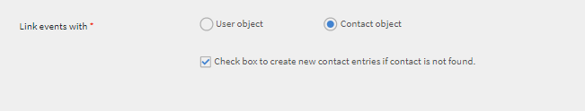
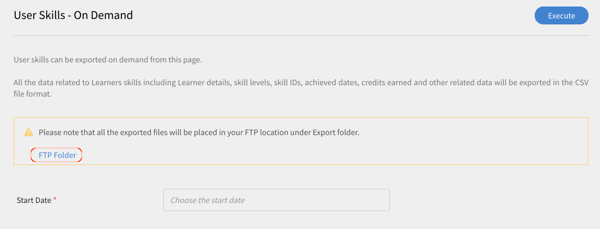
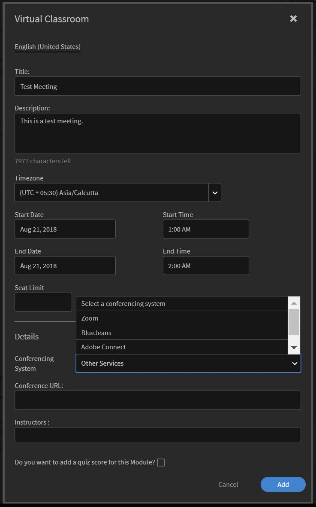
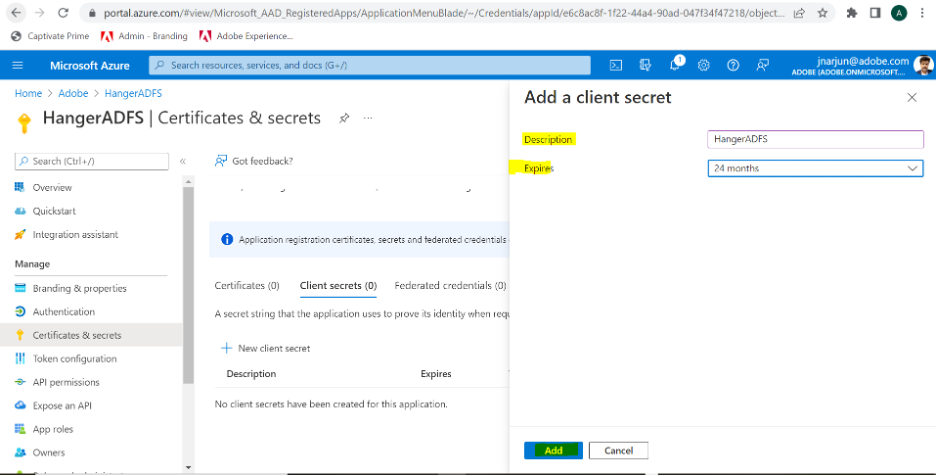

# Learning Manager コネクタ

企業には、Learning Manager と統合する必要がある他のアプリケーションやシステムがあります。コネクタは、外部システムからラーニングマネージャーにデータをインポートするなど、データベースの統合を実行するのに役立つユーティリティです。  また、ラーニングマネージャーから外部システムへのデータのエクスポートも行います。

Learning Manager は Salesforce および FTP コネクタを提供します。 Salesforce コネクターを使用すると、組織の統合管理者は Salesforce アプリケーションと Learning Manager を統合できます。統合者は、FTP コネクタを使用して、一連のユーザーをエンタープライズアプリケーションに自動読み込みすることもできます。

Learning Manager では、Lynda、getAbstract、Harvard Management System 用のコネクターも利用できます。これらのコネクタにより、学習者は Lynda.com、getAbstract および Harvard ManageMentor のコースにアクセスして利用できます。

これらのコネクターを設定し、Learning Manager で使用する方法については、以下の説明を参照してください。

<!--
>[!NOTE]
>
>**Update:** December 2020 update of Learning Manager
>
>For **FTP**, **Box**, and **Custom FTP** connectors, while exporting Learner Transcript or xAPI, you can also export the data as a **zip** file, for:
>
>* Learner Transcripts
>* xAPI
-->

>[!NOTE]
>
>Adobe ラーニング マネージャーの 2022 年 11 月のリリースにより、Zoom は 2023 年 6 月までに [JWT 認証](https://marketplace.zoom.us/docs/guides/auth/jwt/)を廃止しました。 このため、JWT を使用した Zoom コネクターは前述の期日まで利用可能ですが、アカウントの機能を置き換えるためにサーバー間 OAuth アプリを作成することをお勧めします。新しい接続では、デフォルトで Zoom OAuth 認証が使用されます。

## Salesforce コネクタ {#sfconnector}

Salesforce コネクターは Learning Manager アカウントと Salesforce アカウントを接続して、データを自動的に同期します。Salesforce コネクタの機能は次のとおりです。

### マップ属性

統合管理者は Salesforce の列を選択し、それらを対応する Learning Manager のグループ化可能属性にマッピングできます。マッピングが完了すると、それ以降のユーザーの読み込みでは同じマッピングが使用されます。管理者がユーザーを読み込むために別のマッピングを使用したい場合は、再設定できます。

### 自動ユーザー読み込み

ユーザー読み込みプロセスにより、Learning Manager 管理者は Salesforce から従業員の詳細を取得し、その情報を Learning Manager に自動的に読み込ませることができます。この自動化により、CSV の作成および Learning Manager へのアップロードに伴う手作業を省略できます。

### 自動スケジュール

自動ユーザー読み込み機能と同時に自動スケジュール設定機能を使用すると、相乗効果を期待できます。Learning Manager 管理者は、組織のニーズに応じてスケジュールを設定できます。ラーニング マネージャー アプリケーションのユーザーは、スケジュールに従って最新の状態に保つことができます。 Learning Manager アプリケーションで、同期が毎日実行されます。

### ユーザーのフィルタリング

Learning Manager 管理者は、読み込む前にユーザーにフィルタリングを適用できます。例えば、Learning Manager 管理者は、階層内のすべてのユーザーを 1 人以上の特定のマネージャーの管理下に読み込めます。

### Salesforce コネクターを構成する {#configuresalesforceconnector}

Salesforce を Learning Manager と統合するには、プロセスについて学習します

#### 前提条件 {#prerequisites}

まず Salesforce 組織の URL が手元にあることを確認してください。たとえば、組織名が **myorg** の場合、Salesforce URL は `https://myorg.salesforce.com` である可能性があります。 Salesforce アカウントを Learning Manager に接続するために入力が必要な項目は、組織名のみです。

また、アカウントにログインできる適切な資格情報が手元にあることも確認してください。

#### 接続の作成 {#createaconnection}

1. Learning Manager のホームページで、Salesforce カード / サムネイルの上にカーソルを移動します。メニューが表示されます。 メニューの&#x200B;**[!UICONTROL 接続]**&#x200B;項目をクリックします。

   

   *接続オプション*

1. 組織の URL を入力するように促すダイアログが表示されます。 URL を入力したら **[!UICONTROL 接続]** をクリックします。
1. 接続が成功すると、概要ページが表示されます。

### マップ属性 {#mapattributes}

接続が正常に確立されたら、Salesforce 列をラーニング マネージャーの対応する属性にマッピングできます。 この手順は必須です。

1. マッピングページでは、左側にラーニングマネージャの列が表示され、右側にSalesforce列が表示されます。 ラーニングマネージャの列名にマップされる適切な列名を選択します。

   
   *マップ属性*

   >[!NOTE]
   >
   >左側に表示されるラーニングマネージャの列データは、アクティブなフィールドからフェッチされます。 **マネージャー**&#x200B;フィールドは、電子メールアドレスタイプのフィールドにマップする必要があります。コネクタを使用する前に、すべての列をマッピングすることが必須です。

1. マッピングが完了したら **[!UICONTROL 保存]** をクリックします。
1. これでコネクタは使用可能になりました。管理者アプリ内で設定され、データソースとして表示されるアカウント。管理者は読み込みのスケジュール、またはオンデマンド同期のスケジュールができます。

## Salesforce コネクターの使用 {#usingsalesforceconnector}

Salesforce コネクターは Salesforce.com に接続して、設定どおりにユーザーを取得し、ユーザーを Learning Manager に追加します。

### Salesforce の連絡先からユーザーの読み込み {#import-salesforce-contacts}

Learning Manager は、Salesforce コネクターを拡張して、連絡先と Salesforce ユーザーを取得し、その情報を Learning Manager に自動的にインポートします。

[Salesforce コネクタ] ページで、Salesforce URL を入力し、認証を完了します。 認証が完了したら、ユーザーまたは連絡先のインポートに進むことができます。 [連絡先] オプションを選択した場合は、インポートする連絡先のサブセットを指定します。

Salesforce 列を選択し、対応するラーニングマネージャーのグループ指定可能な属性にマッピングします。 マッピングが完了すると、それ以降のユーザーの読み込みでは同じマッピングが使用されます。

1. Salesforce にサインインします。
1. 接続ページで、 **[!UICONTROL 内部ユーザーのインポート]**&#x200B;をクリックします。

   
   *内部ユーザーのインポート*

1. **ユーザーのインポート**&#x200B;ページに、連絡先という新しいオプションがあります。ラジオボタン **連絡先** をクリックすると、次のオプションが表示されます。

   
   *連絡先属性のマッピング*

1. **[!UICONTROL はい]**&#x200B;をクリックすると、次の操作を実行できます。

   * **連絡先列を選択:** ラーニングマネージャーにインポートするフィールドを選択します。
   * **値の指定:** 選択したフィールドを表す値を選択します。

   
   *値の指定*

   * Salesforce の列を Learning Manager の列にマッピングします。
   * インポートを開始するには、[ **[!UICONTROL 保存]**&#x200B;をクリックします。

1. **[!UICONTROL いいえ。すべての連絡先をインポートする]**、連絡先をフィルタリングせずにフィールドを直接マッピングできます。 ここでは、Salesforce からすべての取引先責任者をインポートします。
1. インポートを開始するには、[ **[!UICONTROL 保存]**&#x200B;をクリックします。

## 学習記録の書き出し

ラーニングマネージャーは、トランスクリプト、ユーザレポート、スキルレポートなどの学習レコードをSalesforceにエクスポートする機能を提供します。 エクスポートしたデータを Salesforce の「ユーザ」テーブルまたは「取引先責任者」テーブルにリンクするかどうかを決定できます。

*学習記録のエクスポート*

### Salesforce のカスタムオブジェクト

ラーニングマネージャから学習レコードをエクスポートする前に、Salesforce でカスタムオブジェクトを作成する必要があります。 カスタムオブジェクトは、会社または業界に固有の情報を格納するために作成するオブジェクトです。 詳細については、「[Salesforce カスタムオブジェクト](https://trailhead.salesforce.com/en/content/learn/modules/data_modeling/objects_intro)」を参照してください。

次の方法でオブジェクトを作成します。

1. パッケージをダウンロードしてインストールし、カスタムオブジェクトを作成します。

   * [パッケージ 1](https://test.salesforce.com/packaging/installPackage.apexp?p0=04t1k0000008WPJ)
   * [パッケージ 2](https://test.salesforce.com/packaging/installPackage.apexp?p0=04t1k0000008WPT)
   * [パッケージ 3](https://test.salesforce.com/packaging/installPackage.apexp?p0=04t1k0000008WPi)

1. Salesforce のカスタムオブジェクト名を変更します。
1. イベントを選択し、**[!UICONTROL 「保存」]**&#x200B;をクリックします。

>[!NOTE]
>
>パッケージのインストール後に追加されたすべてのアクティブなフィールドにシステム管理者アクセス権が付与されていることを確認してください。

**イベントのリンク先:** エクスポートするセクション(ユーザーまたは連絡先)を選択します。 連絡先オブジェクトを選択した場合、ラーニングマネージャーには存在するが Salesforce には存在しないユーザが Salesforce に作成されます。

*イベントのリンクオプション[いべんとをりん*

>[!NOTE]
>
>1 つのアカウントで複数の接続を作成できます。 Salesforce では、1 つの接続に最大 3 つのカスタムオブジェクトを使用できます。 1 つの Salesforce アカウントに複数の接続を作成する場合は、パッケージを 3 個インストールする必要があります。 対応できるパッケージ数は最大 3 個です。
>
>作成する接続の数に応じて、パッケージをインストールする必要があります。

>[!NOTE]
>
>Salesforce の実行ステータスページでは、Salesforce から処理されたレコードの数のみ確認できます。 ラーニングマネージャは、処理されたすべてのレコードに部分的なエクスポートまたは失敗がある場合でも、ステータスを完了として表示します。

## Salesforce パッケージのインストール

ラーニングマネージャーは Salesforce アプリケーションパッケージを提供しています。 SFDC にインストールして設定すると、セールス社員は SFDC ポータル内でトレーニングアクティビティを実行できるようになります。 このアプリから、SFDC ユーザーは新しいトレーニングを調べ、推奨事項を表示し、SFDC ポータル内ですぐに実行できます。 ユーザーは、SFDCポータル内のアプリ内でマストヘッドの形式で管理者から送信されたお知らせも受け取ります。

### Learning Manager アプリケーションで設定

1. 自分の Learning Manager 管理者アカウントに、統合管理者としてログインします。
1. **[!UICONTROL アプリケーション]** > **[!UICONTROL おすすめアプリ]**&#x200B;をクリックします。
1. **[!UICONTROL Salesforce]** をクリックします。
1. Salesforce アプリケーションページで、説明に記載されているアプリケーション ID (クライアント ID とも呼ばれます) とクライアントシークレットをメモします。
1. **[!UICONTROL 承認]**&#x200B;をクリックすると、アプリが正常に承認される必要があります。
1. **[!UICONTROL 開発者リソース]** > **[!UICONTROL テストおよび開発用のアクセストークン]**&#x200B;をクリックします。
1. [OAuth コードの取得] セクションで、[クライアント ID とスコープ] を [管理者:読み取り、管理者:書き込み] に設定する必要があります。 **[!UICONTROL 送信]**&#x200B;をクリックします。
1. 「更新トークンを取得」で、クライアント ID とクライアントシークレットを入力します。 [ **[!UICONTROL 送信]** をクリックし、更新トークンをメモします。

### Salesforce アプリでのアカウントの作成

1. Salesforce のサインアップページでアカウントを作成します。 開発者版またはエンタープライズ版で Salesforce アカウントを作成する必要があります。  [開発者サインアップ URL](https://developer.salesforce.com/signup). ラーニングマネージャーに使用した Salesforce にサインアップするには、メール ID を使用する必要があることを確認します。
1. 確認用の電子メールからアカウントを確認します。
1. パスワードを作成し、Salesforce にサインインします。
1. ログイン後に Salesforce URL をメモします (site.lightning.force.com など)

### Learning Manager パッケージのインストール

パッケージをインストールする場合、まず Salesforce で既存のパッケージを削除する必要があります。 アンインストールする前に、次のように設定を有効にする必要があります。 パッケージのインストールには、これらの設定の適用が必須です。

>[!NOTE]
>
>Adobe Learning Manager アプリケーションは、Salesforce Lightning ビューでのみサポートされています。

1. ラーニングマネージャーパッケージの [url](https://login.salesforce.com/packaging/installPackage.apexp?p0=04t1k0000008WOQ)を起動します。
1. **ログイン**&#x200B;ページで、**[!UICONTROL カスタムドメインを使用]**&#x200B;をクリックします。
1. パッケージの URL を入力し、[ **[!UICONTROL 続行]**&#x200B;をクリックします。 インストール ページでは、[管理者のみにインストール] オプションが選択されている必要があります。 このオプションは変更しないでください。
1. **[!UICONTROL インストール]**&#x200B;をクリックします。パッケージがインストールされたら、 **[!UICONTROL 完了]**&#x200B;をクリックします。 インストール済みパッケージページが表示され、Adobe Learning Manager のインストール済みパッケージが表示されます。
1. 設定の横にある App Launcher に移動して「Adobe Learning Manager」を検索します。
1. アプリを構成するには、 **[!UICONTROL 構成]**&#x200B;をクリックします。
1. **[!UICONTROL 新規]**&#x200B;をクリックし、次の詳細を追加します。

   * **Config：**&#x200B;任意の名前を入力します。
   * **ClientID**: 最初のセクションで取得した値を入力します。
   * **クライアントシークレット:** 最初のセクションで取得した値を入力します。
   * **RefreshToken:** 最初のセクションで取得した値を入力します。
   * **LearningManagerBaseURL:** ラーニングマネージャーがホストされているサイトの URL。

### リモートサイトの設定の追加

1. ページの右上隅で、[ **[!UICONTROL 設定]**&#x200B;をクリックします。
1. **[!UICONTROL クイック検索]**&#x200B;で、「リモートサイトの設定」を検索します。
1. **[!UICONTROL 新規リモートサイト]**&#x200B;をクリックします。
1. 詳細を入力します：

   * **リモートサイト名：**&#x200B;任意の名前を入力します。
   * **リモートサイトの URL：** Learning Manager がホストされているサイトの URL です。

1. Learning Manager を起動します。

### ラーニングマネージャーアプリの通知を有効にする

1. 右上隅にある **[!UICONTROL セットアップ]**&#x200B;をクリックします。
1. カスタム通知を検索します。
1. **[!UICONTROL 新規]**&#x200B;をクリックします。
1. 次の情報を入力します。

   1. **カスタム通知名:** ラーニングマネージャー通知
   1. **API 名:** ラーニングマネージャー通知

1. サポートされているチャネルとして **デスクトップ** と **モバイル** の両方を選択します。

1. **[!UICONTROL 「保存」]**&#x200B;をクリックします。
1. モバイルデバイスのプッシュ通知を有効にするには、次の手順に従います：

   1. 携帯電話に Salesforce モバイルアプリをインストールします。
   1. 資格情報を使用してアプリにログインします。
   1. **設定** > **通知配信設定**&#x200B;に移動します。
   1. iOS および Android 用の Salesforce を追加します。

### Salesforce からの Learning Manager のアンインストール

1. Salesforce アプリケーションで、[インストール済みパッケージ] に移動します。
1. **[!UICONTROL アンインストール]**&#x200B;をクリックします。

## Salesforce ユーザー用の学習マネージャーの設定

Learning Manager アプリは、Salesforce アカウント内のユーザーも利用できます。Salesforce 管理者は、プロファイルに基づいてユーザーを追加できます。 Salesforce プロファイルは、Learning Manager のプロファイルと類似しています。たとえば、管理者、統合管理者、インストラクターなどです。 Salesforce 管理者は、カスタムのプロファイルも作成できます。

Salesforce 管理者は、ユーザーにプロファイルを割り当てるか、カスタムのプロファイルを作成することができます。

パッケージをインストールする際に、Salesforce のプロファイルを学習者に割り当てることができます。

パッケージをインストールしてから、プロファイルを構成する必要があります。

**[!UICONTROL 構成]** > **[!UICONTROL 新規作成]**&#x200B;をクリックし、以下を追加します。

* 構成名
* ClientID
* ClientSecret
* LearningManagerBaseURL
* リダイレクトの無効化

>[!NOTE]
>
>学習者がラーニングマネージャーアプリを表示するには、すべての学習者に対してアプリを有効にする必要があります。

次に、Learning Manager アプリにアクセス権を付与します。

*ラーニング マネージャー アプリにアクセスするためのアクセス許可を設定する*

ユーザーを選択し、アクセス権を割り当てます。 これで、学習者が Learning Manager アプリにアクセスできるようになりました。

次に、プロファイル（ユーザーの標準プロファイルなど）を選択し、そのプロファイルをクリックします。 「 **[!UICONTROL 編集]** をクリックし、 **カスタムアプリケーション設定** セクションで **Adobe ラーニングマネージャー**&#x200B;チェックボックスを有効にします。 これにより、ユーザーがアプリにアクセスできるようになりました。

**カスタムタブ設定**&#x200B;セクションの&#x200B;**「学習者ホーム」**&#x200B;ドロップダウンリストで、**「デフォルトでオン」**&#x200B;オプションを選択します。

すべてのプロファイルに対して、アプリを表示可能にすることが必要です。

**[!UICONTROL 保存]**&#x200B;をクリックすると、すべてのプロファイルに属する学習者がラーニングマネージャーアプリにアクセスします。

### 学習パス関連の変更点

#### 既存の接続

管理者アカウントでラーニング パス オプションが無効になっている場合、レポートに行と列は追加されません。

管理者アカウントで[ラーニング パス] オプションが有効になっている場合、学習者が登録されている場合に備えて、[種類] 列にラーニング パスが入力されます。

>[!NOTE]
>
>フラグが有効になっていて、既存の接続を使用すると、いくつかのレコードが失われる可能性があります。

#### 新しい接続

管理者アカウントでラーニングパスオプションが無効になっている場合、トレーニングレポートは次の列で構成されますが、データは含まれません。

* **埋め込みパス：**&#x200B;埋め込み学習プログラムの名前が表示されます。
* **埋め込みパスの ID：**&#x200B;埋め込み学習プログラムの ID が表示されます。
* **埋め込みコースID:** ラーニングパス内にあるコースのIDを表示します。

また、学習パスが有効になっているアカウントでの新しい接続では、3 つの新しい列が表示され、すべてのデータが取り込まれます。

さらに、レポートには、ラーニング パスに登録されているすべての学習者の列タイプ [ラーニング パス (高レベル)] が含まれます。

[種類] 列で、ラーニング プログラムの名前が [ラーニング パス] に変更されます。 既存の接続の場合は、変更はありません。

## Learning Manager FTP コネクタ {#ftpconnector}

FTP コネクターを使用すると、Learning Manager を任意の外部システムと統合して、データ同期を自動化できます。外部システムがデータを CSV 形式で書き出し、そのデータを Learning Manager FTP アカウントの適切なフォルダーに配置できることが期待されています。FTP コネクタの機能は次のとおりです。

Box コネクタを使用して、データ移行、ユーザー インポート、およびデータ エクスポートを行うこともできます。 詳細については、「ボックス コネクタ」を参照してください。

### データの読み込み {#dataimport}

ユーザー読み込みプロセスにより、Learning Manager 管理者は Learning Manager FTP サービスから従業員の詳細を取得し、その情報を Learning Manager に自動的に読み込ませることができます。この機能を使用すると、それらのシステムによって生成された CSV を FTP アカウントの適切なフォルダーに配置することによって、複数のシステムを統合できます。Learning Manager は CSV ファイルを取得し、ファイルをマージして、設定したスケジュールに従ってデータを読み込みます。詳細については、「スケジューリング」機能を参照してください。

**マップ属性**

統合管理者は CSV の列を選択し、その情報を Learning Manager のグループ化が可能な属性にマッピングできます。このマッピングは一度だけの作業です。マッピングがされると、それ以降のユーザーの読み込みでは同じマッピングが使用されます。管理者がユーザーを読み込むための別のマッピングが必要な場合は、マッピングを再構成できます。

#### データの書き出し {#exportdata}

データの書き出しでは、あらゆるサードパーティー製のシステムに統合するためにユーザーがユーザースキル、学習者のトランスクリプトを FTP の場所に書き出すことができます。

#### スケジューリング {#scheduling}

管理者は、組織の要件に応じてタスクをスケジュール設定できます。Learning Manager アプリケーション内のユーザーは、設定されたスケジュールに従って最新の情報に更新されます。同様に、統合管理者は、外部システムと統合されるのに都合のいい時間にスキルの書き出しをスケジュール設定することができます。Learning Manager アプリケーションで、同期が毎日実行されます。

### Learning Manager FTP コネクターを構成する {#configurecaptivateprimeftpconnector}

FTP コネクタをラーニング マネージャーと統合するには、プロセスを学習します。

#### 接続の作成 {#Createaconnection-1}

1. Learning Manager ホームページで、FTP カード / サムネイルの上にカーソルを移動します。メニューが表示されます。 メニューの&#x200B;**[!UICONTROL 接続]**&#x200B;項目をクリックします。

   

   *接続オプション*

1. ダイアログが表示され、電子メール ID を入力するように求められます。 組織のラーニング マネージャー FTP アカウントの管理責任者の電子メール ID を入力します。 メールIDを入力したら **[!UICONTROL 接続]** をクリックします。
1. Learning Manager は、FTP に初めてアクセスする前にユーザーにパスワードの再設定を促す電子メールを送信します。ユーザーはパスワードをリセットし、Learning Manager FTP アカウントへのアクセスにそのパスワードを使用する必要があります。

   >[!NOTE]
   >
   >特定の Learning Manager アカウントに作成できる Learning Manager FTP アカウントは 1 つだけです。

   概要ページでは、統合の接続名を指定できます。 次のオプションから実行するアクションを選択します。

   * 社内ユーザーの読み込み
   * xAPI の読み込み
   * ユーザースキルの書き出し - スケジュールの設定
   * ユーザースキルの書き出し - オンデマンド
   * 学習者のトランスクリプトのエクスポート - スケジュールの設定
   * 学習者のトランスクリプトのエクスポート - オンデマンド

   
   *書き出しオプション*

### 読み込み

+++内部ユーザー

[内部ユーザのインポート] オプションを使用すると、オンデマンドまたはスケジューリングで csv からラーニング マネージャにユーザをインポートできます。

+++

+++マップ属性

接続が正常に確立されたら、CSV ファイルの列をマッピングできます。その列は、Learning Manager の対応する属性の FTP フォルダーに配置されます。この手順は必須です。

1. [属性のマップ] ページでは、左側にラーニング マネージャーの予想される列が表示され、右側には CSV 列名が表示されます。 最初は右側に空の選択ボックスがあります。**ファイルを選択**&#x200B;をクリックして、テンプレートCSVをインポートします。
1. 上記の手順で、右側の選択ドロップダウンリストにすべての CSV 列名が表示されます。ラーニングマネージャの列名にマップされる適切な列名を選択します。

   >[!NOTE]
   >
   >マネージャーフィールドは、電子メールアドレスタイプのフィールドにマッピングする必要があります。コネクタを使用する前に、すべての列をマッピングすることが必須です。

1. マッピングが完了したら **[!UICONTROL 保存]** をクリックします。

   これでコネクタは使用可能になりました。設定したアカウントは、管理者が読み込みをスケジュールしたり、オンデマンド同期を実行したりするための管理者アプリ内のデータソースとして表示されます。

+++

+++ラーニングマネージャーFTPコネクタを使用する

1. 外部システムからの CSV ファイルは、次のパスに配置する必要があります。

   `code $OPERATION$/$OBJECT_TYPE$/$SUB_OBJECT_TYPE$/data.csv`

   >[!NOTE]
   >
   >2016 年 7 月リリースでは、ユーザーのインポートのみが許可されます。 したがって、FTP コネクタを使用するには、CSV ファイルが次のフォルダーに配置されていることを確認してください。

   `code Home/import/user/internal/*.csv`

1. FTP コネクタは、CSV ファイルからすべての行を取得します。 1 つの CSV 内のユーザーに対応する行が他の CSV に表示されないことが重要です。
1. すべての CSV には、マッピングで指定された列が含まれている必要があります。
1. プロセスを開始する前に、必要なすべての CSV がフォルダーに存在する必要があります。

>[!NOTE]
>
>ユーザーを Learning Manager に読み込む際、管理者はユーザーが Learning Manager でどのように管理されているかも知っておく必要があります。詳細については、 [ユーザー管理のヘルプ](migration-manual.md#usermanagement) を参照してください。

+++

+++xAPI をインポートする

xAPI の読み込みオプションにより、サードパーティ製サービスの xAPI ステートメントを Learning Manager に読み込むための処理のスケジュールを設定できます。

+++

+++xAPIをインポートするために必要な構成

1. 構成ページから、CSV から xAPI ステートメントをインポートするために構成リストで使用可能な既存の構成を選択します。 編集または **新しい設定の追加** リンクをクリックして、「インポートソースの設定」ページに移動します。

   **構成**

   * 読み込み元の構成ページで、「名前」フィールドと「ソースファイル名」フィールドに値を入力します。「ソースファイル名」フィールドには、FTP フォルダー内に存在するファイルの名前を入力する必要があります。
   * 「**[!UICONTROL 保存]**」をクリックして変更内容を保存します。

   
   *構成*

   **フィルター**

   * 左側のペインで「**[!UICONTROL フィルター]**」をクリックします。
   * 読み込みフィルターの設定ページで、「名前」フィールドと「条件」フィールドに値を入力して、表示するレコードを絞り込みます。別のフィルターを追加する場合は、「**[!UICONTROL 新しいフィルターを追加]**」をクリックします。「アクション」列の「**保存**」オプションと「**削除**」オプションをクリックして、フィルターの保存と削除を行うことができます。

   
   *フィルター*

   **マッピング**

   * 左側のペインで「**[!UICONTROL マッピング]**」をクリックします。
   * 「xAPI ステートメントの読み込み」 - 「構成」 - 「マッピング」ページの左側に、CSV ファイルの列名にマップする必要がある xAPI JSON フィールドのパス名が表示されます。
   * CSV ファイルの列名にマップする必要がある 3 つの JSON パスフィールドのデフォルト名は、**actor.mbox**、**verb.id**、**object.id** です。これら以外のフィールドを追加してマップするには、「**新しいマッピングを追加**」をクリックします。

   * JSON フィールドのパス名のマップ先となる列名のタイプ（文字列、数値、ブール値、日付）を選択します。
   * マッピングが完了したら、「保存」をクリックします。これで、スケジュールに従って xAPI ステートメントを読み込むことも、必要に応じて随時読み込むこともできるようになります。

   
   *マッピング*

1. 左側のペインで「**[!UICONTROL スケジュールを設定]**」をクリックします。次に「**[!UICONTROL スケジュールを有効にする]**」をクリックして、xAPI ステートメントの読み込みスケジュールを設定します。

   xAPI ステートメントの読み込み開始日時を入力してから、読み込み頻度を日数で入力します。例えば、xAPI ステートメントの読み込みを 3 日ごとに実行する場合は、「3」を入力します。

   
   *xAPI ステートメントのインポート - スケジュールの構成*

1. 左側のペインで、[ **[!UICONTROL オンデマンド実行]**&#x200B;をクリックします。

   
   *xAPI ステートメントのインポート - オンデマンド*

1. 左側のペインで「**[!UICONTROL 実行ステータス]**」をクリックすると、該当するコネクタで実行されたすべての読み込み処理の概要情報が時系列で表示されます。この概要情報で、xAPI ステートメントの読み込み開始日と読み込みにかかった時間、読み込み処理のタイプ（オンデマンド読み込みなのかスケジュール設定された読み込みなのか）、読み込み処理のステータス（xAPI ステートメントの読み込み処理が実行中なのか、処理が完了したのか、処理が失敗したのか）を確認することができます。

   
   *xAPI ステートメントのインポート - 実行ステータス*

+++

### 書き出し

+++スキル

ユーザースキルレポートをエクスポートするには、2つのオプションがあります。

**[!UICONTROL ユーザースキル - オンデマンド]**: 開始日を指定し、オプションを使用してレポートをエクスポートできます。 レポートは現在までに入力された日付から抽出されます。

*オンデマンドエクスポートオプション*

**[!UICONTROL ユーザースキル - 設定]**：このオプションではレポートの抽出をスケジュールできます。「スケジュールを有効にする」チェックボックスをオンにして、開始日時を指定します。レポートを生成して送信する間隔を指定することもできます。

*レポートのエクスポートの構成*

+++

エクスポートされたファイルが配置されているエクスポートフォルダーを開くには、以下に示すように、ユーザースキルページで提供されているFTPフォルダーへのリンクを開きます。

*ファイルを表示するためのFTPフォルダ*

自動エクスポートされたファイルは、その場所 **ホーム/エクスポート/&#42;FTP_locationにあります&#42;**

自動エクスポートされたファイルは、タイトルが **skill_achievements_&#42;date from &#42;_to_&#42;date to&#42;.csv**

*書き出された .csv ファイル*

+++学習者のトランスクリプト

**構成**: このオプションを使用すると、レポートの抽出をスケジュールできます。 「スケジュールを有効にする」チェックボックスをオンにして、開始日時を指定します。レポートを生成して送信する間隔を指定することもできます。

+++

エクスポートされたファイルがFTPの場所に配置されているエクスポートフォルダーを開くには、以下に示すように、学習者のトランスクリプトページで提供されているFTPフォルダーへのリンクを開きます

自動エクスポートされたファイルは、その場所 **ホーム/エクスポート/&#42;FTP_locationにあります&#42;**

自動エクスポートされたファイルは、タイトルが **learner_transcript_&#42;date from &#42;_to_&#42;date to&#42;.csv で利用できます。**

### マニュアル csv フィールドのサポート {#supportformanualcsvfields}

FTP を介してユーザーデータを読み込む際に、管理者は、システムに存在するすべてのアクティブなフィールドを csv の対応するフィールドにマッピングする必要があります。

これは、csv のすべてのアクティブフィールドについて必須の処理です。 マニュアルのアクティブフィールドの場合、統合管理者は&#x200B;**「DontImportFromSource」**&#x200B;オプションを選択できます。

このオプションを選択することで、マニュアルのアクティブフィールドに、csv から読み込まれた値が入力されることはなくなります。 学習者が指定した値は変更されません。

>[!NOTE]
>
>マッピング中に、csvアクティブフィールドにオプション **DontImportFromSource** が選択されている場合、このフィールドはシステムから削除されます。

*アクティブフィールドの FTP コネクタ*

## Lynda コネクタ {#lyndaconnector}

Lynda.com をご利用のエンタープライズのお客様は、Lynda コネクターを使用することにより、お客様の学習者が Learning Manager 内で Lynda コースを検索および使用できるようになります。API キーを使用して Lynda.com からコースを定期的に取得するようにコネクタを構成することができます。Learning Manager 内にコースが作成されると、ユーザーはコースを検索して使用できます。学習者の進行状況は Learning Manager 内で追跡できます。

### Lynda コネクターを構成する {#configurethelyndaconnector}

1. 統合管理者のダッシュボードから、Lynda をクリックします。

   「はじめに」、「接続」、「接続の管理」の 3 つのオプションがあるタイルが表示されます。

1. Lynda コネクタを初めて構成する場合は、「接続」をクリックします。

   <!--Configure the Exavault FTP account before you configure this connector.-->

1. 接続ページから、コネクターの名前を指定します。接続に使用する Appkey と秘密キーを入力してください。

   >[!NOTE]
   >
   >Appkey と秘密キーを入手するには、ベンダーにお問い合わせください。

1. 「保存」をクリックします。

   設定が保存されされました。アカウントの Lynda 接続が追加されます。ホーム ページから [接続の管理] をクリックして、いつでも構成を編集できます。

1. 接続が既に確立されている場合は、「接続を管理」をクリックしてすべての接続を表示します。

   >[!NOTE]
   >
   >このコネクタを構成する前に、アカウントの移行機能を有効にする必要があります。

1. 編集したい接続をクリックします。
1. 左側のペインで、[ **[!UICONTROL 構成]**] をクリックします。 次のどちらかの操作を実行します。

   * このウィンドウから、アカウントの詳細と同期スケジュールを表示または編集します。このアカウントを有効にする場合は、「接続を有効にする」チェックボックスをオンにします。
   * 「編集」をクリックして資格情報を編集します。このフィールドの更新を元に戻すには、「リセット」をクリックします。
   * 同期をスケジュールするには、「スケジュールを有効にする」をクリックします。開始日時を入力してから、同期スケジュールの頻度を日数で入力できます。例えば、3 日ごとに同期を有効にします。

   「**[!UICONTROL 保存]**」をクリックして変更内容を保存します。

   

   *ラーニングマネージャーの Lynda コネクタを構成する*

1. 左ペインで、「オンデマンド実行」をクリックします。このオプションを使用すると、Lynda からユーザーフィードやその他の関連データを読み込むことができます。オンデマンド実行の開始日を入力し、「実行」をクリックして同期を実行します。開始日から現在までのすべてのデータが読み込まれます。

   * 同期中にアプリケーションのダウンタイムが発生する場合は、「実行中の Learning Manager へのアクセスを無効にする」をクリックします。
   * 「実行中の Learning Manager へのアクセスを有効にする」をクリックした場合でも、同期中にサービスが中断されることはありません。

   

   *Lynda コネクタのオンデマンド実行の実行*

1. 左ペインから「実行ステータス」をクリックすることで、いつでもこのコネクタのすべての実行の概要を時系列で表示できます。同期の開始日と期間、同期の種類（オンデマンド同期かどうか）および同期のステータス（同期が進行中か完了か）を表示できます。

   >[!NOTE]
   >
   >接続を削除して再作成すると、コネクタの以前の実行が再び表示されます。接続を削除する前にすべての実行を表示できます。

   最新の同期に対してのみ再実行ができます。

   

   *すべての実行の概要を表示し、[実行ステータス] をクリックします。*

## getAbstract コネクタ {#getabstractconnector}

getAbstract.com をご利用のエンタープライズのお客様は、getAbstract コネクタを使用することにより、お客様の学習者が getAbstract の要約を検索、使用できるようになります。Learning Manager 内で作成された学習者の完了レコードに基づいて、使用データを定期的に取得するようにコネクターを構成できます。Learning Manager でこのコネクターを構成する方法については、以下の説明を参照してください。

### getAbstract コネクタを構成する {#configurethegetabstractconnector}

1. 統合管理者のダッシュボードから、getAbstract をクリックします。

   タイルには、「はじめに」、「接続」、「接続の管理」の 3 つのオプションが表示されます。

1. getAbstract コネクタを初めて構成する場合は、「接続」をクリックします。

   <!--Configure the Exavault FTP account before you configure this connector.

   Ensure that you share this FTP credentials with your content provider to access the feeds.-->

1. 「接続名」フィールドに接続名を入力します。

   クライアント ID フィールドとクライアント秘密フィールドに適切なキーを入力します。このコネクタの適切なキーを入手するには、ベンダーに問い合わせます。

   これらのキーは、クライアントが受講するコースのコースメタデータを取得するために必要です。

1. 接続が既に確立されている場合は、ホームページから getAbstract／接続の管理をクリックして既存の構成を表示および編集します。

   >[!NOTE]
   >
   >このコネクタを構成する前に、アカウントの移行機能を有効にする必要があります。

1. 設定を表示または編集する接続をクリックします。

   

   *ラーニングマネージャーの getAbstract コネクタを構成する*

1. 左側のウィンドウで、[構成] をクリックします。 次のどちらかの操作を実行します。

   * このウィンドウから、アカウントの詳細と同期スケジュールを表示または編集します。このアカウントを有効にする場合は、「接続を有効にする」チェックボックスをオンにします。
   * 「編集」をクリックして資格情報を編集します。このフィールドの更新を元に戻すには、「リセット」をクリックします。
   * 同期をスケジュールするには、「スケジュールを有効にする」をクリックします。開始日時を入力してから、同期スケジュールの頻度を日数で入力できます。例えば、3 日ごとに同期を有効にします。

1. **[!UICONTROL 「保存」]**&#x200B;をクリックします。

   設定は保存されました。アカウントに getAbstract の接続が追加されます。

1. 左ペインで、「オンデマンド実行」をクリックします。このオプションを使用すると、getAbstract からユーザーのフィードおよびその他の関連データを読み込むことができます。オンデマンド実行の開始日を入力し、「実行」をクリックして同期を実行します。開始日から現在までのすべてのデータが読み込まれます。

   * 同期中にアプリケーションのダウンタイムが発生する場合は、「実行中の Learning Manager へのアクセスを無効にする」をクリックします。
   * 「実行中の Learning Manager へのアクセスを有効にする」をクリックした場合でも、同期中にサービスが中断されることはありません。

1. 左ペインから「実行ステータス」をクリックすることで、いつでもこのコネクタのすべての実行の概要を時系列で表示できます。同期の開始日と期間、同期の種類（オンデマンド同期かどうか）および同期のステータス（同期が進行中か完了か）を表示できます。

   >[!NOTE]
   >
   >接続を削除して再作成すると、コネクタの以前の実行が再び表示されます。接続を削除する前にすべての実行を表示できます。

   最新の同期に対してのみ再実行ができます。

   その種類を問わず、あらゆる同期が動作するために、同期に指定された日付の getAbstract FTP フォルダーにユーザーフィードがあることを確認します。

   次の Excel シートを参照してください。これは、getAbstract のユーザーフィードファイルのサンプルです。ファイル名は、**report_export_yyyy_MM_dd_HHmmss.xlsx** または **report_export_yyyy_MM_dd.xlsx** の形式に従う必要があります。
   [getAbstract ユーザー フィードのサンプル Excel シート](assets/report-export-20170401175342.xlsx)

## Harvard ManageMentor コネクタ {#hmmconnector}

Harvard ManageMentor をご利用のエンタープライズのお客様は、Harvard ManageMentor コネクタを使用することにより、お客様の学習者が Harvard ManageMentor のコースを検索、使用できるようになります。このコネクターは Learning Manager 内でコースを作成するのに役立つほか、学習者の進行状況データを定期的に取得するように設定できます。このコネクターを構成するには、次の手順を実行します。

### Harvard ManagerMentor コネクターを構成する {#configuretheharvardmanagermentorconnector}

1. 統合管理者のダッシュボードから、Harvard ManageMentor をクリックします。

   タイルには、「はじめに」、「接続」、「接続の管理」の 3 つのオプションが表示されます。

1. Harvard ManageMentor コネクタを初めて構成する場合は、「接続」をクリックします。

   <!--Configure the Exavault FTP account before you configure this connector.

   Ensure that you share this FTP credentials with your content provider to access the feeds.-->

1. 接続名フィールドに接続名を入力します。「接続」をクリックしてこの接続を保存します。
1. 接続が既に確立されている場合は、ホームページから Harvard ManageMentor／接続を管理をクリックします。編集したい接続をクリックします。

   >[!NOTE]
   >
   >このコネクタを構成する前に、アカウントの移行機能を有効にする必要があります。

   

   *ラーニング マネージャーのハーバード管理メンター コネクタを構成する*

1. 左側のウィンドウで、[構成] をクリックします。 次のどちらかの操作を実行します。

   * このウィンドウから、アカウントの詳細と同期スケジュールを表示または編集します。このアカウントを有効にする場合は、「接続を有効にする」チェックボックスをオンにします。
   * 同期をスケジュールするには、「スケジュールを有効にする」をクリックします。開始日時を入力してから、同期スケジュールの頻度を日数で入力できます。例えば、3 日ごとに同期を有効にします。

1. 左ペインで、「オンデマンド実行」をクリックします。このオプションを使用すると、Harvard ManageMentor からユーザーのフィードおよびその他の関連データを読み込むことができます。オンデマンド実行の開始日を入力し、「実行」をクリックして同期を実行します。この接続の開始日から現在までのすべてのデータが読み込まれます。

   * 同期中にアプリケーションのダウンタイムが発生する場合は、「実行中の Learning Manager へのアクセスを無効にする」をクリックします。
   * 「実行中の Learning Manager へのアクセスを有効にする」をクリックした場合でも、同期中にサービスが中断されることはありません。

   数日ごとに同期を自動化したい場合は、繰り返し日数フィールドに日数を指定します。同期はお使いのアカウントが Harvard ManageMentor からの要約とサマリの最新版で更新されることを保証します。

1. 左ペインから「実行ステータス」をクリックすることで、いつでもこのコネクタのすべての実行の概要を時系列で表示できます。同期の開始日と期間、同期の種類（オンデマンド同期かどうか）および同期のステータス（同期が進行中か完了か）を表示できます。

   >[!NOTE]
   >
   >接続を削除して再作成すると、コネクタの以前の実行が再び表示されます。接続を削除する前にすべての実行を表示できます。

   最新の同期に対してのみ再実行ができます。

   同期を成功させるには、Harvard ManageMentor の FTP フォルダーに次のファイルの少なくとも 1 つが存在することを確認してください。

   hmm12_metadata.xlsx：このファイルは、Harvard ManageMentor コネクタのコースメタデータを提供します。ファイルをアップロードするときは、必ず命名規則に従ってください。

   client_hmm12_20150125.xlsx：これは、Harvard ManageMentor コネクタのユーザーフィードです。以下のファイル命名規則は、**client_hmm12_yyyyMMdd.xlsx** です。

   このコネクタについて、次の 2 つのサンプルユーザーフィードおよびコースフィードファイルを参照してください。

   * [ハーバード管理メンターコネクタのコースメタデータファイル](assets/hmm12-metadata.xlsx)
   * [Harvard ManageMentor コネクターのユーザーフィード](assets/client-hmm12-20170304.xlsx)

## Workday コネクタ {#workdayconnector}

Workday コネクターを使用すると、Learning Manager を Workday のテナントと統合して、データを自動的に同期できます。

### 読み込み

#### マップ属性

インテグレーション管理者は、Workday 列を選択し、対応するラーニングマネージャーのグループ可能な属性にマッピングできます。 マッピングが完了すると、それ以降のユーザーの読み込みでは同じマッピングが使用されます。管理者がユーザーを読み込むために別のマッピングを使用したい場合は、再設定できます。

#### 自動ユーザー読み込み

ユーザー読み込みプロセスにより、Learning Manager 管理者は Workday から従業員の詳細を取得し、その情報を Learning Manager に自動的に読み込ませることができます。

#### ユーザーのフィルタリング

Learning Manager 管理者は、読み込む前にユーザーにフィルタリングを適用できます。例えば、Learning Manager 管理者は、階層内のすべてのユーザーを 1 人以上の特定のマネージャーの管理下に読み込めます。

### 書き出し

ユーザースキルの書き出しにより、ユーザーはユーザースキルを Workday に自動的に書き出すことができます。

>[!NOTE]
>
>複数の Learning Manager アカウントからのスキルを、同じ Workday アカウントを使用して同時に書き出すことはできません。

#### 注意点

* 従業員の UUID、メールアドレス、名前が複数の Workday インテグレーションで一意であることを確認します。 値が正しくないと、接続エラーが発生します。
* Workday で一度入力された UUID フィールドは、LMS 管理者に面しているクライアントが削除することはできません。 値を変更する場合は、Adobe ラーニングマネージャーのオンボーディングチームまたはサポートチームにお問い合わせください。
* ユーザーパージは実行ごとにパージされる50人のユーザーしかサポートしていないため、ユーザーパージオプションも機能しない可能性があります。 UUIDを介してユーザーをアップロードするときは、細心の注意を払ってください。

### スケジューリング {#Scheduling-1}

管理者は、組織の要件に応じてタスクをスケジュール設定できます。Learning Manager アプリケーション内のユーザーは、設定されたスケジュールに従って最新の情報に更新されます。同様に、統合管理者は、外部システムと統合されるのに都合のいい時間にスキルの書き出しをスケジュール設定することができます。Learning Manager アプリケーションで、同期が毎日実行されます。

### Workday コネクターを構成する {#configureworkdayconnector}

>[!PREREQUISITES]
>
>組織の Workday 管理者に、ISU_Permissionsドキュメントで定義されているアクセス許可を持つ統合システム ユーザー (ISU) の作成を依頼します。 下のリンクからコピーをダウンロードします。

[統合システム・ユーザー (ISU) セキュリティーのコピーをダウンロードします。](assets/isu-permissions-v1.pdf) Workday コネクタをラーニング マネージャーと統合するには、プロセスを学習します。

1. ラーニング マネージャーのホーム ページで、Workday タイルの上にマウスを置きます。 メニューが表示されます。 メニューの&#x200B;**[!UICONTROL 接続]**&#x200B;項目をクリックします。

   

   *就業日タイル*

1. 新しい接続の資格情報を入力するように促すダイアログが表示されます。 接続する前に、以下のフィールドを入力してください。

   * 接続名：任意の接続名を入力してください。
   * ホスト URL：統合管理者は、該当 Workday 管理者からホスト URL の詳細を取得できます。
   * テナント: テナントは会社の内部にあります。 Workday 管理者からテナントの詳細が提供されます。
   * ユーザー名とパスワード: Workday 管理者は、必要なセキュリティ権限を持つ統合システム ユーザー (ISU) を作成し、統合管理者と共有します。

>[!NOTE]
>
>   ラーニング マネージャーは、Workday API のバージョン 40.1 を使用します。

*Workday コネクタの構成*

1. すべての関連フィールドに情報を入力したら、「接続」をクリックします。

   >[!NOTE]
   >
   >複数の Workday 接続を Learning Manager アカウントに同期させることもできます。

概要ページでは、統合の接続名を指定できます。 実行したいアクションを次のいずれかから選択してください。

* 社内ユーザーの読み込み
* ユーザースキルの書き出し - スケジュールの設定
* ユーザースキルの書き出し - オンデマンド

*就業日の概要*

### 読み込み

#### マップ属性 {#MapAttributes-1}

Workday コネクターを使用すると、Learning Manager と Workday を統合して、データを自動的に同期できます。すべてのアクティブユーザーを Workday から Learning Manager に読み込むことができます。ユーザーは FTP や Salesforce などの様々なデータソースから読み込むことができます。

ユーザーを読み込む前に、Learning Manager と Workday のユーザー属性をマッピングする必要があります。概要ページで、読み込みの下の「社内ユーザー」オプションを使用してマップ属性を提供します。

「Adobe学習マネージャー」列にAdobe学習マネージャーの資格情報を入力します。 ドロップダウンを使用して、Workday の列に対して正しい資格情報を選択します。

>[!NOTE]
>
>現在 Learning Manager は、Workday から 69 のユーザー属性の読み込みをサポートしています。Learning Manager のアクティブフィールドを使用して、属性を追加します。

*マップ属性*

[ **派遣社員を除外** チェックボックスをオンにして、マネージャーの下で使用できる派遣社員がインポートされないようにします。

Workday に 4 つの階層レベルがあるのに対し、Learning Manager には 2 つのレベルがあります。Workday の 4 つのレベルは、スキル プロファイル カテゴリ、スキル プロファイル、スキル項目カテゴリ、スキル項目です。 スキル名とラーニング マネージャーのレベルは、Workday のスキル アイテムの下にマッピングされます。

>[!NOTE]
>
>Workday 属性も追加できます。 属性を追加するには、CSAM に連絡してください。

+++サポートされている Workday 属性のリスト

WD:User_ID
WD:Worker_ID
支配人
wd:Personal_Data.wd:Name_Data.wd:Preferred_Name_Data.wd:Name_Detail_Data。@wd:Formatted_Name
wd:Personal_Data.wd:Name_Data.wd:Legal_Name_Data.wd:Name_Detail_Data。@wd:Formatted_Name
wd:Personal_Data.wd:Name_Data.wd:Legal_Name_Data.wd:Name_Detail_Data.wd:Prefix_Data.wd:Title_Descriptor
wd:Personal_Data.wd:Name_Data.wd:Preferred_Name_Data.wd:Name_Detail_Data.wd:Prefix_Data.wd:Title_Descriptor
wd:Personal_Data.wd:Name_Data.wd:Preferred_Name_Data.wd:Name_Detail_Data.wd:First_Name
wd:Personal_Data.wd:Name_Data.wd:Preferred_Name_Data.wd:Name_Detail_Data.wd:Last_Name
wd:Personal_Data.wd:Name_Data.wd:Legal_Name_Data.wd:Name_Detail_Data.wd:First_Name
wd:Personal_Data.wd:Name_Data.wd:Legal_Name_Data.wd:Name_Detail_Data.wd:Last_Name
wd:Personal_Data.wd:Contact_Data.wd:Address_Data.0.@wd:Formatted_Address
wd:Personal_Data.wd:Contact_Data.wd:Address_Data.0.wd:Postal_Code
wd:Personal_Data.wd:Contact_Data.wd:Email_Address_Data.0.wd:Email_Address
wd:Personal_Data.wd:Contact_Data.wd:Address_Data.0.wd:Country_Region_Descriptor
wd:Personal_Data.wd:Contact_Data.wd:Phone_Data.0.@wd:Formatted_Phone
wd:Personal_Data.wd:Contact_Data.wd:Phone_Data.0.wd:Country_ISO_Code
wd:Personal_Data.wd:Contact_Data.wd:Phone_Data.0.wd:International_Phone_Code
wd:Personal_Data.wd:Contact_Data.wd:Phone_Data.0.wd:Phone_Number
wd:Personal_Data.wd:Primary_Nationality_Reference.wd:ID.1.$
wd:Personal_Data.wd:Gender_Reference.wd:ID.1.$
wd:Personal_Data.wd:Identification_Data.wd:National_ID.0.wd:National_ID_Data.wd:ID
wd:Personal_Data.wd:Identification_Data.wd:Custom_ID.0.wd:Custom_ID_Data.wd:ID
wd:User_Account_Data.wd:Default_Display_Language_Reference.wd:ID.1。$
wd:Role_Data.wd:Organization_Role_Data.wd:Organization_Role.0.wd:Organization_Role_Reference.wd:ID.1。$
wd:Employment_Data.wd:Worker_Job_Data.0.wd:Position_Data.wd:Position_Title
wd:Employment_Data.wd:Worker_Job_Data.0.wd:Position_Data.wd:Business_Title
wd:Employment_Data.wd:Worker_Job_Data.0.wd:Position_Data.wd:Business_Site_Summary_Data.wd:Name
wd:Employment_Data.wd:Worker_Job_Data.0.wd:Position_Data.wd:Business_Site_Summary_Data.wd:Address_Data。@wd:Formatted_Address
wd:Employment_Data.wd:Worker_Job_Data.0.wd:Position_Data.wd:Job_Classification_Summary_Data.0.wd:Job_Classification_Reference.wd:ID.1。$
wd:Employment_Data.wd:Worker_Job_Data.0.wd:Position_Data.wd:Job_Classification_Summary_Data.0.wd:Job_Group_Reference.wd:ID.1。$
wd:Employment_Data.wd:Worker_Job_Data.0.wd:Position_Data.wd:Work_Space__Reference.wd:ID.1。$
wd:Employment_Data.wd:Worker_Job_Data.0.wd:Position_Data.wd:Job_Profile_Summary_Data.wd:Job_Family_Reference.0.wd:ID.1。$
wd:Employment_Data.wd:Worker_Job_Data.0.wd:Position_Data.wd:Job_Profile_Summary_Data.wd:Job_Profile_Name
wd:Employment_Data.wd:Worker_Job_Data.0.wd:Position_Data.wd:Job_Profile_Summary_Data.wd:Job_Profile_Reference.wd:ID.1。$
wd:Employment_Data.wd:Worker_Job_Data.0.wd:Position_Data.wd:Business_Site_Summary_Data.wd:Address_Data.0.wd:Country_Reference.wd:ID.2。$
wd:Employment_Data.wd:Worker_Job_Data.0.wd:Position_Data.wd:Worker_Type_Reference.wd:ID.1。$
wd:Employment_Data.wd:Worker_Job_Data.0.wd:Position_Data.wd:Business_Site_Summary_Data.wd:Address_Data.0.@wd:Formatted_Address
wd:Employment_Data.wd:Worker_Job_Data.0.wd:Position_Data.wd:Job_Profile_Summary_Data.wd:Management_Level_Reference.wd:ID.1。$
wd:Employment_Data.wd:Worker_Status_Data.wd:Active
wd:Employment_Data.wd:Worker_Status_Data.wd:Active_Status_Date
wd:Employment_Data.wd:Worker_Status_Data.wd:Hire_Date
wd:Employment_Data.wd:Worker_Status_Data.wd:Original_Hire_Date
wd:Employment_Data.wd:Worker_Status_Data.wd:Retired
wd:Employment_Data.wd:Worker_Status_Data.wd:Retirement_Date
wd:Employment_Data.wd:Worker_Status_Data.wd:終了
wd:Employment_Data.wd:Worker_Status_Data.wd:Termination_Date
wd:Employment_Data.wd:Worker_Status_Data.wd:Termination_Last_Day_of_Work
wd:Organization_Data.wd:Worker_Organization_Data.0.wd:Organization_Data.wd:Organization_Code
wd:Organization_Data.wd:Worker_Organization_Data.0.wd:Organization_Data.wd:Organization_Name
wd:Organization_Data.wd:Worker_Organization_Data.0.wd:Organization_Data.wd:Organization_Type_Reference.wd:ID.1。$
wd:Organization_Data.wd:Worker_Organization_Data.0.wd:Organization_Data.wd:Organization_Subtype_Reference.wd:ID.1。$
wd:Qualification_Data.wd:Education.0.wd:School_Name
wd:Qualification_Data.wd:External_Job_History.0.wd:Job_History_Data.wd:Job_Title
wd:Qualification_Data.wd:External_Job_History.0.wd:Job_History_Data.wd:Company
wd:Management_Chain_Data.wd:Worker_Supervisory_Management_Chain_Data.wd:Management_Chain_Data.0.wd:Manager.Employee_ID
主な勤務先メールアドレス
wd:Organization_Type_Reference_Cost_Center_ID
wd:Organization_Type_Reference_Cost_Center_Name
wd:Organization_Type_Reference_Company
wd:Organization_Subtype_Reference_Department
wd:Organization_Subtype_Reference_Division
wd:Universal_ID
wd:Integration_Field_Override_Data.3.wd:値
wd:Employment_Data.wd:Worker_Job_Data.0.wd:Position_Data.wd:Business_Site_Summary_Data.wd:Address_Data.0.wd:Country_Region_Descriptor
wd:Employment_Data.wd:Worker_Job_Data.0.wd:Position_Data.wd:Business_Site_Summary_Data.wd:Address_Data.0.wd:Country_Region_Reference.wd:ID.2。$
wd:Personal_Data.wd:Contact_Data.wd:Address_Data.0.wd:自治体

+++

### 書き出し

ユーザーが達成したすべてのスキルを Learning Manager から Workday に書き出すことができます。Learning Manager はすべてのアクティブなユーザースキルのみを書き出し、廃止スキルは書き出しません。複数のラーニングマネージャーを接続することもできます\
アカウントを同じ Workday コネクタに割り当てます。 2つのラーニング マネージャー アカウントでスキル名が同じ場合、Workday では同じスキルにマッピングされます。 Workday でスキルを更新する前に、2 つのラーニング マネージャー アカウントが同じ Workday アカウントを使用している場合は、すべてのラーニング マネージャー アカウントのスキル名を更新することをお勧めします。

+++ユーザースキル - 設定

このオプションではレポート抽出のスケジュール設定ができます。「この接続を使用してユーザースキル書き出しを有効にする」チェックボックスがオンになっていることを確認します。「スケジュールを有効にする」チェックボックスをオンにして、開始日時を指定します。レポートを生成して送信する間隔を指定することもできます。「スケジュールを有効にする」チェックボックスをオンにして、開始日、時間および「n」日後に繰り返すを入力します。完了したら、「保存」をクリックします。

*ユーザー スキル レポートの構成*

+++

+++ユーザースキル - オンデマンド

開始日を指定し、オプションを使用してレポートを書き出すことができます。レポートは現在までに入力された日付から抽出されます。レポートの生成を開始する日付を入力して「実行」をクリックします。

*オンデマンドユーザースキルレポート*

+++

+++ユーザースキル - 実行ステータス

ここでは、すべてのタスクの概要を表示し、それらのステータスレポートを取得できます。エラーレポートのリンクをクリックすると、エラーレポートをダウンロードできます。

*ユーザースキル実行レポート*

+++

## miniOrange コネクタ {#miniorangeconnector}

miniOrange コネクターを使用して、Learning Manager と miniOrange のテナントを統合し、データを自動的に同期できます。

### 読み込み

#### マップ属性

インテグレーション管理者は、miniOrange属性を選択し、対応するラーニングマネージャのグループ可能な属性にマッピングできます。 マッピングが完了すると、それ以降のユーザーの読み込みでは同じマッピングが使用されます。管理者がユーザーを読み込むために別のマッピングを使用したい場合は、再設定できます。

#### 自動ユーザー読み込み

ユーザーインポートプロセスにより、ラーニングマネージャー管理者はminiOrangeから従業員の詳細を取得し、ラーニングマネージャーに自動的にインポートできます。

#### ユーザーのフィルタリング

Learning Manager 管理者は、読み込む前にユーザーにフィルタリングを適用できます。例えば、Learning Manager 管理者は、階層内のすべてのユーザーを 1 人以上の特定のマネージャーの管理下に読み込めます。

ミニオレンジコネクタを設定するには、ラーニングマネージャCSMチームにお問い合わせください。

### miniOrange コネクタを構成する {#configureminiorangeconnector}

1. ラーニングマネージャーのホームページで、miniOrangeカード/サムネイルの上にマウスポインターを置きます。 メニューが表示されます。 メニューの  **[!UICONTROL 接続]** オプションをクリックします。

   

   *ミニオレンジコネクタタイル*

1. **[!UICONTROL 接続]**&#x200B;をクリックして、新しい接続を確立します。ミニオレンジコネクタページが表示されます。 マッピングしたいアカウントの詳細を入力してください。

   

   *接続の作成*

1. miniOrangeユーザーをラーニングマネージャーの内部ユーザーとして直接インポートする場合は、 **[!UICONTROL 内部ユーザーのインポート]** オプションを使用します。

   

   *内部ユーザーのインポート*

1. マッピングページでは、左側にラーニングマネージャーの列が表示され、右側にminiOrnage列が表示されます。 ラーニングマネージャの列名にマップされる適切な列名を選択します。

   

   *マップ属性*

1. データソースを表示して編集するには、管理者として&#x200B;**[!UICONTROL 設定／データソース]**&#x200B;をクリックします。

   確立されたミニオレンジソースがリストされます。 フィルターを編集する必要がある場合は、 **[!UICONTROL 編集]**&#x200B;をクリックします。

   

   *データソースの表示と編集*

1. 読み込みが完了すると通知を受信します。ログの読み込みを表示または編集するには、**[!UICONTROL ユーザー／ログの読み込み]**&#x200B;をクリックします。

<!-- #### Delete a connection {#deleteaconnection}

To delete an established  miniOrange  connection, follow these steps. -->

## ズームコネクタ {#zoom-connector}

ラーニング マネージャーを Zoom コネクタと統合し、それらを使用してクラスをホストできます。  コネクタを使用すると、学習者とのビデオ会議会議/クラスを設定できます。

コネクタをセットアップして使用するには、次の手順に従います。

1. ラーニングマネージャーのホームページで、ズームサムネールの上にマウスを置きます。 メニューが表示されます。 メニューから  **[!UICONTROL 接続]** オプションをクリックします。

   <!-- 

   *Zoom connector tile* -->

1. [ズーム コネクタ] ページが開きます。 アカウントの詳細をそれぞれのフィールドに入力して、ユーザーフィードを統合および同期します。 コネクタアカウントの管理者から詳細を取得できます。

   <!-- 
   *Connect to BlueJeans/ Zoom* -->

   >[!NOTE]
   >
   >コネクターを有効にしながら、ユーザーが学習者として Learning Manager アカウントで使用している電子メール ID で、Learning Manager にフィードバックを提出できるようにします。

1. 接続が確立されたら、作成者として、Zoomを会議システムとして使用してVCコースを作成します。

   <!-- 
   
   *Create a VC course* -->

1. 管理者、マネージャ、および学習者は、作成したコースに学習者を登録できます。 登録時に、学習者は電子メールを受け取ります。学習者は自分の Learning Manager アカウントにログインしてプログラムの詳細を表示し、コースを受講できます。
1. コースを完了すると、完了レポートが Learning Manager に送信されます。管理者は、完了レポートを見て学習者の出席と得点を確認できます。

   
   *出席とスコアリングレポート*

### ズームサーバー間 OAuth アプリを作成する

Adobe ラーニング マネージャーで使用する Zoom サーバー間 OAuth アプリを作成する場合は、接続の作成時に Adobe ラーニング マネージャーに必要なスコープを追加する必要があります。

Adobe Learning Manager には以下のスコープが必要です。スコープは OAuth アプリで選択する必要があります。

* すべてのユーザー会議を表示する `/meeting:read:admin`
* すべてのユーザー会議の表示と管理 `/meeting:write:admin`
* レポート データの表示 `/report:read:admin`
* すべてのユーザー情報の表示 `/user:read:admin`
* ユーザー情報の表示とユーザーの管理 `/user:write:admin`

## Box コネクター {#boxconnector}

Box コネクターを使用すると、Learning Manager を任意の外部システムと統合して、データを自動的に同期できます。外部システムがデータをCSV形式でエクスポートし、ラーニングマネージャーBoxアカウントの適切なフォルダに配置できることが期待されます。 ボックスコネクタの機能は次のとおりです。

FTP コネクタは、データ移行、ユーザー インポート、およびデータ エクスポートにも使用できます。 詳しくは、 [Learning Manager FTP コネクタ。](connectors.md#main-pars_header_1427405935)

### データの読み込み {#DataImport-1}

ユーザー読み込みプロセスにより、Learning Manager 管理者は Learning Manager Box サービスから従業員の詳細を取得し、その情報を Learning Manager に自動的に読み込ませることができます。この機能を使用すると、それらのシステムによって生成された CSV を Box アカウントの適切なフォルダーに配置することによって、複数のシステムを統合できます。Learning Manager は CSV ファイルを取得し、ファイルをマージして、設定したスケジュールに従ってデータを読み込みます。詳細については、「スケジューリング」機能を参照してください。

**マップ属性**

統合管理者は CSV の列を選択し、その情報を Learning Manager のグループ化が可能な属性にマッピングできます。このマッピングは 1 回限りの作業です。 マッピングがされると、それ以降のユーザーの読み込みでは同じマッピングが使用されます。管理者がユーザーを読み込むための別のマッピングが必要な場合は、マッピングを再構成できます。

## データの書き出し {#dataexport}

データの書き出しでは、あらゆるサードパーティー製のシステムに統合するためにユーザーがユーザースキル、学習者のトランスクリプトを Box の場所に書き出すことができます。

## レポートのスケジュール {#schedulereports}

管理者は、組織の要件に応じてタスクをスケジュール設定できます。Learning Manager アプリケーション内のユーザーは、設定されたスケジュールに従って最新の情報に更新されます。同様に、統合管理者は、外部システムと統合されるのに都合のいい時間にスキルの書き出しをスケジュール設定することができます。Learning Manager アプリケーションで、同期が毎日実行されます。

## Box コネクターを構成する {#configureboxconnector}

Boxコネクタをラーニングマネージャーと統合するには、プロセスを学習します。

1. ラーニングマネージャのホームページで、ボックスカード/サムネイルの上にマウスポインターを置きます。 メニューが表示されます。 メニューの [接続項目] をクリックします。

   

   *ボックスに接続*

1. ダイアログが表示され、電子メール ID を入力するように求められます。 組織のラーニング マネージャー ボックス アカウントの管理責任者の電子メール ID を入力します。 電子メール ID を入力したら、[接続] をクリックします。
1. Learning Manager では、Box に初めてアクセスする前にユーザーにパスワードの再設定を促す電子メールが送信されます。ユーザーはパスワードをリセットし、ラーニング マネージャー ボックス アカウントへのアクセスにパスワードを使用する必要があります。

   >[!NOTE]
   >
   >1 つのラーニング マネージャー アカウントに対して作成できるラーニング マネージャー ボックス アカウントは 1 つだけです。

   概要ページでは、統合の接続名を指定できます。 次のオプションから実行するアクションを選択します。

   * 社内ユーザーの読み込み
   * xAPI アクティビティレポートの読み込み
   * ユーザースキルの書き出し - スケジュールの設定
   * ユーザースキルの書き出し - オンデマンド
   * 学習者のトランスクリプトのエクスポート - スケジュールの設定
   * 学習者のトランスクリプトのエクスポート - オンデマンド

## 読み込み

+++内部ユーザー

内部ユーザー読み込みオプションを使用すると、ユーザー読み込みレポートの生成を自動的にスケジュールすることができます。生成されたレポートは .CSV ファイルとして届きます。

+++

+++マップ属性

接続が正常に確立されると、Box フォルダーに配置された CSV ファイルの列を、ラーニング マネージャーの対応する属性にマップできます。 この手順は必須です。

1. [属性のマップ] ページでは、左側にラーニング マネージャーの予想される列が表示され、右側には CSV 列名が表示されます。 最初は右側に空の選択ボックスがあります。[ファイルの選択] をクリックして、テンプレート CSV をインポートします。
1. 上記の手順で、右側の選択ドロップダウンリストにすべての CSV 列名が表示されます。ラーニングマネージャの列名にマップされる適切な列名を選択します。

   *Manager フィールドは、電子メール アドレス型のフィールドにマップする必要があります。 コネクタを使用する前に、すべての列をマッピングすることが必須です。*

1. マッピングが完了したら、「保存」をクリックします。

   これでコネクタは使用可能になりました。設定したアカウントは、管理者が読み込みをスケジュールしたり、オンデマンド同期を実行したりするための管理者アプリ内のデータソースとして表示されます。

+++

+++xAPI アクティビティレポート

「xAPI アクティビティレポート」オプションにより、サードパーティ製サービスから xAPI ステートメントをファイルとして読み込むための構成を生成することができます。Learning Manager に読み込まれたファイルは .CSV ファイルとして保存され、その後 xAPI ステートメントに変換されます。

+++

+++xAPIをインポートするために必要な構成

1. 構成ページから、CSV から xAPI ステートメントをインポートするために構成リストで使用可能な既存の構成を選択します。 [編集] または [新しい構成&#x200B;****&#x200B;の追加] リンクをクリックして、[xAPI ステートメントのインポート-構成-ソース ファイル] ページに移動します。

   

   *新しい構成を編集または追加する*

   **構成**

   * 読み込み元の構成ページで、「名前」フィールドと「ソースファイル名」フィールドに値を入力します。「ソースファイル名」フィールドには、FTP フォルダー内に存在するファイルの名前を入力する必要があります。
   * 「**[!UICONTROL 保存]**」をクリックして変更内容を保存します。

   

   *構成*

   **フィルター**

   * 左側のペインで「フィルター」をクリックします。
   * 読み込みフィルターの設定ページで、「名前」フィールドと「条件」フィールドに値を入力して、表示するレコードを絞り込みます。別のフィルターを追加する場合は、「新しいフィルターを追加」をクリックします。「アクション」列の「保存」オプションと「削除」オプションをクリックして、フィルターの保存と削除を行うことができます。

   

   *フィルター*

   **マッピング**

   * 左側のペインで「マッピング」をクリックします。
   * 「読み込みの構成」 - 「マッピング」ページの左側に、CSV ファイルの列名にマップする必要がある xAPI JSON フィールドのパス名が表示されます。
   * CSV ファイルの列名にマップする必要がある 3 つの JSON パスフィールドのデフォルト名は、**actor.mbox**、**verb.id**、**object.id** です。これら以外のフィールドを追加してマップするには、「新しいマッピングを追加」をクリックします。
   * JSON フィールドのパス名のマップ先となる列名のタイプ（文字列、数値、ブール値、日付）を選択します。
   * マッピングが完了したら、「保存」をクリックします。これで、スケジュールに従って xAPI ステートメントを読み込むことも、必要に応じて随時読み込むこともできるようになります。

   
   *マッピング*

1. 左側のペインで「**[!UICONTROL スケジュールを設定]**」をクリックします。次に「スケジュールを有効にする」をクリックして、xAPI ステートメントの読み込みスケジュールを設定します。xAPI ステートメントの読み込み開始日時を入力してから、読み込み頻度を日数で入力します。例えば、xAPI ステートメントの読み込みを 3 日ごとに実行する場合は、「3」を入力します。

   
   *xAPI ステートメントのインポート - スケジュールの構成*

1. 左側のペインで、[ **[!UICONTROL オンデマンド実行]**&#x200B;をクリックします。

   
   *xAPI ステートメントの読み込み - オンデマンド*

1. 左側のペインで「**[!UICONTROL 実行ステータス]**」をクリックすると、該当するコネクタで実行されたすべての読み込み処理の概要情報が時系列で表示されます。この概要情報で、xAPI ステートメントの読み込み開始日と読み込みにかかった時間、読み込み処理のタイプ（オンデマンド読み込みなのかスケジュール設定された読み込みなのか）、読み込み処理のステータス（xAPI ステートメントの読み込み処理が実行中なのか、処理が完了したのか、処理が失敗したのか）を確認することができます。

   
   *xAPI ステートメントのインポート - 実行ステータス*

+++

+++ラーニングマネージャーボックスコネクタの使用

1. 外部システムからの CSV ファイルは、次のパスに配置する必要があります。

   `code $OPERATION$/$OBJECT_TYPE$/$SUB_OBJECT_TYPE$/data.csv`

   >[!NOTE]
   >
   >2016 年 7 月リリースでは、ユーザーのインポートのみが許可されます。 したがって、Box コネクタを使用するには、CSV ファイルが次のフォルダーに配置されていることを確認してください。

   `code Home/import/user/internal/*.csv`

1. Box コネクタは、CSV ファイルからすべての行を取得します。 1 つの CSV 内のユーザーに対応する行が他の CSV に表示されないことが重要です。
1. すべての CSV には、マッピングで指定された列が含まれている必要があります。
1. プロセスを開始する前に、必要なすべての CSV がフォルダーに存在する必要があります。

ユーザーを Learning Manager に読み込む際、管理者はユーザーが Learning Manager で管理されている方法も把握しておく必要があります。詳細については、 [ユーザー管理のヘルプ](migration-manual.md#usermanagement) を参照してください。

+++

## 書き出し

+++スキル

ユーザースキルレポートをエクスポートするには、2つのオプションがあります。

ユーザースキル - オンデマンド：このオプションを使用して開始日を指定し、レポートを書き出すことができます。レポートは、入力された日付から現在まで抽出されます

**[!UICONTROL ユーザースキル - 設定]**：このオプションではレポートの抽出をスケジュールできます。「スケジュールを有効にする」チェックボックスをオンにして、開始日時を指定します。レポートを生成して送信する間隔を指定することもできます。

+++

エクスポートされたファイルがBoxの場所に配置されているエクスポートフォルダーを開くには、以下に示すように、ユーザースキルページで提供されているボックスフォルダーへのリンクを開きます。

自動エクスポートされたファイルは、その場所 **ホーム/エクスポート/&#42;Box_locationにあります&#42;**

自動エクスポートされたファイルは、タイトルが **skill_achievements_&#42;date from &#42;_to_&#42;date to&#42;.csv**

>[!NOTE]
>
>顧客は、アクセス権限と、ラーニングマネージャーチームが共有するBoxフォルダー内のコンテンツを管理します。  また、フォルダー内のコンテンツは、フランクフルト地域に物理的に格納されます。

### マニュアル csv フィールドのサポート {#Supportformanualcsvfields-1}

Box を介してユーザーデータを読み込む際に、管理者は、システムに存在するすべてのアクティブなフィールドを csv の対応するフィールドにマップする必要があります。

これは、csv のすべてのアクティブフィールドについて必須の処理です。 マニュアルのアクティブフィールドの場合、統合管理者は&#x200B;**「DontImportFromSource」**&#x200B;オプションを選択できます。

このオプションを選択することで、マニュアルのアクティブフィールドに、csv から読み込まれた値が入力されることはなくなります。 学習者が指定した値は変更されません。

>[!NOTE]
>
>マッピング中に、csvアクティブフィールドにオプション **DontImportFromSource** が選択されている場合、このフィールドはシステムから削除されます。

*アクティブフィールドのボックスコネクタ*

>[!NOTE]
>
>FTP/Box をデータソースとして使用するコネクターまたは移行では、処理されたすべての csv ファイルが削除されます。
>
>コンテンツコネクター（LinkedIn など）の csv は 7 日後に削除され、読み込みユーザーの csv は直ちに削除されます。

## LinkedIn Learning コネクタ {#linkedinlearningconnector}

LinkedIn.com をご利用のエンタープライズのお客様は、LinkedIn Learning コネクターを使用することにより、お客様の学習者が Learning Manager 内でコースを検索および使用できるようになります。API キーを使用してコースを定期的に取得するようにコネクタを設定することができます。Learning Manager 内にコースが作成されると、ユーザーはコースを検索して使用できます。学習者の進行状況は Learning Manager 内で追跡できます。

>[!NOTE]
>
>LinkedIn ラーニングコネクタから Adobe ラーニングマネージャーにインポートされたすべてのコースの一意の LO ID を取得します。

>[!NOTE]
>
>LinkedIn Learning コースで費やされた学習時間は、LinkedIn コンテンツ / LinkedIn プラットフォームから、Learning Manager 学習プラットフォームに送信されます。LinkedIn の学習から学習時間が送信されない場合、学習プラットフォームではその時間を記録できません。 このような場合、ラーニングマネージャによって表示される学習時間はゼロです。

### Linkedln Learning ポータルを構成する {#configuresettingsinlinkedlnlearningportal}

1. 管理者として Linkedln Learning LMS にログインします。
1. 上部のナビゲーション・パネルで **[!UICONTROL admin]** をクリックします。
1. 次のウィンドウで「**[!UICONTROL 設定]**」タブをクリックします。
1. 左側のナビゲーションパネルから **[!UICONTROL 再生統合]** を選択し、 **統合** タブをクリックします。
1. **[!UICONTROL LMS コンテンツの起動設定]**&#x200B;をクリックして設定を展開します。
1. 次の 3 つのホスト名を追加します。**learningmanager.adobe.com**、**learningmanagerlrs.adobe.com**、**cpcontents.adobe.com**
1. **[!UICONTROL AICC 統合を有効にする]**&#x200B;を選択します。

   

   *LinkedIn ラーニングの構成*

### LinkedIn Learning コネクタを構成する {#configurelinkedinlearningconnector}

1. インテグレーション管理ダッシュボードで、 [!UICONTROL LinkedIn ラーニング]をクリックします。 「はじめに」、「接続」、「接続の管理」の各オプションが表示されます。
1. LinkedInラーニングコネクタを初めて構成する場合は、 [!UICONTROL 接続]をクリックします。

   <!--Configure the Exavault FTP account before you configure this connector.

   
   *Configure connection*-->

1. 接続ページから、コネクターの名前を指定します。接続に使用する Appkey と秘密キーを入力してください。

   >[!NOTE]
   >
   >エンタープライズ管理者は、LinkedIn ラーニング管理ポータルから新しいアプリケーションを生成して、アプリキーとシークレットキーを取得できます。

1. **[!UICONTROL 「保存」]**&#x200B;をクリックします。

   設定は保存されました。アカウントに LinkedIn Learning の接続が追加されます。ホームページから **[!UICONTROL 接続の管理]** をクリックして、いつでも設定を編集できます。

1. すでに接続が確立されている場合は、[ **[!UICONTROL 接続の管理]** をクリックして、すべての接続を表示します。

   >[!NOTE]
   >
   >このコネクタを構成する前に、アカウントの移行機能を有効にする必要があります。

1. 編集したい接続をクリックします。
1. 左側のウィンドウで、[構成] をクリックします。 次のどちらかの操作を実行します。

   * このウィンドウから、アカウントの詳細と同期スケジュールを表示または編集します。このアカウントを有効にする場合は、 **[!UICONTROL 接続を有効にする]** チェックボックスをオンにします。
   * **[!UICONTROL 編集]**&#x200B;をクリックし、資格情報を編集します。このフィールドの更新を元に戻すには、リセットをクリックします。
   * **[!UICONTROL スケジュールを有効にする]**&#x200B;をクリックして、同期をスケジュールします。開始日時を入力してから、同期スケジュールの頻度を日数で入力できます。例えば、3 日ごとに同期を有効にします。

   「**[!UICONTROL 保存]**」をクリックして変更内容を保存します。

1. 左側のペインで、[ **[!UICONTROL オンデマンド実行]**&#x200B;をクリックします。 このオプションを使用すると、LinkedIn からユーザーのフィードおよびその他の関連データを読み込むことができます。オンデマンド実行の開始日を入力し、「実行」をクリックして同期を実行します。 開始日から現在までのすべてのデータが読み込まれます。

   * 同期中にアプリケーションのダウンタイムが発生する実行中に **[!UICONTROL ラーニングマネージャーへのアクセスを無効にする]** をクリックできます。
   * 実行中に **[!UICONTROL ラーニングマネージャーへのアクセスを有効にする]** をクリックしても、同期中にサービスが中断することはありません。

   

   *レポートのオンデマンド実行*

1. 左ペインから「実行ステータス」をクリックすることで、いつでもこのコネクタのすべての実行の概要を時系列で表示できます。同期の開始日と期間、同期の種類（オンデマンド同期かどうか）および同期のステータス（同期が進行中か完了か）を表示できます。

   

   *レポート実行ステータス*

   >[!NOTE]
   >
   >接続を削除して再作成すると、コネクタの以前の実行が再び表示されます。接続を削除する前にすべての実行を表示できます。

   最新の同期に対してのみ再実行ができます。

### LinkedIn Learning コンテンツのフィルタリング {#filter-linkedin}

LinkedIn コネクタには、LinkedIn Learning ライブラリに基づいてコンテンツを分けるフィルターがあります。 また言語やライブラリに基づいてコンテンツをフィルタリングし、必要な言語のコースのみを読み込むこともできます。読み込まれたコンテンツは、読み込み設定に基づいて複数のカタログに分けられます。

以下のフィルターがあります。

**次を使用してトレーニングをフィルタリング：**&#x200B;フィルターを使用して、LinkedIn のコースのサブセットを Learning Manager に絞り込みます。

* **言語に基づく**

*言語で絞り込む*

* **LinkedInラーニングのライブラリに基づく**

*カタログで絞り込む*

**トレーニングのインポート先**

*トレーニングをカタログにインポートする*

**タグの取り込み**

タグの種類の 1 つに、**カスタムタグ**&#x200B;があります。このタグを使用すると、LinkedIn Learning コースにカスタムタグを追加できます。 タグは、カンマで区切って、必要な数だけ追加できます。

*カスタムタグの追加*

コンテンツは移行後にのみ保存されます。 コンテンツはそれぞれのカタログに保存されます。

## Power BI コネクター {#powerbiconnector}

>[!NOTE]
>
>Learning Manager は、Microsoft Power BI の商用ライセンスとの統合のみをサポートします。官公庁のクラウド上の Microsoft Power BI とは統合されません。

このコネクタとの統合を使用して、既存の Power BI アカウントを利用して、Power BI 内のラーニング マネージャーからの学習データを分析および視覚化できます。 統合を行う管理者は、Power BI のワークスペースを設定する際に、学習者のトランスクリプトとユーザーのスキルレポートという 2 つのライブデータセットを増分的にワークスペースに取り込むように設定することができます。 その後、PowerBI のすべての機能を使用してカスタムダッシューボードを作成し、組織内に配布することができます。

### コネクタの構成 {#configuringtheconnector}

コネクタを構成するには、[ **[!UICONTROL コネクタ]** ページで、 **[!UICONTROL Power BI]** タイルにカーソルを合わせ、 **[!UICONTROL 接続]**&#x200B;をクリックします。 Power BI ページが開きます。接続を確立するには、アプリクライアント ID、アプリクライアントシークレット、テナント名およびワークスペース ID（オプション）を入力します。 これらの資格情報を取得するには、次の手順に従います。

*Power BI コネクタを構成する*

1. <https://app.powerbi.com/embedsetup>を起動します。
1. [ **[!UICONTROL 組織用に埋め込む]** をクリックし、Microsoft アカウントにサインインします。
1. アプリの名前を入力します。
1. [アプリの種類] セクションで、[サーバー側 Web アプリ] オプションを選択します。
1. 「 **[!UICONTROL リダイレクト URL]** セクションで、 **カスタム URL を使用する** オプションを選択します(ターゲットアプリケーションの URL がわかっている場合は、これを選択します)。 次の URL を入力します。

   `https://learningmanager.adobe.com/ctr/app/azure/_callback` (環境に基づいてドメインを更新する)

1. [ホーム URL] フィールドに、次の URL を入力します。 `https://learningmanager.adobe.com/`
1. 権限セクションで、 **すべてのデータセットの読み取り** と **すべてのデータセットの読み取りと書き込み**&#x200B;を選択します。

   テナントの取得：Power BI 管理者に連絡してテナント名を入力してください。

   職場 ID を取得：Power BI Pro ユーザーのみが職場を作成できます。 Power BI で職場を作成し、URL から ID を取得できます。

1. **[!UICONTROL アプリの登録]**&#x200B;をクリックし、クライアント ID とクライアント シークレットを保存します。

>[!NOTE]
>
>接続を再度承認する場合は、別の Power App を作成し、ブランド変更されたリダイレクト URL を指定する必要があります。

同じ方法で、学習者のトランスクリプト、ユーザースキル、xAPI アクティビティレポートを書き出すことができます。左側のパネルから学習者トランスクリプト／ユーザースキルを選択します。 書き出しページが開きます。

「**[!UICONTROL ユーザースキル／学習者のトランスクリプトの書き出しを有効化する]**」チェックボックスをオンにして有効化します。 変更を保存します。

**書き出し設定**：レポートの抽出をスケジュールしたい場合。 **[!UICONTROL スケジュールを有効にする]**&#x200B;チェックボックスをオンにして、開始日時を指定します。レポートを生成して送信する間隔を指定することもできます。

*レポートをスケジュールするためのエクスポート構成*

**オンデマンドでエクスポート:** 開始日を指定し、オプションを使用してレポートをエクスポートできます。 レポートは、入力された日付から現在まで抽出されます。

*オンデマンドでエクスポート*

書き出されたデータを見るには Power BI アカウントにログインします。 書き出されたデータは「データセット」オプションの下にリストされています。

### Learning Manager での xAPI アクティビティレポートの書き出し {#exportxapiactivityreportsincaptivateprime}

PowerBI-xAPI 機能ページで、 **[!UICONTROL xAPI アクティビティ レポートのエクスポート]** をクリックします。

*PowerBI - xAPI アクティビティレポートのエクスポート*

左側のペインで「**構成**」を選択して、以下の手順を実行します。

* 列名と文字列タイプに一致する JSON パスフィールドに値を入力します。
* さらに JSON パスを追加する場合は、「**[!UICONTROL 追加]**」をクリックします。
* JSON パスフィールド内のエントリを編集するには、「**[!UICONTROL 編集]**」をクリックします。
* 「**[!UICONTROL 保存]**」をクリックして変更内容を保存します。

**スケジュールの設定**

左側のペインで「**[!UICONTROL スケジュールを設定]**」をクリックして、以下の手順を実行します。

* 「この接続を使用して xAPI ステートメントの書き出しを有効にする」をクリックします。
* 「**[!UICONTROL スケジュールを有効にする]**」チェックボックスをクリックして、書き出し処理の開始日時を指定します。書き出し処理を繰り返し実行する間隔を日数単位で指定することもできます。
* 「**[!UICONTROL 保存]**」ボタンをクリックして、スケジュールの設定内容を保存します。

*xAPI エクスポート スケジュールの構成*

**オンデマンド書き出しの設定**

左側のペインで「**[!UICONTROL オンデマンド実行]**」をクリックし、xAPi ステートメントの書き出し - オンデマンド」ページで書き出し処理の開始日を指定します。

*xAPI オンデマンド書き出し*

すべての書き出しデータは、Power BI アカウント内に作成された Adobe データセットに保存されます。

LRS 内の xAPI ステートメントの一部に、書き出し用として設定された JSON パスが含まれていない場合、 Power BI への xAPI ステートメントの書き出しが失敗します。JSON パスが含まれていない xAPI ステートメントの場合、「N/A」という固定値を追加して Power BI で表示する必要があります。

**実行ステータス**

「**実行ステータス**」を選択すると、すべてのタスクの概要情報が時系列で表示されます。警告記号が表示される場合は、タスクの実行中にエラーが発生したことを示しています。エラーレポートのリンクをクリックすると、エラーレポートを **CSV** としてダウンロードできます。

*xAPI エクスポート実行ステータス*

### 統合レポート {#unified-reports}

ラーニング マネージャーは、ユーザー データ、学習者のトランスクリプト、ゲーミフィケーション、フィードバック レポートなどのレポートの組み合わせを使用して、Power BI への 1 つのデータセットとしてエクスポートを作成する方法を提供します。

このようにすると、Power BI ユーザーは複数のレポートのデータを結合して、Power BI で有効性の高い分析と可視化を表示できます。

*統合 Power BI レポート*

**オンデマンド書き出し**

開始日と終了日を指定し、オプションを使用してレポートをエクスポートします。 指定した日付範囲でレポートが抽出されます。

*オンデマンドエクスポート*

**スケジュールされた書き出し**

レポートの抽出をスケジュールしたい場合。**「スケジュールを有効にする」**&#x200B;チェックボックスをオンにして、開始日時を指定します。レポートを生成して送信する間隔を指定することもできます。

*スケジュールの構成*

トレーニングレポートを Power BI に書き出すことができます。

統合レポート機能の一環として、Power BI にトレーニングレポートを書き出すことができます。

トレーニングレポートには、2 つの追加フィールドがあります：

* コースに関するフィードバックを共有したユーザ数
* コースの平均星評価

### 学習者のトランスクリプトのステータスのフィルタリング {#lt-status}

Power BI 接続の「統合レポート」セクションには、学習者オブジェクトに基づいて学習者のトランスクリプトを書き出すオプションがあります。

* **すべて選択：**&#x200B;指定した日付範囲内のすべてのレコードまたはモジュールレベルのアクティビティを書き出します。
* **完了済み：**&#x200B;日付範囲内の完了しているすべてのレコードを書き出します。
* **進行中:** ステータスが [進行中] のすべてのレコードをエクスポートします。
* **未開始:** 特定の日付範囲に登録されているが、レポートの生成時に開始されていないレコードを除外します。

* **登録解除済み：**&#x200B;日付範囲内の登録解除済みのすべてのレコードを含めます。

*学習トランスクリプトのステータスをフィルタリングする*

必要なリストを書き出し、Power BI を使用して後でレポートを分析できます。

### Power BI テンプレートのダウンロード {#template}

ラーニング マネージャーには、既製の Power BI テンプレートも用意されています。 これらのテンプレートは、Adobe Learning Manager のアカウント管理者にとって、より優れた分析機能を提供します。

これらの利用可能なテンプレートを使用して、テンプレートのダウンロード、関連するレポートのエクスポート、およびレポートの印刷を簡単に行うことができます。

*Power BI テンプレートをダウンロードする*

これにより、ユーザーはこれらのテンプレートをダウンロードして Power BI アプリケーションで使用し、これらをさらにカスタマイズして、レポートに説得力のあるストーリーを伝えることができます。

[**テンプレートをダウンロードする**](https://documentcloud.adobe.com/link/track?uri=urn:aaid:scds:US:842bb6a2-cd7d-4c3d-b968-da38bc1cc18a)

<!--<table> 
 <tbody>
  <tr> 
   <td></td> 
   <td>
 
 
<a disablelinktracking="false" href="https://documentcloud.adobe.com/link/track?uri=urn:aaid:scds:US:842bb6a2-cd7d-4c3d-b968-da38bc1cc18a"><strong><em>Download the templates</em></strong></a>
</td> 
  </tr> 
 </tbody>
</table>-->

上のリンクから手動でテンプレートをダウンロードすることもできます。 テンプレートを使用し、それに応じてレポートをカスタマイズします。

### トレーニングレポートの書き出し

統合レポート機能の一環として、Power BI にトレーニングレポートを書き出すことができます。

トレーニングレポートには、次の追加フィールドがあります。

* コースに関するフィードバックを共有したユーザ数
* コースの平均星評価

*トレーニングレポートのエクスポート*

### 学習パス関連の変更点

#### 管理者: 学習トランスクリプトと統合レポート

**既存の接続**

管理者アカウントで [ラーニング パス] オプションが無効になっている場合、レポートに行と列は追加されません。

管理者アカウントで [ラーニング パス] オプションが有効になっている場合、レポートには、ラーニング パスに登録されているすべての学習者の列タイプ [ラーニング パス (高レベル)] が含まれます。

**新しい接続**

管理者アカウントでラーニングパスオプションが無効になっている場合、トレーニングレポートは次の列で構成されます。

* 埋め込みパス：埋め込み学習プログラムの名前が表示されます。
* 埋め込みパスの ID：埋め込み学習プログラムの ID が表示されます。
* 埋め込みコースの ID：学習パスに含まれるコースの ID が表示されます。

加えて、このレポートでは、学習パスに登録されているすべての学習者の「タイプ」列に「学習パス（上位レベル）」が含まれます。

「タイプ」列では「学習プログラム」の名前が「学習パス」に変更されます。 既存の接続の場合は、変更はありません。 ただし、新しい接続の場合、変更は 30 日後に反映されます。

#### トレーニングレポート:統合レポート

**既存の接続**

管理者アカウントで [ラーニング パス] オプションが無効になっている場合、レポートに行と列は追加されません。

管理者アカウントでラーニングパスオプションが有効になっている場合、レポートには「タイプ」列が含まれます。 列には、新しい値 &quot;ラーニング パス (より高いレベル) (該当する場合) &quot; が含まれています。

**新しい接続**

管理者アカウントでラーニングパスオプションが無効になっている場合、トレーニングレポートは次の列で構成されます。

* **埋め込みパス：**&#x200B;埋め込み学習プログラムの名前が表示されます。
* **埋め込みパスの ID：**&#x200B;埋め込み学習プログラムの ID が表示されます。
* **埋め込みコースID:** ラーニングパス内にあるコースのIDを表示します。

加えて、このレポートでは、学習パスに登録されているすべての学習者の「タイプ」列に「学習パス（上位レベル）」が含まれます。

「タイプ」列では「学習プログラム」の名前が「学習パス」に変更されます。 既存の接続の場合は、変更はありません。 ただし、新しい接続の場合、変更は 30 日後に反映されます。

## カスタム FTP {#custom-ftp}

**前提条件**

>[!NOTE]
>
>カスタム FTP を設定するには、CSM にお問い合わせください。 CSM は、FTP の設定に関して必要な詳細を提供します。
>
>FTPのセットアップにはリードタイムが伴い、IPとポートのリストを許可し、FTPサーバー上に特定のアクセス許可を持つ特定のフォルダーを作成するためにITサポートが必要です。

Learning Manager には、カスタム FTP のロケーションに接続する機能が用意されています。

FTP では次の機能がサポートされます。

### データの読み込み

ユーザー読み込みプロセスにより、Learning Manager 管理者は Learning Manager FTP サービスから従業員の詳細を取得し、その情報を Learning Manager に自動的に読み込ませることができます。この機能を使用すると、それらのシステムによって生成された CSV を FTP アカウントの適切なフォルダーに配置することによって、複数のシステムを統合できます。Learning Manager は CSV ファイルを取得し、ファイルをマージして、設定したスケジュールに従ってデータを読み込みます。詳細については、「スケジューリング」機能を参照してください。

**マップ属性**

統合管理者は CSV の列を選択し、その情報を Learning Manager のグループ化が可能な属性にマッピングできます。このマッピングは一度だけの作業です。マッピングがされると、それ以降のユーザーの読み込みでは同じマッピングが使用されます。管理者がユーザーを読み込むための別のマッピングが必要な場合は、マッピングを再構成できます。

### データの書き出し

データの書き出しでは、ユーザーがユーザースキルや学習者のトランスクリプトを FTP のロケーションに書き出して、任意のサードパーティー製のシステムに統合できます。

### レポートのスケジュール

管理者は、組織の要件に応じてタスクをスケジュール設定できます。Learning Manager アプリケーション内のユーザーは、設定されたスケジュールに従って最新の情報に更新されます。同様に、統合管理者は、外部システムと統合されるのに都合のいい時間にスキルの書き出しをスケジュール設定することができます。Learning Manager アプリケーションで、同期が毎日実行されます。

独自の FTP を構成するには、統合管理者としてサインインし、 **[!UICONTROL カスタム FTP]** > **[!UICONTROL 接続]**&#x200B;をクリックします。

認証には、次の 2 種類があります。

*カスタム FTP 認証オプション*

* **基本:** 基本認証では、FTPドメインのURL、ユーザー名、およびパスワードを指定するだけで済みます。 詳細を入力したら、[接続] をクリックします。
* **認証:** 顧客のFTPが証明書認証をサポートしている場合は、このオプションを選択できます。 [SSH キーの生成] をクリックすると、SSH キーがローカル コンピューターにダウンロードされます。 ファイルを開くと、キーは次のようになります。

*SSH 公開キー*

以下の詳細を追加する前に、この公開鍵をFTPサーバーに配置する必要があります。 指定されたキーをFTPの公開キーとして設定したら、FTPドメインのURLとユーザー名を入力し、 **接続** ボタンをクリックして接続を設定します。

接続設定が完了すると、ftp の場所にインポートおよびエクスポート用のフォルダーが自動的に作成されます。 その後、インポート/エクスポート機能はカスタム FTP によって提供されます。

>[!NOTE]
>
>カスタム FTP コネクターは、SFTP サーバーでのみ設定できます。

## ADFS コネクタ {#adfsconnector}

ADFS 接続を確立するための前提条件：

* アプリを登録する前に、次の  [https://portal.azure.com/](https://portal.azure.com/) URL を使用して Azure ポータルにログインします。
* Azure Active Directory を開きます。

## アプリケーションを登録する手順 {#stepstoregisteryourapplication}

* Azure Active Directory をクリックします。 **[!UICONTROL 追加]** > **[!UICONTROL アプリ登録]**&#x200B;をクリックします。

  <!---->
  <!-- *Add app registration*-->

* アプリケーションの名前を入力します。

  <!---->
  <!--*Enter the name of the application*-->

  「**[!UICONTROL 登録]**」をクリックします。

* 右側のペインで、**[!UICONTROL 証明書とシークレット]**&#x200B;を選択します。

  <!---->

  <!--*Select Certificates and Secrets*-->

* クライアントシークレットを追加します。

  <!---->

  <!--*Add a client secret*-->

* シークレットに説明を追加し、有効期限を 24 か月に設定します。

  <!-- -->

  <!--*Add description*-->

* 値とシークレットをメモ帳などにコピーします。

  <!-- -->

  <!--*Copy value and secret key*-->

* **「API の許可」**&#x200B;を選択します。

  <!---->

  <!-- *Left pane containing API Permissions*-->

* **「権限を付与」**&#x200B;を選択します。 また、**「管理者の同意を付与」**&#x200B;のオプションを有効にします。

  

  *アクセス許可を追加する*

* **Microsoft Graph**&#x200B;を選択します。

  <!---->

  <!--*Select Microsoft Graph*-->

* **アプリケーションのアクセス許可**&#x200B;を選択します。

  

  *[アプリケーションのアクセス許可] を選択します。*

* *directory* と入力して検索し、 **ディレクトリデータの読み取り**&#x200B;を選択します。

  

  *[ディレクトリ データの読み取り] を選択します*

* *user* を検索語として入力します。

  

  *検索語を入力します*

* **全ユーザーの全プロファイルの読み取り**&#x200B;を選択します。

  

  *[すべてのユーザーの完全なプロファイルを読み取る] を選択します。*

* **「権限を付与」**&#x200B;を選択します。

  <!---->

  <!-- *Select Add Permissions*-->

### ADFS の構成ページ

1. Adobe Learning Manager の ADFS 構成ページで、先ほど取得したクライアント ID とクライアントシークレットを入力します。

   **[!UICONTROL 「接続」]**&#x200B;をクリックします。

1. **portal.azure.com** にログインします。値は、[テナント ID] フィールドと [プライマリ ドメイン] フィールドに入力されます。

### 読み込み

#### マップ属性

統合管理者は、ADFS 属性を選択し、対応するラーニング マネージャーのグループ可能な属性にマップできます。 マッピングが完了すると、それ以降のユーザーの読み込みでは同じマッピングが使用されます。 管理者がユーザーをインポートするために別のマッピングを使用する場合は、再構成できます。

#### 自動ユーザー読み込み

ユーザー インポート プロセスにより、ラーニング マネージャー管理者は ADFS から従業員の詳細を取得し、ラーニング マネージャーに自動的にインポートできます。

#### ユーザーのフィルタリング

ラーニング マネージャ管理者は、インポートする前にユーザにフィルタを適用できます。 例えば、Learning Manager 管理者は、階層内のすべてのユーザーを 1 人以上の特定のマネージャーの管理下に読み込めます。

ADFS コネクタを設定するには、ラーニング マネージャー CSM チームにお問い合わせください。

## ADFS コネクタを構成する {#configureadfsconnector}

1. ラーニング マネージャーのホーム ページで、ADFS カード/サムネイルの上にマウスポインターを置きます。 メニューが表示されます。 メニューの「接続」オプションをクリックします。

   

   *ADFS サムネール*

1. 「接続」をクリックして新しい接続を確立します。ADFS コネクタ ページが表示されます。 マッピングしたいアカウントの詳細を入力してください。

   

   *接続を確立する*

1. ADFS ユーザーをラーニング マネージャーの内部ユーザーとして直接インポートする場合は、[内部ユーザーのインポート] オプションを使用します。

   

   *ラーニングマネージャへのユーザのインポート*

1. マッピング ページでは、左側にラーニング マネージャーの列が表示され、右側に ADFS 列が表示されます。 ラーニングマネージャの列名にマップされる適切な列名を選択します。

   

   *マップ属性*

1. データソースを表示および編集するには、管理者として **[!UICONTROL 設定]** > **[!UICONTROL データソース]**&#x200B;をクリックします。

   確立された ADFS ソースが一覧表示されます。 フィルターを編集する必要がある場合は、 **[!UICONTROL 編集]**&#x200B;をクリックします。

   
   *データソース設定*

1. 読み込みが完了すると通知を受信します。インポートログを表示または編集するには、 **[!UICONTROL ユーザー]** > **[!UICONTROL インポートログ]**&#x200B;をクリックします。

### 接続の削除 {#Deleteaconnection-1}

確立されたミニオレンジ接続を削除するには、次の手順を実行します。

## Adobe Connect {#connect}

1. Adobe Connect で、カードの 3 つの点をクリックし、「**接続**」を選択します。
1. 「Adobe Connect 設定」セクションの「 **今すぐ設定** リンクをクリックします。
1. 会社の Adobe Connect ドメイン名とログイン資格情報を入力します。

   Adobe Connect URL の例：***mycompany.adobeconnect.com***

   Adobe Connect アカウント管理者の電子メール ID を入力する必要があります。

   >[!NOTE]
   >
   >Learning Manager では、アドビがホストする Connect アカウントのみがサポートされます。例：&quot;.adobeconnect.com&quot;

1. **[!UICONTROL 統合]**&#x200B;をクリックします。

   電子メールIDを認証すると、ラーニングマネージャーは「接続が正常に統合されました」というメッセージを表示します。 自動的に Adobe Connect を使用してバーチャルクラスルームコースを表示できるようになります。

   **Connect アカウント管理者が電子メール ID を認証すると、Adobe Connect のバックエンドチームがリクエストを承認する手順に進みます。統合が承認され、設定されるには通常 1、2 日かかります。**

   >[!NOTE]
   >
   >Adobe Connect アカウント管理者は、Adobe Connect の利用条件に同意する必要があります。これに同意していない場合、ログイン認証が失敗する可能性があります。Adobe Connect アカウントの作成後、アカウントに 1 回ログインします。初回ログイン時に、利用条件ページが表示されます。

### バーチャルクラスルームセッション情報の追加 {#addvirtualclassroomsessioninformation}

バーチャルクラスルームコースの作成者がセッション情報を提供していない場合、管理者はセッションの詳細を追加することができます。

管理者ログインで、VC コース名をクリックします。左側のペインで「インスタンス」をクリックし、「セッションの詳細」をクリックします。  「セッションの詳細」ページの右隅にある「編集」アイコンをクリックして、セッション情報を追加します。

バーチャルクラスルームモジュールまたはセッションを作成するために Adobe Learning Manager と Adobe Connect を統合することで、Connect アカウントは、ユースケースに十分な数の会議室と同時ユーザーを持つ会議室をサポートします。これらの会議室は、Learning Manager のバーチャルクラスルームモジュールをホストするために使用されます。Learning Manager 内のバーチャルクラスルームモジュールまたはセッションごとに、新しい Connect の会議室が Learning Manager によって動的に作成されます。

>[!NOTE]
>
>Adobe Learning Manager とは別に、Adobe Connect を別途購入する必要があります。

### Adobe Connect の常設会議室 {#persistent}

Adobe Connect では、Connect で作成された既存の会議室を使用します。 Connect の会議室は、すべて常設会議室です。各常設会議室のエクスペリエンスを統一するため、会議室テンプレートは詳細に設定されています。

Adobe Connect で作成されたいずれかの既存の会議室を使用して、バーチャルクラスルームセッションを作成することができます。

Learning Manager では、学習者が認証機能を使用して、自分のバーチャルセッションの Connect 会議室にも入室できます。

*Adobe Connect 認証*

Adobe Connect を使用して VC モジュールを作成する場合、常設会議室を選択できます。「**いいえ**」が選択されている場合は、動的な会議室が以前と同様に作成されます。

*永続的なルームの選択*

学習者が Adobe Connect を介してコースを受講し、修了してからしばらくすると、セッションの記録とパスコードが学習者アプリに表示されます。

*録音を接続する*

### Adobe Connect からのクイズスコアの読み込み {#quiz-adobe-connect}

Connect クイズデータを Learning Manager に読み込み、既存のレポートワークフローと統合することで、Learning Manager ユーザーは、クイズを含む自分のペースで進められるモジュールのように、レポート内で Adobe Connect セッションからクイズデータ、ユーザーの回答、スコアを取得できます。

「接続」セクションでは、学習者がクイズのコースを受講するか、クイズ報告をサポートするインタラクションを使用すると、コース完了に加え、学習者によるすべてのインタラクションが追跡されます。コースは Connect VC トレーニングでなければなりません。

以下に、このプロセスの簡単なワークフローを示します。

**Adobe Connect - ホスト**

* Connect のホストはコースを作成し、クイズを含むインタラクティブなコンテンツをアップロードします。
* ホストは&#x200B;**バーチャルクラスルーム**&#x200B;トレーニングを作成し、VC トレーニングを保存します。 ホストは、上記で作成したコースを VC にリンクするか、セッション中に Connect App 内で&#x200B;**「コースを共有」**&#x200B;オプションを使用してコースを共有することができます。

**ラーニングマネージャー - 著者**

* 作成者は、ラーニング マネージャーで、モジュール タイプが **仮想クラスルーム&quot; のコースを作成します。**
* **「会議システム」**&#x200B;ドロップダウンリストから、「VC プロバイダーとして接続」を選択します。
* 「常設会議」コースを選択し、「Connect でホストが作成した VC クラスルーム」を選択します。 インストラクタを選択します。 コースを保存してパブリッシュします。

**ラーニングマネージャー - 学習者**

* コースがパブリッシュされた後に、学習者はコースに登録します。
* 学習者は Connect VC セッションにリダイレクトされ、Connect ホストによって VC セッションへのアクセスが許可されます。

**Adobe Connect - ホスト**

* VC セッション内で、Connect ホストは前に共有されたクイズを共有します。

**Adobe Connect - 学習者**

* 学習者はクイズを受け、クイズが完了すると、セッションを終了します。

**ラーニングマネージャー - 学習者**

* 学習者がセッションを閉じると、セッションは自動的に同期します。

**ラーニングマネージャー - 管理者**

* セッションの期限が切れると、予定された期間後にクイズの読み込みワークフローがトリガーされます。
* スケジュールがトリガーされ、処理が完了するまで待機します。 統合管理者側から処理ステータスを確認するには、Adobe Connect コネクタ内の&#x200B;**実行ステータス**&#x200B;を表示して、進捗状況を確認します。 実行が成功すると、ステータスは **完了**&#x200B;に変わります。

* 次に、管理者は以前に作成したラーニングマネージャーコースを選択します。 管理者には次の情報が表示されます。

   * **出席とスコア付け** - 最終的なクイズスコアと出席ステータスが表示されます。
   * **L2 クイズスコア**

      * **ユーザー別** - 最終的なクイズのスコアを **ポイント** と **パーセンテージ**&#x200B;として表示します。
      * **質問別** - クイズ情報がレポートグラフとして表示されます。

## Adobe Marketo Engage コネクター {#marketo}

ラーニングマネージャーは、マーケティングキャンペーンの実行を支援するマーケティング自動化ソフトウェアであるMarketo Engageと統合されています。

Marketo Engage コネクタは、ラーニング マネージャー アカウントに新しいユーザーが追加されたときに、Marketo Engage データベース内のリードを追加 (または更新) するように設計されています。 また、Learning Manager のユーザの学習行動 (コース登録、コース修了、スキル割り当て、スキル達成) をカスタムオブジェクトとして Marketo Engage の対応するリードに関連付けます。 これにより、マーケティング担当者はこの情報を使用して、ラーニングマネージャーからキャプチャされた学習行動に基づいてオーディエンスをターゲットにし、「スマートリスト」などのMarketo Engageの機能を使用できます。

統合管理者は、Learning Manager を Marketo Engage インスタンスと統合して、データを自動的に同期できます。内部ユーザー、トレーニングの登録およびスキル完了イベントを書き出すことができます。 操作はスケジュールに基づいて実行でき、必要に応じて構成できます。

ラーニングマネージャーをMarketoアカウントと統合するには、MarketoアカウントにAPIによってスキーマを作成する機能が必要です。

Marketo アプリから、次の 3 つのレポートをダウンロードできます。

* ユーザーレポート
* 学習トランスクリプト
* ユーザースキルレポート

Marketo Engage 接続を作成するときは、次の詳細を指定する必要があります。

* 接続名
* クライアント ID
* クライアントシークレット
* Marketo Engage Domain

*Marketo の資格情報を入力します*

>[!NOTE]
>
>Marketo Engage アプリからクライアント ID とシークレットを取得できます。Marketo アプリでは、クライアント ID とシークレットは **起動ポイント** セクションから取得でき、Marketo ドメインは **Webサービス** セクションから取得できます。

ラーニングマネージャーアプリのMarkeo Engage接続の **統合レポート** セクションでは、以下に基づいてキャンペーンを作成できます。

* 新しいユーザーがラーニングマネージャに追加されます
* 新しいユーザーがコースに登録されます
* 新しいユーザーがコースを修了しました
* 学習者がスキルに登録されます
* 学習者がスキルを獲得しました

他のコネクタと同様に、必要に応じてデータをスケジュールして書き出すことができます。

### Marketo Engage での列のマッピング {#columnmappinginmarketoengage}

Marketo には、次の 2 種類のデータベースがあります。

* リードデータベース
* カスタムオブジェクトデータベース

列マッピングは、リードデータベースの作成に使用されます。 リードは、ユーザー レポートからエクスポートしたユーザーです。

ユーザーレポートのフィールドは、「Adobe Learning Manager」列の下に表示されます。「Marketo」列の下のフィールドには、Marketo が提供するものが表示されます。 両方の列を使用して、ラーニング マネージャーの任意のフィールドを Marketo のフィールドにマップできます。 ラーニング マネージャーの列から、Marketo の関連列に参加します。 列を結合した後に、リードデータベースが作成されます。

書き出されたすべてのユーザーを Marketo で表示できます。

Marketo アプリの&#x200B;**「Marketo カスタムオブジェクト」**&#x200B;セクションで、3 つのレポート（学習者のトランスクリプト、ユーザーのスキル、ユーザーのレポート）がすべて存在することを確認できます。 これらのレポートの先頭には文字列 **&quot;cp_&quot;** が付加されています。 Marketo に書き出される各新規ユーザーは、リードと見なされます。

### イベント

ラーニングマネージャーイベントからMarketo Engageインスタンスにデータをエクスポートします。 オンデマンドまたはスケジュールで、Marketo Engageデータベースにエクスポートするイベントを選択します。

* 新規ユーザーの追加
* ユーザーメタデータの更新
* ユーザーアクティビティの更新
* トレーニング登録
* セルフ登録
* スキルの完了

<!--## BlueJeans Events {#bj-events}

BlueJeans Events connector connects Learning Manager and BlueJeans systems to automate data synchronization. Using this connector, you can:

* **Set up virtual sessions using BlueJeans Events:** Configure a new event in BlueJeans and setup a VC session in Learning Manager by selecting the appropriate BlueJeans event. Date and time details are picked automatically from the BlueJeans events.
* **Automated User Completion Syncing:** An Automated user completion syncing process allows the Learning Manager Administrator to fetch completion records for BlueJeans events automatically.

This new connector requires a separate set of credentials to configure the connector. The credentials of the existing BlueJeans Meetings connector will not work for BlueJeans Events connector.

 
*Credentials for BlueJeans Event Connector*

### Workflow {#workflow}

1. The BlueJeans Event moderator creates an event from within BlueJeans.
1. The author creates BlueJeans event course using the BlueJeans event url, which is created in future dates.
1. Since BlueJeans events have a similar title for multiple events, the author must append the event attendee url to the room name, so that he/she can choose the appropriate event.

   The format to enter event url: ***event name--event attendee url***

   For Dynamic rooms, the behavior is similar to that of Adobe Connect.

   
   *BlueJeans Events configuration*

1. Once the author enters the BlueJeans event url, the date and time will be auto populated.
1. Add an instructor to the event. The instructor will now have elevated privileges as a Presenter in a BlueJeans event.

Administrators, managers, and learners can enroll learners to the created course. Upon enrollment, the learner receives an email. The learner can sign in to their Learning Manager account to view the program details and take the course.

When the course is complete, the completion report gets triggered after a scheduled duration. The administrator can see the completion report to check the attendance and score of the learners.

If the BlueJeans Event moderator enables the recording during the session, after session ends, the recording is available in the learner app.

*BlueJeans Events configuration*

When you enable the check-box **Fetch Events created by the other users**, you can then add the list of BlueJeans event creators in the **Additional Event Creators** field. In the Author app, only events created by these users are searchable via the type-ahead field.

If the **Additional Event Creators** field is left blank, all events created in BlueJeans will be available for searching in the Author App.

The Author, in the Author app, then selects an event from the list of available events. In addition, the Author can add instructors to the event. These instructors in Learning Manager would become the presenters within BlueJeans events.

>[!NOTE]
>
>All users must belong to the same enterprise in BlueJeans Events App.

>[!NOTE]
>
>We've added a caching mechanism that improves the overall user experience. It is applicable when you select additional event creators. In this mode, the events are fetched the first time when an author searches for an event. The cache persists for 30 mins so that authors know how long they must wait to fetch the new events.-->

## Microsoft Teams コネクター

Microsoft® Teams® は、文書の共有、オンラインミーティング、その他のビジネスコミュニケーション機能全般を全面的にサポートする、チャットベースの持続的なコラボレーションプラットフォームです。

Adobe Learning Manager では、Microsoft Teams のミーティングを Learning Manager と統合するために、バーチャル教室コネクターを使用します。

Microsoft Teams コネクターで Learning Manager と Microsoft Teams のシステムを接続することで、データを自動的に同期できます。Microsoft Teams コネクターの機能は以下のとおりです。

**Microsoft Teamsを使用した仮想セッションのセットアップ**

コネクターを用いることで、Adobe Learning Manager のアカウントと Microsoft Teams のアカウントを統合することができます。 統合されると Learning Manager の作成者は、Learning Manager で作成されたバーチャル教室モジュールのテクノロジーサービスプロバイダーとして、Microsoft Teams を使用することができます。

**仮想教室に入るときにMicrosoft Teamsが学習者を認証できるようにする**

ミーティング主催者はロビーを有効化することで、ミーティングへの入室を制限し、Microsoft Teams が提供する他のミーティングオプションを管理できます。

**ユーザー補完の自動化同期を使用する**

ユーザー完了の自動同期プロセスにより、Learning Manager の管理者は Teams ミーティングの完了記録および記録用 URL を自動で取得できます。

詳しくは、  [**Adobe ラーニングマネージャーでの Microsoft Teams コネクターのインストール**](install-microsoft-teams-connector.md)&#x200B;を参照してください。

## ログインしていないエクスペリエンス

非ログインエクスペリエンスを使用すると、ログインしていないユーザー向けのリアルタイムエクスペリエンスを作成できます。 たとえば、ログインしていないエクスペリエンスは、サインアップを促すマーケティングキャンペーンのランディングページとして機能します。

Adobe ラーニングマネージャーの非ログインエクスペリエンスは、 **[!UICONTROL トレーニングデータアクセス]** コネクタを使用して設定できます。 コネクタは、次のオファリングを提供します。

* 標準オファリング
* プレミアムオファリング

**標準オファリング**

標準では、ネイティブバージョンの Adobe Learning Manager を構築できます。 ユーザーは、デモンストレーションのみ、ログインしていないヘッドレスエクスペリエンスを構築できます。 デモンストレーションのヘッドレス エクスペリエンスはスケーラブルではないため、運用環境では使用しないでください。

**プレミアムオファリング**

プレミアム オファリングは、ユーザーが **[!UICONTROL トレーニング データ アクセス]** コネクタによって構成されるヘッドレス インターフェイスを構築するのに役立ちます。 これにより、ユーザーは、名前、説明、作成者、スキル、期間など、コースと学習パスの詳細に関するリアルタイムデータを取得できます。 ブレンディッドラーニングシナリオでは、リアルタイムの座席制限、占有席、順番待ちリストの制限、および順番待ちリストの数も取得できます。 お客様はこれらの API を使用して、ログインしていない学習者向けの検索およびフィルター機能と完全なコース概要を作成できます。

お客様は、プレミアムプランを購入して、この高度にスケーラブルな非ログインエクスペリエンスを構築できます。

>[!NOTE]
>
>サポートチームまたはCSMに連絡して、プレミアムプランを購入してください。

ユーザーがプランを購入すると、CSMチームはプレミアムプランをアクティブ化します。 トレーニング データ アクセス コネクタを使用すると、ユーザーは前述の機能を使用してログインしていないエクスペリエンスを設定できます。

### トレーニング データ アクセス コネクタ

>[!IMPORTANT]
>
>この特定の機能は、Adobe Learning Manager が Adobe Experience Manager のアドオンとして販売されている場合にのみ使用できます。 コースデータは24時間で古くなります。

>[!NOTE]
>
>このセクションでは、インフラストラクチャのしくみについて説明しますが、ヘッドレスまたは AEM ベースの非ログインエクスペリエンスの構築については、お問い合わせください。 ユースケースに基づいて適切なアプローチを提案します。 この機能は現在、セルフサービスとしては使用できません。

**[!UICONTROL トレーニング データ アクセス]** コネクタを使用すると、ヘッドレス エクスペリエンスを作成できます。このエクスペリエンスは、スタンドアロンにすることも、AEM Sites に基づくカスタムユーザーインターフェイスにすることもできます。 トレーニング情報を取得して学習者に表示し、検索とフィルタリングを可能にします。 データコネクタを有効にすると、一連のパブリックAPIを使用してインターフェイスを構築し、コース/学習パス情報が学習者に表示されます。

#### コネクターの構成

**[!UICONTROL トレーニングデータアクセス]**&#x200B;コネクタを使用して、Adobe ラーニングマネージャーアカウントをデータストレージおよび検索システムと統合します。これにより、AEM Sites ベースのインターフェイスでトレーニングデータを取得し、Web ページを表示し、学習者に適切な検索オプションを提供できます。

API を使用して、Adobe Learning Manager からデータ取得および検索有効化サービスにトレーニングメタデータを書き出します。 スケジュールを作成して、これらの書き出しを自動化することもできます。

トレーニング データ アクセス コネクタを構成するには、次の手順を実行します。

1. インテグレーション管理アプリケーションで、 **[!UICONTROL トレーニングデータアクセス]** > **[!UICONTROL はじめに]**&#x200B;を選択します。
1. **[!UICONTROL はじめに]**&#x200B;ページで&#x200B;**[!UICONTROL 次へ]**&#x200B;を選択します。
1. 接続名と許可リストに登録されているドメインを入力します。

   接続名とドメイン名を入力します

1. 次のオプションから **[!UICONTROL インターフェイスのタイプ]** を選択します。

   * **[!UICONTROL ネイティブラーニングマネージャー]**:これは標準オファリングであり、ネイティブインターフェイスでのみ使用できます。***[!UICONTROL ヘッドレス インターフェイス]**: これは、ログインしていないエクスペリエンスを構築するための API を公開するプレミアム オファリングです。

   インターフェイスの種類

1. **[!UICONTROL 接続]**&#x200B;を選択します。ベース URL と CDN URL が自動生成されます。これらの URL を使用して、API を使用してデータを取得できます。

   >[!NOTE]
   >
   >Premium オファリングを使用しているお客様には、標準オファリングを使用しているお客様とは異なる URL が表示されます。

1. コネクタ ページで **[!UICONTROL トレーニング メタデータのエクスポート]** を選択します。
1. この接続を使用して **[!UICONTROL トレーニングメタデータのエクスポートを有効にする]** を選択して、トレーニングデータをエクスポートします。
1. 接続を有効にすると、すべてのコース、ラーニング パス、および証明書のイメージが CDN に移行されます。
1. コース、学習パス、および証明書のメタデータを検索および取得サービスにエクスポートします。
1. メタデータのエクスポートをスケジュールするには、[スケジュールを有効にする] オプションを選択します。 スケジュールは、プレミアムプランの場合、3時間ごとに自動的に発生します。
1. オンデマンド レポートの場合は、[ **[!UICONTROL オンデマンド]**&#x200B;に移動し、 **[!UICONTROL 開始日]**&#x200B;を選択して、 **[!UICONTROL クリック]** [実行] を選択します。レポート実行状況は **[!UICONTROL 実行状況]** ページで確認できます。

### AEM での Web サイトの作成

**前提条件:**  [**GitHub リポジトリ**](https://github.com/adobe/adobe-learning-manager-reference-site/releases/tag/1.0.0)から AEM パッケージをインストールします。

1. ベース URL と取得用 URL、クライアント ID、クライアントシークレット、および管理者更新トークンを使用して、AEM で構成を作成します。
1. AEM コンポーネントを使用して Web サイトを作成します。
1. Web サイトを公開します。

詳しくは、この  [**ドキュメント**](../../adobe-learning-manager-integration-aem.md)&#x200B;を参照してください。

### 学習者

公開された Web サイトには、ログインしていない学習者向けの検索サービスから取得された、移行されたすべてのコース、資格認定、学習パスが一覧表示されます。

学習者がコース、資格認定、または学習パスをクリックすると、概要ページが表示されます。 このページでは、学習者が登録する場合、最初にログインし、それからコースを受講する必要があります。

## Adobe Commerce connector

>[!NOTE]
>
>この特定の機能は、Adobe Learning Manager が Adobe Experience Manager のアドオンとして販売されている場合にのみ使用できます。

>[!NOTE]
>
>このコネクタは、試用版アカウントに対しても有効にできます。

Adobeラーニングマネージャーは、B2B および B2C の顧客向けに e コマースエクスペリエンスを構築するためのプラットフォームであるAdobe Commerceとの統合を提供するようになりました。

Adobe Commerceは、B2B と B2C の両方の顧客に向けたマルチチャネルのコマースエクスペリエンスをひとつのプラットフォームで構築できる、拡張性に優れたコマース支援ソリューションです。 Adobe Commerce コネクターを使用して Adobe Learning Manager アカウントを Adobe Commerce に接続し、学習プラットフォーム上で e コマース機能を実現します。

このコネクターを有効にして Adobe Commerce 機能を利用することで、有料のトレーニングとして学習内容を提供します。このコネクタを使用してAdobe Commerceを Learning Manager と統合するには、事前にAdobeを別途購入する必要があります。

コネクターは、トレーニングデータをコマースプラットフォームに送信することで Adobe Commerce と統合します。これにより、学習者は支払いを行ってトレーニングを購入できます。

コネクタは、購入を開始するだけでなく、Adobe Commerceから購入の詳細も収集します。この情報は、購入を検証して、トレーニングへのアクセスをロック解除するためにAdobeラーニングマネージャーによって使用されます。

**前提条件**

1. [RabbitMq](https://devdocs.magento.com/cloud/project/services-rabbit.html) またはその他のメッセージングブローカーを有効にします。
1. [CRON](https://devdocs.magento.com/cloud/env/variables-deploy.html#cron_consumers_runner)を有効にします。
1. 手順 1 と 2 では、次のファイルを編集します。

   1. .magento.app.yaml
   1. .magento/services.yaml
   1. .magento.env.yaml

1. カスタムモジュールでオプション制限を上書きします。 これはオプションの手順ですが、大規模なデータセットの場合はこの手順を強くお勧めします。
1. ページですべての非同期 API を有効にします。 大量のデータが存在する可能性があるため、書き出しは非同期で行われます。 Adobe Commerce からの API は、要求ペイロードが送信されると呼ばれます。 要求はメッセージをキューにプッシュし、このキューにコンシューマーがいて、これらのメッセージを処理し、コマース側で製品を作成します。 Adobe Commerceでは、この非同期処理はデフォルトでは提供されません。 そのため、このオプションを有効にする必要があります。
1. 支払い成功ページに、ALM に戻るリンクを追加します。 この戻り URL はAdobe Commerceで設定する必要があります。 リンクに使用する URL を指定します。-  `https://learningmanager.adobe.com/app/learner#/postPayment`
1. インデックス作成を「保存時」から「スケジュール済み」に変更します。  詳細については、この  [KB](https://support.magento.com/hc/en-us/articles/360040227191) を参照してください。
1. 次のパッチを適用します。 詳細については、  [パッチの適用](https://devdocs.magento.com/cloud/project/project-patch.html)を参照してください。
1. Fastly を設定します。  Fastly はクラウドインフラストラクチャでの Adobe Commerce に必要であり、ステージング環境および本番環境で使用されます。 詳しくは、[「Fastly の設定」](https://devdocs.magento.com/cloud/cdn/configure-fastly.html)を参照してください。

### コネクターの構成

統合管理者として、Adobe Commerceコネクタで「 **[!UICONTROL Connect]**&#x200B;を選択します。

設定ページで、次の詳細を入力します。これらの詳細（認証キー）は、Adobe Commerce で確認できます。Adobe Commerce で統合を作成すると、資格情報がそこで使用できるようになります。

*Adobe Commerce Connector の設定*

Adobe Commerceコネクタ接続が有効になると、作成者はコース、学習パス、または証明書の価格を設定できます。

コース、学習パス、または証明書が公開された後、学習者は学習者アプリでコースを購入できます。

* **Native Learning Manager：**&#x200B;学習者は、Learning Manager 内からコース、学習プラン、または資格認定を購入できます。 これは、作成者が価格を追加した場合にのみ適用されます。
* **AEM Sites を使用したカスタムメイド：** 学習者は、AEMサイトからコースを購入できます。

### ワークフロー

Adobe Commerce管理者は、Learning Manager を統合として設定します。

作成者は、コース、学習パス、または証明書をプレミアムとしてマークし、価格を割り当てます。 このオプションは、アカウントで e コマースが有効になっている場合にのみ表示されます。 詳細については[「コースの作成」](../../authors/feature-summary/courses.md)を参照してください。

Adobe Commerceでデータが同期されるまで、コースまたは学習パスは購入できません。

### Adobe Commerceへのコースの書き出し

作成者が様々なコース、学習パス、資格認定の価格を設定すると、統合管理者はコース、学習パス、資格認定をAdobe Commerceに書き出します。

>[!NOTE]
>
>Adobe Learning Manager の 2024 年 3 月リリースで、 [Adobe Commerce 2.4.6](https://experienceleague.adobe.com/docs/commerce-operations/release/notes/adobe-commerce/2-4-6.html?lang=en) のサポートが導入されました。

1. **[!UICONTROL トレーニングメタデータのエクスポート]** > **[!UICONTROL オンデマンド]**&#x200B;をクリックします。

1. 日付を選択します。

1. **[!UICONTROL 「実行」]**&#x200B;をクリックします。正常に実行されると、価格設定されているすべてのコースまたは学習パスがAdobe Commerceに移動します。 その後、学習者はラーニングマネージャーからコースを購入できます。

### Adobe Commerce のネイティブラーニングマネージャー

#### 学習者

学習者は、コース、資格認定、または学習パスを購入するためにログインする必要があります。

コースを購入するには、「今すぐ購入」をクリックします。 Adobe Commerceにリダイレクトされ、購入が完了します。 支払いが成功すると、ラーニングマネージャーに戻ってコースを開始するように求めるメッセージが表示されます。 また、購入を完了するには、Adobe Commerce に別途ログインする必要があります。

ALM Native または AEM からコース、資格認定、学習パスを購入すると、ALM および Adobe Commerce から電子メールが届きます。

さらに、Adobe Commerceからの電子メールを有効/無効にすることもできます。

### Adobe Commerce を使用した AEM サイト

「AEMサイトを使用してカスタム作成」オプションが有効になっている場合、学習者はカスタム作成のAEMサイトからコースを購入できます。

AEMサイトには、Adobe Commerceでの検索を有効にするための Learning Manager からのすべてのメタデータが含まれます。 コースは、ログインしていないケースでAdobe Commerceからフェッチされます。

ログインと非ログインの両方の操作が可能です。 ログインしていないユーザーは、コースカタログ、学習プラン、証明書を検索して参照できます。 ただし、コースを購入する場合は、AEMサイトにログインする必要があります。

Native Learning Manager と同様に、ログインした後、コースをカートに追加し、コースをプレビューまたは購入できます。

### Adobe Commerceコネクタの設定

#### 前提条件

管理者は、管理者アプリの&#x200B;**設定>一般**&#x200B;で&#x200B;**トレーニングの価格を有効にする**&#x200B;チェックボックスを有効にします。このオプションが有効になっている場合、作成者はトレーニングの価格を指定できます。 Adobe Commerce接続を追加すると、このチェックボックスが自動的にオンになり、強制されます。

Adobeラーニングマネージャーは、e コマースによるトレーニングの売買をサポートします。 ここで、ユーザーは自分の製品のアップセルとクロスセルを促進するためのトレーニングを販売することができます。

Adobe Commerceの統合により、Adobeラーニングマネージャーはトレーニングの売買をサポートし、顧客パートナーの教育シナリオでより包括的な顧客体験を提供します。

この統合の主な目的は次のとおりです。

* ユーザーは、Adobe Learning Manager またはヘッドレスラーニングインターフェイスでコースを販売することで収益を上げることができます。
* Adobe Commerce プラットフォームへの統合を有効にし、Learning Manager のネイティブアプリと AEM を使用してコースを販売します。
* ラーニングマネージャーの顧客が有料コースの形で正式な学習を提供できるようにします。
* 学習者がトレーニングの購入を決定する前にコースをプレビューできるようにします。

#### Adobe学習マネージャーのネイティブ

**統合管理者**

1. 統合管理者ページで、Adobe Commerce コネクタを追加します。 Adobe Commerce で作成されたアプリケーションで、認証を受けます。
1. Adobe Commerce を有効にすると、e コマースが Adobe Learning Manager で有効になります。 Learning Manage から Adobe Commerce に送信されるデータは、スケジュールに従って同期されます。データには、すべてのトレーニング（有料）とメタデータ（ユーザー、スキル、作成者名、価格など）が含まれます。

>[!NOTE]
>
>Adobe Learning Manager と Adobe Commerce ではログインが異なります。

### AEM

このモードでは、学習者は、AEMベースのテンプレートとコンポーネントを使用して構築されたAEMベースのサイトからコースを受講します。

AEM サイトでは、学習者はショッピングカート、カートに追加ボタン、ショッピングカートからのコースの削除などをサポートします。

ログインしていなくても、コースカタログの検索やコースの詳細の表示は可能ですが、コースを購入することはできません。 学習者がコースを購入するには、ログインする必要があります。

学習者がコースを購入すると、「登録済み」状態のコース概要ページにリダイレクトされ、購入したトレーニングを受講できるようになります。

#### ヘッドレス — ログインなし

学習者は次のことを実行できます。

* 検索バーからトレーニングを検索します。
* 価格帯でトレーニングをフィルタリングします。

学習者は次のことを実行できません。

* 概要ページからコースを購入します。
* 有料コンテンツのプレビュー

#### ヘッドレス — ログイン

学習者は次のことを実行できます。

* 有料または無料のトレーニングコースを検索、表示、検索、フィルタリングできます。

* コースをカートに追加し、購入のためにチェックアウトします。
* カートにトレーニングコースを追加、更新、削除します。
* 複数のトレーニングコースの参加費を同時に支払う
* Player で有料コースをプレビューします。
* 支払いエラーが発生した場合はメッセージを表示します。

* コースの購入後に、請求書を電子メールの添付ファイルとして確認します。

#### オンデマンド同期

Learning Manager と Adobe Commerce は、毎日 2 回同期されます。 管理者がeコマースのアカウントを有効にした後、 **この接続を使用したトレーニングメタデータのエクスポートを有効にする** オプションを有効にすると、コース、ラーニングパス、および証明書の画像がパブリックCDNに保存されます。

データが同期されない場合、価格情報は学習者に表示されません。

ネイティブのLearning Managerでは、eコマースが有効になっていて、Learning ManagerとAdobe Commerce間の同期が完了している場合、学習者は無料または有料のトレーニングを表示または検索できます。

AEM の場合、「今すぐ購入」はなく、「カートに追加&#x200B;****&#x200B;ボタンのみ」があります。同期が実行されない場合も、このボタンは無効のままです。

#### よくある質問

+++購入できないコースは何ですか?

繰り返し行われる認定、コンテンツマーケットプレイストレーニング、取得トレーニング、コネクタからのトレーニング、作業計画書、マネージャーによって承認またはノミネートされたコースなど、コースを購入することはできません。
+++

+++学習者のトランスクリプトとトレーニングレポートに変更はありますか?

これらのレポートには、アカウントで購入したすべてのトレーニングの価格と購入日が表示されます。
+++

+++学習者は無料のトレーニングに登録できますか?

はい、学習者は無料トレーニングに登録できます。 無料トレーニングの「トレーニングの概要」ページに「プレビューして登録」ボタンが表示されます。
+++
