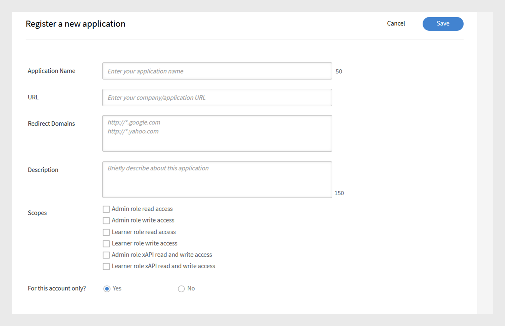
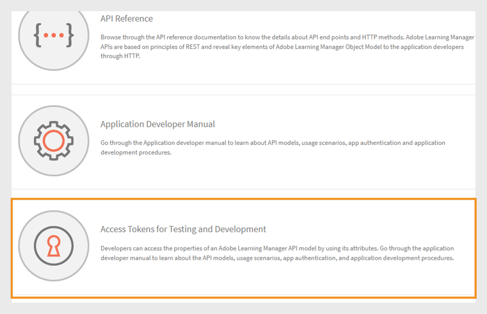
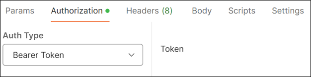
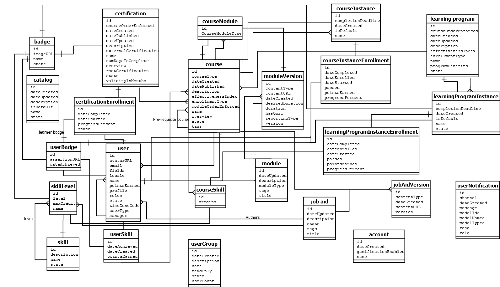

# Adobe Learning Managerデベロッパーマニュアル

## 概要

Adobe Learning Managerには、開発者がアプリケーションやワークフローを効果的に統合およびカスタマイズできるRESTful APIが用意されています。 デベロッパーマニュアルでは、認証、データモデル、他のアプリケーションとの統合などのトピックを取り上げ、これらのAPIの使用方法に関するガイダンスを提供しています。 また、このガイド[APIリファレンスドキュメント](https://learningmanager.adobe.com/docs/primeapi/v2/)は、コースの作成、学習者の進捗状況の追跡、スキルマッピング、資格認定、ゲーミフィケーション、トランスクリプトなど、Adobe Learning Managerの様々な機能を操作する外部アプリケーションやバックエンドワークフローを作成する際に役立ちます。

このマニュアルでは、次の内容について説明します。

* OAuth2.0認証
* APIオブジェクトモデル
* インクルード、フィールド、およびその他のパラメーターの使用方法を示します
* 実際のユースケースにエンドポイントを提供

>[!IMPORTANT]
>
>このデベロッパーマニュアルでは、Adobe Learning ManagerのV2 APIについてのみ説明しています。 このガイドで説明されているすべての例、リクエスト構造、および認証ワークフローは、 /primeapi/v2/エンドポイントに固有のものです。 古いバージョンまたは非推奨のAPIについては、[APIリファレンスドキュメント](https://learningmanager.adobe.com/docs/primeapi/v2/)を参照してください。

## APIの使用シナリオ

開発者はLearning Manager APIを使用して、Learning Managerを他のエンタープライズアプリケーションと強化または統合できます。 任意のテクノロジーを使用して、web、デスクトップ、またはモバイルアプリを作成できます。 開発者はLearning Manager内のアプリケーションデータにアクセスできますが、デプロイは外部から行われ、ユーザーによって完全に制御されます。 通常、アプリはお客様の組織が独自のアカウント用に開発しますが、Adobeパートナーは、一般的なアプリケーションを作成してより幅広く利用することができます。

## OAuth 2.0を使用した認証

安全にAdobe Learning Manager APIにアクセスするには、ALMのOAuth 2.0メカニズムを使用して認証する必要があります。 このプロセスには、アプリケーションの登録、認証コードの生成、リフレッシュトークンとの交換、最後にリフレッシュトークンを使用したアクセストークンの取得が含まれます。

### アプリケーションの登録

Adobe Learning Managerを外部アプリケーションと統合することで、汎用性が向上します。 この手順には、統合管理者のインターフェイスへのアクセス、アプリケーションの登録、クライアントIDとシークレットの取得が含まれます。 ALMから認証トークン（OAuth、更新およびアクセストークン）を生成し、認証と承認のためにOAuth 2.0フレームワークを使用することを強調します。 アクセストークンの有効期間は7日です。

1. 統合管理者としてAdobe Learning Managerにログインします。
2. 左側のペインで&#x200B;**[!UICONTROL アプリケーション]**&#x200B;を選択します。

   

3. **[!UICONTROL 登録]**&#x200B;を選択し、次の情報を追加します：

   * **[!UICONTROL アプリケーション名]**:アプリケーションの名前を入力します（最大50文字）。
   * **[!UICONTROL URL]**：会社またはアプリケーションの公式URLです。 識別と参照に使用されます。
   * **[!UICONTROL リダイレクトドメイン]**: ALMが認証後にリダイレクトできるドメイン([http://learningmanager.adobe.com](http://learningmanager.adobe.com)など)を指定します。  複数のURLを指定できますが、URLは有効である必要があります。
   * **[!UICONTROL 説明]**:アプリケーションの機能の簡単な説明です。
   * **[!UICONTROL スコープ]**:アプリケーションのスコープを定義するために使用できる6つのオプションのいずれかを選択します。 ここに示された選択に基づき、アプリケーションからLearning Manager APIエンドポイントにアクセスできます。 例えば「学習者の役割の読み取りアクセス」を選択した場合、Learning Managerの学習者APIエンドポイントのすべてで、アプリケーションから読み取り専用のアクセスが可能になります。

      * 管理者ロール読み取り/書き込みアクセス権：アプリケーションが管理者としてデータにアクセスしたり、データを変更したりできるようにします。
      * 学習者の役割読み取り/書き込みアクセス権：アプリケーションが学習者のデータにアクセスしたり、変更したりできるようにします。
      * xAPI読み取り/書き込みアクセス：アプリケーションがExperience API(xAPI)ステートメントにアクセスして送信できるようにします。

   * **[!UICONTROL このアカウントのみですか？]**

      * **[!UICONTROL はい]** - [はい]を選択した場合、他のアカウント管理者がアプリケーションを見ることはできません。
      * **[!UICONTROL いいえ]** - [いいえ]を選択した場合、他のアカウント管理者もこのアプリケーションにアクセスできますが、このアプリケーションにアクセスするには、アプリケーションIDを使用する必要があります。 アプリケーションIDが生成され、Learning Managerアプリケーションの編集モードに表示されます。

     

4. 「**[!UICONTROL 保存]**」を選択してアプリケーションを登録します。

   * アプリケーションを登録すると、アカウントで作成されたアプリケーションのリストでそのアプリケーションを使用できるようになります。 アプリケーションを選択すると、以前に入力したフィールドに加えて、次のフィールドが表示されます。
   * アプリケーションID：これはクライアントIDです。 このIDは、アクセスを要求しているアプリケーションをALMに通知します。 これは、アプリを識別するためのAPIリクエストに含まれています。
   * アプリケーションシークレット：これは、トークン交換手順（更新トークンやアクセストークンを要求する場合など）でアプリケーションを認証し、そのIDを確認するために使用されます。

   

## アクセストークンの取得

### リダイレクトからの認証コードの取得

クライアントIDとクライアントシークレットを取得したら、それらを使用してアクセストークンをリクエストし、API呼び出しの認証に使用します。

認証コードフローを開始するには、ブラウザーで次のURLにユーザーを誘導します。

```
GET https://learningmanager.adobe.com/oauth/o/authorize?client_id=<Enter your clientId>&redirect_uri=<Enter a url to redirect to>&state=<Any String data>&scope=<one or more comma separated scopes>&response_type=CODE 
```

ユーザーがアプリケーションを承認すると、Adobe Learning Managerは、追加されたクエリパラメーターを使用して、指定されたredirect_uriにリダイレクトされます。

[https://yourapp.com/callback?code=abc123xyz](https://yourapp.com/callback?code=abc123xyz)

リダイレクトURIとともにパラメーターコードが追加されます。

### コードから更新トークンを取得

コードを取得したら、任意のAPIツールを使用して、次のPOSTリクエストを追加します。

```https://learningmanager.adobe.com/oauth/token ```

**要求本文(x-www-form-urlencoded)**:

```
grant_type=authorization_code  
&code=abc123xyz  
&client_id=<your_client_id>  
&client_secret=<your_client_secret>  
&redirect_uri=<your_redirect_url> 
```

**回答**

```
{ 

  "access_token": "eyJhbGciOiJIUzI1...", 
  "refresh_token": "xTjlfz0jCk6gF1...", 
  "expires_in": 604800, 
  "token_type": "Bearer" 

} 
```

認証されたAPI要求を行うには、Authorizationヘッダーのaccess_tokenを使用します。

### API呼び出しでアクセストークンを使用

次を使用してアクセストークンを確認します。

```
GET https://learningmanager.adobe.com/oauth/token/check?access_token=<access_token> 
```

アクセストークンの有効期間は7日間です。 7日後、更新トークンを使用して新しいアクセストークンを生成する必要があります。 既存のアクセストークンが有効な場合に、更新トークンから新しいアクセストークンを生成すると、既存のトークンは返却されます。

### テストおよび開発用のアクセストークンを取得

Adobe Learning Manager(ALM)トークン生成ツールを使用すると、テストおよび開発用のアクセストークンをすばやく作成できます。 これらのトークンは、開発およびデバッグフェーズでの個人的な使用のみを目的としています。 テストトークンはALMデータへのアクセスを許可するため、安全に処理することが不可欠です。 テストトークンは、他のユーザーと共有したり、実稼働アプリケーションで使用したり、パブリックコードリポジトリに含めたりしないでください。 アカウントとデータのセキュリティを確保するために、パスワードと同様に扱います。

1. 統合管理者としてAdobe Learning Managerにログインします。
2. **[!UICONTROL 開発者向けリソース]**&#x200B;を選択してから、**[!UICONTROL テストおよび開発用のアクセストークンを選択]**&#x200B;します。

   

3. OAuthコードを取得するアプリケーションを作成した後に取得した&#x200B;**[!UICONTROL クライアントID]**&#x200B;を入力します。 次に、**[!UICONTROL 送信]**&#x200B;を選択します。

   

4. **[!UICONTROL クライアントID]**&#x200B;と&#x200B;**[!UICONTROL クライアントシークレット]**&#x200B;を追加して、更新トークンを取得します。 次に、**[!UICONTROL 送信]**&#x200B;を選択します。 OAuthは前の手順から事前入力されます。

   

5. クライアントIDとクライアントシークレットを追加して、アクセストークンを取得します。 次に、**[!UICONTROL 送信]**&#x200B;を選択します。

   

6. アクセストークンを追加し、「送信」を選択してアクセストークンの詳細を取得します。

   

**[!UICONTROL 送信]**&#x200B;を選択すると、アクセストークンが確認され、次の応答が表示されます。

```
{ 
  "access_token": "access token", 
  "refresh_token": "refresh token", 
  "user_role": "admin", 
  "account_id": "1234", 
  "user_id": "123456", 
  "expires_in": 604800 
} 
```

これまでと同様に、テスト用アクセストークンは7日で期限切れになります。

### エンドポイントのテストにAPIツールを使用する

サードパーティのAPIテストツールはすべて使用できますが、エンドポイントのテストにはPostmanを使用します。 この文書の例では、エンドポイントのテストにPostmanを使用しています。

1. Postmanを開き、新しいリクエストを作成します。
2. 「認証」タブを選択します。
3. 認証タイプを「ベアラートークン」に設定します。

   
4. 前のセクションで取得したアクセストークンを「トークン」フィールドに貼り付けます。

   

5. 「ヘッダー」タブで、次の項目を追加します。

   * キー：承認
   * 値： application/json
6. URLフィールドにAPIエンドポイントを入力します。 例： [https://learningmanager.adobe.com/learningManager/api/v2/users](https://learningmanager.adobe.com/learningManager/api/v2/users)
詳しくは、[Adobe Learning Manager APIリファレンス](https://learningmanager.adobe.com/docs/primeapi/v2/)を参照してください。
7. 「送信」を選択して、APIリクエストを作成します。

## APIの種類

### 管理API

Adobe Learning Managerの管理者APIを使用すると、管理者は学習オペレーションを大規模に自動化および管理できます。

Admin APIを使用すると、開発者は次の操作を実行できます。

>[!NOTE]
>
>このリストは網羅的ではありません。

* **ユーザーとグループの管理**:ユーザーを作成、更新、および削除するか、グループに割り当てます。
* **学習者の登録** :コース、学習パス、または資格認定の登録を自動化します。
* **学習者の進行状況の追跡**:コースやモジュールの進行状況、クイズのスコア、完了ステータスを取得します。
* **レポートの生成**：学習者のアクティビティ、エンゲージメント、パフォーマンスに関するデータにアクセスします。
* **コンテンツの管理**:コースや学習目標を作成および整理します。

詳しくは、[Adobe Learning Manager APIリファレンス](https://learningmanager.adobe.com/docs/primeapi/v2/)を参照してください。

### 学習者API

学習者APIは、認証されたユーザー（学習者）向けに設計されており、学習者固有の情報にアクセスできます。 これらのAPIにより、次のようなタスクを実行できます。

* 学習者のコースおよび進捗状況へのアクセス
* 取得したバッジまたは資格認定の取得
* 学習者プロファイル情報の更新
* 完了したコースに関連付けられているスキルの表示

**キーポイント：**

* これらのAPIでは、認証済みユーザートークンが必要であり、データのセキュリティとプライバシーが確保されます。
* このAPIは、匿名ユーザーや共有ユーザーではなく、ユーザーが完全に登録されてログインしているシナリオを想定しています。

詳しくは、[Adobe Learning Manager APIリファレンス](https://learningmanager.adobe.com/docs/primeapi/v2/)を参照してください。

## API設計と共通パラメーター

APIを使用すると、開発者はユーザー、コース、スキル、資格認定、学習プログラムなど、Learning Managerの主要リソースにアクセスできます。 RESTの原則に従い、HTTPメソッド(GET、POST、PUT、DELETE)を使用してデータを処理します。

| | |
|--|--|
| メソッド | GET、PUT、POST、DELETE |
| 書式設定 | application/vnd.api+json, application/json. 一般的なMIMEの種類の[詳細](https://developer.mozilla.org/en-US/docs/Web/HTTP/Guides/MIME_types/Common_types)を表示します。 |
| ベース URL | [https://learningmanager.adobe.com/primeapi/v2/](https://learningmanager.adobe.com/primeapi/v2/) |

### 共通パラメーター

| パラメーター | 目的 |
|--|--|
| include | 1回の呼び出しで関連リソースを取得します。 |
| フィールド | ペイロードを削減する特定の属性を選択します。 |
| フィルター | 検索結果を絞り込む（例：ID、名前） |
| 並べ替え | ご注文の結果 |
| ページ[制限]、ページ[オフセット] | ページ割り付けのサポート |

以下に、それぞれの簡単な説明を示します。

### include

ALM APIを使用すると、カスタムアプリケーションまたはヘッドレスLMSの構築中に、役立つ情報を取得できます。 APIエンドポイントを追加の「include」パラメーターと共に含めて、デフォルトで受信されたデータと関連する追加情報を取得することもできます。 これらの関係はデータモデルの関係です。例えば、ユーザーの詳細を取得するために呼び出しを行うと、ユーザー情報と、マネージャーIDとALMアカウントIDの関係が表示されます。 includeパラメーターを使用すると、マネージャーの詳細やALMアカウントの詳細などのユーザーの詳細とともに、詳細な方法で追加詳細を抽出できます。
つまり、API呼び出しで**include**&#x200B;パラメーターを使用して、関連する（リンクされた）リソースとプライマリリソースを1つの応答で取得します。 この機能は、個別のAPI呼び出しを行わずに、コースのモジュールや学習者にマップされたスキルなど、ネストされたデータや依存データにアクセスする場合に便利です。

主なメリット：

* 複数のAPI呼び出しを削減：関連する各リソースを手動で要求する必要がなくなります。
* 効率の向上：開発の高速化、サーバー負荷の軽減、データのレンダリングの高速化を実現します。
* データの一貫性を確保：一貫性のあるスナップショット内のすべての関連データを取得します。

**includeパラメーターの使用方法**

API URLにincludeパラメーターを追加し、含める関連エンティティを指定します。

**共通インクルードパス**

| 値を含める | 説明 |
|---|---|
| インスタンス | 学習目標のすべてのインスタンスを返す |
| enrollment | ユーザーの登録詳細を返します。 |
| instances.loResources.resources | インスタンス内のモジュールとリソースを取得します。 |
| supplementaryResources | 関連する補足リソースを返します |
| skills.skillLevel.badge | スキルレベルと関連するバッジを取得します |
| 前提条件LO | 前提条件となる学習目標が含まれています |
| subLOs | サブ学習オブジェクトを取得します（LPまたは資格認定で使用） |
| subLOs.enrollment | サブ学習目標の登録 |
| instances.badge | コースインスタンスの完了時に割り当てられるバッジ |
| subLOs.subLOs.instances.loResources.resources | サブサブLOインスタンス内の深くネストされたリソース |

**例1**

エンドポイントのuserIDパラメーターを使用して、ユーザーの詳細を取得します

```
https://learningmanager.adobe.com/primeapi/v2/users/<userID>
```

```
GET https://learningmanager.adobe.com/primeapi/v2/users/<userID>
```

応答では、データオブジェクトがアカウントおよびユーザーのマネージャーと関係があることがわかります。

```
"relationships": {
            "account": {
                "data": {
                    "id": "1010",
                    "type": "account"
                }
            },
            "manager": {
                "data": {
                    "id": "3400476",
                    "type": "user"
                }
            }
        }
```

リクエストでincludeパラメータを使用すると、次に示すように、マネージャの詳細情報を取得できます。

```
GET https://learningmanager.adobe.com/primeapi/v2/users/<userid>?include=manager
```

**例2**

コースの詳細を取得するには、エンドポイントコールでincludeパラメーターを使用します。 次のエンドポイントは、コース情報とその関係を取得します。

```
GET https://learningmanager.adobe.com/primeapi/v2/learningObjects/<courseID>
```

関連付けは、次のように応答に表示されます。

* インスタンス
* スキル
* 作成者

```
"relationships": {
            "authors": {
                "data": [
                    {
                        "id": "3400468",
                        "type": "user"
                    }
                ]
            },
            "instances": {
                "data": [
                    {
                        "id": "course:16444_31598",
                        "type": "learningObjectInstance"
                    }
                ]
            },
            "skills": {
                "data": [
                    {
                        "id": "course:16444_1796",
                        "type": "learningObjectSkill"
                    },
                    {
                        "id": "course:16444_3103",
                        "type": "learningObjectSkill"
                    }
                ]
            }
        }
```

その他の関係には、次のものがあります（上記の応答には存在しません）。

* 前提条件LO
* supplementaryLOs
* supplementaryResources

インスタンスとスキルの詳細なデータを取得するには、includeパラメーターに「インスタンス，スキル」を含めます。

```
GET https://learningmanager.adobe.com/primeapi/v2/learningObjects/<courseID>?include=instances,skills
```

例えば、loResources（コースのモジュール情報）など、コースインスタンスに関連付けられたより多くのデータを取得する場合は、loResourcesをネストされたincludeとして適用します。

```
GET https://learningmanager.adobe.com/primeapi/v2/learningObjects/<courseID>?include=instances.loResources
```

さらに、スキルとインスタンスをネストされたインクルードと組み合わせます。

```
GET https://learningmanager.adobe.com/primeapi/v2/learningObjects/<courseID>?include=instances,instances.loResources,skills
```

**その他のフィルターを含む**

<table>
 <tbody>
  <tr>
   <td>
    <p style="text-align: left;"><b>学習プログラム</b></p></td>
   <td>
    <p style="text-align: left;"><b>コース</b></p></td>
  </tr>
  <tr>
  <td><br>subLOs.prerequisiteLOs.enrollment</br><br>subLOs.subLOs.prerequisiteLOs.enrollment</br><br>subLOs.enrollment.loResourceGrades</br><br>subLOs.subLOs.enrollment.loResourceGrades</br><br>subLOs.subLOs.instances.loResources.resources.room</br><br>subLOs.instances.loResources.resources.room</br><br>subLOs.supplementaryResources</br><br>subLOs.enrollment</br><br>SubLOs.enrollment.loInstance.loResources.resources</br><br>subLOs.supplementaryLOs.instances.loResources.resources</br>
  </td>
  <td>
  <br>instances.enrollment.loResourceGrades</br><br>enrollment.loInstance.loResources.resources</br>prerequisiteLOs</br><br>authors</br><br>instances.loResources.resources</br><br>supplementaryLOs.instances.loResources.resources</br><br>supplementaryResources</br><br>instances.badge</br><br>skills.skillLevel.badge</br><br>skills.skillLevel.skill</br><br>instances.loResources.resources.room</br><br>prerequisiteLOS.ENROLLMENT</br><br>EnROLLMENTLo0 RESOURCEGrADES</br>
  </td>
  </tr>

#### フィールド

APIオブジェクトの属性と関係はフィールドと呼ばれます。 API呼び出しでパラメーターとしてフィールドを使用し、モデルから特定の属性を取得します。 Fieldsパラメーターを指定しないと、API呼び出しで使用可能なすべての属性が取得されます。

例えば、次のAPI呼び出しでは、 fields[skill]=nameはスキルモデルのname属性のみを取得します。

```
GET https://learningmanager.adobe.com/primeapi/v2/users/3400490/userSkills/3400490_1796_1?include=skillLevel.skill&fields[skill]=name
```

#### ページ設定

APIページネーションは、APIで使用される手法の1つです。データ全体を1回の応答で返すのではなく、大量のデータを小さく管理しやすいチャンク（ページ）に分割します。

ページ割り当てによって、クライアントとサーバの負荷を軽減し、応答サイズを制限してサーバのボトルネックを回避できます。また、テーブルまたはリストのデータを一度に1ページずつ表示する場合に便利です。

**ALM APIのページ割り付けの仕組み**

ALM APIは、次のようなパラメーターによるページ割り当てをサポートします。

* ページ[制限]: 1ページあたりのレコード数。
* ページ[オフセット]:スキップするレコードの数。
* ページ[カーソル]：次の結果セットへのポインタ。 （多くのレコードをスキップする）オフセットベースのページ割り当てを使用する代わりに、カーソルベースのページ割り当てでは、APIから返された一意のマーカーを使用して結果の次のページを取得します。

APIでページ割り付けを使用する方法は次のとおりです。

**ページ[制限]**

[https://learningmanager.adobe.com/primeapi/v2/users](https://learningmanager.adobe.com/primeapi/v2/users)は、1回の呼び出しですべてのユーザーおよび関連情報を返しますが、ページ[limit]を使用すると、結果の数が指定された値に制限されます。

1回の呼び出しで5つのユーザーレコードのみを返すには、次のAPIを使用します。

```
GET https://learningmanager.adobe.com/primeapi/v2/users?page[limit]=5
```

**ページ[オフセット]**

このAPI呼び出しを使用して、3つのユーザーレコードを返し、最初の5人のユーザーをスキップして、6番目から開始します。

```
GET https://learningmanager.adobe.com/primeapi/v2/users?page[limit]=3&page[offset]=5 
```

**ページ[カーソル]**

1. 最初に、制限が5の最初のページをリクエストします。

   ```
   GET https://learningmanager.adobe.com/primeapi/v2/users?page[limit]=5
   ```

2. links.nextからカーソル値をコピーし、次のリクエストで使用します。

   ```
   "links": {
       "self": "https://learningmanager.adobe.com/primeapi/v2/users?page[limit]=5",
       "next": "https://learningmanager.adobe.com/primeapi/v2/users?page[limit]=5&page[cursor]=3400482"
    }
   ```

3. 次のリクエストを送信します。

   ```
   GET https://learningmanager.adobe.com/primeapi/v2/users?page[limit]=5&page[cursor]=3400482
   ```

これにより、前のページの最後のアイテムの後から始まる10個のレコードの次のセットが返されます。

#### フィルター

filterパラメーターを使用すると、1つ以上のフィールド値に基づいてAPI結果を絞り込むことができます。

Adobe Learning Manager APIでは、様々なバリエーションのフィルターパラメーターを使用して応答を絞り込むことができます。

詳しくは、[Adobe Learning Manager APIリファレンス](https://learningmanager.adobe.com/docs/primeapi/v2/)を参照してください。

次の例では、学習者がエンドポイントを使用してfilterパラメータを指定し、登録した作業計画書にフィルタを適用する方法を示します：

```
GET https://learningmanager.adobe.com/primeapi/v2/users/3400480/enrollments?filter.loTypes=jobAid
```

#### 並べ替え

sortパラメーターは、1つ以上のフィールドに基づいてAPI結果を昇順または降順で並べ替えるために使用されます。

Adobe Learning Managerには、API応答をソートするための様々なソートオプションが用意されています。 詳しくは、[Adobe Learning Manager APIリファレンス](https://learningmanager.adobe.com/docs/primeapi/v2/)を参照してください。

前の例を拡張して、学習プログラムへのユーザーの登録を登録日で昇順に並べ替えることができるようになりました。

```
GET https://learningmanager.adobe.com/primeapi/v2/users/3400480/enrollments?filter.lotypes=learningProgram&sort=dateEnrolled
```

## APIモデルの概要

Adobe Learning Manager APIを使用すると、開発者はLearning ManagerオブジェクトにRESTfulリソースとしてアクセスできます。 各 API エンドポイントは、通常、バッジなどのオブジェクトインスタンスといったリソースを指しており、そのようなオブジェクトのコレクションを指すこともあります。 次に、PUT、GET、POST、DELETEなどのHTTP動詞を使用して、これらのオブジェクト（コレクション）に対するCRUD操作を実行します。


| Learning Manager オブジェクト | 説明 |
|----|----|
| account | Learning Managerのお客様の詳細情報をカプセル化します。 |
| badge | バッジは、学習者がコースを進めていく中で、特定のマイルストーンに到達したときに獲得する達成の証しです。 |
| catalog | カタログは、学習目標のコレクションです。 |
| user | Learning Manager における主要なモデル。通常、学習目標を使用する、組織の内部学習者や外部学習者を指す。 ただし、学習者という役割に加えて、作成者や管理者など、他の役割を果たす場合もある。 インライン属性には、ユーザー ID、タイプ、電子メールなどがある |
| resource | モジュールでカプセル化しようとする各コンテンツリソースをモデル化するために使用される。 「loResource」にカプセル化されたすべてのリソースは、学習目標の観点では同等ですが、配信タイプやコンテンツのロケールの観点では互いに異なります。 |
| userNotification | 学習者に関連した通知情報が含まれる |
| userSkill | UserSkillは、1人のユーザーが1つのスキルレベルをどの程度達成しているかを示します。 |
| userBadge | UserBadgeは、単一のバッジを単一のユーザーに関連付けます。 いつ達成したかや、assertionUrlなどの詳細が含まれています。 |
| skill | スキルモデルは、レベルとクレジットで構成される。 学習者は関係のあるコースを完了すると、スキルを取得できる |
| skillLevel | 1つまたは複数のコースで構成されるスキルレベルを使用して、レベルとそれに関連するクレジットを取得します。 |
| learningObject | ユーザーが登録して学習できる、さまざまな種類のオブジェクトを抽象化したもの。 現在、Learning Managerには4種類の学習目標（コース、資格認定、学習プログラム、作業計画書）があります。 |
| learningObjectInstance | 学習目標の特定のインスタンス |
| learningObjectResource | これはmoduleの概念と同じです。 コースは 1 つまたは複数のモジュールで構成される。 Learning Manager では、モジュールをさまざまな同等の方法で配信できる。したがって、loResourceは本質的にこれらのすべての同等のリソースをカプセル化します。 |
| loResourceGrade | ユーザーが登録した学習目標のコンテキストで特定のリソースを使用した結果をカプセル化する。 リソースでユーザーが費やした時間、ユーザーが行った進行状況の割合、合格/不合格のステータス、関連するクイズでユーザーが取得したスコアなどの情報が含まれます。 |
| calendar | カレンダーオブジェクトは、ユーザーが登録できる今後の教室またはバーチャルクラスルームコースのリストです。 |
| l1FeedbackInfo | 学習目標に関連したフィードバックの質問に対して、学習者が提出した回答をカプセル化する。 学習者からフィードバックを収集するように設定されている場合、通常は、ユーザーが学習目標を完了した後に収集されます。 |
| enrollment | この抽象化したものにより、特定の学習目標のインスタンスに対する、特定のユーザーの割り当てに関連したトランザクションの詳細をカプセル化する。 |


## 学習者のAPIとエンドポイント

学習者データを操作するための主要なAPIエンドポイントは次のとおりです。 これらのAPIは、学習者の情報とのやり取り、進捗状況の追跡、登録の管理、コースコンテンツの取得について開発者をガイドします。

### すべての学習者の詳細を取得

学習者の詳細（名前、電子メール、UUID、ユーザープロファイルなど）を取得します。 APIを使用して、アカウント内のすべての学習者を一覧表示します。

```
GET https://learningmanager.adobe.com/primeapi/v2/users
```

### 特定の学習者の詳細の取得

学習者のプロファイルをIDで表示する場合は、次のAPIを使用して呼び出します。

```
GET https://learningmanager.adobe.com/primeapi/v2/users/<userID>
```

### すべてのコース、学習プログラム、作業計画書および資格認定のリスト

学習者が登録されている、完了している、または管理者が有効化しているすべての学習目標の詳細を取得します。

```
GET https://learningmanager.adobe.com/primeapi/v2/learningObjects
```

### 特定の学習目標の詳細を取得

学習目標に関する詳細情報を取得します。 これには、作成日、公開日、更新日およびその他の情報が含まれます。

```
GET https://learningmanager.adobe.com/primeapi/v2/learningObjects/<LearningObjectID>
```

### コースにリンクされているスキルのリストを取得する

アカウント内のすべての学習者に割り当てられたスキルを表示します。

```
GET https://learningmanager.adobe.com/primeapi/v2/skills
```

### スキルレベルとバッジ情報の取得

スキルベース学習ジャーニーにおける学習者の進捗状況を確認します。

```
GET https://learningmanager.adobe.com/primeapi/v2/skills/<skillID>?include=levels
```

### アカウントに作成されたすべてのバッジのリスト

次のエンドポイントに電話をかけて、組織内のアカウントに作成されたすべてのバッジのリストを取得します。

```
GET https://learningmanager.adobe.com/primeapi/v2/badges
```

### バッジの情報の取得

バッジの名前、バッジ画像のURL、バッジのステータスなど、バッジに関する詳細情報を取得します。

```
GET https://learningmanager.adobe.com/primeapi/v2/badges/<skillID>
```

これにより、次の応答が生成されます。

```
{
    "links": {
        "self": "https://learningmanager.adobe.com/primeapi/v2/badges/499"
    },
    "data": {
        "id": "499",
        "type": "badge",
        "attributes": {
            "imageUrl": "https://cpcontentsdev.adobe.com/public/account/1010/accountassets/1010/badges/test_57a5ab00555a475a8fc6671562184dc9.png",
            "name": "penguins",
            "state": "Retired"
        }
    }
}
```

## その他のAPIの使用例

### ユーザーの作成

1. エンドポイントを使用します。

   ```
   POST https://learningmanager.adobe.com/primeapi/v2/users
   ```

   API本文またはJSONペイロードから属性を処理してユーザーを生成し、続いて各ユーザーIDを入力してユーザーに提供します。

2. 次のペイロードを本文として使用：

   ```
   { 
      "data": { 
        "type": "user", 
        "attributes": { 
         "email": "bob@example.com", 
          "name": "Bob", 
          "userType": "INTERNAL" 
        } 
      } 
    }
   ```

必須の属性は次の3つです。

* email：ユーザーの電子メールID。 この値は、各ユーザーに対して一意である必要があります。
* name:ユーザーの名前。
* userType：現在、このエンドポイントを使用して追加できるのは内部ユーザーのみです。 userTypeは「内部」である必要があります。

次の応答が表示されます。

```
{
  "links": {
      "self": "https://learningmanager.adobe.com/primeapi/v2/users"
  },
  "data": {
      "id": "13386404",
      "type": "user",
      "attributes": {
          "avatarUrl": "https://cpcontents.adobe.com/public/images/default_user_avatar.svg",
          "email": "bob@example.com",
          "name": "Bob",
          "pointsEarned": 0,
          "pointsRedeemed": 0,
          "preferredResolution": "AUTO",
          "profile": "Employee",
          "roles": [
              "Learner"
          ],
          "state": "ACTIVE",
          "userType": "Internal",
          "userUniqueId": "bob@example.com"
      },
      "relationships": {
          "account": {
              "data": {
                  "id": "1010",
                  "type": "account"
              }
          },
          "manager": {
              "data": {
                  "id": "3400468",
                  "type": "user"
              }
          }
      }
  }
}
```

### ユーザーの削除

1. 削除するユーザーのユーザーIDを取得します。

   ```
   GET https://learningmanager.adobe.com/primeapi/v2/users/<userID>
   ```

2. 次に、DELETEを使用して、次の呼び出しを行います。

   ```
   DELETE https://learningmanager.adobe.com/primeapi/v2/users/<userID>
   ```

204応答が表示されます。 204応答コードは、返すコンテンツがない状態で成功したことを示します。 サーバーは要求を正常に処理しましたが、クライアントに提供するデータがありません。

ユーザーの詳細を取得した後、ユーザーの状態は&#x200B;**[!UICONTROL 削除済み]**&#x200B;になりました。

### ユーザーの詳細の更新

1. v2 APIを使用して、ユーザーの詳細を更新します。 学習者は、bio、uiLocale、contentLocale、timezoneを変更できます。 大規模なアカウントの場合、これらは非同期呼び出しです。 このAPIエンドポイントを使用して更新できるユーザー属性は、他にも数多くあります。 /users/{id}エンドポイントを使用します。idは、詳細を更新するユーザーのユーザーIDです。

```
PATCH https://learningmanager.adobe.com/primeapi/v2/users/<userID>
```

ID `<userID>`のユーザーを更新するリクエストのペイロードに、前のセクションから次を追加します。

ペイロードの任意のフィールドを変更します。

```
{
    "data": {
        "id": "3400468",
        "type": "user",
        "attributes": {
            "avatarUrl": "https://cpcontents.adobe.com/public/images/default_user_avatar.svg",
            "binUserId": "3e6d571f-3956-44db-be69-8e458bde649f",
            "bio": "Manager",
            "contentLocale": "de-DE",
            "email": "user@example.com",
            "enrollOnClick": true,
            "fields": {
                "Web": "Web",
                "newfororder": "newvalue",
                "location": "New",
                "test1": "b"
            },
            "gamificationEnabled": true,
            "lastLoginDate": "2025-04-30T09:30:51.000Z",
            "metadata": {
                "level": "5",
                "expertise": "java",
                "sport": "tennis"
            },
            "name": "John Adams",
            "pointsEarned": 8600,
            "pointsRedeemed": 0,
            "preferredResolution": "AUTO",
            "profile": "Employee",
            "roles": [
                "Learner",
                "Admin",
                "Author",
                "Instructor",
                "Integration Admin",
                "Manager"
            ],
            "state": "ACTIVE",
            "timeZoneCode": "213",
            "uiLocale": "en-US",
            "userType": "Internal",
            "userUniqueId": "user@example.com"
        },
        "relationships": {
            "account": {
                "data": {
                    "id": "1010",
                    "type": "account"
                }
            }
        }
    }
}
```

通話を行うと、ユーザーの詳細が更新されます。

### 社外プロファイルの作成

社外プロファイルとは、社外学習者（通常、組織内のユーザーベースに含まれない個人）用に作成されるユーザープロファイルを指します。 このような学習者の中には、組織が提供するトレーニングや認定プログラムにアクセスする必要があるお客様、パートナー、ベンダー、フランチャイズ加盟店、または一時的な請負業者などが含まれます。

1. 次のエンドポイントを使用します。

   ```
   POST https://learningmanager.adobe.com/primeapi/v2/externalProfiles
   ```

2. 次のペイロードを本文として使用：

```
{
    "data": {
      "type": "externalProfile",
      "attributes": {
        "name": "Jonas Albertson",
        "expiry": "2027-12-31T18:29:59.000Z",
        "managerEmail": "jonas@acme.com",
        "seatLimit": 10
      }
    }
}
```

ペイロードには次の属性があります。

* name：外部ユーザーの名前。
* 有効期限： Adobe Learning Managerでのユーザー登録の有効期限（ISO-8601形式）。
* managerEmail:パートナー組織のユーザーのマネージャーの電子メールアドレス。
* seatLimit:パートナー組織に許可されているシート数。

通話を行うと、次の応答が返されます。

```
{
    "links": {
        "self": "https://learningmanager.adobe.com/primeapi/v2/externalProfiles"
    },
    "data": {
        "id": "18805",
        "type": "externalProfile",
        "attributes": {
            "accessKey": "8gte2ne7f4r14",
            "enabled": true,
            "expiry": "2027-12-31T18:29:59.000Z",
            "managerEmail": "jonas@acme.com",
            "name": "Jonas Albertson",
            "seatLimit": 10,
            "url": "https://learningmanager.adobe.com/eplogin?groupid=18805&accesskey=8gte2ne7f4r14"
        }
    }
}
```

これは、社外ユーザーがAdobe Learning Managerに正常に追加されたことを示します。 ユーザーへの応答に含まれるURLを送信します。このURLを使用して、ユーザーはプラットフォームで登録できます。

### ユーザーIDとマネージャーの詳細を含むユーザーレポートを抽出します

ユーザーレポートは、ユーザーインターフェイス（**[!UICONTROL 管理者]** > **[!UICONTROL ユーザー]** > **[!UICONTROL 内部]**）から直接ダウンロードできます。 ただし、レポートにはユーザーIDと関連するマネージャーの詳細は表示されません。
管理者のジョブAPIを使用して、詳細を取得できます。

1. 次のペイロードをジョブAPIに追加します。

   ```
   {
       "data": {
           "type": "job",
           "attributes": {
               "description": "description of your choice",
               "jobType": "generateUsers",
               "payload":{
                   "expandMetadata":true
               }
           }
      }
   }
   ```

2. 次のエンドポイントを使用します。

   ```
   POST https://learningmanager.adobe.com/primeapi/v2/jobs
   ```

3. 応答からジョブIDをコピーします。

   ```
   {
       "links": {
           "self": "https://learningmanager.adobe.com/primeapi/v2/jobs"
       },
       "data": {
           "id": "43118",
           "type": "job",
           "attributes": {
               "dateCreated": "2025-05-26T06:35:35.000Z",
               "description": "description of your choice",
               "jobType": "generateUsers",
               "payload": {
                   "expandMetadata": true
               },
             "status": {
                   "code": "Submitted"
               }
           }
       }
   }
   ```

   応答では、ジョブIDは43118です。
4. IDをコピーした後、ジョブAPIのIDを使用してレポートをダウンロードします。

   ```
   GET https://learningmanager.adobe.com/primeapi/v2/jobs/43118
   ```

5. 応答からS3 URLをコピーします。
6. ブラウザーにURLを貼り付けます。 ブラウザーに、CSVファイルを保存するか開くかを確認するメッセージが表示されます。 ファイルをコンピューターに保存します。
ダウンロードされたファイルには、次の列が含まれています。

internalUserID、userEmail、customerDefinedUniqueUserId、name、managerEmail、userType、state、excludedFromGamification、pointsEarned、profile、roles、dateCreated、lastLoginDate、dateDeleted、uiLocale、contentLocale、timeZoneCode、userSource、group、Activeフィールド、メタデータ、lastSocialActivityDate。

### ジョブAPIを使用したバッジの生成

1. 組織内のユーザーのバッジのリストを取得します。 次のエンドポイントを使用します。

   ```
   GET https://learningmanager.adobe.com/primeapi/v2/users/3400476/userBadges
   ```

   ここで、3400476はユーザーIDです。
2. 応答からバッジIDをコピーします。 例えば、3400476_759_COMPETENCY_1796_1はバッジIDです。

   ```
   {
    "id": "3400476_759_COMPETENCY_1796_1",
    "type": "userBadge",
    "attributes": {
        "assertionUrl": "https://cpcontentsdev.adobe.com/public/accountassets/1010/badges/assertions/a99566b5aa8f4cfa92380581733c63a9_1626278856926.json",
        "dateAchieved": "2016-02-25T08:45:25.000Z",
        "modelType": "skillLevel"
    },
    "relationships": {
        "badge": {
            "data": {
                "id": "759",
                "type": "badge"
            }
        },
        "learner": {
            "data": {
                "id": "3400476",
                "type": "user"
            }
        },
        "model": {
            "data": {
                "id": "1796_1",
                "type": "skillLevel"
            }
        }
    }
   }
   ```

3. ペイロードを作成し、ペイロードでバッジIDを指定します。 ペイロードの例を次に示します。

   ```
   {
    "data": {
        "type": "job",
        "attributes": {
            "description": "Acme Corp Badge",
            "jobType": "generateUserBadge",
            "payload": {
                "userBadgeId": "3400476_759_COMPETENCY_1796_1"
            }
        }
    }
   }  
   ```

   通話を行うと、応答でジョブIDが取得されます。
4. 応答からジョブIDを取得し、次のエンドポイントのジョブIDを使用して呼び出しを行います。

   ```
   GET https://learningmanager.adobe.com/primeapi/v2/jobs/<jobsID>
   ```

5. 応答からバッジURLをコピーし、ブラウザーでURLを開きます。 証明書がPDFとしてダウンロードされます。

### Adobe Learning Managerでのユーザーの作成

POST /usersエンドポイントを使用すると、ヘッドレスモードを使用してユーザーを作成できます。 AdobeのLearning managerのネイティブユーザーインターフェイスで、ユーザーの登録プロセスなどの詳細情報を入力してユーザーを作成します。

以下に例を挙げます。

```
POST https://learningmanager.adobe.com/primeapi/v2/users
```

リクエストに次の本文を追加します。

```
{   
   "data":  
     {  
       "type": "user",  
       "attributes": {  
         "bio": "",  
         "contentLocale": "fr-FR",  
         "email": "user@work.com",  
         "enrollOnClick": true,  
         "fields": {  
           "Learning Categories": [  
             "Business"  
           ],  
           "Categories": "IT"  
         },  
         "gamificationEnabled": true,  
         "name": "Test User",  
         "profile": "Engineer",  
         "userType": "INTERNAL",  
         "userUniqueId": "user@work.com"  
       },  
       "relationships": {  
         "account": {  
           "data": {  
             "id": "108079",  
             "type": "account"  
           }  
         }
         }  
       }  
    } 
```

通話を開始すると、次の応答が表示されます。

```
{
    "links": {
        "self": "https://learningmanager.adobe.com/primeapi/v2/users"
    },
    "data": {
        "id": "13385627",
        "type": "user",
        "attributes": {
            "avatarUrl": "https://cpcontents.adobe.com/public/images/default_user_avatar.svg",
            "email": "user@work.com",
            "name": "Test User",
            "pointsEarned": 0,
            "pointsRedeemed": 0,
            "preferredResolution": "AUTO",
            "profile": "Engineer",
            "roles": [
                "Learner"
            ],
            "state": "ACTIVE",
            "userType": "Internal",
            "userUniqueId": "user@work.com"
        },
        "relationships": {
            "account": {
                "data": {
                    "id": "1010",
                    "type": "account"
                }
            },
            "manager": {
                "data": {
                    "id": "3400468",
                    "type": "user"
                }
            }
        }
    }
}
```

新しいユーザーがAdobe Learning Managerに追加されます。

### L1フィードバックを投稿

1. 学習者のコース、インスタンスおよび登録データを取得します。 次のヒントを使用します。

   ```
   GET /enrollments
   ```

2. コースインスタンスに対してL1フィードバックが有効になっているかどうかを確認します。

   ```
   GET https://learningmanager.adobe.com/primeapi/v2/learningObjects/<loID>/instances/<loInstanceID>/l1Feedback
   ```

3. L1フィードバックを送信します。

   ```
   POST /enrollments/{id}/l1Feedback
   ```

必須ペイロードの例：

```
{
    "data": {
      "id": "course:7454218_10333537_11257863",
      "type": "feedback",
      "attributes": {
        "questions": [
          {
            "answer": "8",
            "questionId": "1",
            "mandatory": true,
            "questionType": "scaleTen"
          }
        ],
        "score": 80
      }
    }
  }
```

### コースのモジュールレベル情報の取得

1. IDごとに学習目標の詳細を取得します。

   ```
   GET https://learningmanager.adobe.com/primeapi/v2/learningObjects/<loID>
   ```

   ```
   {
    "links": {
        "self": "https://learningmanager.adobe.com/primeapi/v2/learningObjects/course:1171899"
    },
    "data": {
        "id": "course:1171899",
        "type": "learningObject",
        "attributes": {
            "authorNames": [
                "James Adams"
            ],
            "dateCreated": "2017-11-01T15:28:09.000Z",
            "datePublished": "2017-11-01T15:28:20.000Z",
            "dateUpdated": "2017-11-01T15:28:20.000Z",
            "duration": 60,
            "effectiveModifiedDate": "2017-11-01T15:28:20.000Z",
            "effectivenessIndex": 0,
            "enrollmentType": "Self Enroll",
            "hasOptionalLoResources": false,
            "hasPreview": false,
            "isExternal": false,
            "isMqaEnabled": false,
            "isPrerequisiteEnforced": false,
            "isSubLoOrderEnforced": false,
            "loFormat": "Self Paced",
            "loResourceCompletionCount": 3,
            "loType": "course",
            "moduleResetEnabled": false,
            "state": "Published",
            "unenrollmentAllowed": true,
            "catalogLabels": [
                {
                    "catalogLabelValueIds": [
                        {
                            "name": "Sales",
                            "id": "catalogLabel:13_31"
                        }
                    ],
                    "description": "",
                    "mandatory": false,
                    "name": "Department",
                    "values": [
                        "Sales"
                    ]
                }
            ],
            "localizedMetadata": [
                {
                    "locale": "en-US",
                    "name": " Test course 2"
                }
            ],
            "rating": {
                "averageRating": 0,
                "ratingsCount": 0
            }
        },
        "relationships": {
            "authors": {
                "data": [
                    {
                        "id": "3400468",
                        "type": "user"
                    }
                ]
            },
            "instances": {
                "data": [
                    {
                        "id": "course:1171899_2067352",
                        "type": "learningObjectInstance"
                    }
                ]
            },
            "skills": {
                "data": [
                    {
                        "id": "course:1171899_1797",
                        "type": "learningObjectSkill"
                    }
                ]
            }
        }
    }
   }
   ```

2. includeパラメーターを使用して、以下を取得します。

   a.学習目標のすべてのモジュールをリストします。

   ```
   GET https://learningmanager.adobe.com/primeapi/v2/learningObjects/course:1171899?include=instances.loResources
   ```

   b.モジュール内のすべてのコンテンツを一覧表示します。

   ```
   GET https://learningmanager.adobe.com/primeapi/v2/learningObjects/course:1171899?include=instances.loResources.resources
   ```

### モジュールの進行状況を確認

1. コースIDを使用して、カタログから学習目標を取得します。

   ```
   GET https://learningmanager.adobe.com/primeapi/v2/learningObjects?page[limit]=10&filter.loTypes=course&sort=name&filter.ignoreEnhancedLP=true&id=<courseID>
   ```

2. 登録IDを使用して、学習者の登録の詳細を取得します。

   ```
   GET https://learningmanager.adobe.com/primeapi/v2/enrollments/<enrollmentID>
   ```

   応答から学習目標リソースの成績IDをコピーします。
3. 次のエンドポイントでIDを使用します。

   ```
   GET https://learningmanager.adobe.com/primeapi/v2/loResourceGrades/<courseResourceGradeID>
   ```

応答でモジュールの進行状況に関する情報が表示されます。

### 学習者のなりすましの実装

Adobe Learning Managerをバックエンドとして使用してヘッドレスLMSを実装する場合、トラブルシューティングやサポートのために、サポートスタッフが学習者を偽装する必要が生じることがあります。 APIによる偽装方法は、学習者の資格情報の機密性を維持しながら安全なアクセスを保証し、セッション状態のシームレスな移行をサポートします。

Adobe Learning Manager(ALM)は、専用APIを介して、ヘッドレスLMS環境での学習者の偽装を容易にします。 この機能を使用すると、サポート担当者は一時的に学習者のIDを引き受けることができ、問題の診断やテスト機能を利用したり、学習者のエクスペリエンスをシミュレートした実践的な支援を提供したりすることができます。 なりすましは、キャッシュされた管理者アクセストークンを使用してアクティベートされます。このトークンは、プログラムにより学習者アクセストークンを生成するために使用されます。 このプロセスにより、学習者としてログインしているかのようにシステムを操作できます。

>[!IMPORTANT]
>
>この機能を利用するには、ユーザーは特別なAPIアクセスを要求する必要があります。また、偽装中に透明性とアカウンタビリティを確保するために、システムはセッションの切り替え、承認、およびその他のインジケーターを処理する必要があります。

**APIエンドポイントの詳細**

```
POST /oauth/learnerToken
```

**完全なURLの例**

```
https://learningmanager.adobe.com/oauth/o/learnerToken?learner_email=foo@acme.com&force=false
```

**クエリパラメーター：**

* learner_email: （文字列）偽装する学習者の電子メール。
* force: (boolean)新しいトークンが存在する場合に、そのトークンを強制的に生成するかどうかを指定します。

**要求本文：**

```
{
    "client_id": "your-client-id",
    "client_secret": "your-client-secret",
    "refresh_token": "your-admin-refresh-token"
}  
```

**サンプル応答：**

```
{
    "access_token": "generated-token",
    "refresh_token": "new-refresh-token",
    "user_role": "learner",
    "account_id": "123456",
    "user_id": "7891011",
    "expires_in": 604800
}  
```

**サンプルcURL:**

```
curl --location --request POST 'https://learningmanager.adobe.com/oauth/o/learnerToken?learner_email=foo@acme.com&force=false' \
--header 'Content-Type: application/json' \
--data-raw '{
  "client_id": "xxxx",
  "client_secret": "xxxx",
  "refresh_token": "xxxx"
}'
```

### 学習者のトランスクリプトの生成

**エラーコード**

| HTTPステータス | 意味 | トラブルシューティング |
|---|---|---|
| 400 | 不正なリクエスト | 要求に含まれるパラメータが不足しているか、または正しくない形式であるかどうかを確認します。 必須フィールドを確認し、書式を修正します。 例えば、フィルター、フィールド、またはincludeパラメーターの構文が無効です。 |
| 401 | 不正な無効またはトークンがありません | アクセストークンが正しく、認証ヘッダーに含まれていることを確認します。 トークンがアクティブであることを確認します。 また、トークンを要求するときは、正しいクライアントIDとクライアントシークレットを使用します。 |
| 403 | 禁止されています。 アクセスなし | リソースにアクセスする権限がありません。 トークンに正しいスコープ（admin:read、learner:writeなど）があることを確認します。 |
| 404 | リソースが見つかりません | エンドポイントIDまたはリソースIDが正しくないか、存在しません。 パラメータのリストにリソースが存在することを確認します。 |
| 406 | 不合格 – Acceptヘッダーが正しくありません | このヘッダーをリクエストに追加します。Accept: application/vnd.api+json <br>Adobe Learning Manager APIでは、このコンテンツタイプは厳密に必須です。</br> |
| 500 | 内部サーバーエラー | これはサーバー側の問題です。 しばらくしてからやり直すか、問題が解決しない場合はAdobe Learning Managerサポートチームに報告してください。 |


<!--# Application developer manual

>[!NOTE]
>
>Learning Manager V1 API is now deprecated. We recommend that you use V2 APIs to interact with Learning Manager.


## Overview {#overview}

[Adobe Learning Manager](http://www.adobe.com/in/products/learningmanager.html) is a cloud-hosted, learner-centric, and self-service learning management solution. Customers can access Learning Manager resources programmatically using the Learning Manager API to integrate it with other enterprise applications. The API can also be used by Adobe partners to enhance the value proposition of Learning Manager, by extending its functionality or by integrating it with other applications or services.

### Usage scenario {#usagescenario}

Using Learning Manager API, developers can build self-contained applications that extend the functionality of Learning Manager or integrate Learning Manager with other enterprise applications workflows. You can develop a web application, desktop client or a mobile app using any technology of your choice. As a developer you can access your application data from within Learning Manager. The deployment of the application that you develop is external to the Learning Manager platform and you have full control over the software development lifecycle as the application evolves. Typically, applications are developed by a customer organization for use with their Learning Manager account, and these applications are private to that specific customer organization. Also, Adobe partners can build generic applications with Learning Manager API, that can be used by a large set of Learning Manager customers.

## Learning Manager API {#apidescription}

The Learning Manager API is based on principles of REST, and exposes key elements of the Learning Manager Object Model to application developers through HTTP. Before knowing the details of the API endpoints and the HTTP methods, developers can become familiar with the various Learning Manager objects, their attributes and inter-relationships. Once the models are understood, it will be useful to get a basic understanding of the structure of API requests and responses, and a few common programming terms that we use generically across the API.

For details of the various API endpoints and methods, refer to the  [Learning Manager API documentation](https://learningmanager.adobe.com/docs/primeapi/v2/).

## Learner APIs

Adobe Learning Manager - Learner APIs allow you to create a custom learning experience for your users. The usage of these APIs need a valid user token and are to be used only for the purpose of workflows where there is a fully licensed/registered Learner.
 
>[!IMPORTANT]
>
>They are not to be used, as is, for any sort of data retrieval to support any non-logged in user/shared users or any other such cases.
 
The non-logged in use cases require special handling. 

**Reach out to the Solution Architecture team, in case you have any questions on the appropriate use of these APIs and ensure that a Solution Architect has vetted a solution before you deploy it**.

## API authentication {#apiauthentication}

When writing an application that makes API calls to Learning Manager, you have to register your application using the Integration Admin app. 

Learning Manager APIs use OAuth 2.0 framework to authenticate and authorize your client applications. 

**Procedure**

**1. Set up your application**

You can set up your application with client id and client secret to use the proper end points. Once you register your application, you can get the clientId and clientSecret. Get URL should be used in browser as it authenticates the Learning Manager users using their pre-configured accounts such as SSO, Adobe ID, and so on. 

```
GET https://learningmanager.adobe.com/oauth/o/authorize?client_id=<Enter your clientId>&redirect_uri=<Enter a url to redirect to>&state=<Any String data>&scope=<one or more comma separated scopes>&response_type=CODE.
```

After successful authentication, your browser redirects to the redirect_uri mentioned in the above URL. A parameter **code** is appended along with the redirect uri.

**2. Get refresh token from code**

`POST https://learningmanager.adobe.com/oauth/token Content-Type: application/x-www-form-urlencoded`

Body of the post request:

```
client_id: 
<enter your clientid>
 & 
 client_secret: 
 <enter your clientsecret>
  & 
  code: 
  <code from step 1></code>
 </enter>
</enter>
```

**3.** **Obtain an access token from refresh token**

URL to obtain access token: 

POST [https://learningmanager.adobe.com/oauth/token/refresh](https://learningmanager.adobe.com/oauth/token/refresh) Content-Type: application/x-www-form-urlencoded

Body of the post request:

```
client_id: 
<enter your clientid>
 & 
 client_secret: 
 <enter your clientsecret>
  & 
  refresh_token: 
  <refresh token>
   
  </refresh>
 </enter>
</enter>
```

**URL to verify access token details**

`GET https://learningmanager.adobe.com/oauth/token/check?access_token=<access_token>`

**Usage limitation**

An access token is valid for seven days. After a day, you have to generate a new access token using refresh token. If you generate a new access token from refresh token while an existing access token is still valid, the existing token is returned. 

Some of the frequently used terms in Learning Manager API are explained below for your reference. 

**Includes**

Developers can access a single API object model and also multiple models associated with that model. To access the subsequent related models, you need to understand the relationship of each model with other models. **Includes** parameter enables developers to access the dependant models. You can use comma separator to access multiple models. For sample usage and more details on **includes**, refer to sample API model section in this page. 

**API request**

The API requests can be made by making a HTTP Request. Depending upon the end point and method developer may have a choice of various HTTP verbs such as GET, PUT, POST, DELETE, PATCH, etc. For some requests query parameters can be passed. When making a request for a specific data model, the user can also request for related models as described in the JSON API specifications. The structure of a typical API Request is described in [sample model usage](/help/migrated/integration-admin/feature-summary/developer-manual.md#api-usage-illustration).

**API response**

When an API request is made by a client, a SON document is obtained according to the JSON API specification. The response also contains the HTTP Status code, which the developer can verify to perform the appropriate next steps in his application logic. The structure of a typical API Response is described in  [sample model usage](/help/migrated/integration-admin/feature-summary/developer-manual.md#api-usage-illustration).

**Errors**

When an API request fails, an Error response is obtained. The HTTP Status code returned in the response indicates the nature of error. Error codes are represented with numbers for each model in the API reference. 200, 204, 400 and 404 are some of the common errors represented in APIs indicating HTTP access issues.  

**Fields**

API object's attributes and its relationships are collectively called Fields. Refer to [JSON API for more information.](http://jsonapi.org/format/#document-resource-object-fields) You can use Fields as a parameter while making API calls to fetch one or more specific attributes from the model. In absence of the Fields parameter, the API call fetches all the available attributes from the model. For example, in the following API call, fields[skill]=name fetches you the name attribute of the skill model alone. 

`https://learningmanager.adobe.com/primeapi/v2/users/{userId}/userSkills/{id}?include=skillLevel.skill&fields[skill]=name `

**Pagination**

Sometimes, an API request results in a long list of objects to be returned in the response. In such cases, the pagination attribute enables the developer to fetch the results sequentially in terms of multiple pages, where each page contains a range of records. For example, pagination attribute in Learning Manager enables you to set the maximum number of records to be displayed in a page. Also, you can define the range value of records to be displayed on page. 

**Sorting**

Sorting is allowed in API models. Based on the model, choose the type of sorting to be applied for the results. Sorting can be applied in ascending or descending order. For example, if you specify `code sort=name`, then it is ascending sort by name. If you specify `code sort=-name`, it is descending sort by name. Refer to [JSON API spec for more information](http://jsonapi.org/format/#fetching-sorting). 

## API usage illustration {#samplemodel}

Let us consider a scenario where a developer wants to get skill name, max points assigned for skill level and points earned by the learner for that skill.

A userSkill model in Learning Manager APIs consists of id, type, dateAchieved, dateCreated, pointsEarned as default attributes. So, when a developer uses GET method to acquire details of userSkill model, the current data pertaining to the default attributes is shown in the response output. 

But, in this scenario, the developer wants to get the skill name, and points of skill level for the user. Learning Manager API enables you to access this related information using relationship fields and include parameter. The associated models for userSkill are obtained in relatioships tag. You can get the details of each associated models by calling these models along with the userSkill. To get this information, use **`code include`** parameter with dot (period) separated values for each of the associated models. You can use comma as separator to request another model like user include=skillLevel.skill,course

**API Call**

`https://learningmanagerqe1.adobe.com/primeapi/v1/users/%7buserId%7d/userSkills/%7bid%7d?include=skillLevel.skill&fields%5bskill%5d=name&fields%5bskillLevel%5d=maxCredits&fields%5buserSkill%5d=pointsEarned`

For example userId can be 746783 and the userSkills id: 746783_4426_1. 

**Response of API call**

```
\{ 
 "links": {"self": "https://learningmanager.adobe.com/primeapi/v2/users/746783/userSkills/746783_4426_1?include=skillLevel.skill&fields[userSkill]=pointsEarned&fields[skillLevel]=maxCredits&fields[skill]=name"}, 
 "data": { 
 "id": "746783_4426_1", 
 "type": "userSkill", 
 "attributes": {"pointsEarned": 5}, 
 "links": {"self": "https://learningmanager.adobe.com/primeapi/v2/users/746783/userSkills/746783_4426_1"} 
 }, 
 "included": [ 
 { 
 "id": "4426", 
 "type": "skill", 
 "attributes": {"name": "Java"}, 
 "links": {"self": "https://learningmanager.adobe.com/primeapi/v2/skills/4426"} 
 }, 
 { 
 "id": "4426_1", 
 "type": "skillLevel", 
 "attributes": {"maxCredits": 10} 
 } 
 ] 
} 

```

## Learning Manager models {#models}

The Learning Manager API allows developers to access Learning Manager objects as RESTful resources. Each API endpoint represents a resource, typically an object instance like Badge, or a collection of such objects. The developers then use the HTTP verbs such as PUT, GET, POST and DELETE to perform the CRUD operations on those objects (collections).

+++V1 API

The following diagram represents the various elements of the Learning Manager Object Model in V1 API.



The following table describes various elements of the Learning Manager V1 object model: 

<table border="1" cellspacing="0" cellpadding="0">
 <tbody>
  <tr>
   <td>
    <p><strong>Serial No</strong></p></td>
   <td>
    <p><strong>Learning Manager Object</strong></p></td>
   <td>
    <p><strong>Description</strong></p></td>
  </tr>
  <tr>
   <td>
    <p>1.      </p></td>
   <td>
    <p>user</p></td>
   <td>
    <p>User is the key model in Learning Manager. Users are typically the internal or external learners of an organization who consume learning objects. However they may play some other roles such as author and Manager along with learner role. User id, type, email are some of the inline attributes. </p></td>
  </tr>
  <tr>
   <td>
    <p>2.      </p></td>
   <td>
    <p>course</p></td>
   <td>
    <p>Course is one of the learning objects supported in Learning Manager, that consists of one or more modules. </p></td>
  </tr>
  <tr>
   <td>
    <p>3.      </p></td>
   <td>
    <p>module</p></td>
   <td>
    <p>Module is a building block to create learning objects in Learning Manager. Modules can be of four different types such as Class room, virtual class room, activity and self-paced. Use this module model to get the details of all modules in an account. </p></td>
  </tr>
  <tr>
   <td>
    <p>4.      </p></td>
   <td>
    <p>certification</p></td>
   <td>
    <p>Certification is awarded to learners based on successful completion of courses. Courses are required in the application before you use certifications. </p></td>
  </tr>
  <tr>
   <td>
    <p>5.      </p></td>
   <td>
    <p>learning program</p></td>
   <td>
    <p>Learning programs are uniquely designed courses meeting specific learning requirements of users. Typically, learning programs are used to drive learning goals spanning across individual courses. </p></td>
  </tr>
  <tr>
   <td>
    <p>6.      </p></td>
   <td>
    <p>badge</p></td>
   <td>
    <p>Badge is a token of accomplishment that learners get when they reach specific milestones as they progress within a course. </p></td>
  </tr>
  <tr>
   <td>
    <p>7.      </p></td>
   <td>
    <p>skill</p></td>
   <td>
    <p>Skills model consists of levels and credits. Skills can be acquired by learners after relevant course completion. </p></td>
  </tr>
  <tr>
   <td>
    <p>8.      </p></td>
   <td>
    <p>certificationEnrollment</p></td>
   <td>
    <p>This model provides details of an enrollment by a user to a single certification.</p></td>
  </tr>
  <tr>
   <td>
    <p>9.  </p></td>
   <td>
    <p>courseEnrollment</p></td>
   <td>
    <p>This model provides details of an enrollment by a user to a single course. </p></td>
  </tr>
  <tr>
   <td>
    <p>10.  </p></td>
   <td>
    <p>courseInstance</p></td>
   <td>
    <p>A course can have one or many instances associated with it. You can get Course instance </p></td>
  </tr>
  <tr>
   <td>
    <p>11.  </p></td>
   <td>
    <p>courseSkill</p></td>
   <td>
    <p>A courseSkill model specifies the progress of a single skill that is achieved by completing a course.</p></td>
  </tr>
  <tr>
   <td>
    <p>12.  </p></td>
   <td>
    <p>courseModule</p></td>
   <td>A courseModule model specifies how a module is included  in a course. For instance, whether the module is used for pretest or for content.</td>
  </tr>
  <tr>
   <td>
    <p>13.  </p></td>
   <td>learningProgramInstance</td>
   <td>
    <p>A learning program can consist of multiple instances imbibing similar properties of a learning program or customized instances. </p></td>
  </tr>
  <tr>
   <td>
    <p>14.  </p></td>
   <td>
    <p>job aid</p></td>
   <td>
    <p>Job aid is a learning content accessible to learners without any enrollment or completion criteria. You can fetch, updated date, state, id information along with its related models such as job aid version, authors and skill level. </p></td>
  </tr>
  <tr>
   <td>
    <p>15.  </p></td>
   <td>
    <p>jobAidVersion</p></td>
   <td>
    <p>Job aid can have one or many versions associated to it based on number revisions in content and number of uploads. This model provides details of a single job aid version. </p></td>
  </tr>
  <tr>
   <td>
    <p>16.  </p></td>
   <td>
    <p>learningProgramInstanceEnrollment</p></td>
   <td>
    <p>Learning program consists of one or many instances. Learners can enroll to a learning program instance by themselves or assigned by administrator. This model provides details of an enrollment by a user to a single learning program instance. </p></td>
  </tr>
  <tr>
   <td>
    <p>17.  </p></td>
   <td>
    <p>moduleVersion</p></td>
   <td>
    <p>A module can have one or many versions based on its revised content uploads. Use this model to obtain specific info about any single module version. </p></td>
  </tr>
  <tr>
   <td>
    <p>18.  </p></td>
   <td>
    <p>skillLevel</p></td>
   <td>
    <p>A skill level comprises of one or many courses to be consumed in order to acquire a level along with its associated credits. </p></td>
  </tr>
  <tr>
   <td>
    <p>19.  </p></td>
   <td>
    <p>userBadge</p></td>
   <td>
    <p>UserBadge relates a single badge with a single user. It contains details such as when was it achieved, assertionUrl and so on. </p></td>
  </tr>
  <tr>
   <td>
    <p>20.  </p></td>
   <td>
    <p>userSkill</p></td>
   <td>
    <p>UserSkill indicates how much of a single skill level is achieved by a single user.</p></td>
  </tr>
 </tbody>
</table>

+++

+++V2 API

Following are the various elements of the Learning Manager class diagram in V2 API.


<table>
 <tbody>
  <tr>
   <th><b>Learning Manager Object</b></th>
   <th><b>Description</b></th>
  </tr>
  <tr>
   <td>account</td>
   <td>Encapsulates the details of a Learning Manager customer.</td>
  </tr>
  <tr>
   <td><code>
     badge
    </code></td>
   <td>Badge is a token of accomplishment that learners get when they reach specific milestones as they progress within a course. <br></td>
  </tr>
  <tr>
   <td><code>
     catalog
    </code></td>
   <td>Catalog is a collection of learning objects.</td>
  </tr>
  <tr>
   <td><code>
     user
    </code></td>
   <td>User is the key model in Learning Manager. Users are typically the internal or external learners of an organization who consume learning objects. However, they may play some other roles such as author and Manager along with learner role. User id, type, email are some of the inline attributes. </td>
  </tr>
  <tr>
   <td>resource</td>
   <td>This is used to model each content resource that a module seeks to encapsulate. All resources encapsulated within <code>
     an
    </code> <code>
     loResource
    </code> are equivalent in terms of the learning objective, but they differ from each other in terms of delivery type or content locale.<br></td>
  </tr>
  <tr>
   <td>userNotification</td>
   <td>This model contains notification information pertaining to a learner.<br></td>
  </tr>
  <tr>
   <td>userSkill</td>
   <td>UserSkill indicates how much of a single skill level is achieved by a single user.<br></td>
  </tr>
  <tr>
   <td>userBadge</td>
   <td>UserBadge relates a single badge <code>
     with
    </code> a single user. It contains details such as when was it achieved, <code>
     assertionUrl
    </code> and so on. <br></td>
  </tr>
  <tr>
   <td>skill</td>
   <td>Skills model consists of levels and credits. Skills can be acquired by learners after relevant course completion. <br></td>
  </tr>
  <tr>
   <td>skillLevel</td>
   <td>A skill level comprises of one or many courses to be consumed in order to acquire a level along with its associated credits. <br></td>
  </tr>
  <tr>
   <td>learningObject</td>
   <td>A Learning Object is an abstraction for various kinds of objects which users can enroll into and learn from. Currently Learning Manager has the four types of Learning Objects – Course, Certification, Learning Program <code>
     and
    </code> Job Aid.<br></td>
  </tr>
  <tr>
   <td>learningObjectInstance<br></td>
   <td>A specific instance of a learning object.<br></td>
  </tr>
  <tr>
   <td>learningObjectResource</td>
   <td>This is equivalent to the concept of <code>
     module
    </code>. A course is composed of one <code>
     of
    </code> more modules. In Learning Manager, a module can be delivered in a variety of equivalent ways. Therefore the <code>
     loResource
    </code> essentially encapsulates all those equivalent resources.<br></td>
  </tr>
  <tr>
   <td>loResourceGrade<br></td>
   <td>This encapsulates the outcome of the user consuming a specific resource in the context of a learning object he is enrolled into. It has information such as the duration spent by <code>
     user
    </code> in the resource, percentage progress made by the user, pass/fail status and the score obtained by the user in any associated quiz.<br></td>
  </tr>
  <tr>
   <td>calendar<br></td>
   <td>A calendar object is a list of <code>
     upcoming classroom
    </code> or virtual classroom courses that the user can enroll into.<br></td>
  </tr>
  <tr>
   <td>l1FeedbackInfo<br></td>
   <td>L1 Feedback encapsulates the answers provided by a learner for the feedback questions associated with Learning Objects. Typically this is collected after the user completes a Learning Object if configured to collect such feedback from learners.<br></td>
  </tr>
  <tr>
   <td>enrollment<br></td>
   <td>This abstraction encapsulates the details pertaining to the transaction representing the assignment of a specific user to a specific learning object instance.<br></td>
  </tr>
 </tbody>
</table>

+++

List of object attributes and relationships.

+++account

**Attributes** 
dateCreated  
gamificationEnabled  
id  
locale  
loginUrl  
logoUrl  
name  
subdomain  
themeData  
timeZoneCode

**Relationships** 
contentLocales(localizationMetadata)  
gamificationLevels(gamificationLevel)  
timeZones(timeZone)  
uiLocales(localizationMetadata)

+++

+++badge

**Attributes** 
id  
imageUrl  
name  
state

+++

+++catalog

**Attributes** 
dateCreated  
dateUpdated  
description  
id  
isDefault  
isInternallySearchable  
isListable  
name  
state

+++

+++data

**Attributes** 
id  
names

+++

+++gamification

**Attributes** 
color  
name  
points

+++

+++learningObject

**Attributes** 
authorNames  
dateCreated  
datePublished  
dateUpdated  
effectivenessIndex  
enrollmentType  
id  
imageUrl  
isExternal  
isSubLoOrderEnforced  
loType  
state  
tags

**Relationships** 
authors(user)  
enrollment(learningObjectInstanceEnrollment)  
instances(learningObjectInstance)  
prerequisiteLOs(learningObject)  
skills(learningObjectSkill)  
subLOs(learningObject)  
supplementaryLOs(learningObject)  
supplementaryResources(resource)

+++

+++learningObjectInstance

**Attributes** 
completionDeadline  
dateCreated  
enrollmentCount  
id  
isDefault  
seatLimit  
state  
validity

**Relationships** 
badge(badge)  
l1FeedbackInfo(feedbackInfo)  
learningObject(learningObject)  
loResources(learningObjectResource)  
localizedMetadata(localizationMetadata)  
subLoInstances(learningObjectInstance)

+++

+++learningObjectInstanceEnrollment

**Attributes** 
dateCompleted  
dateEnrolled  
dateStarted  
hasPassed  
id  
progressPercent  
score  
state

**Relationships** 
learner(user)  
learnerBadge(userBadge)  
learningObject(learningObject)  
loInstance(learningObjectInstance)  
loResourceGrades(learningObjectResourceGrade)

+++

+++learningObjectResource

**Attributes** 
externalReporting  
id  
loResourceType  
resourceType  
version

**Relationships** 
learningObject(learningObject)  
loInstance(learningObjectInstance)  
localizedMetadata(localizationMetadata)  
resources(resource)

+++

+++learningObjectResourceGrade

**Attributes** 
dateCompleted  
dateStarted  
dateSuccess  
duration  
hasPassed  
id  
progressPercent  
score

**Relationships** 
loResource(learningObjectResource)

+++

+++learningObjectSkill

**Attributes** 
credits  
id  
**Relationships** 
learningObject(learningObject)  
skillLevel(skillLevel)

+++

+++recommendation

**Attributes** 
id  
reason

**Relationships** 
learningObject(learningObject)

+++

+++resource

**Attributes** 
authorDesiredDuration  
completionDeadline  
contentStructureInfoUrl  
contentType  
contentZipSize  
contentZipUrl  
dateCreated  
dateStart  
desiredDuration  
downloadUrl  
extraData  
hasQuiz  
hasToc  
id  
instructorNames  
isDefault  
locale  
location  
name  
onlyQuiz  
reportingInfo  
reportingType  
seatLimit

+++

+++skill

**Attributes** 
description  
id  
name  
state

**Relationships** 
levels(skillLevel)

+++

+++skillLevel

**Attributes** 
id  
level  
maxCredits  
name  
**Relationships** 
badge(badge)  
skill(skill)

+++

+++user

**Attributes** 
avatarUrl  
bio  
contentLocale  
email  
fields  
id  
name  
pointsEarned  
profile  
roles  
state  
timeZoneCode  
uiLocale

**Relationships** 
account(account)  
manager(user)

+++

+++userBadge

**Attributes** 
assertionUrl  
dateAchieved  
id  
modelType

**Relationships** 
badge(badge)  
learner(user)  
model(learningObject)

+++

+++userCalendar

**Attributes** 
course  
courseType  
dateStart  
enrolled  
id  
month  
quarter

**Relationships** 
containerLO(learningObject)  
course(learningObject)

+++

+++userNotification

**Attributes** 
actionTaken  
channel  
dateCreated  
id  
message  
modelIds  
modelNames  
modelTypes  
read  
role

+++

+++userSkill

**Attributes** 
dateAchieved  
dateCreated  
id  
pointsEarned

**Relationships** 
learnerBadge(userBadge)  
learningObject(learningObject)  
skillLevel(skillLevel)  
user(user)

+++

## Application development process {#registration}

## Pre-requisites {#prerequisites}

As a developer you have to create a trial account on Learning Manager, so that you can have full access to all the roles within that account. To be able to write an application, a developer has to create some users and courses and get the account to a reasonable state so that the application being developed can have access to some sample data.

## Create client id and secret {#createclientidandsecret}

1. In **Integration Admin** login, click **[!UICONTROL Applications]** on the left pane. 

   

   *Select Applications on Integration Admin*

1. Click **[!UICONTROL Register]** at the upper-right corner of the page to register your application details. Registration page appears. 

   

   *Register the application*

   It is mandatory to fill up all the fields in this page. 

   **Application Name**: Enter your application name. It is not mandatory to use the same application name, it can be any valid name. 

   **URL**: If you know the exact URL where the application is hosted, you can mention it. If you are not aware, then you can mention your company URL. Valid URL name is mandatory in this field. 

   **Redirect Domains**: Enter the domain name of the application where you want the Learning Manager application to redirect after OAuth authentication. You can mention multiple URLs here but you have to use the valid URLs such as `http://google.com`, `http://yahoo.com` and so on. 

   **Description:** Enter the brief description for your application. 

   **Scopes:** Choose one of the four available options to define the scope of your application. Based on your choice mentioned here, Learning Manager API endpoint are accessible for your application. For example, If you chose **Learner role read access**, then all the Learning Manager learner API end points are read-only accessible to your application. 

   **For this account only?**   
   **Yes** - if you choose Yes, then the application is not visible to other account administrators.  
   **No** - if you choose No, other account admins can also access this application but they need to use the application id to access this application. Application id is generated and displayed in Learning Manager application Edit mode. 

   If you choose **Admin role read and write access** as scope while registering the application and choose **Admin role read access** while authoring the APIs, you can still have write access for the application as the app registration scope supersedes the authorization workflow. 

1. Click **[!UICONTROL Register]** at the upper-right corner after filling up the details in the registration page.

## Application development and testing {#applicationdevelopmentandtesting}

The Learning Manager API can be used by developers to build any application. Developers have to ensure that their accounts consist of some valid users and courses. They can create a few dummy users and courses and simulate activity in the trial account, so that they can test functionality of the application.

## Application deployment {#applicationdeployment}

We recommend that the Learning Manager Administrator or an Integration Administrator for the production account, to take ownership of making the application available to users within their organization. Once the application has been tested and is considered ready for production, inform the administrator of the production account. Ideally, the administrators want to generate a new client-id and client-secret for the application in the production account, and perform the necessary steps to incorporate them inside the application in a secure manner. The actual procedure for deploying applications varies from enterprise to enterprise, and the Learning Manager Administrator of your organization has to take support from the IT/IS department within your organization to complete the deployment.

## External application approval {#externalapplicationapproval}

You can add external applications by clicking **Approve** at the upper-right corner of the **Applications** page. Provide the external application id and click **Save.**


*Add and approve an external application*

## Frequently Asked Questions

+++Does Learning Manager have an E-commerce integration?

Adobe Learning Manager does not have an E-commerce integration. However, we provide APIs so that you can create your own headless LMS and implement E-commerce features.
+++
-->