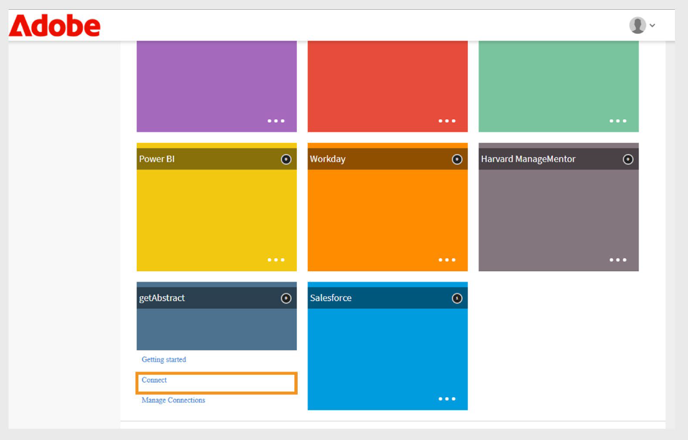

# Adobe Learning ManagerのgetAbstractコネクター

## 概要

**getAbstractコネクタ**&#x200B;は、[getAbstract.com](https://www.getabstract.com/)のエンタープライズユーザー向けに設計されています。 これにより、学習者はAdobe Learning Managerを通じてgetAbstractコンテンツを直接検出および使用できます。 また、管理者はコネクタを使用して、ユーザーエンゲージメントデータをインポートし、学習者の完了レコードを自動的に追跡することもできます。

Adobe Learning Managerは、リーダーシップとffソフトスキルに焦点を当てた、自主的な学習機会を継続して学習者に提供したいと考えています。 管理者は、すべてのコンテンツを内部で開発するのではなく、getAbstractコネクターを使用して、組織のgetAbstractアカウントをAdobe Learning Managerに接続します。

- getAbstractコンテンツをAdobe Learning Managerに自動的に読み込みます。
- コースと学習パスの学習者の使用量を追跡します。

この記事では、Adobe Learning ManagerでgetAbstractコネクターを設定および管理する手順の概要を説明します。

## 前提条件

- コネクタを構成する前に、アカウントで&#x200B;**移行**&#x200B;機能が有効になっていることを確認してください。
- getAbstractアカウント担当者から&#x200B;**クライアントID**&#x200B;と&#x200B;**クライアントシークレット**&#x200B;を取得します。 これらの資格情報は、コースメタデータとユーザー消費データを取得するために必要です。

## getAbstract コネクタを構成する

getAbstractコネクターを使用すると、Adobe Learning Manager管理者は、getAbstractの厳選された高品質なコンテンツを統合することで、学習体験を向上させることができます。

getAbstractコネクターを設定するには：

1. 統合管理者としてログインします。
2. ホームページで&#x200B;**getAbstract**&#x200B;を選択します。
3. **コネクタ**&#x200B;タイルの次のオプションから選択します：

   - **はじめに**:コネクタの概要。
   - **接続**：新しい接続を作成します。
   - **接続の管理**：既存の接続を表示または変更します。

   
   _getAbstractタイルに構成の3つのオプションが表示されます_

## 新しい接続を作成

新しい接続を作成するには、次の手順に従います。

1. **Connect**&#x200B;を選択します。

   
   _getAbstractタイルで[接続]を選択して、新しい接続を作成します_

2. **接続名**&#x200B;を入力してください。
3. **クライアントID**&#x200B;と&#x200B;**クライアントシークレット**&#x200B;を入力してください。

   
   _getAbstract接続ページで接続、クライアントID、およびクライアントシークレットを入力してください_

4. **[保存]**&#x200B;を選択して接続を作成します。

## getAbstractコネクタの管理

データをインポートする前に、コネクタを構成し、同期スケジュールを設定する必要があります。 設定後、コネクタは使用状況データを自動的に取得するため、学習者の進行状況を監視し、getAbstractコンテンツを学習プランとレポートに含めることができます。

### 接続を有効にする

接続を有効にするには：

1. **getAbstract**&#x200B;タイルで&#x200B;**接続の管理**&#x200B;を選択します。

   
   _接続を管理して、データインポートを構成およびスケジュールします_

2. 接続を選択します。
3. 左側のナビゲーションウィンドウで[**構成**]を選択します。
4. **接続を有効にする**&#x200B;を選択し、**保存**&#x200B;を選択します。

   
   _getAbstractからAdobe Learning Managerにデータをインポートするための接続を有効にします_

### 接続を編集する

接続を編集するには、次の手順を実行します。

1. **getAbstract**&#x200B;タイルで&#x200B;**接続の管理**&#x200B;を選択します。
2. 接続を選択します。
3. 左側のナビゲーションウィンドウで[**構成**]を選択します。
4. **[編集]**&#x200B;を選択して、**クライアントID**&#x200B;と&#x200B;**クライアントシークレット**&#x200B;を更新します。

   
   _クライアントIDとクライアントシークレットを含む資格情報を編集します_

5. 「**保存**」を選択します。

### 同期のスケジュール

同期をスケジュールするには、次の手順に従います。

1. **getAbstract**&#x200B;タイルで&#x200B;**接続の管理**&#x200B;を選択します。
2. 接続を選択します。
3. 左側のナビゲーションウィンドウで[**構成**]を選択します。
4. 「**同期のスケジュール**」セクションで「**スケジュールを有効にする**」を選択します。

   
   _getAbstractからAdobe Learning Managerへのデータインポートをスケジュールする_

5. UTCで開始日時を選択します。
6. 同期を繰り返す日数を入力します。
7. 「**保存**」を選択します。

同期設定が保存されます。 コネクタはスケジュールに従って実行され、getAbstractからAdobe Learning Managerにデータを読み込みます。

## オンデマンド同期の実行

**オンデマンド同期**&#x200B;オプションを使用すると、getAbstractからAdobe Learning Managerにデータを手動でインポートできます。 これは、次にスケジュールされた同期を待たずに、学習者のアクティビティデータをすぐに更新する場合に便利です。

オンデマンド・データ・インポートを実行する手順は、次のとおりです。

1. **getAbstract**&#x200B;タイルで&#x200B;**接続の管理**&#x200B;を選択します。
2. 接続を選択します。
3. 左ペインから&#x200B;**[オンデマンドの実行]**&#x200B;を選択します。
4. **開始日**&#x200B;を選択します。

   
   _getAbstractからAdobe Learning Managerに直ちにデータをインポートするためのオンデマンドリクエストを実行します_

5. 次のいずれかのオプションを選択します。

   - **実行中のAdobe Learning Managerへのアクセスを無効にする**：同期によってダウンタイムが発生する可能性がある場合に推奨します。
   - **実行中のAdobe Learning Managerへのアクセスを有効にする**:サービスを中断しないようにお勧めします。
6. 開始日から現在までのすべてのデータをインポートするには、**実行**&#x200B;を選択します。

### 実行履歴の表示

**実行ステータス**&#x200B;ページには、すべての同期実行が順に一覧表示されます。 実行にエラーがある場合、警告アイコンが表示されます。 エラーログを確認し、CSVファイルを修正して、必要に応じて最新の同期を再実行できます。

実行履歴を表示するには、次の手順に従います。

1. 左側のウィンドウで[**実行ステータス**]を選択します。
2. 次の列が表示されます。
   - **実行**
   - **開始日**
   - **期間**
   - **型** （スケジュール済みまたはオンデマンド）
   - **ステータス** （処理中または完了）

   
   _オンデマンドおよびスケジュールされたインポートの実行ステータスを表示する_

>[!NOTE]
>
>接続を削除して再作成しても、以前の実行の実行履歴は引き続き表示されます。 再実行できるのは、最新の同期のみです。

### 同期を成功させるための要件

同期が正しく動作することを確認するには、次の手順に従います。

- 指定された同期日に対して、有効なユーザーフィードファイルがgetAbstract FTPフォルダーに存在する必要があります。
- ファイルは命名規則に従う必要があります。
   - report_export_yyyy_MM_dd_HHmmss.xlsxまたは、
   - report_export_yyyy_MM_dd.xlsx

[getAbstractユーザーフィードのサンプルファイル](https://experienceleague.adobe.com/docs/learning-manager/assets/report-export-20170401175342.xlsx?lang=ja)をダウンロードして、形式を確認してください。
