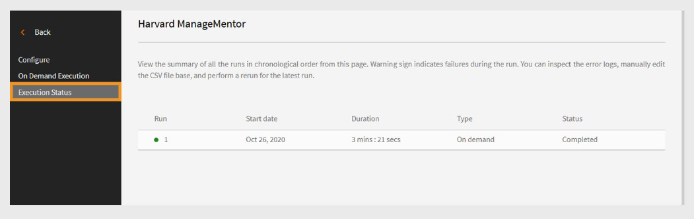

# Adobe Learning ManagerのHarvard ManageMentorコネクタ

## 概要

**Harvard ManageMentorコネクタ**&#x200B;は、Harvard ManageMentorを使用するエンタープライズユーザー向けに設計されています。 これにより、学習者はAdobe Learning Managerから直接Harvard ManageMentorコースを検索してアクセスできます。 接続すると、学習者の進行状況データが定期的に取得され、読み込まれたメタデータに基づいてAdobe Learning Managerでコースが作成されます。

この記事では、Adobe Learning ManagerでHarvard ManageMentorコネクタを設定および使用する方法について説明します。

この統合により、統合管理者は会社のHarvard ManageMentorアカウントをAdobe Learning Managerに連携させることで、新しいトレーニングコンテンツを一から作成しなくても、コースを自動で読み込み、学習者の進行状況を追跡できます。

## 前提条件

コネクタを構成する前に、アカウントで&#x200B;**移行**&#x200B;機能が有効になっていることを確認してください。

## コネクタの設定

Harvard ManageMentorコネクタを使用して、Harvard ManageMentorのコースをAdobe Learning Managerに取り込みます。 アカウントを接続すると、コースの詳細を読み込んで、学習者の進行状況を追跡できます。

コネクタを設定するには、次の手順に従います。

1. 統合管理者としてログインします。
2. ホームページで&#x200B;**Harvard ManageMentor**&#x200B;を選択します。
3. コネクタタイルの次のオプションから選択します。
   - **はじめに**
   - **接続**
   - **接続の管理**

   
   _Harvard ManageMentorタイルに構成の3つのオプションが表示されています_

## 新しい接続を作成

新しい接続を作成するには、次の手順に従います。

1. **Harvard ManageMentor**&#x200B;タイルで&#x200B;**Connect**&#x200B;を選択します。

   
   _[接続]を選択して、新しいHarvard ManageMentor接続を作成します_

2. **接続名**&#x200B;フィールドに接続を入力します。
3. **接続**&#x200B;を選択して接続を作成します。

   
   _[接続名]フィールドに名前を入力してください_

## 接続の管理

Harvard ManageMentorコネクタを設定すると、Adobe Learning Managerで接続を管理できます。 同期設定を変更し、手動またはスケジュールに従って同期を実行できます。

### 接続を有効にする

接続を有効にするには：

1. **Harvard ManageMentor**&#x200B;タイルで&#x200B;**接続の管理**&#x200B;を選択します。

   
   _接続を管理して、データインポートを構成およびスケジュールします_

2. 接続を選択します。
3. 左側のナビゲーションウィンドウから[**構成**]を選択します。
4. **接続を有効にする**&#x200B;を選択し、**保存**&#x200B;を選択します。

   
   _Harvard ManageMentorコネクタを有効にしてデータをインポートする_

### 同期のスケジュール

同期をスケジュールするには、次の手順に従います。

1. **Harvard ManageMentor**&#x200B;タイルで&#x200B;**接続の管理**&#x200B;を選択します。
2. 接続を選択します。
3. 左側のナビゲーションウィンドウから[**構成**]を選択します。
4. 「**同期のスケジュール**」セクションで「**スケジュールを有効にする**」を選択します。

   
   _Harvard ManageMentorからAdobe Learning Managerへのデータインポートをスケジュールする_

5. UTCで開始日時を選択します。
6. 同期を繰り返す日数を入力します。
7. 「**保存**」を選択します。

同期設定が保存されます。 コネクタはスケジュールどおりに実行され、Harvard ManageMentorからAdobe Learning Managerにデータを読み込みます。

## オンデマンド同期の実行

「**オンデマンド同期**」オプションを使用すると、Harvard ManageMentorから手動でAdobe Learning Managerにデータを読み込むことができます。 これは、次にスケジュールされた同期を待たずに、学習者のアクティビティデータをすぐに更新する場合に便利です。

オンデマンド・データ・インポートを実行する手順は、次のとおりです。

1. **Harvard ManageMentor**&#x200B;タイルで&#x200B;**接続の管理**&#x200B;を選択します。
2. 接続を選択します。
3. 左ペインから&#x200B;**[オンデマンドの実行]**&#x200B;を選択します。
4. **開始日**&#x200B;を選択します。

   
   _Harvard ManageMentorからAdobe Learning Managerに直ちにデータをインポートするためのオンデマンドのリクエストを実行します_

5. 次のいずれかのオプションを選択します。

   - **実行中のAdobe Learning Managerへのアクセスを無効にする**：同期によってダウンタイムが発生する可能性がある場合に推奨します。
   - **実行中のAdobe Learning Managerへのアクセスを有効にする**:サービスを中断しないようにお勧めします。
6. 開始日から現在までのすべてのデータをインポートするには、**実行**&#x200B;を選択します。

### 実行履歴の表示

実行ステータスページには、すべての同期実行が順に一覧表示されます。 実行にエラーがある場合、警告アイコンが表示されます。 必要に応じて、エラーログを確認し、CSVファイルを修正して、最新の同期を再実行できます。

実行履歴を表示するには、次の手順に従います。

1. 左側のウィンドウで[**実行ステータス**]を選択します。
2. 次の列が表示されます。
   - **実行**
   - **開始日**
   - **期間**
   - **型** （スケジュール済みまたはオンデマンド）
   - **ステータス** （処理中または完了）

   
   _オンデマンドおよびスケジュールされたインポートの実行ステータスを表示する_

>[!NOTE]
>
>接続を削除して再作成しても、以前の実行の実行履歴は引き続き表示されます。 再実行できるのは、最新の同期のみです。

### 同期の要件

Harvard ManageMentor FTPフォルダに以下のファイルが存在することを確認します。

- **hmm12_metadata.csv**&#x200B;このファイルにはコースメタデータが含まれています。 適切なファイル命名規則に従います。
- **client_hmm12_yyyyMMdd.csv**&#x200B;このファイルはユーザーフィードです。 日付形式はyyyyMMddと一致する必要があります。

**サンプルファイル**

- [Harvard ManageMentorコネクタのコースメタデータファイル](https://experienceleague.adobe.com/docs/learning-manager/assets/hmm12-metadata.csv?lang=ja)
- [Harvard ManageMentorコネクタのユーザーフィードファイル](https://experienceleague.adobe.com/docs/learning-manager/assets/client-hmm12-20170304.csv?lang=ja)
