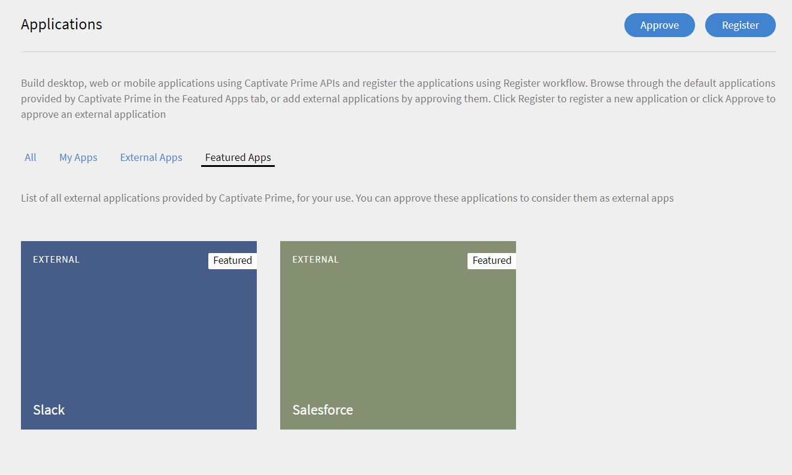

# Learning Manager とSlack

我々は **削除済み** **Slack** をLearning Managerのコネクターとして使用します。 Slackコネクタにアクセスできなくなります。

Slack ユーザーは、Slack App ディレクトリの Adobe Learning Manager アプリを Slack チームにインストールして、Slack で Learning Manager のコンテンツを検索できます。Primebotを操作して、Learning Managerで新しいコースを検索したり、推奨事項を表示したり、今後の締め切りに関する通知を受信したりできます。 Slack 内で登録を行って学習内容に直接ジャンプできます。

Learning ManagerアプリSlack版は、Learning ManagerのAzureインスタンスではサポートされていません。

## Learning ManagerAdobeアプリケーションのインストール {#installingadobecaptivateprimeapp}

学習者は、Slack アカウントで CP Prime アプリをインストールできます。 アプリをインストールするには、Slack アカウントで App ディレクトリを開き、Learning Manager を検索します。アプリをダウンロードしてインストールします。 アカウントでアプリが承認されない場合は、統合管理者に連絡して承認を受けてください。 既に承認されている場合は、サインインできます。

## 統合管理者としての学習者のログインを承認する方法 {#approvinglearnersigninasanintegrationadmin}

統合管理者として、SlackでPrimeアプリケーションを使用するための権限を学習者に付与するには、次の手順に従います。

1. 左ペインで&#x200B;**[!UICONTROL 「アプリケーション」]**&#x200B;を選択し&#x200B;**[!UICONTROL 「おすすめアプリ」]**&#x200B;タブをクリックします。

   

1. **[!UICONTROL Slack]**&#x200B;タイルをクリックし、Slack との統合ページを開きます。 クリック **[!UICONTROL 承認]** をクリックして、アプリケーションを承認します。

   

1. ページに戻る **[!UICONTROL アプリケーション]** ページです。 承認されると、Slackが「 **[!UICONTROL 外部アプリ]** タブをクリックします。
1. 学習者は、Slack を使用して Prime アカウントにサインインできるようになりました。

## Primebot の機能 {#primebotfunctionalities}

これで、Primebotを操作できるようになりました。 Primebot の機能を次に示します。

1 – コマンド

&#42;/prime&#42; AdobeのLearning Managerアカウントに関する1回限りのポイントクエリに使用できます。

使用できるサブコマンドは以下のとおりです：

/prime find `<query>`  – コース、資格認定などの検索

/prime recommend - 推奨事項の表示

/prime deadlines - 期限切れと期限切れ予定の表示

/prime enrollments - 登録の表示

/prime skills - スキルの表示

/prime notifications - 通知の表示

/prime catalogs - カタログの表示

/prime invite - [管理者のみ] 現在のチームのSlackユーザーにprimebotを試すよう招待する

/prime profile - プロファイルの表示

/prime logout - この Slack チームの Prime アカウントからのログアウト

/prime help - ヘルプメッセージの表示

2 – 推奨

次のようなフレーズを試してみてください。 `show my recommendations` AdobeのLearning Managerアカウントから、推奨コース、資格認定および学習プログラムのパーソナライズされたリストを取得できます。

3 – 検索

次のようなフレーズを試すことができます `search for machine learning` または `search for artificial intelligence`. 次のようなフレーズを使用して、学習目標の種類を指定できます `search for machine learning certifications`, `search for artificial intelligence courses` または `search for adobe photoshop job aids`. 次のようなフレーズを使用して、カタログ内で検索することもできます `search for machine learning in Lynda catalog`.

4 – 期限

似たフレーズを使用 `show my deadlines` AdobeのLearning Managerアカウントから、期限切れおよび期限切れ予定のリストを取得できます。 次のようなフレーズを使用して、期限切れや期限切れ予定を除外できます `show my overdue deadlines` または `show my upcoming deadlines`.
