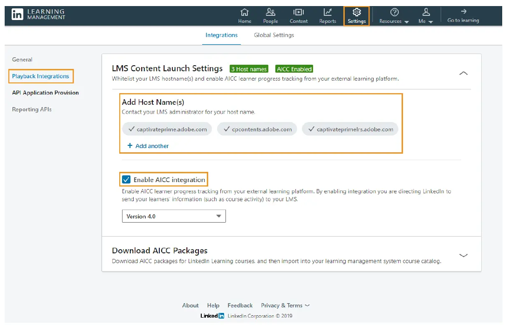
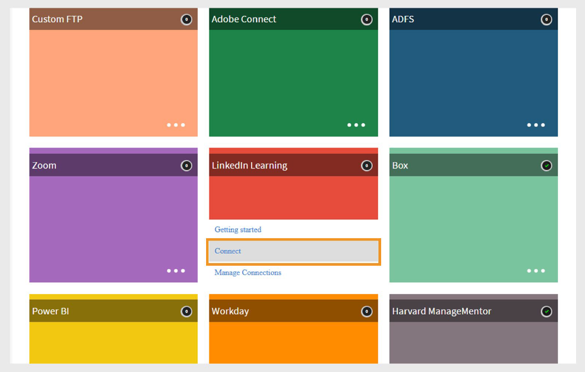
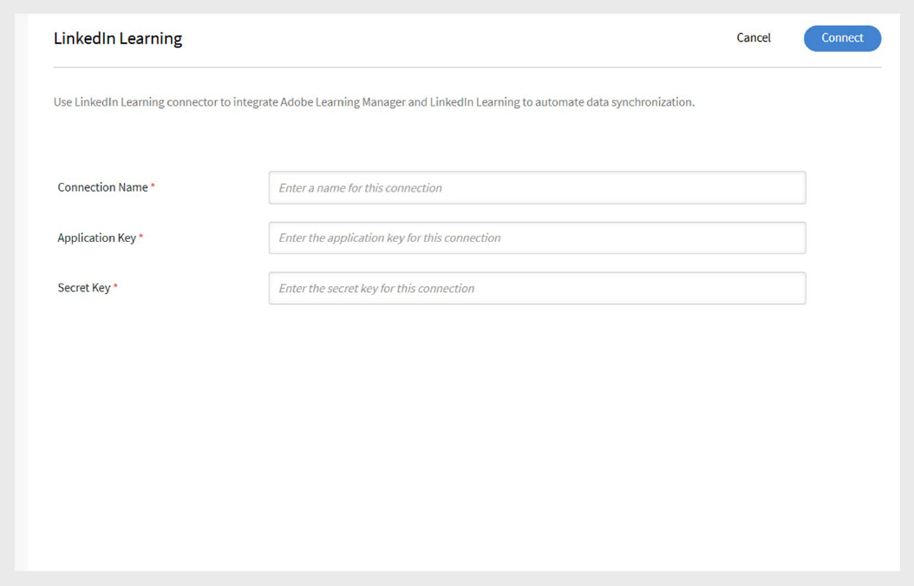
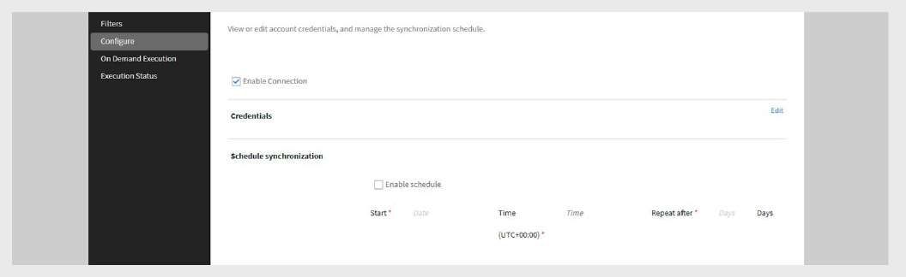
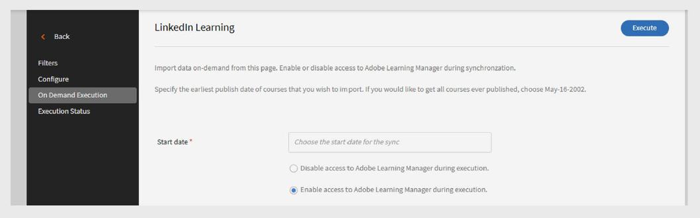
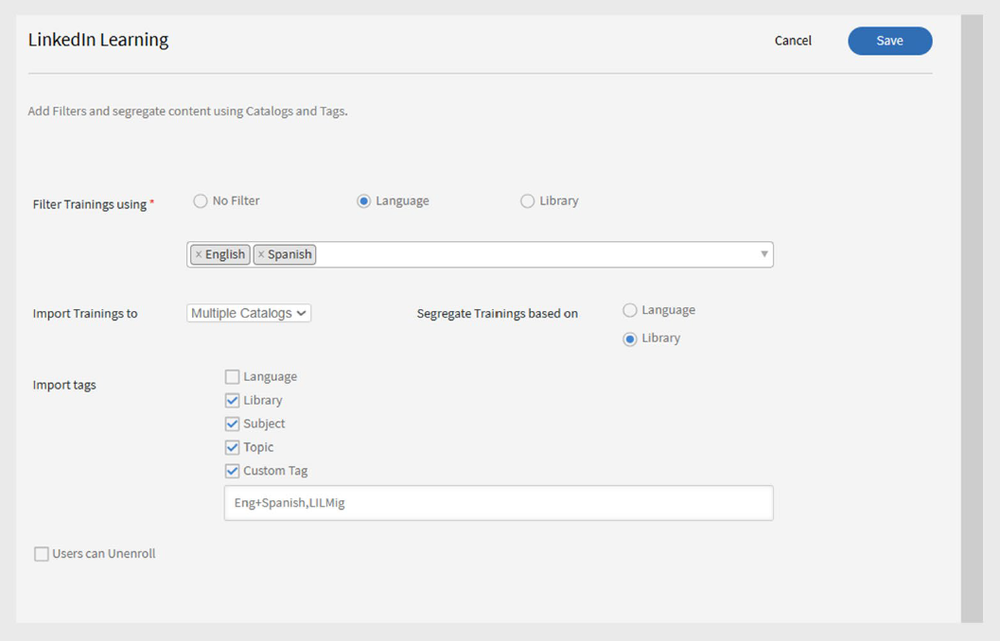

# Adobe Learning ManagerのLinkedIn学習コネクター

## 導入

linkedInラーニングコネクターを使用すると、LinkedInラーニングコンテンツをAdobe Learning Managerにシームレスに統合できます。 このコネクターにより、LinkedInラーニングコースをAdobe Learning Managerに自動的に取り込むことができるため、学習者はプラットフォーム内で直接LinkedInコースを検索、登録、完了できます。

設定すると、学習者のLinkedIn学習コンテンツの進行状況がAdobe Learning Managerで追跡されるため、管理者は進行状況と時間を確認できます。 自動コンテンツ同期のスケジュールを設定したり、オンデマンド読み込みを実行したり、言語、ライブラリ、カスタムタグによってシステムに導入されるコースをフィルタリングしたりできます。

>[!NOTE]
>
>linkedIn Learningからコースを読み込むと、Adobe Learning Managerによって各コースに一意のLO（学習目標）IDが生成されます。 linkedInに費やされた学習時間LinkedInプラットフォームからAdobe Learning Managerに学習コンテンツが報告されます。 linkedInプラットフォームがこのデータを送信しない場合、Adobe Learning Managerはそのデータを記録できず、所要時間は0と表示されます。

## linkedIn学習ポータルの設定

linkedIn学習ポータルを設定するには：

1. 管理者として&#x200B;**LinkedIn Learning LMS**&#x200B;にログインします。
2. 上部のナビゲーションパネルから&#x200B;**管理者**&#x200B;を選択します。
3. [**設定**]タブをクリックします。
4. 左側のナビゲーションから、**再生統合**&#x200B;を選択し、「**統合**」タブを選択します。
5. **LMSコンテンツ起動設定**&#x200B;を展開します。
6. 次のホスト名を追加します。

   - learningmanager.adobe.com
   - learningmanagerlrs.adobe.com
   - cpcontents.adobe.com
7. 「**AICC統合を有効にする**」を選択します。

   
   _「AICC統合を有効にする」を選択して、LinkedIn学習コネクターを設定します_

## Adobe Learning ManagerでLinkedInラーニングを連携

linkedIn学習コネクターを設定するには：

1. Adobe Learning Managerに統合管理者としてログインします。
2. **LinkedIn Learning**&#x200B;タイルにカーソルを合わせ、**Connect**&#x200B;を選択します。

   
   _「連携」を選択して、LinkedIn学習コネクターを設定します_

3. 接続設定ページで、次の手順を実行します。
   - **接続名**&#x200B;を入力してください。
   - **アプリケーションキー**&#x200B;と&#x200B;**秘密キー**&#x200B;を入力してください。

   
   _接続名、アプリケーションキー、および秘密鍵を入力して、LinkedIn学習コネクターを設定します_

   >[!NOTE]
   >
   >エンタープライズ版の管理者は、LinkedIn学習管理ポータルでアプリケーションを作成して、これらのキーを生成できます。

4. **[保存]**&#x200B;を選択して接続を追加します。

既存の連携を編集するには、**LinkedIn Learning**&#x200B;タイルの&#x200B;**連携の管理**&#x200B;を選択します。

>[!IMPORTANT]
>
>このコネクターを構成する前に、アカウントで&#x200B;**Migration**&#x200B;機能を有効にする必要があります。

## 接続と同期の管理

linkedIn学習コネクターを管理するには：

1. **接続の管理**&#x200B;を選択し、接続を選択します。
2. 左ペインから、**構成**&#x200B;を選択します。
3. **接続を有効にする**&#x200B;を選択します。

   
   _LinkedIn学習コネクターの設定ページで「接続を有効にする」を選択します_

4. **[編集]**&#x200B;を選択して資格情報を更新します。 **リセット**&#x200B;を使用して編集を元に戻します。
5. 同期を自動化するには、**スケジュールを有効にする**&#x200B;を選択します。
6. 開始日、時刻、頻度を設定します（例： 3日ごと）。
7. 「**保存**」を選択します。

### オンデマンド同期

オンデマンド同期を実行するには、次の手順に従います。

1. 左側のウィンドウで[**オンデマンド実行**]を選択します。
2. **開始日**&#x200B;を入力してください。
3. 次のいずれかのオプションを選択して、実行中にAdobe Learning Managerへの&#x200B;**アクセスを有効にする**&#x200B;か&#x200B;**アクセスを無効にする**&#x200B;してください：
   - **実行中のAdobe Learning Managerへのアクセスを有効にする**:ユーザーのダウンタイムは発生しません。
   - **実行中のAdobe Learning Managerへのアクセスを無効にする**：同期中はアプリケーションを使用できません。

   
   _[オンデマンド実行]を選択してインポートを実行する_

4. 「**実行**」を選択すると、LinkedIn Learningからユーザーフィードとデータをその日以降に読み込むことができます。

すべての同期実行を監視するには、次の手順を実行します。

左側のウィンドウで&#x200B;**実行ステータス**&#x200B;を選択すると、すべての同期の履歴、期間、種類（スケジュール済みまたはオンデマンド）、および現在のステータス（進行中、完了）が表示されます。

>[!NOTE]
>
>接続を削除して再作成すると、以前の実行が保持され、**実行ステータス**&#x200B;に表示されます。 再実行できるのは最新の同期のみです。

## LinkedIn Learning コンテンツのフィルタリング

コネクターを設定する際、読み込むLinkedIn学習コースをフィルタリングできます。

フィルターを設定するには：

1. 左側のウィンドウで[**フィルター**]を選択します。
2. **「次を使用してトレーニングをフィルタリング」**&#x200B;で必要なオプションを選択します。
   - **フィルターなし** – すべてのコースを読み込みます。
   - **言語** – 特定の言語でコースをフィルター処理します。
   - **ライブラリ** - LinkedInラーニングライブラリでコースをフィルタリングします。
3. **Language**&#x200B;によるフィルタリングの場合は、使用する言語を選択します。 例えば、**英語**&#x200B;と&#x200B;**スペイン語**&#x200B;などです。
4. **「トレーニングの読み込み先」**&#x200B;で、コースの読み込み先を選択します。
5. 読み込んだコースの整理方法を選択します。
6. **「トレーニングを次の条件に基づいて分離」**&#x200B;オプションで以下のいずれかのオプションを選択します。

   - **言語** – 言語別グループ化。
   - **ライブラリ** – ライブラリでグループ化します。
7. **「タグを読み込み」**&#x200B;で、読み込んだコースに適用するタグの種類を選択します。

   - **言語**
   - **ライブラリ**
   - **件名**
   - **トピック**
   - **カスタムタグ**
8. [**カスタムタグ**]フィールドに、割り当てるカスタムタグを入力します。 複数のタグはカンマで区切ります。

   
   _フィルターオプションを選択して、LinkedInラーニングコネクターからデータを読み込みます_

9. 学習者がこれらのコースから登録解除できるようにする場合は、[**ユーザーは登録解除できます**]を選択します。
10. 「**保存**」を選択して、フィルターを適用し、設定を読み込みます。
