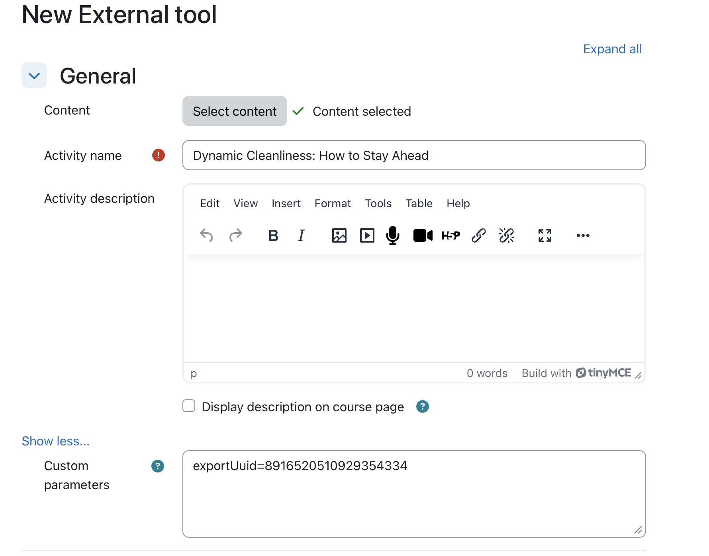

# Adobe Learning ManagerのLTIディープリンク

## 概要

**次のセクションは管理者用です**

LTIディープリンクは、インストラクターやコースの作成者が、Adobe Learning Manager(ALM)の特定のラーニングアイテムを参照、選択し、外部のLTIツールのコンシューマー/プラットフォーム（Canvas、Moodleなど）コースに直接埋め込むことができるLTIの優れた機能です。

LTIのディープリンクにより、Moodleなどの学習プラットフォームにコースを追加するプロセスが簡素化されます。 現在のワークフローでは、作成者はUUID書き出しパラメーターを含むコースのURLを手動でコピーし、コースリンクの設定時に必要な詳細をLMSに貼り付ける必要があります。 この手順は、コースごと、配置ごとに繰り返す必要があります。 例えば、同じコースを10か所の異なる場所に追加する場合、作成者はコピー&amp;ペーストのプロセスを10回繰り返す必要があります。 この手動のアプローチは、作業を増やし、設定エラーのリスクを高めます。

ディープリンクを使用すると、LMSで設定中のコースの選択を処理し、コンテンツの選択用に適切な起動URLを提供することで、このオーバーヘッドを取り除くことができます。

このモデルの場合：

* 外部LMSのインストラクターと作成者は、ALMを参照するための専用のディープリンク選択エクスペリエンスを起動します。
* ALMから外部LMSにディープリンクオブジェクトが返されるので、選択した項目をコースオーサリングワークフローの一部として埋め込むことができます。
* 学生は、プライマリLMSでディープリンクされたコンテンツを利用します。これにより、ALMでホストされているマテリアルがシームレスに起動します。

## 問題記述

ALMは現在LTI 1.3統合をサポートしていますが、完全なディープリンクのワークフローがなければ、インストラクターと作成者は次のような構造化された方法を使用できません。

* モーダルから専用のディープリンク選択エクスペリエンスを起動します。
* 特定のプラットフォームに公開する必要がある学習目標のみを参照します。
* プラットフォームから特定の学習目標を選択します。
* ALMはその学習オブジェクトをプラットフォームに返し、コースに直接埋め込めるようにします。

この機能がない場合：

* コンテンツの選択が手動であるか、断片化されている
* 明示的にフィルターされない限り、すべてのアカウントコンテンツが意図せずに公開される可能性があります
* ツールプロバイダーの統合は操作が困難
* コース作成者は、一貫した管理ワークフローを使用して外部LTIコンテンツを埋め込むことはできません

## 目的

この機能の主な目的は次のとおりです。

1. LTIツールプロバイダーでLTIディープリンクを有効にする
   * ALMからLTIツールプロバイダーへのディープリンクの起動をサポートします。
2. 管理されたコンテンツ選択ワークフローを提供する
   * ディープリンクの選択中に、承認され関連のあるカタログとコンテンツのみを表示します。
3. インストラクターと作成者が学習オブジェクトを選択できるようにする
   * 対象となる学習目標を選択するための、検索可能でフィルタリング可能なUIを提供する。
4. ALMに対して有効なディープリンク応答を返す
   * 必要なディープリンクペイロードを持つdeep_link_return_urlパラメーターを使用して、プラットフォームにユーザーをリダイレクトします。
5. プラットフォーム固有のカタログ公開のサポート
   * 管理者は、どのカタログをどのLTIプラットフォームに公開するかを制御できます。

## ペルソナとその役割

LTIのディープリンクワークフローには、次のペルソナが含まれます。

| ペルソナ | 概要 |
|---|---|
| インストラクターまたは作成者 | コースを作成または管理し、外部コンテンツを埋め込むためのディープリンク選択フローを起動します。 |
| 統合管理者 | LTIツールの登録と管理、およびディープリンク動作の有効化と設定を行います。 |
| 学習者 | ディープリンクワークフローで追加されたコンテンツを起動して使用します。 |

*各ペルソナは、構成から消費に至るまで、ディープリンクワークフローの個別の手順にマップされます。*

## データとパラメータの要件

ディープリンクは、ALMとLTIプラットフォームの間で次のパラメーターを交換します。

| パラメーター | 目的 |
|---|---|
| `deep_link_return_url` | 選択したディープリンクオブジェクトをALMに戻すために使用したエンドポイントを返す |
| `accepted_types` | プラットフォームで受け入れられるリソースタイプを定義します。 |
| `accept_multiple` | 複数のリソースの選択が許可されているかどうかを示します。ツールごとに設定可能 |
| `auto_create` | リンクされたリソースエントリをプラットフォームが自動作成できることを示します |

*これらのパラメーターは、公開されるコンテンツと、選択内容がALMに返される方法を制御します。*

## ディープリンクの作成

### 前提条件

1. 統合管理者としてログインする必要があります。
2. LTI統合を設定する際に、「ディープリンクをサポート」チェックボックスをオンにします。
3. ユーザーまたは作成者が選択内容にアクセスするためのURLをフィールドに入力します。
4. 「変更を保存」を選択します。

   同じ起動URLが再利用され、設定と使用が簡素化されます。

   動作は、LTIメッセージの種類によって決まります。 メッセージの種類が`content_consumption`の場合、ユーザーはコースプレーヤーにリダイレクトされます。 メッセージの種類が`content_selection`の場合、ユーザーはディープリンクフローを使用してルーティングされます。作成者は、コース固有のIDを手動でコピーすることなく、目的のコンテンツを直接選択できます。

   変更を保存したら、[**コンテンツの選択**]タブを選択します。 （「**コンテンツを選択**」タブは、このチェックボックスをオンにした後にのみアクティブになります）。

**次のセクションは作成者向けです。**

作成者は、**[コンテンツの選択]**&#x200B;ウィンドウからコンテンツを選択できます。 **コンテンツの選択**&#x200B;ウィンドウには、**カタログ**、**コース数**、**書き出し日**&#x200B;が表示されます。

1. 外部統合ツールに移動します。

   

2. **カタログ**&#x200B;を選択し、各コースの横にあるチェックボックスをオンにして、ディープリンクを設定するコースを選択します。 複数のコースを追加する場合は、確認を求めるポップアップが表示されます。

   

   

3. **[コンテンツの追加]**&#x200B;を選択します。 **コンテンツの追加**&#x200B;を選択すると、すべてのフィールドに入力されます。 「カスタムパラメーター」フィールドに書き出しUUIDを表示できます。 前のステップで複数のコースを選択した場合、確認メッセージが表示されます。

   

4. この時点で、**キャンセル**&#x200B;を選択して、**[コンテンツの選択]**&#x200B;タブに戻り、他のコースを選択したり、変更を加えたりすることができます。または、**保存してコースに戻る**&#x200B;を選択するか、**保存して表示する**&#x200B;を選択できます。 リンク先にディープリンクが追加されます。

   
