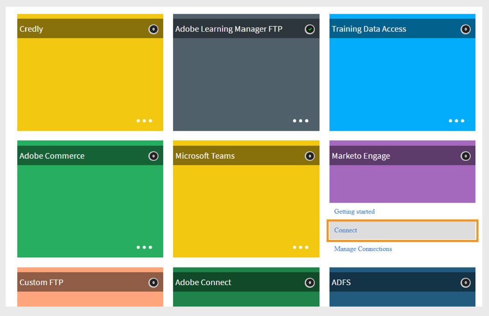
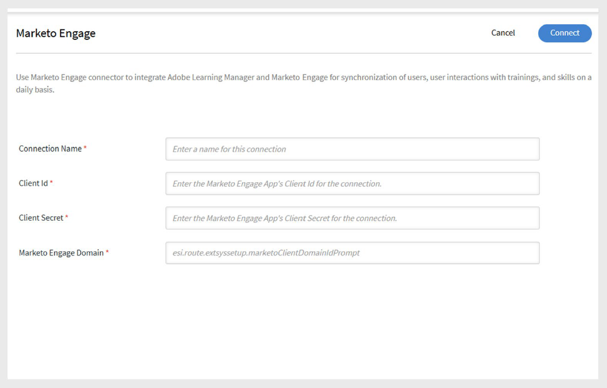

# Adobe Learning ManagerのMarketo Engageコネクター

## 概要

コネクターにより、Adobe Learning Managerはマーケティングの自動化プラットフォームであるMarketo Engageとシームレスに連携できます。 この統合は、マーケターがMarketoデータベースと同期することで、Adobe Learning Managerの学習者ビヘイビアーデータを追跡し、それに基づいて行動するのに役立ちます。

コネクターにより、2つのシステム間でシームレスにデータを同期し、マーケティング担当者が学習活動データを使用してターゲットを絞ったマーケティングキャンペーンを作成できます。

コネクターでは、次の操作が可能です。

- ユーザーがAdobe Learning Managerに追加されたときに、Marketo Engageデータベースにリードを自動的に追加または更新します。
- コースの登録、完了数、スキルの割り当て、スキルの完了数などのユーザーの学習行動を、Marketoのカスタムオブジェクトとして同期します。
- **スマートリスト**&#x200B;などの機能を活用し、このデータを使用してMarketoで動的なキャンペーンを作成します。

この統合は、マーケターがAdobe Learning Manager内の学習ジャーニーに基づいてオーディエンスをターゲットにするのに役立ちます。

## 主な機能

- Adobe Learning Managerユーザーに基づいて、リードの自動作成とアップデートを実行します。
- 学習活動（登録、修了、スキル達成）をカスタムオブジェクトとしてMarketoに書き出します。
- 必要に応じて書き出しをスケジュールまたはトリガーします。
- 統合レポートのサポート：
  - ユーザーレポート
  - 学習トランスクリプト
  - ユーザースキルレポート

## 前提条件

統合する前に、MarketoアカウントがAPIによるスキーマの作成をサポートしていることを確認してください。

接続を作成するには、次の詳細が必要です。

- **接続名**
- **クライアントID**
- **クライアントシークレット**
- **Marketo Engageドメイン**

>[!NOTE]
>
>クライアントIDとクライアントシークレットは、**LaunchPoint**&#x200B;の下のMarketo Engageアプリと、**Webサービス**&#x200B;セクションのドメインから取得できます。

## コネクターの設定

コネクターを設定するには、次の手順に従います。

1. Adobe Learning Managerに統合管理者としてログインします。
2. **Marketo Engage**&#x200B;タイルにカーソルを合わせ、**接続**&#x200B;を選択します。

   
   _[接続]を選択してコネクターを構成する_

3. 必要な資格情報を入力します

   - 接続名
   - クライアント ID
   - クライアントシークレット
   - Marketo Engage ドメイン

   
   _コネクターに必要な詳細情報を入力してください_

4. **接続**&#x200B;を選択して接続を確立します。

## イベントとキャンペーンのトリガー

次のイベントに基づいて、Marketo Engageへのデータ書き出しをトリガーできます。

- 新しいユーザーがAdobe Learning Managerに追加されます。
- ユーザーがコースに登録されている。
- ユーザーがコースを完了した。
- ユーザーがスキルに登録されている。
- ユーザーがスキルを完了する場合。

これらのイベントは、**オンデマンド**&#x200B;でエクスポートするか、**スケジュールに基づいて**&#x200B;エクスポートすることができます。

## 列のマッピング

Marketoでは、次の2つのデータベースが使用されます。

- **潜在顧客データベース** – ユーザーレコード（潜在顧客）
- **カスタムオブジェクトデータベース** – カスタムアクティビティおよびイベントレコード用

Adobe Learning ManagerとMarketoの間でフィールドをマッピングするには：

1. Adobe Learning Managerの&#x200B;**ユーザーレポート**&#x200B;のフィールドが1列に表示されます。
2. 対応する&#x200B;**Marketoフィールド**&#x200B;が横の列に一覧表示されます。
3. 適切なフィールドをLearning ManagerからMarketoにマッピングし、リードを作成および更新します。
4. マッピング後、書き出されたすべてのユーザーは、Marketo Lead Databaseにリードとして表示されます。

**Marketoカスタムオブジェクト**&#x200B;セクションの書き出されたレポートには、接頭辞「cp_」が付きます。

## サポートされている書き出しイベント

次のユーザー関連イベントをMarketo Engageインスタンスに書き出すことができます。

- 新しいユーザーが追加されました
- ユーザーメタデータが更新されました
- ユーザーアクティビティが更新されました
- トレーニング登録
- セルフ登録
- スキルの完了

これらの書き出しは、エンゲージメントを促進し、学習活動データを使用してアウトリーチキャンペーンをパーソナライズするのに役立ちます。
