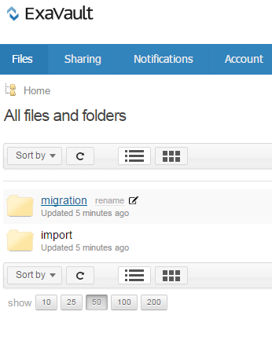
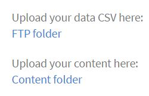

# 移行マニュアル

既存の LMS を Learning Manager LMS に移行する統合管理者向けの参照用マニュアル

<!-- ## Overview {#overview} -->

## 利用シナリオ {#usagescenario}

一般に、大企業は自社の LMS または他のベンダーから提供されるレガシー学習管理システムを使用します。LMSは、エンタープライズ版トレーニングコンテンツとトレーニングデータで構成されます。 企業としてLearning Managerを購入した場合、既存のLMSコンテンツとデータをLearning Managerに移動すると、直感的に使用できる最新のLMSのメリットを活用でき、組織のレガシーデータが失われることはありません。

Learning Manager では、組織の統合管理者が移行タスクを設定および実行できるように、必要なツールおよび仕様が用意されています。

現時点で Learning Manager の移行機能は、組織の管理者がアドビのサポートチームに問い合わせることでアクセスできます。アカウントの移行機能を有効にするには、Adobe Learning Manager のサポートチームまでお問い合わせください。

## 移行プロセス {#apidescription}

移行の前提条件、移行プロセスで必要な主な手順、移行スプリント、仕様、データおよびコンテンツの移行手順について、このセクションで次に説明します。

### 前提条件 {#prerequisites}

Learning Manager チームは、移行プロセスを開始する前に、組織の統合管理者が以下のタスクを実行することを想定しています。

* 統合管理者は、既存の LMS からデータとコンテンツを抽出し、そのデータを Learning Manager で定義されているファイル形式に変換します。
* Learning Manager は、移行プロセスの一部としてユーザーの読み込みをサポートしていないため、組織はコネクターを使用してユーザーを読み込む必要があります。これらのコネクタが移行プロセス前に設定されている必要があります。詳しくは、「 [Learning Managerコネクターのヘルプ](connectors.md) 」を参照してください。

Learning Manager では、管理者が Learning Manager の実稼働環境にデータやコンテンツを移行する前に、体験版アカウントで移行プロセスをお試しいただくことをお勧めします。

### 移行プロセスの主要な手順 {#keystepsofmigrationprocess}

既存のLMSからLearning Managerにコンテンツとデータを移行する際の主要な手順は、次のとおりです。

1. 統合管理者またはパートナーは、移行が必要な既存の LMS データおよびコンテンツを評価します。
1. 統合管理者は、データとコンテンツを取り込むために Learning Manager で利用できるツールと仕様を評価します。
1. 古い LMS が提供する機能に基づいて、統合管理者はコードを作成するか、手作業によって、古い LMS からデータとコンテンツを書き出します。
1. トレーニングのデータとコンテンツが利用可能になったら、統合管理者は Learning Manager の移行の仕様に一致するようにデータとコンテンツをマッピングして分析します。
1. 統合管理者は、Learning Managerのツールを使用して、次の順序で移行します。

   1. 学習者を Learning Manager に転送します。
   1. トレーニングコンテンツをLearning Managerに転送し、
   1. 最後に、トレーニングデータを Learning Manager に転送します。

組織は、Learning Manager LMS とレガシーコンテンツを併用できるようになりました。

### 移行オブジェクトの範囲 {#scopeofmigrationobjects}

コンテンツを移行できるのは、次の学習目標に対してのみです。

* モジュール
* バッジ
* コース
* モジュールバージョン
* コースのインスタンス
* コースモジュール
* スキル
* スキルレベル
* スキルコース
* 資格認定
* 資格認定コース
* 資格認定の確定
* 学習プログラム
* 学習プログラムコース
* 学習プログラムのインスタンス
* 学習プログラムのコースインスタンス
* 作業計画書
* 作業計画書のバージョン
* 作業計画書コース
* 作業計画書のスキル
* 登録
* 資格認定の登録
* 学習プログラムの登録
* 作業計画書の登録
* ユーザーコースのグレード

### 移行の主な概念 {#keyconceptsofmigration}

クイックリファレンスとして、Learning Managerの移行プロセスの主要な概念について以下に簡単に説明します。

**移行プロジェクト**

Learning Manager では、移行プロジェクトは 1 つ以上のスプリントで構成されています。アカウントに複数の移行プロジェクトを含めることもできます。Learning Manager での移行プロセスは、移行プロジェクトの作成から開始します。

**スプリント**

Learning Manager の移行プロセスで、スプリントは既存の LMS から移行対象として選択した一連の移行項目を意味します。移行項目は、コースモジュール、学習者レコード、または一連のコースです。スプリントに複数の学習データ項目を含めることができます。各スプリントで移行ジョブを実行できます。

**スプリントの実行**

スプリントの実行は、スプリント移行ジョブを開始するプロセスです。スプリントの実行はいつでも停止できます。

**スプリントの再実行**

移行スプリントは、完了後にいつでも再実行できます。スプリントの再実行は、データをスプリント項目に追加し、それをアプリケーションに再度移行するか、または CSV 内のエラーを修正する場合に発生します。

**CSV の仕様**

Learning Manager では、[標準の CSV 仕様](migration-manual.md#main-pars_header_140933605)を利用できます。移行プロセスを開始する前に、これらの CSV 仕様を確認することが最適な方法です。組織の統合管理者は、既存のデータ形式を分析し、そのデータ形式をLearning Managerが提供するCSVテンプレート項目と一致するようにマッピングできます。

**移行プロジェクトのタグ**

アドビは、タグとしていくつかのキーワードを使用して、Learning Manager アプリケーション内で移行プロジェクトを簡単に識別することをお勧めします。このようなタグを使用すると、Learning Manager アプリケーションの内部でプロジェクトをいつでも識別できます。

**コンテンツレスモジュール**

Learning Manager では、コンテンツがなくてもモジュールをアップロードできます。アドビではこのようなモジュールを、Learning Manager のコンテンツレスモジュールと見なしています。コンテンツを必要とせずに既存の LMS から一部のレガシーデータを移行するシナリオでは、URL を参照せずに module_version.csv ファイルをアップロードできます。

## CSV の仕様とサンプル CSV {#csv}

既存の LMS 移行データをマッピングするために使用できる標準の CSV 仕様は以下のとおりです。csv-specifications および sample-csvs をクリックして、zip ファイルをダウンロードします。ダウンロードしたcsv-specifications.zipには、7つのExcelシートファイルが含まれています。 これらの Excel シートファイルは、.csv ファイルに入力する方法の説明が付いた仕様です。対応する .csv ファイルには、これらの .xlsx ファイルで説明されているように、各フィールドのデータを所定の形式で指定する必要があります。

<table border="1" cellspacing="0" cellpadding="0" width="100%">
 <tbody>
  <tr>
   <th>
    
<b>Sl.no</b>
</th>
   <th>
    
<b>ファイル名</b>
</th>
   <th>
    
<b>コンテンツの説明</b>
</th>
   <th>
    
メモ
</th>
  </tr>
  <tr>
   <td>
    
1
</td>
   <td>
    
module.xlsx
</td>
   <td>
    
module.csv のメタデータ
</td>
   <td> </td>
  </tr>
  <tr>
   <td>
    
2
</td>
   <td>
    
badge.xlsx
</td>
   <td>
    
バッジ.xlsxのメタデータ
</td>
   <td> </td>
  </tr>
  <tr>
   <td>
    
3
</td>
   <td>
    
course.xlsx
</td>
   <td>
    
course.csv のメタデータ
</td>
   <td>
    
移行後は複数の作成者名がアプリケーションで正確に表示されない場合があるため、特定のコースごとに作成者名を 1 つ指定するようにします。 
</td>
  </tr>
  <tr>
   <td>
    
4
</td>
   <td>
    
module_version.xlsx 
</td>
   <td>
    
module_version.csvのメタデータ
</td>
   <td>
    
コンテンツをアップロードした Box アカウントフォルダーの URL パスを指定してください。 
</td>
  </tr>
  <tr>
   <td>
    
5
</td>
   <td>
    
course_instance.xlsx
</td>
   <td>
    
course_instance.csvのメタデータ 
</td>
   <td> </td>
  </tr>
  <tr>
   <td>
    
6
</td>
   <td>
    
session.xlsx
</td>
   <td>
    
session.csv のメタデータ
</td>
   <td>
    
session.csv のすべてのエントリが少なくとも 1 つの教室／仮想教室モジュールに関連付けられていることを確認します
</td>
  </tr>
  <tr>
   <td>
    
7
</td>
   <td>
    
course_module.xlsx
</td>
   <td>
    
course_module.csvのメタデータ
</td>
   <td> </td>
  </tr>
  <tr>
   <td>
    
8
</td>
   <td>
    
skill.xlsx
</td>
   <td>
    
skill.csv のメタデータ
</td>
   <td> </td>
  </tr>
  <tr>
   <td>
    
9
</td>
   <td>
    
skill_level.xlsx
</td>
   <td>
    
skill_level.csvのメタデータ
</td>
   <td> </td>
  </tr>
  <tr>
   <td>
    
10
</td>
   <td>
    
skill_course.xlsx
</td>
   <td>
    
skill_course.csvのメタデータ
</td>
   <td> </td>
  </tr>
  <tr>
   <td>
    
11
</td>
   <td>
    
certification.xlsx
</td>
   <td>
    
Certification.csvのメタデータ
</td>
   <td> </td>
  </tr>
  <tr>
   <td>
    
12
</td>
   <td>
    
certification_course.xlsx
</td>
   <td>
    
certification_course.csvのメタデータ
</td>
   <td> </td>
  </tr>
  <tr>
   <td>
    
13
</td>
   <td>
    
certification_commit.xlsx
</td>
   <td>
    
certification_commit.csvのメタデータ
</td>
   <td> </td>
  </tr>
  <tr>
   <td>
    
14
</td>
   <td>
    
learning_program.xlsx
</td>
   <td>
    
learning_program.csvのメタデータ
</td>
   <td> </td>
  </tr>
  <tr>
   <td>
    
15
</td>
   <td>
    
learning_program_course.xls 
</td>
   <td>
    
learning_program_course.csvのメタデータ 
</td>
   <td> </td>
  </tr>
  <tr>
   <td>
    
16
</td>
   <td>
    
learning_program_instance.xlsx 
</td>
   <td>
    
learning_program_instance.csv のメタデータ
</td>
   <td> </td>
  </tr>
  <tr>
   <td>
    
17
</td>
   <td>
    
learning_program_instance_course_instance.xlsx 
</td>
   <td>
    
learning_program_instance_course_instance.csv のメタデータ
</td>
   <td> </td>
  </tr>
  <tr>
   <td>
    
18
</td>
   <td>
    
job_aid.xlsx
</td>
   <td>
    
job_aid.csv のメタデータ
</td>
   <td>
    
移行したすべての job_aid には、1 つ以上の job_aid バージョンが必要です。
</td>
  </tr>
  <tr>
   <td>
    
19
</td>
   <td>
    
Job_aid_version.xlsx
</td>
   <td>
    
job_aid_version.csvのメタデータ
</td>
   <td> </td>
  </tr>
  <tr>
   <td>
    
20
</td>
   <td>
    
job_aid_course.xlsx
</td>
   <td>
    
job_aid_course.csvのメタデータ
</td>
   <td> </td>
  </tr>
  <tr>
   <td>
    
21
</td>
   <td>
    
job_aid_skills.xlsx
</td>
   <td>
    
job_aid_skills.csv のメタデータ
</td>
   <td> </td>
  </tr>
  <tr>
   <td>
    
22
</td>
   <td>
    
enrollments.xlsx
</td>
   <td>
    
登録.csvのメタデータ
</td>
   <td> </td>
  </tr>
  <tr>
   <td>
    
23
</td>
   <td>
    
certification_enrollement.xlsx
</td>
   <td>
    
certification_enrollement.csvのメタデータ
</td>
   <td> </td>
  </tr>
  <tr>
   <td>
    
24
</td>
   <td>
    
learning_program_enrollment.xlsx
</td>
   <td>
    
learning_program_enrollment.csv のメタデータ  
</td>
   <td> </td>
  </tr>
  <tr>
   <td>
    
25
</td>
   <td>
    
job_aid_enrollment.xlsx
</td>
   <td>
    
job_aid_enrollment.csvのメタデータ
</td>
   <td> </td>
  </tr>
  <tr>
   <td>
    
26
</td>
   <td>
    
user_course_grade.xlsx
</td>
   <td>
    
 
      user_course_grade.csv のメタデータ
</td>
   <td>
    
必要に応じて、.csv ファイルに必要な学習者レコードデータを設定します。この情報がない場合、.csvファイルを移行対象として処理しても、Learning Managerアプリケーションでデータが反映されない可能性があります。 sample-csvs.zipファイルには、上記と同じ命名規則を持つ7つの.csvファイルが含まれています。
</td>
  </tr>
 </tbody>
</table>

Learning Manager では、UTF 8 および 32 ビット形式の日時の値のみをサポートしています。範囲外の日付を2038-07-17T08としてCSVファイルに日付を記載すると、移行中にエラーが発生することがあります:53:21.000Zまたは1980-04-17T08:13:25.322Z。

* [sample-csvs.zip](assets/sample-csvs.zip)
* [csv_specifications.zip](assets/csv-specifications.zip)

CSV ファイルを読み込むときに、以下の依存関係を認識する必要があります。

* module_version.csv は module.csv に依存している
* course_instance.csv は course.csv に依存している
* course_module.csv は course.csv、module.csv および module_version.csv に依存している
* course_instance.csv は course.csv に依存している
* session.csv は course.csv および module.csv に依存している
* enrollment.csv は course.csv に依存している
* user_course_grade.csv は course.csv および module.csv に依存している
* skill_course.csv は course.csv に依存している
* skill_level.csv は skill.csv に依存している
* learning_program_instance.csv は learning_program および learning_program_course.csv に依存している
* learning_program_course.csv は learning_program.csv に依存している
* learning_program_enrollment.csv は learning_program および learning_program_instance.csv に依存している
* learning_program_instance_course_instance.csvはlearning_program.csv、learning_program_instance.csvおよびcourse_instance.csvに依存している
* certification_course.csvはcertification.csvおよびcourse.csvに依存している
* certification_commit.csvはcertification.csvおよびcertification_course.csvに依存している
* certification_enrollment.csv は certification.csv、certification_course.csv および certification_enrollment.csv に依存している

## 移行手順 {#migrationprocedure}

移行手順を開始する前に、次の点に注意する必要があります。

* 1 つのアカウントでアクティブにできる移行プロジェクトは常に 1 つのみです。プロジェクト内では、アクティブにできるスプリントは常に 1 つのみです。
* 既に移行プロセスに存在する実行を元に戻すことはできません。ただし、Learning Manager の各機能にある既存の削除オプションを使用すると、データやコンテンツの移行を元に戻すことができます。
* 移行プロジェクトが開始されるとすぐに、移行は「移行中」の状態になります。 移行中は、統合管理者以外の役割のユーザーは Learning Manager にログインできません。

### FTP アカウントと Box アカウントの作成 {#creatingftpandboxaccounts}

移行プロジェクトを計画することは非常に重要です。プロジェクトを複数のスプリントに分割し、各スプリントで何を移行するのかを明確に特定することをお勧めします。プロジェクトの終了時に総合的な検証を 1 回行う代わりに、各スプリントの後に検証を行い、そのスプリントに移行されたデータを確認することをお勧めします。移行プロジェクトの一部としてスプリントを起動する前に、データとコンテンツの CSV ファイルをそれぞれ FTP サーバーと Box サーバーにアップロードする必要があります。カスタムFTPおよびBox用のアカウントがない場合は、それらを作成できます。

<!--**Create FTP account**-->

<!--Click **[!UICONTROL Request for CSV FTP folder]**. A pop-up dialog appears prompting you to enter your e-mail id. Go through online instructions and create an FTP account. As soon as you create your account, you can view your migration project and sprint project folders in FTP. 

A sample snapshot of project files and folder of FTP is shown below for your reference. -->

<!---->

**Box アカウントの作成**

次に示すとおり、コンテンツアップロードフォルダーの作成は、FTP フォルダーの作成と同じ手順で行います。左ペインにある「移行」をクリックし、表示されるページの下部にある「コンテンツアップロードフォルダーを要求」をクリックします。

Box から共有フォルダーへのリンクを含む電子メールが届きます。Box アカウントがない場合は、「サインアップ」をクリックし、アカウントを作成します。ログインの指示が、統合管理者の電子メール ID に送信されます。

**FTP フォルダーまたは Box フォルダーへのデータ（.csv ファイル）のアップロード**

移行プロジェクトを作成する前に FTP または Box アカウントを作成する必要があります。この段階で、Learning Managerアプリケーションで移行プロジェクトとスプリントを作成できます。  詳しくは、「 **データとコンテンツの移行手順** このページの「 」セクションで、移行プロジェクトを作成します。

FTP アカウントまたは Box アカウントで、プロジェクトフォルダー名をクリックし、スプリント名をクリックします。スプリントのフォルダー内に、移行対象の .csv データファイルをアップロードできます。アップロードするには、FTPサーバーまたはBoxサーバーの上部にある「ファイルをアップロード」ボタンをクリックし、.csvファイルをドロップします。 FTPにアップロードした後のサンプルスナップショットは、参考までに以下のとおりです。

<!---->

Learning Manager移行プロジェクトに戻るには、次をクリックします。 **[!UICONTROL 更新]** 移行スプリントに一覧表示されているすべての.csvデータタイプを表示します。

**コンテンツフォルダーへのトレーニングコンテンツのアップロード**

既存の LMS のトレーニングコンテンツを Box アカウントにアップロードします。移行プロジェクトとスプリントを既に作成している場合は、Box アカウントに移行プロジェクトとスプリントの名前が表示されます。同じパスにコンテンツをアップロードできます。詳しくは、「 **データとコンテンツの移行手順** このページの「 」セクションで、移行プロジェクトを作成します。

コンテンツファイルをドラッグ＆ドロップする、または「**[!UICONTROL アップロード]**」をクリックして、デスクトップからファイルを選択することができます。コンテンツのファイルサイズが大きい場合は、ファイルのアップロードに時間がかかることがあります。ファイルのサイズに応じて、Boxアカウントへのファイルのアップロードにかかる時間は異なります。

参考までに、コンテンツをアップロードした後のBoxアカウントのサンプルスナップショットを以下に示します。

*Boxアカウントのファイル*

ファイルが Box アカウントにアップロードされた後、module_version.csv ファイルにこの Box コンテンツファイルの相対パスが記載されていることを確認します。これはモジュールコンテンツのパスを示すための必須の手順です。

FTP サーバーと Box サーバーにログインしてコンテンツをアップロードすると、以下のスナップショットのように Learning Manager で CSV の場所が表示されます。

*BoxアカウントでのCSVの場所*

## データとコンテンツの移行手順 {#dataandcontentmigrationprocedure}

企業のLMSデータとコンテンツをLearning Managerに移行する手順は、次のとおりです。

移行を開始する前に移行プロセスの前提条件を実行してください。詳しくは、「 [CSVの仕様とサンプルCSV](migration-manual.md#main-pars_header_140933605) このページの「 」セクションで、データおよびコンテンツを移行するためのCSVを準備します。

1. 統合管理者としてLearning Managerアプリケーションにログインして、 **[!UICONTROL 移行]** をクリックします。

   移行プロジェクトのホームページが表示されます。組織が既に移行プロジェクトを作成している場合は、このページにすべての移行プロジェクトのリストを表示できます。

1. ページの右上隅にある「**[!UICONTROL 新規]**」をクリックして、移行プロジェクトを作成します。また、ページ上の「**[!UICONTROL 移行プロジェクトを作成]**」リンクをクリックして、移行プロジェクトを作成することもできます。移行プロジェクトの作成ページが表示されます。

   FTPフォルダーをまだ作成していない場合は、アカウントにFTPフォルダーを作成するように求められます。 これは移行プロジェクトの作成を開始する前の必須の手順です。

   
   *FTPフォルダーの作成*

   移行プロジェクトのプロジェクト名、プロジェクトタグ、コースカタログおよび説明を指定します。**[!UICONTROL 「作成」]**&#x200B;をクリックします。

   移行データ項目は、この移行プロジェクトタグを使用して識別されます。特定のコースカタログが存在しない場合は、ドロップダウンからデフォルトのカタログを選択します。移行プロジェクトを使用して移行するすべてのコースは、ここで選択するカタログに含まれます。カタログを選択しない場合、移行したすべてのコースはデフォルトのカタログに含まれます。

1. スプリントの構成ページのスナップショットについては、以下を参照してください。移行プロジェクトの一部としてスプリントを作成する必要があります。スプリントの名前を選択し、スプリントの簡単な説明を入力します。このスプリントの一部としてコンテンツを移行する場合は、「はい」を選択することができます。クリック **[!UICONTROL Next]**.

   
   *スプリントの移行*

   タイトル付きのチェックボックスを選択します **前回の実行後に追加または変更されたユーザー**&#x200B;をクリックして、Learning Managerアプリケーションとユーザーリストを同期します。 コンテンツとデータを Learning Manager アプリケーションに移行する場合、この操作は不要な場合があります。ただし、前回のスプリントを移行してから最新のスプリントを移行するまでに長時間経過している場合は、ユーザーリストを同期することをお勧めします。この手順により、Learning ManagerデータベースをLMSユーザーと同期させることができます。

   enrollment.csv と user_course_grade.csv を移行する場合は、この同期手順を実行することをお勧めします。この手順により、Learning Manager データベースを移行データベースと同期させることができます。また、レコードがスプリントに移行されるすべてのユーザーが移行データベース上で利用可能になります。

1. アップロードされたデータとコンテンツを使用して、スプリントの移行を開始できます。クリック **[!UICONTROL 更新]** リンクスプリントの実行を開始する前に、Learning ManagerアプリケーションでFTPフォルダーとコンテンツフォルダーを同期します。

   
   *スプリントの移行を開始*

   クリック **[!UICONTROL 開始]** をクリックします。 次をクリックできます **[!UICONTROL 停止]** スプリントの移行プロセス中の任意の時点で、スプリントの移行を中止します。

   移行ステータスは、各スプリントデータ項目とコンテンツに表示されます。移行スプリントを実行する際は、成功した項目と失敗した項目の数を確認します。

   モジュールコンテンツをアップロードする場合は、コンテンツフォルダーのパスが module_version.csv に指定されていることを確認してください。この手順を実行しない場合は、移行中にエラーが発生する可能性があります。例えば、動画などのセルフペースのモジュールコンテンツをアップロードする場合は、module_version.csv で Box URL 相対パスを指定する必要があります。アクティビティモジュールコンテンツには、URL 名を指定できます。

   進捗ダイアログのサンプルスナップショットについては、以下を参照してください。スナップショットに表示されているように、移行データ項目ごとに処理されたレコードの数を表示できます。成功および失敗した項目のステータスも表示できます。失敗した項目に対して「エラーレコードをダウンロード」をクリックすると、エラーログをダウンロードして表示できます。CSV の問題を修正し、FTP でもう一度アップロードすることができます。

   
   *スプリントの進行状況を表示*

   移行プロジェクトのすべてのスプリントのリストを表示する場合は、左ペイン上の「スプリントリスト」をクリックします。以下のサンプルスナップショットに示すように、すべてのスプリントのリスト、各スプリントの実行数、開始日、期間、および完了ステータスを表示できます。

   
   *スプリントのリストの表示*

1. 更新された最新の CSV ファイルをアップロードした後で、ページの右上隅にある「再実行」をクリックできます。変更がない項目が無視され、すべてのデータ項目が再度処理されます。スプリント内のデータ項目の移行が正常に終了すると、ページ上部にあるボタンをクリックして、スプリントの移行を完了とマークできます。さらに多くのデータ項目を使用して、後で新しいスプリントを開始できます。スプリントが完了とマークされると、スプリントを再実行することはできません。同様に、移行プロジェクトでは、スプリントの数の制限はありません。すべてのスプリントの移行ステータスに問題がなければ、をクリックして、移行プロジェクトを「完了」とマークできます **プロジェクトを完了としてマーク** スプリントリストページのリンク。

   移行プロジェクトを完了とマークする前に、プロジェクトのすべてのスプリントが完了していることを確認する必要があります。移行プロジェクトを完了とマークすると、プロジェクトに戻ってスプリントを作成したり、プロジェクトに変更を加えたりすることはできません。別の移行プロジェクトを作成して、それにスプリントを追加する必要があります。

## 移行の検証 {#registration}

組織のレガシー LMS から学習データとコンテンツを移行した後は、多様な学習目標機能を使用して、読み込んだデータとコンテンツを検証できます。例えば、Learning Manager アプリケーションに管理者としてログインし、読み込んだモジュール、コースデータおよびコンテンツの利用状況を検証できます。

## 移行の導入 {#retrofittinginmigration}

この統合機能により、従来の学習管理システムから Learning Manager で作成されたアクティブコースに、学習目標の履歴データを移行できるようになりました。

既存の LMS 移行データをマッピングするために使用できる標準の CSV 仕様は以下のとおりです。csv-specifications および sample-csvs をクリックして、zip ファイルをダウンロードします。ダウンロードした csv-specification.zip には、4 つの Excel シートファイルが含まれています。これらの Excel シートファイルは、.csv ファイルに入力する方法の説明が付いた仕様です。対応する .csv ファイルには、これらの .xlsx ファイルで説明されているように、各フィールドのデータを所定の形式で指定する必要があります。

1 - enrollment.xlsx - retrofit_enrollment.csv ファイルに必要なメタデータの説明が含まれています。

2 - certification_enrollment.xlsx - retrofit_certification_enrollment.csv ファイルに必要なメタデータの説明が含まれています。

3 - learning_program_enrollment.xlsx - retrofit_learning_program_enrollment.csv ファイルに必要なメタデータの説明が含まれています。

4-user_course_grades.xlsx - retrofit_user_course_grades.csvファイルに必要なメタデータの説明が含まれます。
[csv-specifications.zip](assets/csv-specifications.zip)

>[!NOTE]
>
>UUID（ユニバーサル一意のID）は、移行csvの列にも表示されます。

## 移行の問題に関するトラブルシューティング {#troubleshootingmigrationissues}

[こちらをクリック](../../kb/troubleshooting-migration.md)すると、データとコンテンツを既存の LMS から Learning Manager アプリケーションに移行する際、統合管理者が直面する問題に対する回避策や解決策を参照できます。

## ユーザー管理のヒント {#usermanagement}

このトピックでは、Learning Manager でユーザーが処理および管理される方法を理解するためのヒントをいくつか紹介します。これらの概念は、CSV の読み込みや、コネクターおよび Learning Manager の移行機能を使用する場合、ユーザーをより適切に管理するのに役立ちます。

## Learning Manager ID {#captivateprimeids}

Learning Manager では、ユーザーが 2 種類の一意の ID を利用できます。

* 電子メールID
* UUID（汎用一意識別子）

Learning Manager は UUID をサポートすることで、組織がユーザーアカウントを柔軟に制御できるようにします。管理者は、アカウントにユーザーのUUIDがある場合、そのアカウントのユーザーの電子メールIDを変更できます。

**組織での UUID の活用シナリオ**

従業員AがLearning Managerという名前の会社に契約社員として入社するシナリオを考えてみます。 契約期間中、Learning Managerの会社は会社の電子メールIDをA@example.comとして提供せず、従業員の個人の電子メールアカウント(例えば、A@gmail.com)のみを検討する場合があります。 契約期間が6か月を完了した後、同じ従業員Aが常勤の従業員としてLearning Managerに参加する場合、Learning Managerでは電子メールIDを会社の電子メールID( A@example.com )に変更する必要があります。

上記のシナリオで、ユーザーアカウントにUUIDでアクセスできれば、Learning Managerにとってもメリットがあります。 Learning Managerでは、従業員Aの個人メールIDを公式のメールIDに簡単に置き換えることができます。 このアカウントに関連する従業員のレコードは、この変更による影響を受けません。

## 単一ユーザー ID {#singleuseridentification}

Learning Manager は、単一ユーザーが追加された方法（セルフ登録、CSV アップロード、ユーザーインターフェイス、API など）を認識して記憶します。

* ユーザーインターフェイス（UI）または API を使用して追加された単一ユーザーは、そのような単一ユーザーを UI または API を使用して削除できます。
* 単一ユーザーは CSV アップロードプロセスを使用して更新できますが、単一ユーザーは CSV ユーザーとして扱われ、CSV ワークフローを適用できることに注意してください。

## マネージャーの役割の割り当て {#assigningmanagerrole}

Learning Manager のいずれのユーザーに対しても、マネージャーの役割を直接割り当てることはできません。ユーザーXがLearning Managerのマネージャーになることができるのは、そのアカウント内の任意のユーザー（例えば、Y）のマネージャー属性をXとして設定した場合のみです。

例えば、X がユーザー A、B、C のマネージャーである場合、X が組織を離れる場合は、A、B、C のマネージャー属性を新しいマネージャーに設定する必要があります。または、これらのユーザーのマネージャー属性を一時的に ROOT として設定し、後で新しいマネージャー名を割り当てることもできます。

このトピックの詳細については、次のヘルプコンテンツを参照してください。

* [CSV アップロードに関する FAQ](/help/migrated/administrators/add-users-in-bulk.md)
* [ユーザー追加機能のヘルプ](/help/migrated/administrators/feature-summary/add-users-user-groups.md)

