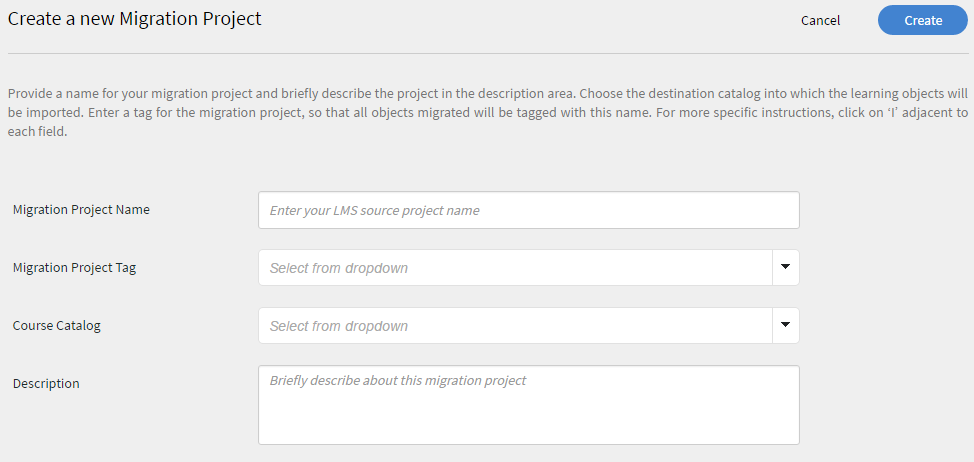
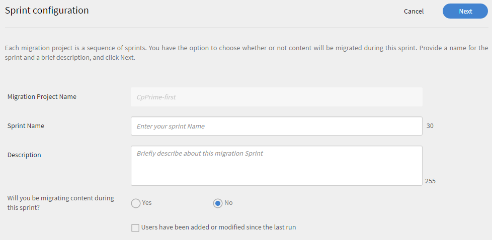
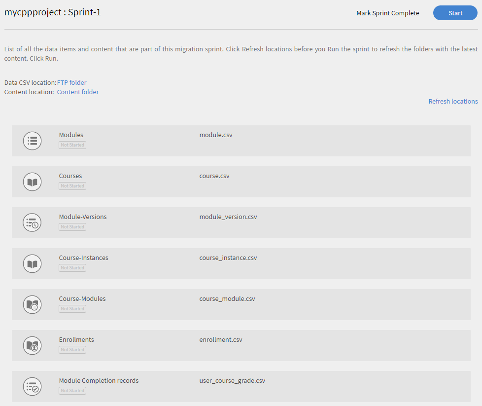

# 移行マニュアル

既存の LMS を Learning Manager LMS に移行する統合管理者向けの参照用マニュアル

<!-- ## Overview {#overview} -->

## 利用シナリオ {#usagescenario}

一般に、大企業は自社の LMS または他のベンダーから提供されるレガシー学習管理システムを使用します。 LMS は、企業のトレーニングコンテンツとトレーニングデータで構成されます。 企業として Learning Manager を購入すると、既存の LMS コンテンツとデータを Learning Manager に移動することにより、直感的に使用できる最新の LMS のメリットを活用できます。組織のレガシーデータが失われることはありません。

Learning Manager では、組織の統合管理者が移行タスクを設定および実行できるように、必要なツールおよび仕様が用意されています。

現時点で Learning Manager の移行機能は、組織の管理者がアドビのサポートチームに問い合わせることでアクセスできます。 アカウントの移行機能を有効にするには、Adobe Learning Manager のサポートチームまでお問い合わせください。

## 移行プロセス {#apidescription}

このセクションでは、移行の前提条件、移行プロセスに含まれる主要な手順、移行スプリント、仕様、データおよびコンテンツの移行手順について説明します。

### 移行に関する重要なアドバイス

移行タイムラインは、データの品質とサイズに大きく依存することに注意する必要があります。 オンボーディング中に移行が必要な場合は、このアクティビティを事前に十分に計画し、Adobe Learning Managerオンボーディングチームと緊密に連携して遅延を避けてください。

### 前提条件 {#prerequisites}

Learning Manager チームは、移行プロセスを開始する前に、組織の統合管理者が以下のタスクを実行することを想定しています。

* 統合管理者は、既存の LMS からデータとコンテンツを抽出し、そのデータを Learning Manager で定義されているファイル形式に変換します。
* Learning Manager は、移行プロセスの一部としてユーザーの読み込みをサポートしていないため、組織はコネクターを使用してユーザーを読み込む必要があります。 これらのコネクタが移行プロセス前に設定されている必要があります。 詳細については[「Learning Manager コネクターのヘルプ」](connectors.md)を参照してください。

Learning Manager では、管理者が Learning Manager の実稼働環境にデータやコンテンツを移行する前に、体験版アカウントで移行プロセスをお試しいただくことをお勧めします。

### 移行プロセスの主要な手順 {#keystepsofmigrationprocess}

既存の LMS から Learning Manager にコンテンツとデータを移行する際の主要な手順は、以下のとおりです。

1. 統合管理者またはパートナーは、移行が必要な既存の LMS データおよびコンテンツを評価します。
1. 統合管理者は、データとコンテンツを取り込むために Learning Manager で利用できるツールと仕様を評価します。
1. 古い LMS が提供する機能に基づいて、統合管理者はコードを作成するか、手作業によって、古い LMS からデータとコンテンツを書き出します。
1. トレーニングのデータとコンテンツが利用可能になったら、統合管理者は Learning Manager の移行の仕様に一致するようにデータとコンテンツをマッピングして分析します。
1. 統合管理者は Learning Manager のツールを使用して、以下の順序で移行します。

   1. 学習者を Learning Manager に転送します。
   1. トレーニングコンテンツを Learning Manager に転送します。
   1. 最後に、トレーニングデータを Learning Manager に転送します。

組織は、Learning Manager LMS とレガシーコンテンツを併用できるようになりました。

### 移行オブジェクトの範囲 {#scopeofmigrationobjects}

以下の学習目標のコンテンツのみを移行できます。

* モジュール
* バッジ
* コース
* モジュールバージョン
* コースのインスタンス
* コースモジュール
* スキル
* スキルレベル
* スキルコース
* 資格認定
* 資格認定コース
* 資格認定の確定
* 学習プログラム
* 学習プログラムコース
* 学習プログラムのインスタンス
* 学習プログラムのコースインスタンス
* 作業計画書
* 作業計画書のバージョン
* 作業計画書コース
* 作業計画書のスキル
* 登録
* 資格認定の登録
* 学習プログラムの登録
* 作業計画書の登録
* ユーザーコースのグレード

### 移行の主な概念 {#keyconceptsofmigration}

参考までに Learning Manager の移行プロセスの主要な概念について、以下に簡単に説明します。

**移行プロジェクト**

Learning Manager では、移行プロジェクトは 1 つ以上のスプリントで構成されています。 アカウントに複数の移行プロジェクトを含めることもできます。 Learning Manager での移行プロセスは、移行プロジェクトの作成から開始します。

**スプリント**

Learning Manager の移行プロセスで、スプリントは既存の LMS から移行対象として選択した一連の移行項目を意味します。 移行項目は、コースモジュール、学習者レコード、または一連のコースです。 スプリントに複数の学習データ項目を含めることができます。 各スプリントで移行ジョブを実行できます。

**スプリントの実行**

スプリントの実行は、スプリント移行ジョブを開始するプロセスです。 スプリントの実行はいつでも停止できます。

**スプリントの再実行**

移行スプリントは、完了後にいつでも再実行できます。 スプリントの再実行は、データをスプリント項目に追加し、それをアプリケーションに再度移行するか、または CSV 内のエラーを修正する場合に発生します。

**CSV の仕様**

Learning Manager では、[標準の CSV 仕様](migration-manual.md#main-pars_header_140933605)を利用できます。 移行プロセスを開始する前に、これらの CSV 仕様を確認することが最適な方法です。 組織の統合管理者は、既存のデータ形式を分析し、そのデータ形式を Learning Manager が提供する CSV テンプレート項目と一致するようにマッピングできます。

**移行プロジェクトのタグ**

アドビは、タグとしていくつかのキーワードを使用して、Learning Manager アプリケーション内で移行プロジェクトを簡単に識別することをお勧めします。 このようなタグを使用すると、Learning Manager アプリケーションの内部でプロジェクトをいつでも識別できます。

**コンテンツレスモジュール**

Learning Manager では、コンテンツがなくてもモジュールをアップロードできます。 アドビではこのようなモジュールを、Learning Manager のコンテンツレスモジュールと見なしています。 コンテンツを必要とせずに既存の LMS から一部のレガシーデータを移行するシナリオでは、URL を参照せずに module_version.csv ファイルをアップロードできます。

## CSV の仕様とサンプル CSV {#csv}

既存の LMS 移行データをマッピングするために使用できる標準の CSV 仕様は以下のとおりです。 csv-specifications および sample-csvs をクリックして、zip ファイルをダウンロードします。 ダウンロードしたcsv-specifications.zipには、7つのExcelシートファイルが含まれています。 これらの Excel シートファイルは、.csv ファイルに入力する方法の説明が付いた仕様です。 対応する .csv ファイルには、これらの .xlsx ファイルで説明されているように、各フィールドのデータを所定の形式で指定する必要があります。

<table border="1" cellspacing="0" cellpadding="0" width="100%">
 <tbody>
  <tr>
   <th>
    <p><b>Sl.no</b></p></th>
   <th>
    <p><b>ファイル名</b></p></th>
   <th>
    <p><b>コンテンツの説明</b></p></th>
   <th>
    <p>メモ</p></th>
  </tr>
  <tr>
   <td>
    <p>1</p></td>
   <td>
    <p>module.xlsx</p></td>
   <td>
    <p>module.csv のメタデータ</p></td>
   <td> </td>
  </tr>
  <tr>
   <td>
    <p>2</p></td>
   <td>
    <p>badge.xlsx</p></td>
   <td>
    <p>badge.xlsx のメタデータ</p></td>
   <td> </td>
  </tr>
  <tr>
   <td>
    <p>3</p></td>
   <td>
    <p>course.xlsx</p></td>
   <td>
    <p>course.csv のメタデータ</p></td>
   <td>
    <p>移行後は複数の作成者名がアプリケーションで正確に表示されない場合があるため、特定のコースごとに作成者名を 1 つ指定するようにします。 </p></td>
  </tr>
  <tr>
   <td>
    <p>4</p></td>
   <td>
    <p>module_version.xlsx </p></td>
   <td>
    <p>module_version.csv のメタデータ</p></td>
   <td>
    <p>コンテンツをアップロードした Box アカウントフォルダーの URL パスを指定してください。 </p></td>
  </tr>
  <tr>
   <td>
    <p>5</p></td>
   <td>
    <p>course_instance.xlsx</p></td>
   <td>
    <p>course_instance.csv のメタデータ </p></td>
   <td> </td>
  </tr>
  <tr>
   <td>
    <p>6</p></td>
   <td>
    <p>session.xlsx</p></td>
   <td>
    <p>session.csv のメタデータ</p></td>
   <td>
    <p>session.csv のすべてのエントリが少なくとも 1 つの教室／仮想教室モジュールに関連付けられていることを確認します</p></td>
  </tr>
  <tr>
   <td>
    <p>7</p></td>
   <td>
    <p>course_module.xlsx</p></td>
   <td>
    <p>course_module.csv のメタデータ</p></td>
   <td> </td>
  </tr>
  <tr>
   <td>
    <p>8</p></td>
   <td>
    <p>skill.xlsx</p></td>
   <td>
    <p>skill.csv のメタデータ</p></td>
   <td> </td>
  </tr>
  <tr>
   <td>
    <p>9</p></td>
   <td>
    <p>skill_level.xlsx</p></td>
   <td>
    <p>skill_level.csv のメタデータ</p></td>
   <td> </td>
  </tr>
  <tr>
   <td>
    <p>10</p></td>
   <td>
    <p>skill_course.xlsx</p></td>
   <td>
    <p>skill_course.csv のメタデータ</p></td>
   <td> </td>
  </tr>
  <tr>
   <td>
    <p>11</p></td>
   <td>
    <p>certification.xlsx</p></td>
   <td>
    <p>Certification.csv のメタデータ</p></td>
   <td> </td>
  </tr>
  <tr>
   <td>
    <p>12</p></td>
   <td>
    <p>certification_course.xlsx</p></td>
   <td>
    <p>certification_course.csv のメタデータ</p></td>
   <td> </td>
  </tr>
  <tr>
   <td>
    <p>13</p></td>
   <td>
    <p>certification_commit.xlsx</p></td>
   <td>
    <p>certification_commit.csv のメタデータ</p></td>
   <td> </td>
  </tr>
  <tr>
   <td>
    <p>14</p></td>
   <td>
    <p>learning_program.xlsx</p></td>
   <td>
    <p>learning_program.csv のメタデータ</p></td>
   <td> </td>
  </tr>
  <tr>
   <td>
    <p>15</p></td>
   <td>
    <p>learning_program_course.xls </p></td>
   <td>
    <p>learning_program_course.csv のメタデータ </p></td>
   <td> </td>
  </tr>
  <tr>
   <td>
    <p>16</p></td>
   <td>
    <p>learning_program_instance.xlsx </p></td>
   <td>
    <p>learning_program_instance.csv のメタデータ</p></td>
   <td> </td>
  </tr>
  <tr>
   <td>
    <p>17</p></td>
   <td>
    <p>learning_program_instance_course_instance.xlsx </p></td>
   <td>
    <p>learning_program_instance_course_instance.csv のメタデータ</p></td>
   <td> </td>
  </tr>
  <tr>
   <td>
    <p>18</p></td>
   <td>
    <p>job_aid.xlsx</p></td>
   <td>
    <p>job_aid.csv のメタデータ</p></td>
   <td>
    <p>移行したすべての job_aid には、1 つ以上の job_aid バージョンが必要です。</p></td>
  </tr>
  <tr>
   <td>
    <p>19</p></td>
   <td>
    <p>Job_aid_version.xlsx</p></td>
   <td>
    <p>job_aid_version.csv のメタデータ</p></td>
   <td> </td>
  </tr>
  <tr>
   <td>
    <p>20</p></td>
   <td>
    <p>job_aid_course.xlsx</p></td>
   <td>
    <p>job_aid_course.csv のメタデータ</p></td>
   <td> </td>
  </tr>
  <tr>
   <td>
    <p>21</p></td>
   <td>
    <p>job_aid_skills.xlsx</p></td>
   <td>
    <p>job_aid_skills.csv のメタデータ</p></td>
   <td> </td>
  </tr>
  <tr>
   <td>
    <p>22</p></td>
   <td>
    <p>enrollments.xlsx</p></td>
   <td>
    <p>登録.csvのメタデータ</p></td>
   <td> </td>
  </tr>
  <tr>
   <td>
    <p>23</p></td>
   <td>
    <p>certification_enrollement.xlsx</p></td>
   <td>
    <p>certification_enrollement.csv のメタデータ</p></td>
   <td> </td>
  </tr>
  <tr>
   <td>
    <p>24</p></td>
   <td>
    <p>learning_program_enrollment.xlsx</p></td>
   <td>
    <p>learning_program_enrollment.csv のメタデータ<br><br></p></td>
   <td> </td>
  </tr>
  <tr>
   <td>
    <p>25</p></td>
   <td>
    <p>job_aid_enrollment.xlsx</p></td>
   <td>
    <p>job_aid_enrollment.csv のメタデータ</p></td>
   <td> </td>
  </tr>
  <tr>
   <td>
    <p>26</p></td>
   <td>
    <p>user_course_grade.xlsx</p></td>
   <td>
    <p><br>
      user_course_grade.csv のメタデータ</p></td>
   <td>
    <p>必要に応じて、.csv ファイルに必要な学習者レコードデータを設定します。 この情報がない場合、.csv ファイルを移行対象として処理しても、Learning Manager アプリケーションでデータが反映されない可能性があります。 sample-csvs.zip ファイルには前述と同じ命名規則を持つ 7 つの .csv ファイルが含まれます。</p></td>
  </tr>
  <tr>
   <td>
    <p>27</p></td>
   <td>
    <p>user_skill.xlsx</p></td>
   <td>
    <p><br>
      user_skill.csvのメタデータ</p></td>
   <td>
    <p> </p></td>
  </tr>
 </tbody>
</table>

Learning Manager では、UTF 8 および 32 ビット形式の日時の値のみをサポートしています。 2038-07-17T08:53:21.000Zまたは1980-04-17T08:13:25.322Zの範囲外の日付をCSVファイルに記載すると、移行中にエラーが発生することがあります。

* [sample-csvs.zip](assets/sample-csvs.zip)
* [csv_specifications.zip](assets/csv-specifications.zip)

CSV ファイルを読み込むときに、以下の依存関係を認識する必要があります。

* module_version.csv は module.csv に依存している
* course_instance.csv は course.csv に依存している
* course_module.csv は course.csv、module.csv および module_version.csv に依存している
* course_instance.csv は course.csv に依存している
* session.csv は course.csv および module.csv に依存している
* enrollment.csv は course.csv に依存している
* user_course_grade.csv は course.csv および module.csv に依存している
* skill_course.csv は course.csv に依存している
* skill_level.csv は skill.csv に依存している
* learning_program_instance.csv は learning_program および learning_program_course.csv に依存している
* learning_program_course.csv は learning_program.csv に依存している
* learning_program_enrollment.csv は learning_program および learning_program_instance.csv に依存している
* learning_program_instance_course_instance.csvはlearning_program.csv、learning_program_instance.csvおよびcourse_instance.csvに依存している
* certification_course.csvはcertification.csvおよびcourse.csvに依存している
* certification_commit.csv は certification.csv および certification_course.csv に依存している
* certification_enrollment.csv は certification.csv、certification_course.csv および certification_enrollment.csv に依存している

### 移行CSVでの学習プログラムコースの順序

移行仕様の以前のバージョンでは、learning_program_course.csvファイルに順序の列が含まれており、移行中に学習プログラム内のコースの順序を制御できることを示唆していました。

Adobe Learning Managerでは、この列は使用されなくなりました。 移行CSVで学習プログラムのコースの順序を制御することはできません。**orderEnforced**&#x200B;をtrueに設定しても、システムは注文列に入力された値を無視します。

混乱を避けるために、注文列は公式のCSV仕様から削除されました。 この列を生成する既存のスクリプトまたはツールがある場合は、安全に削除できます。学習プログラムの作成または表示の方法に影響はありません。

## 移行手順 {#migrationprocedure}

移行手順を開始する前に、以下の点に注意する必要があります。

* 1 つのアカウントでアクティブにできる移行プロジェクトは常に 1 つのみです。 プロジェクト内では、アクティブにできるスプリントは常に 1 つのみです。
* 既に移行プロセスに存在する実行を元に戻すことはできません。 ただし、Learning Manager の各機能にある既存の削除オプションを使用すると、データやコンテンツの移行を元に戻すことができます。
* 移行プロジェクトが開始されるとすぐに、移行は「移行中」の状態になります。 移行中は、統合管理者以外の役割のユーザーは Learning Manager にログインできません。

### FTP アカウントと Box アカウントの作成 {#creatingftpandboxaccounts}

移行プロジェクトを計画することは非常に重要です。 プロジェクトを複数のスプリントに分割し、各スプリントで何を移行するのかを明確に特定することをお勧めします。 プロジェクトの終了時に総合的な検証を 1 回行う代わりに、各スプリントの後に検証を行い、そのスプリントに移行されたデータを確認することをお勧めします。 移行プロジェクトの一部としてスプリントを起動する前に、データとコンテンツの CSV ファイルをそれぞれ FTP サーバーと Box サーバーにアップロードする必要があります。 カスタムFTPおよびBox用のアカウントがない場合は、それらを作成できます。

<!--**Create FTP account**-->

<!--
Click **[!UICONTROL Request for CSV FTP folder]**. A pop-up dialog appears prompting you to enter your e-mail id. Go through online instructions and create an FTP account. As soon as you create your account, you can view your migration project and sprint project folders in FTP. 

A sample snapshot of project files and folder of FTP is shown below for your reference. 
-->

<!---->

**Box アカウントの作成**

次に示すとおり、コンテンツアップロードフォルダーの作成は、FTP フォルダーの作成と同じ手順で行います。 左ペインにある「移行」をクリックし、表示されるページの下部にある「コンテンツアップロードフォルダーを要求」をクリックします。

Box から共有フォルダーへのリンクを含む電子メールが届きます。 Box アカウントがない場合は、「サインアップ」をクリックし、アカウントを作成します。 ログインの指示が、統合管理者の電子メール ID に送信されます。

**FTP フォルダーまたは Box フォルダーへのデータ（.csv ファイル）のアップロード**

移行プロジェクトを作成する前に FTP または Box アカウントを作成する必要があります。 この段階で、Learning Managerアプリケーションで移行プロジェクトとスプリントを作成できます。  移行プロジェクトを作成するには、このページの「**データとコンテンツの移行手順**」セクションを参照してください。

FTP アカウントまたは Box アカウントで、プロジェクトフォルダー名をクリックし、スプリント名をクリックします。 スプリントのフォルダー内に、移行対象の .csv データファイルをアップロードできます。 アップロードするには、FTPサーバーまたはBoxサーバーの上部にある「ファイルをアップロード」ボタンをクリックし、.csvファイルをドロップします。 FTPにアップロードした後のサンプルスナップショットは、参考までに以下のとおりです。

<!---->

Learning Manager移行プロジェクトに戻るには、**[!UICONTROL 「更新」]**&#x200B;をクリックして、移行スプリントに一覧表示されているすべての.csvデータタイプを表示します。

**コンテンツフォルダーへのトレーニングコンテンツのアップロード**

既存の LMS のトレーニングコンテンツを Box アカウントにアップロードします。 移行プロジェクトとスプリントを既に作成している場合は、Box アカウントに移行プロジェクトとスプリントの名前が表示されます。 同じパスにコンテンツをアップロードできます。 移行プロジェクトを作成するには、このページの「**データとコンテンツの移行手順**」セクションを参照してください。

コンテンツファイルをドラッグ＆ドロップする、または「**[!UICONTROL アップロード]**」をクリックして、デスクトップからファイルを選択することができます。 コンテンツのファイルサイズが大きい場合は、ファイルのアップロードに時間がかかることがあります。 ファイルのサイズに応じて、Box アカウントへのファイルのアップロードにかかる時間は異なります。

コンテンツをアップロードした後の Box アカウントのサンプルスナップショットについては、以下を参照してください。


*Boxアカウントのファイル*

ファイルが Box アカウントにアップロードされた後、module_version.csv ファイルにこの Box コンテンツファイルの相対パスが記載されていることを確認します。 これはモジュールコンテンツのパスを示すための必須の手順です。

FTP サーバーと Box サーバーにログインしてコンテンツをアップロードすると、以下のスナップショットのように Learning Manager で CSV の場所が表示されます。


*Boxアカウント内のCSVの場所*

## 代替と同等の製品の移行

### 概要

このトピックでは、CSVベースのデータモデルと、システムに学習目標(LO)等価性を導入するための移行動作の概要について説明します。

### 既存のCSVファイル（コンテキスト）

これらのCSVはプラットフォームに既に存在し、プライマリ学習オブジェクト、モジュール、完了コンテキストを提供します（包括的ではないリスト）。

* user_course_grade.csv
* moduleversion
* module.csv
* course.csv
* course_module.csv

これらのファイルは、そのまま使用され続け、新しい等価機能によって変更されることはありません。ただし、これらのファイルは、等価機能が動作する基になるデータを形成します。

### 代替用の新しいCSVファイル

LOの代替関係および関連するユーザーの完了をサポートするために、2つの新しいCSVが導入されました。

#### 1. equivalence_relationships.csv

ソース学習目標(LO)とターゲット学習目標(LO)の間の等価マッピングを定義します。LOは、コースまたは学習パス(LP)のいずれかです。

**スキーマ：**

* sourceId
* sourceloType （コース/ LP）
* targetId
* targetLotype （コース/ LP）
* dateCreated
* relationshipStatus（アクティブ/DELETE）
* dateModified

**目的：**

* 2つのLO間の等価関係を表します。
* relationshipStatusは、リレーションシップが現在アクティブか削除されているかを制御します。
* dateCreatedおよびdateModifiedは監査をサポートします。

#### equivalence_user_completion.csv

equivalence_relationships.csvで定義された関係に従って、同等のLOのユーザーレベルの完了情報をキャプチャします。

**スキーマ：**

* userId
* sourceId
* sourceloType （コース/ LP）
* targetId
* targetLotype （コース/ LP）
* dateComplete

**目的：**

* 等価関係と既存のソースLO完了に基づいて、ユーザーに対して推論する必要がある&#x200B;**ターゲットLO完了**&#x200B;を明示的に記録します。
* 移行された同等のデータに関連付けられたユーザー完了の&#x200B;**権限ソース**&#x200B;として機能します。

### 移行ルールと行動セマンティクス

#### &#x200B;1. 新しい同等のCSVの機能強化サポートなし

* 同値関連のデータはすべて、移行によって取り込む必要があります。
* 次の場合、システムはシナリオをサポートしません。
  * LOデータ（コース/LP）がUIを介して作成され、
  * 等価関係は、後でCSVからのみ読み込まれます。

これは、次のことを意味します。

* サポートされるパターンは、LO定義とその等価関係が、コヒーレント移行フローの一部として管理されます。
* UIで作成されたLOにCSVのみの等価性を適用するハイブリッドフローはサポートされません。

#### &#x200B;2. 移行済の関連からの遡及完了/未完了なし

移行を介して（equivalence_relationships.csvを介して）等価関係が導入された場合：

* システムは、その関係のみに基づいて遡及的な完了または未完了の計算を実行しません。
* 代わりに、必要なすべてのユーザー完了データをequivalence_user_completion.csvを使用して明示的に提供する必要があります。

**意味：**

* equivalence_user_completion.csvは、等価性の結果として移行時に認識される必要があるすべての完了の真の単一ソースです。
* プラットフォームは、既存のコースの進捗状況からこれらの完了点を推測したり、埋め戻したりすることはありません。

#### &#x200B;3. 移行後の新しい完了の動作

次の場合：

* 等価関係がマイグレーションによって作成され、
* 学習者がソースLO（移行後）を完了すると、

その後：

* システムはターゲットLOの代替完了をトリガーします。つまり、同等性は新しいソース完了に対して通常前方に動作します。

**キーの区別：**

* **移行時：**&#x200B;完了はequivalence_user_completion.csvを介して行う必要があります。
* **移行後：**&#x200B;ソースLOが新たに完了すると、ネイティブランタイムロジックが代替完了を処理します。

#### &#x200B;4. 上位の学習目標への影響

CSVを介して（equivalence_user_completion.csvを介して）別の補完が行われると、上位のLOの再計算がトリガーされます。

上位のLOには次のものが含まれます。

* 学習パス

**技術的な意味：**

* equivalence_user_completion.csvの取り込みは、「サイレント」操作ではありません。通常のランタイム完了によってトリガーされるのと同じ再計算/ロールアップロジックを開始します。
* この移行を統合またはスケジュールするシステムは、再計算の負荷とタイミングを計画する必要があります。

## 代替用のWebhook

学習者が代替登録または顧客間関係を通じてコースを完了すると、Adobe Learning Managerは標準のコース完了webhookとは異なる専用のwebhookイベントを生成します。これにより、統合は代替完了に異なる処理ロジックを適用できます。 また、遡及的な完了と遡及的な完了前に対してWebhookイベントが生成され、コース・ステータスの履歴変更（関連の更新による変更も含む）がカバーされるため、外部システムが学習者の現在の完了状態と同期した状態が維持されます。

代替のWebhookについては、[代替のWebhook](/help/migrated/integration-admin/feature-summary/webhooks.md#webhooks-for-alternates)を参照してください

## データとコンテンツの移行手順 {#dataandcontentmigrationprocedure}

企業の LMS データとコンテンツを Learning Manager に移行する手順は、以下のとおりです。

移行を開始する前に移行プロセスの前提条件を実行してください。 このページの「[CSV の仕様とサンプル CSV](migration-manual.md#main-pars_header_140933605)」セクションを参照して、データとコンテンツの移行に使用する CSV を準備してください。

1. 統合管理者としてLearning Managerアプリケーションにログインして、左ペインの&#x200B;**[!UICONTROL 「移行」]**&#x200B;をクリックします。

   移行プロジェクトのホームページが表示されます。 組織が既に移行プロジェクトを作成している場合は、このページにすべての移行プロジェクトのリストを表示できます。

1. ページの右上隅にある「**[!UICONTROL 新規]**」をクリックして、移行プロジェクトを作成します。 また、ページ上の「**[!UICONTROL 移行プロジェクトを作成]**」リンクをクリックして、移行プロジェクトを作成することもできます。 移行プロジェクトを作成ページが表示されます。

   FTPフォルダーをまだ作成していない場合は、アカウントにFTPフォルダーを作成するように求められます。 これは移行プロジェクトの作成を開始する前の必須の手順です。

   
   *FTPフォルダーの作成*

   移行プロジェクトのプロジェクト名、プロジェクトタグ、コースカタログおよび説明を指定します。 **[!UICONTROL 「作成」]**&#x200B;をクリックします。

   移行データ項目は、この移行プロジェクトタグを使用して識別されます。 特定のコースカタログが存在しない場合は、ドロップダウンからデフォルトのカタログを選択します。 移行プロジェクトを使用して移行するすべてのコースは、ここで選択するカタログに含まれます。 カタログを選択しない場合、移行したすべてのコースはデフォルトのカタログに含まれます。

1. スプリントの構成ページのスナップショットについては、以下を参照してください。 移行プロジェクトの一部としてスプリントを作成する必要があります。 スプリントの名前を選択し、スプリントの簡単な説明を入力します。 このスプリントの一部としてコンテンツを移行する場合は、「はい」を選択することができます。 「**[!UICONTROL 次へ]**」をクリックします。

   
   *スプリントの移行*

   Learning Manager アプリケーションとユーザーリストを同期するには、**「前回の実行後に追加または修正されたユーザー」**&#x200B;というタイトルのチェックボックスをオンにします。 コンテンツとデータを Learning Manager アプリケーションに移行する場合、この操作は不要な場合があります。 ただし、前回のスプリントを移行してから最新のスプリントを移行するまでに長時間経過している場合は、ユーザーリストを同期することをお勧めします。 この手順により、Learning Manager データベースを LMS ユーザーと同期させることができます。

   enrollment.csv と user_course_grade.csv を移行する場合は、この同期手順を実行することをお勧めします。 この手順により、Learning Manager データベースを移行データベースと同期させることができます。また、レコードがスプリントに移行されるすべてのユーザーが移行データベース上で利用可能になります。

1. アップロードされたデータとコンテンツを使用して、スプリントの移行を開始できます。 Learning Manager アプリケーションでスプリントの実行を開始して、FTP フォルダーとコンテンツフォルダーを同期する前に、**[!UICONTROL 「更新」]**&#x200B;リンクをクリックします。

   
   *スプリントの移行を開始します*

   ページの右上隅にある&#x200B;**[!UICONTROL 開始]**&#x200B;をクリックします。 スプリントの移行プロセス中はいつでも&#x200B;**[!UICONTROL [停止]]**&#x200B;をクリックして、スプリントの移行を中止できます。

   移行ステータスは、各スプリントデータ項目とコンテンツに表示されます。 移行スプリントを実行する際は、成功した項目と失敗した項目の数を確認します。

   モジュールコンテンツをアップロードする場合は、コンテンツフォルダーのパスが module_version.csv に指定されていることを確認してください。 この手順を実行しない場合は、移行中にエラーが発生する可能性があります。 例えば、動画などのセルフペースのモジュールコンテンツをアップロードする場合は、module_version.csv で Box URL 相対パスを指定する必要があります。 アクティビティモジュールコンテンツには、URL 名を指定できます。

   進捗ダイアログのサンプルスナップショットについては、以下を参照してください。 スナップショットに表示されているように、移行データ項目ごとに処理されたレコードの数を表示できます。成功および失敗した項目のステータスも表示できます。 失敗した項目に対して「エラーレコードをダウンロード」をクリックすると、エラーログをダウンロードして表示できます。 CSV の問題を修正し、FTP でもう一度アップロードすることができます。

   
   *スプリントの進行状況を表示*

   移行プロジェクトのすべてのスプリントのリストを表示する場合は、左ペイン上の「スプリントリスト」をクリックします。 以下のサンプルスナップショットに示すように、すべてのスプリントのリスト、各スプリントの実行数、開始日、期間、および完了ステータスを表示できます。

   
   *スプリントのリストを表示*

1. 更新された最新の CSV ファイルをアップロードした後で、ページの右上隅にある「再実行」をクリックできます。 変更がない項目が無視され、すべてのデータ項目が再度処理されます。 スプリント内のデータ項目の移行が正常に終了すると、ページ上部にあるボタンをクリックして、スプリントの移行を完了とマークできます。 さらに多くのデータ項目を使用して、後で新しいスプリントを開始できます。 スプリントが完了とマークされると、スプリントを再実行することはできません。 同様に、移行プロジェクトでは、スプリントの数の制限はありません。 すべてのスプリントの移行ステータスに問題がない場合、スプリントリストページの「**プロジェクトを完了**」リンクをクリックして、移行プロジェクトを完了とマークできます。

   移行プロジェクトを完了とマークする前に、プロジェクトのすべてのスプリントが完了していることを確認する必要があります。 移行プロジェクトを完了とマークすると、プロジェクトに戻ってスプリントを作成したり、プロジェクトに変更を加えたりすることはできません。 別の移行プロジェクトを作成して、それにスプリントを追加する必要があります。

## 移行の検証 {#registration}

組織のレガシー LMS から学習データとコンテンツを移行した後は、多様な学習目標機能を使用して、読み込んだデータとコンテンツを検証できます。 例えば、Learning Manager アプリケーションに管理者としてログインし、読み込んだモジュール、コースデータおよびコンテンツの利用状況を検証できます。

## APIを使用した移行

Adobe Learning Manager(ALM)は、主に従来のLMSプラットフォームからの移行に使用される、外部システムからデータまたはコンテンツを取り込む移行機能を提供します。

ただし、組織によっては、このプロセスを1回限りの読み込みではなく、定期的なスケジュール（夜間や毎週など）で実行する必要があります。

例として、架空の顧客(NovaFX)が架空の外部プロバイダー(SquareCorp)と統合し、スケジュールされた移行を自動化する方法を説明します。 この統合により、次のことが可能になります。

* SquareCorpコースは、NovaFX学習者の場合、ALM内に学習目標として表示されます。
* NovaFXは、SquareCorpがホストするコースの学習者の進捗状況をALMで直接トラッキングします。

### 統合の要件

SquareCorpは次の情報を提供する必要があります。

* コースメタデータ情報：NovaFXがアクセスできるコースメタデータを共有するためのAPI。
* 進捗状況データ情報：学習者の進捗状況と完了情報を定期的に共有するAPI。

### 主な定義

* **アクティブなプロジェクト：**&#x200B;プロジェクトが「進行中」または「初期化済み」の場合、プロジェクトはアクティブです。
* **アクティブスプリント：**&#x200B;スプリントが「進行中」または「初期化済み」の場合、スプリントはアクティブです。

### スプリントの実行を自動化する

スケジュールに従って次の処理を実行するアプリまたはスクリプトを作成します。

1. SquareCorpからコースメタデータ、ユーザー登録、学習者の成績を取得します。
2. CSVファイルを生成します。
3. ファイルをBoxまたはFTPにアップロードします。
4. 移行APIを使用してスプリントをトリガーします。

### APIの詳細

#### 移行実行の開始

**エンドポイント：** POST /primeapi/v2/bulkimport/startrun

パラメーター：

* **lockaccount （ブール型）:**&#x200B;実行の開始時にアカウントをロックするかどうかをパラメーターで指定します。 デフォルトでは、 falseに設定されています。 アカウントをロックする有効な理由がない限り、このパラメーターを使用しないことをお勧めします。
* **カタログID （整数）:**&#x200B;このパラメーターを使用すると、移行中に移行先カタログを選択できます。 これは通常、移行プロジェクトの作成時に設定されますが、個々の実行に合わせて調整できます。 カタログIDを変更すると、以降の実行で追加された学習目標は最後に選択したカタログに配置されます。 移行プロジェクトの作成時に選択したカタログに戻る必要がある場合は、このオプションも明示的に指定する必要があります。
* **migrationProjectId (Integer):**&#x200B;アカウントで複数のAPI対応の実行が有効になっている場合、特定の移行プロジェクトをトリガーするには、パラメーターが必要です。

#### 同期を開始できるかどうかを確認します

コンテンツがスプリントフォルダーに同期されるようにします。 このAPIから正常なレスポンスオブジェクトが返されない限り、コンテンツまたはメタデータファイルをFTPフォルダーにコピーしないでください。

**エンドポイント：** GET /primeapi/v2/bulkimport/cansync

パラメーター：

* **migrationProjectId (Integer)**&#x200B;アカウントで複数のAPI対応の実行が有効になっている場合、特定の移行プロジェクトをトリガーするには、パラメーターが必要です。

<b>応答の成功</b>

```
{  
    "status": "OK",  
    "title": "BULKIMPORT_CAN_SYNC_NOW",  
    "source": {  
        "info": "Yes"  
    }  
} 
```

<b>応答の成功</b>

```
{ 
    "status": "BAD_REQUEST", 
    "title": "BULKIMPORT_ERROR_CANNOT_SYNC", 
    "source": { 
        "info": "Error, No active projects" 
    } 
} 
```

<b>可能なAPI応答</b>

| アクション | タイプ | メッセージ |
| ------------------------------------- | ------- | ------------------------------------------------------------------------------------- |
| BULKIMPORT_RUN_INITIATED_SUCCESSFULLY | 成功 | 実行が正常に開始されました |
| BULKIMPORT_ERROR_CANNOT_INITATE_RUN | エラー | 実行中です |
| BULKIMPORT_ERROR_CANNOT_INITATE_RUN | エラー | 複数のアクティブなプロジェクトがあります |
| BULKIMPORT_ERROR_CANNOT_INITATE_RUN | エラー | スプリントが複数あります |
| BULKIMPORT_ERROR_CANNOT_INITATE_RUN | エラー | アクティブなプロジェクトはありません |
| BULKIMPORT_ERROR_CANNOT_INITATE_RUN | エラー | アクティブスプリントなし |
| BULKIMPORT_ERROR_CANNOT_INITATE_RUN | エラー | 指定されたカタログは有効なIDでないか、primeアカウントに属していません |
| BULKIMPORT_CAN_SYNC_NOW | 情報 | 今すぐ同期可能 |
| BULKIMPORT_ERROR_CANNOT_SYNC | エラー | 実行中です |
| BULKIMPORT_ERROR_CANNOT_SYNC | エラー | 複数のアクティブなプロジェクトがあります |
| BULKIMPORT_ERROR_CANNOT_SYNC | エラー | スプリントが複数あります |
| BULKIMPORT_ERROR_CANNOT_SYNC | エラー | アクティブなプロジェクトはありません |
| BULKIMPORT_ERROR_CANNOT_SYNC | エラー | アクティブスプリントなし |
| BULKIMPORT_ERROR_CANNOT_SYNC | エラー | フォルダーに有効なファイルがありません |

### サンプル統合フロー

1. cansync APIを確認します。
2. CSVファイルを生成およびアップロードします。
3. Startun APIを使用してスプリントをトリガーします。
4. 応答を監視し、エラーを処理します。

### 制限

移行APIには、スプリントの実行後に出力CSVファイルで移行関連のエラーを直接確認する機能は用意されていません。 ただし、これらのエラーは、スプリントの実行後に統合管理者ユーザーインターフェイスにアクセスして、CSVファイル内の行として確認できます。

### APIによる移行の検証

移行API `runStatus`を使用すると、統合管理者はAPIを介してトリガーされる移行実行の進行状況を追跡できます。

`runStatus` APIには、完了した実行のエラーログをCSV形式でダウンロードするための直接リンクも用意されています。 ダウンロードリンクは7日間有効で、ログは1か月間保持されます。

**サンプルカール**

**エンドポイント**

```
GET /bulkimport/runStatus
```

**パラメーター**

* **migrationProjectId**: （必須）。 移行プロジェクトの一意の識別子。 移行プロジェクトを使用して、既存のLearning Management System(LMS)からAdobe Learning Managerにデータとコンテンツを転送します。 各移行プロジェクトは、複数のスプリントで構成できます。複数のスプリントは、移行タスクのより小さな単位です。

* **sprintId**: （必須）。 移行プロジェクト内のスプリントの一意の識別子。 スプリントは、既存のLMSからAdobe Learning Managerに移行する特定の学習項目（コース、モジュール、学習者レコードなど）を含む移行タスクのサブセットです。 各スプリントは個別に実行できるため、段階的な移行が可能です。

* **sprintRunId**: （必須）。 移行プロジェクト内で特定のスプリントの実行を追跡するために使用される一意の識別子。 スプリントで定義された項目の実際の移行プロセスに関連付けられています。 sprintRunIdは、移行ジョブの監視、トラブルシューティング、および管理に役立ちます。

**回答**

```
{
  "sprintId": 2510080,
  "sprintRunId": 2740845,
  "migrationProjectId": 2509173,
  "startTime": 1746524711052,
  "endTime": 1746524711052,
  [
    {
      "id": 2609923,
      "lastHeartbeatTime": 1746524711052,
      "objectName": "content",
      "jobState": "COMPLETED",
      "errorCsvLink": "",
      "errorLogLink": "migration/5830/2509173/2510080/2740845/content_err.csv",
      "sequenceNumber": 1
    },
    {
      "id": 2609922,
      "lastHeartbeatTime": 1746524713577,
      "objectName": "course",
      "jobState": "WAITING_IN_QUEUE",
      "errorCsvLink": "",
      "errorLogLink": null,
      "sequenceNumber": 2
    }
  ]
}
```

さらに、`startRun` API応答には、新しい状態エンドポイントを照会するために必要な移行プロジェクトID、スプリントID、およびスプリントの実行IDが含まれるようになりました。

```
curl -X GET --header 'Accept: text/html' 'https://learningmanager.adobe.com/primeapi/v2/bulkimport/runStatus?migrationProjectId=001&sprintId=10001&sprintRunId=7'
```

次の応答が生成されます。 応答には次の内容が含まれます。

* `migrationId`
* `sprintId`
* `sprintRunId`

**回答**

```
{
  "status": "OK",
  "title": "BULKIMPORT_RUN_INITIATED_SUCCESSFULLY",
  "source": {
    "info": "Success",
    "migrationInfo": {
      "migrationProjectId": "001",
      "sprintId": "10001",
      "sprintRunId": "7"
    }
  }
}
```

## 移行の導入 {#retrofittinginmigration}

この統合機能により、従来の学習管理システムから Learning Manager で作成されたアクティブコースに、学習目標の履歴データを移行できるようになりました。

既存の LMS 移行データをマッピングするために使用できる標準の CSV 仕様は以下のとおりです。 csv-specifications および sample-csvs をクリックして、zip ファイルをダウンロードします。 ダウンロードした csv-specification.zip には、4 つの Excel シートファイルが含まれています。 これらの Excel シートファイルは、.csv ファイルに入力する方法の説明が付いた仕様です。 対応する .csv ファイルには、これらの .xlsx ファイルで説明されているように、各フィールドのデータを所定の形式で指定する必要があります。

1 - enrollment.xlsx - retrofit_enrollment.csv ファイルに必要なメタデータの説明が含まれています。

2 - certification_enrollment.xlsx - retrofit_certification_enrollment.csv ファイルに必要なメタデータの説明が含まれています。

3 - learning_program_enrollment.xlsx - retrofit_learning_program_enrollment.csv ファイルに必要なメタデータの説明が含まれています。

4-user_course_grades.xlsx - retrofit_user_course_grades.csvファイルに必要なメタデータの説明が含まれます。
[csv-specifications.zip](assets/csv-specifications.zip)

>[!NOTE]
>
>UUID（ユニバーサル一意のID）は、移行csvの列にも表示されます。


## 移行の問題に関するトラブルシューティング {#troubleshootingmigrationissues}

この[記事](../../kb/troubleshooting-migration.md)を参照して、データとコンテンツを既存のLMSからLearning Managerアプリケーションに移行する際、統合管理者が直面する問題に対する回避策や解決策を確認してください。

## ユーザー管理のヒント {#usermanagement}

このトピックでは、Learning Manager でユーザーが処理および管理される方法を理解するためのヒントをいくつか紹介します。 これらの概念は、CSV の読み込みや、コネクターおよび Learning Manager の移行機能を使用する場合、ユーザーをより適切に管理するのに役立ちます。

## Learning Manager ID {#captivateprimeids}

Learning Manager では、ユーザーが 2 種類の一意の ID を利用できます。

* 電子メール ID
* UUID（汎用一意識別子）

Learning Manager は UUID をサポートすることで、組織がユーザーアカウントを柔軟に制御できるようにします。 アカウントにユーザーの UUID が存在する管理者は、そのアカウントのユーザーの電子メール ID を変更できます。

**組織での UUID の活用シナリオ**

従業員AがLearning Managerという名前の会社に契約社員として入社するシナリオを考えてみます。 契約期間中、Learning Managerの会社は会社の電子メールIDを`A@example.com`として提供せず、従業員の個人の電子メールアカウント（`A@gmail.com`など）のみを考慮する場合があります。 契約期間が6か月を完了した後、同じ従業員Aが常勤の従業員としてLearning Managerに参加する場合、Learning Managerでは電子メールIDを会社の電子メールID `A@example.com`に変更する必要がある場合があります。

ユーザーアカウントへの UUID のアクセス権を持つことは、前述のようなシナリオでは Learning Manager 社にとってメリットになります。 Learning Manager 社は、従業員 A の個人用電子メール ID を正式な電子メール ID に簡単に置き換えることができます。 このアカウントに関連する従業員のレコードは、この変更による影響を受けません。

## 単一ユーザー ID {#singleuseridentification}

Learning Manager は、単一ユーザーが追加された方法（セルフ登録、CSV アップロード、ユーザーインターフェイス、API など）を認識して記憶します。

* ユーザーインターフェイス（UI）または API を使用して追加された単一ユーザーは、そのような単一ユーザーを UI または API を使用して削除できます。
* 単一ユーザーは CSV アップロードプロセスを使用して更新できますが、単一ユーザーは CSV ユーザーとして扱われ、CSV ワークフローを適用できることに注意してください。

## マネージャーの役割の割り当て {#assigningmanagerrole}

Learning Manager のいずれのユーザーに対しても、マネージャーの役割を直接割り当てることはできません。 ユーザー X が Learning Manager のマネージャーになることができるのは、そのアカウント内の任意のユーザー（例えば、Y）のマネージャー属性を X として設定した場合のみです。

例えば、X がユーザー A、B、C のマネージャーである場合、X が組織を離れる場合は、A、B、C のマネージャー属性を新しいマネージャーに設定する必要があります。 または、これらのユーザーのマネージャー属性を一時的に ROOT として設定し、後で新しいマネージャー名を割り当てることもできます。

このトピックの詳細については、以下のヘルプコンテンツを参照してください。

* [CSV アップロードに関する FAQ](/help/migrated/administrators/feature-summary/add-users-user-groups.md#bulk-upload-internal-users/)
* [ユーザー追加機能のヘルプ](/help/migrated/administrators/feature-summary/add-users-user-groups.md)

## API の変更

Adobe Learning Managerの2026年4月リリースでは、代替と同等の機能、時間枠式コンテンツアクセス、コンテンツ駆動型クイズ試行、ログインなしの学習者エクスペリエンス、作業計画書の管理の領域で、パブリックAPIの目的を絞った機能強化が行われています。 これらのアップデートは、下位互換性を維持しながら、より正確で拡張可能な統合パターンを実現するように設計されています。

APIの変更については、[APIの変更](/help/migrated/api-changes-alm.md)を参照してください。

## VILTセッションのAdobe Learning Managerへの移行 {#migrationofviltsessiontoalm}

Adobe Learning Managerは、CSVファイルを使用したバーチャルインストラクター主導のトレーニング(VILT)セッションデータの一括移行とアップデートをサポートしています。 このワークフローを使用して、インスタンスの開始日を設定し、学習パスインスタンスをコースインスタンスに関連付け、Microsoft Teams、Adobe Connect、Zoom用のバーチャルクラスルームセッションを設定します。

>[!NOTE]
>
>すべての移行CSVファイルの列IDで、alm接頭辞が使用されるようになりました（例： `almCourseID`、`almModuleID`）。 以前のリリースで使用されていた従来のprimeプレフィックスが置き換えられます。

### CSVベースのVILTセッションの移行

Adobe Learning Managerの移行を使用すると、管理者は構造化されたCSVファイルを使用して学習コンテンツを一括作成または更新できます。 これらのCSVワークフローは、移行コース（外部システムから読み込まれたコンテンツ）とレトロフィットコース（ALM作成者アプリで直接作成されたコンテンツ）の両方に適用できます。

VILTセッションの移行には、次の4つのCSVファイルが関係します。

* **コースインスタンスのCSV:**&#x200B;開始日を含むコースインスタンスを作成または更新します
* **LPインスタンスCSV:**&#x200B;は、開始日を含む学習パスインスタンスを作成または更新します
* **LPとコースインスタンスの関連付けCSV:**&#x200B;は、学習パスインスタンスを特定のコースインスタンスにマップします
* **セッションCSV:**&#x200B;は、会議システムの詳細を含むバーチャル教室セッションを作成します

上記のファイルを[ここ](assets/csv-and-xlsx-migration-files.zip)からダウンロードしてください。

4つのCSVファイルはすべて、コースを参照するための`almCourseID`と、モジュールを参照するための`almModuleID`を受け入れます。 これらのIDは、コースまたはモジュールの作成時にALMによって割り当てられる一意のIDです。

### コースおよび学習パスインスタンスの開始日の設定

**コースインスタンスCSV**&#x200B;と&#x200B;**LPインスタンスCSV**&#x200B;を使用して、インスタンスの開始日を追加または更新します。 これは、移行作成インスタンスとUI作成（レトロフィット）インスタンスの両方に適用されます。

**コースインスタンスCSV：開始日を追加**

1. コースインスタンスのCSVファイルを開きます。
2. `startDate`列がまだ存在しない場合は追加します。
3. 各インスタンス行の開始日をYYYY-MM-DD形式で入力します。
4. `almCourseID`列に、更新するコースのALMコースIDを入力します。
5. 移行の実行でCSVをアップロードします。

**LPインスタンスのCSV：開始日を追加**

1. LPインスタンスのCSVファイルを開きます。
2. `startDate`列がまだ存在しない場合は追加します。
3. 各インスタンス行の開始日をYYYY-MM-DD形式で入力します。
4. `almLearningProgramID`列にALM学習パスIDを入力します。
5. 移行の実行場所からCSVをアップロードします。

>[!NOTE]
>
>`startDate`列はオプションです。 含める場合、値は`completionDate`より前にする必要があります。 `startDate`が`completionDate`より後の行はエラーになり、移行に表示されます。

### 学習パスインスタンスをコースインスタンスに関連付ける

LPとコースインスタンスの関連付けCSVを使用して、学習パスインスタンスを特定のコースインスタンスにリンクします。 この手順は、学習パスの一部であるVILTコースに必要です。

1. LPとコースインスタンスの関連付けのCSVファイルを開きます。
2. 各行に対して、次の列を入力します。
a. `almLearningProgramID` — ALM学習パスID
b. `almLearningProgramInstanceID` — ALM学習パスのインスタンスID
c. `almCourseID` — ALMコースID
d. `almCourseInstanceID` — ALMコースインスタンスID
3. 移行の実行でCSVをアップロードします。

### サポートされている関連付けのシナリオ

移行ソースとレトロフィットソースのすべての組み合わせがサポートされているわけではありません。 CSVを作成する前に、以下の表を確認してください。

| 学習パスソース | コースインスタンスソース | サポート |
|-----------------------------|-------------------------------|-----------|
| 移行 | 移行 | 可 |
| 修正（UIで作成） | 修正（UIで作成） | 可 |
| 移行 | 修正（UIで作成） | 不可 |
| 修正（UIで作成） | 移行 | 不可 |

>[!NOTE]
>
>遡及的な学習パスインスタンスを移行コースインスタンスに関連付ける（またはその逆の関連付けを行う）必要がある場合は、このCSVを使用する代わりに、ALM作成者アプリを使用してコースを学習パスに直接追加します。

### バーチャルクラスルームセッションの詳細を設定

**セッションCSV**&#x200B;を使用して、バーチャル教室の会議の詳細を含むVILTセッションを作成または更新します。 これをサポートするために、セッションCSVに4つの列が追加されました。

| 列 | 説明 |
|--------------|-------------------------------------------------------|
| `almCourseID ` | コースのALM ID |
| `almModuleID` | モジュールのALM ID |
| `metadata` | VCシステム固有の設定を含むJSONオブジェクト |
| `meetingID` | 外部VCシステムからの会議ID |

### 会議システムによるメタデータ形式

`metadata`フィールドはJSONオブジェクトを受け入れます。 構造は会議システムによって異なります。 すべてのキー名は&#x200B;**大文字と小文字を区別し、camelCase**&#x200B;を正確に使用する必要があります。

**Microsoft Teams**

```
{
  "organizerEmail": "user@example.com",
  "coOrganizerEmail": "user2@example.com",
  "lobbyBypass": true,
  "isCompletionCriteria": false
}
```

すべてのTeamsメタデータフィールドはオプションです。 `organizerEmail`を指定しない場合、ALMでは、ALMアカウントで設定されたTeams管理者電子メールがデフォルトの主催者として使用されます。

**Adobe Connect**

```
{
  "primaryInstructor": "instructor@example.com",
  "persistentRoom": true,
  "templateID": "template-id-value"
}
```

Adobe Connectセッションの場合、`primaryInstructor`フィールドは&#x200B;**必須**&#x200B;です。 その他のフィールドはすべてオプションです。 `persistentRoom`または`templateID`のいずれかを指定できます。`templateID`を指定すると、ALMはそのテンプレートを使用してルームを作成します。

**ズーム**

ZoomにはメタデータJSONオブジェクトは必要ありません。 セッションCSVの「標準インストラクター」列を使用して、セッションのインストラクターにパスします。

### セッションCSVのアップロード

1. セッションCSVファイルを開きます。
2. almCourseID、almModuleID、メタデータ、meetingIDの4つの新しい列を追加します。
3. セッション行ごとに、 almCourseIDとalmModuleIDにコースとモジュールのALM IDを入力します。
4. VCシステム(Teams、Adobe Connect、Zoom)からミーティングIDを追加します。
5. 会議システム用の形式を使用して、メタデータJSONオブジェクトを構築します。
6. すべてのJSONキー名で、camelCaseの正確なスペルが使用されていることを確認します。 大文字と小文字の区別が正しくないと、行が失敗します。
7. 移行の実行でCSVをアップロードします。

一般的な移行エラーのトラブルシューティング

| 問題 | 解決策 |
|-------|----------|
| 「完了期限は開始日より後にする必要があります」という行エラーが出力されました | インスタンスCSVで`startDate`が`completionDate`より前であることを確認してください。 |
| LPとコースインスタンスの関連付けに失敗しました | 学習パスとコースインスタンスの両方が同じソースで作成されたことを確認します（移行の両方または更新の両方）。 混在ソースはサポートされていません。 |
| セッション行がメタデータエラーで失敗する | `metadata`フィールド内のすべてのJSONキー名で、camelCaseが正確に使用されていることを確認してください。 キーの大文字と小文字は区別されます。 |
| チーム`isCompletionCriteria`に影響はありません | 移行値を有効にするには、ALMアカウント管理者がチームの完了基準機能フラグを有効にする必要があります。 |
| セッション行は作成されましたが、インストラクターフィールドは空です | 指定したインストラクターの電子メールがALMのユーザーと一致しない場合、インストラクターフィールドが空のセッションが作成されます。 アップロードする前に、インストラクターの電子メールがALMに存在することを確認してください。 |

## LTIモジュールの移行 {#migrationofltimodules}

### 概要

LTIの移行は、既存の移行ワークフローを拡張し、追加の移行ファイルを必要としません。 既存のコース、モジュール、およびモジュールの関連付けレコードでは、引き続き標準の移行形式が使用されます。 LTI固有の情報は、モジュールバージョンデータを通じて提供されます。

### LTIの移行にファイルを使用

LTIモジュールは、標準のマイグレーションファイルを使用してマイグレーションされます。

次のファイルは、既存の移行形式を引き続き使用します。

* course.csv
* module.csv
* course_module.csv

これらのファイルには、LTI固有のフィールドは必要ありません。 LTI固有の設定が`module_version.csv`ファイルで構成されています。

### LTIモジュールバージョンの設定

`module_version.csv`ファイルを使用して、LTIモジュールバージョンのプロパティを定義します。

`module_version.csv`でサポートされている既存のフィールドに加えて、Adobe Learning ManagerではLTI固有の値と属性がサポートされています。

#### contentType

`contentType`フィールドの値`LTI`を使用して、モジュールのバージョンをLTIモジュールとして識別します。

*LTIモジュールバージョンの識別に使用されるフィールドと値*

| **フィールド** | **値** |
|-------------|-----------|
| contentType | LTI |

#### ltiLaunchUrl

外部LTIプロバイダーの起動URLを指定します。

学習者がAdobe Learning Managerでモジュールを起動すると、設定されたLTIエンドポイントにリダイレクトされます。

*外部LTIプロバイダーの起動URLを指定するために使用されるフィールド*

| **フィールド** | **説明** |
|--------------|--------------------------------------------------|
| ltiLaunchUrl | 外部LTIプラットフォームによって提供される起動URL |

#### ltiCustomParams

起動時にLTIプロバイダーに渡されるカスタム起動パラメーターを指定します。

このフィールドは、外部プラットフォームで追加の起動コンテキストまたは設定パラメータが必要な場合に使用します。

*カスタム起動パラメーターをLTIプロバイダーに渡すために使用されるフィールド*

| **フィールド** | **説明** |
|-----------------|------------------------------------------------------------|
| ltiCustomParams | 起動時にLTIプラットフォームに渡されるカスタムパラメーター |

#### tpName

モジュールに関連付けられているサードパーティLTIプロバイダーの名前を指定します。

*サードパーティのLTIプロバイダーを識別するために使用されるフィールド*

| **フィールド** | **説明** |
|-----------|-----------------------------------------------------------------|
| tpName | モジュールに関連付けられているサードパーティLTIプロバイダーの名前 |

### LTIモジュールバージョンの例

次の例は、LTIモジュールに設定されたモジュールバージョンレコードを示しています。

```csv
moduleId,moduleVersion,contentType,dateCreated,duration,desiredDuration,contentUrl,hasQuiz,ltiLaunchUrl,ltiCustomParams,tpName
2024101905,1,LTI,2024-10-19T09:55:21.123Z,60,60,,,https://m42almintegrationsv01.moodlecloud.com/enrol/lti/launch.php,"id=8600f9a1-256f-4a0c-bcfc-36377eba8ae1
param=1",DND_Moodle_isProducer
```

この例では次のようになります。

* モジュールのバージョンは、`contentType=LTI`の値によってLTIモジュールとして識別されます。
* 起動URLが外部LTIプロバイダーを指している。
* カスタム起動パラメーターは、`ltiCustomParams`を通じて提供されます。
* プロバイダーは`tpName`フィールドで識別されます。

### LTIモジュールの移行

LTIモジュールを移行するには、次の手順を実行します。

1. `course.csv`にコースレコードを作成します。
2. `module.csv`にモジュールレコードを作成します。
3. `course_module.csv`でコースとモジュールを関連付けます。
4. モジュールバージョンの詳細を`module_version.csv`に追加します。
5. `contentType`の値を`LTI`に設定します。
6. LTI起動URLと、オプションの起動パラメーターを指定します。
7. 移行スプリントを実行します。

移行フレームワークは、標準の移行ワークフローの一部としてLTIモジュールを処理します。

### LTIモジュールバージョンの検証

LTIモジュールバージョンを作成する場合：

* `contentType`フィールドに値`LTI`を使用します。
* `ltiLaunchUrl`フィールドに有効な起動URLを入力してください。
* `tpName`フィールドで外部プロバイダー名を指定します。
* モジュールが標準マイグレーションファイルを介してコースに関連付けられていることを確認します。
* `module_version.csv`に関してドキュメント化されている既存のすべてのモジュールバージョン移行要件と検証ルールに引き続き従ってください。

移行システムでは、LTI固有のフィールドに加えて、標準の移行処理ワークフローが適用されます。

## アダプティブコースの移行

社外システムからAdobe Learning Managerにコースを移行する場合、それらをユーザーグループごとにモジュールレベルの表示と完了規則を持つアダプティブコースとして設定するには、2つのCSVファイルを使用してコースとそのアダプティブルールの両方を定義できます。

### 移行する必要がある項目

アダプティブコースを移行するには、標準の移行CSVパッケージに次の2つの変更を加える必要があります。

* **** _course.csv_&#x200B;の更新：コースをアダプティブとしてマークする新しい列です
* **新しいファイル** _course_ module_user_group.csv_:モジュール間グループのルールごとに1行

両方のファイルを同じ移行プロジェクトに含める必要があります。

### course.csvの更新

course.csvファイルにisAdaptive列を追加します。

| **列** | **値** | **説明** |
| --- | --- | --- |
| isAdaptive | trueまたは空白 | アダプティブコースの場合は「true」に設定します。 通常のコースの場合は、空白のままにするか、falseに設定します。 |

その他のすべてのcourse.csv列は変更されません。

**列の順序の例：**

* id
* courseName
* 説明
* courseCreationDate
* state（状態）
* 順次
* author
* thumbnailUrl
* タグ
* isAdaptive

>[!NOTE]
>
>isAdaptive列は、通常のコースではオプションです。 省略または空白のままにすると、コースは通常のコースとして処理されます。

### course_module_user_group.csvの追加

これは、各アダプティブコース内の各モジュールに対するアダプティブ表示と完了ルールを定義する新しいCSVファイルです。 各行は、1つのモジュールをルールの種類を持つ1つのユーザーグループにマッピングします。

| **列** | **説明** |
| --- | --- |
| courseId | コースのソースID（course.csv内のIDと一致している必要があります） |
| moduleId | モジュールのソース識別子（モジュールファイル内のモジュール識別子と一致している必要があります） |
| userGroupId | このルールが適用されるユーザーグループのAdobe Learning Manager ID |
| type | 必須 – ユーザーグループは、コースを完了するためにこのモジュールを完了する必要があります。 オプション – ユーザーグループは、このモジュールを表示してアクセスできますが、完了する必要はありません。 |
| operation | ADD – このルールを作成または更新します。 DELETE – この規則を削除します。 |

**列の順序の例：**

* courseId
* moduleId
* userGroupId
* type
* operation

### ファイルのルール

* アダプティブコースのすべてのコンテンツモジュールには、このファイルに行が少なくとも1つ必要です。 ルールのないモジュールは、どの学習者にも表示されません。
* 事前作業モジュールとテストアウトモジュールには規則は必要ありません。 すべての登録済み学習者に自動的に適用され、このファイルには表示されません。
* 同じモジュールに対して複数の行を持つことができます。 ユーザーグループごとに1つ。
* システムに既に存在するルールに対してADD行を送信すると、重複が作成されるのではなく、既存のルールが更新されます。

### アップロードの順序

移行プロジェクト内のファイルは、次の順番でアップロードおよび処理する必要があります。 後のファイルは以前のファイルで作成されたデータに依存し、順序が守られていない場合は失敗します。

* **module.csv**:モジュールを定義します
* **module_version.csv**:モジュールバージョンを定義します
* **course.csv**: （アダプティブコースではisAdaptive=true） – コースを作成します
* **course_module.csv**:モジュールをコースにリンクします
* **course_module_user_group.csv**:アダプティブ表示と完了ルールを適用します

移行ファイルを次の場所からダウンロードします： [アダプティブコースの移行ファイル](/help/migrated/integration-admin/feature-summary/assets/adaptive-courses-migration-files.zip)

>[!IMPORTANT]
>
>**course_module_user_group.csv**&#x200B;を最後にアップロードする必要があります。 このファイル内のルールは、コースとモジュールの両方を参照しています。ルールを適用する前に、このルールを手順4にリンクしておく必要があります。

### 検証とエラー参照

Adobe Learning Managerは、ルールを適用する前にcourse_module_user_group.csvのすべての行を検証します。 検証に失敗したローは、エラーメッセージで拒否されます。 残りの有効な行は処理されます。

| **シナリオ** | **何が起こるか** | **エラーメッセージ** |
| --- | --- | --- |
| アダプティブとしてマークされていないコースに対して指定されたルール | 拒否された行 | コンテンツの表示ルールを適用するには、コースが適応型である必要があります。 コースID: {courseId} |
| アダプティブとマークされたが、コンテンツモジュールにルールが指定されていないコース | コースが却下されました | 適応コースには、コンテンツモジュールごとに少なくとも1つの表示ルールが必要です。 コースID: {courseId}にモジュールのルールがありません： {moduleIds} |
| モジュールがコースにリンクされていません | 拒否された行 | モジュール{moduleId}はコース{courseId}にリンクされていません。 最初にcourse_module.csvを使用して、コースにモジュールを追加します。 |
| モジュールが事前作業モジュールまたはテストアウトモジュールである（コンテンツモジュールではない） | 拒否された行 | 表示ルールは、コンテンツタイプモジュールにのみ適用されます。 モジュール{moduleId}の型は{actualType}です。 |
| ユーザーグループが存在しないか、非アクティブです | 拒否された行 | ユーザーグループ{userGroupId}が見つからないか、非アクティブです。 |
| type値は必須でもオプションでもありません | 拒否された行 | 型&#39;{type}&#39;が無効です。 必須またはオプションである必要があります。 |
| オペレーション値がADDまたはDELETEではありません | 拒否された行 | 無効な操作&#39;{operation}&#39;です。 ADDまたはDELETEである必要があります。 |
| 既存のルールに対して送信されたADD | ルールがサイレントに更新されました | 「エラーなし」 – 既存のルールが新しいタイプ値で更新されます。 |

## コンテンツフォルダの階層を移行する {#migratecontentfolderhierarchy}

別のプラットフォームからAdobe Learning Managerに学習コンテンツを移行するときに、既存のフォルダー構成を保持するには、CSVファイルを使用して階層構造のフォルダー構造を作成し、コンテンツファイルを適切なフォルダーに関連付けます。

この移行は通常、ユーザー、コース、モジュール、コンテンツファイルがAdobe Learning Managerに読み込まれた後に、大規模なプラットフォーム移行の一部として実行されます。 この移行ステップにより、そのコンテンツがソースシステムに存在していたフォルダー構造に再編成されます。

### 前提条件

コンテンツフォルダーの移行を開始する前に、次のことを確認してください。

| 前提条件 | 重要な理由 |
| --- | --- |
| 階層コンテンツフォルダー機能がアカウントで有効になっている | この機能がアクティブでない場合、移行は失敗します。 不明な場合はAdobeにお問い合わせください。 |
| 移行ツールで移行プロジェクトが作成されました | すべてのCSVファイルは、移行プロジェクトで実行して、サポートを追跡し、再実行する必要があります。 |
| ユーザー、コース、モジュール、コンテンツファイルは既に移行されています（移行のステージ1～4） | フォルダーの移行はステージ5です。Adobe Learning Managerに既に存在する必要があるコンテンツが整理されます。 |
| 管理者アカウントに移行実行権限があります | 移行スプリントをトリガーするために必要です。 |

### この移行の機能

コンテンツフォルダーの移行では、Adobe Learning Managerコンテンツライブラリに最大3レベルのネストされたフォルダーが作成され、既存のコンテンツファイルが正しいサブフォルダーに関連付けられます。 コンテンツファイルへのコースおよびモジュールのリンクは影響を受けません。 フォルダー組織のみが変更されます。

移行は、非同期バックグラウンド・ジョブとして実行されます。 CSVファイルをアップロードすると、移行プロセスがバックグラウンドで実行され、システムの稼動中に進捗状況を監視できます。 修正が必要な場合は、移行を再実行できます。すでに正常に処理されたローは、以降の実行で自動的にスキップされます。

### 移行の2つのフェーズ

コンテンツフォルダの移行には、2つの独立したフェーズがあります。 それぞれを個別に実行して検証できます。

| フェーズ | 提供内容 | 機能 |
| --- | --- | --- |
| **フェーズ1 – フォルダー構造** | `content_folder.csv` | Adobe Learning Managerでレベル1、レベル2、レベル3のフォルダー階層を作成します。 |
| **フェーズ2 – コンテンツの関連付け** | `module_version.csv` （フォルダーパスで更新） | モジュールバージョンを読み込むときに、コンテンツファイルを正しいフォルダーに関連付けます。 |

フェーズ2では個別のCSVファイルを必要としません。既存の`module_version.csv`ファイルにフォルダーパス列を追加します。

### 段階1：フォルダー階層を作成する

#### 最初にフォルダー階層を計画する

CSVを作成する前に、ソースシステムのフォルダーまたはカテゴリ構造をAdobe Learning Managerの3つのレベルの階層構造にマップします。 Adobe Learning Managerでは、最大3つのレベル（レベル1→レベル2→レベル3）がサポートされます。 ソースシステムのネストがより深い場合は、移行する前に3つのレベルに統合します。

>[!NOTE]
>
>ソースシステムでカテゴリ名またはフォルダー名にスラッシュ(`/`)を使用している場合は、CSVを準備する前に、それらをハイフン(`-`)またはアンダースコア(`_`)に置き換えてください。 Adobe Learning Managerでは、フォルダー名に`/`を使用できません。フォルダーのパス解決のために予約されています。


#### content_folder.csv

`content_folder.csv`を使用してターゲットフォルダー階層を定義します。 ファイルの各行は、1つのフォルダーを表します。

**列参照：**

| 列 | 必須 | 概要 |
| --- | --- | --- |
| `id` | 可 | このフォルダに割り当てる一意の識別子。 これは、独自の参照IDです（たとえば、ソースシステムからのカテゴリID）。 ファイル内の親フォルダーと子フォルダーをリンクし、移行を安全に再実行できるようにするために使用されます。 |
| `name` | 可 | フォルダの表示名です。 最大63文字。 スラッシュ(`/`)を含めることはできません。 同じ親を持つフォルダ間で一意である必要があります。 |
| `description` | 不可 | フォルダーの説明（オプション）。 最大2,046文字。 |
| `parentExternalId` | 不可 | 親フォルダーの`id`。 レベル1 （ルート）フォルダーの場合は空白のままにします。 レベル2のフォルダーには、レベル1の親の`id`を入力します。 レベル3のフォルダーには、レベル2の親の`id`を入力します。 |
| `action` | 可 | 実行する操作： `CREATE_FOLDER`、`UPDATE_FOLDER`、または`DELETE_FOLDER`。 |

**例：**

```
id,name,description,parentExternalId,action
folder_001,Training,,, CREATE_FOLDER
folder_002,Sales,,folder_001,CREATE_FOLDER
folder_003,Onboarding,,folder_002,CREATE_FOLDER
folder_004,HR,,,CREATE_FOLDER
folder_005,Compliance,,folder_004,CREATE_FOLDER
```

この例では次のようになります。

* `Training`と`HR`はレベル1フォルダーです（親フォルダーがありません）
* `Sales`は`Training`のレベル2フォルダーです
* `Onboarding`は`Sales`のレベル3フォルダーです
* `Compliance`は`HR`のレベル2フォルダーです

**入力規則：**

* フォルダーは独自の親フォルダーにすることはできません – 循環参照は許可されていません
* フォルダーの奥行きの最大値は3レベルです（レベル1 →レベル2 →レベル3）
* 同じ親を持つ2つのフォルダーに同じ名前を付けることはできません
* `parentExternalId`は、同じCSVファイル内の別の行、またはアカウント内の既存のフォルダーを参照する必要があります
* 親フォルダーは、ファイル内の子フォルダーの前にリストする必要があります

>[!NOTE]
>
>`parentExternalId`列でプレフィックス`existing:`の後にフォルダーのID （`existing:12345`など）を使用すると、アカウント内の既存のフォルダー（この移行の前に作成されたもの）を新しいフォルダーの親として参照できます。


### 段階2：コンテンツをフォルダーに関連付ける

コンテンツファイルは、`module_version.csv`ファイルの`folder`列を介してフォルダーに関連付けられます。 このフェーズに個別のCSVは必要ありません。

#### module_version.csvの更新 – フォルダー列

`module_version.csv`の`folder`列で、単純なフォルダー名に加えてフォルダーパスがサポートされるようになりました。

| フォルダー値 | 解決方法 |
| --- | --- |
| `Sales` （スラッシュなし） | フォルダー名で解決 – レベル1フォルダーの既存の動作 |
| `Training/Sales/Onboarding` （スラッシュ） | 「パス別に解決」 – レベル1から各レベルを下方向に移動し、ターゲットサブフォルダーに到達します |
| `"Training/Sales,HR/Compliance"` （コンマ区切り、引用符で囲む） | コンテンツファイルを複数のフォルダーに関連付けます。各パスは個別に解決されます。 |
| （空白） | フォルダーの関連付けなし – コンテンツはデフォルトの場所に残ります |

**例：**

```
moduleId,moduleVersion,contentType,...,folder
MOD001,1,content,...,Training/Sales/Onboarding
MOD002,1,content,...,HR/Compliance
MOD003,1,content,...,"Training/Sales,HR/Compliance"
MOD004,1,content,...,Marketing
```

>[!IMPORTANT]
>
>コンテンツファイルを複数のフォルダーに関連付ける場合は、CSVファイルでコンマ区切りリストを二重引用符で囲む必要があります。これは、コンマが列の区切り記号として使用されるためです。

>[!NOTE]
>
>このフェーズでは、フォルダへのコンテンツファイルの追加をサポートします。 フォルダーパス方式によるフォルダーからのコンテンツファイルの削除はサポートされていません。移行後にAdobe Learning Manager管理インターフェイスを使用して、フォルダーの関連付けを削除してください。

### 移行順序

完全なコンテンツの移行を実行する場合は、次の順序でファイルをアップロードおよび処理します。

1. `module.csv` – モジュールを定義します
2. `module_version.csv` （フォルダーパスなし） – モジュールコンテンツをアップロードします
3. `course.csv` – コースを作成します
4. `course_module.csv` – モジュールをコースにリンク
5. `content_folder.csv` – フォルダ階層を作成します（フェーズ1）
6. `module_version.csv` （フォルダーパスあり） – コンテンツをフォルダーに関連付けます（フェーズ2）

>[!NOTE]
>
>`content_folder.csv`は、フォルダーパスを含むモジュールバージョンファイルの前に処理する必要があります。フォルダー構造が存在しないとコンテンツが関連付けられないためです。


### 検証とエラー参照

Adobe Learning Managerは、処理の前に`content_folder.csv`のすべての行を検証します。 検証に失敗した行はスキップされ、エラーとして報告されます。 同じファイル内の有効な行は引き続き処理されます。

| シナリオ | 何が起こるか | 解決策 |
| --- | --- | --- |
| フォルダー名が63文字を超えています | 拒否された行 | 再アップロードする前にCSV内の名前を短くする |
| 説明が2,046文字を超えています | 拒否された行 | CSVの説明を短くする |
| フォルダー名にスラッシュ(`/`)が含まれています | 拒否された行 | フォルダー名の`/`を`-`または`_`に置き換える |
| 同じ親を持つ2つのフォルダーが同じ名前である | 拒否された行 | 重複するフォルダーの名前を1つ変更します |
| `parentExternalId`は、ファイルまたはアカウントに見つからないIDを参照しています | 拒否された行 | 親フォルダーIDが正しいことと、親行が正常に処理されたことを確認します |
| フォルダーの深度が3レベルを超えています | 拒否された行 | 移行する前に、階層を最大3レベルまで統合します |
| 循環参照が検出されました（フォルダーAはフォルダーBの先祖で、フォルダーBはフォルダーAの親として表示されています） | CSV全体が拒否されました | `parentExternalId`チェーンを確認し、循環参照を削除してください |
| `action`は`CREATE_FOLDER`でも`UPDATE_FOLDER`でも`DELETE_FOLDER`でもありません | 拒否された行 | `action`の値を修正する – これら3つの値のみを使用できます |
| コンテンツファイルがまだ含まれているフォルダーの`DELETE_FOLDER` | 拒否された行 | 削除する前にコンテンツファイルを別のフォルダーに移動するか、管理インターフェイスで削除行とハンドルを手動で削除します |
| アカウントに存在しない`id`の`UPDATE_FOLDER` | 拒否された行 | 以前の実行でフォルダーが正常に作成されたことを確認してください。新しいフォルダーには`CREATE_FOLDER`を使用してください |
| 既に正常に移行された`id`の`CREATE_FOLDER` | スキップされた行 | アクションは必要ありません – これは、移行を再実行する場合に予期される動作です |
| `module_version.csv`のフォルダーパスは、存在しないフォルダーを参照しています | モジュール行が拒否されました | 最初にフォルダー構造sprintを実行するか、フォルダー名とパスのスペルが正しいことを確認します |
| フォルダーパスのダブルスラッシュ（例： `Training//Sales`） | モジュール行が拒否されました | パスから余分なスラッシュを削除します |


### 下位互換性

既に`content_folder.csv`または`module_version.csv`を移行ワークフローで使用している場合、既存のファイルは変更されずに引き続き機能します。

| シナリオ | 動作 |
| --- | --- |
| `parentExternalId`列のない既存の`content_folder.csv` | 同様に動作します。フォルダは、以前と同様にレベル1フォルダとして作成されます。 |
| 単純なフォルダー名を持つ既存の`module_version.csv` （`/`なし） | 同様に動作します。フォルダー名は、以前と同様に名前の検索によって解決されます。 |
| `/`を含むフォルダーパスを持つ新しい`module_version.csv` | パスベースの解決は、`/`の存在によって自動的にトリガーされます |
| 同じ`module_version.csv`内での単純な名前とパスの混在 | 各行は個別に解決され、両方の形式が同じファイルで機能します |
| 同じ`content_folder.csv`を再実行しています | Safe – すでに正常に処理された行は自動的にスキップされます |

### ベストプラクティス

**content_folder.csvを準備しています**

* ソースシステム独自のカテゴリIDまたはフォルダIDを`id`の値として使用します。 これらは再実行追跡用に永続的に保存され、安定した状態を維持します。
* フォルダー名は63文字以内にしてください。 アップロードする前にCSVで切り捨てます。 移行では、制限を超える名前は拒否されます。
* 同じ親の下の2つのフォルダーが同じ名前でないことを確認してください。 異なる親の下にあるフォルダーは名前を共有できます。
* ファイル内の行の順序は結果に影響しませんが、移行によって行が自動的に並べ替えられます。子フォルダの前に親フォルダを一覧表示することで、ファイルの確認が容易になります。

**フォルダーパスを使用してmodule_version.csvを準備しています**

* フォルダーパスの一致では大文字と小文字は区別されません。ただし、フォルダー名はフェーズ1で作成されたものと正確に一致している必要があります。
* フェーズ2 （コンテンツの関連付け）を実行する前に、フェーズ1 （フォルダ構造）を実行します。 パス解決は、既に存在するフォルダーをチェックします。フォルダーがまだ作成されていない場合、モジュール行は失敗します。
* パスに二重のスラッシュを使用しないでください。パスセグメントが空であるため、`Training//Sales`は失敗します。
* 前後のスラッシュは自動的にトリミングされます。`Training/Sales/`と`/Training/Sales`はどちらも正しく解決されますが、わかりやすくするために避けてください。

**移行を実行中**

* 最初に小さなバッチでテストします。10～20行をアップロードしてCSV形式を確認してから、完全なデータセットにスケーリングします。
* モジュールのバージョンスプリントを開始する前に、フォルダー構造スプリントを完成させます。 これらを並行して実行すると、パス解決エラーが発生する可能性があります。
* 両方のスプリントが完了したら、Adobe Learning Manager管理インターフェイスで、フォルダーツリーに正しい階層が表示され、コンテンツファイルが目的のフォルダーに表示されることを確認します。