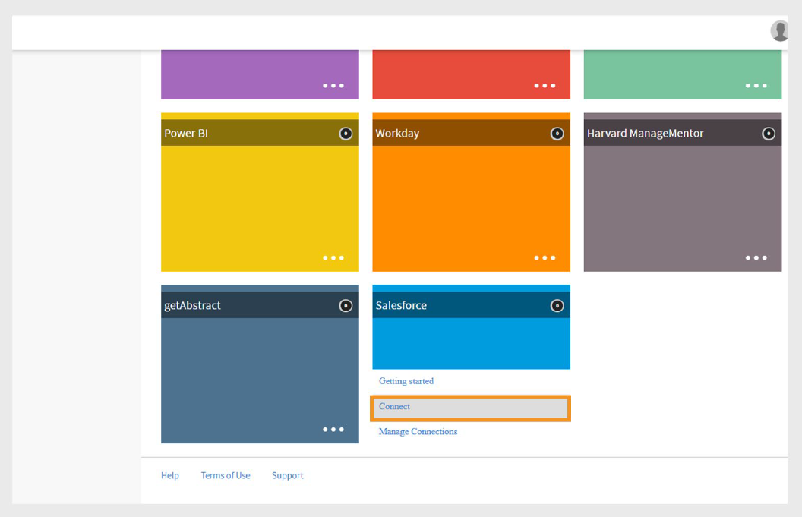

# Adobe Learning Manager用Salesforceコネクタ

## 概要

SalesforceコネクターはSalesforceアカウントとAdobe Learning Manager(ALM)アカウントを統合し、ユーザーの自動インポート、データ同期、学習記録の書き出しを可能にします。 このガイドでは、Salesforce内でコネクターの設定、ユーザーデータの管理、および学習インサイトの統合を行う方法について説明します。

Adobe Learning Manager用Salesforceコネクターを使用すると、ユーザーの自動インポート、カスタムデータマッピングのサポート、Salesforceへの学習記録の書き出しにより、スムーズな統合が可能になります。

このガイドに従うことで、以下の方法を学習できます。

- SalesforceとAdobe Learning Managerの間に安全な接続を確立します。
- Salesforceからの自動ユーザーインポートプロセスを設定します。
- SalesforceフィールドをAdobe Learning Manager属性に効果的にマッピングします。
- 包括的なレポートを作成するために、学習記録をSalesforceに書き出します。
- 対象となるデータ同期のフィルタリングとスケジューリングを設定します。

## Salesforceコネクタとは何ですか？

Salesforceコネクターは、Salesforce CRMとAdobe Learning Managerの間にシームレスなブリッジを構築する強力な統合ツールです。 このコネクタは、ユーザー情報、連絡先データ、および学習記録を2つのプラットフォーム間で自動的に同期させることにより、手動でのデータ入力を不要にします。

## 主な機能

### 属性のマッピング

これにより、SalesforceフィールドとAdobe Learning Managerユーザー属性の間に柔軟なリンクを作成できます。 名前、電子メール、マネージャーなどの標準フィールドを、Learning Managerの対応する属性にマッピングできます。 コネクターは、両方のプラットフォームでカスタムフィールドをサポートしています。また、データの精度を維持するために必要なフィールド検証が含まれており、将来の読み込みで再利用できるようにマッピング設定を保存できます。

### 自動ユーザー読み込み

これにより、自動インポートプロセスによってユーザーのオンボーディングとメンテナンスが合理化され、手動でのCSVファイル管理が不要になります。

- 中間ファイル形式を使用しないSalesforceユーザーオブジェクトからの直接読み込み。
- ユーザープロファイルの変更のリアルタイム同期。
- 標準ユーザーと外部連絡先の両方をサポートします。

### 自動スケジュールのインポート

手動操作を行わずにデータの通貨を維持する自動同期スケジュールを構成します。 日次、週次、またはカスタム間隔のスケジュールオプションから選択します。

- グローバル組織のタイムゾーン設定。
- システムのパフォーマンスを最適化するためのピーク/オフピークスケジューリング。

### ユーザーフィルター

- フィルタリング基準を適用して特定のユーザー集団を対象とし、データ同期効率を最適化します。
- 目的のトレーニングプログラムのための役割ベースのフィルタリング。
- 地域に関する実装に対する地理的または場所ベースのフィルタリング
- Salesforceの基準と式を使用したカスタムフィールドフィルタリング

## 前提条件

Salesforceコネクタを設定する前に、環境が次の要件を満たしていることを確認してください。

- [Salesforce組織のURL](https://myorg.salesforce.com)
- SalesforceとAdobe Learning Managerの両方の管理者ログイン資格情報。
- Salesforceのシステム管理者または同等の権限。
- 適切なライセンスを持つアクティブなAdobe Learning Managerアカウント

## Salesforce コネクターを構成する

Adobe Learning ManagerのSalesforceコネクターを使用すると、統合管理者はSalesforceとAdobe Learning Managerの間でユーザーデータと学習記録を自動的に同期できます。

Salesforceコネクタを作成するには：

1. 統合管理者としてログインします。
2. **Salesforce**&#x200B;を選択して、**Connect**&#x200B;を選択します。

   
   _[接続]ボタンが強調表示されたSalesforceコネクタを示す[Adobe Learning Managerコネクタ]ページ_

3. Salesforce組織のURLを入力し、**Connect**&#x200B;を選択します。 Salesforceのログインページが表示されます。

   
   _ユーザー名とパスワードの入力フィールドを表示するSalesforceログインフォーム_

4. ユーザー名とパスワードでログインします。 2要素認証やセキュリティ質問への回答など、追加の認証手順を完了します。

   認証が成功すると、「コネクタ概要」ページが表示され、システム間で確立された接続が確認されます。

   
   _正常な接続ステータスを示すSalesforceコネクタの概要ページ_

### マップ属性

属性マッピングを理解する属性マッピングにより、SalesforceデータフィールドとAdobe Learning Managerユーザー属性の間に重要な関連付けが作成され、ユーザー情報がシステム間で正確に転送されるようになります。

#### マッピング要件

- すべての必須Adobe Learning Managerフィールドは、対応するSalesforceフィールドにマッピングする必要があります。
- マッピング構成は再利用可能で、複数のインポート間で永続的

属性をマッピングするには、次の手順に従います。

1. Salesforceコネクタの概要ページに移動します。
2. **社内ユーザー**&#x200B;を選択し、**マッピングの構成**&#x200B;を選択します。
3. 次のいずれかを選択します。

   - **ユーザー：**&#x200B;従業員または社内チームメンバーが使用する標準のSalesforceアカウント
   - **連絡先：**&#x200B;顧客、パートナー、ベンダーなどの外部の個人。

4. Adobe Learning Managerのアクティブフィールドを、マッピングページのSalesforceの列と一致させます。 **マネージャー**&#x200B;フィールドは、ユーザーマネージャーの電子メールフィールドにマップする必要があります。

   
   _左側にAdobe Learning Managerユーザー属性が表示され、右側にSalesforceフィールドのドロップダウン選択が表示されるフィールドマッピングインターフェイス_

5. 「**保存**」を選択して、マッピングを完了します。

## ユーザーと連絡先の読み込み

Salesforceコネクターを使用すると、Adobe Learning ManagerはSalesforceアカウントに接続し、設定に基づいてユーザーを自動的に読み込むことができます。

- **内部ユーザー**: Salesforceユーザーアカウントを持つ従業員およびスタッフメンバー。
- **外部連絡先**：顧客、パートナー、ベンダー、その他の外部関係者。
- **混在インポート**:ユーザーと連絡先の組み合わせを単一の同期処理で処理します。
- **フィルターされたインポート**：特定の条件に基づくターゲット同期。

Salesforceコネクターを使用すると、Adobe Learning ManagerはSalesforceアカウントに接続し、設定に基づいてユーザーを自動的に読み込むことができます。

コネクターでは、標準のSalesforceユーザーに加えて、連絡先の読み込みがサポートされています。 これにより、クライアントやパートナーなどの外部の関係者にトレーニングプログラムを拡張できます。

連絡先をインポートするには、次の手順に従います。

1. **コネクタ**&#x200B;ページで&#x200B;**Salesforce**&#x200B;を選択します。
2. 接続ページで&#x200B;**社内ユーザーのインポート**&#x200B;を選択します。

   
   _[内部ユーザーのインポート]オプションが強調表示されているSalesforceコネクタページ_

3. **ユーザーの読み込み**&#x200B;ページで&#x200B;**連絡先**&#x200B;を選択します。
4. **はい**&#x200B;を選択して、**インポート前に連絡先をフィルター**&#x200B;するオプションを選択します。 **
5. 以下のオプションを設定します。

   - **連絡先列を選択：** Adobe Learning Managerにインポートするフィールドを選択します。
   - **値の指定：**&#x200B;選択したフィールドを表す値を選択します。
   - Salesforce属性とAdobe Learning Managerフィールドのマッピング

   
   _フィルターオプションとフィールドマッピングを示す連絡先のインポート構成_

6. 「**保存**」を選択します。
7. [**いいえ]を選択した場合。**&#x200B;をクリックすると、連絡先をフィルタリングせずにフィールドを直接マップできます。

## 学習記録の書き出し

学習記録の書き出し機能を使用すると、Adobe Learning ManagerのデータをSalesforceと共有して、学習結果とCRMのデータを組み合わせる包括的なレポート機能と分析機能を構築できます。

### Salesforce のカスタムオブジェクト

Adobe Learning Managerから学習記録を書き出す前に、Salesforceでカスタムオブジェクトを作成します。 カスタムオブジェクトを使用すると、組織や業界のニーズに固有のデータを保存できます。 詳細については、[Salesforceカスタムオブジェクト](https://trailhead.salesforce.com/en/content/learn/modules/data_modeling/objects_intro)を参照してください。

### Adobe Learning Managerパッケージのインストール

Adobeには、必要なカスタムオブジェクトを作成する事前定義済みパッケージが用意されています。

- [パッケージ1](https://test.salesforce.com/packaging/installPackage.apexp?p0=04t1k0000008WPJ):コア学習目標とフィールド
- [パッケージ2](https://test.salesforce.com/packaging/installPackage.apexp?p0=04t1k0000008WPT)：拡張学習分析オブジェクト
- [パッケージ3](https://test.salesforce.com/packaging/installPackage.apexp?p0=04t1k0000008WPi)：追加のレポートおよび統合オブジェクト

>[!IMPORTANT]
>
>パッケージURLの[test.salesforce.com](https://acrobat.adobe.com/home/test.salesforce.com)を、実際のSalesforce組織ドメインに置き換えます。

### パッケージのインストールプロセス

パッケージをインストールするには：

1. Salesforceに管理者としてログインします。
2. ブラウザーで各パッケージURLに移動します。
3. パッケージごとにインストールウィザードに従い、学習データにアクセスするユーザーに適切な権限を付与します。
4. Salesforceのカスタムオブジェクト名を変更します。
5. イベントを選択し、**「保存」**&#x200B;をクリックします。

>[!NOTE]
>
>パッケージのインストール後に追加したすべてのアクティブフィールドに、システム管理者アクセス権が付与されていることを確認します。

### レコードの書き出し

レコードをSalesforceに書き出すには：

1. **Salesforce**&#x200B;コネクタページで&#x200B;**統合レコードの書き出し**&#x200B;を選択します。
2. 次からイベントを選択します。

   - 新規ユーザーの追加
   - トレーニングの登録
   - トレーニングの完了
   - スキルの登録
   - スキルの完了

3. **リンクイベントの**&#x200B;オプションで&#x200B;**連絡先オブジェクト**&#x200B;を選択します。 これにより、Adobe Learning Managerに存在するがSalesforceには存在しないユーザーがSalesforceで作成されることが保証されます。

   
   _イベントの選択とリンクのオプションを示す学習記録の書き出し設定_

>[!NOTE]
>
>1つのアカウント内で複数の接続を作成できます。 Salesforceでは、各接続が最大3つのカスタムオブジェクトをサポートできます。 同じSalesforceアカウントに複数の接続を作成するには、最大3つのパッケージをインストールできます。 インストールされるパッケージの数は、目的の接続の数と一致する必要があります。

## Salesforceアプリケーションの設定

Adobe Learning ManagerはSalesforceアプリケーションパッケージを提供します。 Salesforceインスタンスにインストールして設定すると、セールスユーザーはSalesforceポータル内から直接トレーニングにアクセスして完了できます。 このアプリを使用すると、ユーザーはSalesforceを離れることなく、新しいコースの検索、パーソナライズされた推奨事項の表示、コンテンツの利用を行うことができます。

### Salesforceアプリケーションへのアクセス

Salesforceアプリケーションを設定するには、次の手順を実行します。

1. 統合管理者としてログインします。
2. **アプリケーション**&#x200B;を選択して、**おすすめアプリ**&#x200B;を選択します。
3. **Salesforce**&#x200B;を選択します。

   
   _Salesforceアプリのタイルがハイライト表示され、「おすすめアプリ」セクションが表示されているAdobe Learning Managerアプリケーションページ_

4. 説明テキストボックスに表示されている&#x200B;**アプリケーションID**&#x200B;と&#x200B;**クライアントシークレット**&#x200B;を書き留めます。

   
   _説明ボックスにアプリケーションIDとクライアントシークレットが表示されている、Adobe Learning ManagerのSalesforceアプリケーションの詳細ページ_

5. **承認**&#x200B;を選択して、アプリケーションを有効にします。

### アクセストークンの生成

アクセストークンを生成するには、次の手順に従います。

1. Adobe Learning Managerで&#x200B;**開発者向けリソース**&#x200B;に移動します。
2. **テストおよび開発用のアクセストークン**&#x200B;を選択します。
3. **OAuthコードの取得**&#x200B;セクションで、クライアントID （アプリケーションID）を入力します。範囲は&#x200B;**admin:read,admin:write**&#x200B;に設定する必要があります。
4. 「**送信**」を選択します。
5. **更新トークンの取得**&#x200B;セクションで、**クライアントID**&#x200B;と&#x200B;**クライアントシークレット**&#x200B;を入力します。
6. 「**送信**」を選択し、更新トークンとアクセストークンを確認します。

>[!IMPORTANT]
>
>生成された更新トークンとアクセストークンを書き留めます。

### Salesforceアカウントの作成

Salesforceアカウントをお持ちでない場合は、次の手順に従って、Adobe Learning Managerアカウントと同じメールアドレスを使用してアカウントを作成します。 デベロッパー版とエンタープライズ版のどちらでも使用できます。 Adobe Learning Managerアカウントに関連付けられているのと同じ電子メールIDを使用して、サインアップすることが重要です。

1. [Salesforceデベロッパーのサインアップページ](https://developer.salesforce.com/signup)に移動します。
2. Adobe Learning Managerアカウントに使用しているメールアドレスを使用して、必要な詳細情報を入力します。
3. 受信トレイを確認し、Salesforceから送信された電子メールを介してアカウントを確認します。
4. パスワードを設定し、Salesforceにログインします。
5. ログインしたら、設定時に使用するSalesforceのURL（例：https://yourorg.lightning.force.com）をメモします。

### Adobe Learning Managerパッケージのインストール

このセクションでは、Salesforce環境へのAdobe Learning Managerパッケージのインストールについて説明します。

>[!IMPORTANT]
>
>Adobe Learning Managerアプリでは、Salesforce Lightningビューのみがサポートされます。 続行する前に、Lightning Experienceが有効になっていることを確認します。

#### パッケージのインストール

パッケージをインストールするには：

1. [Adobe Learning ManagerパッケージのURL](https://login.salesforce.com/packaging/installPackage.apexp?p0=04t1k0000008WOQ)を開きます。
2. ログインページにユーザー名とパスワードを入力します。
3. 「**インストール**」を選択します。 インストールページで、「管理者のみにインストール」オプションが選択されたままになります。変更しないでください。
4. 「**完了**」を選択します。 **インストール済みパッケージ**&#x200B;のページが表示され、Adobe Learning Managerのインストール済みパッケージを確認できます。

インストール済みパッケージページにリダイレクトされ、Adobe Learning Managerパッケージのインストールを確認できます

#### アプリケーションの設定

アプリケーションを設定するには、次の手順を実行します。

1. **アプリケーションランチャー**&#x200B;を選択します（設定の横にある9点グリッドアイコン）
2. Adobe Learning Managerを検索します。
3. アプリを構成するには、**構成**&#x200B;を選択します。
4. **新規**&#x200B;を選択し、次の詳細を追加します：

   - **Config：**&#x200B;任意の名前を入力します。
   - **ClientID**：最初のセクションで取得した値を入力します。
   - **ClientSecret:**&#x200B;最初のセクションで取得した値を入力します。
   - **RefreshToken:**&#x200B;最初のセクションで取得した値を入力します。
   - **LearningManagerBaseURL:** Adobe Learning ManagerがホストされているサイトのURLです。

### リモートサイトの設定

Salesforceでは、Adobe Learning Managerなどの外部サービスとの通信を許可するためのリモートサイト設定が必要です。

#### リモートサイト設定の追加

リモートサイトの設定を追加するには：

1. Salesforceで、右上隅の&#x200B;**設定**&#x200B;を選択します。
2. ページの右上隅にある&#x200B;**設定**&#x200B;を選択します。
3. **クイック検索**&#x200B;で&#x200B;**リモートサイト設定**&#x200B;を検索します。
4. **新しいリモートサイト**&#x200B;を選択します。
5. 詳細を入力します：

   - **リモートサイト名：**&#x200B;任意の名前を入力します（例： Adobe Learning Manager）。
   - **リモートサイトのURL:** Adobe Learning ManagerがホストされているURLを入力します。
6. 「**保存**」を選択します。

### 通知の設定

通知を設定して、ユーザーに学習活動や更新情報を通知します。

#### カスタム通知の作成

通知を有効にするには：

1. 右上隅の&#x200B;**設定**&#x200B;を選択します。
2. **カスタム通知**&#x200B;を検索し、**新規**&#x200B;を選択します。
3. 次の情報を入力します。

   - **カスタム通知名：** LearningManagerNotification
   - **API名：** LearningManagerNotification

4. **デスクトップ**&#x200B;と&#x200B;**モバイル**&#x200B;の両方を、サポートされるチャネルとして選択してください。
5. 「**保存**」を選択します。

#### モバイルプッシュ通知を有効にする（オプション）

モバイルデバイスで通知を受信するユーザーの場合：

モバイルデバイスのプッシュ通知を有効にするには、次の手順に従います：

1. 携帯電話にSalesforceモバイルアプリをインストールします。
2. 資格情報を使用してアプリにログインします。
3. **セットアップ**&#x200B;に移動し、**通知配信設定**&#x200B;を選択します。
4. iOS および Android 用の Salesforce を追加します。

### ユーザー設定と権限

このセクションでは、Salesforce内でAdobe Learning Managerアプリのユーザーアクセスと権限を設定する方法について説明します。

#### ユーザープロファイルについて

Adobe Learning Managerアプリは、Adobe Learning Managerのロールに対応した様々なユーザープロファイルをサポートしています。

- は、
- 統合管理者
- 学習プログラム / 資格認定を
- 学習者
- カスタムプロファイル（必要に応じて）

#### ユーザープロファイルの割り当てまたは作成

既存のプロファイルを使用するか、Adobe Learning Managerユーザー用のカスタムプロファイルを作成することができます。

**既存のプロファイルを使用する**

1. **セットアップ**&#x200B;に移動し、**ユーザー**&#x200B;を選択します。
2. **プロファイル**&#x200B;を選択します。
3. ユーザーの役割に合ったプロファイルを選択します
4. パッケージのインストール時に、このプロファイルをユーザーに割り当てます。

**カスタムプロファイルの作成**

1. **設定**」に移動し、**人のユーザーを選択します。 **
2. **プロファイル**&#x200B;を選択します。
3. **新しいプロファイル**&#x200B;をクリックします。
4. Adobe Learning Managerユーザー向けにカスタマイズされた、既存のプロファイルに基づくカスタムプロファイルを作成します。

#### プロファイルの設定

プロファイルを設定するには、次の手順を実行します。

1. パッケージのインストール後、****&#x200B;を構成し、**新規**&#x200B;を選択します。
2. 次の情報を入力します。

   - **構成名**
   - **クライアントID**
   - **ClientSecret**
   - **LearningManagerBaseURL**
   - **リダイレクトを無効にする**

>[!NOTE]
>
>すべての学習者が表示できるように、Adobe Learning Managerアプリが有効になっていることを確認してください。

#### ユーザー権限の設定

ユーザーを選択し、Adobe Learning Managerアプリにアクセスするために必要な権限を割り当てます。

#### プロファイル設定の更新

1. プロファイル（標準プロファイルなど）を選択してから、**編集**&#x200B;を選択します。
2. 「**カスタムアプリ設定**」セクションで、**Adobe Learning Manager**&#x200B;のチェックボックスをオンにして、アプリにアクセスできるようにします。
3. **カスタムタブ設定**&#x200B;セクションで、**学習者ホーム**&#x200B;を&#x200B;**デフォルト**&#x200B;に設定します。
4. 「**保存**」を選択して変更を適用します。

プロファイルが割り当てられた学習者は、SalesforceでAdobe Learning Managerアプリにアクセスできるようになりました。

Adobe Learning Manager用Salesforceコネクタの設定が完了しました。 ユーザーはSalesforce内から学習コンテンツに直接アクセスできるようになり、組織のトレーニングプログラムへの導入とエンゲージメントが向上します。
