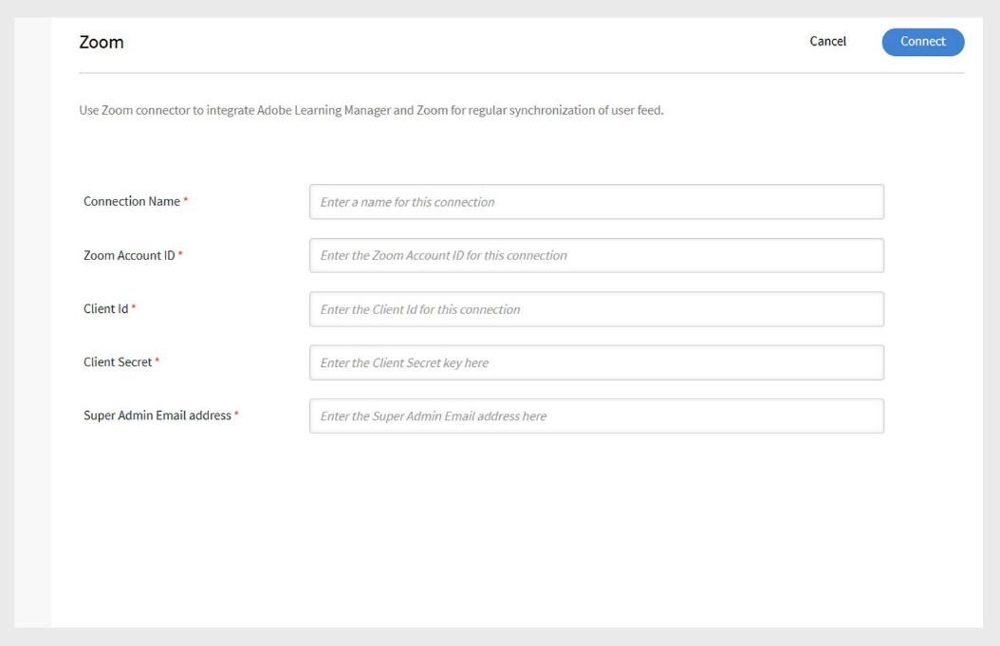

# Adobe Learning Managerのズームコネクタ

## 概要

Adobe Learning ManagerのZoomコネクターを使用すると、Zoomとシームレスに連携して、ライブバーチャルクラスルームセッションを提供できます。 この統合により、インストラクターはLearning Managerから直接Zoomミーティングをホストし、学習者を登録して、出席と完了データを追跡できます。 学習者は自動的に招待され、Adobe Learning Managerアカウントからセッションに参加できます。 セッションが終わると、出席とパフォーマンスのデータがAdobe Learning Managerに同期され、レポートとトラッキングが行われます。

## Zoomコネクターの設定

Zoomコネクターを設定するには：

1. Adobe Learning Managerに統合管理者としてログインします。
2. **ズーム**&#x200B;タイルにカーソルを合わせます。

   
   _Adobe Learning ManagerでZoomコネクタを構成する_

3. **Connect**&#x200B;を選択します。 Zoomコネクター設定ページが開きます。
4. それぞれのフィールドに次のアカウント情報を入力します。 Zoomアカウントの管理者から、次の資格情報を取得できます。

   * 接続名
   * ZoomアカウントID
   * クライアント ID
   * クライアントシークレット
   * スーパー管理者のメールアドレス

   
   _構成の詳細を入力して、Zoomコネクタを設定します_

5. **接続**&#x200B;を選択して統合を確立します。

>[!NOTE]
>
>コネクタを有効にすると、**学習者は、ユーザーデータが正しく同期されるように、ZoomアカウントとAdobe Learning Managerアカウントの両方に同じ電子メールアドレス**&#x200B;を使用する必要があります。

## Zoomコースの作成

接続が確立されると、次のようになります。

1. **作成者**&#x200B;としてログインし、新しいバーチャルクラスルームコースを作成します。
2. コースの作成時に会議システムとして&#x200B;**Zoom**&#x200B;を選択します。
3. 管理者、マネージャー、またはセルフ登録を通じて、学習者をコースに割り当てます。
4. 登録時に、学習者はコースの詳細を記載した電子メールを受け取ります。
5. 学習者は自分のAdobe Learning Managerアカウントにログインしてコースにアクセスし、Zoomセッションに参加できます。

## 出席と完了の追跡

仮想セッションの終了後は、次の操作を行います。

* Adobe Learning Managerは、Zoomから自動的に完了ステータスを受け取ります。
* 管理者は、Adobe Learning Managerで出席とスコア付けのレポートを表示して、学習者の参加とパフォーマンスを追跡できます。

## Zoomサーバー間OAuthアプリの作成

Adobe Learning ManagerでZoomコネクターを使用するには、Zoomサーバー間OAuthアプリを作成し、必要なスコープを設定する必要があります。

### 必要なOAuth範囲

Zoomでアプリケーションを作成する場合は、次のスコープが選択されていることを確認してください。

```
| Scope Description | Zoom Scope |
|---|---|
| View all user meetings | meeting:read:admin |
| View and manage all user meetings | meeting:write:admin |
| View report data | report:read:admin |
| View all user information | user:read:admin |
| Manage users | user:write:admin |
| Add a meeting registrant | meeting:write:registrant:admin |
| List all meeting registrants | meeting:read:list_registrants:admin |
| Manage sub-account meetings | meeting:write:meeting:master |
| View meeting participants report | report:read:list_meeting_participants:admin |
```
