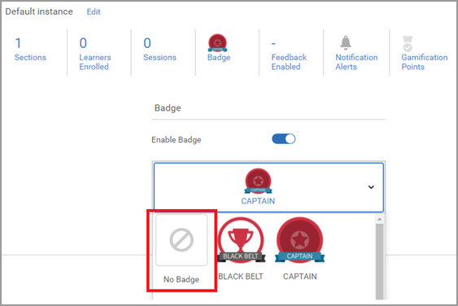
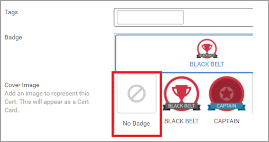

# バッジを割り当てられない

## 問題

コースやトレーニングを完了した後でも、バッジが正しく付与されません。

## 説明

学習者がコース／学習プログラム／資格認定を完了しても、学習者にバッジが付与されません。

## 原因

学習者が学習目標を完了した後に、学習目標に割り当てられたバッジが追加されます。

以前のバージョンでは、学習者が学習目標を完了した時点で学習目標にバッジが割り当てられていなかった場合、後からバッジを加える機能はありませんでした。

現在のバージョンでは、この機能を使用できます。

## 解決策

学習者にこの問題が発生した場合は、次の手順を試します。

## コース／学習プログラム

1. 管理者してログインします。

1. 関連する学習目標（コース／学習プログラム）を開きます。

1. **[!UICONTROL インスタンス]** > **[!UICONTROL バッジ]**&#x200B;をクリックします。

   

1. 学習目標からバッジを削除して&#x200B;**[!UICONTROL 「保存」]**&#x200B;をクリックします。

   

1. バッジを学習目標に再割り当てして&#x200B;**[!UICONTROL 「保存」]**&#x200B;をクリックします。

   この手順により、学習目標に登録されたすべての学習者にバッジが割り当てられます。

## 資格認定

1. 管理者としてログインします。
1. 資格認定を開きます。
1. **[!UICONTROL 概要]** > **[!UICONTROL バッジ]**&#x200B;をクリックします。
1. 資格認定からバッジを削除して&#x200B;**[!UICONTROL 「保存」]**&#x200B;をクリックします。

   

1. 資格認定にバッジを再割り当てして&#x200B;**[!UICONTROL 「保存」]**&#x200B;をクリックします。
