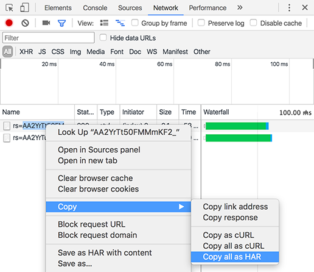

# HAR ファイルを生成する

Google Chrome で HAR ファイルを生成する方法については、こちらをご覧ください。

HAR ファイルを生成するには、以下の手順に従います。

1. Google Chrome ウィンドウを開き、新しいタブを開きます。
1. ページ対応の開発者ツールを開き、右クリック／ Inspect をクリックします。
1. 「**[!UICONTROL ネットワーク]**」タブを開きます。赤い録音ボタンがアクティブであることを確認します。 有効にする **[!UICONTROL ログを保持]** チェックボックスをオンにします。

   

   *「ネットワーク」タブで「ログの保存」チェックボックスをオンにします*

1. 認証情報を使用して [Learning Manager](https://learningmanager.adobe.com/acapindex.html) にログインし、コースに参加します。問題発生の原因となるすべての操作を行います。
1. デベロッパーツールで、右クリックして **すべてをコンテンツ付きHARとして保存**.

   Google Chromeの一部のバージョンでは、次の操作が必要になる場合があります **[!UICONTROL コピー]** > **[!UICONTROL すべてをHARとしてコピー]**.

   

   *すべてのHARファイルをコピー*

1. コピーした内容をメモ帳ファイルに貼り付けます。デスクトップに別名で保存 **logs.har** 電子メールでAdobeに送信します。
