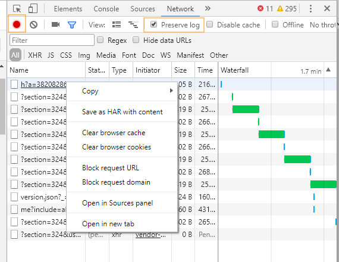

# HAR ファイルを生成する

Google Chrome で HAR ファイルを生成する方法については、こちらをご覧ください。

HAR ファイルを生成するには、以下の手順に従います。

1. Google Chrome ウィンドウを開き、新しいタブを開きます。
1. ページ対応の開発者ツールを開き、右クリック／ Inspect をクリックします。
1. 「**[!UICONTROL ネットワーク]**」タブを開きます。 赤い録音ボタンがアクティブであることを確認します。 「**[!UICONTROL ログの保存]**」チェックボックスを有効にします。

   

   *[ネットワーク]タブの[ログの保存]チェックボックスをオンにします*

1. 認証情報を使用して [Learning Manager](https://learningmanager.adobe.com/acapindex.html) にログインし、コースに参加します。 問題発生の原因となるすべての操作を行います。
1. 開発者ツールで、右クリックして&#x200B;**すべてをコンテンツ付きHARとして保存**&#x200B;を選択します。

   Google Chromeの一部のバージョンでは、**[!UICONTROL コピー]**/**[!UICONTROL すべてをHARとしてコピー]**&#x200B;を選択する必要があります。

   

   *すべてのHARファイルをコピーする*

1. コピーした内容をメモ帳ファイルに貼り付けます。 デスクトップに&#x200B;**logs.har**&#x200B;として保存し、Adobeにメールで送信します。
