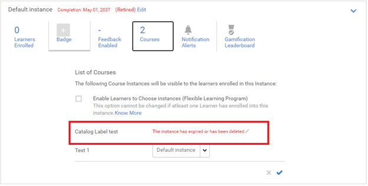

# 学習プログラムの廃止に関する問題

## 問題

学習プログラムが自動的に廃止されます。

## 原因

管理者/作成者がLPを明示的に廃止せずに、学習プログラムが廃止される場合があります。

この問題が発生するのは、学習プログラムがコースの集まりであるためです。 上位のトレーニングに、廃止されたインスタンスを含むコースがあるか、コースインスタンスが廃止された場合、トレーニングは廃止されます。

## 解決策

廃止されたインスタンスを含むコースを確認するには、次の手順に従います。

1. 管理者としてログインし、関連する学習プログラムを起動します。

1. クリック **[!UICONTROL インスタンス]** > **Cコース**. このページには、この学習プログラムに含まれるすべてのコースが一覧表示されます。 廃止されたインスタンスを含むコースを確認できます。

   

   *すべてのコースの一覧を表示*

1. 廃止されたコースインスタンスを見つけたら、をクリックします **[!UICONTROL コース]** > **[!UICONTROL コースを開く]**.

1. クリック **[!UICONTROL インスタンス]**. 廃止されたインスタンスで、をクリックします。 **[!UICONTROL 編集]** 次に、完了日を、インスタンスを廃止する将来の日付に編集します。

   

   *コースの完了日の編集*

1. 完了したら、下の画像に示すようにドロップダウンをクリックします。 次に、 **[!UICONTROL インスタンスを再度開く]**.

   

   *コースのインスタンスを表示*

1. 関連する学習プログラムにアクセスします。 クリック **[!UICONTROL インスタンス]** をクリックし、前の手順を実行して学習プログラムのインスタンスを再度開きます。
