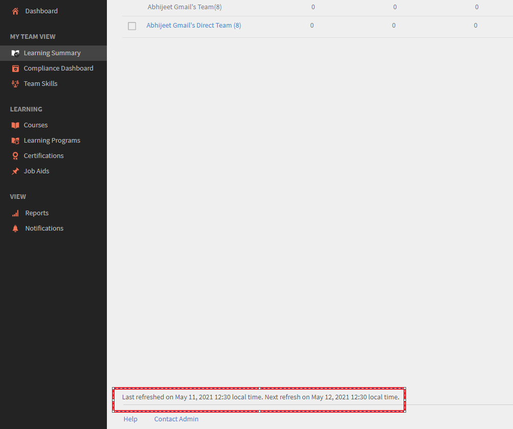

# 学習の概要に最新のデータが表示されない

## 問題

登録、完了、進行中などの最新データが、Adobe Learning Manager の学習の概要に表示されません。

学習者がコースを完了しても、 管理者やマネージャーが学習の概要を確認したときに、最新のデータが表示されないことがあります。

## 原因

この問題が発生するのは、選択した条件に基づいて、学習の概要が異なるタイミングで更新されるためです。

## 更新期間

学習の概要のデータは、次のスケジュールに従って更新されます。

1. **当月：**&#x200B;このデータは毎日更新されます。 最後に更新された時刻が、ページの下部に表示されます。
1. **過去 3 か月：**&#x200B;このデータは月に 1 回更新されます。
1. **過去 12 か月：**&#x200B;このデータは月に 1 回更新されます。

*ページ下部にデータ更新メッセージが表示されます*
