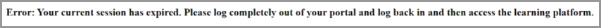

# Learning Manager におけるログインの問題

## 問題

Adobe Learning Manager にログインできません。

## エラー

Adobe Learning Manager にログインしようとすると、以下のエラーメッセージが表示されます。

*期限切れのセッションのエラーメッセージ*

## 理由

ユーザーが SSO でログインすると、ブラウザーに保存されるセッションクッキーが作成されます。 それにより、他のアプリケーションにログインできるようにもなります。 ほとんどの SSO は、24 時間後にログアウトするように設定されています。 この場合、ユーザーは新たなセッションのためにもう一度認証を行う必要があります。

場合によっては、古い SSO クッキーが原因で、ユーザーがシステムにアクセスできないことがあります。 認証するために、このような Cookie は Adobe Learning Manager に転送されます。 ユーザーが長時間ブラウザーを閉じなかった場合や、ログアウトしていない場合、セッションは終了しません。

Adobe Learning Managerはこれらの古いCookieを拒否するため、エラーが発生します。

## 解決策

古い Cookie が Adobe Learning Manager に拒否される場合は、次のオプションを試行してください。

1. ブラウザーのクッキーとキャッシュをクリアします。 詳細については、この[文書](unable-log-in-learning-manager.md)を参照してください。

   また、IDP 管理者は、特定の時間が経過したら強制的にログアウトするように設定することもできます。 この手順では、新しいセッションを開始するときに、ユーザーを再認証します。

このエラーが発生する理由は他にもありますが、一般的なシナリオは上記のとおりです。

## 参照リンク：

[Microsoft：有効期間の条件付きアクセスセッション](https://docs.microsoft.com/ja-jp/azure/active-directory/conditional-access/howto-conditional-access-session-lifetime)
