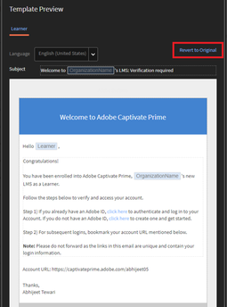

# 変更済みテンプレートからトリガーされた電子メールリンクにより、Learning Manager でエラーが発生

## 問題

自動メール/ようこそメール/登録メールのリンクをクリックするとエラーが発生します。

**エラー**

HTTP ステータス 400 - 無効な要求

## 原因

通常では電子メールテンプレートが誤ってカスタマイズされた場合に発生します。

**解決策**

カスタマイズを原因とするリンクの破損にともなうエラーを回避するには、次の手順に沿って操作します。

1. 管理者としてログインします。
1. 左側のパネルで「**[!UICONTROL 電子メールテンプレート]**」をクリックします。

1. 必要なテンプレートに進み、クリックして変更します。

   **「テンプレート」のプレビュー**&#x200B;ウィンドウが開きます。

   

   電子メールテンプレートを編集する場合は、以下の点にご注意ください。

   * 電子メールテンプレートは、Learning Manager のインターフェースで変更することを推奨します。
   * 変更済みのテンプレートをコピーし Notepad/Word ファイルに貼り付け、変更内容のコピーを保存します。
   * 青色でハイライト表示されているテンプレートのダイナミックテキストは置き換えないでください。 例：「**組織名**」、「**学習者**」、「**ここをクリック**」、「**証明書の名前**」など。

1. 「**[!UICONTROL 保存]**」をクリックして、テンプレートに適用された変更を確認します。
1. 電子メールをトリガーし、リンクが予定どおり動作するかどうかを確認します。
1. 変更されたテンプレートに対してオプション&#x200B;**[元に戻す]**&#x200B;をクリックして、設定を元に戻します。
