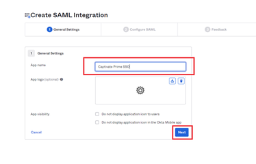

# Okta Active DirectoryとAdobeのLearning Managerの連携 {#okta-active-directory-integration-with-adobe-learning-manager}

この文書では、AdobeのLearning ManagerとOkta Active Directory(AD)を連携する方法について説明します。 AdobeのLearning ManagerとOkta ADを連携すると、次の操作が可能になります。

* Okta ADでLearning Managerユーザーのアクセスを確認および制御します。
* ユーザーがOkta ADアカウントを使用して、AdobeのLearning Managerに自動的にログインできるようにします。
* Oktaポータルでアカウントを一元的に管理します。

AdobeのLearning Managerは、SSOを開始するIDプロバイダー(IdP)およびサービスプロバイダー(SP)に対応しています。

## OKTAでのアプリケーションの作成

1. Okta ADに管理者としてログインします。
1. クリック **[!UICONTROL アプリケーション]**. Oktaのアプリケーションストアが開きます。

   

   *Oktaでアプリケーションストアを表示*

1. クリック **[!UICONTROL アプリ統合の作成]**.

   

   *「アプリ統合を作成」を選択*

1. 選択 **[!UICONTROL SAML 2.0]** 新しいアプリ統合ウィンドウから。

   

   *SAML2.0オプションを選択*

1. 選択 **[!UICONTROL SAML統合を作成]** > **[!UICONTROL 一般設定ページ]**. アプリケーション名を入力します。

   任意の名前を付けて、アプリケーションを一意に識別できます。 完了したら、 **[!UICONTROL Next]**.

   

   *アプリケーションの名前を入力*

1. SAML設定の構成ページで、次の手順を実行します。

   **IDP設定の場合：**

   1. シングルサインオンURLフィールドに、次のURLを入力します。 [https://learningmanager.adobe.com/saml/SSO](https://learningmanager.adobe.com/saml/SSO)
   1. 対象URLフィールドに、次のURLを入力します。 [https://learningmanager.adobe.com](https://learningmanager.adobe.com/)
   1. を **名前IDの形式** ドロップダウンボックスで、 **電子メールアドレス**.
   1. を **アプリケーションのユーザー名** ドロップダウンで、Oktaユーザー名を選択します。
   1. 追加の属性を渡す場合は、 **Attributesステートメント** （オプション）

   

   *SAML属性の追加*

   **SPのセットアップの場合：**

   1. シングルサインオンURLフィールドに、次のURLを入力します。 [https://learningmanager.adobe.com/saml/SSO](https://learningmanager.adobe.com/saml/SSO)
   1. 対象URLフィールドに、次のURLを入力します。 [https://learningmanager.adobe.com](https://learningmanager.adobe.com/)
   1. 「名前IDの形式」ドロップダウンボックスで、 **電子メールアドレス**.
   1. 「アプリケーションのユーザー名」ドロップダウンで、Oktaのユーザー名を選択します。
   1. をクリック **詳細設定を表示**.
   1. 未満 **署名アルゴリズム**、RSA-SHA256を選択します。
   1. を **アサーションアルゴリズム**、SHA256を選択
   1. を **アサーションの暗号化** dropbox、選択 **暗号化**.

   1. を **暗号化証明書** オプションで、Adobeが共有する証明書ファイルをアップロードします。
   1. 追加の属性を渡す場合は、 **Attributesステートメント** （オプション）。

   

   *追加の属性を追加*

   完了したら、 **[!UICONTROL Next]**.

1. この **フィードバック**  tabはオプションです。 オプションを選択してフィードバックを送信したら、 **[!UICONTROL 終了]**.

   

   *SAMLの設定を完了*

## IDPから始まるURLとメタデータファイルを抽出する

IdP/SPから始まるURLとメタデータファイルを表示するには、次の手順を実行します。

1. 作成したアプリケーションを開きます。
1. 下に **シングルサインオン** タブをクリック **[!UICONTROL 手順を表示]**.

   

   *「SSO」タブを選択*

   **IDPの場合：**

   1. IDプロバイダーのシングルサインオンURLは、IdPから始まるURLです。
   1. 下にあるすべてのテキストをコピー **オプション** フィールドに入力します。
   1. 新しいメモ帳ドキュメントを開き、コピーしたテキストをペーストします。
   1. クリック **[!UICONTROL ファイル]** > **[!UICONTROL 別名で保存]** > &quot;filename.xml&quot;. これがメタデータファイルになります。

   **SPの場合：**

   1. IDプロバイダーのシングルサインオンURLは、IdPから始まるURLです。
   1. IDプロバイダーの発行者はエンティティIDです。
   1. 下にあるすべてのテキストをコピー **オプション** フィールドに入力します。
   1. 新しいメモ帳ドキュメントを開き、コピーしたテキストをペーストします。
   1. クリック **[!UICONTROL ファイル]** > **[!UICONTROL 別名で保存]** > **[!UICONTROL filename.xml]**. これがメタデータファイルになります。

   

   *SP XMLファイルの保存*

   このファイルはXML形式で保存する必要があります。

## Learning ManagerのSSO Adobeを構成する

Learning ManagerのAdobeのSSOを設定するには、以下の記事で説明されている手順を実行します。

<!--

article not in TOC

[SSO Authentication](/help/migrated/kb/sso-authentication-for-learning-manager.md)
-->