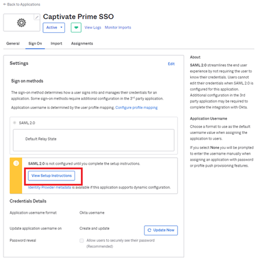

# Adobe Learning Manager と Okta Active Directory の連携 {#okta-active-directory-integration-with-adobe-learning-manager}

このドキュメントでは、Adobe Learning ManagerとOkta Active Directory(AD)を連携する方法について説明します。 Adobe Learning ManagerとOkta ADを連携すると、次の操作が可能になります。

* Okta AD で Learning Manager ユーザーのアクセスを確認および管理する。
* ユーザーが Okta AD アカウントを使って、Adobe Learning Manager に自動的にサインインできるようにする。
* Okta ポータルでアカウントを一元的に管理する。

Adobe Learning Manager は、SSO を起動する ID プロバイダー（IdP）およびサービスプロバイダー（SP）に対応しています。

## Okta でアプリケーションを作成する

1. Okta AD に管理者としてログインします。
1. **[!UICONTROL 「アプリケーション」]**&#x200B;をクリックします。 これで、Okta のアプリケーションストアが開きます。

   

   *Oktaのアプリケーションストアを表示する*

1. **[!UICONTROL [アプリ統合の作成]]**&#x200B;をクリックします。

   

   *[アプリ統合の作成]を選択*

1. 新しいアプリ統合ウィンドウから&#x200B;**[!UICONTROL SAML 2.0]**&#x200B;を選択します。

   

   *SAML2.0オプションを選択*

1. **[!UICONTROL SAML統合を作成]**/**[!UICONTROL 一般設定ページ]**&#x200B;を選択します。 アプリケーション名を入力します。

   任意の名前を付けて、アプリケーションを一意に識別できます。 設定完了後に&#x200B;**[!UICONTROL 「次へ」]**&#x200B;をクリックします。

   

   *アプリケーション名を入力してください*

1. SAML 設定の構成ページで、次の手順を実行します。

   **IDPセットアップの場合：**

   1. シングルサインオンURLフィールドに、次のURLを入力します： [https://learningmanager.adobe.com/saml/SSO](https://learningmanager.adobe.com/saml/SSO)
   1. 対象URLフィールドに、次のURLを入力します： [https://learningmanager.adobe.com](https://learningmanager.adobe.com/)
   1. **[名前IDの形式]**&#x200B;ドロップダウンボックスで、**電子メールアドレス**&#x200B;を選択します。
   1. **「アプリケーションユーザー名」**&#x200B;ドロップダウンで、Okta のユーザー名を選択します。
   1. オプション：追加の属性を渡す場合は、**属性ステートメント**&#x200B;の下に属性を追加します。

   

   *SAML属性の追加*

   **SPのセットアップ：**

   1. シングルサインオンURLフィールドに、次のURLを入力します： [https://learningmanager.adobe.com/saml/SSO](https://learningmanager.adobe.com/saml/SSO)
   1. 対象URLフィールドに、次のURLを入力します： [https://learningmanager.adobe.com](https://learningmanager.adobe.com/)
   1. 「名前 ID の形式」ドロップダウンボックスで、**「電子メールアドレス」**&#x200B;を選択します。
   1. 「アプリケーションユーザー名」ドロップダウンで、Okta のユーザー名を選択します。
   1. **「詳細設定を表示」**&#x200B;をクリックします。
   1. **署名アルゴリズム**&#x200B;で、RSA-SHA256 を選択します。
   1. **アサーションアルゴリズム**&#x200B;で、SHA256 を選択します。
   1. **「アサーション暗号化」**&#x200B;ドロップボックスで、**「暗号化」**&#x200B;を選択します。

   1. **暗号化証明書**&#x200B;オプションで、アドビが共有する証明書ファイルをアップロードします。
   1. オプション：追加の属性を渡す場合は、**属性ステートメント**&#x200B;の下に属性を追加します。

   

   *属性の追加*

   設定完了後に&#x200B;**[!UICONTROL 「次へ」]**&#x200B;をクリックします。

1. **フィードバック**&#x200B;タブはオプションです。 オプションを選択してフィードバックを送信したら、[**[!UICONTROL 完了]**]をクリックします。

   

   *SAMLセットアップの完了*

## IdP から始まる URL とメタデータファイルを抽出する

IdP/SPから始まるURLとメタデータファイルを表示するには、次の手順を実行します。

1. 作成したアプリケーションを開きます。
1. 「**シングルサインオン**」タブで、「**[!UICONTROL 手順を表示]**」をクリックします。

   

   *[SSO]タブを選択する*

   **IDPの場合：**

   1. ID プロバイダーのシングルサインオン URL は、IdP から始まる URL です。
   1. **オプション**&#x200B;フィールドの下にあるすべてのテキストをコピーします。
   1. 新しいメモ帳ドキュメントを開き、コピーしたテキストを貼り付けます。
   1. **[!UICONTROL ファイル]** > **[!UICONTROL 別名で保存]** > &quot;filename.xml&quot;をクリックします。 これがメタデータのファイルになります。

   **SPの場合：**

   1. ID プロバイダーのシングルサインオン URL は、IdP から始まる URL です。
   1. ID プロバイダーの発行者はエンティティ ID です。
   1. **オプション**&#x200B;フィールドの下にあるすべてのテキストをコピーします。
   1. 新しいメモ帳ドキュメントを開き、コピーしたテキストを貼り付けます。
   1. **[!UICONTROL ファイル]** > **[!UICONTROL 別名で保存]** > **[!UICONTROL ファイル名.xml]**&#x200B;をクリックします。 これがメタデータのファイルになります。

   

   *SP XMLファイルの保存*

   このファイルを XML 形式で保存する必要があります。

## Adobe Learning Manager の SSO を設定する

Adobe Learning Manager の SSO を設定するには、次の記事で説明されている手順を実行します。

<!--

article not in TOC

[SSO Authentication](/help/migrated/kb/sso-authentication-for-learning-manager.md)
-->
