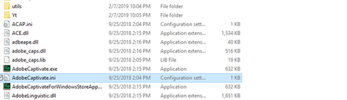

# Learning ManagerのEUドメインにパブリッシュできない {#unable-to-publish-to-learning-manager-eu-domain}

## 問題

Adobe CaptivateからAdobeのLearning Manager EUドメインに公開できない。

## エラー

アカウントがありません

## 説明

作成者がAdobe CaptivateからAdobeのLearning Managerにコースを公開しようとしても、 ただし、「アカウントが見つかりません」というエラーメッセージが表示されるため、この操作を行うことはできません。

## 原因

この問題は、Adobe CaptivateがデフォルトでLearning Manager AdobeのUSドメインにコンテンツを公開するように設定されているために発生します。

## 解決策：

注意事項：

* Adobe Captivateアプリケーションを開いている場合は、閉じます。
* 次の手順を実行するには、コンピューターの管理者アクセス権が必要です。 管理者アクセス権がない場合は、ITチームに問い合わせてください。

次の手順を実行します。

1. Adobe Captivateのインストールディレクトリに移動します。

   例えば、  `kbd C:\\Program Files\\Adobe\\Adobe Captivate 2019 x64` (2019はCaptivate版です。 別のバージョンのAdobe Captivateを使用している場合は、この番号が異なります)。

1. 設定ファイルのコピー **AdobeCaptivate.ini** をデスクトップに追加します。

   
   *設定ファイルの表示*

1. デスクトップからメモ帳にコピーしたファイルを開きます。
1. LearningManagerBaseUrlの値を変更= `https://learningmanager.adobe.com/inappstarter` をLearningManagerBaseUrlに= `https://learningmanagereu.adobe.com/inappstarter`

   
   *PrimeBaseURLを表示*

1. 変更したメモ帳を保存します。
1. 編集した保存ファイルをコピーして、ファイルパスに貼り付け直します。 元のファイルを置き換える場所  `kbd C:\\Program Files\\Adobe\\Adobe Captivate 2019 x64`
1. 完了したら、Adobe Captivateを起動して、AdobeのLearning Managerにパブリッシュします。
