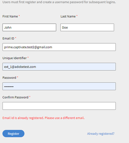

# 社外ユーザーとして登録できない

## 問題

社外学習者をプロファイルに登録できない。

## エラー

電子メール ID は既に登録されています。 別の電子メールアドレスを使用してください。

*既に登録されている電子メールのエラーメッセージ*

## 説明

社外プロファイルに登録しようとしても、 上記のエラーメッセージが表示され、登録できないというシナリオがあります。

## 原因

この問題は、以下のようなシナリオで発生します。

* そのユーザーが別の社外プロファイルに登録済みである
* そのユーザーが既に社内学習者になっている
* そのユーザーが削除されている

## 解決策:

**シナリオ1:** そのユーザーが別の社外プロファイルに登録済みである

1. 管理者としてログインします。
1. 未満 **管理**、をクリック **[!UICONTROL ユーザー]** > **[!UICONTROL 外部]**.
1. 「使用されている席」をクリックして、そのユーザーが登録されているプロファイルを開きます。

   

   *ユーザーのプロファイルを開く*

1. ユーザーを選択し、 **[!UICONTROL アクション]** > **[!UICONTROL プロファイルの変更]**.

   

   *ユーザーのプロファイルの変更*

   以下のように、新しいプロファイルを選択するためのウィンドウが開きます。

   

   *ユーザープロファイルの選択*

1. 選択したら、**[!UICONTROL 「変更」]**&#x200B;をクリックします。

**シナリオ2:** ユーザーが内部学習者として存在している。

1. 管理者としてログインします。
1. 未満 **管理**、をクリック **[!UICONTROL ユーザー]** > **[!UICONTROL 内部]**.
1. クリックして学習プロファイルを開き、編集アイコンをクリックします。

   

   *社内学習者プロファイルを開く*

1. 学習者の電子メールアドレスを変更するか、 *_old* を既存の電子メールアドレスに送信します。 これにより、電子メールアドレスが解放されます。

   例えば、学習者の電子メールアドレスが *<abc@adobe.com>,* ～に変更する *<abc_old@adobe.com>*

1. クリック **保存** 変更を保持します。

**シナリオ 3：**&#x200B;そのユーザーが削除されている

1. 管理者としてログインします。
1. 未満 **管理**、をクリック **[!UICONTROL ユーザー]** > **[!UICONTROL ユーザークリーンアップ]**.
1. 学習者を選択し、編集アイコンをクリックします。

   

   *ユーザーのメールアドレスを編集*

1. 学習者の電子メールアドレスを変更するか、 *_old* を既存の電子メールアドレスに送信します。 これにより、電子メールアドレスが解放されます。

   例えば、学習者の電子メールアドレスが **<abc@adobe.com>**、変更後の **<abc_old@adobe.com>**.
