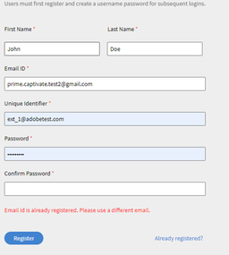
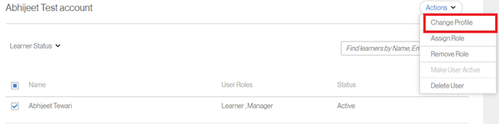
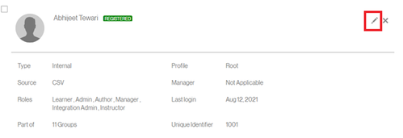

# 社外ユーザーとして登録できない

## 問題

社外学習者をプロファイルに登録できない。

## エラー

電子メール ID は既に登録されています。 別の電子メールアドレスを使用してください。

*既に登録されている電子メールのエラーメッセージ*

## 説明

社外プロファイルに登録しようとしても、 上記のエラーメッセージが表示され、登録できないというシナリオがあります。

## 原因

この問題は、以下のようなシナリオで発生します。

* そのユーザーが別の社外プロファイルに登録済みである
* そのユーザーが既に社内学習者になっている
* そのユーザーが削除されている

## 解決策:

**シナリオ 1：**&#x200B;そのユーザーが別の社外プロファイルに登録済みである

1. 管理者としてログインします。
1. **管理**&#x200B;で、**[!UICONTROL ユーザー]** > **[!UICONTROL 外部]**&#x200B;をクリックします。
1. 「使用されている席」をクリックして、そのユーザーが登録されているプロファイルを開きます。

   

   *ユーザーのプロファイルを開く*

1. ユーザーを選択し、**[!UICONTROL アクション]** > **[!UICONTROL プロファイルの変更]**&#x200B;をクリックします。

   

   *ユーザーのプロファイルの変更*

   以下のように、新しいプロファイルを選択するためのウィンドウが開きます。

   

   *ユーザープロファイルの選択*

1. 選択したら、**[!UICONTROL 「変更」]**&#x200B;をクリックします。

**シナリオ 2：**&#x200B;そのユーザーが社内学習者として存在している

1. 管理者としてログインします。
1. **管理**&#x200B;で、**[!UICONTROL ユーザー]** > **[!UICONTROL 内部]**&#x200B;をクリックします。
1. クリックして学習プロファイルを開き、編集アイコンをクリックします。

   

   *社内の学習者プロファイルを開く*

1. 学習者の電子メールアドレスを変更するか、既存の電子メールアドレスに *_old* を追加します。 これにより、そのユーザーの電子メールアドレスが解放されます。

   例えば、学習者の電子メールアドレスが&#x200B;*<abc@adobe.com>の場合、*&#x200B;を&#x200B;*<abc_old@adobe.com>*&#x200B;に変更します

1. 「**保存**」をクリックして変更を保持します。

**シナリオ 3：**&#x200B;そのユーザーが削除されている

1. 管理者としてログインします。
1. **管理**&#x200B;で、**[!UICONTROL ユーザー]** > **[!UICONTROL ユーザークリーンアップ]**&#x200B;をクリックします。
1. 学習者を選択し、編集アイコンをクリックします。

   

   *ユーザーの電子メールアドレスを編集する*

1. 学習者の電子メールアドレスを変更するか、既存の電子メールアドレスに *_old* を追加します。 これにより、そのユーザーの電子メールアドレスが解放されます。

   例えば、学習者の電子メールアドレスが&#x200B;**<abc@adobe.com>**&#x200B;の場合は、**<abc_old@adobe.com>**&#x200B;に変更します。
