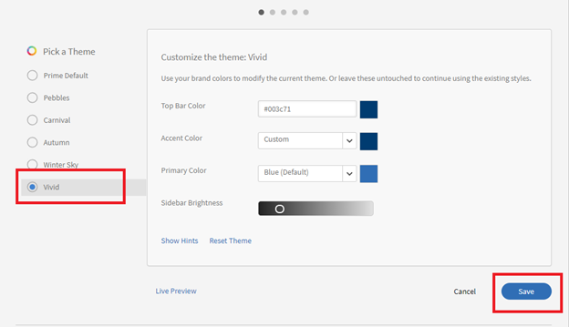

# Learning Manager で選択ボタンが表示されない

## 問題

ラジオボタンが表示されないため、管理者は次の操作を実行できません（すべてを網羅しているわけではありません）。

* 役割の割り当てや削除
* ウェルカムメールの送信
* ユーザーの削除

## 原因

この問題は、アカウントのテーマが正しくないために発生します。

*ラジオボタンが表示されない*

## 解決策

テーマを再読み込みして、ラジオボタンの外観を修正します。 次の手順を実行します。

1. 管理者として&#x200B;**[!UICONTROL 「ブランディング」]**&#x200B;を選択します。
1. を **テーマ** セクションをクリック **[!UICONTROL 編集].**
1. 任意のテーマを選択し、変更を保存します。

   

   *任意のテーマを選択*

1. 前のテーマに戻し、変更を保存します。
1. Adobe Learning Manager からログアウトし、再度サインインします。
