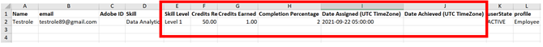

# コースを完了した後、スキルを達成できない

## 問題

学習者がコースを完了しても、スキルを取得できません。 コースに割り当てられたスキルが、**「進行中」**&#x200B;のままとなります。

## 原因

この問題は、スキルの取得に求められる&#x200B;**必要単位**&#x200B;が、コース終了後に学習者が獲得する&#x200B;**取得単位**&#x200B;を上回る場合に発生します。

## 解決策

現在の&#x200B;**スキルの単位**&#x200B;と&#x200B;**ポイント**&#x200B;で、スキルを達成するために必要な情報を確認してください。 以下の手順を実行します。

1. 学習者には、**学習者トランスクリプト**&#x200B;レポートが生成されます。
1. 学習者のトランスクリプトを生成する際に、**[!UICONTROL 「詳細オプション」]**&#x200B;をクリックし、「**[!UICONTROL スキルデータとサマリーシートを含める]**」オプションをオンにします。

   

   *[スキルデータとサマリーシートを含める]オプションを選択してください*

1. ダウンロード済みの学習者トランスクリプトレポートを開きます。
1. **[!UICONTROL 「スキルのトランスクリプト」]**&#x200B;シートに進みます。 このシートで、学習者の&#x200B;**[!UICONTROL 必要単位]**&#x200B;と&#x200B;**[!UICONTROL 取得単位]**&#x200B;を確認できます。

   例えば次の例では、コースのスキル取得に必要な単位は 50 です。 ただし、学習者が取得済みの単位は 1 つのみです。

   

   *必要なクレジットを表示*

1. 特定のスキルに割り当てられた単位を確認するには、管理者としてログインして、下記のように&#x200B;**「スキル」**&#x200B;タブに進みます。

   

   *[スキル]タブの起動*

1. コースに割り当てられた単位数を確認するには、作成者としてログインして、コースを開きます。 次に示すように、**[!UICONTROL 設定]**/**コーススキル**&#x200B;をクリックします。

   

   *コーススキルの表示*
