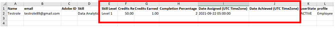

# コースを完了した後、スキルを達成できない

## 問題

学習者がコースを完了しても、スキルを取得できません。 コースに割り当てられたスキルは以下のままです。 **処理中** 学習者の場合。

## 原因

この問題が発生するのは、 **必要な単位** このスキルを達成するには、 **取得単位** をクリックします。

## 解決策

現在の画像を確認 **スキルクレジット** および **ポイント** スキルを達成するために必要な情報。 次の手順に従います。

1. 学習者に対して、 **学習者トランスクリプト** 報告します。
1. 学習者のトランスクリプトの生成中に、「 **[!UICONTROL 詳細オプション]**&#x200B;を選択し、 **[!UICONTROL スキルデータとサマリーシートを含める]**.

   

   *「スキルデータとサマリーシートを含める」オプションを選択します*

1. ダウンロードした学習者トランスクリプトレポートを開きます。
1. 次に移動： **[!UICONTROL スキルのトランスクリプト]** シート： ここで、 **[!UICONTROL 必要な単位]** および **[!UICONTROL 取得単位]** をクリックします。

   例えば次の例では、コースのスキル取得に必要な単位は50です。 ただし、学習者が取得済みの単位は1つのみです。

   

   *必要なクレジットを表示*

1. 特定のスキルに割り当てられた単位を確認するには、管理者としてログインして、に移動します。 **スキル** 次に示すように、tabキーを押します。

   

   *「スキル」タブの起動*

1. コースに割り当てられた単位数を確認するには、作成者としてログインして、コースを開きます。 クリック **[!UICONTROL 設定]** > **コースのスキル** 次に示すように、

   

   *コーススキルを表示*
