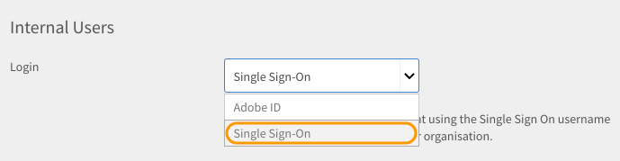

# SSO認証を使用してLearning Managerにログイン

このドキュメントでは、Learning ManagerアカウントにログインするためのSSO認証を設定する方法について説明します。

SSO認証を構成するには、次の手順を実行します。

1. 開く **[!UICONTROL 設定]** > **[!UICONTROL ログインメソッド。]**

   

1. を選択 **[!UICONTROL 社内ユーザー]** または **[!UICONTROL 社外ユーザー]** 要件に応じて。
1. の横にあるドロップダウンをクリックします。  **[!UICONTROL login]** optionキーを押しながら **[!UICONTROL シングルサインオン]**.

   

1. シングルサインオン(SSO)の設定を調整するには、  **[!UICONTROL 変更。]**

   

1. Enter  **[!UICONTROL IDPによる認証URL]** サービスビューロから指定された場合は、 **[!UICONTROL IDPメタデータXMLファイル。]**

   

   Learning Managerで設定するSSOは、SAML 2.0に対応している必要があります。

   これで、SSO認証を使用してLearning Managerにログインできるようになりました。

