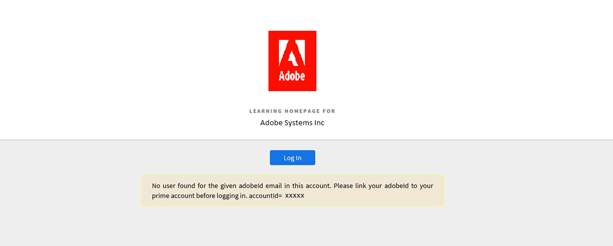

# Learning Manager にログインできません

## 問題

Adobe Learning Manager にログインしようとすると、次のエラーが表示されます。

*このアカウントに、指定されたアドビの電子メールに対するユーザーが見つかりませんでした。 Learning Manager アカウントにアドビ ID をリンクしてからログインしてください。*

<!---->

## 原因

ブラウザーのキャッシュと Cookie により、Adobe Learning Manager のプラットフォームにアクセスできない可能性があります。

## 解決策

## 閲覧履歴／キャッシュの削除

次のリンクは、キャッシュを削除するためのブラウザー別のガイドです。

* [Google Chrome](https://support.google.com/accounts/answer/32050?co=GENIE.Platform%3DDesktop&hl=ja)
* [Internet Explorer](https://kb.wisc.edu/page.php?id=1514)
* [Microsoft Edge](https://www.bitdefender.com/support/how-to-clear-the-cache-and-cookies%C2%A0in-microsoft-edge-1914.html)
* [Firefox](https://kb.iu.edu/d/ahic)
* [Safari](https://oit.colorado.edu/tutorial/clear-web-browser-cache-safari-6)

## シークレットモードの使用

ブラウザーでシークレットモードを使用し、Adobe Learning Manager にサインインします。 [説明](https://support.google.com/chrome/answer/95464?co=GENIE.Platform%3DDesktop&hl=ja&oco=0)を参照してください。

## 管理者に問い合わせる

それでもログインできない場合は、アカウントの管理者にお問い合わせください。 管理者は、ユーザーがアカウントに登録された学習者かどうかを確認できます。

アカウントに登録されているのにログインできない場合、管理者は、ログインしようとしている Adobe ID が間違っていないかを確認する必要があります。

Adobe IDが、アカウントのAdobe Learning Manager IDと異なる場合があります。

## 次のステップ

上記の手順を実行して、それでもログインできない場合、管理者はログイン用の HAR ログを収集することができます。 詳しくは、[HAR ファイルを生成する](/help/migrated/kb/generate-har-file.md)を参照してください。

問題をさらにデバッグできるよう、Adobe Learning Manager サポートチームまでご連絡ください。
