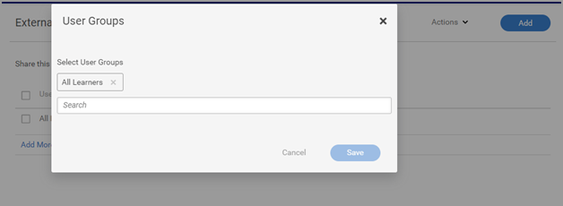

# Learning Manager でコースを検索できない

## 問題

学習者が Learning Manager でコースを検索できません。

## シナリオ1：登録が、上位の学習目標で行われています

### 要約

学習者があるコースを検索しても、そのコースが表示されない場合があります。 しかし、学習者が学習プログラム／資格認定に登録していると、学習者は学習目標内でコースを表示できます。

### この問題が発生する理由

Learning Managerでは、学習者が学習プログラムや資格認定から登録されている場合、学習プログラムまたは資格認定からそのコースを登録します。

そのため、学習者は&#x200B;**学習状況**&#x200B;で単体コースを検索することができません。

ただし、学習者は学習プログラム/資格認定内のコースを表示できません。

## シナリオ2：学習者が、コースを含むカタログにアクセスできません。

### 要約

学習者が、カタログや学習ダッシュボードでコースを検索できません。

### この問題が発生する理由

この問題は、次の場合に発生します：

* コースを含むカタログに学習者が含まれていない。**または**
* 学習者がアクセスしているカタログにコースが含まれていない

### 解決策

1. 管理者してログインします。

1. クリック **[!UICONTROL カタログ]** コースを含むカタログを参照します。
1. クリック **[!UICONTROL 社内で共有]** または **[!UICONTROL 内容]** （上記のシナリオによって異なります）。

   

   *カタログを内部で共有する*

1. 次のシナリオを確認します：

   * 学習者がカタログに含まれていない

     カタログを共有するには、 **[!UICONTROL 追加]**、ユーザーが所属するユーザーグループを追加します。 **[!UICONTROL 「保存」]**&#x200B;をクリックします。

     

     *ユーザーグループの追加*

   * カタログにコースが含まれていない

     「コンテンツ」セクションで、をクリックします。 **[!UICONTROL コンテンツを追加]** カタログに追加する必要があるコースを選択します。

     

     *コースにコンテンツを追加する*
