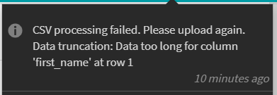

# CSVをアップロードできない

## エラー：データの切り詰め：列に対してデータが長すぎます

AdobeのLearning ManagerでCSVをアップロードしようとすると、次のエラーメッセージが表示されます。

*CSV処理に失敗したことを通知するエラーメッセージ*

## 原因

指定した列に含まれるデータが、その列に定義されている文字制限を超えると、エラーが発生します。

## 解決策

* CSVを開きます。
* エラーに記載されている列のデータを確認します。
* 大きい値（例えば、60文字を超える値）がある場合は、値を変更してデータを修正します。

## エラー：CSVの最初の列に特殊文字が表示されています

列のマッピング時に最初の列に特殊文字が表示されるため、CSVをアップロードできません。

*「名前」列の特殊文字*

## 原因

この問題は、CSVがExcelにUTF-8形式で保存される場合に発生します。 CSVをUTF-8形式でExcelに保存すると、ファイルはUTF-BOM形式で保存されます。 これは、メモ帳++を使用するか、CSVをLearning Managerにアップロードして列をマッピングする際の最初の列に特殊文字が表示されることで確認できます。

## 解決策

* **A:** Excelで保存：

   1. ExcelでCSVを開きます。
   1. ファイルを通常のCSVとして保存します。

* **B:** メモ帳またはNotepad++で保存：

   * メモ帳またはNotepad++でCSVを開きます。
   * UTF-8形式でファイルを保存します。

## エラー：ユーザーの電子メールアドレスはシステムに既に存在します

CSV処理が失敗したため、CSVをアップロードできません。 次のエラーメッセージが表示されます。

*重複しているユーザーのエラーメッセージ*

## 原因

この問題は、同じ電子メールアドレスまたはUUIDを持つユーザーが既にシステムに存在する場合に発生します。

## 解決策

### シナリオ1

**UUIDが有効になっていないアカウント。**

このシナリオでは、次の2つの理由でエラーが発生します。

1. 追加しようとしているユーザーが、社外プロファイルのマネージャーです。 この問題を解決するには、ユーザーが属する社外プロファイルを開き、ユーザーを選択して、 **[!UICONTROL アクション]** > **[!UICONTROL 役割の割り当て]** > **[!UICONTROL マネージャー]**&#x200B;プロファイルのマネージャーを変更します。
1. 追加しようとしているユーザーは消去されています。 このシナリオでは、消去処理が完了するまで、同じ電子メールアドレスを持つユーザーを追加することはできません。 回避策として**、2番目の電子メールアドレスを使用してユーザーを追加し、プラットフォームにアクセスできるように**ます。 消去処理が完了したら、ユーザーを編集し、電子メールアドレスを正しい電子メールアドレスに変更します。

### シナリオ2

**UUIDが有効なアカウント**

UUIDが有効なアカウントの場合、ユーザーに割り当てられたUUIDがアカウントの別のユーザーに既に使用されていたり、ユーザーの電子メールアドレスが異なっていたりすると、この問題が発生する可能性があります。

例えば、メールアドレスがAとBの2人のユーザーがいるとします。  <a@xyz.com> および <b@xyz.com> UUIDは1で、UUIDは2です。

ここで、ユーザーAのUUIDを3、ユーザーBのUUIDを2としてCSVをアップロードすると、エラーが表示されます。

>[!TIP]
>
>この問題を解決するには、 **csvとシステム上のユーザーに対して同じ電子メールアドレスとUUIDを使用する必要があります。**

