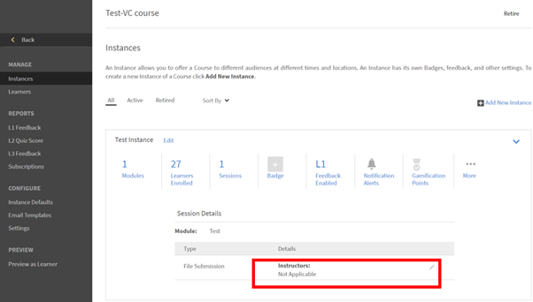

# Adobe Learning Manager で提出されたファイルを表示できない

## 問題

学習者がアップロードしたファイル提出を、インストラクターが表示できません。

## 説明

インストラクターは、学習者が&#x200B;**提出アクティビティモジュール**&#x200B;でアップロードしたファイルを表示できません。

例えば、学習者はコースの&#x200B;**テストインスタンス**&#x200B;という名前のインスタンスに、以下のように登録しました。

*インスタンスの表示*

学習者はコースを開き、アクティビティモジュールにファイルをアップロードします。

インストラクターが提出内容を承認しようとしても、そうすることができません。

*アクティビティモジュールにファイルをアップロードする*

## 原因

学習者が登録されているコースインスタンスに、インストラクターが誰もいない場合、問題が発生します。

## 解決策

コースインスタンスにインストラクターが割り当てられているかどうかを確認するには、以下の手順を実行します。

1. コース設定に移動します。
1. **管理**&#x200B;セクションで、**[!UICONTROL インスタンス].**&#x200B;をクリックします
1. 学習者が登録されているインスタンスで、**[!UICONTROL セッション]**&#x200B;をクリックします。

   

   *インスタンス内のセッションの選択*

   このセッションに割り当てられたインストラクターはいません。

1. 「**[!UICONTROL 編集]**」をクリックします。 ファイル提出を承認するインストラクターを追加します。

   

   *インストラクターを追加*
1. 変更内容を保存します。
