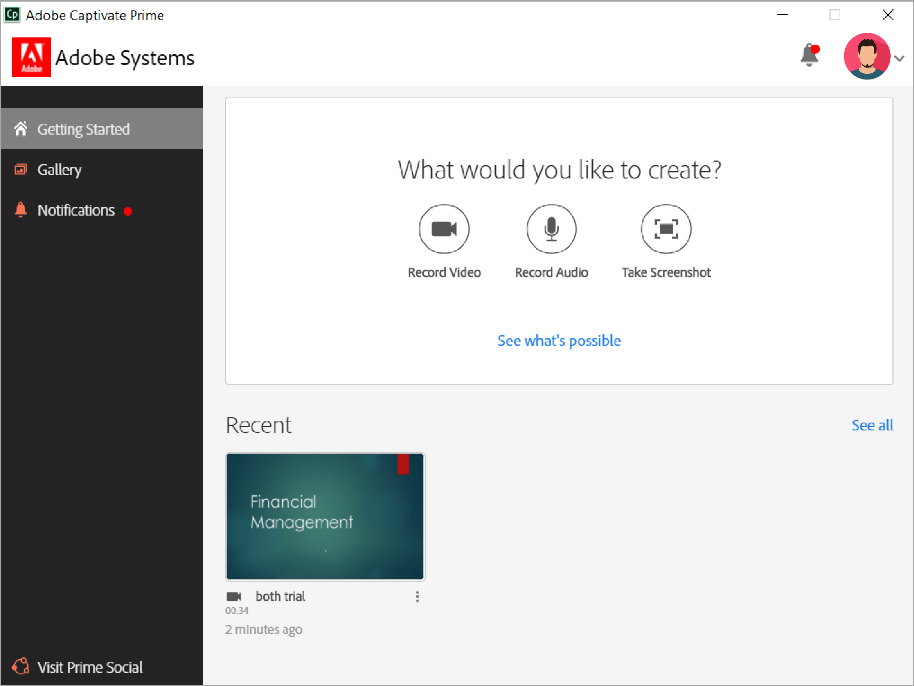
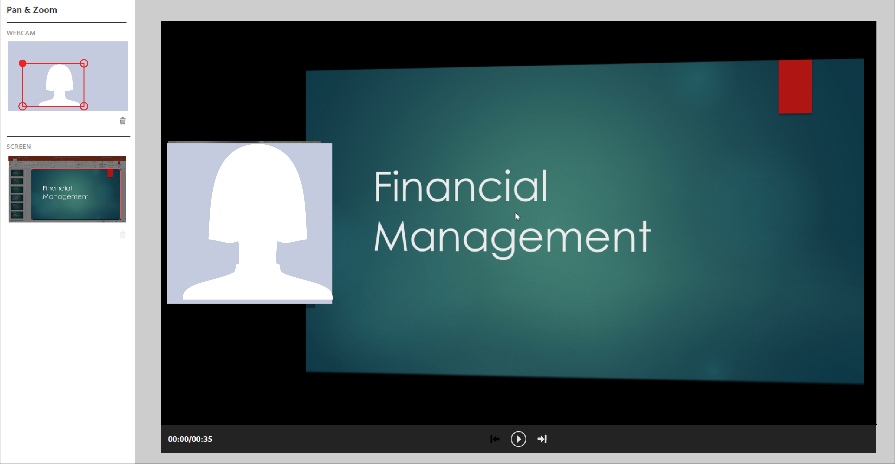
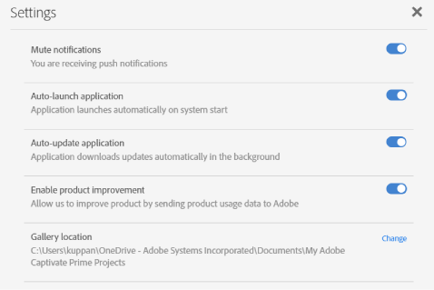

# Adobe学習マネージャーデスクトップアプリケーション

この記事では、Adobe Learning Manager デスクトップアプリケーションを使用して、ソーシャル学習で共有可能なコンテンツを作成および編集する方法について説明します。

Adobe Learning Manager デスクトップアプリケーションは、Learning Manager のソーシャル学習を使用する学習者向けのアプリケーションです。このアプリケーションをデスクトップにインストールすると、学習者は学習コンテンツを作成し、そのコンテンツを Learning Manager の掲示板に投稿できるようになります。これにより、学習者同士でやり取りしながら、気軽にソーシャル学習を進めることができます。また、学習者は Learning Manager の web アプリケーションにログインしていない状態でも、ソーシャル学習に関する通知をデスクトップ上で受信することができます。

ビデオ、音声、スクリーンショットなどの様々なコンテンツを作成し、学習者同士で共有することができます。コンテンツは、ソフトウェアのデモやウォークスルー、プレゼンテーション、ポッドキャスト、共有できる何かの注釈付きスクリーンショットなど、文字通り何でもかまいません。

Learning Manager のソーシャル学習 web ページで新しい投稿をクリックし、ビデオの録画、音声の録音、スクリーンショットのキャプチャまたは Learning Manager ギャラリーの選択を行うと、デスクトップアプリケーションが起動します。ソーシャル学習の詳細については、[ここをクリック](feature-summary/social-learning-web-user.md)してください。

デスクトップアプリケーションがインストールされていない場合は、Adobe Learning Manager デスクトップページからダウンロードすることができます。ダウンロードできない場合は、[ここをクリック](../kb/troubleshooting-issues-with-adobe-learning-manager-desktop-app.md)してください。

デスクトップアプリケーションのインストールが完了したら、Learning Manager 学習者の資格情報を使用してアプリケーションにログインします。ログインすると、以下のようなホームページが表示されます。

>[!NOTE]
>
>自分のアカウントでソーシャル学習機能が無効になっている場合、デスクトップアプリケーションを使用することはできません。

<!---->
<!--*Home page*-->

## ビデオの作成 {#creatingavideo}

デスクトップアプリケーションを使用して、Web と画面を録画することができます。

<!---->
<!--*Record web, screen, or both*-->

ビデオを録画してソーシャル学習 Web プラットフォームに投稿するには、以下の手順を実行します。

1. 必要なハードウェア要件とソストウェア要件が満たされているかどうかを確認します。詳しくは、「[必要システム構成](../system-requirements.md)」を参照してください。
1. ソーシャル学習で録画を開始する場合は、ビデオ録画（web、画面、両方）アイコンを選択します。この操作により、Learning Manager デスクトップアプリケーションが起動します。デスクトップアプリケーションにログインすると、コンテンツを作成して投稿することができます。
1. デスクトップアプリケーションで録画を開始する場合は、Learning Manager 学習者の資格情報を使用してアプリケーションにログインします。
1. ホームページが表示されます。
1. 投稿を作成する場合は、ホームページに表示されている 3 つのオプションのいずれかを選択します。録画ウィンドウを起動する場合は、「ビデオを録画」アイコンをクリックします。
1. 「Web カメラのみ」アイコン、「画面のみ」アイコン、または「両方」アイコンをクリックします。

   **Webカメラ** Webカメラは、音声を含むプロジェクトまたはアプリケーションをデモまたは提示しているナレーターをキャプチャします。 上のオプションからWebカメラアイコンを選択すると、ライブウィンドウが表示されます。

   **画面**&#x200B;モニター画面で実行した操作を記録します。 このアイコンを選択すると、画面がハイライト表示され、画面中央に録画ダイアログが表示されます。

   **両方**&#x200B;は、ナレーターと画面の両方の操作を記録します。 最後のアイコンを選択すると、画面がハイライト表示され、ライブウィンドウも同時に表示されます。

1. 録画に関するオプションを設定します。

   **カメラを使用する場合**：ビデオ録画ウィンドウの下部に表示されているビデオカメラアイコンをクリックします。使用するカメラを選択します。

   **マイクを選択**&#x200B;ビデオまたはオーディオウィンドウの下部にあるマイクアイコンをクリックし、表示されたオプションからユーザーが使用するマイクを選択します。

   >[!NOTE]
   >
   >画面やビデオの録画で音声を入れたくない場合は、音声アイコンをクリックしてドロップダウンリストを表示し、このリストで「**なし**」を選択してください。
   >
   >この状態で画面または自分自身の録画を開始すると、音声が入っていない状態で録画を続けてもかまわないかどうかを確認するポップアップダイアログが表示されます。この画面が表示されたら、「はい」をクリックしてください。

1. 録画ボタンを使用して録画を開始します。3 秒間のカウントダウンの後で、録画が開始されます。
1. 録画を一時停止する場合は「一時停止」ボタンをクリックし、録画を再開する場合は「再開」ボタンをクリックします。録画内容を編集する方法については、「[録画内容の編集](adobe-learning-manager-app-for-desktop.md#Editing)」を参照してください。録画データをパブリッシュする方法については、「[録画データのパブリッシュ](adobe-learning-manager-app-for-desktop.md#Publishing)」を参照してください。

## 音声の録音 {#creatinganaudio}

<!---->
*オーディオの録音*

音声を録音するには、以下の手順を実行します。

1. Learning Manager デスクトップアプリケーションの起動ウィンドウに表示されている音声を録音アイコンをクリックします。
1. マイクのボリュームアイコンをクリックしてボリュームを調整し、マイクのボリュームがオンになっていることを確認します。
1. 録音ボタンをクリックして録音を開始します。
1. 録音が完了したら、一時停止ボタンをクリックして録音を停止します。
1. 再生ボタンをクリックして、録音内容を確認します。
1. 同じファイルに音声を追加で録音する場合は、「**[!UICONTROL 再開]**」をクリックします。目的の録画に達したら、「**[!UICONTROL 次へ]**」をクリックして、ファイルを目的の場所に保存します。 録音データは、デスクトップギャラリー用の Adobe Learning Manager アプリに保存されます。このアプリケーションで、録音内容とスクリーンショットを確認することができます。
1. 録音内容を編集する方法については、「[録音内容の編集](adobe-learning-manager-app-for-desktop.md#Editing)」を参照してください。録音データをパブリッシュする方法については、「[録音データのパブリッシュ](adobe-learning-manager-app-for-desktop.md#Publishing)」を参照してください。

## スクリーンショットの作成 {#creatingascreenshot}

スクリーンショットをキャプチャするには、以下の手順を実行します。

1. Learning Manager デスクトップアプリケーションのホームページで、スクリーンショットアイコンをクリックします。
1. 画面の一部のみをキャプチャする場合は、画面切り取りアイコンをクリックします。画面全体をキャプチャする場合は、全画面キャプチャアイコンをクリックします。

   <!--
   *Capture a screenshot*-->

1. 他の学習者がプレゼンテーションや静的なコンテンツをより適切に理解して保持できるように、コンテンツに注釈を追加します。
1. スクリーンショットを編集するには、[ここをクリック](adobe-learning-manager-app-for-desktop.md#Editing)してください。スクリーンショットを公開するには、[ここをクリック](adobe-learning-manager-app-for-desktop.md#Publishing)してください。

## ビデオ、音声、スクリーンショットの編集 {#editing}

ファイルを保存すると同時に、編集ウィンドウが表示されます。このウィンドウには、これ以降で説明する各種の機能が用意されています。これらの機能を使用して、ビデオ、音声、スクリーンショットを詳細に編集することができます。

## 注釈機能（ビデオ、スクリーンショット） {#annotationsvideorecordingsandscreenshots}

ビデオやスクリーンショットで注釈機能を使用すると、特定の情報をハイライト表示したり、説明用のテキストを追加したりすることができます。

>[!NOTE]
>
>ビデオの場合は、画面上でのみ注釈を付けることができます。

* 選択できる注釈の種類は、**楕円**、**直線**、**矢印**、**ハイライト**、**テキスト**&#x200B;です。

* 注釈のプロパティパネルのカラーパネルから、各注釈のカラーを選択します。
* 注釈の種類が&#x200B;**テキスト**&#x200B;の場合、注釈のプロパティとして、フォント、太字、斜体、見出し、配列、色、背景色を選択する必要があります。

>[!NOTE]
>
>テキストの背景色を表示するには、背景色のオプションを有効にする必要があります。

## トリミング機能（すべてのビデオ、すべての音声） {#trimalltypesofvideoandaudiorecordings}

ビデオや音声内の不要な部分を取り除くには、トリミングツールを使用します。

トリミングするには、**[!UICONTROL トリミング開始]**&#x200B;ボタンをクリックするか、タイムラインのプラスアイコンをクリックして、トリミングを開始します。 トリミングを停止する場合は、プレーヤーの一時停止ボタンをクリックします。トリミングが完了したら、「**[!UICONTROL 確認]**」ボタンをクリックします。

**[!UICONTROL タイミングの変更]**&#x200B;を有効にした後で、**[!UICONTROL 開始時刻]**&#x200B;と&#x200B;**[!UICONTROL 終了時刻]**&#x200B;の入力フィールドに時刻を入力することで、録画をトリミングできます。

*トリミングの開始*

*トリミングの確認*

## パン＆ズーム機能（「両方」アイコンを使用して録画されたすべてのビデオ） {#panampzoomanyvideorecording}

パンとズームの操作は、**両方** （Webカメラと画面）ビデオ録画でのみ実行できます。 Web カメラ全体または画面全体がデフォルトで選択されます。画面の一部のみを表示する場合は、コーナーハンドルを選択してドラッグし、目的の画面領域を選択します。全画面表示するには、ウィンドウをダブルクリックします。

*パンとズーム*

## ブランディング機能（すべてのビデオ） {#brandingalltypesofvideorecordings}

統一されたテーマに合わせて一意のビデオ名を作成する場合は、ブランディングツールを使用します。ブランディング操作の目的は、学習管理システムの外観を見やすく統一し、ビデオを視聴する学習者の意欲を高めることです。

ビデオにブランドやテーマを追加するには、以下の手順を実行します。

1. 編集ウィンドウの左ナビゲーションパネルに表示されているブランディングアイコンをクリックします。
1. 指定されたオプションから&#x200B;**テーマ**&#x200B;を選択するか、ユーザーがシステムから&#x200B;**開始**、**背景、**&#x200B;および&#x200B;**終了**&#x200B;ビデオを追加して、独自のテーマをカスタマイズできます。

   >[!NOTE]
   >
   >追加のテーマをダウンロードする場合は、「**追加のアセットを取得**」ボタンをクリックしてください。

1. ビデオのタイトルテキストを追加し、そのテキストを表示する「**表示位置**」グリッド上で任意の位置を選択します。

   >[!NOTE]
   >
   >タイトルテキストは、ブランディングビデオの一部としてのみ追加することができます。ブランディングビデオにタイトルを追加する前に、テーマを追加する必要があります。

1. 必要に応じて、プレゼンターの名前とタイトルをビデオに追加します。次に、ビデオの再生中に表示されるプレゼンター名とタイトルの「表示位置」再生ヘッドフィールドに、ビデオの再生時間の範囲内で数値を入力します。
1. 必要に応じて、ビデオ画面の右側または左側にブランディングアイコンを追加します。ブランディングアイコンを選択するには、**[!UICONTROL 選択]**/**[!UICONTROL システムから参照]**&#x200B;をクリックします。
1. プレビュー画面の再生ボタンをクリックして、ビデオのプレビューを表示します。

   

   *ブランド*

## 追加のクリップの記録（すべてのビデオ、すべての音声） {#recordingadditionalclipsalltypesofvideoandaudiorecordings}

音声クリップやビデオクリップを記録して、既存のビデオファイルや音声ファイルに追加することができます。

新しいクリップの記録を開始するには、追加クリップ記録アイコンをクリックします。新しい録音が、編集中の録音の再生ヘッドの位置に挿入されます。

## ビデオ、音声、スクリーンショットのパブリッシュ {#publishing}

すべての変更と編集が完了したら、**[!UICONTROL 共有]** >入力をクリックし、投稿> **投稿**&#x200B;に最も関連する&#x200B;**スキルまたは掲示板**&#x200B;を検索または検索します。

<!---->
*Webに公開しています*

## Learning Manager デスクトップギャラリーの参照 {#browsingcaptivateprimedesktopgallery}

すべての録画、音声およびスクリーンショットは、Adobe Learning Manager デスクトップアプリケーションにファイルとして保存されます。これらのファイルを参照するには、ホームページの左側のナビゲーションパネルから&#x200B;**[!UICONTROL ギャラリー]**&#x200B;をクリックします。

>[!NOTE]
>
>投稿の作成時に&#x200B;**Learning Managerギャラリー**&#x200B;アイコンをクリックして、ソーシャル学習からギャラリーを起動することもできます。

ギャラリーウィンドウの検索フィールドでファイル名を入力すると、目的のファイルを検索することができます。

ギャラリーウィンドウで新しい録画データを作成するには、「**新規録画**」ボタンをクリックします。

ギャラリー内のファイルを編集または削除するには、ファイル下部の 3 つの点をクリックし、ポップアップリストで編集オプションまたは削除オプションを選択します。

## 通知 {#notifications}

Learning Manager では、学習者が Learning Manager web アプリケーションにログインしているかどうかに関係なく、通知ウィンドウに通知が表示されます。通知には、ユーザーが作成した投稿や掲示板、ユーザーがフォローしている投稿や掲示板、またはユーザーが参加している投稿や掲示板が表示されます。通知をクリックすると、Learning Manager のソーシャル学習 web に移動します。

通知を非表示にするには、**[!UICONTROL プロファイルメニュー*]* > &#x200B;** [!UICONTROL 設定] > **[!UICONTROL 通知をミュート]**&#x200B;をクリックします。

## Learning Manager デスクトップAdobeの設定 {#settingsinadobecaptivateprimedesktopapplication}

「**設定**」ページでは、以下の設定を変更することができます。

「通知をミュート」、「アプリケーションを自動起動」、「アプリケーションを自動更新」、「製品向上を有効にする」

また、「**変更**」ハイパーリンクをクリックして、ギャラリーの場所を変更することもできます。

*Adobe Learning Managerアプリの設定*
